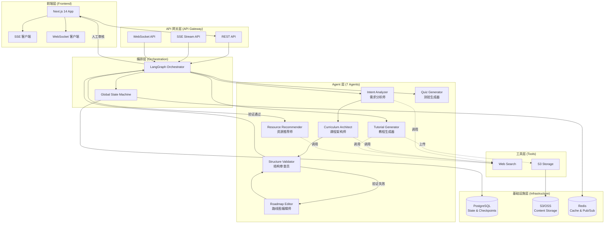

# Roadmap Agent 项目文档

## 项目简介

**Roadmap Agent** 是一个基于多 Agent 协作的个性化学习路线图生成系统，采用 SD-MAS（Software-Defined Multi-Agent System）架构标准。

### 核心价值

- **个性化定制**：基于用户学习目标、时间、动机、基础、背景、偏好，生成专属学习路线图
- **智能协作**：通过 7 个专业 Agent 协作，确保路线图结构合理、内容完整
- **人机协同**：支持 Human-in-the-Loop，用户可审核和修改生成的路线图框架
- **流式体验**：采用 SSE（Server-Sent Events）实时推送生成进度，提升用户体验

### 技术特点

- **多 Agent 架构**：7 个专业 Agent 各司其职，协作完成路线图生成
- **状态持久化**：使用 LangGraph + AsyncPostgresSaver 实现状态持久化和断点续传
- **内容解耦**：路线图结构与详细内容分离，大文本内容存储在 S3
- **类型安全**：前后端共享 Pydantic 模型，通过 OpenAPI 自动生成 TypeScript 类型

---

## 整体架构设计

### 系统架构图



### 数据流

```
用户输入 → API Gateway → Orchestrator → Agent Layer → Tools → Infrastructure
                ↓
            SSE Stream → Frontend (实时更新)
```

### 核心流程

1. **需求分析**：用户提交学习目标 → Intent Analyzer 解析需求
2. **框架设计**：Curriculum Architect 设计三层路线图框架（Stage → Module → Concept）
3. **结构验证**：Structure Validator 验证框架合理性 → 如有问题，Roadmap Editor 修正
4. **人工审核**：用户确认或修改框架（Human-in-the-Loop）
5. **内容生成**：并行生成教程、资源推荐、测验
6. **结果交付**：返回路线图框架和内容引用

---

## 技术栈

### 前端
- **框架**：Next.js 14 (App Router)
- **语言**：TypeScript
- **UI 组件库**：Shadcn/ui + Tailwind CSS
- **状态管理**：Zustand
- **数据获取**：TanStack Query v5
- **流式通信**：Native EventSource (SSE)

### 后端
- **框架**：FastAPI
- **语言**：Python 3.11+
- **Agent 框架**：LangGraph
- **ORM**：SQLAlchemy
- **状态持久化**：AsyncPostgresSaver
- **LLM 调用**：LiteLLM

### 基础设施
- **数据库**：PostgreSQL（状态存储）
- **对象存储**：S3/OSS（内容存储）
- **缓存**：Redis（可选）
- **容器化**：Docker + Docker Compose

---

## 全局开发规范

### 代码规范

#### 语言要求
- **所有文档和注释必须使用简体中文**
- 代码中的变量名、函数名使用英文（遵循各语言规范）
- 用户可见的文本使用简体中文

#### Git 工作流

**分支策略**：
- `main`：生产环境分支，仅接受 PR
- `develop`：开发分支
- `feature/*`：功能分支
- `fix/*`：修复分支
- `docs/*`：文档分支

**提交规范**（遵循 Conventional Commits）：
```
<type>(<scope>): <subject>

<body>

<footer>
```

**Type 类型**：
- `feat`：新功能
- `fix`：修复 Bug
- `docs`：文档更新
- `style`：代码格式调整（不影响功能）
- `refactor`：重构
- `test`：测试相关
- `chore`：构建/工具链相关

**示例**：
```
feat(backend): 添加教程生成流式 API

- 实现 SSE 流式推送教程生成进度
- 支持批量生成和错误重试
- 添加进度追踪和状态更新

Closes #123
```

#### 代码风格

**Python**：
- 遵循 PEP 8
- 使用 Black 格式化（行长度 100）
- 使用 isort 排序导入
- 类型注解必须完整

**TypeScript**：
- 遵循 ESLint + Prettier 配置
- 使用严格模式（`strict: true`）
- 优先使用类型推断，必要时显式声明
- 组件使用 PascalCase，文件使用 kebab-case

### 文档规范

#### 文档结构
- 每个模块/功能必须有对应的文档
- 文档使用 Markdown 格式
- 代码示例必须可运行
- 架构图使用 Mermaid 格式

#### 文档位置
- 项目根目录：全局架构和规范（`AGENT.md`）
- `backend/AGENT.md`：后端技术架构和开发规范
- `frontend-next/AGENT.md`：前端技术架构和开发规范
- `backend/docs/`：后端功能文档
- `frontend-next/docs/`：前端功能文档

### 测试规范

- **单元测试**：覆盖核心业务逻辑（目标覆盖率 > 80%）
- **集成测试**：覆盖 API 端点和 Agent 调用
- **E2E 测试**：覆盖关键用户流程
- 所有 PR 必须通过 CI 测试

### 安全规范

- **密钥管理**：所有敏感信息存储在环境变量中，不得提交到代码库
- **API 认证**：使用 JWT 或 Session 认证
- **输入验证**：所有用户输入必须经过 Pydantic 验证
- **SQL 注入防护**：使用 ORM 参数化查询，禁止拼接 SQL

### 性能规范

- **API 响应时间**：P95 < 500ms（非生成类接口）
- **流式响应**：首字节时间（TTFB）< 200ms
- **数据库查询**：使用索引优化，避免 N+1 查询
- **前端加载**：首屏渲染时间 < 2s

---

## 项目目录结构

```
roadmap-agent/
├── AGENT.md                    # 本文档（全局规范）
├── architecture.md            # 架构设计文档
├── backend/                    # 后端代码
│   ├── AGENT.md               # 后端技术文档
│   ├── app/                   # 应用代码
│   │   ├── agents/            # Agent 实现
│   │   ├── api/               # API 路由
│   │   ├── core/              # 核心编排逻辑
│   │   ├── models/            # 数据模型
│   │   ├── tools/              # 工具实现
│   │   └── ...
│   ├── prompts/               # Prompt 模板
│   ├── tests/                 # 测试代码
│   └── docs/                  # 后端文档
├── frontend-next/             # 前端代码
│   ├── AGENT.md               # 前端技术文档
│   ├── app/                   # Next.js App Router
│   ├── components/            # React 组件
│   ├── lib/                   # 工具库
│   └── types/                 # TypeScript 类型
└── ...
```

---

## 快速开始

### 环境要求

- Python 3.11+
- Node.js 18+
- PostgreSQL 14+
- Docker & Docker Compose（可选）

### 本地开发

**后端**：
```bash
cd backend
poetry install
cp .env.example .env  # 配置环境变量
poetry run alembic upgrade head  # 初始化数据库
poetry run uvicorn app.main:app --reload
```

**前端**：
```bash
cd frontend-next
npm install
npm run generate:types  # 生成类型（需要后端运行）
npm run dev
```

详细开发指南请参考：
- [后端开发指南](backend/AGENT.md)
- [前端开发指南](frontend-next/AGENT.md)

---

## 贡献指南

1. Fork 项目
2. 创建功能分支（`git checkout -b feature/AmazingFeature`）
3. 提交更改（遵循提交规范）
4. 推送到分支（`git push origin feature/AmazingFeature`）
5. 创建 Pull Request

---

## 许可证

[待补充]

---

**文档版本**：v1.0.0  
**最后更新**：2025-01-XX  
**维护者**：Roadmap Agent Team

