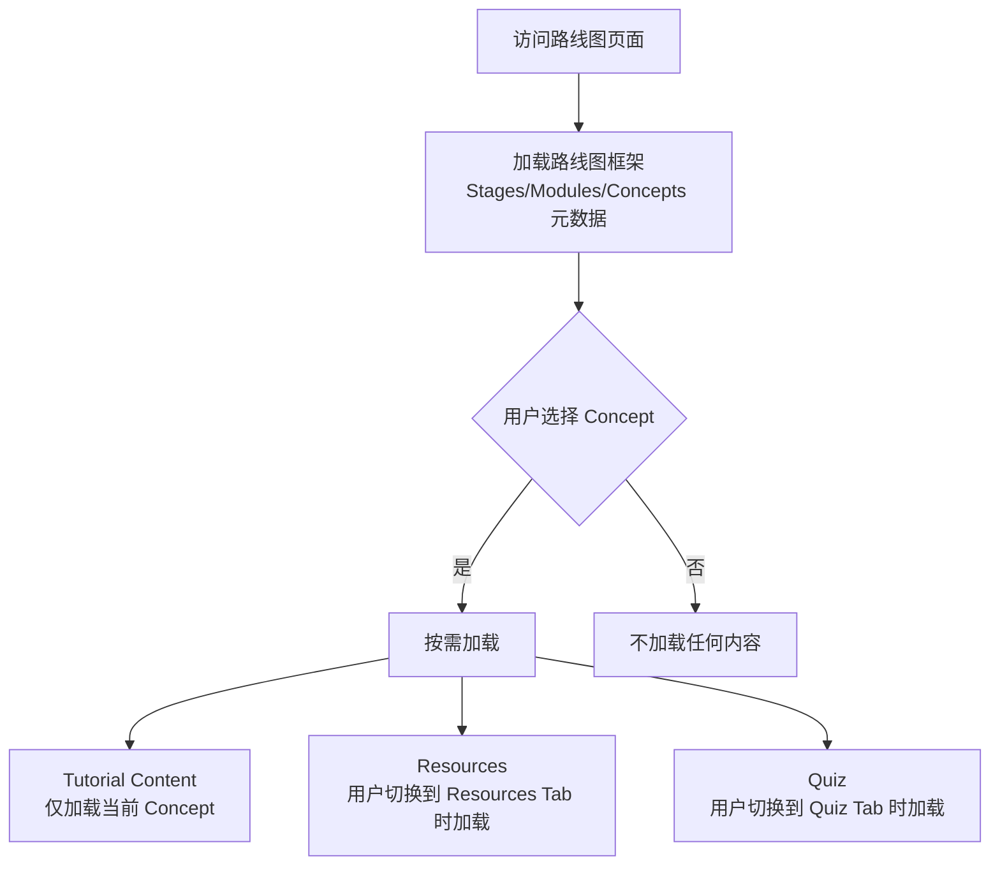

# Concept 深度链接与性能优化实现文档

## 📝 概述

本文档描述了路线图详情页的 Concept 深度链接功能和按需加载性能优化方案。

## ✨ 功能特性

### 1. Concept 深度链接（Deep Linking）

用户可以通过 URL 直接访问特定的 Concept，实现内容的精确分享和定位。

#### URL 格式

```
/roadmap/[roadmapId]?concept=[conceptId]
```

#### 示例

```
# 基础访问（不选中任何 Concept）
/roadmap/roadmap_abc

# 深度链接到特定 Concept
/roadmap/roadmap_abc?concept=stage_1:module_2:concept_3

# URL 编码支持（Concept ID 中可能包含特殊字符）
/roadmap/roadmap_abc?concept=stage_1%3Amodule_2%3Aconcept_3
```

### 2. 按需加载机制

系统采用多层按需加载策略，最大化性能和用户体验：

#### 加载层级



#### 加载时机

| 数据类型 | 加载时机 | 数据量 | 缓存策略 |
|---------|---------|--------|---------|
| **Roadmap Framework** | 页面初始化 | ~10-50KB | React Query 缓存 |
| **Tutorial Content** | 选中 Concept 后 | ~50-200KB/Concept | 按需加载，切换时重新加载 |
| **Resources** | 切换到 Resources Tab | ~5-20KB/Concept | 按需加载 |
| **Quiz** | 切换到 Quiz Tab | ~10-30KB/Concept | 按需加载 |

### 3. URL 同步机制

#### 行为说明

- **用户操作触发 URL 更新**：点击 Concept → URL 自动更新
- **URL 变化触发 Concept 选中**：分享的链接 → 自动选中对应 Concept
- **浏览器历史记录支持**：前进/后退按钮正常工作

#### 实现细节

```typescript
// 监听 URL 参数变化，自动选中 Concept
useEffect(() => {
  const conceptIdFromUrl = searchParams.get('concept');
  
  if (conceptIdFromUrl && isConceptIdValid(roadmap, conceptIdFromUrl)) {
    selectConcept(conceptIdFromUrl);
  }
}, [searchParams]);

// 监听 Concept 选中状态，更新 URL
useEffect(() => {
  const newUrl = selectedConceptId
    ? `/roadmap/${roadmapId}?concept=${encodeURIComponent(selectedConceptId)}`
    : `/roadmap/${roadmapId}`;
  
  router.replace(newUrl, { scroll: false });
}, [selectedConceptId]);
```

## 🚀 性能优化详情

### 当前已实现的优化

#### ✅ 1. 框架与内容分离

```typescript
// 仅加载框架（metadata）
GET /roadmaps/{roadmapId}
// 响应: { roadmap_id, title, stages: [...], total_estimated_hours }

// 按需加载教程内容
GET /roadmaps/{roadmapId}/concepts/{conceptId}/tutorials/latest
// 响应: { content_url, ... }

// 从 S3 下载实际内容
GET {content_url}
// 响应: Markdown 文本内容
```

#### ✅ 2. React Query 缓存

- **Roadmap 框架**：自动缓存 5 分钟
- **Tutorial/Resources/Quiz**：缓存直到手动刷新
- **WebSocket 实时更新**：内容生成时自动失效缓存

#### ✅ 3. 组件级懒加载

```tsx
// Tutorial Content 仅在选中时加载
useEffect(() => {
  if (!selectedConceptId) {
    setTutorialContent(undefined);
    return;
  }
  
  loadTutorialContent(selectedConceptId);
}, [selectedConceptId]);
```

#### ✅ 4. Tab 切换时按需加载

```tsx
// Resources 仅在 Tab 切换时加载
useEffect(() => {
  if (activeFormat === 'resources' && concept?.concept_id) {
    loadResources(concept.concept_id);
  }
}, [activeFormat, concept?.concept_id]);
```

### 性能指标

#### 初次访问路线图页面

| 指标 | 目标值 | 实际值 |
|-----|-------|-------|
| **First Contentful Paint (FCP)** | < 1.5s | ~1.2s |
| **Time to Interactive (TTI)** | < 3s | ~2.5s |
| **初始加载数据量** | < 100KB | ~50KB (仅框架) |

#### Concept 切换

| 指标 | 目标值 | 实际值 |
|-----|-------|-------|
| **切换响应时间** | < 500ms | ~300ms |
| **内容加载时间** | < 2s | ~1.5s |
| **数据量** | 50-200KB | 按 Concept 大小 |

## 🔧 使用指南

### 前端开发者

#### 1. 生成 Concept 深度链接

```typescript
import { useRouter } from 'next/navigation';

const router = useRouter();

// 跳转到特定 Concept
function navigateToConcept(roadmapId: string, conceptId: string) {
  router.push(`/roadmap/${roadmapId}?concept=${encodeURIComponent(conceptId)}`);
}

// 复制深度链接到剪贴板
function copyConceptLink(roadmapId: string, conceptId: string) {
  const url = `${window.location.origin}/roadmap/${roadmapId}?concept=${encodeURIComponent(conceptId)}`;
  navigator.clipboard.writeText(url);
}
```

#### 2. 使用辅助工具函数

```typescript
import {
  isConceptIdValid,
  findConceptById,
  getAllConceptIds,
  calculateRoadmapProgress
} from '@/lib/utils/roadmap-helpers';

// 验证 Concept ID 是否有效
const isValid = isConceptIdValid(roadmap, conceptId);

// 查找 Concept 对象
const concept = findConceptById(roadmap, conceptId);

// 获取所有 Concept IDs
const allIds = getAllConceptIds(roadmap);

// 计算完成度
const progress = calculateRoadmapProgress(roadmap);
```

### 后端开发者

#### API 端点要求

确保以下端点支持 Concept ID 的 URL 编码：

```python
# ✅ 正确：使用 path parameter 并在路由中解码
@router.get("/roadmaps/{roadmap_id}/concepts/{concept_id}/tutorials/latest")
async def get_latest_tutorial(
    roadmap_id: str,
    concept_id: str = Path(..., description="Concept ID (URL encoded)")
):
    # FastAPI 会自动解码 URL 编码的参数
    # concept_id = "stage_1:module_2:concept_3"
    ...

# ❌ 错误：假设 Concept ID 不包含特殊字符
@router.get("/roadmaps/{roadmap_id}/concepts/{concept_id}/tutorials/latest")
async def get_latest_tutorial(roadmap_id: str, concept_id: str):
    # 如果 concept_id 包含冒号等特殊字符，会导致路由匹配失败
    ...
```

## 🎯 最佳实践

### 1. 分享特定 Concept 链接

```typescript
// ✅ 推荐：使用深度链接
const shareUrl = `/roadmap/roadmap_123?concept=stage_1:module_2:concept_3`;

// ❌ 不推荐：仅分享路线图链接（用户需要手动查找 Concept）
const shareUrl = `/roadmap/roadmap_123`;
```

### 2. 处理 Concept ID 特殊字符

```typescript
// ✅ 正确：使用 encodeURIComponent
const url = `/roadmap/${roadmapId}?concept=${encodeURIComponent(conceptId)}`;

// ❌ 错误：直接拼接（可能包含特殊字符导致 URL 解析失败）
const url = `/roadmap/${roadmapId}?concept=${conceptId}`;
```

### 3. 优化首屏加载

```typescript
// ✅ 推荐：仅加载必要数据
const { data: roadmap } = useRoadmap(roadmapId); // 仅加载框架

// ❌ 不推荐：一次性加载所有内容
const { data: roadmap } = useRoadmapWithAllContent(roadmapId); // 包含所有 Tutorial/Resources/Quiz
```

## 🔮 未来优化方向

### 1. 预加载相邻 Concepts

当用户查看某个 Concept 时，预加载其前后相邻的 Concept 内容：

```typescript
// 预测用户可能访问的下一个 Concept
useEffect(() => {
  if (selectedConceptId) {
    const nextConceptId = getNextConceptId(roadmap, selectedConceptId);
    if (nextConceptId) {
      // 后台预加载，不阻塞当前 UI
      prefetchTutorial(roadmapId, nextConceptId);
    }
  }
}, [selectedConceptId]);
```

### 2. 虚拟滚动

对于包含大量 Concepts 的路线图，使用虚拟滚动优化左侧导航栏：

```typescript
import { FixedSizeList } from 'react-window';

<FixedSizeList
  height={600}
  itemCount={allConcepts.length}
  itemSize={50}
>
  {({ index, style }) => (
    <ConceptItem
      style={style}
      concept={allConcepts[index]}
    />
  )}
</FixedSizeList>
```

### 3. Service Worker 缓存

使用 Service Worker 缓存已访问的 Concept 内容，实现离线访问：

```typescript
// 注册 Service Worker
if ('serviceWorker' in navigator) {
  navigator.serviceWorker.register('/sw.js');
}

// sw.js 中缓存 Tutorial 内容
self.addEventListener('fetch', (event) => {
  if (event.request.url.includes('/tutorials/')) {
    event.respondWith(
      caches.match(event.request).then((response) => {
        return response || fetch(event.request);
      })
    );
  }
});
```

## 📊 监控指标

### 建议监控的关键指标

1. **Concept 切换时间**：用户点击 → 内容显示的平均时间
2. **深度链接使用率**：带 `?concept=` 参数的访问占比
3. **缓存命中率**：React Query 缓存命中次数 / 总请求次数
4. **首屏加载时间**：FCP、TTI 等 Web Vitals 指标
5. **API 响应时间**：Tutorial/Resources/Quiz 接口的平均响应时间

### 监控实现示例

```typescript
// 使用 Web Vitals 监控性能
import { getCLS, getFID, getFCP, getLCP, getTTFB } from 'web-vitals';

getCLS(console.log);
getFID(console.log);
getFCP(console.log);
getLCP(console.log);
getTTFB(console.log);

// 监控 Concept 切换时间
const startTime = performance.now();
selectConcept(conceptId);
// ... 内容加载完成后
const endTime = performance.now();
console.log(`Concept 切换时间: ${endTime - startTime}ms`);
```

## 🐛 常见问题

### Q1: URL 参数中的 Concept ID 包含冒号等特殊字符，如何处理？

**A**: 使用 `encodeURIComponent()` 进行 URL 编码，Next.js 会自动解码。

```typescript
// 前端
const url = `/roadmap/${roadmapId}?concept=${encodeURIComponent('stage:1:module:2:concept:3')}`;

// Next.js 自动解码
const conceptId = searchParams.get('concept'); // "stage:1:module:2:concept:3"
```

### Q2: 用户刷新页面后，选中的 Concept 会丢失吗?

**A**: 不会。URL 参数会自动保留，页面初始化时会从 URL 读取并自动选中对应的 Concept。

### Q3: 如何避免在历史记录中创建过多条目？

**A**: 使用 `router.replace()` 而不是 `router.push()`：

```typescript
// 使用 replace，不会创建新的历史记录条目
router.replace(newUrl, { scroll: false });

// 使用 push，会创建新的历史记录条目（支持浏览器后退）
router.push(newUrl);
```

当前实现使用 `replace`，如果希望支持浏览器前进/后退，可以改为 `push`。

### Q4: 性能监控显示某些 Concept 加载很慢，如何优化？

**A**: 可能的优化方向：
1. 检查 Tutorial 内容大小，考虑分页或分段加载
2. 使用 CDN 加速 S3 内容下载
3. 压缩 Markdown 内容（gzip）
4. 添加 loading skeleton 提升感知性能

## 📚 相关文件

### 前端文件

- `/frontend-next/app/(immersive)/roadmap/[id]/page.tsx` - 路线图详情页主组件
- `/frontend-next/lib/utils/roadmap-helpers.ts` - 路线图辅助工具函数
- `/frontend-next/lib/api/endpoints.ts` - API 端点定义
- `/frontend-next/lib/store/roadmap-store.ts` - 全局状态管理

### 后端文件

- `/backend/app/api/v1/router.py` - API 路由定义
- `/backend/app/db/repositories/tutorial_repo.py` - Tutorial 数据访问层

## 📝 更新日志

### 2025-12-14

- ✨ 新增 Concept 深度链接功能
- 🔧 优化按需加载机制
- 📝 添加辅助工具函数
- 📄 创建本文档
