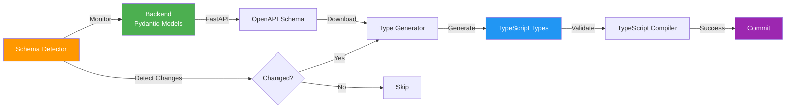

# Frontend-Backend Schema Sync

> 🔄 Automatic schema synchronization between FastAPI backend and Next.js frontend

---

## Overview

This project implements an **automated schema synchronization system** that keeps frontend TypeScript types in sync with backend Pydantic models through OpenAPI schema generation.



---

## Quick Start

### Prerequisites

- Backend server running on `http://localhost:8000`
- Node.js 20+ installed
- Make (optional, for convenience commands)

### Basic Commands

```bash
# Method 1: Using Make (Recommended)
make sync           # Full sync
make check-sync     # Check status only
make sync-force     # Force regenerate

# Method 2: Using npm
cd frontend-next
npm run generate:types     # Generate types
npm run check:schema-sync  # Check sync status

# Method 3: Direct script
./scripts/sync-frontend-backend.sh
```

---

## Features

### ✅ Automated Type Generation

- Generates TypeScript types from OpenAPI schema
- Creates type-safe API client code
- Supports all Pydantic models and FastAPI routes

### ✅ Change Detection

- SHA256 hash-based change detection
- Detailed diff reporting (added/removed endpoints and models)
- Smart caching to avoid unnecessary regeneration

### ✅ CI/CD Integration

- GitHub Actions workflows for automatic validation
- Pre-commit hooks to prevent out-of-sync commits
- Breaking change detection

### ✅ Developer Experience

- Clear error messages and troubleshooting guides
- Fallback to placeholder types when backend is unavailable
- Generation statistics and reports

---

## Architecture

### Components

| Component | Purpose | Technology |
|-----------|---------|------------|
| **Schema Generator** | Expose OpenAPI schema | FastAPI |
| **Type Generator** | Convert schema to TypeScript | openapi-typescript-codegen |
| **Change Detector** | Detect schema changes | Shell + SHA256 |
| **Validator** | Verify generated types | TypeScript Compiler |
| **CI Pipeline** | Automate validation | GitHub Actions |

### File Structure

```
roadmap-agent/
├── scripts/
│   └── sync-frontend-backend.sh          # Main sync script
│
├── frontend-next/
│   ├── scripts/
│   │   ├── generate-types.ts             # Enhanced type generator
│   │   └── check-schema-sync.ts          # Sync status checker
│   │
│   ├── types/
│   │   ├── generated/                    # Auto-generated types
│   │   │   ├── models/                   # Pydantic → TypeScript
│   │   │   ├── services/                 # API clients
│   │   │   └── .generation-stats.json    # Statistics
│   │   └── custom/                       # Manual types
│   │
│   └── .openapi-cache.json               # Schema cache
│
├── .github/workflows/
│   ├── frontend-backend-sync.yml         # Auto-sync workflow
│   └── frontend-backend-sync-check.yml   # PR validation
│
└── .husky/
    └── pre-commit                        # Pre-commit validation
```

---

## Workflows

### Workflow 1: Backend Developer Modifies Schema

```bash
# 1. Modify Pydantic model
vim backend/app/schemas/roadmap.py

# 2. Sync frontend types
make sync

# 3. Commit (pre-commit hook validates automatically)
git add .
git commit -m "feat: add featured roadmap endpoint"
```

### Workflow 2: Frontend Developer Pulls Latest Code

```bash
# 1. Pull latest changes
git pull origin develop

# 2. Check sync status
make check-sync

# 3. Sync if needed
make sync

# 4. Start development
npm run dev
```

### Workflow 3: CI/CD Automation

**On Pull Request:**
1. Detect backend schema changes
2. Validate frontend types are updated
3. Add PR comment if out of sync
4. Check for breaking changes

**On Push to develop:**
1. Auto-generate types
2. Auto-commit to repository
3. Trigger frontend build

---

## Generated Files

### Models (`types/generated/models/`)

```typescript
// Auto-generated from backend/app/schemas/roadmap.py
export interface RoadmapFramework {
  roadmap_id: string;
  title: string;
  stages: Stage[];
  total_estimated_hours: number;
  recommended_completion_weeks: number;
}
```

### Services (`types/generated/services/`)

```typescript
// Auto-generated API client
export class RoadmapService {
  static async getRoadmap(roadmapId: string): Promise<RoadmapFramework> {
    // Type-safe API call
  }
}
```

### Statistics (`.generation-stats.json`)

```json
{
  "timestamp": "2026-01-11T10:30:00.000Z",
  "schemaUrl": "http://localhost:8000/openapi.json",
  "modelsCount": 45,
  "servicesCount": 8,
  "endpointsCount": 67,
  "success": true
}
```

---

## Change Detection

### How It Works

1. **Download** latest OpenAPI schema from backend
2. **Calculate** SHA256 hash of schema content
3. **Compare** with cached hash
4. **Analyze** differences (added/removed endpoints and models)
5. **Generate** detailed change report

### Example Report

```markdown
# Frontend-Backend Sync Report

**Generated**: 2026-01-11 10:30:00

## 🆕 New API Endpoints

- POST /api/v1/roadmaps/featured
- GET /api/v1/admin/monitoring/celery/stats

## 🆕 New Schema Definitions

- FeaturedRoadmapRequest
- FeaturedRoadmapResponse
- CeleryStatsResponse

## ⚠️ Removed API Endpoints

- GET /api/v1/roadmaps/deprecated_endpoint
```

---

## CI/CD Integration

### GitHub Actions

Two workflows are configured:

#### 1. `frontend-backend-sync.yml` (Auto-sync)

**Triggers:**
- Push to `develop` or `main`
- Changes to `backend/app/schemas/**`

**Actions:**
- Start backend server in CI
- Generate frontend types
- Auto-commit changes
- Validate types

#### 2. `frontend-backend-sync-check.yml` (PR Validation)

**Triggers:**
- Pull requests to `develop` or `main`

**Actions:**
- Check if backend changes require type regeneration
- Validate types are committed
- Add PR comment if out of sync
- Fail build on breaking changes

---

## Pre-commit Hook

Located at `.husky/pre-commit`:

```bash
# Automatically runs on git commit
🔍 Running pre-commit checks...

⚠️  Backend schema changes detected:
backend/app/schemas/roadmap.py

🔄 Checking frontend-backend sync status...

✅ Frontend types are in sync with backend!
```

If out of sync:

```bash
❌ Frontend types are out of sync!

Please run:
  make sync

Then stage and commit again.
```

---

## Troubleshooting

### Issue: Backend Not Running

**Error:**
```
❌ 后端服务未运行: http://localhost:8000
```

**Solution:**
```bash
cd backend
uvicorn app.main:app --reload
```

---

### Issue: Types Out of Sync

**Error:**
```
❌ Frontend types are OUT OF SYNC with backend!
```

**Solution:**
```bash
make sync
# or
npm run sync:backend
```

---

### Issue: Type Validation Failed

**Error:**
```
❌ Type validation failed
```

**Solution:**
```bash
# 1. Regenerate types
npm run generate:types

# 2. Check TypeScript errors
npm run type-check

# 3. If persists, check backend schema
curl http://localhost:8000/openapi.json | jq .
```

---

### Issue: Pre-commit Failed

**Error:**
```
❌ Pre-commit checks failed!
```

**Solution:**
```bash
# 1. Sync types
make sync

# 2. Stage generated files
git add frontend-next/types/generated/
git add frontend-next/.openapi-cache.json

# 3. Retry commit
git commit
```

---

## Best Practices

### 1. Version Control

**Commit:**
- ✅ `.openapi-cache.json` - For change detection
- ✅ `types/generated/` - Generated types
- ✅ `.generation-stats.json` - Statistics

**Ignore:**
- ❌ `.sync-report.md` - Temporary report
- ❌ `node_modules/` - Dependencies

### 2. Naming Conventions

**Backend:**
```python
class UserProfileRequest(BaseModel):  # PascalCase
    user_id: str                      # snake_case
```

**Frontend:**
```typescript
interface UserProfileRequest {  // PascalCase (same as backend)
  userId: string;               // camelCase (auto-converted)
}
```

### 3. Schema Design

**✅ Good:**
```python
from pydantic import BaseModel, Field

class UserRequest(BaseModel):
    """User request schema"""
    user_id: str = Field(..., description="User unique ID")
    email: str = Field(..., description="User email")
```

**❌ Bad:**
```python
# Avoid dynamic types
response: dict[str, Any] = {...}

# Prefer explicit schemas
class UserResponse(BaseModel):
    user_id: str
    email: str
```

### 4. Breaking Changes

Before removing endpoints:
1. Mark as deprecated in OpenAPI schema
2. Provide migration guide in PR
3. Update frontend code first
4. Remove after transition period

---

## Performance

| Operation | Time | Description |
|-----------|------|-------------|
| Schema Download | < 100ms | From local backend |
| Type Generation | < 3s | Generate 45+ models, 8 services |
| Type Validation | < 5s | TypeScript compilation |
| **Total Sync** | **< 10s** | Full synchronization |

---

## Documentation

- **Quick Start**: [`SYNC_QUICKSTART.md`](./SYNC_QUICKSTART.md)
- **Full Guide**: [`doc/20260111_前后端Schema自动同步方案.md`](./doc/20260111_前后端Schema自动同步方案.md)
- **Backend API**: http://localhost:8000/docs
- **Voyager Visualization**: http://localhost:8000/voyager

---

## FAQ

**Q: Do I need to run sync every time I modify backend code?**

A: Only when you modify schemas, API endpoints, or models. The pre-commit hook will remind you if needed.

**Q: What if the backend is not running?**

A: The generator will create placeholder types automatically so you can continue frontend development.

**Q: Can I customize the generated types?**

A: Yes, place custom types in `types/custom/`. Generated types are in `types/generated/` (do not modify).

**Q: How do I handle breaking changes?**

A: The CI will detect and report breaking changes. Update frontend code first, then merge backend changes.

**Q: What if I accidentally commit out-of-sync types?**

A: The CI will catch it and add a comment to your PR. Run `make sync` and push again.

---

## Support

- 📚 [Full Documentation](./doc/20260111_前后端Schema自动同步方案.md)
- 🚀 [Quick Start Guide](./SYNC_QUICKSTART.md)
- 🐛 [Issue Tracker](https://github.com/yourorg/roadmap-agent/issues)
- 💬 Contact: Backend & Frontend Team

---

**Version**: 1.0  
**Last Updated**: 2026-01-11  
**Maintained by**: Backend & Frontend Team

