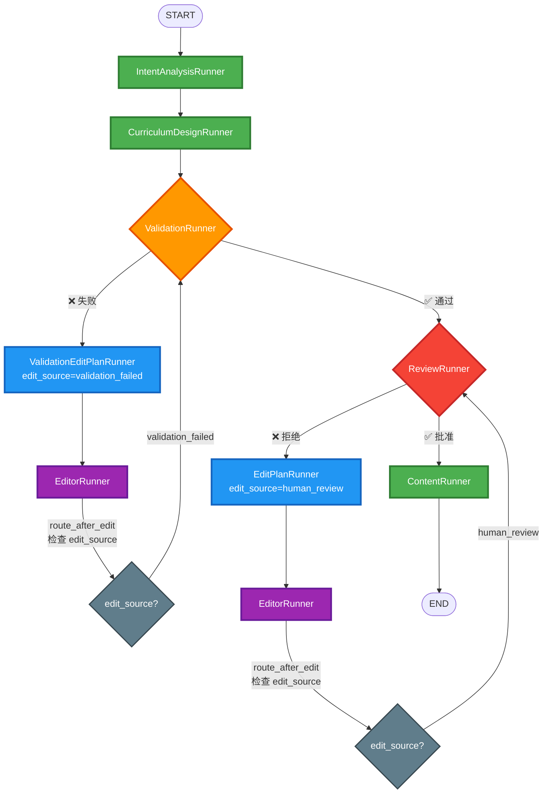

# 工作流路由优化：人工审核触发的编辑直接返回审核

**日期**: 2025-12-22  
**类型**: 工作流路由逻辑优化

---

## 📋 问题背景

### 原有流程的问题
在原有流程中，当用户在 `ReviewRunner` 中拒绝路线图并提供反馈后：

```
ReviewRunner (用户拒绝) 
  → EditPlanRunner (分析反馈) 
  → EditorRunner (执行修改) 
  → ValidationRunner (自动验证) ❌ 不必要的验证
  → ReviewRunner (再次审核)
```

**问题点**：用户已经审核过的路线图，经过基于用户反馈的修改后，**不应该再次进入自动验证流程**，而应该直接返回给用户再次审核。

---

## ✅ 优化方案

### 核心思路
通过在工作流状态中添加 **`edit_source`** 字段，标记编辑的来源：
- `"validation_failed"`: 由自动验证失败触发的编辑
- `"human_review"`: 由用户审核反馈触发的编辑

根据 `edit_source` 的值，在 `EditorRunner` 执行完成后，使用条件路由决定下一步：
- 如果来源是 `"human_review"` → **直接返回 `ReviewRunner`**
- 如果来源是 `"validation_failed"` → **返回 `ValidationRunner`**

---

## 🔧 实现细节

### 1. 状态字段扩展（`base.py`）

在 `RoadmapState` 中新增字段：

```python
# 编辑来源标记（用于路由决策）
edit_source: str | None  # "validation_failed" 或 "human_review"

# 验证轮次（用于记录）
validation_round: int
```

### 2. 新增路由函数（`routers.py`）

```python
def route_after_edit(self, state: RoadmapState) -> str:
    """
    路线图编辑后的路由逻辑
    
    路由规则：
    1. 如果编辑来源是 "human_review" → 直接返回人工审核
    2. 如果编辑来源是 "validation_failed" → 返回结构验证
    """
    edit_source = state.get("edit_source")
    
    if edit_source == "human_review":
        return "human_review"
    else:
        return "structure_validation"
```

### 3. 修改 Builder 中的边定义（`builder.py`）

将原来的固定边：
```python
workflow.add_edge("roadmap_edit", "structure_validation")
```

替换为条件边：
```python
workflow.add_conditional_edges(
    "roadmap_edit",
    self.router.route_after_edit,
    {
        "human_review": "human_review" if not self.config.skip_human_review else END,
        "structure_validation": "structure_validation",
    },
)
```

### 4. 在相关 Runner 中设置 `edit_source`

#### `ValidationEditPlanRunner`（验证失败触发）
```python
return {
    "edit_plan": result.edit_plan,
    "user_feedback": user_feedback,
    "edit_source": "validation_failed",  # ✅ 标记来源
    ...
}
```

#### `EditPlanRunner`（人工审核触发）
```python
return {
    "edit_plan": result.edit_plan,
    "edit_source": "human_review",  # ✅ 标记来源
    ...
}
```

---

## 📊 更新后的流程图

### 路径 A：验证失败自动修复（保持原有逻辑）
```
ValidationRunner ❌ 
  → ValidationEditPlanRunner (edit_source="validation_failed")
  → EditorRunner 
  → [route_after_edit 检查 edit_source]
  → ValidationRunner ✅ 重新验证
```

### 路径 B：用户审核拒绝修改（✨ 新优化）
```
ReviewRunner ❌ 
  → EditPlanRunner (edit_source="human_review")
  → EditorRunner 
  → [route_after_edit 检查 edit_source]
  → ReviewRunner ✅ 直接返回审核（跳过验证）
```

---

## 🎯 优化效果

### Before（原有流程）
```
用户拒绝 → 修改 → 自动验证 → 再审核
         ⏱️ 额外验证耗时
```

### After（优化后）
```
用户拒绝 → 修改 → 直接审核
         ⚡ 减少一个验证环节
```

### 优势
1. **用户体验提升**：减少用户等待时间，修改后立即可见
2. **逻辑合理性**：用户已经审核过的内容，基于用户反馈修改后，不需要再次自动验证
3. **资源节约**：减少不必要的 LLM 调用（StructureValidatorAgent）
4. **流程清晰**：验证失败走自动修复，用户反馈走人工确认，两条路径互不干扰

---

## 🔄 完整流程图（Mermaid）



---

## 🧪 测试场景

### 场景 1：验证失败自动修复
1. 路线图生成后验证失败
2. 系统自动分析问题 → `edit_source="validation_failed"`
3. EditorRunner 修改
4. **返回 ValidationRunner 重新验证** ✅

### 场景 2：用户审核拒绝修改
1. 用户在 ReviewRunner 中拒绝并提供反馈
2. 系统分析反馈 → `edit_source="human_review"`
3. EditorRunner 修改
4. **直接返回 ReviewRunner 让用户再次审核** ✅

---

## 📝 相关文件清单

- ✅ `backend/app/core/orchestrator/base.py` - 添加 `edit_source` 和 `validation_round` 字段
- ✅ `backend/app/core/orchestrator/routers.py` - 新增 `route_after_edit()` 路由函数
- ✅ `backend/app/core/orchestrator/builder.py` - 修改 `roadmap_edit` 后的边定义
- ✅ `backend/app/core/orchestrator/node_runners/validation_edit_plan_runner.py` - 设置 `edit_source="validation_failed"`
- ✅ `backend/app/core/orchestrator/node_runners/edit_plan_runner.py` - 设置 `edit_source="human_review"`

---

## 🚀 后续优化建议

1. **日志增强**：在路由决策点记录详细的路由原因和状态
2. **前端展示**：在前端明确标识"自动修复"和"人工反馈修改"的区别
3. **监控指标**：统计两种编辑路径的比例和成功率

---

**变更总结**：通过引入 `edit_source` 标记和条件路由，实现了人工审核触发的编辑直接返回审核的优化流程，避免了不必要的自动验证环节，提升了用户体验和系统效率。

