# 工作流状态机时序图：curriculum_design → human_review

## 时序图

```mermaid
sequenceDiagram
    participant WF as Workflow Executor
    participant Brain as WorkflowBrain
    participant CurriculumRunner as CurriculumRunner
    participant Agent as CurriculumArchitectAgent
    participant DB as PostgreSQL
    participant Redis as Redis PubSub
    participant Client as WebSocket Client
    
    Note over WF,Client: 1️⃣ curriculum_design 节点执行
    
    WF->>Brain: node_execution("curriculum_design", state)
    activate Brain
    
    Brain->>Brain: _before_node()
    Brain->>DB: UPDATE task SET current_step='curriculum_design', status='processing'
    Brain->>Redis: PUBLISH progress {step: curriculum_design, status: processing}
    Redis-->>Client: WebSocket: 正在执行 curriculum_design...
    
    Brain->>CurriculumRunner: run(state)
    activate CurriculumRunner
    
    CurriculumRunner->>Agent: execute(CurriculumDesignInput)
    activate Agent
    Agent->>Agent: 调用 LLM 生成路线图框架
    Agent-->>CurriculumRunner: RoadmapFramework
    deactivate Agent
    
    CurriculumRunner->>Brain: save_roadmap_framework(task_id, roadmap_id, framework)
    Brain->>DB: INSERT/UPDATE roadmap_metadata
    Brain->>DB: UPDATE task SET roadmap_id=...
    
    CurriculumRunner-->>Brain: {roadmap_framework: ..., current_step: curriculum_design}
    deactivate CurriculumRunner
    
    Brain->>Brain: _after_node()
    Brain->>Redis: PUBLISH progress {step: curriculum_design, status: completed}
    Redis-->>Client: WebSocket: 完成 curriculum_design
    
    deactivate Brain
    
    Note over WF,Client: 2️⃣ structure_validation 节点执行（如果未跳过）
    
    WF->>Brain: node_execution("structure_validation", state)
    activate Brain
    
    Brain->>Brain: _before_node()
    Brain->>DB: UPDATE task SET current_step='structure_validation', status='processing'
    Brain->>Redis: PUBLISH progress
    Redis-->>Client: WebSocket: 正在执行 structure_validation...
    
    Brain->>ValidationRunner: run(state)
    ValidationRunner->>ValidationRunner: 执行结构验证逻辑
    ValidationRunner-->>Brain: {validation_result: ..., is_valid: true/false}
    
    Brain->>Brain: _after_node()
    Brain->>Redis: PUBLISH progress {step: structure_validation, status: completed}
    Redis-->>Client: WebSocket: 完成 structure_validation
    
    deactivate Brain
    
    Note over WF,Client: 3️⃣ 条件路由：route_after_validation()
    
    WF->>WorkflowRouter: route_after_validation(state)
    
    alt 验证失败 && 未达重试上限
        WorkflowRouter-->>WF: "edit_roadmap"
        
        Note over WF,Client: 3A️⃣ roadmap_edit 节点执行
        
        WF->>Brain: node_execution("roadmap_edit", state)
        activate Brain
        
        Brain->>Brain: _before_node()
        Brain->>DB: UPDATE task SET current_step='roadmap_edit', status='processing'
        Brain->>Redis: PUBLISH progress
        Redis-->>Client: WebSocket: 正在执行 roadmap_edit...
        
        Brain->>EditorRunner: run(state)
        activate EditorRunner
        
        EditorRunner->>RoadmapEditorAgent: execute(RoadmapEditInput)
        activate RoadmapEditorAgent
        RoadmapEditorAgent->>RoadmapEditorAgent: 调用 LLM 修改路线图
        RoadmapEditorAgent->>RoadmapEditorAgent: _try_extract_yaml(content)
        
        alt YAML 提取成功
            RoadmapEditorAgent->>RoadmapEditorAgent: _parse_yaml_roadmap(yaml_content)
            RoadmapEditorAgent-->>EditorRunner: RoadmapEditOutput
        else YAML 提取失败 (BUG 现场 🔴)
            RoadmapEditorAgent->>RoadmapEditorAgent: 启发式检测匹配到 "roadmap_id:"
            Note right of RoadmapEditorAgent: 但返回了包含 ```yaml 标记的原始内容
            RoadmapEditorAgent->>RoadmapEditorAgent: yaml.safe_load(content_with_backticks)
            RoadmapEditorAgent-->>EditorRunner: ❌ ValueError: YAML 解析失败
        end
        
        deactivate RoadmapEditorAgent
        
        alt 执行成功
            EditorRunner->>Brain: save_roadmap_framework(updated_framework)
            Brain->>DB: UPDATE roadmap_metadata
            EditorRunner-->>Brain: {roadmap_framework: updated, modification_count: +1}
            Brain->>Brain: _after_node()
            Brain->>Redis: PUBLISH progress {step: roadmap_edit, status: completed}
            Redis-->>Client: WebSocket: 完成 roadmap_edit
        else 执行失败 (当前错误)
            EditorRunner-->>Brain: ❌ Exception: LLM 输出格式不符合 Schema
            Brain->>Brain: _on_error()
            Brain->>DB: UPDATE task SET status='failed', error_message=...
            Brain->>Redis: PUBLISH progress {step: roadmap_edit, status: failed}
            Redis-->>Client: WebSocket: 执行失败 roadmap_edit
            Note over Brain: 工作流中断，不再继续
        end
        
        deactivate EditorRunner
        deactivate Brain
        
        Note over WF: roadmap_edit 后循环回 structure_validation
        
    else 验证通过 || 达到重试上限
        WorkflowRouter-->>WF: "human_review"
        
        Note over WF,Client: 3B️⃣ human_review 节点执行
        
        WF->>Brain: node_execution("human_review", state)
        activate Brain
        
        Brain->>Brain: _before_node()
        Brain->>DB: UPDATE task SET current_step='human_review', status='processing'
        Brain->>Redis: PUBLISH progress
        Redis-->>Client: WebSocket: 正在执行 human_review...
        
        Brain->>ReviewRunner: run(state)
        activate ReviewRunner
        
        ReviewRunner->>Brain: update_task_to_pending_review(task_id)
        Brain->>DB: UPDATE task SET status='human_review_pending'
        
        ReviewRunner->>ReviewRunner: interrupt()  # LangGraph 暂停
        Note right of ReviewRunner: 工作流暂停，等待人工审核
        
        ReviewRunner-->>Brain: {current_step: human_review, awaiting_review: true}
        
        Brain->>Brain: _after_node()
        Brain->>Redis: PUBLISH progress {step: human_review, status: waiting}
        Redis-->>Client: WebSocket: 等待人工审核...
        
        deactivate ReviewRunner
        deactivate Brain
        
        Note over WF,Client: 🔄 等待用户操作...
        
        Client->>API: POST /api/v1/review/approve (or reject)
        API->>DB: UPDATE human_review_status
        API->>WF: resume_workflow(task_id, approved=True/False)
        
        WF->>Brain: node_execution("human_review", state) [恢复]
        activate Brain
        
        Brain->>ReviewRunner: run(state) [继续执行]
        activate ReviewRunner
        
        ReviewRunner->>Brain: update_task_after_review(task_id)
        Brain->>DB: UPDATE task SET status='processing', current_step='human_review_completed'
        
        ReviewRunner-->>Brain: {human_approved: true/false}
        
        Brain->>Brain: _after_node()
        Brain->>Redis: PUBLISH progress {step: human_review, status: completed}
        Redis-->>Client: WebSocket: 完成 human_review
        
        deactivate ReviewRunner
        deactivate Brain
        
        Note over WF,Client: 4️⃣ 条件路由：route_after_human_review()
        
        WF->>WorkflowRouter: route_after_human_review(state)
        
        alt 用户批准
            WorkflowRouter-->>WF: "approved" → tutorial_generation
            Note over WF: 继续执行内容生成...
        else 用户拒绝
            WorkflowRouter-->>WF: "modify" → roadmap_edit
            Note over WF: 循环回编辑流程...
        end
    end
```



---

## 关键状态节点

| 节点名称 | 状态 (status) | current_step | 说明 |
|---------|--------------|--------------|------|
| **curriculum_design** | processing | curriculum_design | 正在生成路线图框架 |
| **structure_validation** | processing | structure_validation | 正在验证路线图结构 |
| **roadmap_edit** | processing | roadmap_edit | 正在修改路线图（基于验证问题） |
| **roadmap_edit** (失败) | failed | roadmap_edit | ❌ YAML 解析失败（当前 bug） |
| **human_review** (等待) | human_review_pending | human_review | 等待人工审核 |
| **human_review** (完成) | processing | human_review_completed | 审核完成，继续流程 |

---

## 当前 BUG 分析 🐛

### 问题定位

**文件**: `backend/app/agents/roadmap_editor.py`  
**函数**: `_try_extract_yaml(content: str)`  
**行号**: 59-66

### 错误现象

```python
# LLM 输出内容：
content = """```yaml
roadmap_id: ai-agent-development-k8s7m6n5
title: AI Agent原理与开发实战路线图
...
```"""

# 当前逻辑执行顺序：
lines = content.split("\n")
# lines[0] = "```yaml"
# lines[1] = "roadmap_id: ai-agent-development-k8s7m6n5"

# 启发式检测（第 62-65 行）：
if any(line.strip().startswith("roadmap_id:") for line in lines[:10]):
    logger.debug("yaml_detected_as_plain_text")
    return content  # ❌ 返回了包含 ```yaml 标记的原始内容

# 后续解析：
yaml.safe_load(content)  # ❌ 失败：无法识别 ` 字符
```

### 根本原因

**启发式检测逻辑（情况3）在代码块标记检测（情况1、2）之前被触发**。

- 当 LLM 返回 `\`\`\`yaml\nroadmap_id: ...` 格式时
- 分割后的 `lines[1]` 匹配了启发式检测条件
- 直接返回了原始 `content`（仍包含 `\`\`\`yaml` 标记）
- YAML 解析器无法解析带反引号的内容

### 修复方案

**调整检测优先级**：

1. **优先检查代码块标记**（`\`\`\`yaml` 或 `\`\`\``）
2. **提取代码块内容**
3. **最后再使用启发式检测**（仅用于无标记的纯 YAML）

---

## 状态机关键决策点

### 决策点 1: route_after_validation

```python
# 文件: backend/app/core/orchestrator/routers.py:29-74

if not validation_result.is_valid:
    if modification_count < config.max_framework_retry:
        return "edit_roadmap"  # ← 触发 roadmap_edit 节点
    else:
        return "human_review"  # 达到重试上限，交给人工
else:
    return "human_review"  # 验证通过，继续审核
```

### 决策点 2: route_after_human_review

```python
# 文件: backend/app/core/orchestrator/routers.py:76-101

if state.get("human_approved", False):
    return "approved"  # → tutorial_generation
else:
    return "modify"    # → roadmap_edit（重新修改）
```

---

## WorkflowBrain 统一管理

### 核心职责

| 方法 | 职责 |
|------|-----|
| `node_execution()` | 上下文管理器：自动处理前置/后置逻辑 |
| `_before_node()` | 更新状态、记录日志、发布通知 |
| `_after_node()` | 记录完成、发布完成通知 |
| `_on_error()` | 错误处理、状态回滚、错误通知 |
| `save_roadmap_framework()` | 事务性保存路线图框架 |
| `update_task_to_pending_review()` | 更新为等待审核状态 |

### 事务保证

所有数据库操作通过 `WorkflowBrain` 统一管理，确保：

- ✅ 原子性：同一事务中执行所有相关操作
- ✅ 一致性：状态更新和数据保存同步
- ✅ 错误恢复：异常时自动回滚

---

## 错误传播路径

```
RoadmapEditorAgent._try_extract_yaml() 
  ↓ (返回包含 ```yaml 的内容)
_parse_yaml_roadmap()
  ↓ (yaml.safe_load 失败)
ValueError: "YAML 解析失败"
  ↓
EditorRunner.run()
  ↓ (捕获异常)
WorkflowBrain._on_error()
  ↓
1. DB: UPDATE task SET status='failed'
2. Redis: PUBLISH error event
3. WebSocket: 通知前端失败
```

---

## 下一步修复计划

1. **修复 `_try_extract_yaml()` 逻辑顺序**
2. **添加日志增强调试**
3. **添加单元测试覆盖边界情况**
4. **考虑添加重试机制**（LLM 输出格式错误时自动重试）

