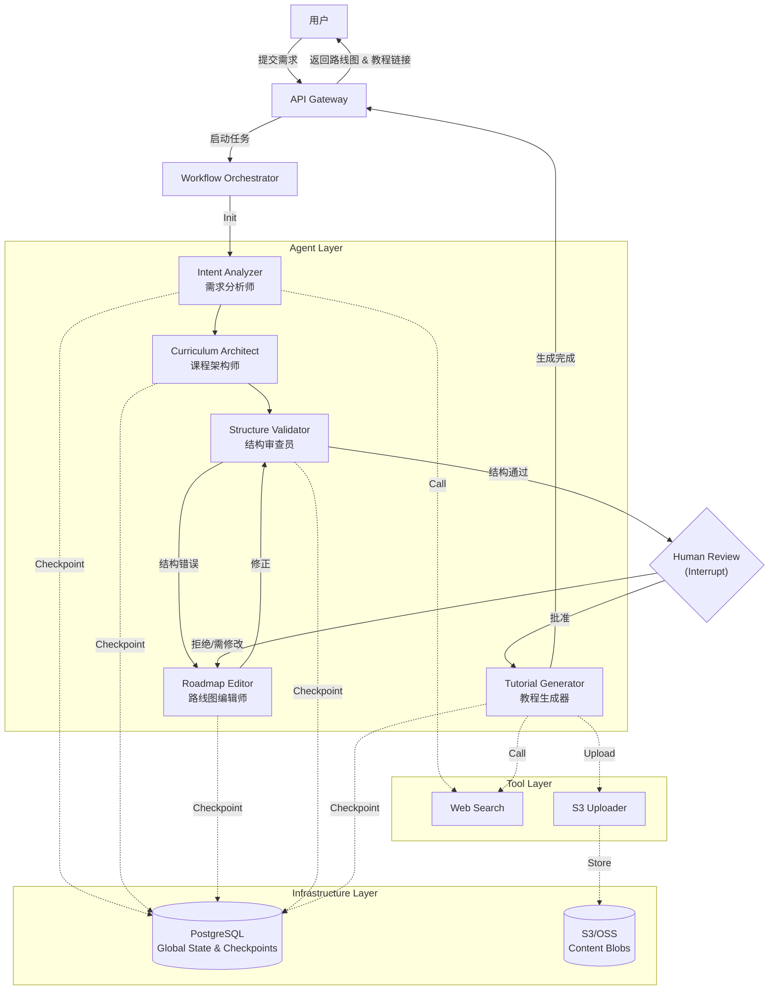
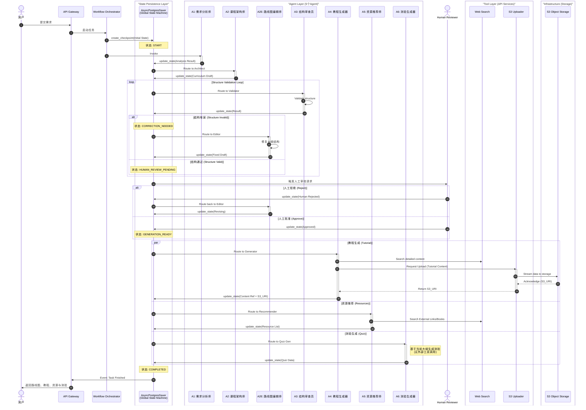
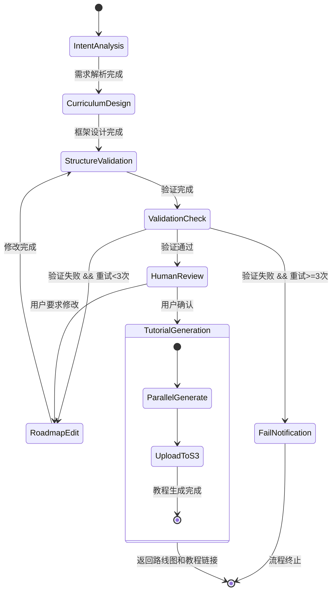

# 个性化学习路线图生成系统 - SD-MAS 架构设计文档

## 1. 项目摘要

**核心价值**: 基于用户个性化需求（学习目标、时间、动机、基础、背景、偏好），通过多 Agent 协作生成"Stage→Module→Concept"三层学习路线图框架，并为每个知识点生成详细教程，最终呈现为交互式、美观的学习路线图应用。
1.基于用户的个人画像及学习目标，自动定位学习盲区，并针对性生成学习重点及策略
2.为用户创建个性化、时效性高、可执行的Stage-Module-Concept三级路线图，并建立知识图谱
3.按照用户的学习偏好及当前水平定制化学习资料推荐以及测验练习题
4.提供伴学模式和导学模式，伴学模式中伴学导师智能Agent会自动捕捉当前学习的内容，并采用生活化类比的方式为用户解答一切相关问题，降低理解门槛，对看起来高大上的知识点祛魅，并可以根据用户需求修改路线图的结构、教程内容、测验题目、学习资源推荐；导学模式中导学导师智能Agent会逐步引导用户进行学习，像一个1对1的家教一样，采用鼓励式教育旨在逐步培养用户的学习兴趣

**技术特点**: 采用 SD-MAS 标准，通过 5 个 Agent（需求分析师、课程架构师、路线图编辑师、结构审查员、教程生成器）协作，支持人机协同确认（Human-in-the-Loop），使用 LangGraph + AsyncPostgresSaver 实现状态持久化和断点续传。


---

## 2. 系统视图 (System Architecture)



状态机流转图：

---

## 3. 核心目录结构

```text
/learning-roadmap-system
├── /specs                          # 声明式定义
│   ├── /agents
│   │   ├── intent_analyzer.yaml
│   │   ├── curriculum_architect.yaml
│   │   ├── roadmap_editor.yaml
│   │   ├── structure_validator.yaml
│   │   └── tutorial_generator.yaml
│   ├── /workflows
│   │   ├── main_flow.yaml
│   │   └── tutorial_generation.yaml
│   └── /tools
│       ├── web_search.yaml
│       └── s3_storage.yaml
│
├── /src
│   ├── /core                       # 引擎层
│   │   ├── orchestrator.py         # 工作流编排器 (LangGraph)
│   │   ├── checkpointers/          # 状态持久化
│   │   │   └── __init__.py         # 导出 AsyncPostgresSaver
│   │   └── tool_registry.py        # 工具注册中心
│   │
│   ├── /domain                     # 数据模型与契约
│   │   ├── models.py               # 业务实体 & I/O Schema
│   │   ├── state.py                # GlobalState & AgentState
│   │   └── protocol.py             # 通信协议 ACSMessage
│   │
│   ├── /prompts                    # Prompt 模板
│   │   ├── intent_analyzer.j2
│   │   ├── curriculum_architect.j2
│   │   ├── roadmap_editor.j2
│   │   ├── structure_validator.j2
│   │   └── tutorial_generator.j2
│   │
│   ├── /agents                     # Agent 业务逻辑 (5个)
│   │   ├── base.py                 # Agent 基类
│   │   ├── intent_analyzer.py      # A1: 需求分析师
│   │   ├── curriculum_architect.py # A2: 课程架构师
│   │   ├── roadmap_editor.py       # A2E: 路线图编辑师
│   │   ├── structure_validator.py  # A3: 结构审查员
│   │   └── tutorial_generator.py   # A4: 教程生成器
│   │
│   ├── /tools                      # 工具实现 (2个)
│   │   ├── /search
│   │   │   └── web_search.py       # Web 搜索工具
│   │   └── /storage
│   │       └── s3_client.py        # S3/R2 存储客户端
│   │
│   └── /transport                  # 对外接口
│       ├── http_api.py             # REST API
│       └── websocket_handler.py    # 实时推送
│
├── /infra                          # 基础设施配置
│   └── docker-compose.yml
│
├── /tests
│   ├── /unit
│   │   └── test_models.py          # 领域模型测试
│   ├── /integration
│   │   ├── test_intent_analyzer.py
│   │   ├── test_curriculum_architect.py
│   │   ├── test_roadmap_editor.py
│   │   ├── test_structure_validator.py
│   │   ├── test_tutorial_generator.py
│   │   └── test_checkpointer.py
│   └── /e2e
│       └── test_workflow.py        # 完整工作流测试
│
└── /docs
    └── architecture.md
```

---

## 4. 核心数据模型与接口设计

### 4.1 业务实体与接口 (`src/domain/models.py`)

```python
from pydantic import BaseModel, Field, HttpUrl
from typing import List, Optional, Literal, Dict, Any
from datetime import datetime

# ============================================================
# 1. 用户输入模型
# ============================================================

class LearningPreferences(BaseModel):
    """学习偏好配置"""
    learning_goal: str = Field(..., description="学习目标，如'成为全栈工程师'")
    available_hours_per_week: int = Field(..., ge=1, le=168, description="每周可投入小时数")
    motivation: str = Field(..., description="学习动机，如'转行'、'升职'、'兴趣'")
    current_level: Literal["beginner", "intermediate", "advanced"] = Field(
        ..., description="当前掌握程度"
    )
    career_background: str = Field(..., description="职业背景，如'市场营销 5 年经验'")
    content_preference: List[Literal["video", "text", "interactive", "project"]] = Field(
        default=["text", "interactive"], description="偏好的内容类型"
    )
    target_deadline: Optional[datetime] = Field(None, description="期望完成时间")

class UserRequest(BaseModel):
    """系统输入：用户请求"""
    user_id: str
    session_id: str
    preferences: LearningPreferences
    additional_context: Optional[str] = Field(None, description="额外补充信息")


# ============================================================
# 2. 路线图框架模型 (Stage -> Module -> Concept)
# ============================================================

class Concept(BaseModel):
    """第三层：概念/知识点（轻量级结构，不嵌套详细内容）"""
    concept_id: str
    name: str = Field(..., description="概念名称，如 'React Hooks 原理'")
    description: str = Field(..., description="简短描述（1-2 句话）")
    estimated_hours: float = Field(..., ge=0.5, description="预估学习时长（小时）")
    prerequisites: List[str] = Field(default=[], description="前置概念 ID 列表")
    difficulty: Literal["easy", "medium", "hard"] = "medium"
    keywords: List[str] = Field(default=[], description="关键词标签")
    
    # 内容引用（结构与内容解耦）
    content_status: Literal["pending", "generating", "completed", "failed"] = Field(
        default="pending", 
        description="教程内容生成状态"
    )
    content_ref: Optional[str] = Field(
        None, 
        description="指向 S3 Key 或内容 API 的 ID，如 's3://bucket/roadmaps/{roadmap_id}/concepts/{concept_id}/v1.md'"
    )
    content_version: str = Field(default="v1", description="内容版本号")
    content_summary: Optional[str] = Field(
        None, 
        max_length=300, 
        description="教程摘要（用于前端预览，避免加载完整内容）"
    )

class Module(BaseModel):
    """第二层：模块"""
    module_id: str
    name: str = Field(..., description="模块名称，如 'React 核心'")
    description: str
    concepts: List[Concept] = Field(..., min_items=1)

    @property
    def total_hours(self) -> float:
        return sum(c.estimated_hours for c in self.concepts)

class Stage(BaseModel):
    """第一层：阶段"""
    stage_id: str
    name: str = Field(..., description="阶段名称，如 '前端基础'")
    description: str
    order: int = Field(..., ge=1, description="阶段顺序")
    modules: List[Module] = Field(..., min_items=1)

    @property
    def total_hours(self) -> float:
        return sum(m.total_hours for m in self.modules)

class RoadmapFramework(BaseModel):
    """完整的三层路线图框架"""
    roadmap_id: str
    title: str = Field(..., description="路线图标题，如 '全栈开发学习路线'")
    stages: List[Stage] = Field(..., min_items=1)
    total_estimated_hours: float
    recommended_completion_weeks: int

    def validate_structure(self) -> bool:
        """验证结构完整性（所有前置关系是否有效）"""
        all_concept_ids = {
            c.concept_id
            for stage in self.stages
            for module in stage.modules
            for c in module.concepts
        }
        for stage in self.stages:
            for module in stage.modules:
                for concept in module.concepts:
                    for prereq in concept.prerequisites:
                        if prereq not in all_concept_ids:
                            return False
        return True


# ============================================================
# 3. 详细教程模型（独立存储，不嵌套在 Roadmap 中）
# ============================================================

class TutorialSection(BaseModel):
    """教程的一个章节"""
    section_id: str
    title: str
    content: str = Field(..., description="Markdown 格式内容")
    content_type: Literal["theory", "example", "exercise", "quiz"]
    estimated_minutes: int

class Tutorial(BaseModel):
    """
    单个 Concept 的详细教程（大文本对象）
    
    存储策略：
    - 生成后直接存入 S3/OSS 作为 Markdown 或 JSON 文件
    - Concept 对象只保留 content_ref 指向此文件
    - 前端按需加载，避免一次性传输所有教程内容
    """
    tutorial_id: str
    concept_id: str
    title: str
    summary: str = Field(..., max_length=500, description="教程摘要")
    sections: List[TutorialSection]
    recommended_resources: List[Dict[str, str]] = Field(
        default=[],
        description="推荐资源，格式: [{title, url, type}]"
    )
    exercises: List[str] = Field(default=[], description="实战练习题")
    estimated_completion_time: int = Field(..., description="完成时长（分钟）")
    
    # 元数据（用于追踪和版本管理）
    version: str = Field(default="v1", description="教程版本")
    generated_at: datetime = Field(default_factory=datetime.now)
    storage_url: Optional[str] = Field(None, description="存储位置的完整 URL")


# ============================================================
# 4. Agent 输入/输出接口
# ============================================================

# --- Intent Analyzer ---
class IntentAnalysisInput(BaseModel):
    user_request: UserRequest

class IntentAnalysisOutput(BaseModel):
    parsed_goal: str = Field(..., description="结构化的学习目标")
    key_technologies: List[str] = Field(..., description="提取的关键技术栈")
    difficulty_profile: str = Field(..., description="难度画像分析")
    time_constraint: str = Field(..., description="时间约束分析")
    recommended_focus: List[str] = Field(..., description="建议的学习重点")


# --- Curriculum Architect ---
class CurriculumDesignInput(BaseModel):
    intent_analysis: IntentAnalysisOutput
    user_preferences: LearningPreferences

class CurriculumDesignOutput(BaseModel):
    framework: RoadmapFramework
    design_rationale: str = Field(..., description="设计理由说明")


# --- Roadmap Editor ---
class RoadmapEditInput(BaseModel):
    """路线图编辑输入"""
    existing_framework: RoadmapFramework  # 现有路线图框架
    validation_issues: List[ValidationIssue]  # 验证发现的问题列表
    user_preferences: LearningPreferences  # 用户偏好
    modification_context: Optional[str] = Field(
        None, 
        description="修改上下文说明（如：第2次修改，主要解决前置关系问题）"
    )

class RoadmapEditOutput(BaseModel):
    """路线图编辑输出"""
    framework: RoadmapFramework  # 修改后的路线图框架
    modification_summary: str = Field(..., description="修改说明：解决了哪些问题，做了哪些调整")
    preserved_elements: List[str] = Field(
        default=[], 
        description="保留的原有元素（如：保留了Stage 1的完整结构）"
    )


# --- Structure Validator ---
class ValidationInput(BaseModel):
    framework: RoadmapFramework
    user_preferences: LearningPreferences

class ValidationIssue(BaseModel):
    severity: Literal["critical", "warning", "suggestion"]
    location: str = Field(..., description="问题位置，如 'Stage 2 > Module 1'")
    issue: str
    suggestion: str

class ValidationOutput(BaseModel):
    is_valid: bool
    issues: List[ValidationIssue] = []
    overall_score: float = Field(..., ge=0, le=100, description="结构质量评分")


# --- Tutorial Generator ---
class TutorialGenerationInput(BaseModel):
    concept: Concept
    context: Dict[str, Any] = Field(
        default={},
        description="上下文信息：前置概念、所属模块等"
    )
    user_preferences: LearningPreferences

class TutorialGenerationOutput(BaseModel):
    """
    教程生成器的输出（轻量级）
    
    注意：不直接返回完整 Tutorial 对象，而是返回引用信息
    """
    concept_id: str
    tutorial_id: str
    title: str
    summary: str = Field(..., max_length=500, description="教程摘要（用于预览）")
    content_url: str = Field(..., description="S3 存储地址或 CDN URL")
    content_status: Literal["completed", "failed"] = "completed"
    estimated_completion_time: int
    generated_at: datetime = Field(default_factory=datetime.now)


```

---

## 5. 状态管理设计

### 5.1 全局状态 (`src/domain/state.py`)

```python
from pydantic import BaseModel, Field
from typing import Dict, List, Any, Optional
from datetime import datetime
import uuid

from .models import (
    UserRequest,
    IntentAnalysisOutput,
    RoadmapFramework,
    Tutorial,
    ValidationOutput
)

class Artifact(BaseModel):
    """大文件/复杂对象的引用"""
    key: str       # S3 Key 或 本地路径
    type: str      # e.g., "roadmap/html", "tutorial/markdown"
    summary: str   # 简短描述

class LearningRoadmapState(BaseModel):
    """
    Global State: 学习路线图生成的全局上下文
    """
    # --- 1. 身份与元数据 ---
    trace_id: str = Field(default_factory=lambda: str(uuid.uuid4()))
    workflow_id: str = "learning_roadmap_generation"
    user_id: str
    session_id: str
    start_time: datetime = Field(default_factory=datetime.now)

    # --- 2. 核心数据区 (按阶段存储产出) ---
    data: Dict[str, Any] = Field(default_factory=dict)
    # 预期的 Key 结构:
    # - "user_request": UserRequest
    # - "intent_analysis": IntentAnalysisOutput
    # - "roadmap_framework": RoadmapFramework (轻量级骨架，不含详细教程)
    # - "validation_result": ValidationOutput
    # - "tutorial_refs": Dict[concept_id, TutorialGenerationOutput] (仅存储引用和元数据)

    # --- 3. 外部引用区 (Artifacts) ---
    artifacts: List[Artifact] = Field(default_factory=list)

    # --- 4. 流程控制区 ---
    current_step: str = "intent_analysis"
    execution_history: List[str] = Field(default_factory=list)

    # --- 5. 人机协同状态 ---
    human_feedback: Optional[str] = None
    human_approved: bool = False
    modification_count: int = 0  # 用户修改次数

    def update_data(self, key: str, value: Any):
        """原子化更新数据"""
        self.data[key] = value

    def add_history(self, summary: str):
        timestamp = datetime.now().strftime("%Y-%m-%d %H:%M:%S")
        self.execution_history.append(f"[{timestamp}] {summary}")

    def get_roadmap(self) -> Optional[RoadmapFramework]:
        return self.data.get("roadmap_framework")

    def get_tutorial_refs(self) -> Dict[str, TutorialGenerationOutput]:
        """获取教程引用（非完整内容）"""
        return self.data.get("tutorial_refs", {})


class AgentState(BaseModel):
    """
    Agent State: 单个 Agent 的短期记忆
    """
    agent_id: str
    task_id: str  # 对应 LearningRoadmapState.trace_id

    # 短期记忆（LLM Context）
    memory_window: List[Dict[str, Any]] = Field(default_factory=list)

    # 控制变量
    iteration_count: int = 0
    max_iterations: int = 10
    is_finished: bool = False

    # 暂存区
    temp_variables: Dict[str, Any] = {}

    def add_message(self, role: str, content: str, **kwargs):
        msg = {"role": role, "content": content, **kwargs}
        self.memory_window.append(msg)

    def increment_iteration(self):
        self.iteration_count += 1
        if self.iteration_count > self.max_iterations:
            raise RuntimeError(f"Agent {self.agent_id} exceeded max iterations.")
```

---

### 5.2 通信协议 (`src/domain/protocol.py`)

```python
from pydantic import BaseModel, Field
from typing import Dict, Any, Optional, Literal
import uuid
import time

class ACSMessage(BaseModel):
    """Agent Communication Standard (ACS) 信封"""
    trace_id: str = Field(default_factory=lambda: str(uuid.uuid4()))
    timestamp: float = Field(default_factory=time.time)
    sender: str = Field(..., description="发送方 Agent ID")
    receiver: str = Field(..., description="接收方 Agent ID 或 'orchestrator'")
    type: Literal["COMMAND", "RESPONSE", "EVENT", "ERROR"]

    # 核心载荷：存放 Interface Model 的字典
    content: Dict[str, Any]

    # 状态引用：指向 GlobalState 中的大对象
    context_ref: Optional[str] = None

    # 元数据
    metadata: Dict[str, Any] = Field(
        default_factory=dict,
        description="附加信息：token 消耗、延迟等"
    )
```

---

## 6. Tool Spec 定义清单

| Tool ID         | 工具名称   | 类别     | 输入/输出 Schema                     | 副作用 | Async  | YAML 文件                     |
| :-------------- | :--------- | :------- | :----------------------------------- | :----- | :----- | :---------------------------- |
| `web_search_v1` | Web Search | 信息检索 | `SearchQuery` / `SearchResult`       | ❌ No  | ✅ Yes | `specs/tools/web_search.yaml` |
| `s3_storage_v1` | S3 Storage | 对象存储 | `S3UploadRequest` / `S3UploadResult` | ✅ Yes | ✅ Yes | `specs/tools/s3_storage.yaml` |

### 6.1 Tool 数据模型补充 (`src/domain/models.py` 追加)

```python
# ============================================================
# Tool Interface Models
# ============================================================

class SearchQuery(BaseModel):
    query: str
    search_type: Literal["web", "academic", "video"] = "web"
    max_results: int = Field(5, ge=1, le=20)

class SearchResult(BaseModel):
    results: List[Dict[str, str]] = Field(
        ...,
        description="格式: [{title, url, snippet, published_date}]"
    )
    total_found: int

class S3UploadRequest(BaseModel):
    """S3 对象存储上传请求"""
    key: str = Field(..., description="对象存储路径，如 'roadmaps/{id}/concepts/{cid}/v1.md'")
    content: str = Field(..., description="要上传的内容（文本或 base64 编码）")
    content_type: str = Field(default="text/markdown", description="MIME 类型")
    bucket: Optional[str] = Field(None, description="存储桶名称（默认使用配置）")

class S3UploadResult(BaseModel):
    """S3 上传结果"""
    success: bool
    url: str = Field(..., description="对象的访问 URL（可能是预签名 URL）")
    key: str = Field(..., description="存储的对象 Key")
    size_bytes: int = Field(..., description="上传的文件大小")
    etag: Optional[str] = Field(None, description="对象的 ETag")
```

---

### 6.2 Tool YAML 定义

#### `specs/tools/web_search.yaml`

```yaml
spec_version: "2.0"
tool_id: "web_search_v1"
version: "1.0.0"
name: "Web Search Tool"
description: "执行网络搜索以获取最新学习资源、技术文档和教程。"
tags: ["network", "search", "external_api"]
category: "information_retrieval"

input_schema: "SearchQuery"
output_schema: "SearchResult"

implementation:
  package: "src.tools.search.web_search"
  function: "async_web_search"
  is_async: true
  requirements:
    - "aiohttp>=3.8"
    - "beautifulsoup4"

secrets:
  - name: "api_key"
    env_var: "SERPAPI_KEY"
    required: true

policy:
  cache:
    enabled: true
    ttl_seconds: 3600
    key_strategy: "hash(input.query + input.search_type)"

  execution:
    timeout_seconds: 15
    max_retries: 2
    retry_on_errors: ["NetworkError", "RateLimitError"]

  rate_limit:
    requests_per_minute: 30

output_processing:
  max_items: 5
  transform: "results[*].{title: title, snippet: snippet, url: link}"
```

#### `specs/tools/s3_storage.yaml`

```yaml
spec_version: "2.0"
tool_id: "s3_storage_v1"
version: "1.0.0"
name: "S3 Object Storage"
description: "将大文本内容（如教程 Markdown）上传到 S3/OSS 对象存储，实现内容与结构解耦。"
tags: ["storage", "s3", "blob", "offload"]
category: "infrastructure"

input_schema: "S3UploadRequest"
output_schema: "S3UploadResult"

implementation:
  package: "src.tools.storage.s3_client"
  function: "async_upload"
  is_async: true
  requirements:
    - "boto3>=1.28"
    - "aioboto3>=11.0"

secrets:
  - name: "access_key_id"
    env_var: "AWS_ACCESS_KEY_ID"
    required: true
  - name: "secret_access_key"
    env_var: "AWS_SECRET_ACCESS_KEY"
    required: true
  - name: "bucket_name"
    env_var: "S3_BUCKET_NAME"
    required: true
  - name: "region"
    env_var: "AWS_REGION"
    required: false
    default: "us-east-1"

policy:
  execution:
    timeout_seconds: 30
    max_retries: 2
    retry_on_errors: ["NetworkError", "ThrottlingError"]

  rate_limit:
    requests_per_minute: 100

output_processing:
  transform: "{url: url, key: key, size: size_bytes}"
```

---

## 7. Agent Spec 定义清单

| Agent ID               | 角色名称     | 职责 (SRP)                           | 依赖工具                         | YAML 文件                                |
| :--------------------- | :----------- | :----------------------------------- | :------------------------------- | :--------------------------------------- |
| `intent_analyzer`      | 需求分析师   | 解析用户输入，提取关键信息和学习目标 | `web_search_v1`                  | `specs/agents/intent_analyzer.yaml`      |
| `curriculum_architect` | 课程架构师   | 设计三层学习路线图框架               | `web_search_v1`                  | `specs/agents/curriculum_architect.yaml` |
| `roadmap_editor`       | 路线图编辑师 | 基于验证问题修改现有路线图框架       | `web_search_v1`                  | `specs/agents/roadmap_editor.yaml`       |
| `structure_validator`  | 结构审查员   | 验证路线图的逻辑性、完整性和合理性   | 无                               | `specs/agents/structure_validator.yaml`  |
| `tutorial_generator`   | 教程生成器   | 为每个 Concept 生成详细教程内容      | `web_search_v1`, `s3_storage_v1` | `specs/agents/tutorial_generator.yaml`   |
| `resource_recommender` | 资源推荐师   | 为每个 Concept 搜索推荐学习资源      | `web_search_v1`                  | `specs/agents/resource_recommender.yaml` |
| `quiz_generator`       | 测验生成器   | 为每个 Concept 生成测验题目          | 无                               | `specs/agents/quiz_generator.yaml`       |

---

### 7.1 Agent YAML 定义

#### `specs/agents/intent_analyzer.yaml`

```yaml
spec_version: "1.2"
agent_id: "intent_analyzer"
version: "1.0.0"
owner: "learning-system-team"
tags: ["nlp", "analysis", "intent"]

name: "Intent Analyzer"
role_description: "分析用户的学习需求，提取关键技术栈、难度画像和时间约束，为后续设计提供结构化输入。"

style_config:
  tone: "analytical"
  language: "zh-CN"
  verbosity: "concise"

model_config:
  provider: "${ANALYZER_PROVIDER}"
  model: "${ANALYZER_MODEL}"
  base_url: "${ANALYZER_BASE_URL}"
  temperature: 0.3
  max_tokens: 2048
  context_window: 128000
  fallback_models:
    - "azure/gpt-35-turbo"

reasoning_config:
  kind: "cot"
  max_iterations: 3
  stop_sequences: ["Analysis Complete"]

memory_config:
  type: "window"
  capacity: 5
  persist_tool_outputs: false

input_schema: "IntentAnalysisInput"
output_schema: "IntentAnalysisOutput"

system_prompt_template: "prompts/intent_analyzer.j2"
prompt_variables:
  - "domain_knowledge"

capabilities:
  tools:
    - "web_search_v1"
  tool_choice: "auto"
  tool_timeout_seconds: 15

guardrails:
  input:
    - type: "pii_masking"
  output:
    - type: "schema_validation"
      action: "retry"
      max_retries: 2
```

#### `specs/agents/curriculum_architect.yaml`

```yaml
spec_version: "1.2"
agent_id: "curriculum_architect"
version: "1.0.0"
owner: "learning-system-team"
tags: ["design", "curriculum", "planning"]

name: "Curriculum Architect"
role_description: "资深课程设计师，根据用户需求设计科学的 Stage→Module→Concept 三层学习路线图，确保知识递进合理、时间分配科学。"

style_config:
  tone: "professional"
  language: "zh-CN"
  verbosity: "detailed"

model_config:
  provider: "${ARCHITECT_PROVIDER}"
  model: "${ARCHITECT_MODEL}"
  base_url: "${ARCHITECT_BASE_URL}"
  temperature: 0.7
  max_tokens: 8192
  context_window: 200000
  fallback_models:
    - "anthropic/claude-3-sonnet"

reasoning_config:
  kind: "tot" # Tree of Thoughts - 需要探索多种设计方案
  max_iterations: 5
  on_tool_error: "catch_and_retry"

memory_config:
  type: "summary"
  capacity: 20
  persist_tool_outputs: true

input_schema: "CurriculumDesignInput"
output_schema: "CurriculumDesignOutput"

system_prompt_template: "prompts/curriculum_architect.j2"
prompt_variables:
  - "pedagogy_principles"
  - "best_practices"

capabilities:
  tools:
    - "web_search_v1"
  tool_choice: "auto"
  tool_timeout_seconds: 30

guardrails:
  output:
    - type: "schema_validation"
      action: "retry"
      max_retries: 3
    - type: "custom_validation"
      validator_function: "validate_roadmap_structure"
```

#### `specs/agents/structure_validator.yaml`

```yaml
spec_version: "1.2"
agent_id: "structure_validator"
version: "1.0.0"
owner: "learning-system-team"
tags: ["validation", "quality", "adversarial"]

name: "Structure Validator"
role_description: "批判性审查员，专门检查课程架构师设计的路线图是否存在逻辑漏洞、知识断层、时间不合理等问题（对抗原则）。"

style_config:
  tone: "critical"
  language: "zh-CN"
  verbosity: "concise"

model_config:
  provider: "${VALIDATOR_PROVIDER}"
  model: "${VALIDATOR_MODEL}"
  base_url: "${VALIDATOR_BASE_URL}"
  temperature: 0.2
  max_tokens: 4096
  context_window: 128000

reasoning_config:
  kind: "cot"
  max_iterations: 3
  stop_sequences: ["Validation Complete"]

memory_config:
  type: "window"
  capacity: 5

input_schema: "ValidationInput"
output_schema: "ValidationOutput"

system_prompt_template: "prompts/structure_validator.j2"
prompt_variables:
  - "validation_checklist"

capabilities:
  tools: []
  tool_choice: "none"

guardrails:
  output:
    - type: "schema_validation"
      action: "retry"
      max_retries: 2
```

#### `specs/agents/tutorial_generator.yaml`

```yaml
spec_version: "1.2"
agent_id: "tutorial_generator"
version: "1.0.0"
owner: "learning-system-team"
tags: ["content", "tutorial", "education"]

name: "Tutorial Generator"
role_description: "专业教程撰写者，为每个 Concept 生成结构化、易懂、实用的教程内容，包含理论、示例、练习。"

style_config:
  tone: "friendly"
  language: "zh-CN"
  verbosity: "detailed"

model_config:
  provider: "${GENERATOR_PROVIDER}"
  model: "${GENERATOR_MODEL}"
  base_url: "${GENERATOR_BASE_URL}"
  temperature: 0.8
  max_tokens: 16384
  context_window: 200000

reasoning_config:
  kind: "react"
  max_iterations: 8
  on_tool_error: "catch_and_retry"

memory_config:
  type: "window"
  capacity: 15
  persist_tool_outputs: true

input_schema: "TutorialGenerationInput"
output_schema: "TutorialGenerationOutput"

system_prompt_template: "prompts/tutorial_generator.j2"
prompt_variables:
  - "writing_style_guide"
  - "content_preference"

capabilities:
  tools:
    - "web_search_v1"
    - "s3_storage_v1"  # 添加 S3 存储工具，用于上传生成的教程内容
  tool_choice: "auto"
  tool_timeout_seconds: 30

guardrails:
  output:
    - type: "schema_validation"
      action: "retry"
      max_retries: 3
    - type: "content_safety_check"
      action: "fail_fast"
```

#### `specs/agents/resource_recommender.yaml`

```yaml
spec_version: "1.2"
agent_id: "resource_recommender"
version: "1.0.0"
owner: "learning-system-team"
tags: ["content", "resources", "recommendation"]

name: "Resource Recommender"
role_description: "资深学习资源专家，擅长为学习者搜索并推荐高质量的学习资源，包括官方文档、教程、视频课程、书籍和工具。"

style_config:
  tone: "helpful"
  language: "zh-CN"
  verbosity: "concise"

model_config:
  provider: "${RECOMMENDER_PROVIDER}"
  model: "${RECOMMENDER_MODEL}"
  base_url: "${RECOMMENDER_BASE_URL}"
  temperature: 0.5
  max_tokens: 4096
  context_window: 128000

reasoning_config:
  kind: "react"
  max_iterations: 5
  on_tool_error: "catch_and_retry"

memory_config:
  type: "window"
  capacity: 10
  persist_tool_outputs: true

input_schema: "ResourceRecommendationInput"
output_schema: "ResourceRecommendationOutput"

system_prompt_template: "prompts/resource_recommender.j2"
prompt_variables:
  - "resource_quality_criteria"

capabilities:
  tools:
    - "web_search_v1"
  tool_choice: "auto"
  tool_timeout_seconds: 20

guardrails:
  output:
    - type: "schema_validation"
      action: "retry"
      max_retries: 2
    - type: "url_validation"
      action: "filter"
```

#### `specs/agents/quiz_generator.yaml`

```yaml
spec_version: "1.2"
agent_id: "quiz_generator"
version: "1.0.0"
owner: "learning-system-team"
tags: ["content", "quiz", "assessment"]

name: "Quiz Generator"
role_description: "专业教育评估专家，擅长设计能够准确评估学习者知识掌握程度的测验题目，题目设计科学、难度适中、解析详尽。"

style_config:
  tone: "educational"
  language: "zh-CN"
  verbosity: "detailed"

model_config:
  provider: "${QUIZ_PROVIDER}"
  model: "${QUIZ_MODEL}"
  base_url: "${QUIZ_BASE_URL}"
  temperature: 0.7
  max_tokens: 4096
  context_window: 128000

reasoning_config:
  kind: "cot"
  max_iterations: 3
  stop_sequences: ["Quiz Complete"]

memory_config:
  type: "window"
  capacity: 5
  persist_tool_outputs: false

input_schema: "QuizGenerationInput"
output_schema: "QuizGenerationOutput"

system_prompt_template: "prompts/quiz_generator.j2"
prompt_variables:
  - "question_design_guidelines"
  - "difficulty_distribution"

capabilities:
  tools: []
  tool_choice: "none"

guardrails:
  output:
    - type: "schema_validation"
      action: "retry"
      max_retries: 2
    - type: "answer_validation"
      action: "retry"
```

---

## 8. Workflow Spec 定义清单

| Workflow ID                    | 流程名称     | 触发条件     | 核心模式                       | 参与 Agent                                                                  | 并发/聚合策略             | YAML 文件                                  |
| :----------------------------- | :----------- | :----------- | :----------------------------- | :-------------------------------------------------------------------------- | :------------------------ | :----------------------------------------- |
| `main_flow`                    | 主业务流程   | 用户提交需求 | Sequential + Human-in-the-loop | 所有 7 个 Agent                                                             | N/A                       | `specs/workflows/main_flow.yaml`           |
| `framework_refinement_loop`    | 框架迭代优化 | 验证未通过   | Loop                           | `roadmap_editor`, `structure_validator`                                     | `max_retries=3`           | 内嵌于 main_flow                           |
| `content_generation_parallel`  | 并发内容生成 | 框架确认后   | Parallel                       | `tutorial_generator`, `resource_recommender`, `quiz_generator` (多实例并行) | `wait_all` / `dict_merge` | `specs/workflows/content_generation.yaml`  |

---

### 8.1 Workflow YAML 定义

#### `specs/workflows/main_flow.yaml`

```yaml
spec_version: "2.0"
workflow_id: "main_flow"
version: "1.0.0"
description: "主业务流程：需求分析 → 框架设计 → 人工确认 → 教程生成 → 返回 JSON"
tags: ["main", "sequential", "human-in-loop"]

variables_schema:
  required: ["user_request"]
  optional: []

steps:
  # ==================== Step 1: 需求分析 ====================
  - id: "step_1_intent_analysis"
    type: "standard"
    agent_id: "intent_analyzer"
    description: "解析用户学习需求，提取关键信息"

    input_mapping:
      user_request: "${context.user_request}"

    output_mapping:
      result_ref: "intent_analysis"

    retry_policy:
      max_attempts: 2
      delay_seconds: 3

    next: "step_2_curriculum_design"

  # ==================== Step 2: 课程设计 ====================
  - id: "step_2_curriculum_design"
    type: "standard"
    agent_id: "curriculum_architect"
    description: "设计三层学习路线图框架"

    input_mapping:
      intent_analysis: "${context.intent_analysis}"
      user_preferences: "${context.user_request.preferences}"

    output_mapping:
      result_ref: "roadmap_framework_draft"

    retry_policy:
      max_attempts: 2
      delay_seconds: 5

    next: "step_3_structure_validation"

  # ==================== Step 3: 结构验证 ====================
  - id: "step_3_structure_validation"
    type: "standard"
    agent_id: "structure_validator"
    description: "验证路线图的合理性和完整性"

    input_mapping:
      framework: "${context.roadmap_framework_draft.framework}"
      user_preferences: "${context.user_request.preferences}"

    output_mapping:
      result_ref: "validation_result"

    next: "step_4_validation_check"

  # ==================== Step 4: 验证结果检查 ====================
  - id: "step_4_validation_check"
    type: "router"
    description: "判断验证是否通过"

    cases:
      - condition: "context.validation_result.is_valid == False and context.modification_count < 3"
        next: "step_2_curriculum_design" # 返回重新设计

      - condition: "context.validation_result.is_valid == False and context.modification_count >= 3"
        next: "step_fail_notification" # 多次失败，终止流程

      - default: "step_5_human_review"

  # ==================== Step 5: 人工审核 ====================
  - id: "step_5_human_review"
    type: "human_intervention"
    description: "等待用户确认或修改路线图框架"

    timeout_seconds: 86400 # 24 小时
    input_context: ["roadmap_framework_draft", "validation_result"]

    actions:
      - label: "Approve"
        next: "step_6_tutorial_generation"

      - label: "Modify"
        next: "step_2_curriculum_design" # 用户修改后重新设计

  # ==================== Step 6: 并发生成教程 ====================
  - id: "step_6_tutorial_generation"
    type: "workflow_call"
    workflow_id: "tutorial_generation_parallel"
    description: "调用子工作流：并发为所有 Concept 生成教程"

    input_mapping:
      roadmap_framework: "${context.roadmap_framework_draft.framework}"
      user_preferences: "${context.user_request.preferences}"

    output_mapping:
      result_ref: "all_tutorials"

    retry_policy:
      max_attempts: 1

    next: "end"

  # ==================== 失败处理 ====================
  - id: "step_fail_notification"
    type: "standard"
    agent_id: "intent_analyzer" # 复用 Agent 生成友好错误信息
    description: "通知用户生成失败"

    input_mapping:
      error_context: "${context.validation_result}"

    next: "end"
```

#### `specs/workflows/tutorial_generation.yaml`

```yaml
spec_version: "2.0"
workflow_id: "tutorial_generation_parallel"
version: "2.0.0"
description: "并发为所有 Concept 生成教程并上传至 S3"
tags: ["parallel", "tutorial", "s3"]

variables_schema:
  required: ["roadmap_framework", "user_preferences"]
  optional: []

steps:
  # ==================== Step 1: 提取所有 Concepts ====================
  - id: "step_1_extract_concepts"
    type: "router"
    description: "从路线图中提取所有 Concept ID 列表"

    cases:
      - condition: "len(context.concept_list) > 0"
        next: "step_2_parallel_generation"
      - default: "end"

  # ==================== Step 2: 并发生成教程 ====================
  - id: "step_2_parallel_generation"
    type: "parallel"
    concurrency_mode: "wait_all"
    timeout_seconds: 600 # 10 分钟
    failure_policy: "ignore_failures" # 个别失败不影响整体

    branches:
      # 动态生成分支：为每个 Concept 创建一个分支
      # 实际实现时，Orchestrator 会在运行时展开这个列表
      - id: "branch_tutorial_${concept_id}"
        agent_id: "tutorial_generator"
        input_mapping:
          concept: "${context.concepts[concept_id]}"
          context:
            stage_name: "${concept.stage_name}"
            module_name: "${concept.module_name}"
          user_preferences: "${context.user_preferences}"

        # 每个分支的输出存入临时空间
        output_key: "tutorial_${concept_id}"

    output_aggregation:
      target_key: "tutorials"
      method: "dict_merge" # {concept_id: TutorialGenerationOutput}

    next: "end"
```

---

## 9. 提示词工程策略

### 9.1 System Prompt 标准结构

所有 Agent 的 System Prompt 遵循统一模板结构（使用 Jinja2）：

```text
[1. Role Definition]
你是 {{ agent_name }}，{{ role_description }}

[2. Context Injection]
当前任务上下文：
- 用户学习目标：{{ user_goal }}
- 已完成步骤：{{ execution_history | join(", ") }}
- 当前阶段：{{ current_step }}

[3. Constraints & Rules]
工作规范：
{{ constraints | to_list }}

[4. Output Format]
输出必须严格遵循以下 JSON Schema：
{{ output_schema | to_json_schema }}

[5. Tool Usage Guide]
可用工具：

- {{ tool.name }}: {{ tool.description }}


[6. Examples (Few-shot)]

参考示例：
{{ examples | to_markdown }}

```

### 9.2 历史记录注入策略

在每次 Agent 调用时，动态注入 `GlobalState.execution_history` 的最近 5 条记录：

```python
# 伪代码
def build_system_prompt(agent_config, global_state):
    history_summary = global_state.execution_history[-5:]

    return render_template(
        agent_config.system_prompt_template,
        agent_name=agent_config.name,
        role_description=agent_config.role_description,
        execution_history=history_summary,
        current_step=global_state.current_step,
        user_goal=global_state.data["user_request"].preferences.learning_goal,
        # ...
    )
```

---

## 10. 通信协议示例 (JSON)

### 示例：Orchestrator 向 Curriculum Architect 发送设计任务

```json
{
  "trace_id": "a1b2c3d4-e5f6-7890-abcd-ef1234567890",
  "timestamp": 1701234567.89,
  "sender": "orchestrator",
  "receiver": "curriculum_architect",
  "type": "COMMAND",
  "content": {
    "intent_analysis": {
      "parsed_goal": "成为能够独立开发 Web 应用的全栈工程师",
      "key_technologies": [
        "HTML",
        "CSS",
        "JavaScript",
        "React",
        "Node.js",
        "PostgreSQL"
      ],
      "difficulty_profile": "用户为初学者，需要从基础开始，注重实战",
      "time_constraint": "每周 10 小时，预计 6 个月完成",
      "recommended_focus": [
        "前端基础",
        "React 框架",
        "后端 API 开发",
        "数据库设计"
      ]
    },
    "user_preferences": {
      "learning_goal": "成为全栈工程师",
      "available_hours_per_week": 10,
      "motivation": "转行",
      "current_level": "beginner",
      "career_background": "市场营销 3 年经验",
      "content_preference": ["interactive", "project"],
      "target_deadline": "2024-06-30T00:00:00Z"
    }
  },
  "context_ref": "redis://state:a1b2c3d4",
  "metadata": {
    "workflow_step": "step_2_curriculum_design",
    "retry_count": 0
  }
}
```

### 示例：Curriculum Architect 返回设计结果

```json
{
  "trace_id": "a1b2c3d4-e5f6-7890-abcd-ef1234567890",
  "timestamp": 1701234598.12,
  "sender": "curriculum_architect",
  "receiver": "orchestrator",
  "type": "RESPONSE",
  "content": {
    "framework": {
      "roadmap_id": "rm_123456",
      "title": "全栈工程师学习路线图（初级到中级）",
      "stages": [
        {
          "stage_id": "stage_1",
          "name": "前端基础",
          "description": "掌握 Web 开发的基础三件套",
          "order": 1,
          "modules": [
            {
              "module_id": "module_1_1",
              "name": "HTML 核心",
              "description": "学习 HTML5 语义化标签和结构",
              "concepts": [
                {
                  "concept_id": "concept_1_1_1",
                  "name": "HTML 基本结构",
                  "description": "理解 HTML 文档的基本组成部分",
                  "estimated_hours": 2.0,
                  "prerequisites": [],
                  "difficulty": "easy",
                  "keywords": ["HTML", "标签", "语义化"],
                  "content_status": "pending",
                  "content_ref": null,
                  "content_version": "v1",
                  "content_summary": null
                }
              ]
            }
          ]
        }
      ],
      "total_estimated_hours": 240.0,
      "recommended_completion_weeks": 24
    },
    "design_rationale": "根据用户初学者背景和每周 10 小时投入，设计了循序渐进的 4 阶段路线..."
  },
  "context_ref": "redis://state:a1b2c3d4",
  "metadata": {
    "tokens_used": {
      "prompt_tokens": 1523,
      "completion_tokens": 3891,
      "total_tokens": 5414
    },
    "latency_ms": 8234,
    "model": "gpt-4-turbo-2024-04-09"
  }
}
```

---

## 11. 核心流程图

### 11.1 主业务流程状态机



### 11.2 框架设计与验证闭环（对抗原则）

```mermaid
sequenceDiagram
    participant O as Orchestrator
    participant CA as Curriculum Architect<br/>(生成者)
    participant SV as Structure Validator<br/>(审查者)
    participant RE as Roadmap Editor<br/>(修复者)

    O->>CA: 发送设计任务
    activate CA

    CA->>CA: 思考并设计路线图
    CA-->>O: 返回框架草稿（轻量级，仅结构）
    deactivate CA

    O->>SV: 发送验证任务
    activate SV

    SV->>SV: 批判性审查<br/>检查逻辑漏洞

    alt 发现问题
        SV-->>O: 返回问题清单<br/>(is_valid=false)
        deactivate SV
        O->>RE: 发送修复任务<br/>(附带问题清单)
        activate RE
        RE->>RE: 根据问题清单修正框架
        RE-->>O: 返回修正后的框架
        deactivate RE
        O->>SV: 重新验证
        activate SV
        SV->>SV: 验证修正后的框架
        SV-->>O: 返回验证结果
        deactivate SV
    else 无问题
        SV-->>O: 通过验证<br/>(is_valid=true)
        deactivate SV
        O->>O: 进入人工审核
    end
```

---

## 12. 路由与调度逻辑

### 12.1 验证结果路由决策树

```python
# 伪代码：Orchestrator 中的路由逻辑
def route_after_validation(context: LearningRoadmapState) -> str:
    """
    根据验证结果决定下一步
    """
    validation_result = context.data["validation_result"]
    modification_count = context.modification_count

    if not validation_result.is_valid:
        # 验证失败
        if modification_count < 3:
            # 重试次数未超限，返回重新设计
            context.modification_count += 1
            context.add_history(f"验证未通过（第 {modification_count + 1} 次），返回重新设计")
            return "step_2_curriculum_design"
        else:
            # 超过重试限制，终止流程
            context.add_history("验证多次失败，流程终止")
            return "step_fail_notification"
    else:
        # 验证通过，进入人工审核
        context.add_history("结构验证通过，等待用户确认")
        return "step_5_human_review"
```

### 12.2 并发教程生成的聚合策略

**策略**: `wait_all` + `dict_merge`

- **wait_all**: 等待所有 Concept 的教程生成完成后再进入下一步（确保路线图完整性）。
- **dict_merge**: 将各分支产出的 `Tutorial` 对象按 `concept_id` 合并为一个字典：

```python
{
  "concept_1_1_1": Tutorial(...),
  "concept_1_1_2": Tutorial(...),
  "concept_2_1_1": Tutorial(...),
  # ...
}
```

**容错策略**: `ignore_failures`

- 如果某个 Concept 的教程生成失败（如超时、工具错误），不影响整体流程。
- 失败的 Concept 可在后续步骤中单独重试，或标记为"待补充"。

---

## 13. 错误处理与恢复

### 13.1 错误码映射表

| 错误类型              | 错误码    | 描述                         | 恢复策略                        |
| :-------------------- | :-------- | :--------------------------- | :------------------------------ |
| **System Errors**     |           |                              |                                 |
| NetworkError          | `SYS_001` | 网络请求失败（工具调用超时） | 指数退避重试（3 次）            |
| DatabaseError         | `SYS_002` | Redis/VectorDB 连接失败      | 重试 + 降级（使用内存状态）     |
| ModelAPIError         | `SYS_003` | LLM API 返回 5xx 错误        | 切换到 fallback 模型            |
| RateLimitError        | `SYS_004` | API 限流                     | 延迟 60s 后重试                 |
| **Model Errors**      |           |                              |                                 |
| ContextOverflow       | `MDL_001` | Token 超过上下文窗口         | 触发摘要压缩（Summarizer）      |
| InvalidOutput         | `MDL_002` | 模型输出不符合 Schema        | 自动重试（附带错误提示）        |
| HallucinationDetected | `MDL_003` | 幻觉检测未通过               | 降低 temperature 重试           |
| **Logic Errors**      |           |                              |                                 |
| MaxIterationExceeded  | `LOG_001` | Agent 思考轮数超限           | 终止并报警 + 人工介入           |
| ValidationFailed      | `LOG_002` | 数据校验失败                 | 返回 Agent 进行 Self-Correction |
| CircularDependency    | `LOG_003` | 路线图中存在循环依赖         | 终止流程 + 报警                 |

### 13.2 错误恢复流程

```python
# 伪代码：统一错误处理器
async def handle_error(error: Exception, context: LearningRoadmapState) -> str:
    """
    根据错误类型执行恢复策略
    """
    if isinstance(error, NetworkError):
        # 指数退避重试
        await exponential_backoff_retry(error.task, max_retries=3)

    elif isinstance(error, ContextOverflowError):
        # 触发记忆压缩
        context.add_history("检测到上下文溢出，启动摘要压缩")
        summarizer = SummarizerAgent()
        compressed_memory = await summarizer.compress(context.data)
        context.data["compressed_history"] = compressed_memory

    elif isinstance(error, InvalidOutputError):
        # 让 Agent 自我修正
        context.add_history(f"检测到输出格式错误: {error.message}")
        return "retry_with_correction"

    elif isinstance(error, MaxIterationExceededError):
        # 终止并报警
        context.add_history("Agent 陷入死循环，强制终止")
        await send_alert_to_admin(context.trace_id, error)
        return "abort"

    else:
        # 未知错误，记录并终止
        await log_error(error, context)
        return "abort"
```

---

## 14. 追踪链路 (Tracing)

### 14.1 Span 层级结构

```text
Workflow Span (main_flow)
├── Step Span (step_1_intent_analysis)
│   ├── Agent Span (intent_analyzer)
│   │   ├── Think Span (iteration_1)
│   │   ├── Tool Span (web_search_v1)
│   │   └── Think Span (iteration_2)
│   └── Output Validation Span
├── Step Span (step_2_curriculum_design)
│   ├── Agent Span (curriculum_architect)
│   │   ├── Think Span (iteration_1)
│   │   ├── Tool Span (web_search_v1)
│   │   └── Think Span (iteration_2)
│   └── Output Validation Span
├── Step Span (step_3_structure_validation)
│   └── Agent Span (structure_validator)
├── Step Span (step_4_roadmap_edit)
│   └── Agent Span (roadmap_editor)
├── Step Span (step_5_human_review)
│   └── Interrupt Span
└── Step Span (step_6_tutorial_generation)
    ├── Parallel Branch Span (concept_1_1_1)
    │   ├── Agent Span (tutorial_generator)
    │   └── Tool Span (s3_storage_v1)
    ├── Parallel Branch Span (concept_1_1_2)
    │   └── ...
    └── ...
```

### 14.2 必须记录的 Attributes

| Span 类型         | 必须记录的属性                                                                                                                                                     |
| :---------------- | :----------------------------------------------------------------------------------------------------------------------------------------------------------------- |
| **Workflow Span** | `workflow_id`, `trace_id`, `user_id`, `start_time`, `end_time`, `total_cost_usd`                                                                                   |
| **Step Span**     | `step_id`, `step_type` (standard/parallel/router), `status` (success/failed)                                                                                       |
| **Agent Span**    | `agent_id`, `agent_version`, `model_name`, `temperature`, `prompt_tokens`, `completion_tokens`, `total_tokens`, `latency_ms`, `cost_usd`, `error_code` (if failed) |
| **Tool Span**     | `tool_id`, `tool_version`, `input_hash`, `cache_hit` (true/false), `latency_ms`, `error_message` (if failed)                                                       |
| **Think Span**    | `iteration_number`, `reasoning_kind` (react/cot), `tokens_used`                                                                                                    |

### 14.3 追踪示例（OpenTelemetry 风格）

```python
# 伪代码：使用 OpenTelemetry 记录 Span
from opentelemetry import trace

tracer = trace.get_tracer(__name__)

async def execute_agent(agent_id: str, input_data: dict, context: LearningRoadmapState):
    with tracer.start_as_current_span(
        f"agent.{agent_id}",
        attributes={
            "agent.id": agent_id,
            "agent.version": "1.0.0",
            "trace.id": context.trace_id,
            "user.id": context.user_id,
        }
    ) as span:
        try:
            # 执行 Agent
            result = await agent.run(input_data)

            # 记录成功指标
            span.set_attribute("model.name", agent.model_config.model)
            span.set_attribute("tokens.prompt", result.usage.prompt_tokens)
            span.set_attribute("tokens.completion", result.usage.completion_tokens)
            span.set_attribute("cost.usd", result.cost)
            span.set_status(trace.Status(trace.StatusCode.OK))

            return result

        except Exception as e:
            # 记录失败
            span.set_attribute("error.type", type(e).__name__)
            span.set_attribute("error.message", str(e))
            span.set_status(trace.Status(trace.StatusCode.ERROR))
            raise
```

---

**文档版本**: v2.1.0  
**最后更新**: 2025-11-29  
**维护者**: Learning Roadmap Team

---

## 变更记录

### v2.1.0 (2025-11-29)
- **新增 Agent**:
  - A5: 资源推荐师（Resource Recommender）- 为每个 Concept 搜索推荐学习资源
  - A6: 测验生成器（Quiz Generator）- 为每个 Concept 生成测验题目
- **Agent 层**: 扩展为 7 个 Agent（A1-A4 + A2E + A5 + A6）
- **并行执行**: 内容生成阶段（教程、资源、测验）改为并行执行
- **新增配置**:
  - `RECOMMENDER_*`: 资源推荐师 LLM 配置
  - `QUIZ_*`: 测验生成器 LLM 配置
  - `SKIP_RESOURCE_RECOMMENDATION`: 跳过资源推荐开关
  - `SKIP_QUIZ_GENERATION`: 跳过测验生成开关
- **数据模型**: 新增 Resource、QuizQuestion、ResourceRecommendation*、QuizGeneration* 模型
- **状态扩展**: RoadmapState 新增 resource_refs、quiz_refs 字段

### v2.0.0 (2025-01-26)
- **架构简化**: 
  - 移除 Quality Reviewer (A5) Agent
  - 移除 Tutorial Editor Agent
  - 移除 Schema Validator Tool
  - 移除 S3 Downloader Tool
- **Agent 层**: 保留 5 个核心 Agent（A1-A4 + A2E）
- **Tool 层**: 保留 2 个 Tool（Web Search + S3 Uploader）
- **Checkpointer**: 从 Redis 迁移到 AsyncPostgresSaver
- **状态机**: 简化教程生成流程，移除质量审查循环
- **数据模型**: 移除 QualityReviewInput/Output、TutorialEditInput/Output、ValidationRequest/Result

### v1.0.0 (2024-11-22)
- 初始版本发布
