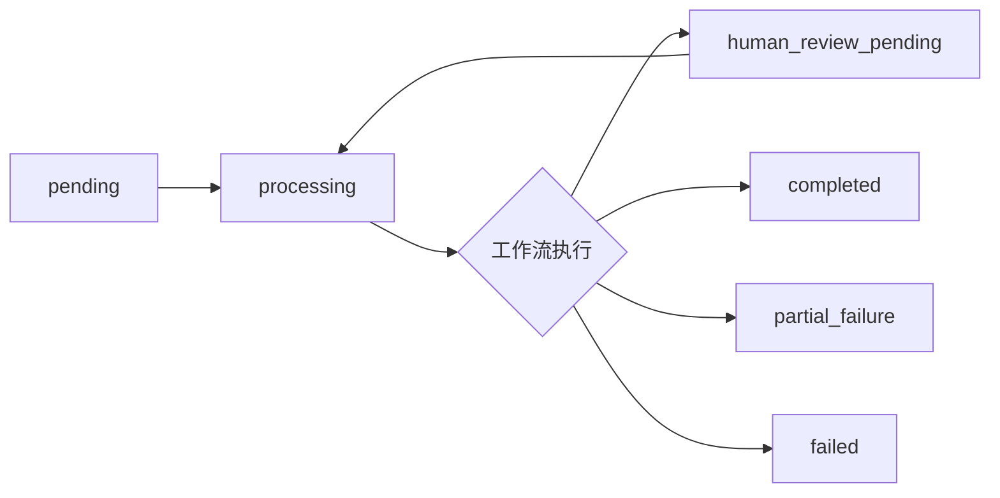
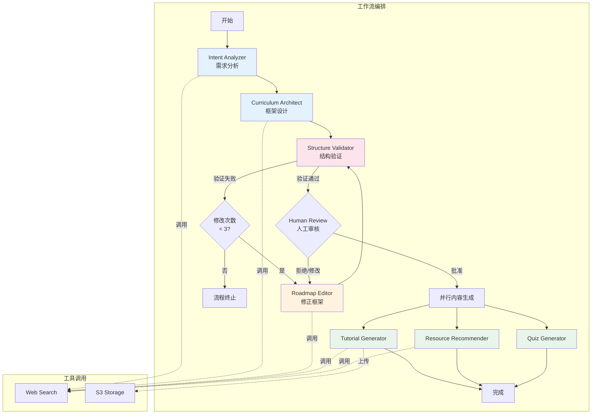
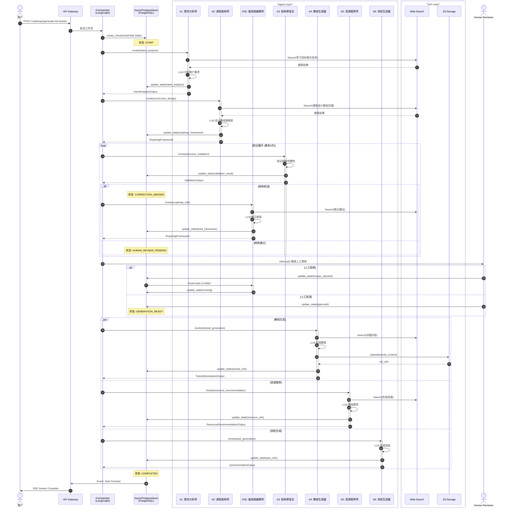
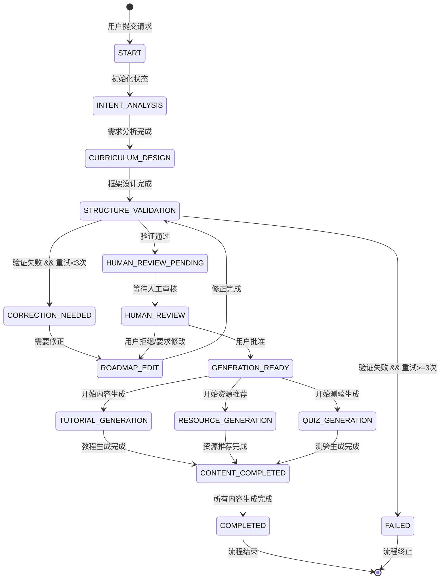

# 后端技术架构文档

## 技术架构概览

### 核心技术栈

| 组件 | 技术选型 | 说明 |
|:---|:---|:---|
| **Web 框架** | FastAPI | 异步高性能 API 框架 |
| **Agent 框架** | LangGraph | 状态机编排，支持 Human-in-the-Loop |
| **状态持久化** | AsyncPostgresSaver | PostgreSQL 异步状态存储 |
| **ORM** | SQLAlchemy | 数据库操作抽象层 |
| **LLM 调用** | LiteLLM | 统一的多模型 API 接口 |
| **数据验证** | Pydantic | 类型安全的数据模型 |
| **模板引擎** | Jinja2 | Prompt 模板渲染 |
| **对象存储** | boto3/aioboto3 | S3 兼容的对象存储客户端 |

### 架构分层

```
┌─────────────────────────────────────────┐
│         API Layer (FastAPI)             │
│  - REST Endpoints                        │
│  - SSE Streaming                         │
│  - WebSocket (可选)                      │
└─────────────────────────────────────────┘
                    ↓
┌─────────────────────────────────────────┐
│    Orchestration Layer (LangGraph)       │
│  - State Machine                         │
│  - Workflow Control                      │
│  - Human-in-the-Loop                     │
└─────────────────────────────────────────┘
                    ↓
┌─────────────────────────────────────────┐
│         Agent Layer (7 Agents)           │
│  - Intent Analyzer                       │
│  - Curriculum Architect                  │
│  - Structure Validator                   │
│  - Roadmap Editor                        │
│  - Tutorial Generator                    │
│  - Resource Recommender                  │
│  - Quiz Generator                        │
└─────────────────────────────────────────┘
                    ↓
┌─────────────────────────────────────────┐
│          Tool Layer                     │
│  - Web Search                           │
│  - S3 Storage                           │
└─────────────────────────────────────────┘
                    ↓
┌─────────────────────────────────────────┐
│      Infrastructure Layer                │
│  - PostgreSQL (State)                    │
│  - S3/OSS (Content)                     │
│  - Redis (Cache, 可选)                  │
└─────────────────────────────────────────┘
```

---

## 状态与阶段枚举定义

### 任务状态枚举 (Task Status)

**表:** `roadmap_tasks.status`

| 状态值 | 说明 | 使用场景 |
|:---|:---|:---|
| `pending` | 待处理 | 任务已创建，等待开始执行 |
| `processing` | 处理中 | 任务正在执行工作流 |
| `human_review_pending` | 等待人工审核 | 工作流在 Human-in-the-Loop 节点暂停 |
| `completed` | 已完成 | 任务成功完成（所有内容生成成功） |
| `partial_failure` | 部分失败 | 框架生成成功，部分内容生成失败 |
| `failed` | 失败 | 任务执行失败（框架生成或关键步骤失败） |

### 内容状态枚举 (Content Status)

**表:** `tutorial_metadata.content_status`, `Concept.content_status`, `Concept.resources_status`, `Concept.quiz_status`

| 状态值 | 说明 | 使用场景 |
|:---|:---|:---|
| `pending` | 待生成 | 内容尚未开始生成 |
| `generating` | 生成中 | 内容正在生成（前端实时状态，不存储到数据库） |
| `completed` | 已完成 | 内容生成成功 |
| `failed` | 失败 | 内容生成失败 |

### 工作流步骤枚举 (Workflow Steps)

**字段:** `roadmap_tasks.current_step`

以下步骤按工作流执行顺序排列：

| 步骤值 | 说明 | 对应 Agent | 阶段 |
|:---|:---|:---|:---|
| `init` | 初始化 | - | 初始化 |
| `queued` | 已入队 | - | 队列中 |
| `starting` | 启动中 | - | 启动 |
| `intent_analysis` | 需求分析 | A1: Intent Analyzer | intent_analysis |
| `curriculum_design` | 课程设计 | A2: Curriculum Architect | curriculum_design |
| `framework_generation` | 框架生成 | A2: Curriculum Architect | curriculum_design |
| `structure_validation` | 结构验证 | A3: Structure Validator | structure_validation |
| `human_review` | 人工审核 | - | human_review |
| `roadmap_edit` | 路线图修正 | A2E: Roadmap Editor | human_review |
| `content_generation` | 内容生成 | A4, A5, A6 | content_generation |
| `tutorial_generation` | 教程生成 | A4: Tutorial Generator | content_generation |
| `resource_recommendation` | 资源推荐 | A5: Resource Recommender | content_generation |
| `quiz_generation` | 测验生成 | A6: Quiz Generator | content_generation |
| `finalizing` | 收尾中 | - | 完成 |
| `completed` | 已完成 | - | 完成 |
| `failed` | 失败 | - | 失败 |

### 前端生成阶段枚举 (Frontend Generation Phases)

**类型:** `GenerationPhase` (TypeScript)

前端将后端的多个步骤聚合为更简洁的阶段显示：

| 阶段值 | 标签 | 说明 | 包含的后端步骤 | 可选 |
|:---|:---|:---|:---|:---|
| `intent_analysis` | 需求分析 | 分析学习目标和用户背景 | `queued`, `starting`, `intent_analysis` | 否 |
| `curriculum_design` | 结构设计 | 设计 Stage-Module-Concept 结构 | `curriculum_design`, `framework_generation` | 否 |
| `structure_validation` | 结构验证 | 验证路线图结构完整性 | `structure_validation` | 是 |
| `human_review` | 人工审核 | 等待确认路线图框架 | `human_review`, `roadmap_edit` | 是 |
| `content_generation` | 内容生成 | 生成教程、测验和资源推荐 | `content_generation`, `tutorial_generation`, `quiz_generation`, `resource_recommendation` | 否 |
| `completed` | 完成 | 路线图生成完成 | `finalizing`, `completed`, `failed` | 否 |

### 人工审核子状态 (Human Review Sub-Status)

**类型:** `HumanReviewSubStatus` (TypeScript)

在 `human_review` 阶段的详细状态：

| 子状态值 | 标签 | 说明 |
|:---|:---|:---|
| `waiting` | 等待审核... | 等待用户批准或拒绝 |
| `editing` | 正在修正... | 用户拒绝，Agent 正在修正框架 |

### 步骤到阶段映射规则

后端 WebSocket 事件 `current_step` → 前端显示阶段 `GenerationPhase`：

```typescript
const stepMap: Record<string, GenerationPhase> = {
  // Intent analysis phase
  'queued': 'intent_analysis',
  'starting': 'intent_analysis',
  'intent_analysis': 'intent_analysis',
  
  // Curriculum design phase
  'curriculum_design': 'curriculum_design',
  'framework_generation': 'curriculum_design',
  
  // Structure validation phase
  'structure_validation': 'structure_validation',
  
  // Human review phase
  'human_review': 'human_review',
  'roadmap_edit': 'human_review',  // 子状态: editing
  
  // Content generation phase
  'content_generation': 'content_generation',
  'tutorial_generation': 'content_generation',
  'quiz_generation': 'content_generation',
  'resource_recommendation': 'content_generation',
  
  // Completed
  'finalizing': 'completed',
  'completed': 'completed',
  'failed': 'completed',
};
```

### 状态流转图



---

## Agent 架构设计

### 7 个 Agent 职责

| Agent ID | 名称 | 职责 | 依赖工具 | 输出 |
|:---|:---|:---|:---|:---|
| **A1** | Intent Analyzer<br/>需求分析师 | 解析用户学习需求，提取关键技术栈、难度画像 | Web Search | `IntentAnalysisOutput` |
| **A2** | Curriculum Architect<br/>课程架构师 | 设计三层学习路线图框架（Stage → Module → Concept） | Web Search | `RoadmapFramework` |
| **A2E** | Roadmap Editor<br/>路线图编辑师 | 基于验证问题修正路线图框架 | Web Search | `RoadmapFramework` |
| **A3** | Structure Validator<br/>结构审查员 | 验证路线图的逻辑性、完整性和合理性 | 无 | `ValidationOutput` |
| **A4** | Tutorial Generator<br/>教程生成器 | 为每个 Concept 生成详细教程内容 | Web Search, S3 Storage | `TutorialGenerationOutput` |
| **A5** | Resource Recommender<br/>资源推荐师 | 为每个 Concept 搜索推荐学习资源 | Web Search | `ResourceRecommendationOutput` |
| **A6** | Quiz Generator<br/>测验生成器 | 为每个 Concept 生成测验题目 | 无 | `QuizGenerationOutput` |

### Agent 架构流程图



### 状态机时序图



### 状态机状态流转



---

## 开发规范

### Agent 开发规范

#### Agent 基类

所有 Agent 必须继承 `BaseAgent` 基类：

```python
from app.agents.base import BaseAgent

class MyAgent(BaseAgent):
    def __init__(self):
        super().__init__(
            agent_id="my_agent",
            model_provider=settings.MY_AGENT_PROVIDER,
            model_name=settings.MY_AGENT_MODEL,
            base_url=settings.MY_AGENT_BASE_URL,
            temperature=0.7,
            max_tokens=4096,
        )
    
    async def process(self, input_data: MyInput) -> MyOutput:
        """Agent 核心处理逻辑"""
        # 1. 加载 Prompt 模板
        prompt = await self.load_prompt("my_agent.j2", context=input_data)
        
        # 2. 调用 LLM
        response = await self.call_llm(prompt)
        
        # 3. 解析输出
        return MyOutput.model_validate(response)
```

#### Agent 职责原则

- **单一职责**：每个 Agent 只负责一个明确的任务
- **输入输出明确**：使用 Pydantic 模型定义输入输出
- **工具调用**：通过 `ToolRegistry` 获取工具，避免直接实例化
- **错误处理**：使用 `tenacity` 实现重试机制
- **日志记录**：使用 `structlog` 记录关键操作

#### Agent 配置

Agent 配置通过环境变量加载：

```bash
# Intent Analyzer
ANALYZER_PROVIDER=openai
ANALYZER_MODEL=gpt-4o-mini
ANALYZER_BASE_URL=
ANALYZER_API_KEY=sk-...

# Curriculum Architect
ARCHITECT_PROVIDER=anthropic
ARCHITECT_MODEL=claude-3-5-sonnet-20241022
ARCHITECT_BASE_URL=
ARCHITECT_API_KEY=sk-ant-...
```

#### Agent 流式输出

支持流式输出的 Agent 应实现 `*_stream` 方法：

```python
async def process_stream(self, input_data: MyInput) -> AsyncIterator[dict]:
    """流式处理，返回 SSE 事件"""
    async for chunk in self.call_llm_stream(prompt):
        yield {
            "type": "chunk",
            "content": chunk,
            "agent": self.agent_id,
        }
    
    result = await self.process(input_data)
    yield {
        "type": "complete",
        "data": result.model_dump(),
        "agent": self.agent_id,
    }
```

### Prompt 开发规范

#### Prompt 模板位置

所有 Prompt 模板存放在 `backend/prompts/` 目录，使用 `.j2` 扩展名（Jinja2 模板）。

#### Prompt 模板结构

```jinja2
{# 1. Role Definition #}
你是 {{ agent_name }}，{{ role_description }}

{# 2. Context Injection #}
当前任务上下文：
- 用户学习目标：{{ user_goal }}
- 已完成步骤：{{ execution_history | join(", ") }}
- 当前阶段：{{ current_step }}

{# 3. Constraints & Rules #}
工作规范：
{{ constraints | to_list }}

{# 4. Input Data #}
用户输入：
{{ input_data | to_json }}

{# 5. Output Format #}
输出必须严格遵循以下 JSON Schema：
{{ output_schema | to_json_schema }}

{# 6. Tool Usage Guide #}
可用工具：

- {{ tool.name }}: {{ tool.description }}


{# 7. Examples (Few-shot) #}

参考示例：
{{ examples | to_markdown }}

```

#### Prompt 加载

使用 `PromptLoader` 加载模板：

```python
from app.utils.prompt_loader import PromptLoader

loader = PromptLoader()
prompt = await loader.load_template(
    "my_agent.j2",
    agent_name="我的 Agent",
    user_goal=user_request.preferences.learning_goal,
    input_data=input_data.model_dump(),
    # ... 其他变量
)
```

#### Prompt 最佳实践

- **明确角色**：清晰定义 Agent 的角色和职责
- **结构化输入**：使用 JSON Schema 约束输出格式
- **Few-shot 示例**：提供 2-3 个高质量示例
- **工具说明**：明确说明何时使用工具，如何使用
- **错误预防**：在 Prompt 中说明常见错误和避免方法

### Tools 开发规范

#### Tool 基类

所有 Tool 必须继承 `BaseTool` 基类：

```python
from app.tools.base import BaseTool
from app.models.domain import MyToolInput, MyToolOutput

class MyTool(BaseTool):
    tool_id = "my_tool_v1"
    
    async def execute(self, input_data: MyToolInput) -> MyToolOutput:
        """工具执行逻辑"""
        # 实现工具逻辑
        return MyToolOutput(...)
```

#### Tool 注册

在 `ToolRegistry` 中注册工具：

```python
# app/core/tool_registry.py
from app.tools.my_tool import MyTool

def _initialize(self):
    self.register(MyTool())
```

#### Tool 调用

Agent 通过 `ToolRegistry` 获取工具：

```python
from app.core.tool_registry import tool_registry

tool = tool_registry.get("my_tool_v1")
if tool:
    result = await tool.execute(input_data)
```

#### Tool 最佳实践

- **幂等性**：工具调用应该是幂等的（相同输入产生相同输出）
- **错误处理**：工具应捕获并返回明确的错误信息
- **异步支持**：所有工具必须是异步的
- **输入验证**：使用 Pydantic 验证输入参数
- **缓存策略**：对于昂贵的操作（如 Web Search），实现缓存机制

### API 开发规范

#### API 路由结构

```python
# app/api/v1/roadmap.py
from fastapi import APIRouter, Depends
from app.models.domain import UserRequest, RoadmapFramework

router = APIRouter(prefix="/roadmaps", tags=["roadmaps"])

@router.post("/generate-full-stream")
async def generate_full_roadmap_stream(
    request: UserRequest,
) -> StreamingResponse:
    """流式生成路线图"""
    return StreamingResponse(
        _generate_sse_stream(request, include_tutorials=True),
        media_type="text/event-stream",
    )
```

#### 数据模型

所有 API 输入输出使用 Pydantic 模型：

```python
from pydantic import BaseModel, Field

class MyRequest(BaseModel):
    """API 请求模型"""
    user_id: str = Field(..., description="用户 ID")
    data: str = Field(..., min_length=1, max_length=1000)
```

#### SSE 流式响应

SSE 事件格式：

```python
async def _generate_sse_stream(request: UserRequest) -> AsyncIterator[str]:
    """生成 SSE 流"""
    # 事件格式：data: {json}\n\n
    yield f'data: {json.dumps(event, ensure_ascii=False)}\n\n'
    
    # 事件类型：
    # - chunk: 流式内容块
    # - complete: 单个步骤完成
    # - error: 错误信息
    # - done: 全部完成
```

#### API 错误处理

```python
from fastapi import HTTPException

@router.get("/roadmaps/{roadmap_id}")
async def get_roadmap(roadmap_id: str):
    roadmap = await roadmap_repo.get(roadmap_id)
    if not roadmap:
        raise HTTPException(status_code=404, detail="路线图不存在")
    return roadmap
```

#### API 文档

- 使用 FastAPI 自动生成的 OpenAPI 文档
- 为每个端点添加详细的 docstring
- 使用 `Field` 的 `description` 参数描述字段

### 数据库开发规范

#### 模型定义

使用 SQLAlchemy ORM 定义模型：

```python
from sqlalchemy import Column, String, DateTime
from app.db.session import Base

class MyModel(Base):
    __tablename__ = "my_table"
    
    id = Column(String, primary_key=True)
    created_at = Column(DateTime, default=datetime.utcnow)
```

#### Repository 模式

使用 Repository 模式封装数据库操作：

```python
from app.db.repositories.base import BaseRepository

class MyRepository(BaseRepository[MyModel]):
    async def get_by_user_id(self, user_id: str) -> List[MyModel]:
        """根据用户 ID 查询"""
        return await self.session.execute(
            select(MyModel).where(MyModel.user_id == user_id)
        )
```

#### 迁移管理

使用 Alembic 管理数据库迁移：

```bash
# 创建迁移
poetry run alembic revision --autogenerate -m "add my table"

# 应用迁移
poetry run alembic upgrade head

# 回滚迁移
poetry run alembic downgrade -1
```

### 测试规范

#### 单元测试

```python
# tests/unit/test_my_agent.py
import pytest
from app.agents.my_agent import MyAgent

@pytest.mark.asyncio
async def test_my_agent_process():
    agent = MyAgent()
    result = await agent.process(input_data)
    assert result.field == expected_value
```

#### 集成测试

```python
# tests/integration/test_workflow.py
@pytest.mark.asyncio
async def test_full_workflow():
    orchestrator = RoadmapOrchestrator()
    result = await orchestrator.run(user_request)
    assert result.roadmap_framework is not None
```

#### 测试最佳实践

- 使用 `pytest` 和 `pytest-asyncio`
- Mock 外部依赖（LLM API、S3 等）
- 使用测试数据库（与生产环境隔离）
- 测试覆盖率目标 > 80%

---

## 目录结构

```
backend/
├── AGENT.md                    # 本文档
├── app/
│   ├── agents/                # Agent 实现
│   │   ├── base.py           # Agent 基类
│   │   ├── intent_analyzer.py
│   │   ├── curriculum_architect.py
│   │   └── ...
│   ├── api/                  # API 路由
│   │   └── v1/
│   │       └── roadmap.py
│   ├── core/                 # 核心编排逻辑
│   │   ├── orchestrator.py  # LangGraph 工作流
│   │   └── tool_registry.py
│   ├── models/               # 数据模型
│   │   ├── domain.py        # Pydantic 模型
│   │   └── database.py       # SQLAlchemy 模型
│   ├── tools/                # 工具实现
│   │   ├── base.py
│   │   ├── search/
│   │   └── storage/
│   ├── db/                   # 数据库相关
│   │   ├── session.py
│   │   └── repositories/
│   └── utils/                # 工具函数
├── prompts/                  # Prompt 模板
│   ├── intent_analyzer.j2
│   └── ...
├── tests/                    # 测试代码
│   ├── unit/
│   ├── integration/
│   └── e2e/
└── docs/                     # 文档
```

---

## 环境变量配置

### 必需配置

```bash
# 数据库
POSTGRES_HOST=localhost
POSTGRES_PORT=5432
POSTGRES_DB=roadmap_agent
POSTGRES_USER=postgres
POSTGRES_PASSWORD=password
CHECKPOINTER_DATABASE_URL=postgresql+asyncpg://...

# S3 存储
S3_ENDPOINT_URL=http://localhost:9000
S3_ACCESS_KEY_ID=minioadmin
S3_SECRET_ACCESS_KEY=minioadmin
S3_BUCKET_NAME=roadmap-content
S3_REGION=us-east-1

# Agent LLM 配置（每个 Agent 都需要）
ANALYZER_PROVIDER=openai
ANALYZER_MODEL=gpt-4o-mini
ANALYZER_API_KEY=sk-...

ARCHITECT_PROVIDER=anthropic
ARCHITECT_MODEL=claude-3-5-sonnet-20241022
ARCHITECT_API_KEY=sk-ant-...

# ... 其他 Agent 配置
```

### 可选配置

```bash
# 跳过某些步骤（开发/测试用）
SKIP_STRUCTURE_VALIDATION=false
SKIP_HUMAN_REVIEW=false
SKIP_TUTORIAL_GENERATION=false
SKIP_RESOURCE_RECOMMENDATION=false
SKIP_QUIZ_GENERATION=false

# Redis（可选）
REDIS_URL=redis://localhost:6379/0

# 日志
LOG_LEVEL=INFO
```

---

## 常见问题

### Q: 如何添加新的 Agent？

1. 在 `app/agents/` 创建新的 Agent 类，继承 `BaseAgent`
2. 在 `prompts/` 创建对应的 Prompt 模板
3. 在 `app/models/domain.py` 定义输入输出模型
4. 在 `orchestrator.py` 的 `_build_graph()` 中添加节点
5. 配置环境变量（`*_PROVIDER`, `*_MODEL`, `*_API_KEY`）

### Q: 如何调试工作流状态？

使用 LangGraph 的检查点功能：

```python
# 获取工作流状态
state = await orchestrator.graph.aget_state({"configurable": {"thread_id": trace_id}})
print(state.values)
```

### Q: 如何处理 Agent 输出格式错误？

在 Prompt 中明确输出格式要求，并在 Agent 中实现重试机制：

```python
@retry(stop=stop_after_attempt(3))
async def process(self, input_data):
    response = await self.call_llm(prompt)
    try:
        return MyOutput.model_validate(response)
    except ValidationError as e:
        # 重试时在 Prompt 中添加错误提示
        raise RetryException(f"输出格式错误: {e}")
```

---

**文档版本**：v1.0.0  
**最后更新**：2025-01-XX  
**维护者**：Backend Team

