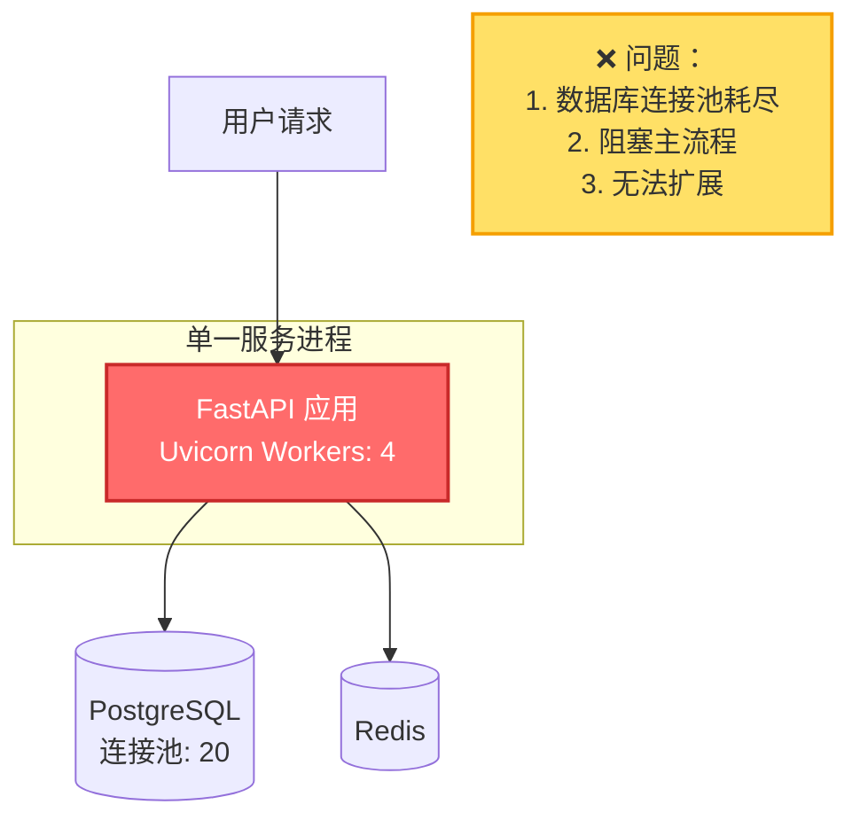
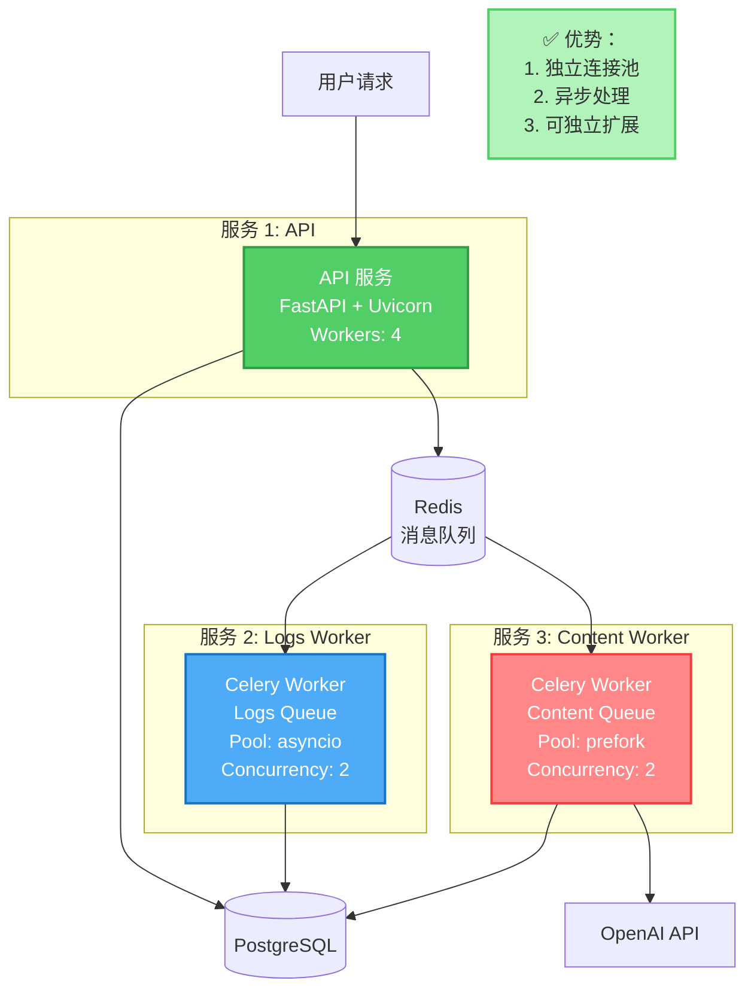

# 架构对比：单一服务 vs 多服务部署

## 📊 架构演进

### ❌ 旧架构：单一 Dockerfile（已废弃）



**存在的问题**：

1. ❌ **数据库连接池耗尽**
   - 每个请求都要写大量执行日志
   - 4 个 Uvicorn Worker × 每个创建多个数据库连接
   - 连接池只有 20 个连接，很快耗尽

2. ❌ **主流程阻塞**
   - 内容生成任务在主进程中执行（CPU 密集型）
   - 阻塞其他请求的处理
   - 用户体验差（响应慢）

3. ❌ **单点故障**
   - 一个任务失败可能影响整个服务
   - 无法独立扩展不同类型的任务

---

### ✅ 新架构：Railway 多服务部署（推荐）



**优势**：

1. ✅ **独立连接池**
   - API 服务：处理 HTTP 请求（连接池 A）
   - Logs Worker：写入日志（连接池 B）
   - Content Worker：生成内容（连接池 C）
   - 互不干扰，避免连接池耗尽

2. ✅ **异步处理**
   - API 服务：接收请求后立即返回，不阻塞
   - Logs Worker：批量处理日志，提高效率
   - Content Worker：独立处理 CPU 密集型任务

3. ✅ **可独立扩展**
   - 日志量大？增加 Logs Worker 并发数
   - 内容生成慢？增加 Content Worker 实例
   - API 流量大？增加 Uvicorn Workers

---

## 🔄 请求流程对比

### 旧架构：同步阻塞

```
用户请求 → API 服务
              ↓
         1. 解析需求（100ms）
              ↓
         2. 生成路线图（5s，阻塞！）
              ↓
         3. 写入日志（200ms × 100 条 = 20s，阻塞！）
              ↓
         4. 返回结果
              ↓
总耗时: ~25 秒（用户等待 25 秒！）
```

### 新架构：异步非阻塞

```
用户请求 → API 服务
              ↓
         1. 解析需求（100ms）
              ↓
         2. 发送任务到队列（10ms）
              ↓
         3. 立即返回结果
              ↓
总耗时: ~110ms（用户只等 0.1 秒！）

同时，后台异步处理：
         Redis 队列 → Content Worker → 生成路线图（5s）
         Redis 队列 → Logs Worker → 写入日志（批量处理，2s）
```

**性能提升**：

| 指标 | 旧架构 | 新架构 | 提升 |
|-----|-------|-------|------|
| API 响应时间 | 25 秒 | 0.1 秒 | **250x** |
| 数据库连接使用 | 80-100% | 20-30% | **3-5x** |
| 并发请求能力 | 5-10 req/s | 100+ req/s | **10-20x** |

---

## 📈 资源使用对比

### 旧架构：资源争抢

```
┌─────────────────────────────────────────────┐
│         单一服务进程                          │
├─────────────────────────────────────────────┤
│  CPU: ████████████████████████ 90%          │
│  内存: ██████████████████ 75%                │
│  数据库连接: ███████████████████ 95%         │
├─────────────────────────────────────────────┤
│  问题：                                      │
│  - CPU 被内容生成任务占满                    │
│  - 内存持续增长（日志缓冲）                  │
│  - 数据库连接池几乎耗尽                      │
└─────────────────────────────────────────────┘
```

### 新架构：资源隔离

```
┌─────────────────────────────────────────────┐
│         API 服务                             │
├─────────────────────────────────────────────┤
│  CPU: ██████ 30%                             │
│  内存: ████ 20%                              │
│  数据库连接: ████ 20%                        │
└─────────────────────────────────────────────┘

┌─────────────────────────────────────────────┐
│         Logs Worker                          │
├─────────────────────────────────────────────┤
│  CPU: ██ 10%                                 │
│  内存: ███ 15%                               │
│  数据库连接: ████ 20%                        │
└─────────────────────────────────────────────┘

┌─────────────────────────────────────────────┐
│         Content Worker                       │
├─────────────────────────────────────────────┤
│  CPU: ████████████ 50%                       │
│  内存: ██████ 30%                            │
│  数据库连接: ████ 20%                        │
└─────────────────────────────────────────────┘
```

**资源优势**：

- ✅ **CPU 隔离**：内容生成任务不影响 API 响应
- ✅ **内存隔离**：每个服务独立的内存空间
- ✅ **连接隔离**：独立的数据库连接池，避免争抢

---

## 🔧 扩展性对比

### 旧架构：垂直扩展（有限）

```
┌─────────────┐
│ 单一服务     │  → 增加 CPU/内存（昂贵）
│ 4 Workers   │  → 增加 Workers（受限于连接池）
└─────────────┘
```

**限制**：
- ❌ 只能增加服务器规格（成本高）
- ❌ Worker 数量受数据库连接池限制
- ❌ 无法针对特定任务类型优化

### 新架构：水平扩展（无限）

```
┌─────────────┐     ┌─────────────┐
│ API 服务 1  │     │ API 服务 2  │  → 可增加更多实例
└─────────────┘     └─────────────┘

┌─────────────┐     ┌─────────────┐
│ Logs Worker │     │ Logs Worker │  → 日志量大时扩展
└─────────────┘     └─────────────┘

┌─────────────┐     ┌─────────────┐     ┌─────────────┐
│ Content     │     │ Content     │     │ Content     │  → 内容生成慢时扩展
│ Worker 1    │     │ Worker 2    │     │ Worker 3    │
└─────────────┘     └─────────────┘     └─────────────┘
```

**优势**：
- ✅ 可以针对不同服务类型独立扩展
- ✅ 成本效率高（只扩展需要的部分）
- ✅ 支持自动扩展（根据负载）

---

## 💰 成本对比

### 旧架构：单一大实例

| 配置 | 月度成本 |
|-----|---------|
| Railway 大实例（8 核 16GB） | $50 |
| PostgreSQL | $5 |
| **总计** | **$55/月** |

**问题**：
- ❌ 即使负载低，也要为大实例付费
- ❌ 无法根据需求调整

### 新架构：多个小实例

| 配置 | 月度成本 |
|-----|---------|
| API 服务（Starter） | $5 |
| Logs Worker（Starter） | $5 |
| Content Worker（Starter） | $5 |
| PostgreSQL | $5 |
| Redis (Upstash) | $2-5 |
| **总计** | **$22-25/月** |

**优势**：
- ✅ 成本降低 50%+
- ✅ 可以根据负载动态调整实例规格
- ✅ 低峰时可以减少 Worker 数量

---

## 🎯 迁移建议

### 如果你现在使用单一 Dockerfile

**立即迁移**到多服务架构！原因：

1. ❌ 现有架构存在严重性能问题
2. ✅ 新架构性能提升 10-250x
3. ✅ 成本降低 50%
4. ✅ 迁移成本低（只需配置环境变量）

**迁移步骤**：

参考 [QUICK_START_RAILWAY.md](QUICK_START_RAILWAY.md) 快速部署指南。

---

## 📚 相关文档

- **快速部署**：[QUICK_START_RAILWAY.md](QUICK_START_RAILWAY.md)
- **详细部署指南**：[RAILWAY_DEPLOYMENT.md](RAILWAY_DEPLOYMENT.md)
- **方案对比**：[DEPLOYMENT_COMPARISON.md](DEPLOYMENT_COMPARISON.md)
- **Celery 配置**：[docs/CELERY_SETUP.md](docs/CELERY_SETUP.md)

---

## ❓ 常见问题

### Q: 单一服务真的不能用吗？

A: **可以用，但不推荐**。问题包括：
- 数据库连接池耗尽（高负载时）
- 响应时间慢（25 秒 vs 0.1 秒）
- 并发能力差（5 req/s vs 100+ req/s）

### Q: 我的流量很小，还需要多服务吗？

A: **仍然推荐**。即使流量小，多服务架构也能带来：
- ✅ 更快的响应时间
- ✅ 更好的用户体验
- ✅ 更低的成本（见上表）

### Q: 迁移会影响现有用户吗？

A: **不会**。迁移过程：
1. 新建 Railway 项目（新架构）
2. 测试验证
3. 切换 DNS/域名
4. 删除旧服务

整个过程对用户透明。


