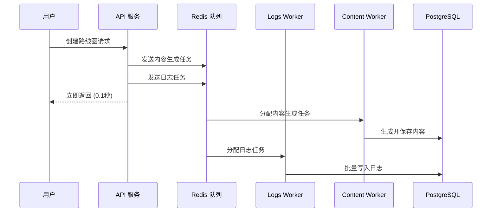

# Railway 多服务部署可视化指南 🎨

## 🎯 回答核心问题

> **问题**：引入 Celery 后，在 Railway 上还能用 Dockerfile 部署吗？
> 
> **答案**：✅ **可以**！使用**多服务部署**架构。

---

## 📊 部署架构图

### Railway 项目结构

```
┌─────────────────────────────────────────────────────────────────┐
│                    Railway Project                              │
├─────────────────────────────────────────────────────────────────┤
│                                                                 │
│  ┌─────────────────┐      ┌─────────────────┐                 │
│  │   PostgreSQL    │      │  Upstash Redis  │                 │
│  │   (Database)    │      │ (Message Queue) │                 │
│  └────────┬────────┘      └────────┬────────┘                 │
│           │                        │                            │
│  ─────────┴────────────────────────┴─────────────────────────  │
│                         ↓                                       │
│  ┌──────────────────────────────────────────────────────────┐ │
│  │ Service 1: roadmap-api                                   │ │
│  │ - SERVICE_TYPE: api                                      │ │
│  │ - Dockerfile: Dockerfile.railway                         │ │
│  │ - Exposed Port: 8000 ✅                                  │ │
│  │ - Public URL: https://roadmap-api-xxx.railway.app        │ │
│  └──────────────────────────────────────────────────────────┘ │
│                                                                 │
│  ┌──────────────────────────────────────────────────────────┐ │
│  │ Service 2: roadmap-celery-logs                           │ │
│  │ - SERVICE_TYPE: celery_logs                              │ │
│  │ - Dockerfile: Dockerfile.railway                         │ │
│  │ - Exposed Port: None ❌ (Background Service)             │ │
│  └──────────────────────────────────────────────────────────┘ │
│                                                                 │
│  ┌──────────────────────────────────────────────────────────┐ │
│  │ Service 3: roadmap-celery-content                        │ │
│  │ - SERVICE_TYPE: celery_content                           │ │
│  │ - Dockerfile: Dockerfile.railway                         │ │
│  │ - Exposed Port: None ❌ (Background Service)             │ │
│  └──────────────────────────────────────────────────────────┘ │
│                                                                 │
└─────────────────────────────────────────────────────────────────┘
```

---

## 🔄 请求处理流程



**关键点**：
- ✅ API 立即响应（0.1 秒）
- ✅ 后台异步处理（5-10 秒）
- ✅ 不阻塞用户请求

---

## 📦 同一个 Dockerfile，3 种启动方式

```
┌─────────────────────────────────────────────────────────────┐
│                 Dockerfile.railway                          │
│                 (共享镜像构建)                               │
└──────────────────────┬──────────────────────────────────────┘
                       │
        ┌──────────────┼──────────────┐
        ↓              ↓              ↓
┌──────────────┐ ┌──────────────┐ ┌──────────────────┐
│ SERVICE_TYPE │ │ SERVICE_TYPE │ │  SERVICE_TYPE    │
│     api      │ │ celery_logs  │ │ celery_content   │
├──────────────┤ ├──────────────┤ ├──────────────────┤
│              │ │              │ │                  │
│   uvicorn    │ │   celery     │ │    celery        │
│   --workers  │ │   worker     │ │    worker        │
│   --port     │ │   --queues   │ │    --queues      │
│   8000       │ │   logs       │ │    content_gen   │
│              │ │              │ │                  │
└──────────────┘ └──────────────┘ └──────────────────┘
     API 服务        日志 Worker      内容 Worker
```

---

## 🔑 关键配置文件

### 1. Dockerfile.railway

```dockerfile
FROM python:3.12-slim

# ... 安装依赖 ...

COPY ./scripts/railway_entrypoint.sh /app/entrypoint.sh
RUN chmod +x /app/entrypoint.sh

# 🎯 关键：使用 entrypoint 脚本
ENTRYPOINT ["/app/entrypoint.sh"]
```

### 2. railway_entrypoint.sh

```bash
#!/bin/bash
SERVICE_TYPE=${SERVICE_TYPE:-api}

case $SERVICE_TYPE in
  api)
    # 🚀 启动 API 服务
    exec uvicorn app.main:app --host 0.0.0.0 --port 8000
    ;;
  celery_logs)
    # 📝 启动日志 Worker
    exec celery -A app.core.celery_app worker --queues=logs
    ;;
  celery_content)
    # 🎨 启动内容 Worker
    exec celery -A app.core.celery_app worker --queues=content_generation
    ;;
esac
```

---

## 🎬 部署步骤（可视化）

```
Step 1: 准备基础设施
┌──────────────┐   ┌──────────────┐
│ PostgreSQL   │   │    Redis     │
│   Plugin     │   │   Plugin     │
└──────────────┘   └──────────────┘
        ↓                  ↓
    DATABASE_URL       REDIS_URL

─────────────────────────────────────────

Step 2: 创建 API 服务
┌─────────────────────────────────────┐
│ Service: roadmap-api                │
│ ─────────────────────────────────── │
│ Dockerfile: Dockerfile.railway      │
│ Env: SERVICE_TYPE=api               │
│ Port: ✅ 8000                        │
└─────────────────────────────────────┘
        ↓
   Public URL 生成

─────────────────────────────────────────

Step 3: 创建 Logs Worker
┌─────────────────────────────────────┐
│ Service: roadmap-celery-logs        │
│ ─────────────────────────────────── │
│ Dockerfile: Dockerfile.railway      │
│ Env: SERVICE_TYPE=celery_logs       │
│ Port: ❌ None (Background)          │
└─────────────────────────────────────┘

─────────────────────────────────────────

Step 4: 创建 Content Worker
┌─────────────────────────────────────┐
│ Service: roadmap-celery-content     │
│ ─────────────────────────────────── │
│ Dockerfile: Dockerfile.railway      │
│ Env: SERVICE_TYPE=celery_content    │
│ Port: ❌ None (Background)          │
└─────────────────────────────────────┘

─────────────────────────────────────────

Step 5: 验证部署 ✅
curl https://your-api.railway.app/health
```

---

## 💰 成本对比（可视化）

### 旧架构：单一大实例

```
┌──────────────────────────────────┐
│ Railway Large Instance           │
│ 8 核 CPU + 16GB RAM              │
│                                  │
│ $$$$$$$$$$$$$$$$$$$$$$$$$$$$$$$$ │
│                                  │
│ 月度成本: $50                    │
└──────────────────────────────────┘
```

### 新架构：多个小实例

```
┌──────────────┐  ┌──────────────┐  ┌──────────────┐
│ API Service  │  │ Logs Worker  │  │Content Worker│
│ Starter      │  │ Starter      │  │ Starter      │
│              │  │              │  │              │
│ $$$$$        │  │ $$$$$        │  │ $$$$$        │
│              │  │              │  │              │
│ $5/月        │  │ $5/月        │  │ $5/月        │
└──────────────┘  └──────────────┘  └──────────────┘
         ↓                ↓                 ↓
     ───────────────────────────────────────────
                总计: $15/月 + 基础设施 ($5-10)
                    = $20-25/月
```

**节省**: $50 - $25 = **$25/月** (50% ↓)

---

## 📈 性能提升（可视化）

### API 响应时间

```
旧架构:
█████████████████████████ 25 秒

新架构:
█ 0.1 秒

提升: 250x ⚡
```

### 并发请求能力

```
旧架构:
█████ 5-10 req/s

新架构:
████████████████████████████████████████████████ 100+ req/s

提升: 10-20x 🚀
```

### 数据库连接使用率

```
旧架构:
████████████████████████████████ 80-100% (接近崩溃)

新架构:
████████ 20-30% (健康)

优化: 3-5x 💚
```

---

## ✅ 部署检查清单

```
准备阶段:
□ 阅读了 QUICK_START_RAILWAY.md
□ 准备了 OpenAI API Key
□ 生成了 JWT Secret Key

基础设施:
□ 创建了 PostgreSQL 服务
□ 创建了 Redis 服务（Upstash）

服务部署:
□ 部署了 API 服务（暴露端口 8000）
□ 部署了 Logs Worker（后台服务）
□ 部署了 Content Worker（后台服务）

验证:
□ API Health Check 返回 200
□ Logs Worker 日志显示 "celery@logs ready"
□ Content Worker 日志显示 "celery@content ready"
□ 创建路线图测试通过

后续:
□ 配置域名（可选）
□ 设置监控（Flower）
□ 优化并发数
```

---

## 🎓 学习路径

### 新用户（5 分钟）

```
1. CELERY_RAILWAY_DEPLOYMENT_SUMMARY.md
   ↓ (了解整体方案)
   
2. QUICK_START_RAILWAY.md
   ↓ (快速部署)
   
3. 在 Railway 创建服务
   ↓
   
4. ✅ 部署完成
```

### 深度配置（30 分钟）

```
1. DEPLOYMENT_COMPARISON.md
   ↓ (选择方案)
   
2. ARCHITECTURE_COMPARISON.md
   ↓ (理解架构)
   
3. RAILWAY_DEPLOYMENT.md
   ↓ (详细配置)
   
4. ✅ 优化和监控
```

---

## 🔗 快速链接

| 需求 | 文档 | 时间 |
|-----|------|------|
| 快速部署 | `QUICK_START_RAILWAY.md` | 5 分钟 |
| 理解方案 | `CELERY_RAILWAY_DEPLOYMENT_SUMMARY.md` | 10 分钟 |
| 选择方案 | `DEPLOYMENT_COMPARISON.md` | 15 分钟 |
| 深入理解 | `ARCHITECTURE_COMPARISON.md` | 20 分钟 |
| 故障排查 | `RAILWAY_DEPLOYMENT.md#故障排查` | 按需 |
| 文件索引 | `NEW_FILES_SUMMARY.md` | 5 分钟 |

---

## 🎉 总结

### 问题
❓ 引入 Celery 后，在 Railway 上还能用 Dockerfile 部署吗？

### 答案
✅ **可以**！使用多服务部署：

1. **同一个 Dockerfile** (`Dockerfile.railway`)
2. **3 个独立服务**（通过 `SERVICE_TYPE` 区分）
3. **性能提升 10-250x**
4. **成本降低 50%**

### 下一步
📚 阅读 `QUICK_START_RAILWAY.md` 开始部署！

---

**文档版本**: v1.0  
**创建日期**: 2025-12-27  
**作者**: Roadmap Agent Team


