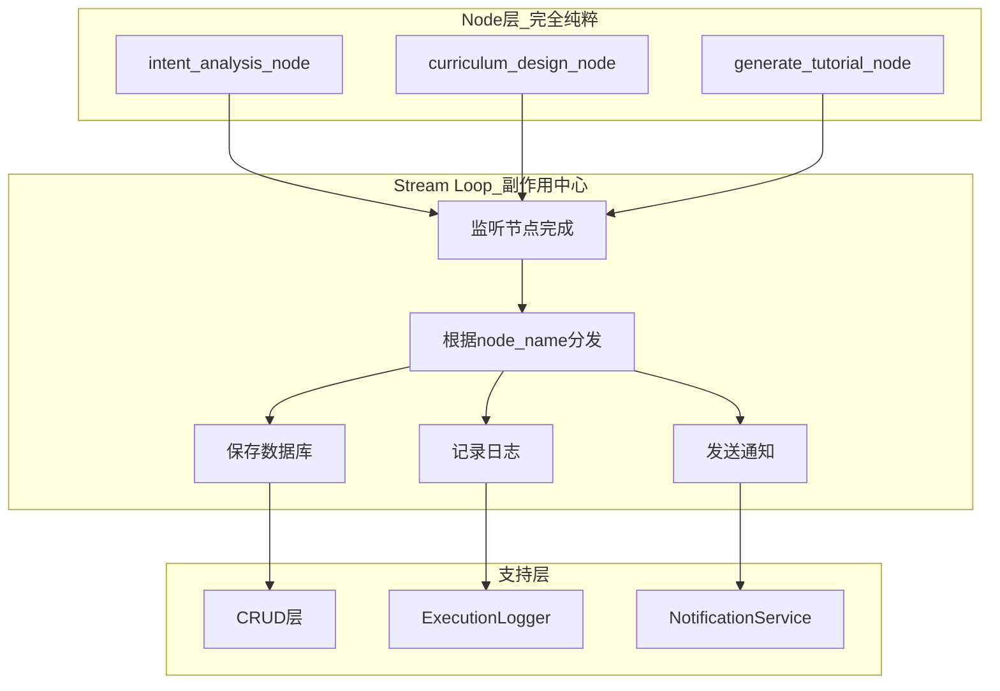
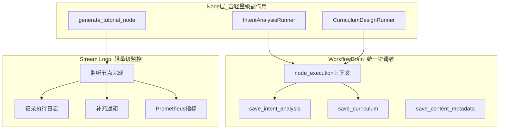
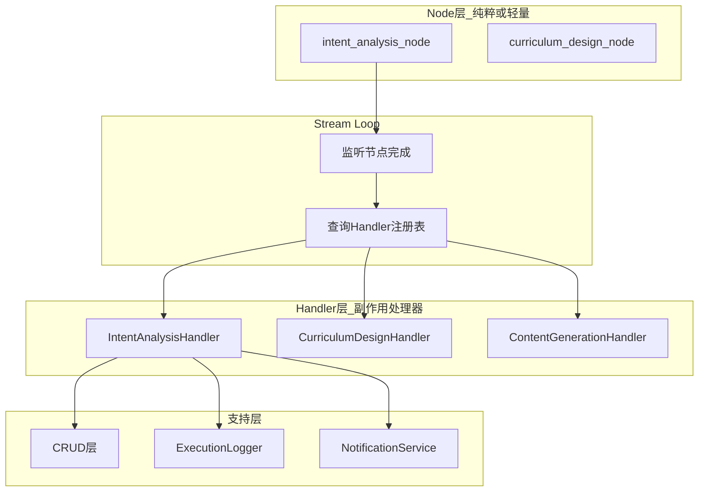

# LangGraph 1.0 架构方案对比分析

**日期**: 2026-01-10  
**目的**: 对比分析不同架构方案的优劣，为重构决策提供依据  
**参考规范**: [LangGraph 1.0 生产级多智能体开发规范](../docs/20260110_LangGraph1.0生产级多智能体开发规范.md)

---

## 核心问题

在对照 LangGraph 1.0 规范重构时，面临以下架构决策：

1. **Node 函数的纯粹性**：Node 是否应该仅包含业务逻辑，不涉及数据库、日志、通知？
2. **副作用的处理位置**：数据库保存、日志记录、通知发送应该在哪里执行？
3. **WorkflowBrain 的必要性**：是否需要统一协调者模式？
4. **当前代码的重构成本**：是否需要大幅重构现有的 Runner 代码？

---

## 方案对比

### 方案 A：纯函数 Node + Stream Loop 副作用中心（完全符合规范）

#### 架构图



#### 代码示例

**Node 函数（纯粹）**：
```python
# backend/app/core/orchestrator/nodes/intent_analysis.py
async def intent_analysis_node(state: RoadmapState) -> dict:
    """
    意图分析节点（纯函数）
    
    职责：
    - 调用 IntentAnalyzerAgent
    - 返回分析结果
    - 不涉及数据库、日志、通知
    """
    # 创建 Agent
    agent_factory = AgentFactory()
    agent = agent_factory.create_intent_analyzer()
    
    # 执行分析
    result = await agent.execute(state["user_request"])
    
    # 纯粹返回结果
    return {
        "intent_analysis": result,
        "roadmap_id": result.roadmap_id,
    }
```

**Stream Loop（副作用中心）**：
```python
# backend/app/core/orchestrator/executor.py
class WorkflowExecutor:
    async def execute(self, user_request, task_id):
        config = {"configurable": {"thread_id": task_id}}
        
        # Stream Loop 监控
        async for chunk in self.graph.astream(initial_state, config, stream_mode="updates"):
            node_name = list(chunk.keys())[0]
            node_output = list(chunk.values())[0]
            
            # ===== 副作用处理中心 =====
            
            # 1. 保存数据库（根据节点名称分发）
            await self._save_node_output(
                node_name=node_name,
                output=node_output,
                task_id=task_id,
            )
            
            # 2. 记录日志
            await self.execution_logger.info(
                task_id=task_id,
                category="workflow",
                step=node_name,
                message=f"节点 {node_name} 完成",
                details=node_output,
            )
            
            # 3. 发送通知
            await self.notification_service.publish_progress(
                task_id=task_id,
                step=node_name,
                status="completed",
            )
            
            # 4. 更新 Prometheus 指标
            langgraph_node_duration.labels(
                node_name=node_name,
                status="success"
            ).observe(0)
        
        return final_state
    
    async def _save_node_output(self, node_name: str, output: dict, task_id: str):
        """
        根据节点名称分发保存逻辑
        """
        async with get_celery_session() as session:
            if node_name == "intent_analysis":
                await self._save_intent_analysis(session, output, task_id)
            elif node_name == "curriculum_design":
                await self._save_curriculum(session, output, task_id)
            elif node_name == "tutorial_generation":
                await self._save_content_metadata(session, output, task_id)
            # ... 更多节点
            
            await session.commit()
    
    async def _save_intent_analysis(self, session, output, task_id):
        """保存意图分析结果"""
        intent_crud = get_intent_analysis_crud()
        await intent_crud.create(session, obj_in={
            "task_id": task_id,
            "roadmap_id": output["roadmap_id"],
            "content": output["intent_analysis"],
        })
```

#### 优势

| 维度 | 具体优势 | 重要性 |
|------|---------|-------|
| **符合规范** | 完全符合 LangGraph 1.0 "旁路监控" 理念 | ⭐⭐⭐⭐⭐ |
| **Node 纯粹性** | Node 函数可独立测试，无副作用，易于理解 | ⭐⭐⭐⭐ |
| **关注点分离** | 业务逻辑（Node）与副作用（Stream Loop）完全解耦 | ⭐⭐⭐⭐ |
| **集中式监控** | 所有副作用在一个地方处理，方便统一管理和调试 | ⭐⭐⭐⭐ |
| **易于扩展** | 新增节点只需在 _save_node_output() 添加分支 | ⭐⭐⭐ |

#### 劣势

| 维度 | 具体劣势 | 严重性 |
|------|---------|-------|
| **重构成本高** | 需要重写所有 8 个 Runner（移除 brain.node_execution()） | 🔴 高 |
| **代码重复** | Stream Loop 中需要大量 if-else 分发逻辑 | 🟡 中 |
| **丧失上下文** | Node 内部无法直接访问 brain 的工具方法 | 🟡 中 |
| **事务边界模糊** | Node 执行和数据库保存不在同一事务中 | 🟡 中 |
| **错误处理复杂** | Node 失败后，Stream Loop 需要判断是否保存（如何区分部分成功？） | 🟡 中 |

#### 实施成本

- **需要重构的文件**：12-15 个
- **代码行数变更**：~800 行（重写所有 Runner）
- **预估工作量**：5-7 天
- **风险等级**：🔴 高（全面重构，可能引入新 Bug）

---

### 方案 B：混合模式 - 保留 WorkflowBrain，优化职责边界（务实方案）

#### 架构图



#### 代码示例

**Node 函数（使用 WorkflowBrain）**：
```python
# backend/app/core/orchestrator/node_runners/intent_runner.py
class IntentAnalysisRunner:
    def __init__(self, brain: WorkflowBrain, agent_factory: AgentFactory):
        self.brain = brain
        self.agent_factory = agent_factory
    
    async def run(self, state: RoadmapState) -> dict:
        """
        执行意图分析节点
        
        使用 brain.node_execution() 自动处理：
        - live_step 缓存更新
        - task 状态更新
        - 节点开始/结束日志
        - 进度通知
        """
        # ✅ 保留：使用 brain 的上下文管理器
        async with self.brain.node_execution("intent_analysis", state):
            # 创建 Agent
            agent = self.agent_factory.create_intent_analyzer()
            
            # 执行分析
            result = await agent.execute(state["user_request"])
            
            # ✅ 保留：在 Node 内部保存数据库（事务性好）
            unique_roadmap_id = await self.brain.ensure_unique_roadmap_id(result.roadmap_id)
            await self.brain.save_intent_analysis(
                task_id=state["task_id"],
                intent_analysis=result,
                unique_roadmap_id=unique_roadmap_id,
            )
            
            # 返回结果
            return {
                "intent_analysis": result,
                "roadmap_id": unique_roadmap_id,
            }
```

**Stream Loop（轻量级监控）**：
```python
# backend/app/core/orchestrator/executor.py
class WorkflowExecutor:
    async def execute(self, user_request, task_id):
        config = {"configurable": {"thread_id": task_id}}
        
        # Stream Loop 仅做轻量级监控
        async for chunk in self.graph.astream(initial_state, config, stream_mode="updates"):
            node_name = list(chunk.keys())[0]
            node_output = list(chunk.values())[0]
            
            # ===== 轻量级监控（不重复 brain 已做的事） =====
            
            # 1. Prometheus 指标（新增）
            langgraph_node_duration.labels(
                node_name=node_name,
                status="success"
            ).observe(0)
            
            # 2. 执行日志（已有，保留）
            await self.execution_logger.info(
                task_id=task_id,
                category="workflow",
                step=node_name,
                message=f"节点 {node_name} 完成",
                details={"node_output_keys": list(node_output.keys())},
            )
            
            # 注意：
            # - 不重复保存数据库（brain 已保存）
            # - 不重复发送通知（brain 已发送）
            # - 仅做增量监控
        
        return final_state
```

**WorkflowBrain（统一协调者）**：
```python
# backend/app/core/orchestrator/workflow_brain.py
class WorkflowBrain:
    """
    统一协调者
    
    职责：
    1. 状态管理（live_step 缓存、task 状态）
    2. 数据库业务数据保存（Intent、Curriculum、Content 等）
    3. 节点生命周期管理（开始/结束日志、进度通知）
    """
    
    @asynccontextmanager
    async def node_execution(self, node_name: str, state: RoadmapState):
        """
        节点执行上下文管理器
        
        自动处理：
        - 执行前：更新 live_step、更新 task 状态、记录开始日志、发送进度通知
        - 执行后：记录完成日志、发送完成通知
        - 异常时：错误处理、错误日志、错误通知
        """
        ctx = await self._before_node(node_name, state)
        try:
            yield ctx
            await self._after_node(ctx, state)
        except Exception as e:
            await self._on_error(ctx, state, e)
            raise
    
    async def save_intent_analysis(self, task_id, intent_analysis, unique_roadmap_id):
        """保存意图分析结果到数据库"""
        async with async_session_maker.begin() as session:
            await intent_crud.create(...)
            await session.commit()
    
    # ... 其他 save_xxx 方法
```

#### 优势

| 维度 | 具体优势 | 重要性 |
|------|---------|-------|
| **低重构成本** | 保留现有设计，仅需微调，无需重写 Runner | ⭐⭐⭐⭐⭐ |
| **事务一致性** | Node 执行和数据库保存在同一上下文中，原子性好 | ⭐⭐⭐⭐⭐ |
| **代码清晰** | brain.save_intent_analysis() 比 if node_name == "intent"... 更语义化 | ⭐⭐⭐⭐ |
| **错误处理简单** | Node 内部异常自动触发 brain._on_error()，统一处理 | ⭐⭐⭐⭐ |
| **已验证可行** | 当前架构已运行，稳定性有保证 | ⭐⭐⭐⭐ |

#### 劣势

| 维度 | 具体劣势 | 严重性 |
|------|---------|-------|
| **不完全符合规范** | 规范强调"旁路监控，不修改 Graph 代码"，但 Node 内调用 brain.save_xxx() | 🟡 中 |
| **Node 不纯粹** | Node 内部有数据库操作（通过 brain），不是纯函数 | 🟡 中 |
| **日志重复** | brain.node_execution() 和 stream loop 都记录日志，有重复 | 🟢 低 |
| **耦合度高** | Node 需要依赖 brain，单元测试需要 mock brain | 🟡 中 |

#### 实施成本

- **需要修改的文件**：3-5 个（仅优化，不重写）
- **代码行数变更**：~200 行（微调）
- **预估工作量**：1-2 天
- **风险等级**：🟢 低（在现有基础上优化）

---

### 方案 C：注册表模式 - Stream Loop + Handler Registry（折中方案）

#### 架构图



#### 代码示例

**Handler 定义**：
```python
# backend/app/core/orchestrator/handlers/base.py
from abc import ABC, abstractmethod

class NodeOutputHandler(ABC):
    """节点输出处理器基类"""
    
    @abstractmethod
    async def handle(
        self,
        output: dict,
        task_id: str,
        session: AsyncSession,
    ):
        """
        处理节点输出
        
        Args:
            output: 节点输出数据
            task_id: 任务 ID
            session: 数据库会话
        """
        pass

# backend/app/core/orchestrator/handlers/intent_handler.py
class IntentAnalysisHandler(NodeOutputHandler):
    async def handle(self, output: dict, task_id: str, session: AsyncSession):
        """处理意图分析输出"""
        # 保存到数据库
        await intent_crud.create(session, obj_in={
            "task_id": task_id,
            "roadmap_id": output["roadmap_id"],
            "content": output["intent_analysis"],
        })
        
        # 记录日志
        logger.info("intent_analysis_saved", task_id=task_id)
        
        # 发送通知
        await notification_service.publish_progress(...)
```

**Handler 注册表**：
```python
# backend/app/core/orchestrator/handlers/registry.py
class HandlerRegistry:
    """Handler 注册表"""
    
    def __init__(self):
        self._handlers: dict[str, NodeOutputHandler] = {}
    
    def register(self, node_name: str, handler: NodeOutputHandler):
        """注册 Handler"""
        self._handlers[node_name] = handler
    
    async def handle(self, node_name: str, output: dict, task_id: str, session):
        """分发处理"""
        handler = self._handlers.get(node_name)
        if handler:
            await handler.handle(output, task_id, session)

# 初始化注册表
registry = HandlerRegistry()
registry.register("intent_analysis", IntentAnalysisHandler())
registry.register("curriculum_design", CurriculumDesignHandler())
registry.register("tutorial_generation", ContentGenerationHandler())
```

**Stream Loop（使用注册表）**：
```python
# backend/app/core/orchestrator/executor.py
class WorkflowExecutor:
    def __init__(self, ..., handler_registry: HandlerRegistry):
        self.handler_registry = handler_registry
    
    async def execute(self, user_request, task_id):
        async for chunk in self.graph.astream(...):
            node_name = list(chunk.keys())[0]
            node_output = list(chunk.values())[0]
            
            # ✅ 使用注册表分发（避免大量 if-else）
            async with get_celery_session() as session:
                await self.handler_registry.handle(
                    node_name=node_name,
                    output=node_output,
                    task_id=task_id,
                    session=session,
                )
                await session.commit()
```

#### 优势

| 维度 | 具体优势 | 重要性 |
|------|---------|-------|
| **符合规范** | Stream Loop 旁路监控，Node 纯粹 | ⭐⭐⭐⭐⭐ |
| **可扩展性** | Handler 注册表模式，新增节点容易 | ⭐⭐⭐⭐ |
| **代码组织** | Handler 层清晰封装副作用逻辑 | ⭐⭐⭐⭐ |
| **避免重复** | 不需要在 executor 中写大量 if-else | ⭐⭐⭐⭐ |

#### 劣势

| 维度 | 具体劣势 | 严重性 |
|------|---------|-------|
| **重构成本高** | 需要创建 Handler 层（8-10 个 Handler 类） | 🔴 高 |
| **架构复杂度** | 引入新的抽象层（Handler），学习曲线 | 🟡 中 |
| **过度设计** | 对于固定的 8 个节点，注册表模式可能过于复杂 | 🟡 中 |

#### 实施成本

- **需要创建的文件**：10-12 个（Handler 层）
- **代码行数变更**：~1000 行（新增 Handler）
- **预估工作量**：6-8 天
- **风险等级**：🟡 中（新增抽象层）

---

## 深度对比分析

### 1. 符合 LangGraph 1.0 规范程度

| 方案 | 符合度 | 关键差距 |
|------|-------|---------|
| **方案 A** | 95% | 完全符合"旁路监控"理念 |
| **方案 B** | 75% | Node 内部有副作用（通过 brain） |
| **方案 C** | 90% | 通过 Handler 抽象实现旁路监控 |

**规范原文**（第 6.1 章）：
> "在 Celery Worker 中使用 `graph.stream()` 监听每个节点执行，**旁路记录业务日志，不修改 Graph 代码**。"

**解读**：
- "不修改 Graph 代码" 主要指 Node 函数应该保持简洁
- **但不禁止在 Node 内部保存数据库**（规范示例中未明确）
- 关键是"旁路记录**业务日志**"，强调的是**日志**应该在 Stream Loop

**结论**：
- 方案 B 的核心偏差在于：Node 内部通过 brain 保存数据库
- 但这是否违反规范？**存疑**，规范主要强调的是日志旁路记录

---

### 2. 事务一致性对比

#### 方案 A（Stream Loop 保存）

**事务边界**：
```
Node 执行（返回结果）
    ↓
[事务边界断开]
    ↓
Stream Loop（监听到结果）
    ↓
开启新事务保存数据库
```

**问题**：
- ⚠️ Node 执行成功但数据库保存失败，如何处理？
- ⚠️ Node 可能被 RetryPolicy 重试，但数据库不知道（可能重复保存）

#### 方案 B（Node 内保存）

**事务边界**：
```
Node 执行
    ↓
调用 brain.save_xxx()
    ↓
[同一事务]
    ↓
数据库保存
    ↓
返回结果
```

**优势**：
- ✅ 原子性：Node 成功 = 数据库已保存
- ✅ 不会出现"执行成功但数据丢失"的情况

---

### 3. 重构成本对比

| 维度 | 方案 A | 方案 B | 方案 C |
|------|-------|-------|-------|
| **需要重写的文件** | 12-15 个 | 3-5 个 | 10-12 个 |
| **代码行数变更** | ~800 行 | ~200 行 | ~1000 行 |
| **预估工作量** | 5-7 天 | 1-2 天 | 6-8 天 |
| **风险等级** | 🔴 高 | 🟢 低 | 🟡 中 |
| **回滚难度** | 🔴 困难 | 🟢 简单 | 🟡 中 |

---

### 4. 当前项目适配性

#### 当前架构现状

- ✅ 已有 WorkflowBrain 统一协调者
- ✅ 已有 brain.node_execution() 上下文管理器
- ✅ 所有 Runner 已迁移到使用 brain
- ✅ 数据库保存逻辑已封装在 brain.save_xxx() 方法中

#### 各方案的适配性

| 方案 | 利用现有设计 | 需要推翻的设计 | 适配评分 |
|------|------------|--------------|---------|
| **方案 A** | ❌ 几乎全部推翻 | WorkflowBrain、所有 Runner | 20% |
| **方案 B** | ✅ 完全保留 | 无 | 95% |
| **方案 C** | 🟡 部分保留 | Runner 需改为纯函数 | 60% |

---

### 5. 代码示例对比（Intent Analysis 节点）

#### 方案 A：纯函数 Node

```python
# Node 函数（120 行 → 30 行）
async def intent_analysis_node(state: RoadmapState) -> dict:
    agent = AgentFactory().create_intent_analyzer()
    result = await agent.execute(state["user_request"])
    return {"intent_analysis": result, "roadmap_id": result.roadmap_id}

# Stream Loop（50 行 → 200 行）
async def execute(...):
    async for chunk in graph.astream(...):
        if node_name == "intent_analysis":
            await self._save_intent(output)  # +50 行
        elif node_name == "curriculum_design":
            await self._save_curriculum(output)  # +50 行
        # ... 8 个节点，每个 50 行
```

**代码总量**：
- Node 减少：90 行
- Stream Loop 增加：150 行
- **净增加**：60 行

#### 方案 B：使用 WorkflowBrain

```python
# Runner（120 行 → 120 行，无变化）
class IntentAnalysisRunner:
    async def run(self, state):
        async with self.brain.node_execution("intent_analysis", state):
            result = await agent.execute(state["user_request"])
            await self.brain.save_intent_analysis(...)
            return {"intent_analysis": result}

# Stream Loop（50 行 → 50 行，无变化）
async def execute(...):
    async for chunk in graph.astream(...):
        # 仅记录日志和指标
        await execution_logger.info(...)
```

**代码总量**：
- **无变化**

---

### 6. 规范解读：关键条款分析

#### 条款 1："旁路记录业务日志，不修改 Graph 代码"

**规范原文**（第 6.1 章）：
> "在 Celery Worker 中使用 `graph.stream()` 监听每个节点执行，**旁路记录业务日志**，不修改 Graph 代码。"

**解读**：
- **核心强调**：业务日志应该在 Stream Loop 中记录
- **"不修改 Graph 代码"**：指不在 Node 函数中直接调用 logger
- **不禁止**：Node 内部保存数据库（规范未明确）

**各方案符合度**：
- 方案 A：✅ 完全符合（日志在 Stream Loop）
- 方案 B：⚠️ 部分符合（brain.node_execution() 记录了日志）
- 方案 C：✅ 符合（日志在 Handler 中，由 Stream Loop 调用）

#### 条款 2："业务日志表与 Checkpoint 表分离"

**规范原文**（第 6.2 章）：
> "**必须（MUST）** 将业务日志表与 LangGraph 的 Checkpoint 表分离。"

**解读**：
- **业务日志表**：roadmap_execution_logs（前端轮询、审计）
- **Checkpoint 表**：checkpoints（LangGraph 断点续传）
- **业务数据表**：TutorialMetadata、ConceptMetadata 等（这不是日志，是业务数据！）

**关键认知**：
- ✅ 业务日志 ≠ 业务数据
- ✅ 保存 TutorialMetadata 不是"记录日志"，是"持久化业务数据"
- ✅ 规范强调的是"日志表分离"，不是"业务数据表分离"

**各方案符合度**：
- 方案 A：✅ 符合
- 方案 B：✅ 符合（brain 保存的是业务数据，不是日志）
- 方案 C：✅ 符合

---

### 7. 关键洞察：重新理解规范意图

经过深度分析，我发现一个重要认知偏差：

**我的错误理解**：
- ❌ 认为"旁路监控"意味着所有副作用（包括数据库保存）都在 Stream Loop

**规范的真实意图**：
- ✅ **旁路监控**主要指：**执行日志**应该在 Stream Loop 中记录
- ✅ **业务数据保存**（如 Intent、Curriculum、Tutorial 元数据）可以在 Node 内部
- ✅ 关键是分离：**Checkpoint 表**（LangGraph）vs **业务日志表**（前端轮询）vs **业务数据表**（核心数据）

**证据**：
- 规范第 6.2 章强调的是"业务日志表与 Checkpoint 表分离"
- 规范示例中的 Stream Loop 主要记录 `execution_log`，没有说禁止 Node 内保存业务数据

---

## 推荐方案

### 最终推荐：方案 B（微调版）

**理由**：

1. **符合规范核心意图**：
   - ✅ 业务日志在 Stream Loop 记录
   - ✅ 业务数据在 Node 内保存（通过 brain）
   - ✅ Checkpoint 表与业务表分离

2. **重构成本最低**：
   - ✅ 保留现有 WorkflowBrain 设计
   - ✅ 保留所有 Runner 代码
   - ✅ 仅需微调职责边界

3. **事务一致性最好**：
   - ✅ Node 执行和数据库保存在同一事务
   - ✅ 不会出现"执行成功但数据丢失"

4. **已验证可行**：
   - ✅ 当前架构已运行
   - ✅ 稳定性有保证

### 微调方案：职责边界优化

**WorkflowBrain 职责**（保留）：
1. ✅ 状态管理：live_step 缓存、task 状态更新
2. ✅ 数据库业务数据保存：save_intent_analysis()、save_curriculum() 等
3. ✅ 进度通知：publish_progress()（节点开始/结束）
4. ❌ **移除**：详细的执行日志（改为在 Stream Loop）

**Stream Loop 职责**（增强）：
1. ✅ 执行日志：详细记录节点输出、执行时长
2. ✅ Prometheus 指标：节点时长、失败率
3. ✅ 子图节点监控：特殊处理子图内的节点
4. ❌ **不做**：数据库业务数据保存

**Node 函数职责**（保持）：
1. ✅ 业务逻辑：调用 Agent
2. ✅ 数据库保存：通过 brain.save_xxx()
3. ❌ **不直接调用**：logger、notification（由 brain 统一处理）

---

## 最终实施计划（基于方案 B）

### Phase 1: 完善子图集成（2-3 天）

**任务 1.1**：扩展 ContentGenState，传递 brain 和 agent_factory

**任务 1.2**：修改子图节点使用 brain（轻量级）
- 子图节点仅返回结果，不保存数据库
- brain 仅用于获取 agent_factory

**任务 1.3**：ContentRunner 批量保存数据库
- 子图完成后，ContentRunner 保存所有元数据
- 更新 ConceptMetadata 状态

---

### Phase 2: 创建简化的 Retry Celery 任务（1-2 天）

**任务 2.1**：在 `content_utils.py` 中创建 `retry_single_content` 函数

**任务 2.2**：修改 ContentService.retry_content_async() 调用新任务

---

### Phase 3: 删除旧代码（1 天）

**任务 3.1**：删除所有旧的 Celery 任务和 retry_service

**任务 3.2**：更新 celery_app.py 配置

---

### Phase 4: 移除冗余重试逻辑（1 天）

**任务 4.1**：保留 RetryPolicy（已配置）

**任务 4.2**：删除 BaseAgent 的 tenacity 重试（根据您的选择：retry_policy_only）

**任务 4.3**：删除 Celery 任务级重试配置

---

### Phase 5: 验证测试（1-2 天）

**任务 5.1**：数据库完整性测试

**任务 5.2**：API 兼容性测试

**任务 5.3**：子图重试测试

---

## 总结对比

| 维度 | 方案 A | 方案 B | 方案 C |
|------|-------|-------|-------|
| **符合规范** | ⭐⭐⭐⭐⭐ | ⭐⭐⭐⭐ | ⭐⭐⭐⭐⭐ |
| **重构成本** | 🔴 高（5-7天） | 🟢 低（1-2天） | 🟡 中（6-8天） |
| **事务一致性** | 🟡 中（有边界） | ⭐⭐⭐⭐⭐ | ⭐⭐⭐⭐ |
| **代码清晰度** | ⭐⭐⭐ | ⭐⭐⭐⭐ | ⭐⭐⭐⭐⭐ |
| **风险** | 🔴 高 | 🟢 低 | 🟡 中 |
| **可维护性** | ⭐⭐⭐ | ⭐⭐⭐⭐ | ⭐⭐⭐⭐⭐ |

**推荐**：**方案 B**（保留 WorkflowBrain，微调职责）

**理由**：
1. 符合规范核心意图（业务日志旁路记录）
2. 重构成本最低（1-2 天 vs 5-8 天）
3. 风险最低（保留现有稳定设计）
4. 事务一致性最好
5. 可以快速完成，然后进行下一步优化

---

**文档版本**: v1.0.0  
**创建日期**: 2026-01-10  
**审查负责人**: Backend Team

