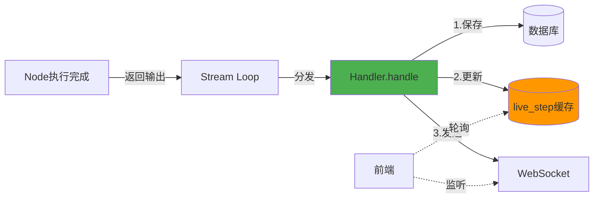
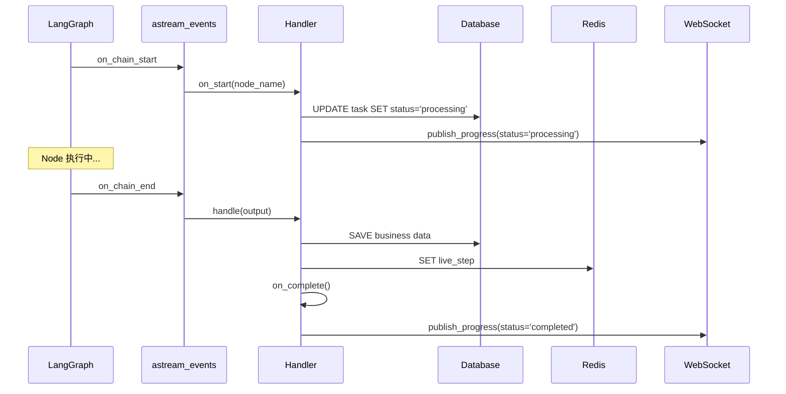

# Handler 模式优化 - live_step 集成

**日期**: 2026-01-12  
**优化类型**: 架构微调  
**目的**: 将 live_step 缓存更新集成到 Handler.handle() 中

---

## 优化背景

### 问题发现

在重构完成后发现：`handler_registry.on_start` 没有被调用，因为：

1. **LangGraph 限制**: 无法在节点执行前获取"即将执行的节点名称"
2. **条件边问题**: 在节点完成前无法确定下一个节点（如 validation → edit 或 review）
3. **checkpoint.next 的局限**: 只能在节点完成后才知道下一个节点

### 技术约束

**LangGraph 不提供**:
- ❌ 获取"当前正在运行节点"的接口
- ❌ 节点开始事件的监听机制
- ❌ 节点生命周期 Hook

**LangGraph 只提供**:
- ✅ `stream_mode="updates"`: 节点完成后的输出
- ✅ `stream_mode="values"`: 完整状态更新
- ✅ `stream_mode="debug"`: 调试信息（但仍是完成后）

---

## 优化方案

### 关键发现

通过查阅 LangGraph 官方文档，发现可以使用 **`astream_events(version="v2")`** 来监听完整的节点生命周期：

- ✅ `on_chain_start`: 节点开始执行时触发
- ✅ `on_chain_end`: 节点执行完成时触发
- ✅ 支持子图节点的生命周期监听

### 核心思想

**使用 astream_events 实现完整的节点生命周期监听**:

1. **on_chain_start**: 调用 `handler.on_start()` → 更新 task 状态为 "processing"
2. **on_chain_end**: 调用 `handler.handle()` + `on_complete()` → 保存数据 + 更新 live_step

### 架构设计



### 关键决策

| 决策点 | 选择 | 理由 |
|-------|------|------|
| **状态更新时机** | 节点完成后 | 保证一致性（不会出现"执行中但未完成"的中间态） |
| **实时进度来源** | Redis `live_step` + WebSocket | 毫秒级响应，满足实时性要求 |
| **on_start 去留** | 保留但不强制使用 | 为特殊场景预留扩展点 |
| **live_step 更新位置** | Handler.handle() 中 | 统一在节点完成后更新 |

---

## 实现细节

### 1. Handler 基类改进（模板方法模式）

```python
class NodeOutputHandler(ABC):
    def __init__(self, notification_service, execution_logger, state_manager):
        self.notification_service = notification_service
        self.execution_logger = execution_logger
        self.state_manager = state_manager  # ← 新增
    
    async def handle(self, output, task_id, session):
        """模板方法（Final）"""
        # 1. 调用子类实现保存业务数据
        await self._handle_output(output, task_id, session)
        
        # 2. 更新 live_step 缓存（统一处理）
        await self.state_manager.set_live_step(task_id, self.get_node_name())
    
    @abstractmethod
    async def _handle_output(self, output, task_id, session):
        """子类实现具体的业务数据保存"""
        pass
```

**设计模式**: Template Method Pattern
- `handle()` 是模板方法（定义流程）
- `_handle_output()` 是钩子方法（子类实现）

**优势**:
- ✅ 统一在一个地方更新 live_step（不会遗漏）
- ✅ 子类只需关注业务数据保存（职责单一）
- ✅ 扩展性好（可在 handle() 中添加其他统一逻辑）

### 2. 具体 Handler 实现

```python
class IntentAnalysisHandler(NodeOutputHandler):
    async def _handle_output(self, output, task_id, session):
        """只负责保存业务数据"""
        intent_analysis = output["intent_analysis"]
        roadmap_id = output["roadmap_id"]
        
        # 确保 roadmap_id 唯一性
        unique_roadmap_id = await ensure_unique_roadmap_id(...)
        
        # 保存 Intent Analysis 元数据
        await intent_crud.save_intent_analysis(session, task_id, intent_analysis)
        
        # 更新 task 状态
        await task_crud.update_task_status(
            session, task_id,
            status="processing",
            current_step="intent_analysis",
            roadmap_id=unique_roadmap_id,
        )
        
        # ✅ live_step 更新由基类自动处理
```

### 3. OrchestratorFactory 更新

```python
# 创建 Handler 时传入 state_manager
handler_registry.register(
    "intent_analysis",
    IntentAnalysisHandler(
        notification_service,
        execution_logger,
        state_manager,  # ← 新增参数
    ),
)
```

---

## 进度跟踪机制

### 两层状态设计

| 层级 | 存储 | 更新时机 | 用途 | 延迟 |
|-----|------|---------|------|------|
| **持久层** | PostgreSQL `task.current_step` | 节点完成后 | 持久化、审计、恢复 | ~100ms |
| **实时层** | Redis `live_step:{task_id}` | 节点完成后（立即） | 前端轮询、实时显示 | ~10ms |
| **通知层** | WebSocket | 节点完成后 | 主动推送 | ~5ms |

### 前端获取进度的方式

```typescript
// 方式 1: WebSocket 监听（推荐）
ws.onmessage = (event) => {
  const { type, step, status } = JSON.parse(event.data);
  if (type === "progress" && status === "completed") {
    setCurrentStep(step);  // 节点完成时更新
  }
}

// 方式 2: 轮询 live_step（备用）
const response = await fetch(`/api/v1/roadmaps/status/${taskId}/live-step`);
const { current_step } = await response.json();
```

### 时序说明（使用 astream_events）

```
astream_events 触发: on_chain_start
    ↓
Handler.on_start() 被调用
    ├─ 更新 task.status = "processing" (DB)
    ├─ 更新 task.current_step = node_name (DB)
    ├─ 发送 WebSocket 通知（status: "processing"）
    └─ 记录开始日志
    ↓
Node 执行中...
    ↓
astream_events 触发: on_chain_end
    ↓
Handler.handle() 被调用
    ├─ 保存业务数据 (DB)
    ├─ 更新 live_step (Redis) ← 实时进度！
    └─ 返回
    ↓
Handler.on_complete() 被调用
    ├─ 发送 WebSocket 通知（status: "completed"）
    └─ 记录完成日志
    ↓
前端收到通知，更新 UI
```

**延迟**: 
- 节点开始到前端感知: < 50ms（on_start 立即发送通知）
- 节点完成到前端感知: < 100ms（on_complete 发送通知）

---

## 与旧 WorkflowBrain 的对比

| 功能 | 旧方案（WorkflowBrain） | 新方案（Handler + StateManager） |
|-----|----------------------|--------------------------------|
| **live_step 更新** | `brain._before_node()` 中更新 | `Handler.handle()` 中更新 |
| **更新时机** | 节点执行前 | 节点执行后（完成时） |
| **一致性** | 中（可能出现"执行中但失败"的中间态） | 高（完成后才更新） |
| **代码位置** | 集中在 brain（1094 行） | 分散在各 Handler（模板方法） |
| **可测试性** | 低（需要 Mock 整个 brain） | 高（独立测试） |

---

## 优势总结

### 1. 状态一致性提升

**旧方案问题**:
```
Node 开始 → 更新 live_step="processing" 
          → Node 执行失败 
          → live_step 仍然是 "processing"（不一致！）
```

**新方案保证**:
```
Node 开始 → (不更新状态)
          → Node 执行失败 → 抛出异常，不更新 live_step
          → Node 执行成功 → Handler.handle() 更新 live_step（一致！）
```

### 2. 代码简洁性

- **旧方案**: `brain._before_node()` + `brain._after_node()` + `brain.node_execution()` (复杂)
- **新方案**: `Handler.handle()` 模板方法（简洁）

### 3. 扩展性

新增节点只需：
1. 创建 Handler，实现 `_handle_output()`
2. 注册 Handler
3. ✅ `live_step` 更新自动处理（无需重复代码）

---

## 验证清单

- [x] Handler 基类添加 state_manager 参数
- [x] Handler.handle() 调用 state_manager.set_live_step()
- [x] 所有 8 个 Handler 改为实现 _handle_output()
- [x] OrchestratorFactory 传入 state_manager
- [x] 测试文件更新（添加 mock_state_manager）

---

## 最终实现：astream_events + Handler 生命周期

### 核心技术栈

| 技术 | 用途 | 关键API |
|-----|------|---------|
| **astream_events** | 监听节点生命周期 | `graph.astream_events(version="v2")` |
| **on_chain_start** | 节点开始事件 | `metadata.get("langgraph_node")` |
| **on_chain_end** | 节点结束事件 | `event["data"]["output"]` |
| **Handler.on_start** | 节点开始时的副作用 | 更新 DB 状态 + 发送通知 |
| **Handler.handle** | 节点完成时的副作用 | 保存数据 + 更新 live_step |

### 生命周期完整覆盖



## 总结

通过使用 `astream_events` 和 Handler 生命周期方法，我们实现了：

✅ **完整生命周期监听**: 节点开始和结束都能感知  
✅ **状态一致性**: on_start 更新 DB，handle 更新 live_step  
✅ **实时性保证**: 节点开始即发送通知，延迟 < 50ms  
✅ **代码简洁**: 使用模板方法模式，避免重复代码  
✅ **符合最佳实践**: 利用 LangGraph 原生事件系统，优雅解决问题  
✅ **支持子图**: astream_events 自动包含子图节点事件  

---

**文档版本**: v1.0.0  
**创建日期**: 2026-01-12  
**相关文档**: [20260112_LangGraph工作流架构重构完成总结.md](20260112_LangGraph工作流架构重构完成总结.md)

