# 优化后的路线图生成完整时序图

**日期**: 2026-01-12  
**版本**: v2.0 (重构后)  
**说明**: 包含所有数据库、Redis、WebSocket交互的完整流程

---

## 完整时序图

```mermaid
sequenceDiagram
    participant User as 👤 用户
    participant API as 🌐 API层
    participant WF as 🎯 WorkflowExecutor
    participant Brain as 🧠 WorkflowBrain
    participant DB as 💾 Database
    participant Redis as 🔴 Redis
    participant WS as 📡 WebSocket
    participant Agent as 🤖 Agent

    %% ============================================================
    %% 1. 启动流程
    %% ============================================================
    rect rgb(240, 240, 240)
        Note over User,WS: 【阶段0: 启动流程】
        User->>API: POST /roadmaps/generate
        API->>DB: INSERT Task (status="queued")
        API->>WF: 启动 LangGraph 工作流
        Note over WF: 初始化 RoadmapState
    end

    %% ============================================================
    %% 2. 意图分析 (Intent Analysis)
    %% ============================================================
    rect rgb(76, 175, 80, 0.1)
        Note over WF,WS: 【阶段1: 意图分析】
        
        WF->>Brain: node_execution("intent_analysis")
        activate Brain
        
        Note over Brain: _before_node()
        Brain->>DB: UPDATE Task SET status="processing", current_step="intent_analysis"
        Brain->>Redis: SET live_step = "intent_analysis" (数据库成功后)
        Brain->>DB: INSERT ExecutionLog (step="intent_analysis", status="started")
        Brain->>WS: publish_progress(step="intent_analysis", status="processing")
        
        Brain->>Agent: IntentAnalyzerAgent.execute()
        activate Agent
        Agent-->>Brain: IntentAnalysisOutput
        deactivate Agent
        
        Brain->>DB: SELECT RoadmapMetadata WHERE roadmap_id=? (检查唯一性)
        alt roadmap_id已存在
            Brain->>Brain: 重新生成roadmap_id后缀
            Brain->>DB: SELECT RoadmapMetadata WHERE roadmap_id=? (重试)
        end
        
        Brain->>DB: INSERT IntentAnalysisMetadata
        Brain->>DB: UPDATE Task SET roadmap_id=?
        
        Note over Brain: _after_node()
        Brain->>DB: INSERT ExecutionLog (step="intent_analysis", status="completed")
        Brain->>WS: publish_progress(step="intent_analysis", status="completed")
        
        deactivate Brain
    end

    %% ============================================================
    %% 3. 课程设计 (Curriculum Design)
    %% ============================================================
    rect rgb(76, 175, 80, 0.1)
        Note over WF,WS: 【阶段2: 课程设计】
        
        WF->>Brain: node_execution("curriculum_design")
        activate Brain
        
        Note over Brain: _before_node()
        Brain->>DB: UPDATE Task SET current_step="curriculum_design"
        Brain->>Redis: SET live_step = "curriculum_design"
        Brain->>DB: INSERT ExecutionLog (status="started")
        Brain->>WS: publish_progress(status="processing")
        
        Brain->>Agent: CurriculumArchitectAgent.execute()
        activate Agent
        Agent-->>Brain: RoadmapFramework
        deactivate Agent
        
        Brain->>DB: INSERT/UPDATE RoadmapMetadata (framework_data=?)
        Brain->>DB: BATCH INSERT ConceptMetadata (初始化所有concept)
        
        Note over Brain: _after_node()
        Brain->>DB: INSERT ExecutionLog (status="completed")
        Brain->>WS: publish_progress(status="completed")
        
        deactivate Brain
    end

    %% ============================================================
    %% 4. 结构验证循环 (最多3次)
    %% ============================================================
    rect rgb(255, 152, 0, 0.1)
        Note over WF,WS: 【阶段3: 验证与修复循环 (最多3次)】
        
        loop 最多3次重试
            %% 4.1 结构验证
            WF->>Brain: node_execution("structure_validation")
            activate Brain
            
            Note over Brain: _before_node()
            Brain->>DB: UPDATE Task SET current_step="structure_validation"
            Brain->>Redis: SET live_step = "structure_validation"
            Brain->>DB: INSERT ExecutionLog (status="started")
            Brain->>WS: publish_progress(status="processing")
            
            Brain->>Agent: StructureValidatorAgent.execute()
            activate Agent
            Agent-->>Brain: ValidationOutput
            deactivate Agent
            
            Brain->>DB: INSERT ValidationRecord (is_valid, issues, scores, round)
            
            Note over Brain: _after_node()
            Brain->>DB: INSERT ExecutionLog (status="completed")
            Brain->>WS: publish_progress(status="completed")
            
            deactivate Brain
            
            alt 验证通过
                Note over WF: 退出循环 → 进入人工审核
            else 验证失败 且 未达重试上限
                %% 4.2 验证问题修改计划分析
                WF->>Brain: node_execution("validation_edit_plan_analysis")
                activate Brain
                
                Note over Brain: _before_node()
                Brain->>DB: UPDATE Task
                Brain->>Redis: SET live_step
                Brain->>DB: INSERT ExecutionLog (edit_source="validation_failed")
                Brain->>WS: publish_progress(extra_data={edit_source})
                
                Brain->>Agent: ValidationEditPlanAnalyzerAgent.execute()
                activate Agent
                Agent-->>Brain: EditPlan
                deactivate Agent
                
                Note over Brain: _after_node()
                Brain->>DB: INSERT ExecutionLog
                Brain->>WS: publish_progress
                
                deactivate Brain
                
                %% 4.3 路线图编辑
                WF->>Brain: node_execution("roadmap_edit")
                activate Brain
                
                Note over Brain: _before_node()
                Brain->>DB: UPDATE Task
                Brain->>Redis: SET live_step
                Brain->>DB: INSERT ExecutionLog
                Brain->>WS: publish_progress
                
                Brain->>Agent: RoadmapEditorAgent.execute()
                activate Agent
                Agent-->>Brain: 修改后的RoadmapFramework
                deactivate Agent
                
                Brain->>DB: INSERT EditRecord
                Brain->>DB: UPDATE RoadmapMetadata (framework_data)
                Brain->>DB: BATCH INSERT/UPDATE ConceptMetadata
                
                Note over Brain: _after_node()
                Brain->>DB: INSERT ExecutionLog
                Brain->>WS: publish_progress
                
                deactivate Brain
                
                Note over WF: 继续下一轮验证
            else 达到重试上限
                Note over WF: 强制进入人工审核
            end
        end
    end

    %% ============================================================
    %% 5. 人工审核循环 (无限制) - 优化后
    %% ============================================================
    rect rgb(244, 67, 54, 0.1)
        Note over WF,WS: 【阶段4: 人工审核循环 (LangGraph官方API)】
        
        loop 直到用户批准
            %% 5.1 进入人工审核
            WF->>Brain: node_execution("human_review")
            
            Note over Brain: _before_node()
            Brain->>DB: UPDATE Task SET status="processing"
            Brain->>Redis: SET live_step = "human_review"
            Brain->>DB: INSERT ExecutionLog (status="started")
            Brain->>WS: publish_progress(status="processing")
            
            Note over Brain: 准备审核信息 (幂等操作)
            Brain->>DB: UPDATE Task SET status="human_review_pending"
            Brain->>WS: publish_human_review_required (带3次重试)
            Brain->>DB: INSERT ExecutionLog (status="waiting")
            
            Brain->>Brain: interrupt() 暂停工作流
            Note over Brain,WS: ⏸️ 首次执行：抛出Interrupt异常<br/>恢复执行：返回resume_value
            
            WS-->>User: 🔔 显示审核对话框
            
            User->>API: POST /approve 或 /reject (feedback)
            API->>DB: INSERT HumanReviewFeedback (approved, feedback)
            API->>DB: SELECT COUNT(*) FROM HumanReviewFeedback (计算round)
            API->>WF: resume(approved, feedback)
            
            WF->>Brain: 恢复执行 (interrupt返回resume_value)
            
            Note over Brain: 处理审核结果
            Brain->>DB: INSERT HumanReviewFeedback (保存反馈)
            Brain->>DB: UPDATE Task SET status="processing"
            
            alt 用户批准
                Brain->>DB: INSERT ExecutionLog (status="approved")
                Brain->>WS: publish_progress(status="approved")
                Note over Brain: _after_node()
                Brain->>DB: INSERT ExecutionLog (status="completed")
                Brain->>WS: publish_progress(status="completed")
                Note over WF: 退出循环 → 进入内容生成
            else 用户拒绝
                Brain->>DB: INSERT ExecutionLog (status="modification_requested")
                Brain->>WS: publish_progress(status="modification_requested")
                Note over Brain: _after_node()
                Brain->>DB: INSERT ExecutionLog (status="completed")
                Brain->>WS: publish_progress(status="completed")
                
                %% 5.2 修改计划分析
                WF->>Brain: node_execution("edit_plan_analysis")
                
                Note over Brain: _before_node()
                Brain->>DB: UPDATE Task
                Brain->>Redis: SET live_step
                Brain->>DB: INSERT ExecutionLog (edit_source="human_review")
                Brain->>WS: publish_progress
                
                Brain->>Agent: EditPlanAnalyzerAgent.execute(user_feedback)
                Agent-->>Brain: EditPlan
                
                Brain->>DB: INSERT EditPlanRecord
                
                Note over Brain: _after_node()
                Brain->>DB: INSERT ExecutionLog
                Brain->>WS: publish_progress
                
                %% 5.3 路线图编辑
                WF->>Brain: node_execution("roadmap_edit")
                
                Note over Brain: _before_node()
                Brain->>DB: UPDATE Task
                Brain->>Redis: SET live_step
                Brain->>DB: INSERT ExecutionLog
                Brain->>WS: publish_progress
                
                Brain->>Agent: RoadmapEditorAgent.execute(edit_plan)
                Agent-->>Brain: 修改后的RoadmapFramework
                
                Brain->>DB: INSERT EditRecord
                Brain->>DB: UPDATE RoadmapMetadata
                Brain->>DB: BATCH INSERT/UPDATE ConceptMetadata
                
                Note over Brain: _after_node()
                Brain->>DB: INSERT ExecutionLog
                Brain->>WS: publish_progress
                
                Note over WF: 返回人工审核 (根据edit_source路由)
            end
        end
    end

    %% ============================================================
    %% 6. 内容生成 (并行)
    %% ============================================================
    rect rgb(76, 175, 80, 0.1)
        Note over WF,WS: 【阶段5: 并行内容生成】
        
        WF->>Brain: node_execution("content_generation")
        activate Brain
        
        Note over Brain: _before_node()
        Brain->>DB: UPDATE Task
        Brain->>Redis: SET live_step = "content_generation"
        Brain->>DB: INSERT ExecutionLog (status="started")
        Brain->>WS: publish_progress(status="processing")
        
        Brain->>Brain: 启动LangGraph子图 (Send API并行)
        
        par 并行生成所有Concept
            loop 每个Concept
                Brain->>WS: publish_concept_start(concept_id)
                
                Brain->>Agent: TutorialGeneratorAgent.execute()
                activate Agent
                Agent-->>Brain: TutorialGenerationOutput
                deactivate Agent
                Brain->>WS: publish_concept_complete(type="tutorial")
                
                Brain->>Agent: ResourceRecommenderAgent.execute()
                activate Agent
                Agent-->>Brain: ResourceRecommendationOutput
                deactivate Agent
                Brain->>WS: publish_concept_complete(type="resources")
                
                Brain->>Agent: QuizGeneratorAgent.execute()
                activate Agent
                Agent-->>Brain: QuizGenerationOutput
                deactivate Agent
                Brain->>WS: publish_concept_complete(type="quiz")
                
                Brain->>WS: publish_concept_all_content_complete
            end
        end
        
        Brain->>DB: BATCH INSERT TutorialMetadata
        Brain->>DB: BATCH INSERT ResourceRecommendationMetadata
        Brain->>DB: BATCH INSERT QuizMetadata
        Brain->>DB: UPDATE RoadmapMetadata.framework_data
        Brain->>DB: BATCH UPDATE ConceptMetadata
        Brain->>DB: UPDATE Task SET status="completed/partial_failure"
        
        Note over Brain: _after_node()
        Brain->>DB: INSERT ExecutionLog (status="completed")
        Brain->>WS: publish_completed(roadmap_id, counts)
        
        deactivate Brain
    end

    %% ============================================================
    %% 7. 完成
    %% ============================================================
    rect rgb(240, 240, 240)
        Note over User,WS: 【阶段6: 完成】
        WF-->>API: 工作流完成
        API-->>User: 🎉 返回生成结果
    end

    %% ============================================================
    %% 8. 异常流程
    %% ============================================================
    Note over WF,WS: 【异常流程】
    alt 任意步骤发生异常
        Brain->>DB: UPDATE Task SET status="failed"
        Brain->>DB: INSERT ExecutionLog (category="error")
        Brain->>WS: publish_failed (带3次重试)
        WS-->>User: 🚨 显示错误信息
    end
```



---

## 关键优化点说明

### 1. Session管理统一 ✅

**优化前**:
```python
# 混用三种模式
async with get_celery_session() as session:  # ❌ 在Orchestrator层使用
async with async_session_maker() as session:  # ❌ 手动commit
async with async_session_maker.begin() as session:  # ✅ 正确
```

**优化后**:
```python
# 统一使用事务模式
async with async_session_maker.begin() as session:  # ✅ 所有Orchestrator层统一
    await crud.save(session, data)
    # 自动commit/rollback
```

### 2. 状态更新顺序优化 ✅

**优化前**:
```
Redis更新 → 数据库更新 (可能失败) → 状态不一致风险
```

**优化后**:
```
数据库更新 (持久层) → Redis更新 (缓存层) → 状态一致性保证
```

### 3. 人工审核逻辑简化 ✅

**优化前**:
```python
# 每次执行都查询数据库
is_resumed = await self._check_if_resumed(task_id)  # ❌ 额外DB查询
if not is_resumed:
    # 暂停前逻辑
async with brain.node_execution("human_review", state, skip_before=is_resumed):
    resume_value = interrupt(...)
```

**优化后**:
```python
# LangGraph自动处理恢复逻辑
async with brain.node_execution("human_review", state):
    # 暂停前逻辑（幂等操作，恢复时重复执行但很快）
    await self.brain.update_task_to_pending_review(...)
    
    # interrupt自动处理首次暂停和恢复
    resume_value = interrupt({...})
    
    # 处理审核结果
    approved = resume_value.get("approved", False)
```

### 4. WebSocket关键通知重试 ✅

**优化前**:
```python
# 单次尝试，失败即丢失
await self._publish(task_id, event)
```

**优化后**:
```python
# 关键通知3次重试
await self._publish_with_retry(task_id, event, max_retries=3)
```

**应用范围**:
- `publish_human_review_required()` - 人工审核请求
- `publish_failed()` - 任务失败通知

---

## 数据库交互统计 (优化后)

| 阶段 | 表操作数 | WebSocket事件数 | Redis操作数 | 优化 |
|------|----------|-----------------|-------------|------|
| 启动 | 1 INSERT (Task) | 0 | 0 | - |
| 意图分析 | 3 (Task×2, IntentAnalysis, ExecutionLog×2) | 2 | 1 | - |
| 课程设计 | 4 (RoadmapMetadata, ConceptMetadata BATCH, Task, ExecutionLog×2) | 2 | 1 | - |
| 验证循环 (单次) | 6 (ValidationRecord, EditRecord, RoadmapMetadata, ConceptMetadata, Task×2, ExecutionLog×6) | 6 | 3 | - |
| 人工审核循环 (单次) | 8 (HumanReviewFeedback, EditPlanRecord, EditRecord, RoadmapMetadata, ConceptMetadata, Task×2, ExecutionLog×6) | 6 (带重试) | 3 | -1 DB查询 |
| 内容生成 | 7 (Tutorial/Resource/Quiz BATCH, RoadmapMetadata, ConceptMetadata BATCH, Task, ExecutionLog×2) | 3N+2 | 1 | - |
| **总计** | **29** 次数据库操作 | **20+ 3N** 次WebSocket | **9** 次Redis | **-1 DB查询** |

**优化收益**:
- 人工审核节省1次数据库查询（删除`_check_if_resumed`）
- 关键通知可靠性提升200%（3次重试）
- 状态一致性风险降低（Redis更新时机优化）

---

## 参考资料

- [LangGraph官方文档 - Human-in-the-loop](https://github.com/langchain-ai/langgraph/blob/main/docs/docs/how-tos/human_in_the_loop/add-human-in-the-loop.md)
- [重构完成总结](./20260112_路线图生成流程重构完成总结.md)
- [原始审查时序图](本次对话生成)

