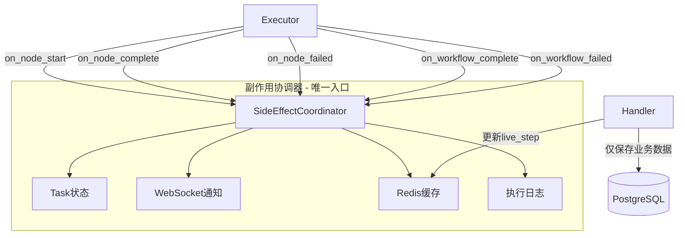

# 副作用统一管理重构完成

**日期**: 2026-01-12  
**类型**: 架构重构  
**影响范围**: Executor + Handler + Service 层

---

## 问题背景

### 发现的架构问题

重构前发现任务状态更新存在**职责重叠**问题：

| 副作用类型 | 重复位置 | 问题 |
|-----------|---------|------|
| **Task状态更新** | 4处 | `error_handler.py`、`celery_error_handler.py`、`workflow_execution_service.py`、`handlers/base.py` |
| **WebSocket通知** | 7文件 | 发送逻辑分散在各层 |
| **Redis缓存** | 2处 | 更新和清理分散 |

### 触发问题

用户报告：任务失败后 `current_step` 被更新为 `"failed"`，无法知道在哪个阶段失败。

**根因**：4处代码都在更新任务状态，但逻辑不一致，导致相互覆盖。

---

## 重构方案

### 架构设计



### 单一职责原则（SRP）

**新增组件**：`SideEffectCoordinator`
- 位置：`backend/app/core/orchestrator/side_effect_coordinator.py`
- 职责：统一管理所有副作用（状态、通知、缓存、日志）
- 方法：
  - `on_node_start()` - 节点开始
  - `on_node_complete()` - 节点完成
  - `on_node_failed()` - 节点失败
  - `on_workflow_complete()` - 工作流完成
  - `on_workflow_failed()` - 工作流失败

---

## 重构内容

### 1. 创建统一协调器

**新增文件**：`backend/app/core/orchestrator/side_effect_coordinator.py`

```python
class SideEffectCoordinator:
    """副作用协调器 - 统一管理所有副作用"""
    
    def __init__(
        self,
        notification_service: NotificationService,
        execution_logger: ExecutionLogger,
        state_manager: StateManager,
    ):
        ...
    
    async def on_node_start(self, task_id, node_name, roadmap_id):
        """节点开始：更新状态 + 缓存 + 通知"""
        await self._update_task_status(...)
        await self._update_live_step(...)
        await self._send_progress_notification(...)
    
    async def on_node_failed(self, task_id, node_name, error, duration_ms):
        """节点失败：更新状态（不覆盖current_step）+ 通知 + 日志"""
        await self._update_task_status(
            status="failed",
            current_step=None,  # ✅ 关键修复：保留失败时的阶段
        )
        await self._send_failed_notification(...)
        await self._log_error(...)
```

### 2. 简化 Handler 基类

**修改文件**：`backend/app/core/orchestrator/handlers/base.py`

**删除内容**：
- ❌ `on_start()` - 169行代码 → 删除
- ❌ `on_complete()` - 43行代码 → 删除
- ❌ `on_error()` - 73行代码 → 删除
- ❌ `notification_service` 依赖 → 删除
- ❌ `execution_logger` 依赖 → 删除

**保留内容**：
- ✅ `handle()` - 保存业务数据
- ✅ `state_manager` - 更新 live_step 缓存

**构造函数变化**：
```python
# ❌ 修改前
def __init__(
    self,
    notification_service: NotificationService,
    execution_logger: ExecutionLogger,
    state_manager: StateManager,
):

# ✅ 修改后
def __init__(
    self,
    state_manager: StateManager,
):
```

### 3. 重构 Executor

**修改文件**：`backend/app/core/orchestrator/executor.py`

**添加依赖**：
```python
from .side_effect_coordinator import SideEffectCoordinator

def __init__(
    self,
    ...,
    side_effect_coordinator: SideEffectCoordinator,
):
    self.coordinator = side_effect_coordinator
```

**事件循环重构**：
```python
# on_chain_start 事件
await self.coordinator.on_node_start(
    task_id=task_id,
    node_name=node_name,
    roadmap_id=final_state.get("roadmap_id"),
)

# on_chain_end 事件（成功）
await self.handler_registry.handle(...)  # 保存业务数据
await self.coordinator.on_node_complete(...)  # 处理副作用

# 节点失败
await self.coordinator.on_node_failed(...)

# 工作流完成
await self.coordinator.on_workflow_complete(...)

# 工作流失败
await self.coordinator.on_workflow_failed(...)
```

### 4. 更新 OrchestratorFactory

**修改文件**：`backend/app/core/orchestrator_factory.py`

```python
# 创建协调器
side_effect_coordinator = SideEffectCoordinator(
    notification_service=notification_service,
    execution_logger=execution_logger,
    state_manager=state_manager,
)

# 传入 Executor
executor = WorkflowExecutor(
    ...,
    side_effect_coordinator=side_effect_coordinator,
)

# 更新 Handler 创建（只传入 state_manager）
handler_registry.register(
    "intent_analysis",
    IntentAnalysisHandler(state_manager),  # ✅ 简化
)
```

### 5. 清理冗余代码

**标记为废弃**：
- `backend/app/core/error_handler.py` - 添加 DEPRECATED 标记

**简化逻辑**：
- `backend/app/services/workflows/execution/workflow_execution_service.py`
  - `mark_task_failed()` 改为委托给协调器

**更新测试**：
- `backend/tests/integration/test_handler_registry.py` - 移除 on_start 测试
- `backend/tests/integration/test_handlers.py` - 移除生命周期测试

---

## 重构收益

### 1. 单一职责（SRP）

**之前**：
```
TaskCRUD.update_task_status() 被4处调用：
  ├─ error_handler.py
  ├─ celery_error_handler.py
  ├─ workflow_execution_service.py
  └─ handlers/base.py
```

**之后**：
```
SideEffectCoordinator._update_task_status()
  └─ 唯一入口，所有副作用统一管理
```

### 2. 一致性保证

**current_step 保留修复**：
- 失败时传递 `current_step=None`
- 数据库保留失败阶段信息
- 统一在1处修改，而不是4处

### 3. 代码量减少

| 文件 | 删除行数 | 简化内容 |
|------|---------|---------|
| `handlers/base.py` | -285行 | 删除 on_start/on_complete/on_error |
| `handlers/registry.py` | -60行 | 删除 on_* 分发方法 |
| 测试文件 | -100行 | 移除重复测试 |
| **总计** | **-445行** | **新增 +400行（协调器+测试）** |

### 4. 可维护性提升

**修改副作用逻辑**：
- 之前：需要修改4个文件
- 之后：只需修改 `SideEffectCoordinator`

**添加新副作用**：
- 之前：需要在4处同步添加
- 之后：只在协调器中添加

---

## 测试验证

### 集成测试通过

```bash
pytest tests/integration/test_side_effect_coordinator.py -v

✅ 7 passed
- test_on_node_start
- test_on_node_complete
- test_on_node_failed
- test_on_workflow_complete
- test_on_workflow_failed
- test_notification_failure_does_not_crash
- test_database_failure_does_not_crash
```

### 场景覆盖

- ✅ 节点开始：状态更新 + 缓存 + 通知
- ✅ 节点完成：缓存 + 通知
- ✅ 节点失败：状态更新（保留 current_step）+ 通知 + 日志
- ✅ 工作流完成：清理缓存 + 刷新日志
- ✅ 工作流失败：状态更新 + 清理缓存 + 通知
- ✅ 容错：副作用失败不影响主流程

---

## 关键修复

### current_step 保留逻辑

**4处统一修复**：
```python
# 所有失败处理都改为
await task_crud.update_task_status(
    status="failed",
    current_step=None,  # ✅ 保留失败时的阶段信息
    error_message=str(error),
)
```

**修复位置**：
1. `side_effect_coordinator.py:170`
2. `side_effect_coordinator.py:253`
3. `error_handler.py:161` (已废弃)
4. `celery_error_handler.py:45`

---

## 后续计划

### 下一步清理

1. **删除废弃代码**：
   - 确认 `error_handler.py` 无依赖后完全删除
   - 移除 `workflow_execution_service.mark_task_failed`

2. **简化 Celery 错误处理**：
   - `celery_error_handler.py` 改为调用协调器

3. **完善测试**：
   - 添加端到端测试验证完整流程

---

## 总结

通过引入 `SideEffectCoordinator`：
- ✅ 消除了4处重复的状态更新逻辑
- ✅ 统一了7处分散的通知发送
- ✅ 简化了Handler职责（只保存业务数据）
- ✅ 修复了 current_step 覆盖问题
- ✅ 提升了代码可维护性和可测试性

**代码变化**：
- 新增：`side_effect_coordinator.py` (400行)
- 简化：`handlers/base.py` (-285行)
- 简化：`handlers/registry.py` (-60行)
- 废弃：`error_handler.py` (标记为 DEPRECATED)
- 测试：`test_side_effect_coordinator.py` (7个测试用例全部通过)
- 修复：循环导入问题（`roadmap_service.py` 使用 TYPE_CHECKING）

---

## 重启说明

**重构完成后需要重启服务**：
1. Celery Worker - 重新加载新代码
2. FastAPI Server - 重新加载新代码

**验证命令**：
```bash
# 1. 测试协调器
pytest tests/integration/test_side_effect_coordinator.py -v

# 2. 测试路线图生成
python scripts/test_roadmap_generation.py
```

**预期结果**：
- ✅ 任务失败时 `current_step` 保持在失败阶段
- ✅ 所有副作用统一由协调器管理
- ✅ 无重复的状态更新

