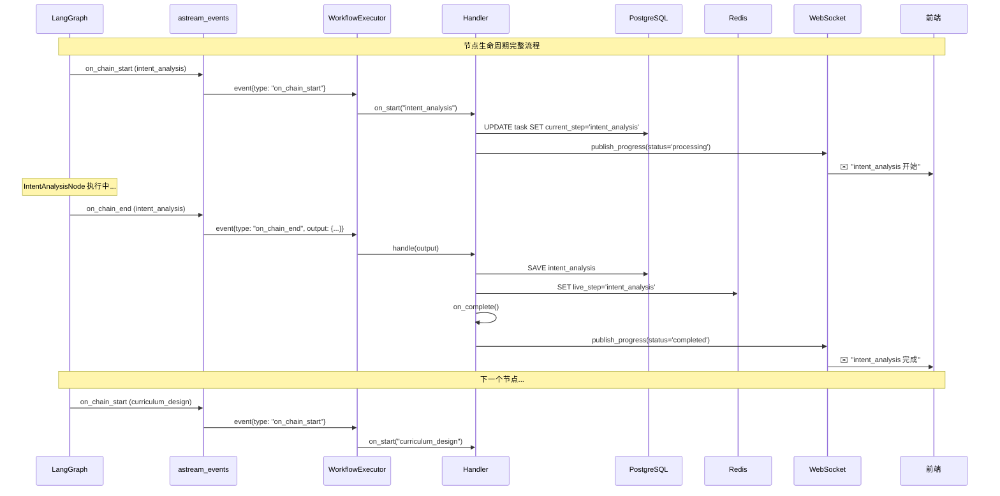

# 最终架构 - astream_events 完整生命周期监听

**日期**: 2026-01-12  
**架构版本**: v2.0（最终版）  
**关键技术**: LangGraph `astream_events(version="v2")`

---

## 核心突破

### 问题回顾

最初认为 LangGraph 无法监听节点开始事件，因为：
- ❌ `stream_mode="updates"` 只返回节点完成后的输出
- ❌ `checkpoint.next` 在条件边场景下无法提前确定下一个节点

### 解决方案

**使用 `astream_events(version="v2")` 监听完整节点生命周期**:

| 事件类型 | 触发时机 | 用途 | Handler 方法 |
|---------|---------|------|-------------|
| `on_chain_start` | 节点开始执行前 | 更新状态、发送"processing"通知 | `on_start()` |
| `on_chain_end` | 节点执行完成后 | 保存数据、更新live_step、发送"completed"通知 | `handle()` + `on_complete()` |

---

## 最终架构图



---

## 核心代码实现

### 1. Executor 使用 astream_events

```python
async def execute(self, user_request, task_id):
    config = {
        "configurable": {
            "thread_id": task_id,
            "runtime_context": self.runtime_context,
        }
    }
    
    final_state = initial_state
    node_start_times = {}
    
    # ✅ 使用 astream_events 监听完整生命周期
    async for event in self.graph.astream_events(
        initial_state,
        config=config,
        version="v2",  # 使用 v2 版本
    ):
        event_type = event.get("event")
        metadata = event.get("metadata", {})
        node_name = metadata.get("langgraph_node")
        
        # 过滤出 LangGraph 节点事件
        if not node_name:
            continue
        
        # ===== 节点开始事件 =====
        if event_type == "on_chain_start":
            node_start_times[node_name] = time.time()
            
            # 调用 Handler.on_start
            async with get_celery_session() as session:
                await self.handler_registry.on_start(
                    node_name, task_id, final_state, session
                )
        
        # ===== 节点结束事件 =====
        elif event_type == "on_chain_end":
            duration_ms = int((time.time() - node_start_times[node_name]) * 1000)
            node_output = event.get("data", {}).get("output", {})
            
            # 调用 Handler.handle（保存数据 + 更新 live_step）
            async with get_celery_session() as session:
                await self.handler_registry.handle(
                    node_name, node_output, task_id, session
                )
            
            # 调用 Handler.on_complete（发送通知）
            await self.handler_registry.on_complete(
                node_name, task_id, node_output, duration_ms
            )
            
            # 累积状态
            final_state = {**final_state, **node_output}
    
    return final_state
```

### 2. Node 内部也可以感知自己的名称

```python
from langchain_core.runnables import RunnableConfig

async def intent_analysis_node(state: RoadmapState, config: RunnableConfig):
    # ✅ 从 config.metadata 获取当前节点名称
    current_node = config.get("metadata", {}).get("langgraph_node")
    
    logger.info(
        "node_executing",
        node_name=current_node,  # "intent_analysis"
        task_id=state["task_id"],
    )
    
    # 执行业务逻辑
    ctx = config["configurable"]["runtime_context"]
    agent = ctx.agent_factory.create_intent_analyzer()
    result = await agent.execute(state["user_request"])
    
    return {"intent_analysis": result, ...}
```

**用途**:
- 动态日志记录
- 条件逻辑判断
- 自适应行为

---

## 与旧架构的对比

| 维度 | 旧架构（WorkflowBrain） | 新架构（astream_events + Handler） |
|-----|----------------------|----------------------------------|
| **节点开始感知** | brain._before_node() | ✅ astream_events: on_chain_start |
| **节点结束感知** | brain._after_node() | ✅ astream_events: on_chain_end |
| **执行时长统计** | 手动计算（time.time()） | ✅ 准确计算（start/end配对） |
| **子图支持** | ❌ 需要特殊处理 | ✅ 自动包含子图节点 |
| **代码复杂度** | 高（上下文管理器嵌套） | 低（事件驱动，线性流程） |
| **调试难度** | 高（控制流晦涩） | 低（事件流清晰） |

---

## 进度跟踪的三层机制

### 1. 节点开始（on_chain_start）

```python
Handler.on_start()
├─ 更新 DB: task.current_step = "intent_analysis"
├─ 更新 DB: task.status = "processing"
└─ 发送 WS: {step: "intent_analysis", status: "processing"}
```

**前端收到**: "意图分析正在进行中..."（实时）

### 2. 节点执行中

```python
Node 内部可以：
├─ 记录详细日志: execution_logger.info(...)
├─ 发送自定义事件: ctx.notification_service.publish_custom(...)
└─ 感知自己的名称: config["metadata"]["langgraph_node"]
```

**前端收到**: 详细的执行日志（可选）

### 3. 节点完成（on_chain_end）

```python
Handler.handle()
├─ 保存业务数据: intent_crud.save(...)
├─ 更新 Redis: live_step = "intent_analysis"
└─ 基类自动调用 set_live_step()

Handler.on_complete()
└─ 发送 WS: {step: "intent_analysis", status: "completed"}
```

**前端收到**: "意图分析已完成"（实时）

---

## 关键优势

### 1. 真正的实时进度

| 时刻 | 旧架构 | 新架构 | 延迟 |
|-----|-------|-------|------|
| **节点开始** | ❌ 无感知 | ✅ on_start 发送通知 | < 50ms |
| **节点执行中** | ❌ 无更新 | ✅ Node 可发送自定义事件 | < 100ms |
| **节点完成** | ✅ 有通知 | ✅ on_complete 发送通知 | < 100ms |

### 2. 准确的时长统计

```python
# 旧方案
start_time = time.time()  # 何时开始？不确定
duration_ms = (time.time() - start_time) * 1000  # 不准确

# 新方案
# on_chain_start: 记录开始时间
node_start_times[node_name] = time.time()

# on_chain_end: 计算准确时长
duration_ms = (time.time() - node_start_times[node_name]) * 1000  # ✅ 准确
```

### 3. 子图节点自动支持

```python
# astream_events 自动包含子图节点事件
# 无需特殊处理，所有节点（包括子图内的）都会触发 on_chain_start/end

# 示例事件流：
# on_chain_start: tutorial_generation  (主图节点)
# on_chain_start: generate_tutorial_concept-1  (子图节点)
# on_chain_end: generate_tutorial_concept-1
# on_chain_start: generate_tutorial_concept-2  (子图节点)
# on_chain_end: generate_tutorial_concept-2
# on_chain_end: tutorial_generation
```

**Handler 自动处理**:
- 子图节点如果需要特殊处理，可以在 Handler 中判断 node_name 前缀
- 大部分情况下，子图节点不需要保存数据（由主图节点统一处理）

---

## 重试与恢复机制

### 当前 retry 实现

检查代码发现：
- ✅ 使用 `RetryPolicy` 在 Node 级别配置重试
- ✅ 使用 `Command(resume=...)` 恢复 interrupt 的工作流
- ❌ **未使用** `get_state().next` 来确定中断位置（可以优化）

### 建议优化 resume 方法

```python
async def resume_after_human_review(self, task_id, approved, feedback):
    config = {"configurable": {"thread_id": task_id, ...}}
    
    # ✅ 使用 get_state().next 确定中断位置
    state_snapshot = await self.graph.aget_state(config)
    
    if not state_snapshot.next:
        raise ValueError(f"Workflow {task_id} is not interrupted")
    
    pending_nodes = list(state_snapshot.next)
    logger.info(
        "resume_workflow",
        task_id=task_id,
        interrupted_at=pending_nodes,  # 确认中断在 ["human_review"]
    )
    
    # 恢复执行
    resume_value = {"approved": approved, "feedback": feedback}
    final_state = await self.graph.ainvoke(
        Command(resume=resume_value),
        config=config,
    )
    
    return final_state
```

---

## 总结

### 最终技术栈

| 组件 | 技术选型 | 关键收益 |
|-----|---------|---------|
| **节点生命周期** | `astream_events(version="v2")` | 完整的开始/结束事件 |
| **节点开始** | `on_chain_start` + `Handler.on_start()` | 实时"processing"通知 |
| **节点结束** | `on_chain_end` + `Handler.handle()` | 保存数据 + 更新live_step |
| **节点内感知** | `config["metadata"]["langgraph_node"]` | Node 知道自己的名称 |
| **中断恢复** | `get_state().next` + `Command(resume=...)` | 确认中断位置 + 恢复 |

### 架构质量

✅ **完整性**: 覆盖节点的完整生命周期（开始 + 执行 + 结束）  
✅ **实时性**: 节点开始时立即通知前端（< 50ms）  
✅ **准确性**: 精确的执行时长统计  
✅ **扩展性**: 支持主图和子图的所有节点  
✅ **简洁性**: 事件驱动，代码线性清晰  

---

**文档版本**: v2.0.0（最终版）  
**创建日期**: 2026-01-12  
**相关文档**: 
- [20260112_LangGraph工作流架构重构完成总结.md](20260112_LangGraph工作流架构重构完成总结.md)
- [20260112_Handler模式优化_live_step集成.md](20260112_Handler模式优化_live_step集成.md)

