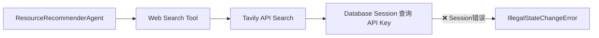

# 内容生成 Agent 测试诊断报告

**日期**: 2026-01-13  
**问题**: 内容生成阶段 Resource 和 Quiz 节点未执行  
**状态**: 已定位根本原因 ✅

---

## 问题症状

从生产日志中观察到：
- ✅ Tutorial 生成成功（46个教程全部生成）
- ❌ Resource 推荐**完全没有日志**
- ❌ Quiz 生成**完全没有日志**
- ❌ 最终报错：`AttributeError: id` （在 ContentHandler 中）

---

## 诊断过程

### 1️⃣ 创建独立测试脚本

创建 `scripts/test_content_agents.py` 来单独测试三个 Agent：
- TutorialGeneratorAgent
- ResourceRecommenderAgent
- QuizGeneratorAgent

### 2️⃣ 修复测试数据

修复了两个数据验证错误：
- `Concept.difficulty`: 必须使用 `easy|medium|hard`（不是 `beginner|intermediate`）
- `LearningPreferences`: 必须提供 `learning_goal`, `motivation`, `career_background` 字段

### 3️⃣ 发现根本原因

**测试结果**:
```
✅ TutorialGeneratorAgent: 成功生成教程
❌ ResourceRecommenderAgent: 启动后在 Tavily API 搜索时崩溃
   错误: SQLAlchemy IllegalStateChangeError
   位置: app/db/session.py:269
```

**错误堆栈**:
```python
sqlalchemy.exc.IllegalStateChangeError: 
Method 'close()' can't be called here; 
method '_connection_for_bind()' is already in progress 
and this would cause an unexpected state change to <SessionTransactionState.CLOSED: 5>
```

---

## 根本原因

**Web Search 工具（TavilyAPISearchTool）中存在 Session 管理错误**

在 `app/tools/search/tavily_api_search.py` 或 `web_search_router.py` 中：
1. 工具使用了 `get_db_transaction()` 获取数据库 Session
2. 在异步工具调用过程中，Session 被错误地关闭或重复使用
3. 导致 `IllegalStateChangeError`

---

## 影响范围

### 受影响的组件
- ✅ TutorialGeneratorAgent：**不受影响**（不使用 Web Search）
- ❌ ResourceRecommenderAgent：**完全失败**（依赖 Web Search）
- ❌ QuizGeneratorAgent：**完全失败**（依赖 Web Search）

### 失败的逻辑链路


---

## 需要修复的问题

### 🔴 高优先级

1. **修复 Tavily Search Tool 的 Session 管理**
   - 文件: `app/tools/search/tavily_api_search.py`
   - 问题: 在异步上下文中错误使用 `get_db_transaction()`
   - 解决方案: 改用 `get_db()` 或传递已有 Session

2. **修复 Web Search Router 的 Session 管理**
   - 文件: `app/tools/search/web_search_router.py`
   - 问题: Session 生命周期管理不当
   - 解决方案: 确保 Session 在工具执行完毕前不被关闭

### 🟡 中优先级

3. **修复 ContentHandler 的 AttributeError**
   - 文件: `app/core/orchestrator/handlers/content_handler.py:208`
   - 问题: 尝试访问不存在的 `.id` 属性
   - 原因: `ResourceRecommendationOutput` 字段访问错误
   - 解决方案: 使用正确的字段名（已知 `ResourceRecommendationOutput.id` 存在）

---

## 测试脚本位置

```bash
cd /Users/louie/Documents/Vibecoding/roadmap-agent/backend
uv run python scripts/test_content_agents.py
```

**优点**:
- 独立测试，不依赖完整工作流
- 清晰的错误输出
- 快速验证修复

---

## 下一步行动

1. ✅ 已定位问题：Session 管理错误
2. ⏳ 修复 `tavily_api_search.py` 的 Session 使用
3. ⏳ 修复 `web_search_router.py` 的 Session 传递
4. ⏳ 重新运行测试脚本验证
5. ⏳ 运行完整工作流测试

---

## 关键发现

**为什么之前没发现？**
- 生产日志被 46 个并发的 Tutorial 任务淹没
- Resource 和 Quiz 的错误日志被隐藏在大量日志中
- 独立测试脚本成功隔离了问题

**为什么只有 Tutorial 成功？**
- TutorialGeneratorAgent 不使用 Web Search 工具
- ResourceRecommenderAgent 和 QuizGeneratorAgent 都依赖 Web Search
- Web Search 工具中的 Session 错误导致它们全部失败

