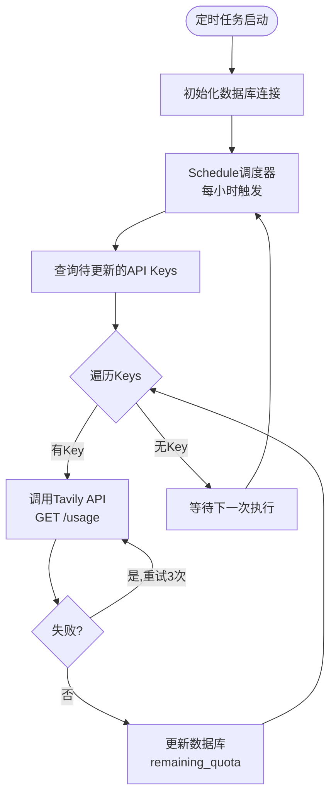

# Tavily API 配额自动更新定时任务

**创建日期**: 2025-12-29  
**功能类型**: 独立定时任务脚本  
**影响范围**: Tavily API Key 配额管理

---

## 功能概述

本功能实现了一个独立的定时任务脚本，用于自动更新 `tavily_api_keys` 表中所有 API Key 的剩余配额信息。脚本通过调用 Tavily 官方 API 接口获取最新的使用量数据，并更新数据库记录。

### 核心特性

- ✅ **每小时自动执行**：使用 `schedule` 库实现定时调度
- ✅ **独立进程运行**：与 FastAPI 主应用完全解耦，互不影响
- ✅ **自动重试机制**：API 调用失败时自动重试 3 次（指数退避）
- ✅ **优雅关闭**：响应 `SIGTERM`/`SIGINT` 信号，安全退出
- ✅ **结构化日志**：使用 `structlog`，与主应用日志系统一致
- ✅ **错误隔离**：单个 Key 更新失败不影响其他 Key

---

## 架构设计

### 执行流程



### 数据流

1. **查询阶段**：从数据库读取所有 `remaining_quota <= plan_limit` 的 API Key
2. **API 调用**：逐个调用 `https://api.tavily.com/usage` 获取配额信息
3. **数据解析**：提取 `plan_usage` 和 `plan_limit`，计算 `remaining_quota = plan_limit - plan_usage`
4. **数据库更新**：更新 `remaining_quota` 和 `updated_at` 字段（独立事务）

---

## 文件结构

### 核心脚本

**位置**: `backend/scripts/update_tavily_quota.py`

**主要函数**:

| 函数名 | 功能 | 备注 |
|--------|------|------|
| `fetch_tavily_usage()` | 调用 Tavily API 获取配额 | 带 `@retry` 装饰器，最多重试 3 次 |
| `update_single_key_quota()` | 更新单个 Key 的配额 | 独立事务，失败时回滚 |
| `update_all_keys_quota()` | 批量更新所有 Keys | 异步执行，单个失败不影响其他 |
| `run_update_job()` | 同步包装器 | 创建新事件循环运行异步任务 |
| `run_scheduler()` | 主调度循环 | 配置 `schedule` 并监听关闭信号 |

### 启动脚本

**位置**: `backend/scripts/railway_entrypoint.sh`

**新增服务类型**: `tavily_quota_updater`

```bash
tavily_quota_updater)
  echo "⏰ Starting Tavily Quota Updater..."
  sleep 5  # 等待数据库就绪
  exec python scripts/update_tavily_quota.py
  ;;
```

---

## 部署指南

### Railway 平台部署

#### 步骤 1: 创建新 Service

1. 登录 Railway 控制台
2. 进入项目 `roadmap-agent`
3. 点击 **"New Service"**
4. 选择 **"From Existing Repo"**（选择现有仓库）
5. 命名为 `tavily-quota-updater`

#### 步骤 2: 配置环境变量

在新 Service 的 **Variables** 标签页添加：

| 变量名 | 值 | 说明 |
|--------|----|----- |
| `SERVICE_TYPE` | `tavily_quota_updater` | **必需**：指定启动定时任务 |
| `QUOTA_UPDATE_INTERVAL_HOURS` | `1` | 可选：更新间隔（默认 1 小时） |
| `POSTGRES_HOST` | （自动继承） | 数据库主机地址 |
| `POSTGRES_PORT` | （自动继承） | 数据库端口 |
| `POSTGRES_USER` | （自动继承） | 数据库用户名 |
| `POSTGRES_PASSWORD` | （自动继承） | 数据库密码 |
| `POSTGRES_DB` | （自动继承） | 数据库名称 |

**注意**：数据库相关环境变量会自动从现有 `api` Service 继承，无需手动配置。

#### 步骤 3: 配置构建设置

1. **Dockerfile 路径**: `backend/Dockerfile.railway`（与主应用相同）
2. **启动命令**: 自动使用 `railway_entrypoint.sh`（根据 `SERVICE_TYPE` 决定启动逻辑）
3. **资源配置**: 
   - 内存: 256MB（足够，定时任务轻量级）
   - CPU: 0.1 vCPU

#### 步骤 4: 部署验证

1. 查看 **Logs** 标签页，确认日志输出：
   ```json
   {
     "event": "tavily_quota_updater_starting",
     "update_interval_hours": 1,
     "environment": "production",
     "database_host": "xxxx.railway.app"
   }
   ```

2. 检查数据库更新：
   ```sql
   SELECT api_key, remaining_quota, plan_limit, updated_at 
   FROM tavily_api_keys 
   ORDER BY updated_at DESC 
   LIMIT 5;
   ```

3. 确认 `updated_at` 字段在每小时后自动更新

---

## 本地开发与测试

### 前置条件

1. 安装依赖：
   ```bash
   cd backend
   uv sync  # 或 poetry install
   ```

2. 配置 `.env` 文件（确保包含数据库连接信息）：
   ```env
   POSTGRES_HOST=localhost
   POSTGRES_PORT=5432
   POSTGRES_USER=roadmap_user
   POSTGRES_PASSWORD=roadmap_pass
   POSTGRES_DB=roadmap_db
   ```

3. 确保数据库中有测试数据：
   ```sql
   INSERT INTO tavily_api_keys (api_key, plan_limit, remaining_quota)
   VALUES ('tvly-test-key-12345', 1000, 800);
   ```

### 运行方式

#### 方式 1: 直接运行脚本

```bash
cd backend
python scripts/update_tavily_quota.py
```

**输出示例**:
```json
{
  "event": "tavily_quota_updater_starting",
  "update_interval_hours": 1,
  "environment": "development",
  "database_host": "localhost",
  "timestamp": "2025-12-29T10:00:00"
}
{
  "event": "running_initial_update",
  "timestamp": "2025-12-29T10:00:01"
}
{
  "event": "tavily_keys_fetched",
  "total_keys": 5,
  "timestamp": "2025-12-29T10:00:02"
}
{
  "event": "tavily_quota_updated",
  "key_prefix": "tvly-test-...",
  "old_quota": 800,
  "new_quota": 780,
  "plan_limit": 1000,
  "plan_usage": 220,
  "quota_change": -20,
  "timestamp": "2025-12-29T10:00:05"
}
{
  "event": "tavily_quota_update_completed",
  "total_keys": 5,
  "success_count": 5,
  "failed_count": 0,
  "elapsed_seconds": 3.45,
  "timestamp": "2025-12-29T10:00:06"
}
{
  "event": "scheduler_loop_started",
  "timestamp": "2025-12-29T10:00:06"
}
```

#### 方式 2: 模拟 Railway 启动

```bash
cd backend
export SERVICE_TYPE=tavily_quota_updater
bash scripts/railway_entrypoint.sh
```

### 停止脚本

- **Ctrl+C** 或发送 `SIGTERM` 信号：
  ```bash
  kill -TERM <pid>
  ```

- 脚本会优雅关闭，输出：
  ```json
  {
    "event": "received_shutdown_signal",
    "signal": "SIGTERM",
    "timestamp": "2025-12-29T10:30:00"
  }
  {
    "event": "tavily_quota_updater_stopped",
    "timestamp": "2025-12-29T10:30:01"
  }
  ```

---

## 配置参数

### 环境变量

| 变量名 | 默认值 | 说明 |
|--------|--------|------|
| `QUOTA_UPDATE_INTERVAL_HOURS` | `1` | 更新间隔（小时） |
| `POSTGRES_HOST` | `localhost` | 数据库主机 |
| `POSTGRES_PORT` | `5432` | 数据库端口 |
| `POSTGRES_USER` | `roadmap_user` | 数据库用户 |
| `POSTGRES_PASSWORD` | `roadmap_pass` | 数据库密码 |
| `POSTGRES_DB` | `roadmap_db` | 数据库名称 |
| `ENVIRONMENT` | `development` | 运行环境 |

### 代码常量

在 `update_tavily_quota.py` 中可修改：

```python
TAVILY_USAGE_API_URL = "https://api.tavily.com/usage"  # Tavily API 端点
HTTP_TIMEOUT = 30.0  # API 请求超时（秒）
MAX_RETRIES = 3  # 最大重试次数
```

---

## 日志说明

### 日志格式

使用 `structlog` 输出 JSON 格式日志，便于日志聚合和分析。

### 关键日志事件

| Event 名称 | 级别 | 说明 | 示例字段 |
|-----------|------|------|---------|
| `tavily_quota_updater_starting` | INFO | 定时任务启动 | `update_interval_hours`, `environment` |
| `tavily_keys_fetched` | INFO | 查询到待更新的 Keys | `total_keys` |
| `tavily_quota_updated` | INFO | 单个 Key 更新成功 | `key_prefix`, `old_quota`, `new_quota` |
| `tavily_quota_unchanged` | DEBUG | 配额未变化 | `key_prefix`, `quota` |
| `tavily_api_http_error` | ERROR | API 调用 HTTP 错误 | `key_prefix`, `status_code` |
| `tavily_api_timeout` | ERROR | API 调用超时 | `key_prefix`, `timeout` |
| `tavily_quota_update_completed` | INFO | 批量更新完成 | `success_count`, `failed_count` |
| `received_shutdown_signal` | INFO | 收到关闭信号 | `signal` |

### 日志查询示例（Railway Logs）

```bash
# 查看更新成功的记录
event:"tavily_quota_updated"

# 查看失败的 Key
event:"tavily_api_http_error" OR event:"tavily_api_timeout"

# 查看每日统计
event:"tavily_quota_update_completed"
```

---

## 错误处理

### 错误类型与处理策略

| 错误类型 | 处理方式 | 影响范围 |
|---------|----------|---------|
| API HTTP 错误（4xx/5xx） | 重试 3 次后跳过该 Key | 单个 Key |
| API 超时 | 重试 3 次后跳过该 Key | 单个 Key |
| 数据库连接失败 | 记录错误，等待下次调度 | 整批任务 |
| 数据库更新失败 | 回滚事务，跳过该 Key | 单个 Key |
| 未知异常 | 记录堆栈，跳过该 Key | 单个 Key |

### 重试配置

使用 `tenacity` 库实现指数退避重试：

```python
@retry(
    stop=stop_after_attempt(3),  # 最多 3 次
    wait=wait_exponential(multiplier=1, min=2, max=10),  # 2s, 4s, 8s
    retry=retry_if_exception_type((httpx.HTTPError, httpx.TimeoutException)),
)
```

---

## 监控与告警

### 推荐监控指标

1. **成功率**：`success_count / total_keys`
2. **平均耗时**：`elapsed_seconds / total_keys`
3. **失败 Key 数量**：`failed_count`
4. **最后更新时间**：查询 `MAX(updated_at)` 判断任务是否卡死

### 告警规则（可选）

- ❌ **失败率 > 20%**：检查网络或 API Key 有效性
- ❌ **任务执行时长 > 10 分钟**：检查数据库连接或 Key 数量过多
- ❌ **2 小时未更新**：检查定时任务进程是否崩溃

---

## 常见问题

### Q1: 如何修改更新频率？

**方法 1**：修改环境变量（推荐）

```bash
# Railway 中设置
QUOTA_UPDATE_INTERVAL_HOURS=6  # 改为每 6 小时
```

**方法 2**：修改代码

```python
# update_tavily_quota.py
schedule.every(6).hours.do(run_update_job)
```

### Q2: 如何手动触发一次更新？

在 Railway 控制台中重启 `tavily-quota-updater` Service，脚本启动时会立即执行一次初始更新。

### Q3: 如果某个 API Key 长期失败怎么办？

查看日志确定失败原因：

```bash
# Railway Logs 搜索
event:"tavily_api_http_error" key_prefix:"tvly-xxxxx..."
```

可能原因：
- API Key 已失效（需删除或更换）
- API Key 配额已用尽（正常，等待下个计费周期）
- Tavily 服务临时故障（自动重试会处理）

### Q4: 定时任务是否会影响 FastAPI 主应用？

不会。定时任务运行在独立的进程和数据库连接池中，与 FastAPI、Celery Workers 完全隔离。

### Q5: 如何验证定时任务是否正常运行？

执行 SQL 查询：

```sql
-- 检查最近更新时间（应该在 1 小时内）
SELECT 
  COUNT(*) as total_keys,
  MAX(updated_at) as last_update,
  EXTRACT(EPOCH FROM (NOW() - MAX(updated_at)))/60 as minutes_ago
FROM tavily_api_keys;
```

如果 `minutes_ago > 70`，说明定时任务可能出现问题。

---

## 技术细节

### 数据库查询条件

```sql
SELECT * FROM tavily_api_keys 
WHERE remaining_quota <= plan_limit;
```

**为什么使用这个条件？**
- 排除异常数据（如手动设置 `remaining_quota > plan_limit` 的测试数据）
- 确保只更新正常的 API Key

### API 响应示例

```json
{
  "key": {
    "usage": 150,
    "limit": 1000
  },
  "account": {
    "current_plan": "Bootstrap",
    "plan_usage": 500,
    "plan_limit": 15000,
    "paygo_usage": 25,
    "paygo_limit": 100
  }
}
```

**使用的字段**：
- `account.plan_usage`：已使用的配额
- `account.plan_limit`：计划总配额
- **计算公式**：`remaining_quota = plan_limit - plan_usage`

### 时区处理

- `updated_at` 字段使用 `beijing_now()` 函数（北京时间，UTC+8）
- 通过 SQLAlchemy 的 `onupdate` 参数自动更新，无需手动设置

---

## 依赖包

### 新增依赖

- **schedule** (`^1.2.0`): 轻量级定时任务调度库

### 已有依赖（复用）

- **httpx** (`^0.28.1`): 异步 HTTP 客户端
- **structlog** (`^24.4.0`): 结构化日志库
- **tenacity** (`^9.0.0`): 重试机制库
- **sqlalchemy** / **sqlmodel**: 数据库 ORM

---

## 变更历史

| 版本 | 日期 | 变更内容 |
|------|------|---------|
| 1.0 | 2025-12-29 | 初始版本，实现基础定时任务功能 |

---

## 相关文档

- [Tavily API Key 批量管理功能](./TAVILY_API_KEY_MANAGEMENT.md)
- [Tavily Key 监控剥离改造](./TAVILY_KEY_REFACTOR_COMPLETE.md)
- [Railway 部署指南](./RAILWAY_DEPLOYMENT.md)

---

## 联系与支持

如有问题或建议，请联系开发团队或提交 Issue。

