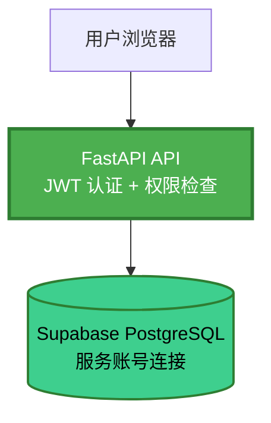

# Supabase Row Level Security (RLS) 说明

**问题**: Supabase Dashboard 显示所有表为 "unrestricted"  
**状态**: ✅ 预期行为，无需修改

---

## 📋 什么是 Row Level Security (RLS)?

RLS 是 PostgreSQL 的安全特性，允许在**数据库层面**控制行级访问权限。

### 适用场景

**需要 RLS**（前端直连数据库）:
```
用户浏览器 → supabase-js → Supabase PostgreSQL
```
- 前端直接调用 `supabase.from('users').select()`
- 需要 RLS 策略防止用户越权访问
- 典型应用：多租户 SaaS、社交应用

**不需要 RLS**（我们的架构）:
```
用户浏览器 → FastAPI API → Supabase PostgreSQL
```
- 前端调用 API 端点（如 `/api/v1/users`）
- 后端 API 控制所有权限逻辑
- 数据库接收的是**后端服务账号**的请求（已信任）

---

## 🏗️ 我们的架构

### 权限控制层级



### 权限控制实现

**在 FastAPI 层**:
```python
# 示例：用户只能查看自己的 Roadmap
@router.get("/roadmaps/mine")
async def get_my_roadmaps(
    current_user: User = Depends(get_current_user),
    db: AsyncSession = Depends(get_db)
):
    # ✅ 在应用层过滤
    roadmaps = await roadmap_repo.get_by_user_id(db, current_user.id)
    return roadmaps
```

**数据库层**（无需 RLS）:
```sql
-- 数据库接收的查询（已在后端过滤）
SELECT * FROM roadmaps WHERE user_id = 'uuid';
```

---

## ✅ 为什么显示 "unrestricted" 是正常的？

### 理由 1: 架构设计
- 后端 API 是**唯一**访问数据库的入口
- 前端无法绕过后端直连数据库
- 权限逻辑在 FastAPI 层已完整实现

### 理由 2: 性能优势
- RLS 策略会在**每个查询**上增加额外的权限检查
- 我们的架构只需在 API 层检查一次
- 避免不必要的数据库开销

### 理由 3: 灵活性
- 复杂权限逻辑在 Python 中更容易实现
- 可以结合缓存、业务规则等
- 不依赖数据库特定功能

---

## 🔒 我们的安全措施

### 1. JWT 认证
```python
# 每个请求都需要有效的 JWT Token
current_user = Depends(get_current_user)
```

### 2. 数据库凭据隔离
```bash
# 环境变量（不暴露给前端）
POSTGRES_USER=postgres.xxx
POSTGRES_PASSWORD=xxx  # 只有后端知道
```

### 3. API 端点权限控制
```python
# 示例：管理员端点
@router.delete("/users/{user_id}")
async def delete_user(
    user_id: str,
    current_user: User = Depends(require_admin)  # 权限检查
):
    ...
```

### 4. CORS 限制
```python
# 只允许特定域名调用 API
CORS_ORIGINS=https://app.example.com
```

---

## 🆚 对比：启用 vs 不启用 RLS

| 方面 | 启用 RLS | 不启用 RLS（当前） |
|------|----------|-------------------|
| **前端直连** | ✅ 支持 | ❌ 不支持（也不需要） |
| **性能** | ⚠️ 每次查询检查 | ✅ 只在 API 层检查 |
| **复杂权限** | ⚠️ SQL 实现困难 | ✅ Python 灵活实现 |
| **调试难度** | ⚠️ 需了解 RLS 规则 | ✅ 标准应用逻辑 |
| **适用场景** | 前端直连场景 | 后端 API 架构 |

---

## 🎯 结论

### 当前状态（推荐保持）
- ✅ **所有表 "unrestricted"**: 符合我们的架构设计
- ✅ **权限在 FastAPI 层**: 灵活、高效、易维护
- ✅ **数据库凭据隔离**: 前端无法直连数据库

### 如果想启用 RLS（不推荐）

**仅在以下情况考虑**:
1. 前端需要直接使用 `supabase-js` 查询数据库
2. 需要多租户行级隔离（如 SaaS 平台）
3. 需要数据库层面的审计合规

**启用步骤**（仅供参考）:
```sql
-- 1. 启用 RLS
ALTER TABLE roadmaps ENABLE ROW LEVEL SECURITY;

-- 2. 创建策略（示例：用户只能看自己的）
CREATE POLICY "Users can view own roadmaps"
ON roadmaps
FOR SELECT
USING (auth.uid() = user_id);

-- 3. 允许服务账号绕过 RLS
GRANT BYPASSRLS ON ALL TABLES IN SCHEMA public TO postgres;
```

**警告**: 启用 RLS 后需要为**每个表**创建策略，工作量大且容易出错。

---

## 📚 参考资料

- [Supabase RLS 文档](https://supabase.com/docs/guides/auth/row-level-security)
- [PostgreSQL RLS 文档](https://www.postgresql.org/docs/current/ddl-rowsecurity.html)
- 项目权限实现: `backend/app/api/v1/endpoints/auth.py`

---

**总结**: "unrestricted" 状态是**预期的、安全的、推荐的**。我们的架构通过后端 API 实现完整的权限控制，无需在数据库层启用 RLS。

