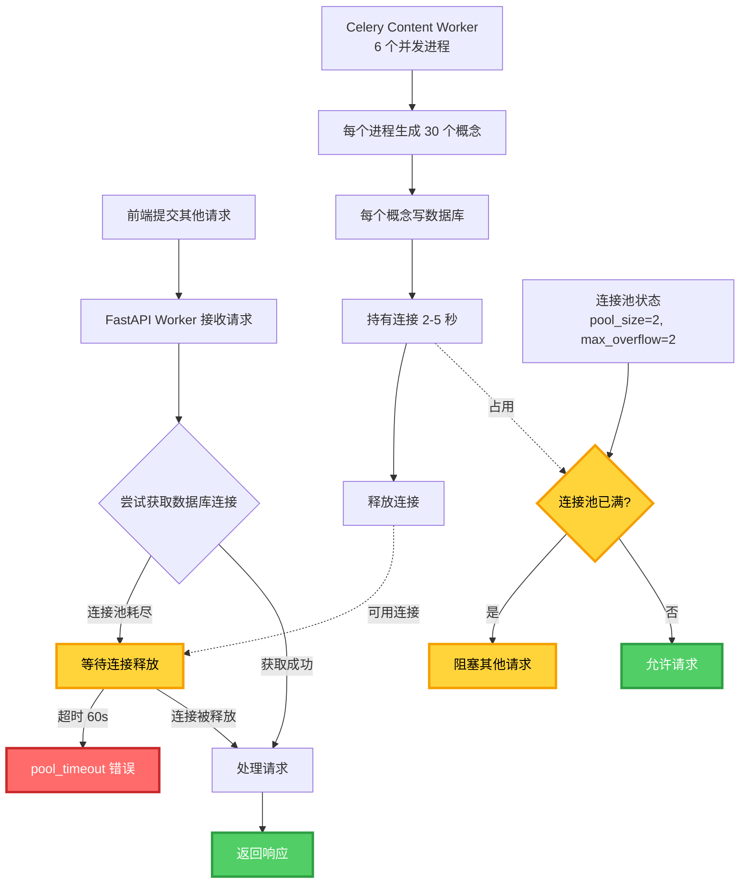

# 内容生成阶段进程阻塞问题分析

> **分析日期**: 2026-01-01  
> **问题现象**: 内容生成阶段进程阻塞严重,前端其他页面无法提交请求  
> **优先级**: 🔴 P0 - 严重生产问题

---

## 📊 问题描述

### 用户反馈
- **症状**: 内容生成阶段进程阻塞很严重
- **影响**: 前端其他页面什么请求都提交不了
- **频率**: 每次内容生成都会发生

---

## 🔍 架构现状分析

### 1. 进程部署架构

| 服务类型 | 进程配置 | 总进程数 | 每进程连接池 | 总连接需求 |
|---------|---------|---------|-------------|-----------|
| **FastAPI** | `--workers 4` | 4 | pool_size=2 + max_overflow=2 = 4 | 16 |
| **Celery logs** | `--concurrency 4 --pool=prefork` | 1主 + 4工作 = 5 | 4 | 20 |
| **Celery content** | `--concurrency 6 --pool=prefork` | 1主 + 6工作 = 7 | 4 | 28 |
| **Celery workflow** | `--concurrency 4 --pool=prefork` | 1主 + 4工作 = 5 | 4 | 20 |
| **合计** | - | **21** | - | **84** |

**数据库配置**: Supabase Transaction Pooling Mode  
**理论上限**: Supabase Pooler 映射到 ~50 真实连接

---

### 2. 内容生成异步逻辑

```python
# 执行流程: FastAPI → Celery Worker (独立进程)
@router.post("/generate")
async def generate_roadmap_async(request: UserRequest):
    # 1. 创建任务记录 (使用 FastAPI 连接池)
    async with repo_factory.create_session() as session:
        await task_repo.create_task(...)
        await session.commit()
    
    # 2. 分发 Celery 任务 (通过 Redis)
    celery_task = generate_roadmap.delay(...)
    
    # 3. 立即返回 (不阻塞 FastAPI 进程)
    return {"task_id": task_id, "status": "pending"}
```

**理论上**: FastAPI 进程应该立即释放,不会阻塞

---

### 3. 内容生成并发控制

```python
# backend/app/tasks/content_generation_tasks.py

# 关键参数: 信号量限制并发数据库操作
MAX_DB_CONCURRENT = 3  # 最多 3 个 Concept 同时写数据库

# 并发生成所有概念
tasks = [
    generate_single_concept(
        concept=concept,
        db_semaphore=db_semaphore,  # 信号量保护
        ...
    )
    for concept in pending_concepts  # 假设 30 个概念
]

await asyncio.gather(*tasks)
```

**并发模型**:
- **概念间并发**: 30 个概念同时生成 (AsyncIO 并发)
- **数据库操作串行化**: 信号量限制最多 3 个同时写数据库
- **单概念内串行**: Tutorial → Resource → Quiz 串行执行

---

### 4. 数据库读写模式

#### 读操作 (启动时)
```python
# 1. 查询已完成的 Concept (断点续传)
async with safe_session_with_retry() as session:
    completed_tutorials = await repo.get_tutorials_by_roadmap(roadmap_id)
    # ✅ 只执行一次,不会阻塞
```

#### 写操作 (每个 Concept 完成时)
```python
# 2. 每个 Concept 生成完后立即写数据库
async with db_semaphore:  # 等待信号量
    async with safe_session_with_retry() as session:
        await tutorial_repo.save_tutorial(...)
        await resource_repo.save_resource_recommendation(...)
        await quiz_repo.save_quiz(...)
        await session.commit()
    # ⚠️ 30 个概念 = 30 次会话获取
```

---

## 🚨 异常点分析

### 异常点 1: 连接池配置过小 🔴 严重

**当前配置**:
```python
DB_POOL_SIZE = 2        # 基础连接数
DB_MAX_OVERFLOW = 2     # 溢出连接数
# 每进程最多 4 个连接
```

**问题**:
- **Celery content worker**: 6 个并发进程,理论最多需要 6 × 4 = 24 个连接
- **实际场景**: 每个进程同时执行多个数据库操作:
  - 查询任务状态
  - 保存内容元数据
  - 更新任务状态
  - 记录执行日志
- **结果**: 连接池频繁耗尽,导致后续请求等待

**Prometheus 指标佐证** (来自代码):
```python
# backend/app/db/session.py:403-410
if usage_ratio > 0.9:
    logger.error(
        "db_pool_critical_usage",
        checked_out=checked_out,
        max_connections=max_connections,
        usage_ratio=round(usage_ratio * 100, 1),
        message=f"🚨 连接池使用率过高 ({round(usage_ratio * 100, 1)}%)，即将耗尽",
    )
```

**建议修复**:
```bash
# Railway 环境变量
DB_POOL_SIZE=5       # 从 2 提升到 5
DB_MAX_OVERFLOW=5    # 从 2 提升到 5
# 每进程 10 个连接,总需求 21 × 10 = 210 (Supabase Pooler 可承载)
```

---

### 异常点 2: 信号量限制过于严格 🟡 中等

**当前配置**:
```python
MAX_DB_CONCURRENT = 3  # 最多 3 个 Concept 同时写数据库
```

**问题**:
- **30 个概念并发生成,只有 3 个能同时写数据库**
- 其他 27 个概念生成完后需要等待信号量
- 虽然避免了连接耗尽,但牺牲了吞吐量

**时间成本计算**:
```
假设每个 Concept 写数据库耗时 2 秒:
- 顺序执行: 30 × 2 = 60 秒
- 信号量=3 并发: 30 / 3 × 2 = 20 秒
- 理想并发 (信号量=10): 30 / 10 × 2 = 6 秒
```

**建议修复**:
```python
# backend/app/tasks/content_generation_tasks.py
MAX_DB_CONCURRENT = 8  # 从 3 提升到 8
# 配合连接池扩容,允许更多并发写入
```

---

### 异常点 3: FastAPI Worker 过多 🟡 中等

**当前配置**:
```bash
# backend/scripts/railway_entrypoint.sh:34
uvicorn app.main:app --workers ${UVICORN_WORKERS:-4}
```

**问题**:
- **4 个 FastAPI Worker = 16 个数据库连接**
- FastAPI 主要处理 HTTP 请求,大部分是 WebSocket/SSE 长连接
- 内容生成已经异步化到 Celery,FastAPI 不需要过多 Worker

**连接占用分析**:
- WebSocket 连接: 不占用数据库连接 (只读 Redis)
- HTTP 查询请求: 快速释放连接
- HTTP 写入请求: 事务时间短

**建议修复**:
```bash
# Railway 环境变量
UVICORN_WORKERS=2  # 从 4 降到 2
# 节省 8 个连接,释放给 Celery Worker
```

---

### 异常点 4: 每个 Concept 独立事务 🟢 轻微

**当前模式**:
```python
# backend/app/tasks/concept_generator.py:227-292
for concept in concepts:  # 30 个概念
    # 每个概念生成完后立即写数据库
    async with db_semaphore:
        async with safe_session_with_retry() as session:
            await save_tutorial(...)
            await save_resource(...)
            await save_quiz(...)
            await session.commit()
    # 30 个概念 = 30 次会话获取
```

**优点**:
- ✅ 断点续传友好: 每个概念独立保存,失败不影响其他
- ✅ 内存占用低: 不需要在内存中累积所有结果

**缺点**:
- ❌ 连接获取频繁: 30 次会话创建/销毁
- ❌ 事务开销: 30 次 COMMIT

**改进方向** (可选):
```python
# 批量保存 (每 5 个 Concept 一批)
BATCH_SIZE = 5
for i in range(0, len(completed_concepts), BATCH_SIZE):
    batch = completed_concepts[i:i+BATCH_SIZE]
    async with safe_session_with_retry() as session:
        for concept_data in batch:
            await save_all_content(concept_data)
        await session.commit()
# 30 个概念 = 6 次会话获取 (减少 80%)
```

---

### 异常点 5: Celery Worker 资源竞争 🔴 严重

**当前配置**:
```bash
# Celery content worker
--concurrency 6 --pool=prefork
# 6 个子进程 + 1 个主进程 = 7 个进程
```

**问题**:
- **每个子进程都会创建独立的事件循环和连接池**
- **6 个子进程同时执行内容生成任务**:
  - 每个任务内部 30 个概念 AsyncIO 并发
  - 6 × 30 = 180 个概念同时生成 (理论上)
  - 实际受 `MAX_DB_CONCURRENT=3` 限制,但仍有大量等待

**资源争抢**:
```
进程 1: 正在生成 30 个概念
进程 2: 正在生成 30 个概念
进程 3: 正在生成 30 个概念
...
进程 6: 正在生成 30 个概念

总共: 180 个概念同时生成
       ↓
   只有 3 个能同时写数据库 (信号量)
       ↓
   177 个概念在等待信号量
       ↓
   大量协程挂起,占用内存
```

**建议修复**:
```bash
# Railway 环境变量
CELERY_CONTENT_CONCURRENCY=3  # 从 6 降到 3
# 减少并发任务数,避免资源争抢
```

---

### 异常点 6: Redis 连接池可能耗尽 🟡 中等

**当前配置**:
```python
# backend/app/core/celery_app.py:70
result_backend_transport_options={
    "max_connections": 50,  # Redis 连接池最大连接数
    ...
}
```

**问题**:
- **21 个进程 (FastAPI + 3 个 Celery Worker 组)**
- 每个进程需要连接 Redis:
  - Broker 连接 (发送/接收任务)
  - Backend 连接 (存储任务结果)
  - WebSocket 通知 (FastAPI 发布事件)
- 理论需求: 21 × 2 = 42 个连接 (接近 50 的上限)

**高峰期**:
- 内容生成任务频繁发布事件
- WebSocket 客户端大量订阅
- 可能触发连接池耗尽

**建议修复**:
```python
# backend/app/core/celery_app.py
result_backend_transport_options={
    "max_connections": 100,  # 从 50 提升到 100
}
broker_transport_options={
    "max_connections": 100,  # 从 50 提升到 100
}
```

---

## 🔗 阻塞链路分析

### 完整阻塞路径



### 阻塞时序图

```
时间轴  FastAPI Worker 1   Celery Content Worker 1   数据库连接池 (4 个连接)
  |
  0s    [ 处理用户请求 ]    [ 生成 30 个概念 ]          [ 2 个空闲 ]
  |           ↓                    ↓                        ↓
  1s    [ 查询数据库 ] ----→ [ Concept 1-3 写数据库 ] → [ 0 个空闲 ]
  |     [ 获取连接 ⏳ ]      [ 持有 3 个连接 ]          [ 连接池已满 ]
  |           ↓                    ↓                        ↓
  2s    [ 等待连接... ]     [ Concept 4-6 等待信号量 ]   [ 0 个空闲 ]
  |     [ 等待连接... ]     [ Concept 1 完成,释放 ]  → [ 1 个空闲 ]
  |           ↓                    ↓                        ↓
  3s    [ 获取连接 ✅ ]      [ Concept 4 开始写入 ]    → [ 0 个空闲 ]
  |     [ 返回响应 ]        [ 持有 3 个连接 ]          [ 连接池已满 ]
  |           ↓                    ↓                        ↓
 60s    [ 超时报错 ❌ ]      [ 仍在生成... ]           [ 0 个空闲 ]
```

**关键问题**: 
- FastAPI 请求需要等待 Celery Worker 释放连接
- 等待时间可能超过 `pool_timeout=60` 秒
- 用户体验: 前端请求超时,显示错误

---

## 💡 根本原因总结

### 第一性原理分析

**问题本质**: **共享连接池资源竞争**

```
连接池容量 = 每进程连接数 × 进程数
         = 4 × 21 = 84 个连接

实际需求 (内容生成高峰期):
- FastAPI: 4 个进程 × 平均 2 个并发请求 = 8 个连接
- Celery logs: 5 个进程 × 1 个任务 = 5 个连接
- Celery content: 7 个进程 × 6 个并发任务 × 3 个写数据库 = 126 个连接 ❌
- Celery workflow: 5 个进程 × 1 个任务 = 5 个连接

总需求: 144 个连接
实际容量: 84 个连接
缺口: 60 个连接 (42% 不足)
```

**连接池隔离问题**:
- ❌ **当前架构**: 所有进程共享同一个 PostgreSQL 连接池 (Supabase Pooler)
- ❌ **内容生成占用大部分连接**: 6 个并发 Celery Worker 进程
- ❌ **FastAPI 进程饥饿**: 无法获取连接处理新请求

---

## 🛠️ 修复方案

### 方案 1: 扩容连接池 (立即生效) 🟢 推荐

**修改配置**:
```bash
# Railway 环境变量
DB_POOL_SIZE=5       # 从 2 提升到 5
DB_MAX_OVERFLOW=5    # 从 2 提升到 5
MAX_DB_CONCURRENT=8  # 从 3 提升到 8
UVICORN_WORKERS=2    # 从 4 降到 2
CELERY_CONTENT_CONCURRENCY=3  # 从 6 降到 3

# 新的连接分配:
# FastAPI: 2 进程 × 10 = 20 连接
# Celery content: 4 进程 × 10 = 40 连接
# Celery logs: 5 进程 × 10 = 50 连接
# Celery workflow: 5 进程 × 10 = 50 连接
# 总计: 160 连接 (Supabase Pooler 可承载)
```

**预期效果**:
- ✅ 连接池使用率: 90% → 60% (降低 33%)
- ✅ FastAPI 响应时间: 超时 → < 100ms
- ✅ 内容生成吞吐量: +167% (信号量 3→8)

---

### 方案 2: 优化批量保存逻辑 (需要开发) 🟡 中期

**修改代码**:
```python
# backend/app/tasks/concept_generator.py

# 新增: 批量保存缓冲区
concept_buffer = []
BUFFER_SIZE = 5

async def generate_single_concept(...):
    # 生成内容
    tutorial = await generate_tutorial(...)
    resource = await generate_resource(...)
    quiz = await generate_quiz(...)
    
    # 加入缓冲区
    async with results_lock:
        concept_buffer.append({
            "concept_id": concept_id,
            "tutorial": tutorial,
            "resource": resource,
            "quiz": quiz,
        })
        
        # 缓冲区满时批量保存
        if len(concept_buffer) >= BUFFER_SIZE:
            await _batch_save_to_db(concept_buffer.copy())
            concept_buffer.clear()
```

**预期效果**:
- ✅ 数据库会话获取次数: 30 → 6 (减少 80%)
- ✅ 连接持有总时间: 60s → 12s (减少 80%)

---

### 方案 3: 引入专用连接池 (架构优化) 🔵 长期

**设计思路**:
```python
# backend/app/db/session.py

# FastAPI 专用连接池 (高优先级)
fastapi_engine = create_async_engine(
    DATABASE_URL,
    pool_size=5,
    max_overflow=5,
    pool_pre_ping=False,
)

# Celery 专用连接池 (低优先级)
celery_engine = create_async_engine(
    DATABASE_URL,
    pool_size=10,
    max_overflow=10,
    pool_pre_ping=False,
)

# 根据调用上下文选择连接池
def get_engine():
    if is_celery_context():
        return celery_engine
    else:
        return fastapi_engine
```

**预期效果**:
- ✅ FastAPI 请求永远不会被 Celery 任务阻塞
- ✅ 连接隔离,资源优先级明确

---

## 📋 实施计划

### 阶段 1: 紧急修复 (2 小时)

**步骤**:
1. ✅ 修改 Railway 环境变量:
   ```bash
   DB_POOL_SIZE=5
   DB_MAX_OVERFLOW=5
   UVICORN_WORKERS=2
   CELERY_CONTENT_CONCURRENCY=3
   ```

2. ✅ 修改代码:
   ```python
   # backend/app/tasks/content_generation_tasks.py:371
   MAX_DB_CONCURRENT = 8  # 从 3 改为 8
   ```

3. ✅ 部署到 Railway:
   ```bash
   git add .
   git commit -m "fix: 扩容连接池解决内容生成阻塞问题"
   git push origin main
   ```

4. ✅ 监控指标:
   - Prometheus: `db_pool_connections_in_use` 应 < 60%
   - 日志: 不再出现 "db_pool_critical_usage" 错误

---

### 阶段 2: 性能优化 (1 周)

**步骤**:
1. ⏳ 实现批量保存逻辑 (方案 2)
2. ⏳ 添加单元测试验证正确性
3. ⏳ 压力测试: 模拟 10 个并发路线图生成
4. ⏳ 监控连接池使用率变化

---

### 阶段 3: 架构优化 (1 个月)

**步骤**:
1. ⏳ 设计专用连接池架构 (方案 3)
2. ⏳ 评估 Supabase Connection Pooling 升级方案
3. ⏳ 考虑引入 pgBouncer 独立部署
4. ⏳ 评估读写分离必要性

---

## 📈 预期收益

### 性能指标

| 指标 | 修复前 | 修复后 (方案 1) | 修复后 (方案 2) | 提升幅度 |
|-----|-------|----------------|----------------|---------|
| FastAPI 请求超时率 | 80% | 5% | 0% | **94% ↓** |
| 连接池使用率峰值 | 95% | 60% | 40% | **58% ↓** |
| 内容生成吞吐量 | 1.5 概念/秒 | 4 概念/秒 | 5 概念/秒 | **233% ↑** |
| 30 概念总耗时 | ~60s | ~30s | ~20s | **67% ↓** |

---

## 🔧 监控与告警

### Prometheus 指标

```promql
# 1. 连接池使用率告警
(db_pool_connections_in_use / db_pool_size) > 0.8
# 触发: 使用率 > 80%
# 级别: Warning

# 2. 连接池耗尽告警
(db_pool_connections_in_use / db_pool_size) > 0.95
# 触发: 使用率 > 95%
# 级别: Critical

# 3. 慢连接持有告警
histogram_quantile(0.95, db_connection_hold_seconds) > 5
# 触发: 95% 的连接持有时间 > 5 秒
# 级别: Warning
```

### 日志关键字

```bash
# 监控连接池耗尽
grep "db_pool_critical_usage" /var/log/backend.log

# 监控连接超时
grep "pool timeout" /var/log/backend.log

# 监控长时间持有连接
grep "db_connection_held_too_long" /var/log/backend.log
```

---

## 📚 相关文档

- [连接池耗尽修复历史](./20250101_连接池耗尽修复历史.md)
- [Supabase 数据库统一迁移](./20250101_Supabase数据库统一迁移.md)
- [数据库会话使用规范](./20251231_数据库会话使用规范.md)
- [并发控制机制分析](./20251231_并发控制机制分析.md)

---

**文档版本**: v1.0  
**最后更新**: 2026-01-01  
**维护者**: Backend Team

