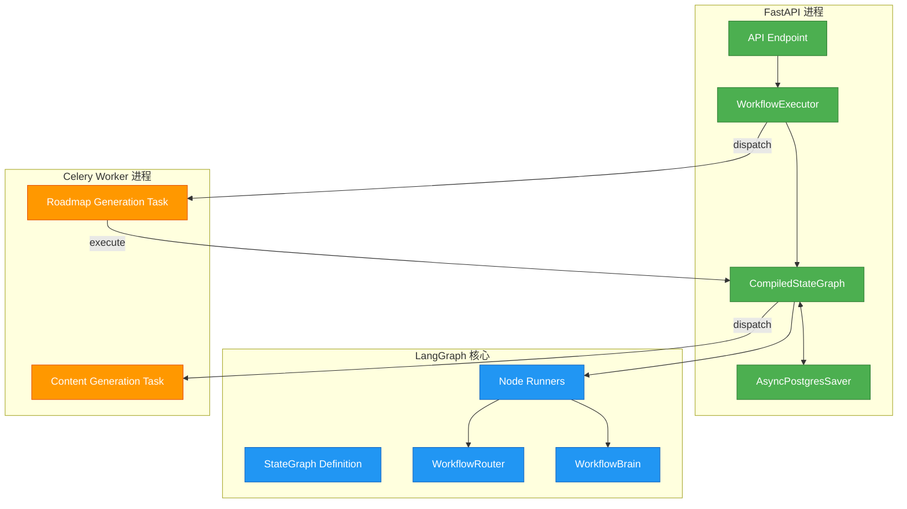
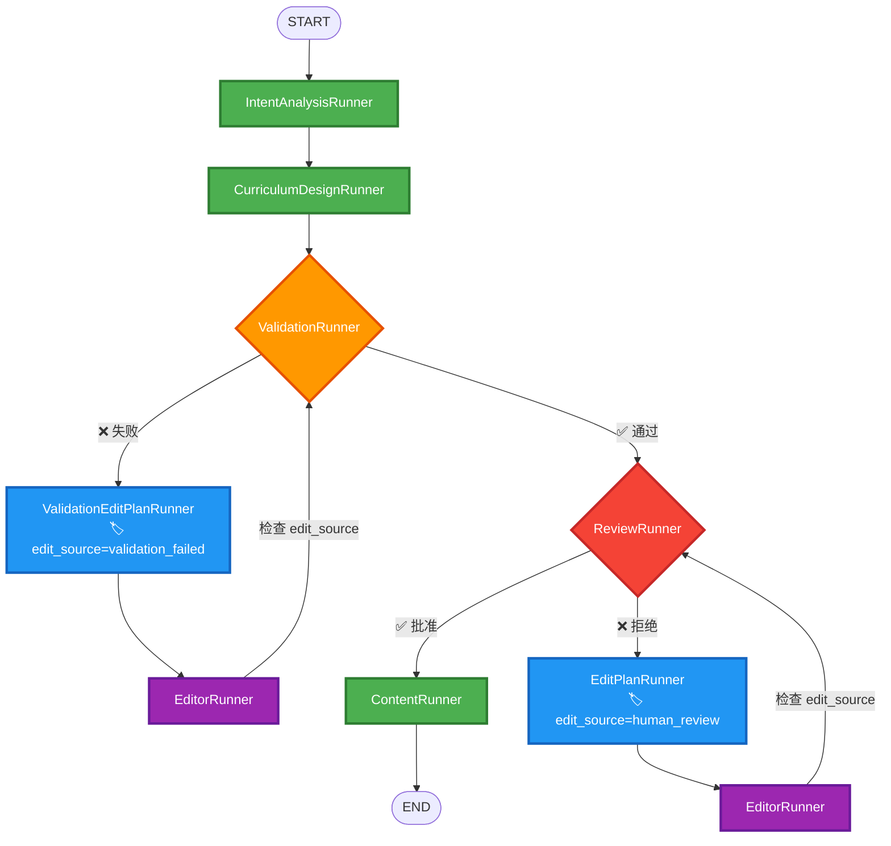
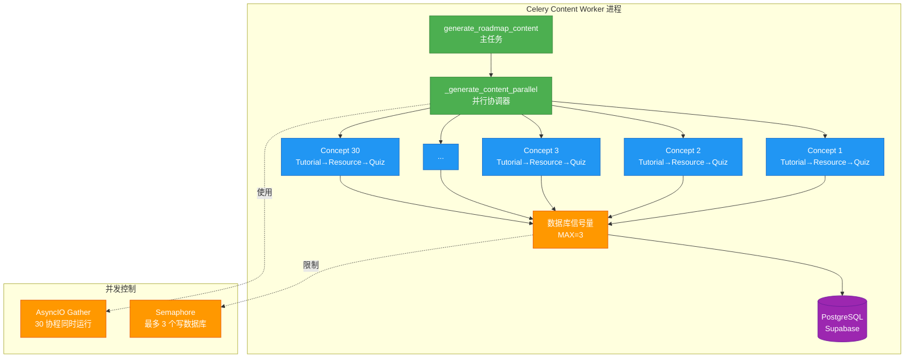
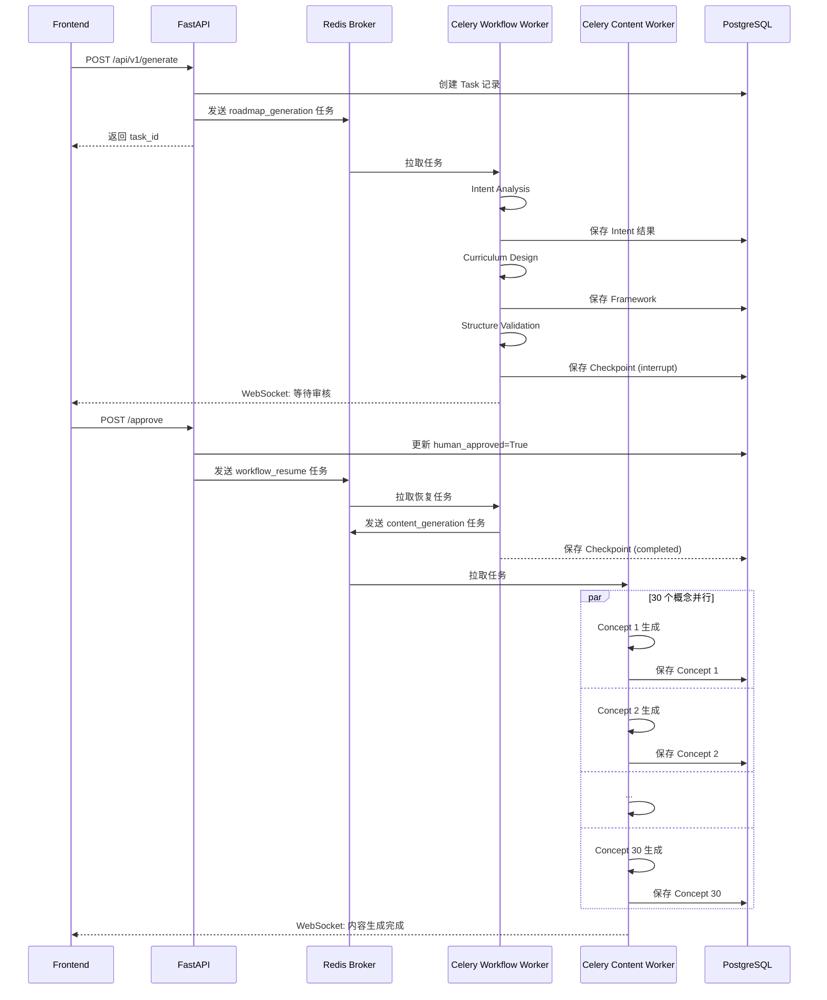

# 状态机流转与并行设计分析

> **分析日期**: 2026-01-01  
> **问题**: 内容生成的状态机流转实际运行逻辑和并行设计模式  
> **优先级**: 📊 架构理解

---

## 📋 目录

1. [LangGraph 状态机架构](#langgraph-状态机架构)
2. [状态定义与管理](#状态定义与管理)
3. [节点流转路径](#节点流转路径)
4. [并行设计模式](#并行设计模式)
5. [Celery 异步架构](#celery-异步架构)
6. [完整执行时序](#完整执行时序)

---

## 🔷 LangGraph 状态机架构

### 核心组件关系



---

## 📊 状态定义与管理

### RoadmapState 结构

```python
# backend/app/core/orchestrator/base.py:40-94

class RoadmapState(TypedDict):
    """
    工作流全局状态（LangGraph 状态容器）
    
    特点:
    - TypedDict 提供类型检查
    - Annotated 配合 reducer 函数实现状态合并
    - 所有节点共享同一个状态对象
    """
    
    # ============ 输入数据 ============
    user_request: UserRequest        # 用户原始请求
    task_id: str                     # 任务追踪 ID
    roadmap_id: str | None          # 路线图 ID (Intent 阶段生成)
    
    # ============ 中间产物 ============
    intent_analysis: IntentAnalysisOutput | None
    roadmap_framework: RoadmapFramework | None
    validation_result: ValidationOutput | None
    
    # ============ 内容生成结果 ============
    # 📌 使用 merge_dicts reducer 实现增量更新
    tutorial_refs: Annotated[dict[str, TutorialGenerationOutput], merge_dicts]
    resource_refs: Annotated[dict[str, ResourceRecommendationOutput], merge_dicts]
    quiz_refs: Annotated[dict[str, QuizGenerationOutput], merge_dicts]
    
    # 📌 使用 add reducer 实现列表追加
    failed_concepts: Annotated[list[str], add]
    execution_history: Annotated[list[str], add]
    
    # ============ Celery 异步状态 ============
    content_generation_status: str | None  # "queued" | "completed"
    celery_task_id: str | None            # Celery Task ID
    
    # ============ 流程控制 ============
    current_step: str                     # 当前步骤标识
    modification_count: int               # 修改次数计数器
    human_approved: bool                  # 人工审核结果
    validation_round: int                 # 验证轮次
    
    # ============ 人工审核相关 ============
    user_feedback: str | None             # 用户反馈文本
    edit_plan: EditPlan | None           # 结构化修改计划
    review_feedback_id: str | None       # 反馈记录 ID
    edit_plan_record_id: str | None      # 计划记录 ID
    edit_source: str | None              # "validation_failed" | "human_review"
```

**关键特性**:

1. **Reducer 函数机制**:
```python
def merge_dicts(left: dict, right: dict) -> dict:
    """
    字典合并 reducer
    
    工作原理:
    - LangGraph 调用时传入旧值 (left) 和新值 (right)
    - 返回合并后的字典
    - 确保状态更新是追加而非覆盖
    """
    return {**left, **right}

# 使用示例:
# 节点 A 返回: {"tutorial_refs": {"concept_1": tutorial_1}}
# 节点 B 返回: {"tutorial_refs": {"concept_2": tutorial_2}}
# 最终状态: {"tutorial_refs": {"concept_1": tutorial_1, "concept_2": tutorial_2}}
```

2. **状态持久化 (Checkpoint)**:
```python
# LangGraph 自动管理
config = {"configurable": {"thread_id": task_id}}
graph.invoke(initial_state, config)  # 每个节点执行后自动 checkpoint
```

---

## 🔄 节点流转路径

### 完整状态机图



### 条件路由逻辑

#### 1. 验证后路由 (route_after_validation)

```python
# backend/app/core/orchestrator/routers.py:29-77

def route_after_validation(self, state: RoadmapState) -> str:
    """
    验证后的路由决策
    
    决策树:
    ┌─ validation_result.is_valid?
    │
    ├─ False (验证失败)
    │  ├─ modification_count < max_retry?
    │  │  └─ Yes → "validation_edit_plan_analysis"  # 自动修复
    │  │  └─ No  → "human_review" or "tutorial_generation"  # 达到上限
    │  
    └─ True (验证通过)
       └─ skip_human_review?
          ├─ False → "human_review"           # 需要人工审核
          └─ True  → "tutorial_generation"    # 跳过审核
    """
    validation_result = state.get("validation_result")
    modification_count = state.get("modification_count", 0)
    
    # 验证失败 + 未达到最大重试次数
    if not validation_result.is_valid:
        if modification_count < self.config.max_framework_retry:
            return "validation_edit_plan_analysis"  # 进入自动修复循环
        else:
            # 达到最大重试次数，继续流程
            pass
    
    # 验证通过 or 达到最大重试次数
    if not self.config.skip_human_review:
        return "human_review"
    else:
        return "tutorial_generation"
```

**关键参数**:
- `max_framework_retry`: 默认 3 次
- `skip_human_review`: 默认 False (启用人工审核)

#### 2. 人工审核后路由 (route_after_human_review)

```python
def route_after_human_review(self, state: RoadmapState) -> str:
    """
    人工审核后的路由决策
    
    决策树:
    ┌─ human_approved?
    │
    ├─ True (用户批准)
    │  └─ "approved" → tutorial_generation
    │
    └─ False (用户拒绝)
       └─ "modify" → edit_plan_analysis → roadmap_edit → human_review
    """
    if state.get("human_approved", False):
        return "approved"  # 进入内容生成
    else:
        return "modify"    # 进入修改循环
```

#### 3. 编辑后路由 (route_after_edit)

```python
def route_after_edit(self, state: RoadmapState) -> str:
    """
    路线图编辑后的路由决策
    
    决策依据: edit_source 标记
    
    决策树:
    ┌─ edit_source?
    │
    ├─ "validation_failed"
    │  └─ "structure_validation"  # 返回验证节点
    │
    └─ "human_review"
       └─ "human_review"          # 返回人工审核节点
    """
    edit_source = state.get("edit_source")
    
    if edit_source == "validation_failed":
        return "structure_validation"
    elif edit_source == "human_review":
        return "human_review"
    else:
        # 默认返回验证
        return "structure_validation"
```

---

## ⚡ 并行设计模式

### 两阶段并行策略

| 阶段 | 执行模式 | 并行粒度 | 控制机制 |
|-----|---------|---------|---------|
| **路线图生成** | 串行 | 无并行 | LangGraph 顺序执行 |
| **内容生成** | 并行 | Concept 级别 | AsyncIO + Semaphore |

---

### 阶段 1: 路线图生成 (串行)

```python
# backend/app/core/orchestrator/builder.py:126-127

# 固定边: 串行执行
workflow.add_edge("intent_analysis", "curriculum_design")
workflow.add_edge("curriculum_design", "structure_validation")
```

**为什么串行?**
- ✅ **依赖关系强**: 每个节点依赖前一个节点的输出
- ✅ **LLM 调用顺序**: 需求分析 → 课程设计 → 结构验证
- ✅ **状态一致性**: 避免并发更新导致状态冲突

**时序图**:
```
时间轴    Intent      Curriculum    Validation    Review
  |
  0s    [ 分析需求 ]
  |         ↓
 10s    [ 完成 ] --> [ 设计课程 ]
  |                      ↓
 30s                  [ 完成 ] --> [ 验证结构 ]
  |                                    ↓
 35s                                [ 完成 ] --> [ 人工审核 ]
  |                                                  ↓
  ∞                                               [ 等待用户 ]
```

---

### 阶段 2: 内容生成 (并行)

#### 触发流程

```python
# backend/app/core/orchestrator/node_runners/content_runner.py:56-122

async def run(self, state: RoadmapState) -> dict:
    """
    ContentRunner 只负责分发 Celery 任务
    
    执行流程:
    1. 提取 roadmap_framework 和 preferences
    2. 发送 Celery 任务到 content_generation 队列
    3. 立即返回（不等待内容生成完成）
    """
    # 发送 Celery 任务
    celery_task = generate_roadmap_content.delay(
        task_id=task_id,
        roadmap_id=roadmap_id,
        roadmap_framework_data=framework.model_dump(mode="json"),
        user_preferences_data=user_request.preferences.model_dump(mode="json"),
    )
    
    # 返回状态更新
    return {
        "content_generation_status": "queued",
        "celery_task_id": celery_task.id,
        "current_step": "content_generation_queued",
    }
```

**关键特性**:
- ✅ **非阻塞**: ContentRunner 立即返回,不等待内容生成完成
- ✅ **进程隔离**: 内容生成在独立的 Celery Worker 进程中执行
- ✅ **状态追踪**: 通过 `celery_task_id` 追踪任务状态

---

#### Celery Worker 并行执行

```python
# backend/app/tasks/content_generation_tasks.py:324-416

async def _generate_content_parallel(
    task_id: str,
    roadmap_id: str,
    concepts: list[Concept],  # 假设 30 个概念
    ...
) -> tuple[dict, dict, dict, list]:
    """
    并行生成所有概念的内容
    
    并行策略:
    1. 概念间并行: 30 个概念同时生成 (AsyncIO)
    2. 数据库写入串行化: 信号量限制最多 3 个同时写入
    3. 单概念内串行: Tutorial → Resource → Quiz
    """
    
    # 🔧 信号量: 限制并发数据库操作数量
    MAX_DB_CONCURRENT = 3
    db_semaphore = asyncio.Semaphore(MAX_DB_CONCURRENT)
    
    # 📊 共享状态容器
    tutorial_refs: dict = {}
    resource_refs: dict = {}
    quiz_refs: dict = {}
    failed_concepts: list = []
    results_lock = asyncio.Lock()
    
    # 🚀 并发执行所有概念
    tasks = [
        generate_single_concept(
            concept=concept,
            db_semaphore=db_semaphore,  # 传递信号量
            tutorial_refs=tutorial_refs,
            resource_refs=resource_refs,
            quiz_refs=quiz_refs,
            failed_concepts=failed_concepts,
            results_lock=results_lock,
            ...
        )
        for concept in concepts  # 30 个协程
    ]
    
    # ⚡ AsyncIO 并发执行
    await asyncio.gather(*tasks, return_exceptions=True)
    
    return tutorial_refs, resource_refs, quiz_refs, failed_concepts
```

---

#### 单概念生成流程

```python
# backend/app/tasks/concept_generator.py:24-362

async def generate_single_concept(
    concept: Concept,
    db_semaphore: asyncio.Semaphore,
    ...
) -> None:
    """
    为单个概念串行生成内容
    
    执行顺序:
    1. Tutorial Generation (教程生成)
    2. Resource Recommendation (资源推荐)
    3. Quiz Generation (测验生成)
    4. 立即写入数据库 (受信号量保护)
    """
    
    # ==================== 串行执行 ====================
    # 1️⃣ 生成教程
    tutorial_agent = agent_factory.create_tutorial_generator()
    tutorial = await tutorial_agent.execute(tutorial_input)
    
    # 2️⃣ 生成资源
    resource_agent = agent_factory.create_resource_recommender()
    resource = await resource_agent.execute(resource_input)
    
    # 3️⃣ 生成测验
    quiz_agent = agent_factory.create_quiz_generator()
    quiz = await quiz_agent.execute(quiz_input)
    
    # ==================== 写入数据库 ====================
    # 🔧 使用信号量限制并发数据库连接
    async with db_semaphore:  # ⏳ 最多 3 个协程同时持有
        async with safe_session_with_retry() as session:
            await tutorial_repo.save_tutorial(tutorial, roadmap_id)
            await resource_repo.save_resource_recommendation(resource, roadmap_id)
            await quiz_repo.save_quiz(quiz, roadmap_id)
            await session.commit()
```

---

### 并行模型可视化



---

### 并发性能分析

#### 理论时间成本

```python
# 假设单个概念生成时间:
tutorial_time = 10s
resource_time = 5s
quiz_time = 3s
db_write_time = 2s

single_concept_time = 10 + 5 + 3 + 2 = 20s

# 30 个概念:
# 顺序执行: 30 × 20 = 600s (10 分钟)
# 完全并行: 20s (理想情况)
# 实际并行 (信号量=3): 20s + (30-3) × 2 / 3 = 20 + 18 = 38s
```

**实际情况**:
- ✅ **LLM 调用并行**: 30 个概念同时调用 OpenAI/Anthropic API
- ⚠️ **数据库写入串行化**: 信号量限制最多 3 个同时写入
- ⚠️ **连接池争抢**: 可能导致等待时间增加

---

## 🔄 Celery 异步架构

### 双层异步设计



---

### 任务队列分离

| 队列名称 | 处理内容 | Worker 数量 | 并发数 | 特点 |
|---------|---------|------------|-------|------|
| **roadmap_workflow** | LangGraph 工作流执行 | 1主 + 4工作 = 5 | 4 | 长时间运行,有状态 |
| **content_generation** | 内容并行生成 | 1主 + 6工作 = 7 | 6 | CPU 密集,LLM 调用 |
| **logs** | 日志批量写入 | 1主 + 4工作 = 5 | 4 | 轻量级,高吞吐 |

**配置文件**:
```bash
# backend/scripts/railway_entrypoint.sh

# Celery Workflow Worker
celery -A app.core.celery_app worker \
  --queues=roadmap_workflow \
  --concurrency=4 \
  --time-limit=3600

# Celery Content Worker
celery -A app.core.celery_app worker \
  --queues=content_generation \
  --concurrency=6 \
  --time-limit=1800
```

---

## ⏱️ 完整执行时序

### 正常流程 (无审核拒绝)

```
时间轴  FastAPI  Workflow Worker  Content Worker  前端状态
  |
  0s    [ 接收请求 ]
  |         ↓
  1s    [ 创建任务 ] --> [ Celery: roadmap_generation ]
  |     [ 返回 task_id ]                ↓
  2s                   [ Intent Analysis ] --> WebSocket: 需求分析中
  |                          ↓
 12s                   [ Curriculum Design ] --> WebSocket: 课程设计中
  |                          ↓
 32s                   [ Structure Validation ] --> WebSocket: 结构验证中
  |                          ↓
 37s                   [ Human Review WAIT ] --> WebSocket: 等待审核
  |                          ↓ (interrupt)
  |                   [ Checkpoint 保存 ]
  |                          ⏸️
  ∞                    [ 等待用户批准... ]
  |
  ?     [ /approve ]        ↓
  |         ↓          [ Resume from Checkpoint ]
  +1s               [ Content Generation Node ]
  |                          ↓
  +2s               [ Dispatch to content_generation queue ]
  |                          ↓                    ↓
  +3s                   [ 返回 END ]      [ Celery: generate_roadmap_content ]
  |                                             ↓
  +4s                                     [ 并行生成 30 个概念 ]
  |                                             ↓
  +34s                                    [ 全部完成 ] --> WebSocket: 内容生成完成
```

**关键时间点**:
- **0-2s**: FastAPI 处理请求,分发 Celery 任务
- **2-37s**: LangGraph 工作流串行执行 (35 秒)
- **∞**: 等待人工审核 (不确定时间)
- **+1-+3s**: 恢复工作流,分发内容生成任务
- **+4-+34s**: 并行生成内容 (30 秒)

---

### 异常流程: 验证失败自动修复

```
时间轴  Workflow Worker                状态机节点
  |
 32s    [ Structure Validation ]       structure_validation
  |            ↓
  |     [ is_valid = False ]
  |            ↓
 33s    [ route_after_validation ]      (路由决策)
  |            ↓
  |     [ modification_count < 3? ]
  |            ↓ Yes
 34s    [ Validation Edit Plan Analysis ] validation_edit_plan_analysis
  |            ↓
 44s    [ Roadmap Edit ]                roadmap_edit
  |            ↓
  |     [ edit_source = "validation_failed" ]
  |            ↓
 54s    [ route_after_edit ]            (路由决策)
  |            ↓
  |     [ 返回 structure_validation ]
  |            ↓
 55s    [ Structure Validation ]        structure_validation (第 2 轮)
  |            ↓
  |     [ is_valid = True ✅ ]
  |            ↓
 60s    [ Human Review ]                human_review
```

**循环终止条件**:
- ✅ 验证通过 (`is_valid = True`)
- ⚠️ 达到最大重试次数 (`modification_count >= 3`)

---

## 🎯 设计优势与权衡

### ✅ 优势

| 维度 | 优势 | 实现方式 |
|-----|------|---------|
| **进程隔离** | FastAPI 不被阻塞 | Celery 独立进程执行 |
| **可恢复性** | 支持断点续传 | LangGraph Checkpoint + PostgreSQL |
| **可观测性** | 完整的状态追踪 | WorkflowBrain 统一管理日志和通知 |
| **并发控制** | 避免连接池耗尽 | Semaphore 限制并发数据库操作 |
| **故障恢复** | 支持任务重试 | Celery 任务重试机制 |

---

### ⚠️ 权衡与约束

| 维度 | 约束 | 影响 |
|-----|------|------|
| **串行路线图生成** | LangGraph 顺序执行 | 无法并行化 Intent/Curriculum/Validation |
| **信号量限制** | 最多 3 个并发写数据库 | 降低吞吐量,但保护连接池 |
| **人工审核暂停** | GraphInterrupt 阻塞工作流 | Worker 进程资源占用 |
| **Checkpoint 开销** | 每个节点后写数据库 | ~50ms/checkpoint |

---

## 📚 相关文档

- [内容生成阻塞问题分析](./20250101_内容生成阻塞问题分析.md)
- [Celery 任务优化与速率限制](./20251231_Celery任务优化与速率限制.md)
- [并发控制机制分析](./20251231_并发控制机制分析.md)
- [数据库会话使用规范](./20251231_数据库会话使用规范.md)

---

**文档版本**: v1.0  
**最后更新**: 2026-01-01  
**维护者**: Backend Team

