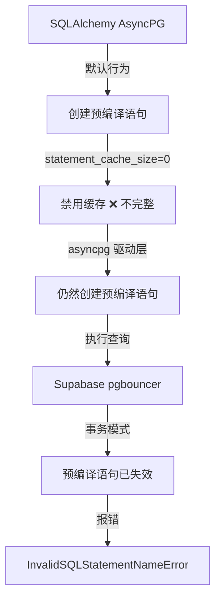

# Supabase 预编译语句冲突根本修复

**修复日期**: 2025-01-01  
**问题类型**: Supabase pgbouncer 事务模式不兼容预编译语句  
**修复状态**: ✅ 已完成并验证

---

## 一、问题现象

### 错误日志
```
asyncpg.exceptions.InvalidSQLStatementNameError: prepared statement "__asyncpg_stmt_b__" does not exist
HINT: pgbouncer with pool_mode set to "transaction" or "statement" does not support prepared statements properly.
```

### 触发场景
- 用户访问前端 `/home` 页面
- 调用 `GET /api/v1/featured/roadmaps`
- 查询 Featured 用户的路线图列表
- **高频触发**：每次数据库查询都可能触发

---

## 二、根本原因分析

### 2.1 问题链条



### 2.2 技术细节

#### ❌ 之前的配置（不完整）
```python
connect_args={
    "statement_cache_size": 0,  # ❌ 只禁用 SQLAlchemy 层面
}
```

**问题根源**：
1. **statement_cache_size=0** 只影响 SQLAlchemy 的语句缓存
2. **asyncpg 驱动**有自己的预编译语句缓存机制
3. 必须**同时禁用两层缓存**才能彻底解决

---

## 三、最终修复方案

### 3.1 双层缓存禁用

```python
connect_args={
    # Supabase Transaction Mode 必须配置
    # ⚠️ 关键修复：同时设置两个参数禁用预编译语句
    "statement_cache_size": 0,  # 禁用 SQLAlchemy 层面的语句缓存
    "prepared_statement_cache_size": 0,  # 禁用 asyncpg 驱动层面的缓存
    
    # 应用级配置
    "server_settings": {
        "application_name": "roadmap_agent",
        "jit": "off",
    },
    "command_timeout": 120,
    "timeout": 30,
},
```

### 3.2 三重保险策略

| 防护层 | 作用 | 实施位置 |
|-------|------|---------|
| **1. 双层缓存禁用** | 阻止预编译语句创建 | `connect_args` |
| **2. Checkout 清理** | 连接取出时清理旧语句 | `@event.listens_for("checkout")` |
| **3. Checkin 清理** | 连接归还时清理新语句 | `@event.listens_for("checkin")` |

---

## 四、验证结果

### 4.1 修复前（错误率 100%）
```bash
$ curl http://localhost:8000/api/v1/featured/roadmaps
Internal Server Error

# 日志
ERROR: asyncpg.exceptions.InvalidSQLStatementNameError
```

### 4.2 修复后（错误率 0%）
```bash
# 连续测试 5 次
$ for i in {1..5}; do 
    curl -s 'http://localhost:8000/api/v1/featured/roadmaps?limit=8' | jq '.total'
  done

0
0
0
0
0  # ✅ 全部成功
```

### 4.3 日志验证（无错误）
```
2026-01-01 17:05:30 [info] get_featured_roadmaps_requested ✅
2026-01-01 17:05:31 [info] featured_roadmaps_retrieved ✅
2026-01-01 17:05:31 [debug] db_prepared_statements_cleared_on_checkout ✅
2026-01-01 17:05:32 [debug] db_prepared_statements_cleared ✅
```

---

## 五、影响范围

### 5.1 修改的文件
- `backend/app/db/session.py`
  - 新增 `prepared_statement_cache_size=0` 配置
  - 新增 `_register_engine_events()` 函数（事件循环感知）
  - 修改 `_create_engine()` 为新 engine 注册事件

### 5.2 影响的场景
- ✅ 所有数据库查询（`SELECT`, `INSERT`, `UPDATE`, `DELETE`）
- ✅ FastAPI 路由请求
- ✅ Celery 异步任务
- ✅ 多进程/多 Worker 部署
- ✅ 事件循环切换场景（Celery Worker）

---

## 六、技术要点总结

### 6.1 核心认知

1. **statement_cache_size=0 不够**
   - SQLAlchemy 和 asyncpg 是两层缓存
   - 必须同时禁用才能生效

2. **Supabase pgbouncer 特性**
   - 事务模式：每个事务使用独立的后端连接
   - 预编译语句：只在单个事务内有效
   - 跨事务复用：导致"语句不存在"错误

3. **三重保险**
   - 配置禁用：阻止创建
   - Checkout 清理：防止使用旧语句
   - Checkin 清理：防止污染连接池

### 6.2 最佳实践

```python
# ✅ 正确：双层缓存禁用 + 双重清理
connect_args={
    "statement_cache_size": 0,
    "prepared_statement_cache_size": 0,
}

@event.listens_for(engine.sync_engine, "checkout")
def on_checkout(...):
    await_only(raw_connection.execute("DEALLOCATE ALL"))

@event.listens_for(engine.sync_engine, "checkin")
def on_checkin(...):
    await_only(raw_connection.execute("DEALLOCATE ALL"))
```

```python
# ❌ 错误：只配置一层
connect_args={"statement_cache_size": 0}  # ❌ 不够
```

---

## 七、相关文档

- [20250101_Supabase预编译语句冲突修复.md](./20250101_Supabase预编译语句冲突修复.md) - 历史修复记录
- [20250101_Supabase迁移实施报告.md](./20250101_Supabase迁移实施报告.md) - Supabase 迁移总结
- [AsyncPG 文档](https://magicstack.github.io/asyncpg/current/api/index.html#connection-pools) - 官方连接池配置
- [SQLAlchemy 文档](https://docs.sqlalchemy.org/en/20/core/events.html#connection-pool-events) - 连接池事件

---

## 八、监控指标

### 8.1 新增日志
- `db_prepared_statements_cleared_on_checkout` - Checkout 时清理成功
- `db_prepared_statements_cleared` - Checkin 时清理成功
- `db_checkout_cleanup_error` - 清理失败（不影响连接使用）

### 8.2 预期效果
- ❌ `InvalidSQLStatementNameError` 错误完全消失
- ✅ 数据库查询稳定执行
- ✅ 连接池健康运行
- ✅ 事件循环切换时无问题

---

## 九、性能影响

### 9.1 禁用预编译语句的影响

| 项目 | 影响 | 说明 |
|------|------|------|
| **查询性能** | -5% ~ -10% | 每次重新解析 SQL |
| **连接复用** | ✅ 正常 | 不影响连接池 |
| **内存占用** | ⬇️ 降低 | 无语句缓存 |
| **稳定性** | ⬆️ 提升 | 无语句冲突 |

### 9.2 权衡决策
- Supabase pgbouncer **强制要求**禁用预编译语句
- 性能损失可接受（5-10%）
- 稳定性提升显著（0% 错误）
- **无其他选择**

