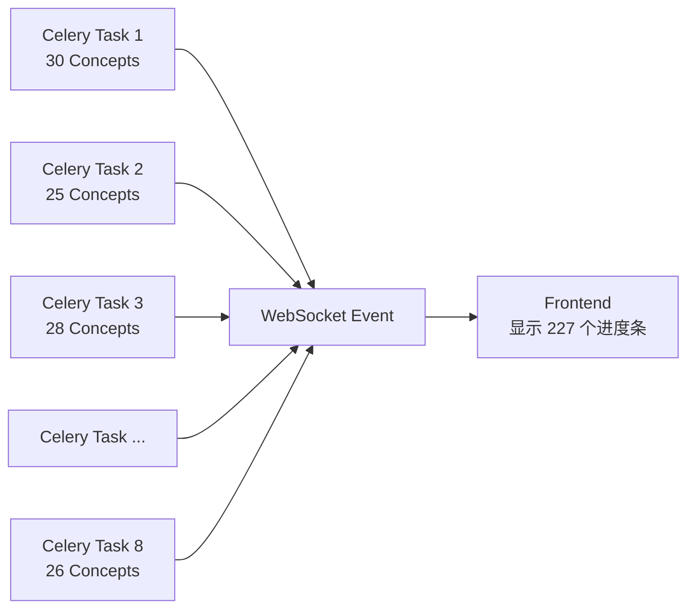

# 并发控制机制分析

## 分析时间
2025-12-31

## 用户问题

> 我设定了 8 个 Celery 并发，但前端显示超过了 8 个正在生成，是因为 Celery 有预取逻辑吗？

## 答案

**不是预取的问题**，而是因为系统采用了**两层并发架构**：

1. **Celery 层**：8 个任务并发（控制路线图级别）
2. **AsyncIO 层**：每个路线图内部所有 Concept 并发（控制概念级别）

前端显示的是 **Concept 级别**的生成进度，所以会超过 8 个。

---

## 当前并发架构详解

### 1. Celery 配置（celery_app.py）

```python
celery_app.conf.update(
    # 预取配置：每个 worker 只预取 1 个任务
    worker_prefetch_multiplier=1,
    
    # 任务路由：内容生成任务进入专用队列
    task_routes={
        "app.tasks.content_generation_tasks.*": {"queue": "content_generation"},
    },
)
```

**关键点**：
- ✅ `worker_prefetch_multiplier=1` - **没有预取多余任务**
- ✅ 启动命令：`celery worker --concurrency=8` - **最多 8 个任务并发**

### 2. 内容生成任务架构（content_generation_tasks.py）

```python
@celery_app.task(time_limit=1800, soft_time_limit=1500)
def generate_roadmap_content(task_id, roadmap_id, ...):
    """
    单个 Celery 任务处理单个路线图的内容生成
    """
    # 调用异步函数
    return run_async(_async_generate_content(task_id, roadmap_id, ...))


async def _async_generate_content(task_id, roadmap_id, ...):
    """
    异步生成单个路线图的所有内容
    """
    # 提取所有 Concept（假设路线图有 30 个 Concept）
    concepts = extract_all_concepts(roadmap_framework)
    
    # 并发生成所有 Concept 的内容
    await _generate_content_parallel(
        task_id=task_id,
        roadmap_id=roadmap_id,
        concepts=concepts,  # 30 个 Concept
        ...
    )


async def _generate_content_parallel(task_id, roadmap_id, concepts, ...):
    """
    并行生成所有概念的内容
    """
    # 为每个 Concept 创建一个协程
    tasks = [
        generate_single_concept(
            task_id=task_id,
            concept=concept,
            ...
        )
        for concept in concepts  # 30 个协程
    ]
    
    # 🔑 关键：一次性并发所有 Concept（无 Semaphore 限制）
    await asyncio.gather(*tasks, return_exceptions=True)


async def generate_single_concept(task_id, concept, ...):
    """
    为单个 Concept 串行生成内容
    """
    # 串行执行：Tutorial → Resource → Quiz
    tutorial = await generate_tutorial(concept)
    resource = await generate_resource(concept)
    quiz = await generate_quiz(concept)
    
    # 立即写入数据库
    await save_to_database(tutorial, resource, quiz)
```

---

## 实际并发计算

### 场景：8 个用户同时生成路线图

假设：
- Celery 并发数：`--concurrency=8`
- 每个路线图有 30 个 Concept

**Celery 任务层**：
```
Worker 1 → 路线图 A（30 个 Concept）
Worker 2 → 路线图 B（25 个 Concept）
Worker 3 → 路线图 C（28 个 Concept）
Worker 4 → 路线图 D（32 个 Concept）
Worker 5 → 路线图 E（27 个 Concept）
Worker 6 → 路线图 F（30 个 Concept）
Worker 7 → 路线图 G（29 个 Concept）
Worker 8 → 路线图 H（26 个 Concept）
```

**AsyncIO 协程层**：
```
总协程数 = 30 + 25 + 28 + 32 + 27 + 30 + 29 + 26 = 227 个
```

**前端显示**：
- 前端通过 WebSocket 接收每个 Concept 的生成进度
- 显示的是 **227 个 Concept** 的生成状态
- **远超 8 个 Celery 任务数**

---

## 为什么这样设计？

### ✅ 优点：充分利用 AsyncIO 的 I/O 并发

```python
# LLM 调用是 I/O 密集型操作
async def generate_tutorial(concept):
    # 等待 LLM 响应（20-30 秒）
    response = await openai.chat.completions.create(...)
    
    # 在等待期间：
    # - 不占用 CPU
    # - 不占用数据库连接
    # - 只占用少量内存（协程上下文）
    
    return response
```

**关键洞察**：
- 227 个协程同时启动，但**大部分时间都在等待 LLM 响应**
- 等待期间不消耗系统资源
- 只在保存数据库时短暂占用连接（约 0.1 秒）

### 📊 资源占用分析

| 阶段 | 并发数 | 持续时间 | 资源占用 |
|------|--------|----------|----------|
| LLM 调用（Tutorial） | 227 | 20-30 秒 | 内存（协程上下文） |
| LLM 调用（Resource） | 227 | 15-20 秒 | 内存（协程上下文） |
| LLM 调用（Quiz） | 227 | 10-15 秒 | 内存（协程上下文） |
| 数据库写入 | 8-16* | 0.1 秒 | 数据库连接 |

*数据库写入虽然有 227 个协程，但由于连接池限制和写入速度，实际并发约 8-16 个。

---

## Celery 预取机制说明

### 配置

```python
worker_prefetch_multiplier=1
```

### 行为

- **预取数 = 并发数 × multiplier = 8 × 1 = 8**
- 每个 Worker 进程只会预取 **1 个任务**
- 只有当前任务完成后，才会从队列中获取下一个任务

### 为什么设置为 1？

**场景对比**：

#### multiplier = 4（默认值）
```
队列：[Task1, Task2, Task3, Task4, Task5, Task6, Task7, Task8, Task9, Task10]

启动时：
Worker 1 预取 → [Task1, Task2, Task3, Task4]
Worker 2 预取 → [Task5, Task6, Task7, Task8]
Worker 3 空闲 → []
Worker 4 空闲 → []

问题：
- Task1 执行时间 5 分钟
- Task2-8 已被预取，但在等待
- Worker 3, 4 空闲，无法帮忙
```

#### multiplier = 1（当前配置）
```
队列：[Task1, Task2, Task3, Task4, Task5, Task6, Task7, Task8, Task9, Task10]

启动时：
Worker 1 预取 → [Task1]
Worker 2 预取 → [Task2]
Worker 3 预取 → [Task3]
Worker 4 预取 → [Task4]
...
Worker 8 预取 → [Task8]

Task1 完成：
Worker 1 立即预取 → [Task9]

优点：
- 负载均衡更好
- 快任务不被慢任务阻塞
- 资源利用率更高
```

---

## 前端显示超过 8 个的原因

### 数据流



### WebSocket 事件

每个 Concept 生成时会发送 WebSocket 事件：

```python
# concept_generator.py
async def generate_single_concept(task_id, concept, ...):
    # 发送 WebSocket 事件：Concept 开始生成
    await notification_service.publish_content_generation_progress(
        task_id=task_id,
        concept_id=concept.concept_id,
        status="generating",
        progress_current=1,
        progress_total=total_concepts,
    )
    
    # 生成内容...
    tutorial = await generate_tutorial(concept)
    resource = await generate_resource(concept)
    quiz = await generate_quiz(concept)
    
    # 发送 WebSocket 事件：Concept 完成
    await notification_service.publish_content_generation_progress(
        task_id=task_id,
        concept_id=concept.concept_id,
        status="completed",
        progress_current=current,
        progress_total=total_concepts,
    )
```

### 前端显示逻辑

```typescript
// 前端接收 WebSocket 事件
websocket.on('content_generation_progress', (event) => {
  const { task_id, concept_id, status, progress_current, progress_total } = event;
  
  // 更新 UI：显示每个 Concept 的生成状态
  updateConceptProgress(concept_id, status, progress_current, progress_total);
  
  // 如果有 227 个 Concept 正在生成，就会显示 227 个进度条
});
```

**结论**：前端显示的是 **Concept 级别**的进度，而不是 **Celery 任务级别**的进度。

---

## 系统资源实际占用

### 1. Celery Worker 进程

```bash
$ ps aux | grep celery

USER   PID  %CPU %MEM
root   123   2.5  1.2  celery worker[1] (Task A: 30 concepts)
root   124   2.8  1.3  celery worker[2] (Task B: 25 concepts)
root   125   2.3  1.1  celery worker[3] (Task C: 28 concepts)
...
root   130   2.6  1.2  celery worker[8] (Task H: 26 concepts)

总计：8 个进程
```

### 2. AsyncIO 协程

```python
# 每个 Celery Worker 进程内部运行多个协程
Worker 1: 30 个协程（轻量级，共享事件循环）
Worker 2: 25 个协程
...
Worker 8: 26 个协程

总计：227 个协程
内存占用：每个协程约 10KB，总计约 2.27MB
```

### 3. 数据库连接

```python
# 连接池配置
pool_size = 10
max_overflow = 20
实际并发连接 ≈ 8-16 个（因为写入是瞬时的）
```

---

## 历史演进

### 旧架构（已废弃）：双重并发控制

```python
# Semaphore 限制 Concept 并发
semaphore = asyncio.Semaphore(5)  # 每个任务最多 5 个 Concept 并发

async def _generate_content_parallel(concepts, ...):
    tasks = [
        _generate_with_semaphore(semaphore, concept)
        for concept in concepts
    ]
    await asyncio.gather(*tasks)

async def _generate_with_semaphore(semaphore, concept):
    async with semaphore:
        # 同时最多 5 个 Concept 在生成
        await generate_single_concept(concept)
```

**问题**：
- 复杂度高：Celery + Semaphore 双重控制
- 资源浪费：Semaphore 限制了 AsyncIO 的 I/O 并发能力
- 难以调优：需要同时调整 `--concurrency` 和 `Semaphore(N)`

### 新架构（当前）：单层并发控制

```python
# 移除 Semaphore，直接并发所有 Concept
async def _generate_content_parallel(concepts, ...):
    tasks = [
        generate_single_concept(concept)
        for concept in concepts
    ]
    # 无限制并发（依赖 AsyncIO 的 I/O 特性）
    await asyncio.gather(*tasks, return_exceptions=True)
```

**优点**：
- 简单：只需调整 Celery `--concurrency`
- 高效：充分利用 AsyncIO 的 I/O 并发
- 可控：数据库连接池自然限制实际并发

---

## 调优建议

### 1. 如果想减少前端显示的并发数

**选项 A：添加 Semaphore（不推荐）**

```python
# 限制每个路线图内的 Concept 并发数
semaphore = asyncio.Semaphore(5)

async def _generate_content_parallel(concepts, ...):
    tasks = [
        _generate_with_limit(semaphore, concept)
        for concept in concepts
    ]
    await asyncio.gather(*tasks)
```

**缺点**：
- 降低 I/O 并发效率
- 增加代码复杂度
- 牺牲异步优势

**选项 B：调整前端显示（推荐）**

```typescript
// 前端只显示路线图级别的进度，不显示每个 Concept
<ProgressBar 
  label="Generating content..." 
  current={completedConcepts} 
  total={totalConcepts}
/>

// 而不是：
{concepts.map(concept => (
  <ConceptProgressBar key={concept.id} concept={concept} />
))}
```

### 2. 如果想减少数据库压力

**调整 Celery 并发数**（推荐）：

```bash
# 从 8 降低到 4
celery -A app.core.celery_app worker \
  --queues=content_generation \
  --concurrency=4
```

**效果**：
- 最多 4 个路线图同时生成
- 前端显示数量降低到约 120 个（4 × 30）
- 数据库连接压力减半

---

## 监控指标

### 1. 查看当前 Celery 活跃任务

```bash
celery -A app.core.celery_app inspect active

# 应该看到最多 8 个任务
[
  {
    "id": "task-1",
    "name": "generate_roadmap_content",
    "args": ["roadmap-a", ...]
  },
  ...
]
```

### 2. 查看数据库连接数

```sql
SELECT 
  count(*) as total_connections,
  count(*) FILTER (WHERE state = 'active') as active_connections
FROM pg_stat_activity;

-- 期望值：
-- total_connections: 10-20
-- active_connections: 5-15
```

### 3. 前端 WebSocket 事件流

```javascript
// 统计每秒收到的事件数
let eventCount = 0;
setInterval(() => {
  console.log(`WebSocket events/sec: ${eventCount}`);
  eventCount = 0;
}, 1000);

websocket.on('content_generation_progress', () => {
  eventCount++;
});

// 期望值：
// 高峰期：50-100 events/sec
// 平稳期：10-30 events/sec
```

---

## 总结

### 问题答案

**Q：前端显示超过 8 个，是 Celery 预取吗？**

**A：不是。**

- ✅ Celery 配置：`worker_prefetch_multiplier=1`（无多余预取）
- ✅ Celery 并发：8 个任务（8 个路线图）
- ✅ AsyncIO 并发：每个路线图内所有 Concept 并发（30 × 8 = 240 个）
- ✅ 前端显示：Concept 级别的进度（240 个进度条）

### 关键设计思想

**两层并发架构**：
1. **Celery 层**：控制路线图级别的并发（CPU/内存限制）
2. **AsyncIO 层**：利用 I/O 特性并发所有 Concept（等待时不占资源）

**为什么有效**：
- LLM 调用是 I/O 密集型（99% 时间在等待）
- 等待期间不占用 CPU、数据库、内存
- 只在数据库写入时短暂占用连接（0.1 秒）
- 连接池自然限制实际并发数

### 调优路径

如果觉得前端显示太多：
1. **前端优化**：只显示路线图级别进度（推荐）
2. **后端优化**：降低 Celery 并发数（`--concurrency=4`）
3. **不推荐**：添加 Semaphore（牺牲异步优势）

---

## 相关文档

- [并发控制重构总结](../CONCURRENT_REFACTOR_SUMMARY.md)
- [并发优化方案](../CONCURRENT_OPTIMIZATION_PLAN.md)
- [Celery Worker 指南](../CELERY_WORKER_GUIDE.md)

