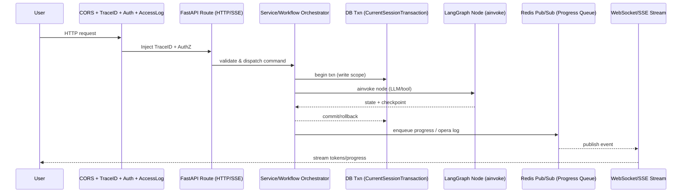

# 后端架构病理审查报告（针对 FastAPI + LangGraph + Celery）

## 风险评级矩阵

| 模块 | 风险描述 | 等级 | 后果推演 |
| --- | --- | --- | --- |
| 中间件栈 | `main.py` 仅挂载 `RequestID` 与 `CORS`，缺少统一的 TraceID/Auth/访问日志/状态中间件洋葱圈，未对齐指南要求的顺序 | 🔥高危 | 缺少鉴权与访问日志拦截，安全事件与性能问题无法追溯，异常流量直接进入业务层，压垮主循环 |
| DB 会话/背景任务 | `cover_image` 将请求级 `AsyncSession` 透传到 `BackgroundTasks`，请求结束即关闭，后台任务读写 DB 会报错/静默失败；`get_db` 未区分读写事务，所有请求均尝试 commit，违背读写分离 | 🔥高危 | 封面生成任务大面积失败且无告警，连接被过早关闭导致连接池耗尽；读请求多余 commit 增加锁冲突 |
| Celery/异步执行 | Celery 未启用 `celery-aio-pool`，任务函数同步+`asyncio.run` 包裹异步工作流；broker/result 同 Redis，缺少 AOF/持久化配置提示 | 🔥高危 | Worker 进程频繁创建事件循环，吞吐骤降；Redis 宕机/重启直接丢任务结果；LLM 阻塞拖垮队列 |
| LangGraph 状态与事务 | `WorkflowBrain` 在节点前使用 `AsyncSessionLocal` 直接更新任务状态，未与 LangGraph Checkpointer 事务绑定，也未使用 `safe_session_with_retry` | ⚠️警告 | 节点失败时状态可能已提交，导致前端看到“processing”但实际已终止；遇到连接抖动时无重试，容易写入不一致 |
| 序列化与性能 | 全局仍使用 `json` 序列化（如通知/Redis），未引入 `msgspec`；LiteLLM 未复用全局 AsyncClient | ⚠️警告 | 高并发推送时 CPU 开销高，通知延迟；HTTP 连接无法复用，LLM 调用 QPS 受限 |
| 架构分层 | 路由层（如 `generation.py`）包含任务验证与重试循环、直接调度 Celery，缺少 service 层编排；Prompt/Agent 逻辑分散在路由与 service 混用 | ℹ️建议 | 可维护性差，后续接入新 Agent 或切换工作流需要改路由；难以做单元测试与横切扩展 |

### 证据片段

```
114:124:/Users/louie/Documents/Vibecoding/roadmap-agent/backend/app/main.py
app.add_middleware(RequestIDMiddleware)
app.add_middleware(
    CORSMiddleware,
    allow_origins=settings.get_cors_origins,
    allow_credentials=True,
    allow_methods=["*"],
    allow_headers=["*"],
)
```

```
91:105:/Users/louie/Documents/Vibecoding/roadmap-agent/backend/app/api/v1/endpoints/cover_image.py
background_tasks.add_task(
    service.generate_cover_image,
    roadmap_id=roadmap_id,
    prompt=prompt
)
```

```
847:899:/Users/louie/Documents/Vibecoding/roadmap-agent/backend/app/db/session.py
async def get_db() -> AsyncGenerator[AsyncSession, None]:
    async with safe_session() as session:
        try:
            yield session
            await session.commit()
```

```
33:63:/Users/louie/Documents/Vibecoding/roadmap-agent/backend/app/core/celery_app.py
celery_app = Celery(
    "roadmap_agent",
    broker=redis_url,
    backend=redis_url,
)
# 未启用 celery_aio_pool，仍为同步 worker
```

```
33:55:/Users/louie/Documents/Vibecoding/roadmap-agent/backend/app/tasks/roadmap_generation_tasks.py
def run_async(coro):
    return asyncio.run(coro)
```

```
223:238:/Users/louie/Documents/Vibecoding/roadmap-agent/backend/app/core/orchestrator/workflow_brain.py
async with AsyncSessionLocal() as session:
    repo = RoadmapRepository(session)
    await repo.update_task_status(...)
    await session.commit()
```

## 混合架构时序图（目标形态）



## 重构计划

### 阶段一：止血与维稳（P0）
- 中间件：按指南挂载 `RequestID → TraceID → Auth/JWT → AccessLog → State/OperaLog`，缺省的 Auth/日志必须补齐。
- 会话隔离：新增 `CurrentSession`（读）与 `CurrentSessionTransaction`（写）依赖，路由按读写注入；禁止在 `get_db` 自动 commit。
- 背景任务修复：封面/其他 `BackgroundTasks` 改为自行创建会话或改用 Celery；移除请求级 session 透传。
- Celery：启用 `celery-aio-pool` + `task_cls` 支持 async；为 Redis 开启 AOF 并分离 broker/result DB；避免 `asyncio.run`，改用原生 async task。

### 阶段二：标准化与分层（P1）
- 路由瘦身：`generation.py`、`cover_image.py` 仅做 HTTP 适配，业务迁移到 `services/`；Celery 分发/重试逻辑下沉服务层。
- 事务边界：在 Service 内集中开启/提交事务，LangGraph 节点落盘与 Checkpointer 写入同一事务，异常统一回滚。
- 日志链路：实现 OperaLog 队列 + 后台消费者（Celery/Redis Queue），杜绝同步写库；统一结构化日志携带 `request_id`/`trace_id`.
- 序列化：通知流与进程间通信切换 `msgspec`，减少 JSON 解析开销。

### 阶段三：性能与 AI 增强（P2）
- LangGraph 异步化：节点执行统一使用 `ainvoke`/`astream_events`，复用全局 Async LLM Client，减少连接抖动。
- 状态持久化：Checkpointer 落地 Postgres/Redis，移除内存态；为向量/检索连接池化并增加心跳。
- SSE/WS 体验：SSE 生成器改为 async generator，捕获 `asyncio.CancelledError` 做资源释放；进度推送走独立通道避免阻塞。
- 观测与压测：Prometheus 指标补全（队列长度、LLM 延迟、DB 池使用率），在优化后做并发压测与回归测试。

