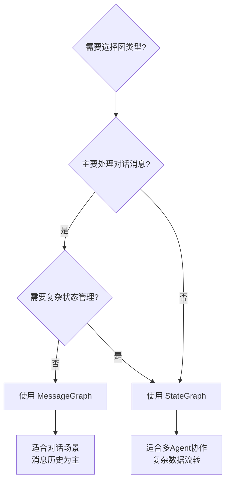
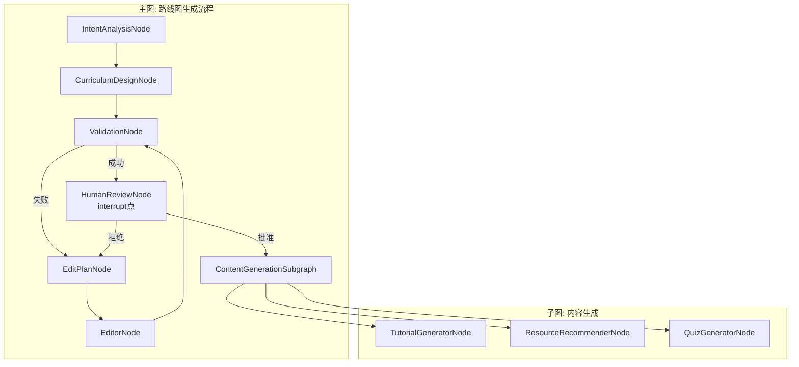
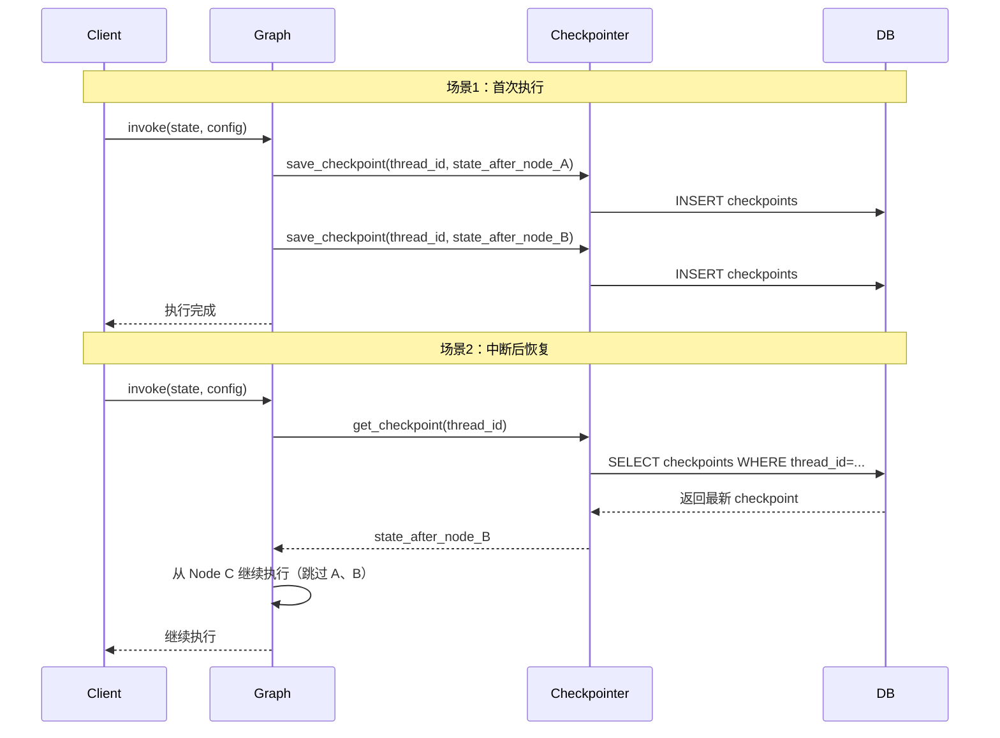
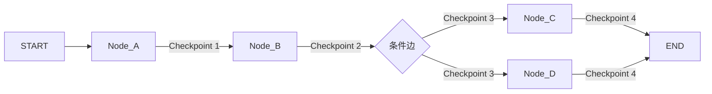
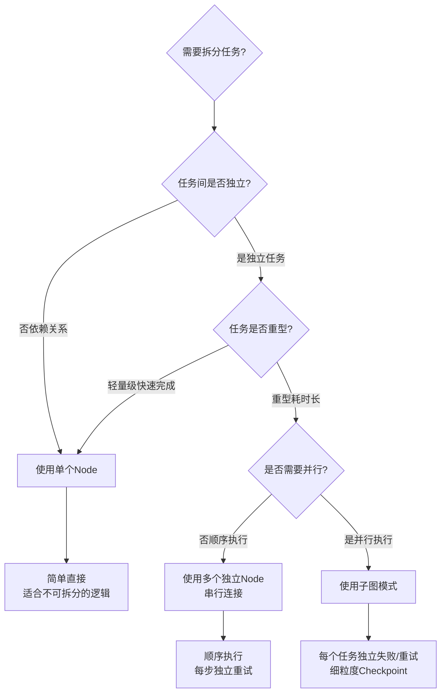

# LangGraph 1.0 生产级多智能体开发规范

**文档版本**: v1.0.0  
**创建日期**: 2026-01-10  
**适用项目**: 个性化学习路线图生成系统（Roadmap Agent）  
**维护团队**: Backend Team

---

## 文档说明

本规范基于 LangGraph 1.0 官方文档和生产环境最佳实践编写，旨在指导团队在多智能体系统开发中遵循统一的架构设计和代码规范。

### 规范等级定义

- **必须（MUST）**：强制性要求，违反将导致系统不稳定或不符合架构标准
- **应该（SHOULD）**：强烈建议遵循，除非有充分理由偏离
- **可以（MAY）**：可选建议，根据具体场景决定是否采用
- **禁止（MUST NOT）**：严格禁止的做法

---

## 目录

1. [核心概念与架构原则](#第1章核心概念与架构原则)
2. [状态管理与持久化](#第2章状态管理与持久化)
3. [子图模式与细粒度容错](#第3章子图模式与细粒度容错)
4. [人机协同与中断恢复](#第4章人机协同与中断恢复)
5. [动态并行与Send API](#第5章动态并行与send-api)
6. [生产环境部署与监控](#第6章生产环境部署与监控)

---

## 第1章：核心概念与架构原则

### 1.1 LangGraph 1.0 架构演进

#### 从 0.x 到 1.0 的关键变化

LangGraph 1.0 相比 0.x 版本引入了多项重大改进，对生产级多智能体系统的开发产生了深远影响：

**核心变化清单**：

1. **Checkpointer API 标准化**
   - 0.x：Checkpointer 初始化自动完成
   - 1.0：**必须（MUST）** 显式调用 `AsyncPostgresSaver.setup()` 初始化数据库表结构
   - 影响：启动流程需要增加初始化步骤

2. **Human-in-the-Loop 机制增强**
   - 0.x：依赖自定义状态标记实现人工介入
   - 1.0：提供原生 `interrupt()` API 和 `Command(resume=value)` 恢复机制
   - 影响：人机协同模式更加规范和可靠

3. **动态并行能力提升**
   - 0.x：固定并行边，需要预定义节点数量
   - 1.0：**Send API** 支持运行时动态创建并行执行路径
   - 影响：Map-Reduce 模式更加灵活，适合处理动态数量的任务

4. **重试策略精细化**
   - 0.x：仅在 Agent 层面配置重试
   - 1.0：支持 **Node 级别的 RetryPolicy**，可针对不同异常类型配置独立策略
   - 影响：容错能力显著提升

5. **流式监控模式扩展**
   - 0.x：有限的 stream 支持
   - 1.0：提供 `updates`、`debug`、`custom`、`messages` 等多种流式模式
   - 影响：生产环境可观测性大幅提升

#### 架构原则对照表

| 原则 | 0.x 时代常见做法 | 1.0 推荐做法 | 规范等级 |
|------|-----------------|-------------|---------|
| **状态持久化** | 手动管理 Redis 或内存状态 | 使用 AsyncPostgresSaver + 显式 setup() | **必须** |
| **人工审核** | 自定义状态字段 + 轮询 | interrupt() + Command(resume) | **应该** |
| **并行容错** | 单个 Node 内 asyncio.gather | 子图（Subgraph）+ 独立 Checkpoint | **必须** |
| **动态任务** | 预定义所有可能路径 | Send API 动态分发 | **应该** |
| **错误重试** | try-except + 手动重试 | RetryPolicy 声明式配置 | **应该** |

---

### 1.2 StateGraph vs MessageGraph

LangGraph 提供两种核心图结构，适用于不同场景：

#### StateGraph（推荐用于多 Agent 协作）

**定义**：使用自定义 TypedDict 定义状态结构，支持复杂的数据流转。

**适用场景**：
- 多 Agent 协作系统（如本项目的路线图生成流程）
- 需要在节点间传递结构化数据
- 涉及复杂的状态合并逻辑

**代码示例**：

```python
from typing import TypedDict, Annotated
from langgraph.graph import StateGraph, START, END
import operator

class RoadmapState(TypedDict):
    """路线图生成状态（全局上下文）"""
    user_id: str
    thread_id: str
    intent_analysis: dict  # 意图分析结果
    curriculum_draft: dict  # 课程大纲草稿
    validation_issues: Annotated[list, operator.add]  # 验证问题列表（支持累加）
    modification_count: int  # 修改次数
    human_approved: bool  # 人工审批标记

def intent_analysis_node(state: RoadmapState) -> dict:
    """意图分析节点"""
    # 执行意图分析逻辑
    return {"intent_analysis": {"goal": "全栈开发", "level": "beginner"}}

def curriculum_design_node(state: RoadmapState) -> dict:
    """课程设计节点"""
    # 基于意图分析结果设计课程
    return {"curriculum_draft": {"stages": [...]}}

# 构建图
builder = StateGraph(RoadmapState)
builder.add_node("intent_analysis", intent_analysis_node)
builder.add_node("curriculum_design", curriculum_design_node)
builder.add_edge(START, "intent_analysis")
builder.add_edge("intent_analysis", "curriculum_design")
builder.add_edge("curriculum_design", END)

graph = builder.compile()
```

#### MessageGraph（适用于对话型 Agent）

**定义**：专为聊天场景优化，状态固定为 `MessagesState`，包含 `messages: List[BaseMessage]`。

**适用场景**：
- 单一对话型 Agent（如本项目的 QA Agent、Mentor Agent）
- 消息历史是核心状态
- 需要与 LangChain 的 Chat Model 深度集成

**代码示例**：

```python
from langgraph.graph import MessagesState, StateGraph, START, END
from langchain_openai import ChatOpenAI

def qa_agent_node(state: MessagesState) -> dict:
    """问答 Agent 节点"""
    model = ChatOpenAI(model="gpt-4")
    response = model.invoke(state["messages"])
    return {"messages": [response]}

builder = StateGraph(MessagesState)
builder.add_node("qa_agent", qa_agent_node)
builder.add_edge(START, "qa_agent")
builder.add_edge("qa_agent", END)

graph = builder.compile()
```

#### 选择指南



**规范要求**：
- **必须（MUST）**：在多 Agent 协作场景（如路线图生成主流程）使用 `StateGraph`
- **应该（SHOULD）**：在单一对话 Agent（如 QA、Mentor）使用 `MessageGraph`
- **可以（MAY）**：在 StateGraph 中嵌套使用 MessageGraph 子图

---

### 1.3 Reducer 模式：并发场景下的状态合并策略

#### 核心问题

当多个节点并行执行并同时修改状态的同一字段时，如何确保数据不丢失？

**错误示例**（会导致数据覆盖）：

```python
from typing import TypedDict

class State(TypedDict):
    results: list  # ❌ 没有 Reducer，并行节点会互相覆盖

def node_a(state: State) -> dict:
    return {"results": ["A的结果"]}

def node_b(state: State) -> dict:
    return {"results": ["B的结果"]}  # ⚠️ 会覆盖 A 的结果！
```

#### 解决方案：使用 Annotated + Reducer

LangGraph 1.0 通过 `Annotated` 类型标注来指定状态字段的合并策略：

```python
from typing import Annotated
import operator

class State(TypedDict):
    # ✅ 使用 operator.add 作为 Reducer，自动合并列表
    results: Annotated[list, operator.add]

def node_a(state: State) -> dict:
    return {"results": ["A的结果"]}

def node_b(state: State) -> dict:
    return {"results": ["B的结果"]}

# 最终 state["results"] = ["A的结果", "B的结果"]
```

#### 常用 Reducer 策略

| Reducer | 适用场景 | 示例 |
|---------|---------|------|
| `operator.add` | 列表累加、字符串拼接 | `Annotated[list, operator.add]` |
| `operator.or_` | 字典合并（后者覆盖前者） | `Annotated[dict, operator.or_]` |
| 自定义函数 | 复杂合并逻辑 | `Annotated[list, custom_merge]` |

#### 自定义 Reducer 示例

```python
def merge_validation_issues(existing: list, new: list) -> list:
    """
    自定义验证问题合并逻辑：
    1. 去重（基于问题描述）
    2. 按严重程度排序
    """
    all_issues = existing + new
    unique_issues = {issue["description"]: issue for issue in all_issues}
    sorted_issues = sorted(
        unique_issues.values(),
        key=lambda x: {"critical": 0, "warning": 1, "info": 2}[x["severity"]]
    )
    return sorted_issues

class RoadmapState(TypedDict):
    validation_issues: Annotated[list, merge_validation_issues]
```

#### 本项目应用建议

**必须（MUST）使用 Reducer 的场景**：
1. **并行内容生成**：教程、资源、测验并行生成时，结果列表必须累加
   ```python
   tutorials: Annotated[list, operator.add]
   resources: Annotated[list, operator.add]
   quizzes: Annotated[list, operator.add]
   ```

2. **验证错误收集**：多个验证器并行检查时，错误列表必须合并
   ```python
   validation_issues: Annotated[list, operator.add]
   ```

3. **成本追踪**：多个 Agent 并行调用 LLM 时，成本累加
   ```python
   total_cost_usd: Annotated[float, lambda a, b: a + b]
   ```

---

### 1.4 架构设计核心原则

基于 LangGraph 1.0 和生产环境实践，定义以下强制性架构原则：

#### 原则 1：单一职责原则（SRP）用于 Node 设计

**规范**：每个 Node 函数只执行一个明确的业务逻辑，不应包含多个不相关的职责。

**正确示例**：
```python
def validate_structure(state: RoadmapState) -> dict:
    """仅负责验证路线图结构"""
    issues = []
    # 验证逻辑...
    return {"validation_issues": issues, "is_valid": len(issues) == 0}

def generate_tutorial(state: RoadmapState) -> dict:
    """仅负责生成单个教程"""
    tutorial = create_tutorial(state["concept"])
    return {"tutorial": tutorial}
```

**错误示例**：
```python
def validate_and_generate(state: RoadmapState) -> dict:
    """❌ 同时负责验证和生成，违反 SRP"""
    issues = validate(state["framework"])
    if not issues:
        tutorials = generate_all_tutorials(state["concepts"])
        return {"issues": issues, "tutorials": tutorials}
```

#### 原则 2：失败隔离原则

**规范**：**必须（MUST）** 将可能失败的重型任务拆分为独立的子图或节点，避免单点故障导致整体流程失败。

**应用场景**：
- 并行生成教程、资源、测验时，单个失败不应影响其他任务
- 外部 API 调用（如 Tavily 搜索）应独立为可重试的节点

**实现方式**：参见第3章"子图模式与细粒度容错"

#### 原则 3：状态最小化原则

**规范**：**应该（SHOULD）** 在 State 中仅保留必要的数据，大文本内容（如教程 Markdown）应存储在外部（S3/OSS）并在 State 中保留引用。

**正确示例**：
```python
class RoadmapState(TypedDict):
    curriculum_framework: dict  # ✅ 轻量级骨架数据
    tutorial_refs: dict[str, str]  # ✅ 仅保留 {concept_id: s3_url}
```

**错误示例**：
```python
class RoadmapState(TypedDict):
    tutorials: dict[str, str]  # ❌ 直接存储完整 Markdown，导致 State 过大
```

**理由**：
- Checkpoint 表会存储完整 State，过大会影响性能
- 网络传输和序列化开销大
- 超过 PostgreSQL 单行大小限制（默认 1GB）风险

#### 原则 4：显式优于隐式

**规范**：**必须（MUST）** 显式声明关键配置，不依赖默认行为。

**强制要求**：
- 显式调用 `AsyncPostgresSaver.setup()`
- 显式指定 `thread_id` 配置
- 显式定义 Node 的 `retry_policy`（即使不重试也应声明）

**代码示例**：
```python
# ✅ 正确：显式配置
checkpointer = AsyncPostgresSaver.from_conn_string(DATABASE_URL)
await checkpointer.setup()  # 显式初始化

graph = builder.compile(
    checkpointer=checkpointer,
    interrupt_before=["human_review"],  # 显式声明中断点
)

config = {
    "configurable": {
        "thread_id": f"roadmap_{user_id}_{session_id}",  # 显式构造
    }
}

# ❌ 错误：依赖默认行为
graph = builder.compile(checkpointer=checkpointer)  # 不声明中断点
result = graph.invoke(input_data)  # 没有提供 config
```

---

### 1.5 本项目架构映射

将 LangGraph 1.0 的概念映射到本项目的路线图生成系统：

#### 系统层级结构



#### Node 职责映射表

| LangGraph 概念 | 项目中的实现 | 文件路径 | 职责 |
|---------------|------------|---------|------|
| StateGraph | 路线图生成主流程 | `app/core/graph_builder.py` | 编排所有 Agent 协作 |
| Node | Intent Analyzer | `app/agents/intent_analyzer.py` | 解析用户需求 |
| Node | Curriculum Architect | `app/agents/curriculum_architect.py` | 设计课程框架 |
| Node | Structure Validator | `app/agents/structure_validator.py` | 验证框架合理性 |
| Node | Roadmap Editor | `app/agents/roadmap_editor.py` | 修正框架问题 |
| Interrupt Point | Human Review | `app/api/routes/roadmap.py` | 等待人工审批 |
| Subgraph | Content Generation | `app/core/content_subgraph.py` | 并行生成教程/资源/测验 |
| Checkpointer | AsyncPostgresSaver | `app/db/session.py` | 状态持久化 |

#### 状态定义示例

```python
from typing import TypedDict, Annotated
import operator

class RoadmapGenerationState(TypedDict):
    """路线图生成全局状态（符合 LangGraph 1.0 规范）"""
    
    # ===== 元数据 =====
    user_id: str
    thread_id: str
    session_id: str
    
    # ===== 核心数据（轻量级） =====
    user_request: dict  # 用户原始请求
    intent_analysis: dict  # 意图分析结果
    curriculum_framework: dict  # 课程框架（不含详细内容）
    
    # ===== 验证与修改追踪 =====
    validation_issues: Annotated[list, operator.add]  # 验证问题（支持累加）
    modification_count: int  # 修改次数
    edit_source: str  # 修改来源: "validation_failed" | "human_review"
    
    # ===== 人机协同 =====
    human_approved: bool
    human_feedback: str | None
    
    # ===== 内容生成引用（不存储完整内容） =====
    tutorial_refs: dict[str, str]  # {concept_id: s3_url}
    resource_refs: dict[str, str]
    quiz_refs: dict[str, str]
    
    # ===== 成本与监控 =====
    total_cost_usd: Annotated[float, lambda a, b: a + b]  # 累加成本
    execution_history: Annotated[list, operator.add]  # 执行历史
```

---

**本章小结**：

- LangGraph 1.0 相比 0.x 在持久化、人机协同、动态并行等方面有重大改进
- 多 Agent 协作场景必须使用 StateGraph，对话场景可使用 MessageGraph
- 并发场景下必须使用 Reducer 模式避免状态覆盖
- 遵循 SRP、失败隔离、状态最小化、显式配置四大核心原则
- 本项目的路线图生成流程是 LangGraph 多图嵌套模式的典型应用

---

## 第2章：状态管理与持久化

### 2.1 AsyncPostgresSaver 最佳实践

#### 核心原理

LangGraph 1.0 的 `AsyncPostgresSaver` 是生产环境推荐的 Checkpointer 实现，它将图的执行状态持久化到 PostgreSQL 数据库，实现以下关键能力：

1. **断点续传（Resume from Checkpoint）**：任务中断后可从上次成功的节点继续执行
2. **状态回溯（Time Travel）**：可查看历史执行状态，支持审计和调试
3. **人机协同（Human-in-the-Loop）**：中断任务等待人工输入后恢复执行
4. **多会话隔离（Thread Isolation）**：通过 `thread_id` 隔离不同用户/任务的状态

#### 初始化与 setup() 调用规范

**规范要求**：**必须（MUST）** 在应用启动时显式调用 `setup()` 方法初始化数据库表结构。

**错误做法**（LangGraph 0.x 时代可以工作，1.0 会报错）：

```python
# ❌ 错误：忘记调用 setup()
from langgraph.checkpoint.postgres.aio import AsyncPostgresSaver

checkpointer = AsyncPostgresSaver.from_conn_string(DATABASE_URL)
graph = builder.compile(checkpointer=checkpointer)
# 运行时报错：Table 'checkpoints' does not exist
```

**正确做法**（符合 LangGraph 1.0 规范）：

```python
# ✅ 正确：显式初始化
from langgraph.checkpoint.postgres.aio import AsyncPostgresSaver
import structlog

logger = structlog.get_logger()

async def init_checkpointer(database_url: str) -> AsyncPostgresSaver:
    """
    初始化 Checkpoint 存储
    
    注意事项：
    1. setup() 是幂等操作，多次调用不会出错
    2. 会创建以下表：
       - checkpoints: 存储完整状态快照
       - checkpoint_writes: 存储增量写入
    3. 必须在编译图之前调用
    """
    checkpointer = AsyncPostgresSaver.from_conn_string(database_url)
    
    try:
        await checkpointer.setup()
        logger.info("checkpointer_setup_success", tables=["checkpoints", "checkpoint_writes"])
    except Exception as e:
        logger.error("checkpointer_setup_failed", error=str(e))
        raise
    
    return checkpointer

# 应用启动时
checkpointer = await init_checkpointer(settings.DATABASE_URL)
graph = builder.compile(checkpointer=checkpointer)
```

#### 数据库表结构

`setup()` 方法会创建两张核心表：

**checkpoints 表**：

| 字段名 | 类型 | 说明 |
|--------|------|------|
| thread_id | TEXT | 线程标识符（用于隔离不同任务） |
| checkpoint_ns | TEXT | Checkpoint 命名空间（默认 ""） |
| checkpoint_id | TEXT | Checkpoint 唯一 ID |
| parent_checkpoint_id | TEXT | 父 Checkpoint ID（用于状态链） |
| type | TEXT | Checkpoint 类型 |
| checkpoint | JSONB | **完整状态快照**（State + 元数据） |
| metadata | JSONB | 额外元数据（时间戳、用户信息等） |

**checkpoint_writes 表**：

| 字段名 | 类型 | 说明 |
|--------|------|------|
| thread_id | TEXT | 关联的线程 ID |
| checkpoint_ns | TEXT | 命名空间 |
| checkpoint_id | TEXT | 关联的 Checkpoint ID |
| task_id | TEXT | 任务 ID（用于并行任务追踪） |
| idx | INTEGER | 写入序号 |
| channel | TEXT | 状态通道名称 |
| type | TEXT | 写入类型 |
| value | JSONB | **增量写入数据** |

**存储策略对比**：

| 策略 | 优点 | 缺点 | 适用场景 |
|------|------|------|---------|
| 完整快照（checkpoints 表） | 恢复快速，无需重放 | 存储空间大 | 节点数量少，State 较小 |
| 增量写入（checkpoint_writes 表） | 节省空间，追踪细节 | 恢复需要重放 | 并行任务多，需要审计 |

LangGraph 1.0 **自动结合两种策略**，无需手动选择。

---

### 2.2 thread_id 管理策略

#### 核心概念

`thread_id` 是 Checkpoint 系统的核心标识符，用于隔离不同用户、任务或会话的状态。

**类比**：
- 在 Web 应用中，`thread_id` 相当于 `session_id`
- 在对话系统中，`thread_id` 相当于 `conversation_id`
- 在本项目中，`thread_id` 对应一次完整的路线图生成任务

#### thread_id 命名规范

**规范要求**：**必须（MUST）** 使用结构化的命名模式，确保唯一性和可追溯性。

**推荐模式**：

```python
# 模式 1：用户 + 任务类型 + 时间戳
thread_id = f"roadmap_{user_id}_{int(time.time())}"
# 示例："roadmap_user123_1704067200"

# 模式 2：用户 + 会话 ID（适合单用户多会话场景）
thread_id = f"{user_id}:session:{session_id}"
# 示例："user123:session:abc-def-123"

# 模式 3：UUID（简单但不便于追溯）
thread_id = str(uuid.uuid4())
# 示例："a1b2c3d4-e5f6-7890-abcd-ef1234567890"
```

**本项目推荐方案**：

```python
from datetime import datetime
import hashlib

def generate_thread_id(user_id: str, learning_goal: str) -> str:
    """
    生成路线图任务的 thread_id
    
    格式: roadmap_{user_id}_{goal_hash}_{timestamp}
    - user_id: 用户唯一标识
    - goal_hash: 学习目标的哈希值（前8位，用于区分不同学习目标）
    - timestamp: 创建时间戳（秒级）
    
    示例: roadmap_user123_a1b2c3d4_1704067200
    """
    goal_hash = hashlib.md5(learning_goal.encode()).hexdigest()[:8]
    timestamp = int(datetime.now().timestamp())
    return f"roadmap_{user_id}_{goal_hash}_{timestamp}"

# 使用示例
thread_id = generate_thread_id(
    user_id="user123",
    learning_goal="成为全栈工程师"
)
```

#### 配置传递规范

**规范要求**：**必须（MUST）** 在每次调用 `graph.invoke()`、`graph.stream()` 时通过 `config` 参数传递 `thread_id`。

**完整示例**：

```python
from langgraph.graph import StateGraph

# 构建并编译图
graph = builder.compile(checkpointer=checkpointer)

# 准备配置
config = {
    "configurable": {
        "thread_id": thread_id,  # ✅ 必须指定
    },
    "recursion_limit": 50,  # 可选：最大递归深度
}

# 调用图
result = await graph.ainvoke(initial_state, config=config)

# 流式调用
async for chunk in graph.astream(initial_state, config=config, stream_mode="updates"):
    print(chunk)
```

**错误示例**（会导致无法持久化）：

```python
# ❌ 错误：缺少 config 参数
result = await graph.ainvoke(initial_state)

# ❌ 错误：config 结构错误
config = {"thread_id": thread_id}  # 应该嵌套在 configurable 下
result = await graph.ainvoke(initial_state, config=config)
```

---

### 2.3 断点续传机制

#### 核心能力

断点续传是 LangGraph 持久化的核心价值，支持以下场景：

1. **任务中断恢复**：服务器重启、网络中断后继续执行
2. **人工审批恢复**：等待人工审核后继续执行
3. **失败重试**：某个节点失败后，从该节点重新开始（不重跑已成功的节点）

#### 工作原理



#### 实现示例

**场景 1：任务中断后自动恢复**

```python
async def execute_roadmap_generation(user_id: str, learning_goal: str):
    """
    执行路线图生成任务，支持断点续传
    """
    # 生成一致的 thread_id（同一用户+学习目标使用相同 ID）
    thread_id = f"roadmap_{user_id}_{hashlib.md5(learning_goal.encode()).hexdigest()[:8]}"
    
    config = {"configurable": {"thread_id": thread_id}}
    
    # 检查是否有未完成的任务
    state = await graph.aget_state(config)
    
    if state.values:
        logger.info("resume_from_checkpoint", thread_id=thread_id, next_node=state.next)
        # ✅ 自动从上次中断的地方继续
        result = await graph.ainvoke(None, config=config)
    else:
        logger.info("start_new_task", thread_id=thread_id)
        # 首次执行
        initial_state = {"user_id": user_id, "learning_goal": learning_goal}
        result = await graph.ainvoke(initial_state, config=config)
    
    return result
```

**场景 2：查看执行历史**

```python
async def get_execution_history(thread_id: str) -> list:
    """
    获取任务的完整执行历史（用于调试和审计）
    """
    config = {"configurable": {"thread_id": thread_id}}
    
    # 获取所有 Checkpoint
    checkpoints = []
    async for checkpoint in graph.aget_state_history(config):
        checkpoints.append({
            "checkpoint_id": checkpoint.config["configurable"]["checkpoint_id"],
            "timestamp": checkpoint.metadata.get("timestamp"),
            "next_node": checkpoint.next,
            "state_summary": {
                "step": checkpoint.values.get("current_step"),
                "modification_count": checkpoint.values.get("modification_count"),
            }
        })
    
    return checkpoints
```

---

### 2.4 Checkpoint 生命周期管理

#### 何时创建 Checkpoint

LangGraph 在以下时机**自动**创建 Checkpoint：

1. **每个 Node 执行完成后**：保存节点输出更新后的 State
2. **遇到 interrupt() 时**：保存当前 State 并暂停执行
3. **条件边决策后**：保存路由结果
4. **并行节点全部完成后**：保存合并后的 State

**可视化示例**：



#### Checkpoint 清理策略

**问题**：长期运行会导致 `checkpoints` 表无限增长，影响性能。

**解决方案**：定期清理过期的 Checkpoint。

**推荐策略**：

| 场景 | 保留时长 | 清理条件 |
|------|---------|---------|
| 已完成任务 | 7 天 | 任务状态为 END 且超过 7 天 |
| 失败任务 | 30 天 | 用于事后分析 |
| 等待人工审批 | 不清理 | 直到用户操作 |
| 开发/测试任务 | 1 天 | thread_id 包含 "test_" 前缀 |

**实现示例**：

```python
from datetime import datetime, timedelta
import asyncpg

async def cleanup_old_checkpoints(
    database_url: str,
    retention_days: int = 7
):
    """
    清理过期的 Checkpoint 记录
    
    Args:
        database_url: PostgreSQL 连接字符串
        retention_days: 保留天数（默认 7 天）
    """
    cutoff_time = datetime.now() - timedelta(days=retention_days)
    
    conn = await asyncpg.connect(database_url)
    
    try:
        # 清理已完成任务的 Checkpoint
        deleted_count = await conn.execute(
            """
            DELETE FROM checkpoints
            WHERE metadata->>'status' = 'completed'
              AND (metadata->>'timestamp')::timestamp < $1
            """,
            cutoff_time
        )
        
        logger.info("checkpoint_cleanup_success", deleted_count=deleted_count)
        
    finally:
        await conn.close()

# 定时任务（如使用 Celery Beat）
@celery.task
def scheduled_checkpoint_cleanup():
    """每天凌晨3点执行清理"""
    asyncio.run(cleanup_old_checkpoints(settings.DATABASE_URL, retention_days=7))
```

---

### 2.5 与当前项目的集成

#### 当前实现现状

检查项目 `app/db/session.py`，当前已有：

1. ✅ AsyncEngine 配置（连接池管理）
2. ✅ Prometheus 指标监控
3. ❌ 缺少 AsyncPostgresSaver 初始化
4. ❌ 缺少 Checkpoint 清理任务

#### 集成步骤

**步骤 1：在 `app/db/session.py` 中添加 Checkpointer 初始化**

```python
# app/db/session.py (新增)
from langgraph.checkpoint.postgres.aio import AsyncPostgresSaver

# 在模块级别定义全局 Checkpointer
checkpointer: AsyncPostgresSaver | None = None

async def init_checkpointer() -> AsyncPostgresSaver:
    """
    初始化 LangGraph Checkpointer
    
    必须在应用启动时调用（lifespan 事件）
    """
    global checkpointer
    
    if checkpointer is not None:
        return checkpointer
    
    checkpointer = AsyncPostgresSaver.from_conn_string(
        settings.DATABASE_URL,
        # 可选：自定义 Checkpoint 表名
        # serde=JsonPlusSerializer(),  # 自定义序列化器
    )
    
    await checkpointer.setup()
    logger.info("langgraph_checkpointer_initialized")
    
    return checkpointer

def get_checkpointer() -> AsyncPostgresSaver:
    """依赖注入：获取全局 Checkpointer"""
    if checkpointer is None:
        raise RuntimeError("Checkpointer not initialized. Call init_checkpointer() first.")
    return checkpointer
```

**步骤 2：在 FastAPI 启动时初始化**

```python
# app/main.py
from contextlib import asynccontextmanager
from app.db.session import init_checkpointer

@asynccontextmanager
async def lifespan(app: FastAPI):
    """应用生命周期管理"""
    # 启动时初始化
    await init_checkpointer()
    logger.info("app_startup_complete")
    
    yield
    
    # 关闭时清理（如果需要）
    logger.info("app_shutdown_start")

app = FastAPI(lifespan=lifespan)
```

**步骤 3：在 Graph 编译时使用**

```python
# app/core/graph_builder.py
from app.db.session import get_checkpointer

def build_roadmap_graph() -> CompiledGraph:
    """构建路线图生成图"""
    builder = StateGraph(RoadmapGenerationState)
    
    # 添加节点...
    builder.add_node("intent_analysis", intent_analysis_node)
    builder.add_node("curriculum_design", curriculum_design_node)
    # ...
    
    # 编译时注入 Checkpointer
    checkpointer = get_checkpointer()
    graph = builder.compile(
        checkpointer=checkpointer,
        interrupt_before=["human_review"],  # 人工审核前中断
    )
    
    return graph
```

---

**本章小结**：

- AsyncPostgresSaver 是 LangGraph 1.0 推荐的生产环境 Checkpointer，必须显式调用 `setup()`
- thread_id 是状态隔离的核心，必须使用结构化命名规范
- 断点续传机制支持任务中断恢复、人工审批恢复、失败重试
- Checkpoint 在每个节点执行后自动创建，需要定期清理避免表膨胀
- 本项目需要在应用启动时初始化 Checkpointer 并在图编译时注入

---

## 第3章：子图模式与细粒度容错

### 3.1 子图（Subgraph）设计原则

#### 核心问题：为什么需要子图？

在生产环境中，经常需要并发执行多个重型任务（如生成教程、推荐资源、生成测验）。如果将这些任务写在一个 Node 函数中（使用 `asyncio.gather`），会面临以下问题：

**反模式示例**（单 Node 内并发）：

```python
async def generate_all_content(state: RoadmapState) -> dict:
    """❌ 错误：在一个 Node 内并发执行所有任务"""
    concepts = state["concepts"]
    
    async def gen_tutorial(concept):
        return await tutorial_generator.execute(concept)
    
    async def gen_resource(concept):
        return await resource_recommender.execute(concept)
    
    async def gen_quiz(concept):
        return await quiz_generator.execute(concept)
    
    # 并发执行
    tasks = []
    for concept in concepts:
        tasks.extend([
            gen_tutorial(concept),
            gen_resource(concept),
            gen_quiz(concept),
        ])
    
    results = await asyncio.gather(*tasks, return_exceptions=True)
    # ⚠️ 问题：如果 gen_quiz 失败，整个 Node 失败
    # 重试时，已成功的 gen_tutorial 和 gen_resource 也会重跑！
```

**问题分析**：

1. **单点故障**：任何一个子任务失败，整个 Node 失败
2. **重试浪费**：重试时，已成功的任务也会重新执行
3. **Checkpoint 粒度粗**：只有整个 Node 完成后才保存 Checkpoint
4. **难以追踪**：无法知道哪个具体任务失败

#### 解决方案：子图模式

将每个独立任务拆分为子图中的独立节点，LangGraph 会为每个节点单独管理 Checkpoint。

**正确示例**（子图模式）：

```python
from langgraph.graph import StateGraph, START, END
from typing import TypedDict, Annotated
import operator

# 1. 定义子图状态
class ContentGenState(TypedDict):
    concept_id: str
    concept_data: dict
    # 使用 Reducer 支持并行累加
    tutorials: Annotated[list, operator.add]
    resources: Annotated[list, operator.add]
    quizzes: Annotated[list, operator.add]

# 2. 定义子图节点（每个节点是独立的失败单元）
async def generate_tutorial_node(state: ContentGenState) -> dict:
    """生成教程节点"""
    tutorial = await tutorial_generator.execute(state["concept_data"])
    return {"tutorials": [tutorial]}

async def recommend_resources_node(state: ContentGenState) -> dict:
    """推荐资源节点"""
    resources = await resource_recommender.execute(state["concept_data"])
    return {"resources": resources}

async def generate_quiz_node(state: ContentGenState) -> dict:
    """生成测验节点"""
    quiz = await quiz_generator.execute(state["concept_data"])
    return {"quizzes": [quiz]}

# 3. 构建子图
content_subgraph_builder = StateGraph(ContentGenState)
content_subgraph_builder.add_node("tutorial", generate_tutorial_node)
content_subgraph_builder.add_node("resource", recommend_resources_node)
content_subgraph_builder.add_node("quiz", generate_quiz_node)

# 并行执行：从 START 同时指向三个节点
content_subgraph_builder.add_edge(START, "tutorial")
content_subgraph_builder.add_edge(START, "resource")
content_subgraph_builder.add_edge(START, "quiz")

# 都直接结束（等待所有节点完成）
content_subgraph_builder.add_edge("tutorial", END)
content_subgraph_builder.add_edge("resource", END)
content_subgraph_builder.add_edge("quiz", END)

# 4. 编译子图
content_subgraph = content_subgraph_builder.compile()

# 5. 在主图中使用子图
main_builder = StateGraph(MainState)
main_builder.add_node("plan", plan_node)
main_builder.add_node("generate_content", content_subgraph)  # ✅ 直接作为节点添加
main_builder.add_edge("plan", "generate_content")
main_builder.add_edge("generate_content", END)
```

**优势对比**：

| 维度 | 单 Node 并发 | 子图模式 |
|------|------------|---------|
| **失败隔离** | ❌ 一个失败全部失败 | ✅ 失败的节点独立重试 |
| **Checkpoint 粒度** | 粗（整个 Node） | 细（每个子节点） |
| **重试效率** | 低（重跑所有任务） | 高（仅重跑失败任务） |
| **可追踪性** | 低（无法定位失败节点） | 高（清晰的节点名称） |
| **代码复杂度** | 低 | 中（需要定义子图） |

---

### 3.2 何时使用子图 vs 普通 Node

#### 决策树



#### 使用子图的强制场景

**必须（MUST）使用子图**：

1. **并行生成类任务**
   - 示例：为多个 Concept 并行生成教程、资源、测验
   - 理由：单个失败不应影响其他任务

2. **外部 API 并发调用**
   - 示例：并行调用 Tavily 搜索多个关键词
   - 理由：网络失败率高，需要独立重试

3. **Map-Reduce 模式**
   - 示例：处理动态数量的项目（N 个文件、N 个用户请求）
   - 理由：需要灵活的并行度

**应该（SHOULD）使用子图**：

1. **复杂的多步骤流程**
   - 示例：用户注册流程（验证邮箱 → 创建账户 → 发送欢迎邮件）
   - 理由：逻辑解耦，便于测试和维护

2. **可能循环的子流程**
   - 示例：验证 → 修正 → 重新验证循环
   - 理由：避免主图逻辑复杂化

**可以（MAY）使用普通 Node**：

1. **快速同步操作**
   - 示例：数据格式转换、简单计算
   - 理由：开销小，不需要细粒度 Checkpoint

2. **原子性操作**
   - 示例：数据库事务（要么全成功要么全失败）
   - 理由：不应拆分为多个节点

---

### 3.3 子图的自动 Checkpoint 继承

#### 核心特性

在 LangGraph 1.0 中，子图会**自动继承**父图的 Checkpointer，无需显式传递。

**代码示例**：

```python
from langgraph.checkpoint.memory import MemorySaver

# 子图定义（不需要指定 Checkpointer）
subgraph_builder = StateGraph(SubState)
subgraph_builder.add_node("node_1", node_1_func)
subgraph_builder.add_edge(START, "node_1")
subgraph_builder.add_edge("node_1", END)
subgraph = subgraph_builder.compile()  # ✅ 不需要传递 checkpointer

# 父图编译时指定 Checkpointer
checkpointer = MemorySaver()
parent_builder = StateGraph(ParentState)
parent_builder.add_node("subgraph", subgraph)
parent_graph = parent_builder.compile(checkpointer=checkpointer)  # ✅ 自动传递给子图
```

**执行时的 Checkpoint 层级**：

```
Checkpoints:
  ├── [Parent] after_node_A (checkpoint_id: 1)
  ├── [Parent] enter_subgraph (checkpoint_id: 2)
  │   ├── [Subgraph] after_sub_node_1 (checkpoint_id: 2.1)
  │   ├── [Subgraph] after_sub_node_2 (checkpoint_id: 2.2)
  │   └── [Subgraph] exit (checkpoint_id: 2.3)
  └── [Parent] after_node_B (checkpoint_id: 3)
```

**恢复机制**：

- 如果子图中的 `sub_node_2` 失败，重试时：
  - ✅ 跳过 `sub_node_1`（已有 Checkpoint 2.1）
  - ✅ 仅重跑 `sub_node_2`

---

### 3.4 RetryPolicy 配置

#### Node 级别的重试策略

LangGraph 1.0 支持为每个 Node 单独配置重试策略，无需在代码中手动编写 `try-except`。

**基础语法**：

```python
from langgraph.graph import StateGraph
from langgraph.types import RetryPolicy

builder = StateGraph(State)

builder.add_node(
    "node_name",
    node_function,
    retry_policy=RetryPolicy(
        max_attempts=3,  # 最大重试次数
        retry_on=ConnectionError,  # 仅在特定异常时重试
        backoff_factor=2.0,  # 指数退避因子
    )
)
```

#### 针对不同异常类型配置策略

**场景 1：数据库操作节点**

```python
import sqlite3
from langgraph.types import RetryPolicy

builder.add_node(
    "query_database",
    query_database_func,
    retry_policy=RetryPolicy(
        max_attempts=3,
        retry_on=sqlite3.OperationalError,  # 仅重试数据库锁错误
        backoff_factor=1.5,
    )
)
```

**场景 2：LLM 调用节点**

```python
from openai import RateLimitError, APIError
from langgraph.types import RetryPolicy

builder.add_node(
    "call_llm",
    llm_call_func,
    retry_policy=RetryPolicy(
        max_attempts=5,
        retry_on=(RateLimitError, APIError),  # 多种异常
        backoff_factor=2.0,  # 2^n 秒: 2s, 4s, 8s, 16s
    )
)
```

**场景 3：外部 API 调用（如 Tavily 搜索）**

```python
from requests.exceptions import Timeout, ConnectionError
from langgraph.types import RetryPolicy

builder.add_node(
    "tavily_search",
    tavily_search_func,
    retry_policy=RetryPolicy(
        max_attempts=3,
        retry_on=(Timeout, ConnectionError),
        backoff_factor=1.0,  # 线性退避: 1s, 2s, 3s
    )
)
```

#### 本项目应用建议

**必须（MUST）配置 RetryPolicy 的节点**：

| 节点名称 | 异常类型 | 重试次数 | 退避策略 | 理由 |
|---------|---------|---------|---------|------|
| Tutorial Generator | `litellm.RateLimitError` | 5 | 指数退避 | LLM 限流频繁 |
| Resource Recommender | `TavilyError`, `Timeout` | 3 | 指数退避 | 网络不稳定 |
| Quiz Generator | `litellm.APIError` | 3 | 指数退避 | API 偶发错误 |
| Structure Validator | 无 | 1 | 无 | 纯逻辑无需重试 |
| Database Writer | `OperationalError` | 3 | 线性退避 | 数据库锁 |

**配置示例**：

```python
# app/core/graph_builder.py
from langgraph.types import RetryPolicy
import litellm

def build_content_subgraph() -> CompiledGraph:
    """构建内容生成子图（含重试策略）"""
    builder = StateGraph(ContentGenState)
    
    # 教程生成器：高重试次数（LLM 限流常见）
    builder.add_node(
        "tutorial",
        generate_tutorial_node,
        retry_policy=RetryPolicy(
            max_attempts=5,
            retry_on=litellm.RateLimitError,
            backoff_factor=2.0,
        )
    )
    
    # 资源推荐：中等重试次数（网络调用）
    builder.add_node(
        "resource",
        recommend_resources_node,
        retry_policy=RetryPolicy(
            max_attempts=3,
            retry_on=(TimeoutError, ConnectionError),
            backoff_factor=1.5,
        )
    )
    
    # 测验生成：标准重试
    builder.add_node(
        "quiz",
        generate_quiz_node,
        retry_policy=RetryPolicy(
            max_attempts=3,
            retry_on=litellm.APIError,
            backoff_factor=2.0,
        )
    )
    
    # 并行执行
    builder.add_edge(START, "tutorial")
    builder.add_edge(START, "resource")
    builder.add_edge(START, "quiz")
    builder.add_edge("tutorial", END)
    builder.add_edge("resource", END)
    builder.add_edge("quiz", END)
    
    return builder.compile()
```

---

### 3.5 并行子任务容错模式

#### 失败隔离与部分成功处理

在并行生成教程、资源、测验的场景中，我们希望：

1. **单个失败不影响其他任务**：Quiz 失败不应阻止 Tutorial 和 Resource 完成
2. **部分成功可用**：即使 Quiz 失败，也应返回已成功的 Tutorial 和 Resource
3. **失败任务可单独重试**：用户可选择仅重试失败的任务

#### 实现模式

**模式 1：Ignore Failures（推荐）**

```python
from langgraph.graph import StateGraph, START, END

builder = StateGraph(ContentGenState)
builder.add_node("tutorial", generate_tutorial_node)
builder.add_node("resource", recommend_resources_node)
builder.add_node("quiz", generate_quiz_node)

# 并行执行
builder.add_edge(START, "tutorial")
builder.add_edge(START, "resource")
builder.add_edge(START, "quiz")
builder.add_edge("tutorial", END)
builder.add_edge("resource", END)
builder.add_edge("quiz", END)

# ✅ 关键：使用 MemorySaver 或 AsyncPostgresSaver 自动处理
# LangGraph 1.0 会自动捕获异常并保存到 Checkpoint
# 不会阻止其他并行节点的执行
graph = builder.compile(checkpointer=checkpointer)
```

**模式 2：显式错误收集**

```python
from typing import TypedDict, Annotated
import operator

class ContentGenState(TypedDict):
    concepts: list[dict]
    tutorials: Annotated[list, operator.add]
    resources: Annotated[list, operator.add]
    quizzes: Annotated[list, operator.add]
    errors: Annotated[list, operator.add]  # ✅ 收集错误信息

async def generate_tutorial_node(state: ContentGenState) -> dict:
    """生成教程节点（含错误处理）"""
    try:
        tutorial = await tutorial_generator.execute(state["concept_data"])
        return {"tutorials": [tutorial]}
    except Exception as e:
        # 捕获异常，不中断流程
        error = {
            "node": "tutorial",
            "concept_id": state["concept_id"],
            "error": str(e),
            "type": type(e).__name__,
        }
        return {"errors": [error]}

# 后续可以在汇总节点中处理错误
def aggregate_results(state: ContentGenState) -> dict:
    """汇总结果并报告部分失败"""
    total_concepts = len(state["concepts"])
    success_count = len(state["tutorials"])
    failed_count = len(state["errors"])
    
    logger.warning(
        "content_generation_completed",
        total=total_concepts,
        success=success_count,
        failed=failed_count,
        errors=state["errors"]
    )
    
    return {"generation_complete": True}
```

#### 单独重试失败任务

**实现步骤**：

1. 记录失败的 `concept_id` 到 State
2. 提供 API 端点接收重试请求
3. 使用相同 `thread_id` 和失败的 `concept_id` 重新调用子图

**代码示例**：

```python
# API 端点
@app.post("/roadmap/{roadmap_id}/retry-content")
async def retry_failed_content(
    roadmap_id: str,
    concept_ids: list[str],
):
    """重试失败的内容生成任务"""
    # 1. 获取原任务的 thread_id
    thread_id = f"roadmap_{roadmap_id}"
    config = {"configurable": {"thread_id": thread_id}}
    
    # 2. 获取当前状态
    state = await graph.aget_state(config)
    
    # 3. 过滤出需要重试的 concepts
    failed_concepts = [
        c for c in state.values["concepts"]
        if c["concept_id"] in concept_ids
    ]
    
    # 4. 仅对失败的 concepts 重新执行子图
    for concept in failed_concepts:
        sub_state = {
            "concept_id": concept["concept_id"],
            "concept_data": concept,
            "tutorials": [],
            "resources": [],
            "quizzes": [],
        }
        result = await content_subgraph.ainvoke(sub_state, config=config)
    
    return {"retried_count": len(failed_concepts)}
```

---

**本章小结**：

- 子图模式是实现细粒度容错的核心，必须用于并行重型任务
- 子图自动继承父图的 Checkpointer，无需显式传递
- RetryPolicy 应为每个节点单独配置，针对不同异常类型设计策略
- 并行任务应支持失败隔离，允许部分成功和单独重试
- 本项目的教程/资源/测验生成必须拆分为子图节点

---

## 第4章：人机协同与中断恢复

### 4.1 interrupt() API 使用规范

#### 核心概念

LangGraph 1.0 提供原生的 `interrupt()` API，用于实现 Human-in-the-Loop 模式。当执行到 `interrupt()` 时，图会暂停并保存当前状态，等待外部输入后恢复执行。

**基础用法**：

```python
from langgraph.types import interrupt

def human_review_node(state: RoadmapState) -> dict:
    """人工审核节点"""
    # 暂停执行并返回需要审核的数据
    approval = interrupt(
        value={
            "question": "是否批准此路线图？",
            "curriculum": state["curriculum_framework"],
            "validation_score": state["validation_score"],
        }
    )
    
    # 恢复执行后，approval 包含人工输入的值
    if approval:
        return {"human_approved": True, "human_feedback": approval.get("feedback")}
    else:
        return {"human_approved": False, "human_feedback": "用户拒绝"}
```

#### Interrupt Payload 设计规范

**规范要求**：**必须（MUST）** 在 interrupt payload 中包含：

1. **问题描述**（`question`）：明确告知用户需要做什么
2. **审核内容**：用户需要查看的完整数据
3. **操作选项**（`actions`）：可选的操作列表
4. **上下文信息**：帮助用户理解背景

**标准 Payload 结构**：

```python
interrupt_payload = {
    "question": "请审核生成的学习路线图",  # 必需
    "type": "roadmap_review",  # 必需：用于前端路由
    "data": {  # 必需：审核内容
        "curriculum": curriculum_framework,
        "validation_score": 95.5,
        "total_hours": 240,
        "stages_count": 4,
    },
    "actions": [  # 推荐：可选操作
        {"id": "approve", "label": "批准", "style": "primary"},
        {"id": "reject", "label": "拒绝并修改", "style": "danger"},
        {"id": "save_draft", "label": "保存草稿", "style": "secondary"},
    ],
    "context": {  # 可选：额外上下文
        "user_goal": state["user_request"]["learning_goal"],
        "modification_count": state["modification_count"],
    },
    "metadata": {  # 可选：元数据
        "timestamp": datetime.now().isoformat(),
        "thread_id": state["thread_id"],
    }
}

approval = interrupt(value=interrupt_payload)
```

---

### 4.2 Command(resume=value) 恢复机制

#### 恢复执行的标准流程

**步骤 1：检测中断状态**

```python
from langgraph.graph import StateGraph

# 构建图并编译（含 checkpointer）
graph = builder.compile(checkpointer=checkpointer)

# 执行图
config = {"configurable": {"thread_id": thread_id}}
try:
    result = await graph.ainvoke(initial_state, config=config)
except Exception as e:
    # 检查是否因 interrupt 暂停
    state = await graph.aget_state(config)
    if state.next:  # next 不为空表示有待执行的节点
        print(f"图在节点 {state.next} 处暂停，等待人工输入")
```

**步骤 2：获取 Interrupt Payload**

```python
state = await graph.aget_state(config)
if state.values.get("__interrupt__"):
    interrupt_data = state.values["__interrupt__"]
    # 返回给前端展示
    return {
        "status": "interrupted",
        "payload": interrupt_data,
        "thread_id": thread_id,
    }
```

**步骤 3：恢复执行**

```python
from langgraph.types import Command

# 用户提交审核结果后
human_input = {
    "approved": True,
    "feedback": "路线图设计合理，批准生成内容",
}

# 使用 Command(resume=...) 恢复执行
result = await graph.ainvoke(
    Command(resume=human_input),
    config=config
)
```

#### 本项目实现示例

**FastAPI 路由**：

```python
# app/api/routes/roadmap.py
from langgraph.types import Command

@app.post("/roadmap/{thread_id}/resume")
async def resume_roadmap_generation(
    thread_id: str,
    approval: RoadmapApprovalRequest,
):
    """恢复路线图生成（人工审核后）"""
    config = {"configurable": {"thread_id": thread_id}}
    
    # 构造恢复值
    resume_value = {
        "approved": approval.approved,
        "feedback": approval.feedback,
        "modifications": approval.modifications,
    }
    
    # 恢复执行
    try:
        result = await roadmap_graph.ainvoke(
            Command(resume=resume_value),
            config=config
        )
        return {"status": "completed", "result": result}
    except Exception as e:
        logger.error("resume_failed", error=str(e))
        raise HTTPException(status_code=500, detail=str(e))
```

---

### 4.3 短命任务 + 事件驱动二次调度模式

#### 核心问题

在复杂场景下（包含串行+并行+人机协同），如果让 Worker 傻等用户输入，会造成资源死锁。

**错误做法**（阻塞 Worker）：

```python
@celery.task
def run_roadmap_workflow(thread_id: str):
    # ❌ 错误：Celery Worker 会阻塞在这里
    result = graph.invoke(initial_state, config={"configurable": {"thread_id": thread_id}})
    # 如果遇到 interrupt，Worker 会一直等待，占用资源
```

#### 正确模式：短命任务 + 事件驱动

**核心思想**：
1. **Worker 不等待**：遇到 interrupt 立刻结束任务，释放资源
2. **API 做扳机**：用户输入后，API 触发新的 Celery 任务
3. **Checkpoint 做接力棒**：新任务通过 `thread_id` 自动从断点恢复

**实现示例**：

```python
# app/tasks/roadmap_tasks.py
from celery import Celery
from langgraph.types import Command

celery = Celery("roadmap")

@celery.task
def run_roadmap_workflow(thread_id: str, initial_state: dict | None = None):
    """
    执行路线图生成任务（短命模式）
    
    - 遇到 interrupt 立刻返回
    - 不阻塞 Worker
    """
    config = {"configurable": {"thread_id": thread_id}}
    
    try:
        if initial_state:
            # 首次执行
            result = graph.invoke(initial_state, config=config)
        else:
            # 恢复执行（从 Checkpoint）
            result = graph.invoke(None, config=config)
        
        return {"status": "completed", "result": result}
        
    except Exception as e:
        # 检查是否是 interrupt
        state = graph.get_state(config)
        if state.next:  # 有待执行节点 = 因 interrupt 暂停
            return {"status": "interrupted", "next_node": state.next[0]}
        else:
            # 真实错误
            raise

# API 端点：恢复执行
@app.post("/roadmap/{thread_id}/resume")
async def resume_workflow(thread_id: str, approval: dict):
    """用户提交审批后触发新任务"""
    config = {"configurable": {"thread_id": thread_id}}
    
    # 1. 更新状态（注入人工输入）
    await roadmap_graph.aupdate_state(
        config,
        values={"human_input": approval},
    )
    
    # 2. 触发新的 Celery 任务（不传 initial_state = 恢复模式）
    task = run_roadmap_workflow.delay(thread_id=thread_id)
    
    return {"task_id": task.id, "status": "resumed"}
```

---

### 4.4 update_state() 在人机交互中的应用

#### 手动更新状态

除了使用 `Command(resume=value)`，还可以使用 `update_state()` 直接修改状态后恢复执行。

**使用场景**：
- 用户修改路线图结构（不仅是批准/拒绝）
- 需要在恢复前进行数据预处理
- 多步骤人机交互（先保存草稿，后续继续编辑）

**语法**：

```python
await graph.aupdate_state(
    config,
    values={"curriculum_framework": modified_framework},
    as_node="human_review",  # 指定更新来源节点
)
```

**完整示例**：

```python
@app.post("/roadmap/{thread_id}/update-curriculum")
async def update_curriculum(
    thread_id: str,
    modified_curriculum: dict,
):
    """用户修改课程框架后更新状态"""
    config = {"configurable": {"thread_id": thread_id}}
    
    # 1. 更新状态
    await roadmap_graph.aupdate_state(
        config,
        values={
            "curriculum_framework": modified_curriculum,
            "modification_count": state.values["modification_count"] + 1,
            "edit_source": "human_review",
        },
        as_node="human_review",
    )
    
    # 2. 恢复执行（从验证节点重新开始）
    result = await roadmap_graph.ainvoke(None, config=config)
    
    return {"status": "updated", "result": result}
```

---

**本章小结**：

- interrupt() API 是 LangGraph 1.0 的原生人机协同机制，必须用于需要人工审批的节点
- Interrupt Payload 必须结构化，包含问题描述、审核内容、操作选项
- Command(resume=value) 用于恢复执行，传递人工输入值
- 生产环境必须采用"短命任务 + 事件驱动"模式，避免 Worker 阻塞
- update_state() 适用于需要手动修改状态后恢复执行的场景

---

## 第5章：动态并行与Send API

### 5.1 Send API 的 Map-Reduce 模式

#### 核心问题

固定并行模式（预定义节点数量）无法处理动态数量的任务，例如：
- 为 N 个 Concept 并行生成教程（N 在运行时确定）
- 并行处理用户上传的 M 个文件
- 动态启动 K 个爬虫任务

**固定并行的局限**：

```python
# ❌ 问题：必须预定义节点
builder.add_node("gen_concept_1", gen_func)
builder.add_node("gen_concept_2", gen_func)
builder.add_node("gen_concept_3", gen_func)
# 如果运行时有 100 个 Concept，需要定义 100 个节点？
```

#### 解决方案：Send API

使用 `Send` 动态创建并行执行路径。

**基础语法**：

```python
from langgraph.types import Send
from langgraph.graph import StateGraph, START, END

def fan_out_concepts(state: RoadmapState) -> list[Send]:
    """
    Map 阶段：为每个 Concept 动态创建一个并行任务
    """
    return [
        Send("generate_tutorial", {"concept": concept})
        for concept in state["concepts"]
    ]

def generate_tutorial(state: dict) -> dict:
    """
    处理单个 Concept（并行执行的最小单元）
    """
    tutorial = create_tutorial(state["concept"])
    return {"tutorials": [tutorial]}

# 构建图
builder = StateGraph(RoadmapState)
builder.add_node("fan_out", fan_out_concepts)
builder.add_node("generate_tutorial", generate_tutorial)

# 关键：使用 conditional_edges 动态分发
builder.add_conditional_edges(
    "fan_out",
    fan_out_concepts,
    ["generate_tutorial"]
)

builder.add_edge(START, "fan_out")
builder.add_edge("generate_tutorial", END)
```

---

### 5.2 状态聚合策略（Reducer）

#### 关键：使用 operator.add

Send API 场景下，多个并行实例返回的结果必须使用 Reducer 合并。

**完整示例**：

```python
from typing import TypedDict, Annotated
import operator

class RoadmapState(TypedDict):
    concepts: list[dict]
    # ✅ 关键：使用 operator.add 支持并行累加
    tutorials: Annotated[list, operator.add]

def fan_out(state: RoadmapState) -> list[Send]:
    return [
        Send("gen_tutorial", {"concept_id": c["id"], "concept": c})
        for c in state["concepts"]
    ]

def gen_tutorial(state: dict) -> dict:
    """每个实例返回一个教程"""
    tutorial = {"concept_id": state["concept_id"], "content": "..."}
    return {"tutorials": [tutorial]}  # 返回列表，会被 operator.add 累加

# 执行后，state["tutorials"] 自动包含所有并行任务的结果
```

---

### 5.3 固定并行 vs 动态并行的选择

| 场景 | 推荐模式 | 示例 |
|------|---------|------|
| 任务数量固定（< 10 个） | 固定并行（普通边） | 教程、资源、测验（3个固定任务） |
| 任务数量动态（运行时确定） | Send API | 为 N 个 Concept 生成教程 |
| 需要对列表中每一项执行相同操作 | Send API | 处理文件列表、用户列表 |

---

**本章小结**：

- Send API 支持运行时动态创建并行执行路径，是 Map-Reduce 模式的核心
- 必须使用 Reducer（如 operator.add）聚合并行任务结果
- 固定并行适合任务数量少且固定的场景，动态并行适合运行时确定数量的场景
- 本项目为 N 个 Concept 生成教程时应使用 Send API

---

## 第6章：生产环境部署与监控

### 6.1 Celery + LangGraph 集成架构

#### Stream Loop 旁路监控模式

**核心思想**：在 Celery Worker 中使用 `graph.stream()` 监听每个节点执行，旁路记录业务日志，不修改 Graph 代码。

**标准实现**：

```python
@celery.task(bind=True)
def run_agent_workflow(self, input_data: dict, thread_id: str):
    """
    Celery 任务：执行 LangGraph 工作流
    
    - 使用 stream() 实时监控
    - 旁路记录业务日志
    - 不阻塞 Graph 执行
    """
    config = {"configurable": {"thread_id": thread_id}}
    
    # ✅ 关键：使用 stream 而不是 invoke
    for chunk in graph.stream(input_data, config, stream_mode="updates"):
        node_name = list(chunk.keys())[0]
        output = list(chunk.values())[0]
        
        # 动作 A：写业务日志表（给前端轮询）
        db.save_execution_log(
            thread_id=thread_id,
            task_id=self.request.id,
            node=node_name,
            output=output,
            timestamp=datetime.now(),
        )
        
        # 动作 B：更新 Celery 任务状态（可选）
        self.update_state(
            state='PROGRESS',
            meta={'current_node': node_name, 'progress': calculate_progress(node_name)}
        )
        
        # 动作 C：推送实时通知（WebSocket/SSE）
        ws_manager.broadcast(thread_id, {
            "type": "node_completed",
            "node": node_name,
            "data": output,
        })
    
    return {"status": "workflow_finished"}
```

---

### 6.2 业务日志 vs Checkpoint 表分离

**规范要求**：**必须（MUST）** 将业务日志表与 LangGraph 的 Checkpoint 表分离。

| 表类型 | 用途 | 数据格式 | 保留时间 | 查询频率 |
|--------|------|---------|---------|---------|
| **Checkpoint 表** | 断点续传、状态恢复 | Binary/JSONB（完整 State） | 7-30 天 | 低（仅恢复时） |
| **业务日志表** | 前端展示、审计、分析 | JSON（结构化） | 长期（1年+） | 高（实时轮询） |

**业务日志表设计**：

```sql
CREATE TABLE roadmap_execution_logs (
    id BIGSERIAL PRIMARY KEY,
    thread_id VARCHAR(255) NOT NULL,
    task_id VARCHAR(255),
    node_name VARCHAR(100) NOT NULL,
    status VARCHAR(50) DEFAULT 'success',
    output JSONB,
    error_message TEXT,
    duration_ms INTEGER,
    created_at TIMESTAMP DEFAULT NOW(),
    INDEX idx_thread_id (thread_id),
    INDEX idx_created_at (created_at)
);
```

---

### 6.3 Stream Mode 选择指南

LangGraph 1.0 提供多种流式模式，适用于不同场景：

| Stream Mode | 输出内容 | 适用场景 | 性能开销 |
|-------------|---------|---------|---------|
| `updates` | 每个节点执行后的状态更新 | **生产环境推荐**：监控、日志记录 | 低 |
| `values` | 每个节点执行后的完整 State | 调试：查看完整状态变化 | 中 |
| `debug` | 详细执行信息（节点名、输入输出） | 开发调试 | 高 |
| `messages` | LLM 流式 Token 输出 | 实时展示 LLM 生成内容 | 中 |
| `custom` | 自定义事件流 | 工具调用进度、自定义通知 | 低 |

**推荐配置**：

```python
# 生产环境：使用 updates 模式
for chunk in graph.stream(input, config, stream_mode="updates"):
    log_to_database(chunk)

# 开发调试：使用 debug 模式
for chunk in graph.stream(input, config, stream_mode="debug"):
    print(chunk)
```

---

### 6.4 Prometheus 指标集成

**必须（MUST）监控的指标**：

1. **执行时长**：每个节点的执行耗时
2. **失败率**：节点失败次数 / 总执行次数
3. **重试次数**：RetryPolicy 触发的重试统计
4. **Checkpoint 大小**：State 序列化后的字节数
5. **并行任务数量**：Send API 创建的并行实例数量

**实现示例**：

```python
from prometheus_client import Histogram, Counter

node_duration = Histogram(
    'langgraph_node_duration_seconds',
    'Node execution duration',
    labelnames=['node_name', 'graph_name']
)

node_failures = Counter(
    'langgraph_node_failures_total',
    'Node execution failures',
    labelnames=['node_name', 'error_type']
)

# 在 stream loop 中记录
for chunk in graph.stream(input, config, stream_mode="updates"):
    node_name = list(chunk.keys())[0]
    
    with node_duration.labels(node_name=node_name, graph_name="roadmap").time():
        # 处理节点输出
        process_output(chunk)
```

---

**本章小结**：

- Celery + LangGraph 集成必须使用 Stream Loop 旁路监控模式
- 业务日志表与 Checkpoint 表必须分离，用途和生命周期不同
- 生产环境推荐使用 `stream_mode="updates"` 监控节点执行
- 必须集成 Prometheus 监控关键指标（执行时长、失败率、重试次数）
- 本项目需要在 Celery Task 中实现 Stream Loop 日志记录

---

## 文档总结

本规范文档基于 LangGraph 1.0 官方文档和生产环境最佳实践编写，涵盖了多智能体系统开发的核心主题：

1. **第1章**：LangGraph 1.0 架构演进、StateGraph 设计模式、Reducer 机制、核心架构原则
2. **第2章**：AsyncPostgresSaver 持久化、thread_id 管理、断点续传、Checkpoint 生命周期
3. **第3章**：子图模式、RetryPolicy 配置、细粒度容错、失败隔离
4. **第4章**：interrupt() API、Command(resume) 恢复、短命任务模式、update_state() 应用
5. **第5章**：Send API 动态并行、Map-Reduce 模式、状态聚合策略
6. **第6章**：Celery 集成、Stream Loop 监控、日志表分离、Prometheus 指标

**下一步行动**：

请参考配套文档《项目重构计划_LangGraph1.0迁移》，该文档将基于本规范对当前项目进行差距分析，并提供具体的重构步骤清单。

---

**文档版本**: v1.0.0  
**最后更新**: 2026-01-10  
**维护团队**: Backend Team  
**反馈渠道**: backend-team@example.com

