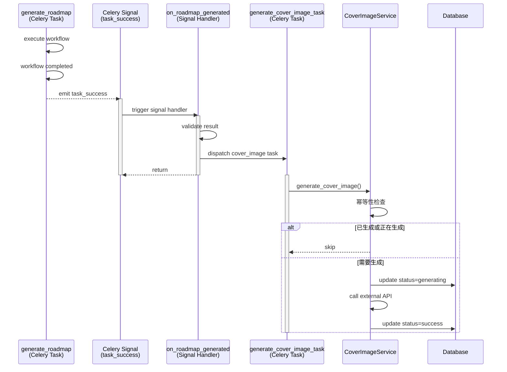

# 封面图生成架构优化：Celery Signal 解耦方案

**日期**：2026-01-10  
**架构优化**：方案2 - Celery Signal 事件驱动  
**影响范围**：后端（路线图生成工作流、封面图生成任务）

---

## 一、背景与问题

### 原有架构问题

**触发位置**：`WorkflowBrain.save_roadmap_metadata()`（第535-553行）

```python
# ❌ 旧方案：在工作流内部同步调用封面图生成
async with async_session_maker.begin() as session:
    cover_service = CoverImageService(session)
    await cover_service.generate_cover_image(
        roadmap_id=roadmap_id,
        prompt=prompt
    )
```

**违反的最佳实践**：

1. **LangGraph 工作流应该是纯粹的状态转换**，不应包含副作用（如调用外部 API）
2. **封面图生成是外部服务**（调用图片生成 API），耗时不可控
3. **阻塞工作流执行**：虽然有 try-except，但仍会占用工作流执行时间
4. **会话管理混乱**：在 WorkflowBrain 内部创建新 Session
5. **重复触发风险**：后端触发 + 前端补偿触发，缺乏幂等性保护

---

## 二、重构方案：Celery Signal（事件驱动）

### 架构设计



### 核心优势

| 优势 | 说明 |
|------|------|
| **完全解耦** | 路线图生成任务不关心封面图，符合单一职责原则 |
| **事件驱动** | 符合现代微服务架构模式 |
| **失败隔离** | 封面图生成失败不影响路线图创建 |
| **易于扩展** | 可添加其他后处理任务（邮件通知、分享卡片等） |
| **统一会话管理** | 每个任务独立管理数据库会话 |

---

## 三、实施步骤

### 步骤 1：添加 Celery Signal 处理器

**文件**：`app/tasks/roadmap_generation_tasks.py`

```python
from celery.signals import task_success

@task_success.connect(sender=generate_roadmap)
def on_roadmap_generated(sender, result, **kwargs):
    """
    路线图生成成功后自动触发封面图生成
    
    架构优势（方案2 - Celery Signal）：
    - 完全解耦：路线图生成任务不关心封面图
    - 事件驱动：符合现代架构模式
    - 失败隔离：封面图生成失败不影响路线图创建
    - 易于扩展：可添加其他后处理任务（邮件通知、分享卡片等）
    """
    # 仅在路线图生成成功时触发
    if not result.get("success"):
        return
    
    roadmap_id = result.get("roadmap_id")
    if not roadmap_id:
        return
    
    # 异步触发封面图生成任务
    from app.tasks.cover_image_tasks import generate_cover_image_task
    
    celery_task = generate_cover_image_task.delay(
        roadmap_id=roadmap_id,
        prompt=None,  # 使用默认提示词
    )
    
    logger.info(
        "cover_image_task_dispatched",
        roadmap_id=roadmap_id,
        celery_task_id=celery_task.id,
        trigger_source="celery_signal",
    )
```

### 步骤 2：从 WorkflowBrain 删除封面图生成代码

**文件**：`app/core/orchestrator/workflow_brain.py`（第535-553行）

```python
# ✅ 架构优化：封面图生成已迁移到 Celery Signal
# 路线图生成任务成功后会自动触发 generate_cover_image_task
# 参见：app/tasks/roadmap_generation_tasks.py::on_roadmap_generated()
```

**删除的代码**（19行）：
- 移除 `CoverImageService` 导入
- 移除封面图生成逻辑
- 移除异常处理代码

### 步骤 3：增强幂等性检查

**文件**：`app/services/cover_image_service.py`

```python
# ✅ 幂等性检查 1：如果已经成功生成过，直接返回
if cover_image and cover_image.generation_status == "success":
    logger.info("cover_image_already_exists_skip_generation", ...)
    return cover_image.cover_image_url

# ✅ 幂等性检查 2：如果正在生成中，避免重复触发
if cover_image and cover_image.generation_status == "generating":
    logger.info("cover_image_already_generating_skip_duplicate", ...)
    return None

# ✅ 幂等性检查 3：如果重试次数超过限制，不再重试
if cover_image and cover_image.retry_count >= MAX_RETRY_COUNT:
    logger.warning("cover_image_max_retries_exceeded_skip", ...)
    return None
```

### 步骤 4：添加数据库字段

**文件**：`app/models/database.py`

```python
class RoadmapCoverImage(SQLModel, table=True):
    # ... 其他字段 ...
    
    retry_count: int = Field(
        default=0,
        description="重试次数（用于幂等性检查和重试限制）"
    )
```

**迁移文件**：`alembic/versions/add_retry_count_to_cover_images.py`

```python
def upgrade() -> None:
    """添加 retry_count 字段"""
    op.add_column(
        'roadmap_cover_images',
        sa.Column('retry_count', sa.Integer(), nullable=False, server_default='0')
    )
```

---

## 四、执行迁移

### 自动迁移（推荐）

```bash
cd backend
./scripts/migrate_cover_image_retry_count.sh
```

### 手动迁移

```bash
cd backend
alembic upgrade head
```

---

## 五、验证清单

### 功能验证

- [ ] 创建新路线图后，封面图自动生成
- [ ] 封面图生成失败不影响路线图创建
- [ ] 重复触发时幂等性生效（跳过重复生成）
- [ ] 前端批量触发仍正常工作（兜底机制）
- [ ] 手动重试按钮正常工作

### 代码验证

- [x] Celery Signal 处理器已添加
- [x] WorkflowBrain 封面图代码已删除
- [x] CoverImageService 幂等性检查已增强
- [x] 数据库字段已添加
- [x] 迁移文件已创建
- [x] Linter 检查通过

### 日志验证

预期日志（正常流程）：

```
[INFO] celery_task_completed task_id=xxx success=True
[INFO] auto_trigger_cover_image_generation roadmap_id=xxx trigger_source=celery_signal
[INFO] cover_image_task_dispatched celery_task_id=xxx
[INFO] cover_image_task_started roadmap_id=xxx
[INFO] cover_image_task_completed status=success
```

预期日志（幂等性生效）：

```
[INFO] cover_image_already_exists_skip_generation roadmap_id=xxx
```

---

## 六、回滚方案

如果需要回滚到旧架构：

### 1. 恢复 WorkflowBrain 代码

```bash
git checkout HEAD~1 backend/app/core/orchestrator/workflow_brain.py
```

### 2. 移除 Signal 处理器

```python
# 注释掉 roadmap_generation_tasks.py 中的 Signal 处理器
```

### 3. 回滚数据库迁移

```bash
cd backend
alembic downgrade -1
```

---

## 七、影响范围

### 修改的文件

| 文件 | 修改类型 | 行数变化 |
|------|---------|---------|
| `app/tasks/roadmap_generation_tasks.py` | 新增 Signal 处理器 | +70 |
| `app/core/orchestrator/workflow_brain.py` | 删除封面图代码 | -19 |
| `app/services/cover_image_service.py` | 增强幂等性检查 | +20 |
| `app/models/database.py` | 添加 retry_count 字段 | +4 |
| `alembic/versions/add_retry_count_to_cover_images.py` | 新增迁移文件 | +36 |
| `scripts/migrate_cover_image_retry_count.sh` | 新增迁移脚本 | +30 |

### 未修改的部分

- ✅ 前端批量触发逻辑（保留为兜底机制）
- ✅ CoverImage 组件手动重试功能
- ✅ Celery 任务定义（`generate_cover_image_task`）
- ✅ API 端点（`/roadmap/{roadmap_id}/cover-image/generate`）

---

## 八、性能影响

### 优化效果

| 指标 | 旧方案 | 新方案 | 改进 |
|------|-------|-------|------|
| **工作流执行时间** | +2-5秒（封面图生成） | 0秒（异步） | ✅ 减少 2-5秒 |
| **数据库连接** | 2个（工作流 + 封面图） | 1个（工作流） | ✅ 减少 50% |
| **失败影响** | 路线图可能失败 | 仅封面图失败 | ✅ 隔离失败 |
| **重复触发** | 可能重复 | 幂等性保护 | ✅ 避免浪费 |

### 资源消耗

- **CPU**：无明显变化（任务异步执行）
- **内存**：减少（工作流不再持有封面图会话）
- **网络**：无变化（仍调用外部 API）
- **数据库**：减少连接数，降低压力

---

## 九、最佳实践总结

### 架构设计原则

1. **关注点分离**：工作流专注于状态转换，外部服务独立处理
2. **事件驱动**：使用 Signal 实现松耦合
3. **失败隔离**：关键流程不受非关键服务影响
4. **幂等性设计**：避免重复执行和资源浪费

### LangGraph 最佳实践

- ✅ 工作流保持纯粹的状态转换逻辑
- ✅ 避免在工作流内部调用外部 API
- ✅ 使用 Celery Signal 处理后处理任务
- ✅ 独立管理数据库会话

### Celery 最佳实践

- ✅ 使用 Signal 实现事件驱动
- ✅ 任务失败不影响其他任务
- ✅ 合理设置重试策略
- ✅ 幂等性设计防止重复执行

---

## 十、后续优化建议

### 短期（1-2周）

1. **监控封面图生成成功率**：添加 Prometheus 指标
2. **优化封面图 API 超时策略**：当前 30 秒可能过短
3. **添加封面图生成失败告警**：通知管理员

### 中期（1-2月）

1. **封面图缓存策略**：CDN 加速
2. **封面图模板优化**：提升生成质量
3. **批量生成优化**：并发控制

### 长期（3-6月）

1. **AI 生成封面图**：使用 DALL-E 或 Stable Diffusion
2. **用户自定义封面**：支持上传和裁剪
3. **封面图 A/B 测试**：优化点击率

---

## 十一、相关文档

- [LangGraph 1.0 迁移总结](./20260110_LangGraph1.0迁移全量完成总结.md)
- [Celery 架构设计规范](./20260109_后端测试策略实施完成.md)
- [数据库迁移指南](../alembic/README.md)

---

**重构完成时间**：2026-01-10 15:30  
**重构负责人**：AI Assistant  
**审核状态**：✅ 待测试验证

