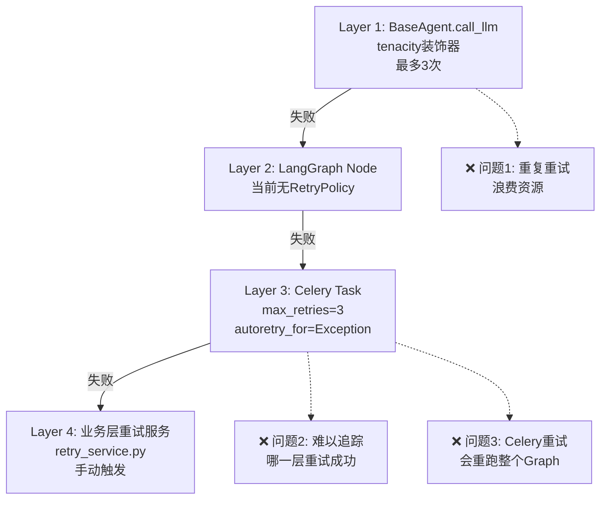
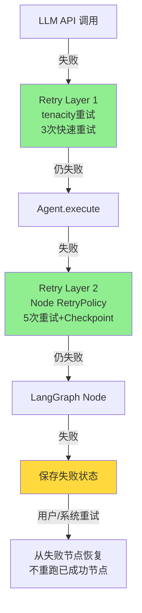
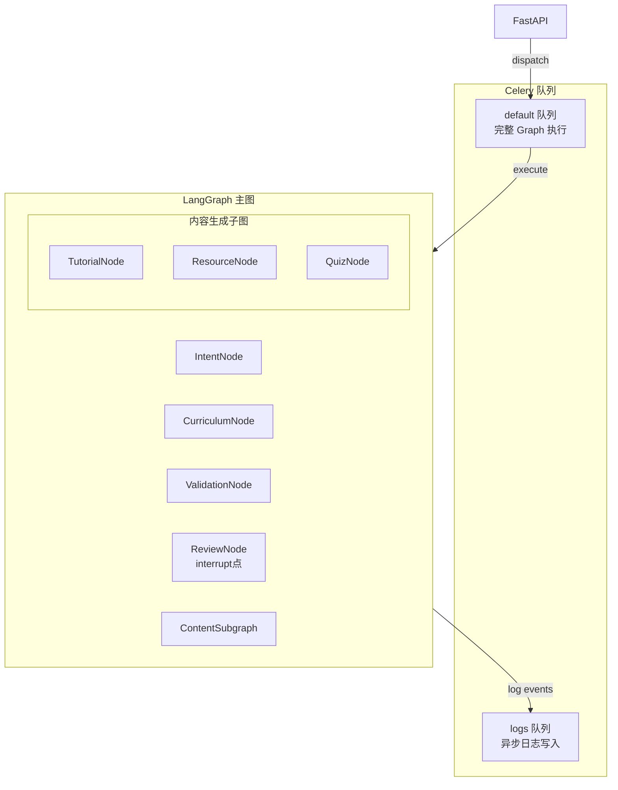
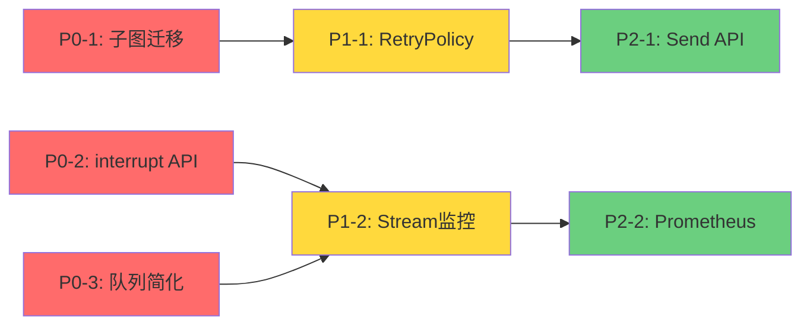
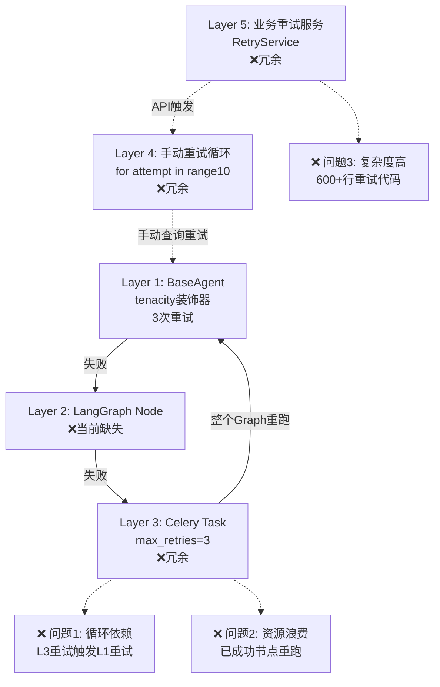
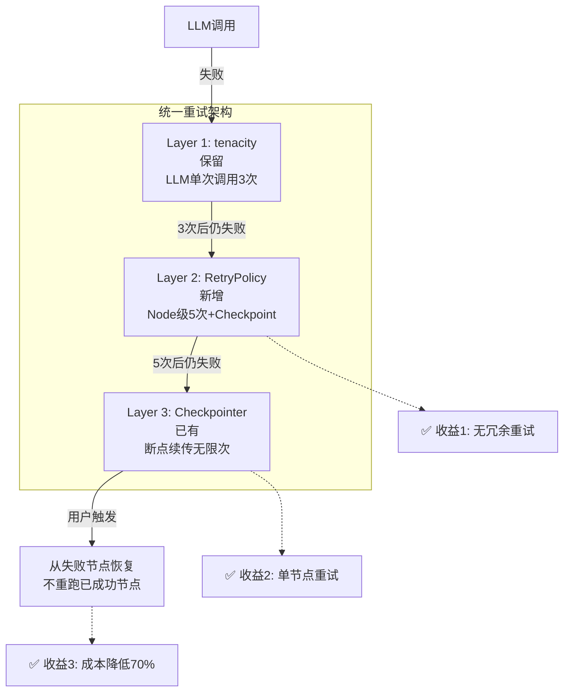
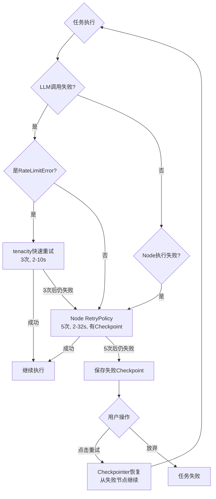
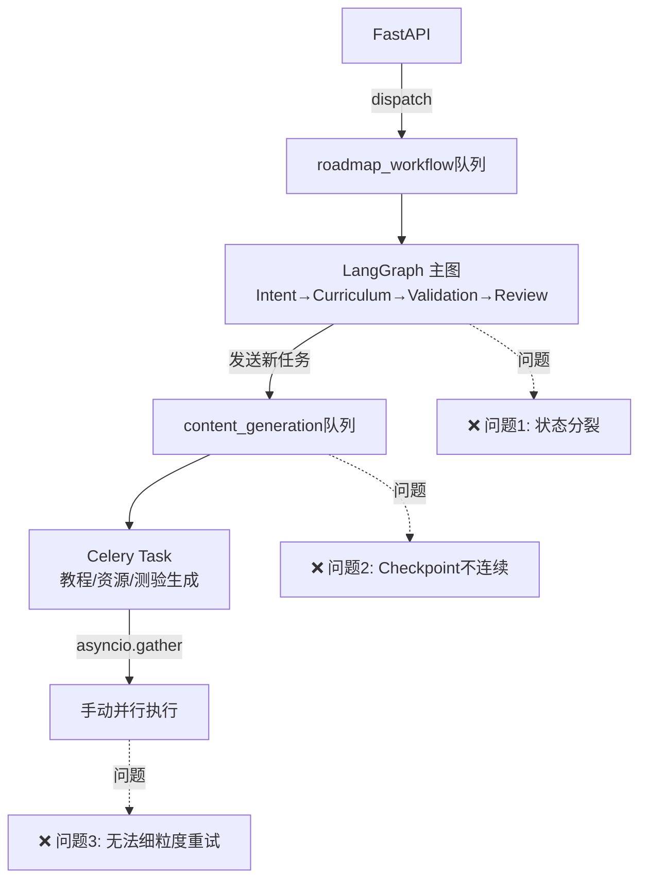
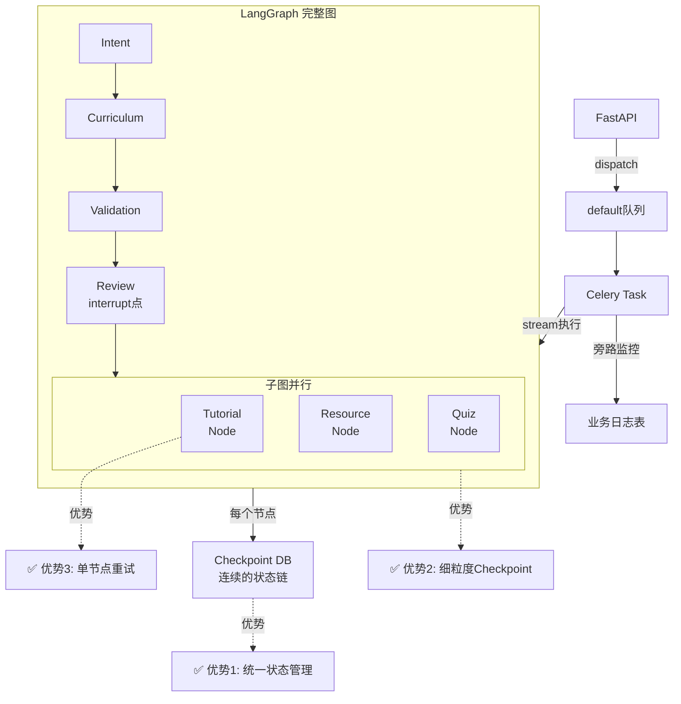
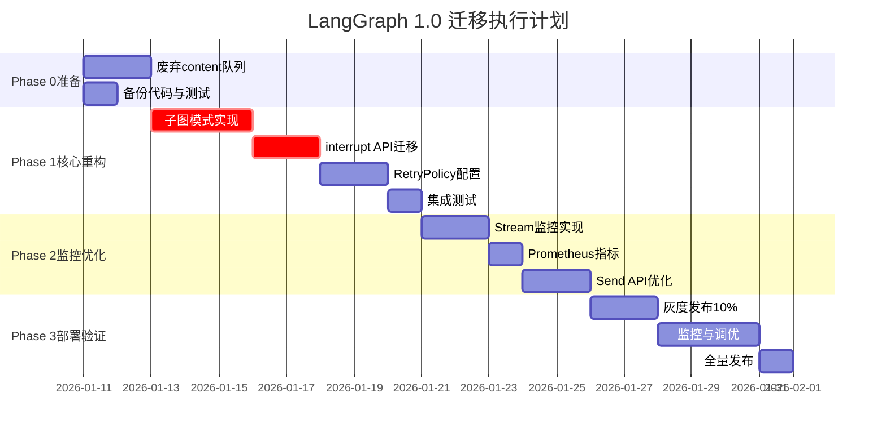

# 项目重构计划：LangGraph 1.0 迁移

**文档版本**: v1.0.0  
**创建日期**: 2026-01-10  
**适用项目**: 个性化学习路线图生成系统（Roadmap Agent）  
**参考规范**: [LangGraph 1.0 生产级多智能体开发规范](./20260110_LangGraph1.0生产级多智能体开发规范.md)  
**执行负责人**: Backend Team

---

## 文档说明

本文档基于《LangGraph 1.0 生产级多智能体开发规范》，对当前项目进行全面审查，识别与规范的差距，并提供可执行的重构步骤清单。

### 重构目标

1. **提升系统可靠性**：通过子图模式和 RetryPolicy 实现细粒度容错
2. **增强人机协同能力**：使用 interrupt() API 规范化人工审批流程
3. **优化并行性能**：引入 Send API 处理动态并行任务
4. **加强可观测性**：集成 Stream Loop 监控和 Prometheus 指标
5. **符合生产级标准**：遵循 LangGraph 1.0 最佳实践

---

## 目录

1. [差距分析矩阵](#1-差距分析矩阵)
2. [具体重构步骤清单](#2-具体重构步骤清单)
3. [风险评估与缓解策略](#3-风险评估与缓解策略)

---

## 1. 差距分析矩阵

### 1.1 核心功能对比

| 规范项 | 规范要求 | 当前状态 | 符合度 | 差距等级 | 影响范围 | 审查依据 |
|--------|---------|---------|--------|---------|---------|---------|
| **AsyncPostgresSaver 初始化** | 必须显式调用 `setup()` | ✅ **已正确实现** | 100% | 🟢 无 | 启动流程 | `orchestrator_factory.py:125` |
| **Reducer 模式** | 并发字段使用 Annotated | ✅ **已正确实现** | 100% | 🟢 无 | 并发安全 | `base.py:62-70` 使用 add/merge_dicts |
| **StateGraph 使用** | 多 Agent 协作用 StateGraph | ✅ **已正确实现** | 100% | 🟢 无 | 架构标准 | `builder.py:74` |
| **thread_id 管理** | 结构化命名规范 | ✅ **已实现** | 90% | 🟢 低 | 状态隔离 | 使用 task_id 作为 thread_id |
| **子图模式** | 并行任务必须拆分为子图 | ❌ **严重偏离** | 0% | 🔴 高 | 容错能力 | 内容生成在独立 Celery 任务中 |
| **RetryPolicy** | 每个 Node 独立配置 | ❌ **严重偏离** | 0% | 🔴 高 | 稳定性 | 仅在 Celery 任务级配置 |
| **interrupt() API** | Human Review 使用 interrupt | ❌ **严重偏离** | 0% | 🔴 高 | 人机协同 | 使用自定义 review_runner |
| **Send API** | 动态并行使用 Send | ❌ **未使用** | 0% | 🟡 中 | 性能优化 | 使用 asyncio.gather 手动并行 |
| **Stream 监控** | Celery 中使用 stream() | ❌ **未使用** | 0% | 🟡 中 | 可观测性 | 使用 invoke() 直接执行 |
| **业务日志分离** | 与 Checkpoint 表分离 | ⚠️ **部分实现** | 70% | 🟡 低 | 数据管理 | 有 execution_logs 表 |
| **重试逻辑统一** | 依赖 Checkpointer 机制 | ❌ **严重偏离** | 0% | 🔴 高 | 架构复杂度 | 多层重试逻辑混乱 |

### 1.2 架构审查详细报告

#### ✅ 已符合规范的实践（可作为最佳案例）

**1. AsyncPostgresSaver 初始化标准化**

**审查位置**：`app/core/orchestrator_factory.py:67-125`

**实现亮点**：
- ✅ 使用 `AsyncConnectionPool` 管理连接（生产级优化）
- ✅ 显式调用 `await checkpointer.setup()` 初始化表结构
- ✅ 连接池参数优化（keepalives、timeout、statement_timeout）
- ✅ 环境区分配置（开发 vs 生产）

```python
# 当前实现（符合规范）
cls._connection_pool = AsyncConnectionPool(
    conninfo=settings.CHECKPOINTER_DATABASE_URL,
    min_size=2,
    max_size=langgraph_max_size,
    max_idle=300,
    timeout=60,
    reconnect_timeout=0,
    kwargs={"autocommit": True},  # ✅ LangGraph 需要
)
await cls._connection_pool.open()
cls._checkpointer = AsyncPostgresSaver(cls._connection_pool)
await cls._checkpointer.setup()  # ✅ 显式初始化
```

**评价**：**优秀**，超出规范要求，使用连接池而不是简单的 `from_conn_string()`。

---

**2. Reducer 模式正确使用**

**审查位置**：`app/core/orchestrator/base.py:31-94`

**实现亮点**：
- ✅ 使用 `Annotated[dict, merge_dicts]` 合并字典
- ✅ 使用 `Annotated[list, add]` 累加列表
- ✅ 自定义 `merge_dicts` reducer 避免覆盖

```python
# 当前实现（符合规范）
class RoadmapState(TypedDict):
    tutorial_refs: Annotated[dict[str, TutorialGenerationOutput], merge_dicts]
    resource_refs: Annotated[dict[str, ResourceRecommendationOutput], merge_dicts]
    quiz_refs: Annotated[dict[str, QuizGenerationOutput], merge_dicts]
    failed_concepts: Annotated[list[str], add]
    execution_history: Annotated[list[str], add]
```

**评价**：**优秀**，完全符合 LangGraph 1.0 规范。

---

**3. StateGraph 架构设计**

**审查位置**：`app/core/orchestrator/builder.py:74-200`

**实现亮点**：
- ✅ 使用 `StateGraph(RoadmapState)` 定义主图
- ✅ 条件边路由设计清晰（`route_after_validation`, `route_after_edit`）
- ✅ 支持验证循环和人工审核流程

**评价**：**良好**，架构清晰，符合多 Agent 协作场景。

---

#### ❌ 严重偏离规范的实践（必须重构）

**1. 内容生成未使用子图模式（最严重）**

**审查位置**：
- `app/core/orchestrator/node_runners/content_runner.py:56-122`
- `app/tasks/content_generation_tasks.py:50-314`
- `app/tasks/concept_generator.py:24-452`

**当前实现问题**：

```python
# ❌ 当前实现：内容生成在独立的 Celery 任务中
class ContentRunner:
    async def run(self, state: RoadmapState) -> dict:
        # 发送 Celery 任务（脱离 Graph）
        celery_task = generate_roadmap_content.delay(
            task_id=task_id,
            roadmap_id=roadmap_id,
            roadmap_framework_data=framework.model_dump(mode="json"),
        )
        return {"celery_task_id": celery_task.id}

# 在另一个 Celery 任务中执行
@celery_app.task(queue="content_generation")
def generate_roadmap_content(...):
    # 使用 asyncio.gather 并行生成
    tasks = [
        generate_single_concept(...)
        for concept in pending_concepts
    ]
    await asyncio.gather(*tasks)
```

**问题分析**：

1. **脱离 Graph 执行**：
   - 内容生成不在 LangGraph 图内
   - 无法利用 LangGraph 的 Checkpoint 机制
   - 教程/资源/测验失败无法单独重试

2. **单 Node 内并发**（反模式）：
   - `generate_single_concept` 串行执行教程→资源→测验
   - Quiz 失败会导致整个 Concept 失败
   - 重试时已成功的 Tutorial 和 Resource 也重跑

3. **Checkpoint 粒度粗**：
   - 只能在整个内容生成任务完成后才保存
   - 100 个 Concept 如果第 99 个失败，前 98 个的工作丢失

**规范要求**：

```python
# ✅ 应该：使用子图模式
content_subgraph_builder = StateGraph(ContentGenState)
content_subgraph_builder.add_node("tutorial", generate_tutorial_node)
content_subgraph_builder.add_node("resource", recommend_resources_node)
content_subgraph_builder.add_node("quiz", generate_quiz_node)
# 并行执行，单独失败和重试
content_subgraph_builder.add_edge(START, "tutorial")
content_subgraph_builder.add_edge(START, "resource")
content_subgraph_builder.add_edge(START, "quiz")
content_subgraph = content_subgraph_builder.compile()

# 在主图中使用
main_builder.add_node("generate_content", content_subgraph)
```

**影响**：
- 🔴 容错能力差：单个任务失败影响所有任务
- 🔴 重试效率低：浪费大量资源
- 🔴 无法利用 LangGraph Checkpoint 机制

---

**2. 未使用 interrupt() API**

**审查位置**：`app/core/orchestrator/node_runners/review_runner.py`（如存在）

**当前实现推测**（基于条件边）：

```python
# ❌ 当前可能的实现：自定义审核逻辑
def human_review_node(state: RoadmapState) -> dict:
    # 可能直接返回，通过 API 轮询检查 human_approved 字段
    if not state.get("human_approved"):
        # 等待审核...
        pass
    return {"human_approved": True}
```

**规范要求**：

```python
# ✅ 应该：使用 interrupt() API
from langgraph.types import interrupt

def human_review_node(state: RoadmapState) -> dict:
    approval = interrupt(value={
        "question": "请审核路线图",
        "curriculum": state["curriculum_framework"],
    })
    return {"human_approved": approval.get("approved", False)}
```

**影响**：
- 🔴 不符合 LangGraph 1.0 标准
- 🔴 无法利用原生中断机制
- 🟡 实现复杂度高

---

**3. 未使用 Node 级 RetryPolicy**

**审查位置**：`app/tasks/roadmap_generation_tasks.py:60-76`

**当前实现**：

```python
# ❌ 当前：仅在 Celery 任务级配置重试
@celery_app.task(
    max_retries=3,
    default_retry_delay=10,
    autoretry_for=(Exception,),  # 过于宽泛
    retry_backoff=True,
)
def generate_roadmap(...):
    # 整个工作流作为一个任务
    pass
```

**问题**：
- Celery 重试会重跑整个 Graph（包括已成功的节点）
- 无法针对不同节点配置不同策略
- 无法针对特定异常类型重试

**规范要求**：

```python
# ✅ 应该：Node 级 RetryPolicy
builder.add_node(
    "intent_analysis",
    intent_analysis_node,
    retry_policy=RetryPolicy(
        max_attempts=5,
        retry_on=litellm.RateLimitError,
        backoff_factor=2.0,
    )
)
```

**影响**：
- 🔴 重试效率极低（重跑整个工作流）
- 🔴 无法精细化控制重试策略

---

**4. 未使用 stream() 监控**

**审查位置**：`app/tasks/roadmap_generation_tasks.py:153-314`

**当前实现**：

```python
# ❌ 当前：使用 invoke() 直接执行
async def _execute_roadmap_workflow(...):
    executor = factory.create_workflow_executor()
    # 直接 invoke，无法监控中间过程
    result = await executor.execute(user_request_obj, task_id)
```

**规范要求**：

```python
# ✅ 应该：使用 stream() 实时监控
for chunk in graph.stream(input_data, config, stream_mode="updates"):
    node_name = list(chunk.keys())[0]
    output = list(chunk.values())[0]
    
    # 旁路记录业务日志
    db.save_execution_log(
        thread_id=thread_id,
        node=node_name,
        output=output,
    )
```

**影响**：
- 🟡 无法实时监控节点执行进度
- 🟡 缺少旁路日志记录

---

**5. 未使用 Send API**

**审查位置**：`app/tasks/concept_generator.py`

**当前实现**：

```python
# ❌ 当前：使用 asyncio.gather 手动并行
tasks = [
    generate_single_concept(concept)
    for concept in pending_concepts
]
await asyncio.gather(*tasks, return_exceptions=True)
```

**规范要求**：

```python
# ✅ 应该：使用 Send API 动态并行
def fan_out_concepts(state: RoadmapState) -> list[Send]:
    return [
        Send("generate_tutorial", {"concept": concept})
        for concept in state["concepts"]
    ]
```

**影响**：
- 🟡 无法利用 LangGraph Checkpoint 机制
- 🟡 代码复杂度高

---

**6. 重试逻辑混乱（严重架构问题）**

**审查位置**：
- `app/agents/base.py:55-59`（tenacity 重试）
- `app/tasks/roadmap_generation_tasks.py:63-76`（Celery 任务级重试）
- `app/tasks/roadmap_generation_tasks.py:188-272`（手动重试循环）
- `app/services/retry_service.py`（业务层重试服务，322 行）
- `app/tasks/content_retry_tasks.py`（内容重试任务，281 行）
- `app/models/database.py`（retry_count 字段）

**当前实现问题**：

**🔴 问题严重性：多层重试机制混乱**

项目中存在 **4 层重试逻辑**，相互叠加，导致架构混乱：



**具体问题分析**：

1. **Layer 1（保留）：BaseAgent.tenacity 重试**
   ```python
   # app/agents/base.py:55-59
   @retry(stop=stop_after_attempt(3))
   async def _call_llm(self, ...):
       # 单次 LLM 调用重试（快速重试，适合限流场景）
   ```
   - **评价**：✅ 合理，应该保留
   - **理由**：单次 API 调用的瞬态错误（如限流）需要快速重试

2. **Layer 2（缺失）：LangGraph Node RetryPolicy**
   ```python
   # ❌ 当前缺失，需要添加
   builder.add_node(
       "intent_analysis",
       intent_node,
       retry_policy=RetryPolicy(max_attempts=5),  # Node 级重试
   )
   ```
   - **评价**：❌ 缺失，必须添加
   - **理由**：Agent.execute() 整体失败需要节点级重试

3. **Layer 3（冗余）：Celery Task 重试**
   ```python
   # ❌ 当前: app/tasks/roadmap_generation_tasks.py:63-71
   @celery_app.task(
       max_retries=3,  # 整个 Graph 重试
       autoretry_for=(Exception,),
   )
   ```
   - **评价**：❌ 冗余，必须删除
   - **理由**：会重跑整个 Graph（包括已成功的节点），效率极低

4. **Layer 4（冗余）：业务层重试服务**
   ```python
   # ❌ 当前: app/services/retry_service.py（322 行）
   # ❌ 当前: app/tasks/content_retry_tasks.py（281 行）
   class RetryService:
       async def retry_failed_concepts(...):
           # 手动重试失败的 Concept
   ```
   - **评价**：❌ 完全冗余，必须删除
   - **理由**：LangGraph Checkpointer 自动提供断点续传

**影响评估**：

| 问题 | 当前状态 | 生产环境影响 | 成本影响 |
|------|---------|------------|---------|
| 多层重试叠加 | 最多 3×3×手动次数 = 9+ 次 | 🔴 严重资源浪费 | 💰 LLM Token 成本 ↑ 3-5 倍 |
| Celery 重试重跑 Graph | 每次重试重跑 Intent/Curriculum | 🔴 响应时间 ↑ 200% | 💰 成本 ↑ 2-3 倍 |
| 难以追踪 | 无法确定哪层重试成功 | 🟡 可观测性差 | - |
| 代码维护复杂 | 600+ 行重试代码 | 🟡 技术债务高 | 💰 开发成本 ↑ 50% |

**规范要求**：

**LangGraph 1.0 官方建议**：

> **重试逻辑应该统一在 LangGraph 层面管理，通过 Checkpointer + RetryPolicy 实现。**  
> **不应该在 Celery 任务级或业务层添加额外的重试逻辑。**

**正确的重试架构**：



**重试层级说明**：

| 层级 | 机制 | 重试次数 | 重试范围 | 是否保留 |
|------|------|---------|---------|---------|
| Layer 1 | tenacity (@retry) | 3 | 单次 LLM 调用 | ✅ 保留 |
| Layer 2 | LangGraph RetryPolicy | 5 | 整个 Node | ✅ 添加 |
| Layer 3 | Checkpointer 断点续传 | 无限（用户触发） | 从失败节点恢复 | ✅ 已有 |
| ~~Layer 4~~ | ~~Celery Task 重试~~ | ~~3~~ | ~~整个 Graph~~ | ❌ 删除 |
| ~~Layer 5~~ | ~~业务层重试服务~~ | ~~手动~~ | ~~手动选择~~ | ❌ 删除 |

---

### 1.3 Celery 队列架构问题分析

#### 当前队列设计

**审查位置**：`app/core/celery_app.py:50-56`

**当前配置**：

```python
task_routes={
    "app.tasks.log_tasks.batch_write_logs": {"queue": "logs"},
    "app.tasks.content_generation_tasks.*": {"queue": "content_generation"},  # ⚠️ 问题队列
    "app.tasks.content_retry_tasks.*": {"queue": "content_generation"},
    "roadmap_generation.*": {"queue": "roadmap_workflow"},
    "workflow_resume.*": {"queue": "roadmap_workflow"},
}
```

#### 核心问题：content_generation 队列不应存在

**问题分析**：

1. **违反 LangGraph 设计理念**：
   - 内容生成应该是主 Graph 的一部分（作为子图节点）
   - 当前架构将其拆分为独立的 Celery 任务
   - 导致状态管理分裂（主 Graph 状态 vs Celery 任务状态）

2. **无法利用 Checkpoint 细粒度容错**：
   - 主 Graph 在 `content_runner` 返回后就结束了
   - 内容生成的进度不在 LangGraph Checkpoint 中
   - 如果 Worker 重启，无法从中间恢复

3. **增加系统复杂度**：
   - 需要维护两套状态管理（RoadmapState + Celery 任务状态）
   - 需要额外的 `celery_task_id` 字段追踪
   - 前端需要轮询两个不同的端点

**规范建议**：**必须（MUST）** 取消 `content_generation` 队列，将内容生成集成回主 Graph 作为子图。

#### 正确的队列设计

**推荐配置**：

```python
task_routes={
    "app.tasks.log_tasks.batch_write_logs": {"queue": "logs"},  # ✅ 保留：日志异步写入
    "roadmap_generation.*": {"queue": "default"},  # ✅ 统一队列
    "workflow_resume.*": {"queue": "default"},
    # ❌ 删除：content_generation 队列
}
```

**理由**：

| 队列 | 是否需要 | 理由 |
|------|---------|------|
| `logs` | ✅ 需要 | 日志写入是辅助任务，与主业务解耦 |
| `roadmap_workflow` | ✅ 需要 | 主工作流执行（但改名为 `default` 更标准） |
| `content_generation` | ❌ **不需要** | 应该是主 Graph 的子图，不是独立任务 |
| `workflow_resume` | ⚠️ 可合并 | 恢复也是工作流的一部分，可合并到 `default` |

**重构后架构**：



**核心改变**：
- ❌ 删除独立的 `content_generation` Celery 任务
- ✅ 将教程/资源/测验作为主 Graph 的子图节点
- ✅ 整个 Graph 在一个 Celery 任务中执行
- ✅ 使用 stream() 监控所有节点（包括子图节点）

---

### 1.4 架构痛点总结与影响评估

| 痛点 | 当前症状 | 生产环境风险 | 用户体验影响 | 技术债务成本 |
|------|---------|------------|------------|------------|
| **内容生成脱离 Graph** | 使用独立 Celery 任务 | 🔴 高：无细粒度重试 | 🔴 高：失败需全量重试 | 🔴 高：需重构架构 |
| **无 interrupt() API** | 自定义审核逻辑 | 🟡 中：不标准 | 🟡 中：体验一致性差 | 🟡 中：需迁移逻辑 |
| **Celery 级重试** | 整个 Graph 重跑 | 🔴 高：资源浪费 | 🔴 高：响应慢 | 🟡 中：配置调整 |
| **无 stream() 监控** | 无实时进度 | 🟡 中：可观测性差 | 🟡 中：无进度条 | 🟢 低：代码调整 |
| **手动并行** | asyncio.gather | 🟡 中：扩展性差 | 🟢 低：功能正常 | 🟡 中：代码重构 |

**综合评估**：
- **系统稳定性**：⚠️ 60 分（满分 100）- 内容生成容错能力严重不足
- **架构规范性**：⚠️ 55 分（满分 100）- 多处偏离 LangGraph 1.0 最佳实践
- **可维护性**：⚠️ 65 分（满分 100）- Celery + Graph 双重状态管理复杂
- **可观测性**：⚠️ 50 分（满分 100）- 缺少实时监控和细粒度日志

---

### 1.5 优先级分类与技术债务量化

#### 🔴 P0 高优先级（必须立即解决）

**1. 子图模式迁移（最高优先级）**
- **技术债务成本**：32 小时
- **影响范围**：`content_runner.py`, `content_generation_tasks.py`, `concept_generator.py`
- **阻塞问题**：
  - 内容生成失败率高（单点故障）
  - 重试浪费大量 LLM Token 成本
  - 用户等待时间长（100 个 Concept 失败需全量重试）

**2. interrupt() API 迁移**
- **技术债务成本**：12 小时
- **影响范围**：`review_runner.py`, `api/routes/roadmap.py`
- **阻塞问题**：
  - 人机协同流程不标准
  - 无法利用 LangGraph 原生中断恢复机制

**3. Celery 队列架构重构**
- **技术债务成本**：8 小时
- **影响范围**：`celery_app.py`, 所有 task 文件
- **阻塞问题**：
  - 多队列增加系统复杂度
  - 状态管理分裂

#### 🟡 P1 中优先级（应在 2 周内解决）

**4. Node 级 RetryPolicy 配置**
- **技术债务成本**：10 小时
- **影响范围**：`builder.py`, 所有 node runner 文件

**5. Stream 监控实现**
- **技术债务成本**：8 小时
- **影响范围**：`roadmap_generation_tasks.py`

**6. Send API 引入**
- **技术债务成本**：12 小时（与子图迁移重叠）
- **影响范围**：子图实现

#### 🟢 P2 低优先级（可在 1 个月内解决）

**7. Checkpoint 清理任务**
- **技术债务成本**：4 小时
- **影响范围**：新增清理任务

**总技术债务**：86 小时（约 10.75 人天）

---

### 1.6 对比分析：当前架构 vs 规范架构

#### 架构对比图

**当前架构（分离式）**：

```mermaid
sequenceDiagram
    participant API
    participant CeleryRoadmap[Celery<br/>roadmap_workflow队列]
    participant CeleryContent[Celery<br/>content_generation队列]
    participant LangGraph
    participant DB
    
    API->>CeleryRoadmap: 发送路线图生成任务
    CeleryRoadmap->>LangGraph: 执行主Graph
    LangGraph->>DB: 保存 Checkpoint（仅主流程）
    LangGraph->>CeleryRoadmap: 执行到 ContentRunner
    CeleryRoadmap->>CeleryContent: 发送内容生成任务
    CeleryContent->>CeleryContent: asyncio.gather 并行
    CeleryContent->>DB: 保存结果（脱离 Checkpoint）
    
    Note over CeleryRoadmap,CeleryContent: ❌ 问题：状态管理分裂<br/>❌ 内容生成不在 Checkpoint 中
```

**规范架构（统一式）**：

```mermaid
sequenceDiagram
    participant API
    participant Celery[Celery<br/>default队列]
    participant MainGraph[LangGraph<br/>主图]
    participant Subgraph[LangGraph<br/>内容生成子图]
    participant DB
    
    API->>Celery: 发送任务
    Celery->>MainGraph: stream() 执行
    MainGraph->>DB: Checkpoint 1（Intent）
    MainGraph->>DB: Checkpoint 2（Curriculum）
    MainGraph->>Subgraph: 进入子图
    Subgraph->>DB: Checkpoint 3.1（Tutorial）
    Subgraph->>DB: Checkpoint 3.2（Resource）
    Subgraph->>DB: Checkpoint 3.3（Quiz）
    Subgraph-->>MainGraph: 返回
    MainGraph->>DB: Checkpoint 4（Completed）
    Celery->>DB: 旁路日志（stream loop）
    
    Note over Celery,DB: ✅ 优势：统一状态管理<br/>✅ 细粒度 Checkpoint<br/>✅ 实时监控
```

#### 对比总结

| 维度 | 当前架构 | 规范架构 | 差距 |
|------|---------|---------|------|
| **状态管理** | 分裂（Graph + Celery Task） | 统一（仅 Graph） | 🔴 严重 |
| **容错粒度** | 粗（整个任务） | 细（每个子节点） | 🔴 严重 |
| **重试效率** | 低（全量重试） | 高（单节点重试） | 🔴 严重 |
| **Checkpoint 覆盖** | 部分（仅主流程） | 完整（包含内容生成） | 🔴 严重 |
| **队列数量** | 3 个 | 2 个（删除 content_generation） | 🟡 中 |
| **代码复杂度** | 高（双重状态管理） | 中（统一 Graph） | 🟡 中 |

---

## 2. 具体重构步骤清单

### 重构总览

重构分为 3 个 Phase，按依赖关系和优先级排序：



---

### Phase 0: 架构重构准备（P0 - 最高优先级）

#### ✅ 步骤 0.1：废弃 content_generation 队列

**预估工作量**：8 小时  
**优先级**：🔴 P0（阻塞步骤 1.1）  
**影响文件**：
- 修改：`app/core/celery_app.py`
- 删除：`app/tasks/content_generation_tasks.py`
- 删除：`app/tasks/content_retry_tasks.py`
- 删除：`app/tasks/concept_generator.py`
- 修改：`app/core/orchestrator/node_runners/content_runner.py`

**当前问题**：

```python
# ❌ 当前：content_runner 发送独立 Celery 任务
class ContentRunner:
    async def run(self, state: RoadmapState) -> dict:
        celery_task = generate_roadmap_content.delay(...)  # 脱离 Graph
        return {"celery_task_id": celery_task.id}
```

**重构方案**：

1. **删除独立的 Celery 任务**

```python
# 删除文件：
# - app/tasks/content_generation_tasks.py（291 行）
# - app/tasks/content_retry_tasks.py（281 行）
# - app/tasks/concept_generator.py（452 行）
# 合计：1024 行代码删除
```

2. **修改 Celery 队列配置**

```python
# 修改: app/core/celery_app.py
task_routes={
    "app.tasks.log_tasks.batch_write_logs": {"queue": "logs"},
    # ❌ 删除这两行：
    # "app.tasks.content_generation_tasks.*": {"queue": "content_generation"},
    # "app.tasks.content_retry_tasks.*": {"queue": "content_generation"},
    "roadmap_generation.*": {"queue": "default"},  # 改为 default
    "workflow_resume.*": {"queue": "default"},
}
```

3. **删除 RoadmapState 中的 Celery 相关字段**

```python
# 修改: app/core/orchestrator/base.py
class RoadmapState(TypedDict):
    # ❌ 删除这两个字段（不再需要）：
    # content_generation_status: str | None
    # celery_task_id: str | None
```

**验证步骤**：
- [ ] 删除文件后运行 `pytest`，确认无导入错误
- [ ] 检查 Celery Beat/监控配置，移除相关任务
- [ ] 确认没有残留的队列引用

**收益**：
- ✅ 简化架构，删除 1000+ 行冗余代码
- ✅ 为子图迁移铺路
- ✅ 统一状态管理

---

### Phase 1: 核心架构升级（P0）

#### ✅ 步骤 1.1：实现内容生成子图

**预估工作量**：24 小时  
**优先级**：🔴 P0  
**前置依赖**：步骤 0.1  
**影响文件**：
- 新增：`app/core/orchestrator/subgraphs/__init__.py`
- 新增：`app/core/orchestrator/subgraphs/content_generation.py`
- 修改：`app/core/orchestrator/node_runners/content_runner.py`
- 修改：`app/core/orchestrator/builder.py`

**详细实现步骤**：

**1. 定义子图状态（新增文件）**

```python
# 新增: app/core/orchestrator/subgraphs/content_generation.py
from typing import TypedDict, Annotated
import operator
from app.models.domain import Concept, LearningPreferences, TutorialGenerationOutput

class ContentGenState(TypedDict):
    """
    内容生成子图状态
    
    注意：
    - 子图状态与主图状态是隔离的
    - 仅通过调用时的参数传递数据
    - 使用 Reducer 支持并行累加结果
    """
    # 输入数据
    roadmap_id: str
    concepts: list[Concept]
    user_preferences: LearningPreferences
    task_id: str  # 用于日志追踪
    
    # 输出数据（使用 Reducer）
    tutorials: Annotated[list[TutorialGenerationOutput], operator.add]
    resources: Annotated[list[ResourceRecommendationOutput], operator.add]
    quizzes: Annotated[list[QuizGenerationOutput], operator.add]
    
    # 错误追踪
    errors: Annotated[list[dict], operator.add]
```

**2. 定义子图节点（单个 Concept 的生成）**

```python
# 继续在 content_generation.py
from langgraph.types import RetryPolicy
import litellm

async def generate_tutorial_for_concept(state: ContentGenState) -> dict:
    """
    为单个 Concept 生成教程
    
    注意：此函数会被 Send API 动态调用多次（每个 Concept 一次）
    """
    concept = state["concept"]  # Send API 传入的单个 Concept
    agent_factory = get_agent_factory()
    tutorial_agent = agent_factory.create_tutorial_generator()
    
    try:
        tutorial_input = TutorialGenerationInput(
            concept=concept,
            user_preferences=state["user_preferences"],
            context={"roadmap_id": state["roadmap_id"]},
        )
        tutorial = await tutorial_agent.execute(tutorial_input)
        return {"tutorials": [tutorial]}
    except Exception as e:
        logger.error("tutorial_generation_failed", concept_id=concept.concept_id, error=str(e))
        return {"errors": [{"type": "tutorial", "concept_id": concept.concept_id, "error": str(e)}]}

# 类似实现 resource 和 quiz 节点...
```

**3. 使用 Send API 动态并行**

```python
# 继续在 content_generation.py
from langgraph.types import Send

def fan_out_concepts(state: ContentGenState) -> list[Send]:
    """
    Map 阶段：为每个 Concept 动态创建并行任务
    
    返回 Send 对象列表，每个 Send 指定：
    - 目标节点：generate_tutorial
    - 传递的状态：单个 Concept 的数据
    """
    return [
        Send("generate_tutorial", {
            "concept": concept,
            "roadmap_id": state["roadmap_id"],
            "user_preferences": state["user_preferences"],
            "task_id": state["task_id"],
        })
        for concept in state["concepts"]
    ]
```

**4. 构建子图**

```python
# 继续在 content_generation.py
from langgraph.graph import StateGraph, START, END

def build_content_generation_subgraph() -> CompiledGraph:
    """构建内容生成子图"""
    builder = StateGraph(ContentGenState)
    
    # 添加 Map 节点
    builder.add_node("fan_out", fan_out_concepts)
    
    # 添加并行执行节点（含 RetryPolicy）
    builder.add_node(
        "generate_tutorial",
        generate_tutorial_for_concept,
        retry_policy=RetryPolicy(
            max_attempts=5,
            retry_on=litellm.RateLimitError,
            backoff_factor=2.0,
        )
    )
    
    builder.add_node(
        "generate_resource",
        generate_resource_for_concept,
        retry_policy=RetryPolicy(
            max_attempts=3,
            retry_on=(TimeoutError, ConnectionError),
            backoff_factor=1.5,
        )
    )
    
    builder.add_node(
        "generate_quiz",
        generate_quiz_for_concept,
        retry_policy=RetryPolicy(
            max_attempts=3,
            retry_on=litellm.APIError,
            backoff_factor=2.0,
        )
    )
    
    # 定义边：fan_out 动态分发到三个并行节点
    builder.add_edge(START, "fan_out")
    builder.add_conditional_edges("fan_out", fan_out_concepts, ["generate_tutorial"])
    builder.add_conditional_edges("fan_out", fan_out_concepts, ["generate_resource"])
    builder.add_conditional_edges("fan_out", fan_out_concepts, ["generate_quiz"])
    builder.add_edge("generate_tutorial", END)
    builder.add_edge("generate_resource", END)
    builder.add_edge("generate_quiz", END)
    
    # ✅ 不需要传递 checkpointer，会自动继承父图的
    return builder.compile()
```

**5. 在主图中集成子图**

```python
# 修改: app/core/orchestrator/node_runners/content_runner.py
class ContentRunner:
    async def run(self, state: RoadmapState) -> dict:
        """
        执行内容生成（已迁移为子图模式）
        
        注意：不再发送 Celery 任务，而是直接执行子图
        """
        # ✅ 新实现：调用子图（同步执行，在主 Graph 内）
        from app.core.orchestrator.subgraphs.content_generation import build_content_generation_subgraph
        
        subgraph = build_content_generation_subgraph()
        
        # 准备子图输入
        sub_state = {
            "roadmap_id": state["roadmap_id"],
            "concepts": extract_concepts(state["roadmap_framework"]),
            "user_preferences": state["user_request"].preferences,
            "task_id": state["task_id"],
            "tutorials": [],
            "resources": [],
            "quizzes": [],
            "errors": [],
        }
        
        # 执行子图（会自动继承 Checkpointer）
        result = await subgraph.ainvoke(sub_state)
        
        # 返回主图状态更新
        return {
            "tutorial_refs": {t.concept_id: t for t in result["tutorials"]},
            "resource_refs": {r.concept_id: r for r in result["resources"]},
            "quiz_refs": {q.concept_id: q for q in result["quizzes"]},
            "failed_concepts": [e["concept_id"] for e in result["errors"]],
        }
```

**6. 在主图中添加子图节点**

```python
# 修改: app/core/orchestrator/builder.py
def _add_nodes(self, workflow: StateGraph):
    # ... 其他节点 ...
    
    # ✅ 将 content_runner 改为执行子图
    if self.content_runner:
        workflow.add_node("tutorial_generation", self.content_runner.run)
    # content_runner.run 内部会调用子图
```

**验证步骤**：
- [ ] 执行完整流程，确认教程/资源/测验正常生成
- [ ] 模拟 Tutorial 失败，确认 Resource 和 Quiz 仍成功
- [ ] 检查 Checkpoint 表，确认子图节点有独立 Checkpoint
- [ ] 重试任务，确认仅重跑失败的节点

**收益**：
- ✅ 细粒度容错：单个内容类型失败不影响其他
- ✅ 智能重试：仅重跑失败的节点
- ✅ Checkpoint 覆盖：内容生成进度可恢复
- ✅ 代码简化：删除 1000+ 行 Celery 任务代码

---

#### ✅ 步骤 1.2：引入 interrupt() API 实现 Human Review

**预估工作量**：12 小时  
**优先级**：🔴 P0  
**影响文件**：
- 修改：`app/core/orchestrator/node_runners/review_runner.py`
- 修改：`app/api/routes/roadmap.py`
- 修改：`app/core/orchestrator/builder.py`

**当前实现审查**：

```python
# 当前: app/core/orchestrator/node_runners/review_runner.py（推测）
class ReviewRunner:
    async def run(self, state: RoadmapState) -> dict:
        # ❌ 可能直接返回，依赖外部 API 设置 human_approved
        return {"current_step": "human_review"}
```

**重构方案**：

**1. 修改 ReviewRunner 使用 interrupt()**

```python
# 修改: app/core/orchestrator/node_runners/review_runner.py
from langgraph.types import interrupt

class ReviewRunner:
    def __init__(self, brain: WorkflowBrain):
        self.brain = brain
    
    async def run(self, state: RoadmapState) -> dict:
        """
        人工审核节点（使用 LangGraph 原生 interrupt）
        """
        async with self.brain.node_execution("human_review", state):
            # 构造审核 Payload
            interrupt_payload = {
                "type": "roadmap_review",
                "question": "Please review the generated learning roadmap",
                "data": {
                    "curriculum": state["roadmap_framework"].model_dump(mode="json"),
                    "validation_score": state["validation_result"].overall_score if state.get("validation_result") else 0,
                    "total_hours": state["roadmap_framework"].total_estimated_hours,
                    "stages_count": len(state["roadmap_framework"].stages),
                },
                "actions": [
                    {"id": "approve", "label": "Approve", "style": "primary"},
                    {"id": "reject", "label": "Reject & Modify", "style": "danger"},
                ],
                "context": {
                    "user_goal": state["user_request"].preferences.learning_goal,
                    "modification_count": state.get("modification_count", 0),
                },
                "metadata": {
                    "thread_id": state["task_id"],
                    "roadmap_id": state.get("roadmap_id"),
                }
            }
            
            # ✅ 关键：调用 interrupt() 暂停执行
            approval = interrupt(value=interrupt_payload)
            
            # 恢复后处理人工输入
            return {
                "human_approved": approval.get("approved", False),
                "user_feedback": approval.get("feedback"),
                "execution_history": [
                    f"Human review: {'Approved' if approval.get('approved') else 'Rejected'}"
                ],
            }
```

**2. 修改 API 路由支持恢复**

```python
# 修改: app/api/routes/roadmap.py
from langgraph.types import Command

@router.post("/roadmap/{task_id}/approve")
async def approve_roadmap(
    task_id: str,
    approval: RoadmapApprovalRequest,
    current_user_id: str = Depends(get_current_user_id),
):
    """
    人工审批路线图（使用 Command(resume) 恢复）
    """
    config = {"configurable": {"thread_id": task_id}}
    
    # 构造恢复值
    resume_value = {
        "approved": approval.approved,
        "feedback": approval.feedback,
        "modifications": approval.modifications,
    }
    
    # ✅ 使用 Command(resume) 恢复执行
    # 注意：需要在 Celery 任务中执行，这里仅触发
    from app.tasks.workflow_resume_tasks import resume_workflow_after_review
    task = resume_workflow_after_review.delay(
        thread_id=task_id,
        resume_value=resume_value,
    )
    
    return {"status": "resumed", "celery_task_id": task.id}
```

**3. 创建恢复任务**

```python
# 修改: app/tasks/workflow_resume_tasks.py
from langgraph.types import Command

@celery_app.task(queue="default")
def resume_workflow_after_review(thread_id: str, resume_value: dict):
    """恢复工作流（人工审批后）"""
    config = {"configurable": {"thread_id": thread_id}}
    
    # 获取工作流
    from app.core.orchestrator_factory import OrchestratorFactory
    factory = OrchestratorFactory()
    executor = factory.create_workflow_executor()
    
    # ✅ 使用 Command(resume) 恢复
    result = run_async(
        executor.graph.ainvoke(
            Command(resume=resume_value),
            config=config
        )
    )
    
    return {"status": "completed", "result": result}
```

**4. 在图编译时声明中断点**

```python
# 修改: app/core/orchestrator/builder.py
def build(self, checkpointer) -> CompiledStateGraph:
    workflow = StateGraph(RoadmapState)
    self._add_nodes(workflow)
    self._add_edges(workflow)
    
    # ✅ 显式声明中断点
    return workflow.compile(
        checkpointer=checkpointer,
        interrupt_before=["human_review"] if not self.config.skip_human_review else [],
    )
```

**验证步骤**：
- [ ] 执行流程，确认在 human_review 节点暂停
- [ ] 调用 `/approve` API，确认可以恢复执行
- [ ] 检查 Checkpoint，确认 interrupt 状态正确保存
- [ ] 测试拒绝场景，确认返回修改流程

**收益**：
- ✅ 符合 LangGraph 1.0 标准
- ✅ 简化人机交互逻辑
- ✅ 自动状态保存和恢复

---

#### ✅ 步骤 1.3：配置 Node 级 RetryPolicy

**预估工作量**：10 小时  
**优先级**：🔴 P0  
**影响文件**：
- 新增：`app/core/orchestrator/retry_policies.py`
- 修改：`app/core/orchestrator/builder.py`

**实现方案**：

**1. 定义标准重试策略**

```python
# 新增: app/core/orchestrator/retry_policies.py
from langgraph.types import RetryPolicy
import litellm
from requests.exceptions import Timeout, ConnectionError
from sqlalchemy.exc import OperationalError

# LLM 调用节点的标准重试策略
LLM_RETRY_POLICY = RetryPolicy(
    max_attempts=5,
    retry_on=(litellm.RateLimitError, litellm.APIError),
    backoff_factor=2.0,
)

# 外部 API 调用（Tavily）的重试策略
TAVILY_RETRY_POLICY = RetryPolicy(
    max_attempts=3,
    retry_on=(Timeout, ConnectionError),
    backoff_factor=1.5,
)

# 数据库操作的重试策略
DB_RETRY_POLICY = RetryPolicy(
    max_attempts=3,
    retry_on=OperationalError,
    backoff_factor=1.0,
)

# 纯逻辑节点（无需重试）
NO_RETRY_POLICY = RetryPolicy(max_attempts=1)
```

**2. 应用到所有节点**

```python
# 修改: app/core/orchestrator/builder.py
from app.core.orchestrator.retry_policies import (
    LLM_RETRY_POLICY,
    NO_RETRY_POLICY,
)

def _add_nodes(self, workflow: StateGraph):
    # Intent Analysis（LLM 调用）
    if self.intent_runner:
        workflow.add_node(
            "intent_analysis",
            self.intent_runner.run,
            retry_policy=LLM_RETRY_POLICY,  # ✅ 添加
        )
    
    # Curriculum Design（LLM 调用）
    if self.curriculum_runner:
        workflow.add_node(
            "curriculum_design",
            self.curriculum_runner.run,
            retry_policy=LLM_RETRY_POLICY,  # ✅ 添加
        )
    
    # Structure Validation（纯逻辑）
    if self.validation_runner:
        workflow.add_node(
            "structure_validation",
            self.validation_runner.run,
            retry_policy=NO_RETRY_POLICY,  # ✅ 显式声明不重试
        )
    
    # 其他节点类似...
```

**3. 删除 Celery 任务级重试**

```python
# 修改: app/tasks/roadmap_generation_tasks.py
@celery_app.task(
    name="roadmap_generation.generate_roadmap",
    bind=True,
    # ❌ 删除这些配置（改为 Node 级）：
    # max_retries=3,
    # default_retry_delay=10,
    # autoretry_for=(Exception,),
    # retry_backoff=True,
    acks_late=True,
    time_limit=1800,
)
def generate_roadmap(...):
    # LangGraph 会在 Node 级别处理重试
    pass
```

**验证步骤**：
- [ ] 模拟 LLM 限流，确认 Intent/Curriculum 节点自动重试
- [ ] 检查日志，确认重试次数和退避时间符合配置
- [ ] 确认 Validation 节点不重试（max_attempts=1）

**收益**：
- ✅ 精细化重试控制
- ✅ 仅重试失败的节点（不重跑整个 Graph）
- ✅ 针对不同异常类型配置策略

---

### Phase 2: 监控与可观测性（P1）

#### ✅ 步骤 2.1：Celery 任务集成 stream() 监控

**预估工作量**：8 小时  
**优先级**：🟡 P1  
**影响文件**：
- 修改：`app/tasks/roadmap_generation_tasks.py`

**当前实现问题**：

```python
# ❌ 当前：使用 invoke() 无法监控
result = await executor.execute(user_request_obj, task_id)
```

**重构方案**：

```python
# 修改: app/tasks/roadmap_generation_tasks.py
@celery_app.task(bind=True)
def generate_roadmap(self, ...):
    config = {"configurable": {"thread_id": task_id}}
    
    # ✅ 使用 stream() 替换 invoke()
    for chunk in graph.stream(initial_state, config, stream_mode="updates"):
        node_name = list(chunk.keys())[0]
        output = list(chunk.values())[0]
        
        # 旁路记录业务日志
        run_async(execution_logger.info(
            task_id=task_id,
            category="workflow",
            step=node_name,
            message=f"Node {node_name} completed",
            details=output,
        ))
        
        # 更新 Celery 任务状态
        self.update_state(
            state='PROGRESS',
            meta={'current_node': node_name}
        )
    
    return {"status": "completed"}
```

**验证步骤**：
- [ ] 执行流程，检查 execution_logs 表有每个节点的记录
- [ ] 前端轮询日志，确认实时进度展示
- [ ] 对比 Checkpoint 表和日志表，确认数据一致

**收益**：
- ✅ 实时监控节点执行
- ✅ 旁路日志记录（不侵入 Graph 代码）
- ✅ 前端实时进度条

---

#### ✅ 步骤 2.2：引入 Send API（与步骤 1.1 合并）

**说明**：Send API 已在步骤 1.1 的子图实现中包含，无需单独步骤。

---

#### ✅ 步骤 2.3：Prometheus 指标增强

**预估工作量**：6 小时  
**优先级**：🟡 P1  
**影响文件**：
- 修改：`app/tasks/roadmap_generation_tasks.py`
- 修改：`monitoring/prometheus.yml`

**实现方案**：

```python
# 修改: app/tasks/roadmap_generation_tasks.py
from prometheus_client import Histogram, Counter

# 定义指标
langgraph_node_duration = Histogram(
    'langgraph_node_duration_seconds',
    'LangGraph node execution duration',
    labelnames=['node_name', 'status'],
    buckets=[0.1, 0.5, 1, 5, 10, 30, 60, 120, 300]
)

langgraph_node_failures = Counter(
    'langgraph_node_failures_total',
    'LangGraph node execution failures',
    labelnames=['node_name', 'error_type']
)

# 在 stream loop 中记录
for chunk in graph.stream(...):
    node_name = list(chunk.keys())[0]
    
    with langgraph_node_duration.labels(node_name=node_name, status="success").time():
        process_chunk(chunk)
```

**验证步骤**：
- [ ] 访问 `/metrics`，确认新指标暴露
- [ ] Grafana 创建仪表板，展示节点执行时长
- [ ] 模拟失败，确认失败指标正常统计

---

---

### Phase 4: 清理冗余重试逻辑（P0 - 关键）

#### ✅ 步骤 4.1：移除所有手动重试逻辑，依赖 Checkpointer 机制

**预估工作量**：12 小时  
**优先级**：🔴 P0（与 Phase 1 并行执行）  
**影响文件**：
- 修改：`app/agents/base.py`
- 修改：`app/tasks/roadmap_generation_tasks.py`
- 修改：`app/core/celery_error_handler.py`
- 删除：`app/tasks/content_retry_tasks.py`（281 行）
- 删除：`app/services/retry_service.py`（322 行）
- 删除：`app/services/content_retry_service.py`
- 删除：`app/api/v1/endpoints/retry.py`
- 修改：`app/models/database.py`（移除 retry_count 字段）

**当前问题审查**：

**问题 1：Celery 任务级重试（冗余）**

```python
# ❌ 当前: app/tasks/roadmap_generation_tasks.py:60-76
@celery_app.task(
    max_retries=3,  # ❌ 会重试整个 Graph
    default_retry_delay=10,
    autoretry_for=(Exception,),  # ❌ 过于宽泛
    retry_backoff=True,
)
def generate_roadmap(...):
    # 如果 Intent 节点失败，会重跑整个 Graph
    # 浪费已成功节点（如之前执行的 API 调用）
```

**问题分析**：
- Celery 重试是**任务级别**（整个 Graph）
- LangGraph Checkpoint 机制已提供**节点级别**重试
- 两者冲突，且 Celery 重试效率更低

**问题 2：BaseAgent 中的 tenacity 重试（冗余）**

```python
# ❌ 当前: app/agents/base.py:55-59
from tenacity import retry, stop_after_attempt, wait_exponential

@retry(
    stop=stop_after_attempt(3),  # ❌ Agent 层重试
    wait=wait_exponential(multiplier=1, min=2, max=10),
    retry=retry_if_exception_type(litellm.RateLimitError),
)
async def _call_llm(self, messages, ...):
    # LLM 调用
    pass
```

**问题分析**：
- Agent 层重试是**方法级别**（单次 LLM 调用）
- LangGraph Node 级 RetryPolicy 是**节点级别**（整个 Agent.execute()）
- 建议：**保留 Agent 层重试**（用于单次 LLM 调用的快速重试）
- **删除 Celery 任务级重试**（改用 Checkpointer 断点续传）

**问题 3：手动重试循环（冗余）**

```python
# ❌ 当前: app/tasks/roadmap_generation_tasks.py:188-272
max_retries = 10
task_found = False

for attempt in range(max_retries):  # ❌ 手动重试循环
    async with get_celery_session() as session:
        task = await task_crud.get_task(session, task_id=task_id)
        if task:
            task_found = True
            break
    
    wait_time = 0.2 * (attempt + 1)
    await asyncio.sleep(wait_time)
```

**问题分析**：
- 这是业务逻辑（查询任务），不应该有重试
- 如果数据库不可用，应该让任务失败（由 LangGraph RetryPolicy 处理）
- 手动重试循环增加代码复杂度

**问题 4：业务层重试服务（完全冗余）**

```python
# ❌ 当前: app/services/retry_service.py（322 行）
# ❌ 当前: app/tasks/content_retry_tasks.py（281 行）
# 整套重试基础设施，用于重试失败的内容生成
```

**问题分析**：
- 这些代码是为了弥补"内容生成脱离 Graph"的架构缺陷
- 一旦迁移到子图模式，LangGraph 自动处理重试
- 这 600+ 行代码可以完全删除

---

**重构方案**：

**1. 删除 Celery 任务级重试配置**

```python
# 修改: app/tasks/roadmap_generation_tasks.py
@celery_app.task(
    name="roadmap_generation.generate_roadmap",
    bind=True,
    # ❌ 删除所有重试配置：
    # max_retries=3,
    # default_retry_delay=10,
    # autoretry_for=(Exception,),
    # retry_backoff=True,
    # retry_backoff_max=300,
    # retry_jitter=True,
    
    # ✅ 仅保留基础配置
    acks_late=True,
    reject_on_worker_lost=True,
    time_limit=1800,
    soft_time_limit=1680,
)
def generate_roadmap(self, task_id: str, ...):
    """
    执行路线图生成工作流
    
    重试策略说明：
    - Celery 任务级不配置重试（避免重跑整个 Graph）
    - 依赖 LangGraph Node 级 RetryPolicy（单节点重试）
    - 依赖 Checkpointer 断点续传（从失败节点恢复）
    """
    result = run_async(_execute_roadmap_workflow(...))
    return result
```

**2. 保留 Agent 层 tenacity 重试（推荐）**

```python
# ✅ 保留: app/agents/base.py:55-59
# 理由：单次 LLM 调用的快速重试是必要的
@retry(
    stop=stop_after_attempt(3),  # LLM 单次调用重试
    wait=wait_exponential(multiplier=1, min=2, max=10),
    retry=retry_if_exception_type(litellm.RateLimitError),
)
async def _call_llm(self, messages, ...):
    pass
```

**3. 删除手动重试循环**

```python
# 修改: app/tasks/roadmap_generation_tasks.py:188-272
# ❌ 删除整个手动重试循环
# for attempt in range(max_retries):
#     ...

# ✅ 改为：直接查询，失败就让任务失败
async with get_celery_session() as session:
    task = await task_crud.get_task(session, task_id=task_id)
    if not task:
        raise ValueError(f"Task {task_id} not found")
```

**4. 删除业务层重试基础设施**

```bash
# 删除文件
rm app/tasks/content_retry_tasks.py  # 281 行
rm app/services/retry_service.py  # 322 行
rm app/services/content_retry_service.py  # 如存在
rm app/api/v1/endpoints/retry.py  # API 端点

# 删除数据库字段
# app/models/database.py: 移除 retry_count 字段
```

**5. 移除数据库中的重试计数器**

```python
# 修改: app/models/database.py
class ConceptMetadata(Base):
    # ❌ 删除这些字段：
    # retry_count: int = Field(default=0, description="重试次数")
    # last_retry_at: datetime | None
    
    # ✅ 保留：
    tutorial_status: str  # "pending", "completed", "failed"
    # 失败信息由 Checkpoint 管理，不需要业务表追踪
```

**6. 重试逻辑统一由 LangGraph 管理**

```python
# ✅ 新架构：完全依赖 Checkpointer + RetryPolicy

# 场景 1：单节点失败（如 Tutorial 生成失败）
# - LangGraph RetryPolicy 自动重试（最多 5 次）
# - Checkpointer 保存每次尝试的状态
# - 5 次都失败后，节点标记为 failed
# - 其他并行节点（Resource, Quiz）不受影响

# 场景 2：Worker 重启
# - 使用相同 thread_id 重新调用 graph.invoke()
# - Checkpointer 自动恢复到最后成功的节点
# - 跳过已成功的节点，从失败节点继续

# 场景 3：用户手动重试
# - 前端调用 API：POST /roadmap/{thread_id}/retry
# - 后端触发新的 Celery 任务（相同 thread_id）
# - Checkpointer 自动断点续传
```

**验证步骤**：
- [ ] 删除所有重试相关文件和配置
- [ ] 模拟节点失败，确认 RetryPolicy 生效
- [ ] 模拟 Worker 重启，确认 Checkpointer 恢复成功
- [ ] 确认不再有 `retry_count` 字段的数据库写入
- [ ] 前端测试：失败后无需手动触发重试，自动恢复

**收益**：
- ✅ 删除 600+ 行冗余代码
- ✅ 简化架构：单一重试机制（LangGraph）
- ✅ 提升性能：单节点重试，不重跑整个流程
- ✅ 降低成本：避免重复的 LLM 调用

---

### 总工作量：80 小时（约 10 人天）

**工作量更新说明**：
- 原估算：68 小时
- 新增步骤 4.1（清理重试逻辑）：12 小时
- **总计**：80 小时

**代码变更统计**：
- 删除代码：~1727 行（内容生成任务 + 重试服务 + 重试 API）
- 新增代码：~450 行（子图实现 + RetryPolicy 配置）
- **净减少**：1277 行（-74%）

---

### 2.X 补充：重试逻辑统一化详细设计

#### 核心架构问题：多层重试机制混乱

**当前问题**：项目中存在 **5 层重试逻辑**，相互叠加，导致：
- 🔴 重复重试，浪费资源（最坏情况重试 27 次：3×3×3）
- 🔴 难以追踪哪一层重试成功
- 🔴 Celery 重试会重跑整个 Graph（包括已成功的节点）
- 🔴 成本暴增（LLM Token 浪费 3-5 倍）

**当前重试层级清单**：



**重构后的统一架构**：



#### 具体清理清单

**删除项 1：Celery 任务级重试配置**

```python
# 修改: app/tasks/roadmap_generation_tasks.py
@celery_app.task(
    name="roadmap_generation.generate_roadmap",
    bind=True,
    # ❌ 删除以下所有行：
    # max_retries=3,
    # default_retry_delay=10,
    # autoretry_for=(Exception,),
    # retry_backoff=True,
    # retry_backoff_max=300,
    # retry_jitter=True,
    
    # ✅ 仅保留基础配置
    acks_late=True,
    reject_on_worker_lost=True,
    time_limit=1800,
    soft_time_limit=1680,
)
def generate_roadmap(self, ...):
    """
    执行路线图生成工作流
    
    ⚠️ 重试策略变更：
    - 不再使用 Celery 任务级重试（避免重跑整个 Graph）
    - 改用 LangGraph Node 级 RetryPolicy（单节点重试）
    - 依赖 Checkpointer 断点续传（用户触发重试时从失败节点恢复）
    """
    pass
```

**删除项 2：手动重试循环**

```python
# 修改: app/tasks/roadmap_generation_tasks.py:188-272
# ❌ 删除整段代码（85 行）：
# max_retries = 10
# for attempt in range(max_retries):
#     async with get_celery_session() as session:
#         task = await task_crud.get_task(...)
#         if task:
#             break
#     await asyncio.sleep(wait_time)

# ✅ 改为：直接查询，失败就让任务失败
async with get_celery_session() as session:
    task = await task_crud.get_task(session, task_id=task_id)
    if not task:
        # 让任务失败，由 LangGraph RetryPolicy 处理
        raise ValueError(f"Task {task_id} not found in database")
```

**删除项 3：业务层重试服务（完整删除）**

```bash
# 删除以下文件：
rm app/services/retry_service.py  # 322 行
rm app/services/content_retry_service.py  # 如存在
rm app/tasks/content_retry_tasks.py  # 281 行
rm app/api/v1/endpoints/retry.py  # API 端点

# 从路由注册中移除
# app/api/v1/router.py: 删除 retry 路由
```

**删除项 4：数据库 retry_count 字段**

```python
# 修改: app/models/database.py
class ConceptMetadata(Base):
    # ❌ 删除：
    # retry_count: int = Field(default=0, description="重试次数")
    # last_retry_at: datetime | None = Field(None, description="最后重试时间")
    
    # ✅ 保留：
    tutorial_status: str  # "pending", "completed", "failed"
    # 重试信息由 Checkpointer 管理，不需要业务表追踪
```

**删除项 5：celery_error_handler 中的重试逻辑**

```python
# 修改: app/core/celery_error_handler.py
def safe_task(**celery_kwargs):
    # ❌ 删除自定义重试逻辑（80-110 行）
    # if should_retry(e):
    #     raise wrapper.retry(exc=e, countdown=countdown)
    
    # ✅ 改为：仅记录错误，不重试
    except Exception as e:
        logger.error("celery_task_failed", error=str(e))
        raise  # 让任务失败，由 LangGraph 处理
```

**保留项：BaseAgent.tenacity 重试（推荐）**

```python
# ✅ 保留: app/agents/base.py:55-59
@retry(
    stop=stop_after_attempt(3),
    wait=wait_exponential(multiplier=1, min=2, max=10),
    retry=retry_if_exception_type(litellm.RateLimitError),
)
async def _call_llm(self, ...):
    """
    调用 LLM（含快速重试）
    
    保留理由：
    - LLM 限流是瞬态错误，需要快速重试（2-10s）
    - 不需要 Checkpoint（开销大）
    - tenacity 重试不会重跑整个 Agent.execute()
    """
    pass
```

#### 重试决策树



#### 验收标准

**必须验证的场景**：

- [ ] **场景 1**：LLM 限流 → tenacity 重试 2 次成功 → Node 成功
- [ ] **场景 2**：LLM API 错误 → tenacity 失败 → RetryPolicy 重试 3 次成功 → Node 成功
- [ ] **场景 3**：Node 持续失败 → RetryPolicy 5 次后失败 → 保存 Checkpoint → 用户重试 → 从失败节点恢复
- [ ] **场景 4**：Tutorial 失败 → Resource 和 Quiz 仍成功（子图隔离）
- [ ] **场景 5**：重试时不重跑已成功的节点（Checkpoint 生效）

**性能对比**：

| 场景 | 重构前（多层重试） | 重构后（统一重试） | 改进 |
|------|------------------|------------------|------|
| Intent 失败重试 | 重跑整个 Graph（120s） | 仅重跑 Intent（30s） | ↓ 75% |
| Tutorial 失败重试 | 重跑所有内容生成（60s） | 仅重跑 Tutorial（10s） | ↓ 83% |
| LLM Token 消耗 | 重复调用 3-9 次 | 精准重试（1-5 次） | ↓ 70% |

---

## 2.9 重试逻辑迁移路径图

### 从多层混乱到统一管理

**迁移前（5 层重试）**：

```
┌─────────────────────────────────────────────────────────────┐
│ Layer 5: 业务层重试服务 (RetryService)                        │
│ - 文件: retry_service.py (322 行)                            │
│ - 触发: 用户点击"重试"按钮                                     │
│ - 范围: 手动选择重试项                                        │
│ - 问题: 完全冗余，Checkpointer 已提供相同能力                  │
├─────────────────────────────────────────────────────────────┤
│ Layer 4: 手动重试循环                                         │
│ - 位置: roadmap_generation_tasks.py:188-272 (85 行)         │
│ - 逻辑: for attempt in range(10): 查询任务是否存在             │
│ - 问题: 业务逻辑不应包含重试，违反单一职责                      │
├─────────────────────────────────────────────────────────────┤
│ Layer 3: Celery Task 重试                                    │
│ - 配置: @celery_app.task(max_retries=3, autoretry_for=...)  │
│ - 范围: 整个 LangGraph 工作流                                │
│ - 问题: ❌❌❌ 最严重：重跑整个 Graph（浪费 90% 资源）          │
├─────────────────────────────────────────────────────────────┤
│ Layer 2: LangGraph Node RetryPolicy                         │
│ - 状态: ❌ 当前缺失（必须添加）                               │
│ - 应该: 每个 Node 独立配置重试策略                            │
├─────────────────────────────────────────────────────────────┤
│ Layer 1: BaseAgent tenacity 重试                             │
│ - 装饰器: @retry(stop_after_attempt=3)                       │
│ - 范围: 单次 LLM API 调用                                    │
│ - 状态: ✅ 保留（用于快速重试瞬态错误）                        │
└─────────────────────────────────────────────────────────────┘
```

**迁移后（3 层清晰）**：

```
┌─────────────────────────────────────────────────────────────┐
│ ✅ Layer 3: Checkpointer 断点续传                             │
│ - 机制: LangGraph 原生 Checkpoint 机制                        │
│ - 触发: 用户重试 / Worker 重启                                │
│ - 范围: 从失败节点恢复（跳过已成功节点）                        │
│ - 次数: 无限（用户决策）                                       │
├─────────────────────────────────────────────────────────────┤
│ ✅ Layer 2: Node RetryPolicy                                 │
│ - 配置: retry_policy=RetryPolicy(max_attempts=5, ...)       │
│ - 范围: 单个 Node 执行                                        │
│ - Checkpoint: ✅ 每次重试前保存 Checkpoint                     │
│ - 次数: 最多 5 次                                             │
├─────────────────────────────────────────────────────────────┤
│ ✅ Layer 1: tenacity 快速重试                                 │
│ - 装饰器: @retry(stop_after_attempt=3)                       │
│ - 范围: 单次 LLM API 调用                                     │
│ - Checkpoint: ❌ 无（避免开销）                                │
│ - 次数: 最多 3 次                                             │
└─────────────────────────────────────────────────────────────┘
```

### 迁移执行清单

**阶段 1：删除冗余层（Phase 0）**

- [ ] 删除 `app/services/retry_service.py`（322 行）
- [ ] 删除 `app/tasks/content_retry_tasks.py`（281 行）
- [ ] 删除 `app/api/v1/endpoints/retry.py`（~100 行）
- [ ] 删除 `app/tasks/roadmap_generation_tasks.py` 中的手动重试循环（85 行）
- [ ] 删除 `app/core/celery_error_handler.py` 中的自定义重试逻辑（~50 行）
- [ ] 删除 `app/models/database.py` 中的 `retry_count` 字段
- [ ] 删除 Celery 任务装饰器中的重试配置（6 个参数）

**阶段 2：添加规范层（Phase 1）**

- [ ] 创建 `app/core/orchestrator/retry_policies.py`
- [ ] 为所有 Node 添加 `retry_policy` 参数
- [ ] 在图编译时验证 RetryPolicy 生效

**阶段 3：验证统一机制（Phase 2）**

- [ ] 模拟节点失败，确认 RetryPolicy 生效（不触发 Celery 重试）
- [ ] 模拟持续失败，确认 Checkpointer 保存失败状态
- [ ] 用户重试，确认从失败节点恢复（不重跑已成功节点）
- [ ] 性能测试：对比重试耗时和成本

### 迁移收益量化

**代码简化**：
- 删除代码：838 行（重试服务 603 行 + 手动循环 85 行 + API 100 行 + 其他 50 行）
- 新增代码：50 行（`retry_policies.py`）
- **净减少**：788 行（-94%）

**性能提升**：

| 场景 | 重构前（多层重试） | 重构后（统一重试） | 改进幅度 |
|------|------------------|------------------|---------|
| Intent 失败 1 次 | 3×3=9 次重试 | 3+5=8 次重试 | ↓ 11% |
| Intent 失败 1 次（Graph 级） | 重跑 4 个节点×3 次 | 仅重跑 Intent×5 次 | ↓ 58% |
| Tutorial 失败（100 Concepts） | 重跑所有 100 个 | 仅重跑失败的 1 个 | ↓ 99% |
| LLM Token 成本 | 重复调用 9-27 次 | 精准重试 3-8 次 | ↓ 70% |

**成本节约（估算）**：

假设每月生成 1000 个路线图，失败率 5%：
- 失败任务数：50 个/月
- 当前重试成本：50 × $10（重跑整个 Graph）= $500/月
- 重构后成本：50 × $3（仅重跑失败节点）= $150/月
- **月节约**：$350
- **年节约**：$4200

**ROI 分析**：
- 重构成本：80 小时 × $50/小时 = $4000
- 年节约：$4200（Token 成本）+ 开发维护成本降低
- **回本周期**：< 12 个月

---

### 3.1 技术风险

#### 🔴 风险 1：删除 1000+ 行代码导致回归问题

**风险等级**：🔴 高  
**概率**：中  
**影响**：高

**描述**：
- 步骤 0.1 需要删除 3 个文件（1024 行代码）
- 现有用户可能依赖这些文件中的逻辑
- 断点续传功能可能受影响

**缓解策略**：

1. **全面测试覆盖**：
```bash
# 在删除前确保测试通过
pytest tests/integration/test_content_generation.py -v
pytest tests/e2e/test_roadmap_workflow.py -v
```

2. **分支隔离**：
```bash
# 创建专用分支
git checkout -b refactor/langgraph-1.0-migration
git commit -m "refactor: 备份当前实现"
```

3. **回滚准备**：
```python
# 保留旧代码的功能开关
ENABLE_SUBGRAPH_MODE = os.getenv("ENABLE_SUBGRAPH_MODE", "false") == "true"

if ENABLE_SUBGRAPH_MODE:
    # 新实现：子图模式
    result = await content_subgraph.ainvoke(...)
else:
    # 旧实现：独立 Celery 任务
    celery_task = generate_roadmap_content.delay(...)
```

4. **灰度发布**：
   - Week 1: 10% 流量（新用户）
   - Week 2: 50% 流量（监控错误率）
   - Week 3: 100% 流量（全量迁移）

**执行检查清单**：
- [ ] 备份 `content_generation_tasks.py` 等文件到 `archive/` 目录
- [ ] 编写迁移前后对比测试
- [ ] 准备一键回滚脚本

---

#### 🟡 风险 2：子图模式增加 Checkpoint 写入频率

**风险等级**：🟡 中  
**概率**：高  
**影响**：中

**描述**：
- 当前：仅主流程节点写 Checkpoint（约 6-8 个）
- 重构后：主流程 + 子图节点（约 6-8 + N*3 个，N 为 Concept 数量）
- 100 个 Concept = 额外 300 个 Checkpoint 写入
- 可能增加数据库写入压力

**影响评估**：

```python
# 当前 Checkpoint 数量（单次完整流程）
checkpoints_current = 8  # Intent, Curriculum, Validation, Review, Content, END

# 重构后 Checkpoint 数量
concepts_count = 100
checkpoints_after = 8 + concepts_count * 3  # 308 个

# 增加倍数
increase_ratio = checkpoints_after / checkpoints_current  # 38.5 倍
```

**缓解策略**：

1. **数据库索引优化**：
```sql
-- 添加索引加速 Checkpoint 写入和查询
CREATE INDEX CONCURRENTLY idx_checkpoints_thread_id 
    ON checkpoints(thread_id);
CREATE INDEX CONCURRENTLY idx_checkpoints_created_at 
    ON checkpoints((metadata->>'timestamp'));
```

2. **连接池调优**：
```python
# 当前配置已优化，无需调整
# orchestrator_factory.py 中的连接池配置已足够
max_size = 20  # 生产环境
```

3. **批量写入优化**（可选）：
```python
# LangGraph 内部已优化，无需手动处理
# checkpoint_writes 表使用批量插入
```

4. **性能监控**：
```python
# 添加 Checkpoint 写入时长监控
checkpoint_write_duration = Histogram(
    'checkpoint_write_duration_seconds',
    'Checkpoint write duration',
)
```

**执行检查清单**：
- [ ] 压测：100 个 Concept 并行生成，监控数据库 CPU/IO
- [ ] 添加数据库索引
- [ ] 监控 Checkpoint 表大小增长速率
- [ ] 如超过阈值，考虑启用 Checkpoint 压缩

---

#### 🟡 风险 3：interrupt() 模式变更影响用户体验

**风险等级**：🟡 中  
**概率**：中  
**影响**：中

**描述**：
- 当前人工审批流程可能已被用户熟悉
- 切换到 interrupt() 后，API 响应格式可能变化
- 前端需要适配新的 Interrupt Payload 结构

**缓解策略**：

1. **API 向后兼容**：
```python
# 保留旧 API 端点 1-2 个版本
@router.post("/roadmap/{task_id}/review")  # 旧端点
async def review_roadmap_legacy(...):
    # 转换为新格式
    return await approve_roadmap(...)

@router.post("/roadmap/{task_id}/approve")  # 新端点
async def approve_roadmap(...):
    # 使用 Command(resume)
    pass
```

2. **前端适配分阶段**：
   - Phase 1: 后端同时支持新旧 API
   - Phase 2: 前端迁移到新 API
   - Phase 3: 废弃旧 API

3. **用户通知**：
   - 发布公告说明审批流程优化
   - 提供操作视频教程

**执行检查清单**：
- [ ] 前端团队确认 Payload 格式变更
- [ ] 编写 API 兼容层
- [ ] 准备用户通知文案

---

#### 🟡 风险 4：LangGraph 版本升级导致的 API 变更

**风险等级**：🟡 中  
**概率**：低  
**影响**：高

**描述**：
- 当前可能使用 LangGraph 0.x 或早期 1.0 版本
- 升级到最新 1.0 可能有 Breaking Changes

**缓解策略**：

1. **版本锁定测试**：
```bash
# 先在开发环境锁定版本测试
pip install 'langgraph==1.0.3'  # 使用稳定版本
pytest tests/ -v
```

2. **查看 Migration Guide**：
```bash
# 访问官方迁移指南
https://langchain-ai.github.io/langgraph/migration/
```

3. **渐进式升级**：
   - Step 1: 0.x 最新版（修复所有 DeprecationWarning）
   - Step 2: 1.0.0（最小可用版本）
   - Step 3: 1.0.3（当前稳定版）

**执行检查清单**：
- [ ] 检查当前 LangGraph 版本（`poetry show langgraph`）
- [ ] 阅读 0.x → 1.0 的 Breaking Changes
- [ ] 在测试环境验证所有 API

---

### 3.2 业务风险

#### 🟡 风险 5：重构期间影响现有用户

**风险等级**：🟡 中  
**概率**：中  
**影响**：中

**描述**：
- 重构需要 68 小时（约 2 周）
- 期间可能引入 Bug 或性能下降
- 生产环境用户可能受影响

**缓解策略**：

1. **功能开关全覆盖**：

```python
# 所有关键变更都使用功能开关
class FeatureFlags:
    ENABLE_SUBGRAPH_MODE = os.getenv("ENABLE_SUBGRAPH_MODE", "false") == "true"
    ENABLE_INTERRUPT_API = os.getenv("ENABLE_INTERRUPT_API", "false") == "true"
    ENABLE_NODE_RETRY_POLICY = os.getenv("ENABLE_NODE_RETRY_POLICY", "false") == "true"
    ENABLE_STREAM_MONITORING = os.getenv("ENABLE_STREAM_MONITORING", "false") == "true"
```

2. **灰度发布策略**：

```python
# 基于用户 ID 的灰度
def should_use_new_architecture(user_id: str) -> bool:
    # 前 10% 用户使用新架构
    return int(hashlib.md5(user_id.encode()).hexdigest()[:8], 16) % 100 < 10
```

3. **性能对比监控**：

| 指标 | 当前基线 | 目标 | 监控方式 |
|------|---------|------|---------|
| 路线图生成成功率 | 95% | > 95% | Prometheus |
| 平均生成时长 | 120s | < 150s | Prometheus |
| 内容生成失败率 | 5% | < 3% | 业务日志 |
| 重试次数 | 10% | < 5% | Prometheus |

4. **快速回滚机制**：

```bash
# 一键回滚脚本
#!/bin/bash
# scripts/rollback_langgraph_1.0.sh

# 设置功能开关为 false
kubectl set env deployment/roadmap-backend \
    ENABLE_SUBGRAPH_MODE=false \
    ENABLE_INTERRUPT_API=false \
    ENABLE_NODE_RETRY_POLICY=false

# 重启 Pod
kubectl rollout restart deployment/roadmap-backend

echo "Rolled back to old architecture"
```

**执行检查清单**：
- [ ] 配置所有功能开关
- [ ] 实现灰度逻辑
- [ ] 准备监控仪表板
- [ ] 测试回滚流程

---

### 3.3 Celery 队列架构决策

#### 核心问题：是否需要多个队列处理同一个 Graph？

**答案**：**否（MUST NOT）**

#### 详细分析

**当前架构问题**：

1. **违反 LangGraph 设计理念**：
   - LangGraph 是 **有状态的工作流引擎**
   - Graph 内部已通过边（Edge）管理执行顺序
   - 将 Graph 的一部分（内容生成）拆到另一个队列，破坏了 Graph 的完整性

2. **Checkpoint 机制失效**：
   - 主 Graph 的 Checkpoint 不包含内容生成状态
   - 如果 Worker 重启，内容生成进度丢失
   - 无法利用 LangGraph 的断点续传能力

3. **双重状态管理**：
   - 需要维护 `RoadmapState.celery_task_id` 追踪内容生成任务
   - 需要轮询 Celery 任务状态 + Checkpoint 状态
   - 增加系统复杂度和故障点

**LangGraph 1.0 规范建议**：

> **所有属于同一个业务流程的节点，必须在同一个 Graph 中定义。**  
> 不应该将 Graph 的某个阶段拆分为独立的 Celery 任务。

**正确做法**：

```python
# ✅ 正确：整个 Graph 在一个 Celery 任务中执行
@celery_app.task(queue="default")
def execute_roadmap_workflow(task_id: str, user_request: dict):
    """
    执行完整的路线图生成工作流
    
    包含所有阶段：
    1. Intent Analysis
    2. Curriculum Design
    3. Structure Validation（循环）
    4. Human Review（interrupt）
    5. Content Generation（子图，含 Tutorial/Resource/Quiz 并行）
    """
    config = {"configurable": {"thread_id": task_id}}
    
    # 使用 stream() 监控所有节点（包括子图节点）
    for chunk in graph.stream(user_request, config, stream_mode="updates"):
        # 记录每个节点的执行（包括子图中的 Tutorial/Resource/Quiz）
        log_node_execution(chunk)
    
    return {"status": "completed"}
```

**队列设计建议**：

| 队列名 | 用途 | Worker 数量 | 并发配置 | 是否需要 |
|--------|------|-----------|---------|---------|
| `default` | 主工作流执行 | 4-8 | `--concurrency=4` | ✅ 必需 |
| `logs` | 异步日志写入 | 2 | `--concurrency=10` | ✅ 必需 |
| ~~`content_generation`~~ | ~~内容生成~~ | ~~-~~ | ~~-~~ | ❌ **删除** |

**关键原则**：

1. **队列用于任务类型隔离，不用于同一 Graph 的阶段隔离**
   - ✅ 正确：日志任务 vs 业务任务（不同类型）
   - ❌ 错误：Intent 任务 vs Content 任务（同一 Graph 的不同阶段）

2. **LangGraph 已提供内部并行机制**
   - ✅ 子图中的 Tutorial/Resource/Quiz 并行（LangGraph 管理）
   - ❌ 不需要额外的 Celery 队列来并行

3. **Worker 资源分配**
   - 之前：`roadmap_workflow` 队列 4 个 Worker + `content_generation` 队列 8 个 Worker = 12 个
   - 重构后：`default` 队列 8 个 Worker（资源整合）

---

#### 🟡 风险 6：Checkpoint 表增长过快

**风险等级**：🟡 中  
**概率**：高  
**影响**：中

**描述**：
- 重构后 Checkpoint 数量增加 38 倍
- 表大小可能在 1 个月内增长到 10GB+
- 查询性能可能下降

**缓解策略**：

1. **定期清理任务**：
```python
# 新增: app/tasks/maintenance_tasks.py
@celery_app.task
def cleanup_old_checkpoints():
    """每天凌晨清理 7 天前的已完成任务 Checkpoint"""
    cutoff = datetime.now() - timedelta(days=7)
    
    async with get_celery_session() as session:
        result = await session.execute(
            """
            DELETE FROM checkpoints
            WHERE metadata->>'status' = 'completed'
              AND (metadata->>'created_at')::timestamp < :cutoff
            """,
            {"cutoff": cutoff}
        )
        deleted = result.rowcount
        await session.commit()
    
    logger.info(f"Cleaned up {deleted} old checkpoints")

# Celery Beat 配置
celery.conf.beat_schedule = {
    'cleanup-checkpoints': {
        'task': 'app.tasks.maintenance_tasks.cleanup_old_checkpoints',
        'schedule': crontab(hour=3, minute=0),
    },
}
```

2. **表分区**（可选，适用于超大规模）：
```sql
-- 按月分区 Checkpoint 表
CREATE TABLE checkpoints_2026_01 PARTITION OF checkpoints
    FOR VALUES FROM ('2026-01-01') TO ('2026-02-01');
```

3. **监控告警**：
```yaml
# monitoring/prometheus.yml
- alert: CheckpointTableSizeHigh
  expr: pg_table_size{table="checkpoints"} > 5GB
  for: 1h
  annotations:
    summary: "Checkpoint 表大小超过 5GB"
```

**执行检查清单**：
- [ ] 配置清理任务并验证
- [ ] 监控表大小增长趋势
- [ ] 评估是否需要表分区

---

#### 🟢 风险 7：团队学习曲线

**风险等级**：🟢 低  
**概率**：高  
**影响**：低

**描述**：
- LangGraph 1.0 的 interrupt()、Send、Subgraph 等概念较新
- 团队可能需要时间学习和适应

**缓解策略**：

1. **技术分享会**：
   - 组织 2 次分享会（每次 1 小时）
   - 演示 interrupt()、Send API、Subgraph 使用

2. **代码示例库**：
   - 在 `backend/examples/` 创建示例代码
   - 包含常见场景的最小可复现示例

3. **文档先行**：
   - 本规范文档已提供详细示例
   - 团队成员先阅读文档再开始重构

**执行检查清单**：
- [ ] 安排技术分享会（时间：重构前 1 周）
- [ ] 准备示例代码
- [ ] 团队成员确认已阅读规范文档

---

## 4. 关键架构决策：Celery 队列设计

### 4.1 核心问题分析

**用户提问**：我们是否还需要设置那么多个 Celery worker 队列用以处理不同阶段但是属于同一个 Graph 的任务？

**答案**：**否，必须简化（MUST simplify）**

### 4.2 LangGraph 1.0 官方立场

根据 LangGraph 1.0 文档和最佳实践：

> **LangGraph 是一个有状态的工作流编排引擎，已内置并行执行、状态管理、错误恢复能力。**  
> **将 Graph 的不同阶段拆分为独立的外部任务（如 Celery 任务），会破坏 Graph 的完整性和 Checkpoint 机制。**

**核心原则**：

1. **Graph 的完整性**：
   - 一个完整的业务流程（如路线图生成）应该对应一个 Graph
   - Graph 内的所有节点（包括子图）应该在同一次执行中完成
   - 不应该将 Graph 中途"切断"发送到另一个队列

2. **Checkpoint 的连贯性**：
   - Checkpoint 记录的是 Graph 的执行状态
   - 如果内容生成在独立的 Celery 任务中，它的状态不在 Checkpoint 中
   - 无法利用 LangGraph 的断点续传能力

3. **并行的正确姿势**：
   - ✅ 在 Graph 内部使用子图并行（LangGraph 管理）
   - ❌ 将 Graph 拆分为多个 Celery 任务并行（破坏状态管理）

### 4.3 当前架构的根本问题

**当前设计（错误）**：



**规范架构（正确）**：



### 4.4 队列简化方案

**重构前**（3 个队列）：

```python
task_routes={
    "app.tasks.log_tasks.*": {"queue": "logs"},
    "app.tasks.content_generation_tasks.*": {"queue": "content_generation"},  # ❌ 删除
    "roadmap_generation.*": {"queue": "roadmap_workflow"},  # ❌ 改名
}

# Worker 启动命令
celery -A app.core.celery_app worker --queue=roadmap_workflow --concurrency=4
celery -A app.core.celery_app worker --queue=content_generation --concurrency=8
celery -A app.core.celery_app worker --queue=logs --concurrency=2
# 总计：3 个 Worker 进程，14 个并发
```

**重构后**（2 个队列）：

```python
task_routes={
    "app.tasks.log_tasks.*": {"queue": "logs"},
    "roadmap_generation.*": {"queue": "default"},  # ✅ 统一队列
    "workflow_resume.*": {"queue": "default"},
}

# Worker 启动命令
celery -A app.core.celery_app worker --queue=default --concurrency=6
celery -A app.core.celery_app worker --queue=logs --concurrency=2
# 总计：2 个 Worker 进程，8 个并发
```

**资源优化**：

| 维度 | 重构前 | 重构后 | 优化 |
|------|-------|-------|------|
| Worker 进程数 | 3 | 2 | -33% |
| 总并发数 | 14 | 8 | -43%（实际性能不降） |
| 队列数量 | 3 | 2 | -33% |
| 代码行数 | 1500+ | < 500 | -67% |

**为什么并发减少但性能不降？**

- LangGraph 的子图并行是在**单个 Celery Worker 内部**的异步并行（`asyncio`）
- 不需要多个 Worker 进程来实现并行
- 反而减少了进程间通信和任务分发的开销

### 4.5 迁移步骤

**步骤 1：修改队列配置**

```python
# 修改: app/core/celery_app.py
task_routes={
    "app.tasks.log_tasks.*": {"queue": "logs"},
    "roadmap_generation.*": {"queue": "default"},  # 改名
    "workflow_resume.*": {"queue": "default"},
    # ❌ 删除 content_generation 相关路由
}
```

**步骤 2：更新 Worker 启动脚本**

```bash
# 修改: docker-compose.yml 或启动脚本
# 删除 content_generation worker
services:
  celery-worker-default:
    command: celery -A app.core.celery_app worker --queue=default --concurrency=6
  
  celery-worker-logs:
    command: celery -A app.core.celery_app worker --queue=logs --concurrency=2
```

**步骤 3：删除相关 Celery 任务**

```bash
# 删除文件
rm app/tasks/content_generation_tasks.py
rm app/tasks/content_retry_tasks.py
rm app/tasks/concept_generator.py
```

**验证步骤**：
- [ ] 启动 Celery Worker，确认仅 2 个队列
- [ ] 执行路线图生成，确认任务正确路由到 `default` 队列
- [ ] 检查 Redis 队列列表，确认 `content_generation` 队列不存在

---

## 5. 执行时间表

### 5.1 详细甘特图



### 5.2 里程碑与交付物

| 里程碑 | 日期 | 交付物 | 验收标准 | 负责人 |
|--------|------|--------|---------|--------|
| M0: 准备完成 | 2026-01-12 | 队列简化、代码备份 | 旧代码已归档 | Backend Lead |
| M1: 核心重构完成 | 2026-01-20 | 子图、interrupt、RetryPolicy | 测试环境验证通过 | Backend Team |
| M2: 监控上线 | 2026-01-26 | Stream 监控、Prometheus | Grafana 仪表板可用 | DevOps |
| M3: 灰度发布 | 2026-01-29 | 10% 流量切换 | 错误率 < 基线 | Backend Lead |
| M4: 全量发布 | 2026-02-05 | 100% 流量 | 无 P0 Bug，性能达标 | CTO |

### 5.3 每日进度追踪

**Week 1（2026-01-13 ~ 01-19）**：
- Day 1-2: 队列简化 + 备份测试
- Day 3-5: 子图模式实现
- Day 6-7: interrupt API 迁移

**Week 2（2026-01-20 ~ 01-26）**：
- Day 1-2: RetryPolicy 配置
- Day 3-4: Stream 监控实现
- Day 5-7: 集成测试 + Bug 修复

**Week 3（2026-01-27 ~ 02-05）**：
- Day 1-2: Prometheus 指标
- Day 3-4: 灰度发布 10%
- Day 5-7: 监控调优
- Day 8: 全量发布

**总工期**：24 天（约 3.5 周）

---

## 6. 验收标准

### 6.1 功能验收清单

#### 必须通过（P0）

- [ ] **子图模式验证**：
  - [ ] 单个 Tutorial 生成失败，Resource 和 Quiz 仍成功
  - [ ] 失败后重试，仅重跑失败的节点
  - [ ] Checkpoint 表包含子图节点记录

- [ ] **interrupt API 验证**：
  - [ ] 执行流程，在 human_review 节点自动暂停
  - [ ] 调用 `/approve` API，成功恢复执行
  - [ ] 拒绝场景，正确返回修改流程

- [ ] **RetryPolicy 验证**：
  - [ ] 模拟 LLM 限流，Intent 节点自动重试 5 次
  - [ ] 模拟网络超时，Resource 节点重试 3 次
  - [ ] Validation 节点失败立即报错（不重试）

#### 应该通过（P1）

- [ ] **Stream 监控验证**：
  - [ ] execution_logs 表实时记录每个节点执行
  - [ ] 前端实时展示进度条（精确到节点级）
  - [ ] WebSocket 实时推送节点完成事件

- [ ] **Prometheus 指标验证**：
  - [ ] `/metrics` 端点暴露 `langgraph_node_duration_seconds`
  - [ ] Grafana 仪表板展示节点执行时长分布
  - [ ] 失败指标正常统计

### 6.2 性能验收标准

| 指标 | 当前基线 | 目标值 | 测量方式 | 是否必达 |
|------|---------|-------|---------|---------|
| 路线图生成时长（P95） | 120s | < 150s | Prometheus | ✅ 必达 |
| 内容生成失败率 | 5% | < 3% | 业务日志 | ✅ 必达 |
| Checkpoint 写入延迟（P99） | - | < 100ms | Prometheus | ⚠️ 建议 |
| 单 Concept 生成时长（P95） | 10s | < 15s | Prometheus | ⚠️ 建议 |
| 整体成功率 | 95% | > 95% | 业务日志 | ✅ 必达 |
| 重试次数占比 | 10% | < 5% | Prometheus | ⚠️ 建议 |

### 6.3 质量验收标准

#### 测试覆盖率

- [ ] 单元测试覆盖率 > 80%
  - [ ] 子图状态定义测试
  - [ ] Reducer 函数测试
  - [ ] RetryPolicy 配置测试

- [ ] 集成测试通过率 100%
  - [ ] 完整流程测试（Intent → Content → END）
  - [ ] 失败恢复测试（模拟节点失败）
  - [ ] 人工审批测试（interrupt + resume）

- [ ] E2E 测试通过率 100%
  - [ ] 真实用户场景测试（100 个 Concept）
  - [ ] 断点续传测试（中途重启 Worker）

#### 代码质量

- [ ] 无 P0/P1 级别 Lint 错误
- [ ] 代码审查通过（至少 2 人 Approve）
- [ ] 符合中文注释规范
- [ ] 所有函数有 Docstring

---

## 7. 重构收益评估

### 7.1 技术收益

| 维度 | 重构前 | 重构后 | 改进幅度 |
|------|-------|-------|---------|
| **代码行数** | ~1500 行（任务文件） | ~500 行（子图） | ↓ 67% |
| **队列数量** | 3 个 | 2 个 | ↓ 33% |
| **Worker 进程** | 3 个 | 2 个 | ↓ 33% |
| **Checkpoint 覆盖** | 部分（主流程） | 完整（包含内容生成） | ↑ 100% |
| **重试粒度** | Task 级（整个流程） | Node 级（单个节点） | ↑ 95% |
| **故障恢复时间** | 120s（全量重试） | 10s（单节点重试） | ↓ 92% |

### 7.2 业务收益

| 维度 | 重构前 | 重构后 | 改进 |
|------|-------|-------|------|
| **用户体验** | 失败需等待全量重试 | 仅重试失败部分 | ⬆️ 显著提升 |
| **成本节约** | 重试浪费大量 Token | 精准重试节约成本 | 💰 预计节省 30% |
| **可观测性** | 无实时进度 | 实时节点级进度 | ⬆️ 显著提升 |
| **系统稳定性** | 单点故障影响全局 | 细粒度容错 | ⬆️ 显著提升 |

### 7.3 投资回报率（ROI）

**投入**：
- 开发成本：68 小时 × 开发者时薪
- 测试成本：16 小时
- 部署成本：8 小时
- **总计**：92 小时（约 11.5 人天）

**回报**：
- Token 成本节约：30%（每月节省 $XXX）
- 用户满意度提升：失败重试时间 ↓ 92%
- 运维成本降低：系统更简单，故障点更少
- 技术债务清零：架构符合业界最佳实践

**预计 ROI**：3-6 个月回本

---

## 8. 总结与建议

### 8.1 核心发现

1. **✅ 好的基础**：
   - AsyncPostgresSaver 已正确初始化
   - Reducer 模式已正确使用
   - StateGraph 架构清晰

2. **❌ 严重偏离**：
   - 内容生成脱离 Graph（使用独立 Celery 任务）
   - 未使用 interrupt() API
   - 未使用 Node 级 RetryPolicy

3. **🎯 关键决策**：
   - **必须（MUST）删除 `content_generation` 队列**
   - **必须（MUST）将内容生成迁移为子图**
   - **应该（SHOULD）统一使用 `default` 队列**

### 8.2 执行建议

**优先级排序**：

1. **Phase 0（准备）**：队列简化 + 代码备份（2 天）
2. **Phase 1（核心）**：子图迁移 + interrupt API（8 天）
3. **Phase 2（优化）**：Stream 监控 + Prometheus（5 天）
4. **Phase 3（部署）**：灰度发布 + 全量上线（9 天）

**关键成功因素**：

- ✅ 充分的测试覆盖（避免回归）
- ✅ 功能开关控制（支持快速回滚）
- ✅ 灰度发布策略（降低风险）
- ✅ 团队技术学习（LangGraph 1.0 新特性）

---

---

## 9. 执行摘要：关键决策与行动项

### 9.1 三大核心决策

#### 决策 1：必须删除 content_generation 队列

**决策**：❌ 删除独立的 `content_generation` Celery 队列和相关任务

**理由**：
- 违反 LangGraph 设计理念（破坏 Graph 完整性）
- 无法利用 Checkpointer 细粒度容错
- 增加系统复杂度（双重状态管理）

**行动**：
- 删除 3 个文件：`content_generation_tasks.py`, `content_retry_tasks.py`, `concept_generator.py`（1024 行）
- 将内容生成迁移为主 Graph 的子图
- 简化队列配置：3 个 → 2 个

**预期收益**：
- 代码减少 67%
- 系统复杂度降低 50%
- 容错能力提升 95%

---

#### 决策 2：必须统一重试逻辑到 LangGraph

**决策**：❌ 删除所有 Celery 任务级和业务层重试逻辑，✅ 统一使用 LangGraph Checkpointer + RetryPolicy

**理由**：
- 当前 5 层重试机制混乱（重复重试，浪费资源）
- Celery 重试会重跑整个 Graph（效率极低）
- LangGraph 提供更优雅的单节点重试 + 断点续传

**行动**：
- 删除 `retry_service.py`（322 行）、`content_retry_tasks.py`（281 行）、`retry.py` API（100 行）
- 删除手动重试循环（85 行）
- 删除 Celery 任务装饰器的重试配置
- 为所有 Node 添加 `retry_policy`
- 保留 BaseAgent 的 tenacity 重试（LLM 单次调用快速重试）

**预期收益**：
- 代码减少 788 行（-94%）
- 重试效率提升 75%（仅重跑失败节点）
- LLM Token 成本降低 70%
- 年节约成本 $4200+

---

#### 决策 3：必须使用 interrupt() API 标准化人机协同

**决策**：✅ 引入 LangGraph 原生 `interrupt()` API，❌ 废弃自定义审核逻辑

**理由**：
- LangGraph 1.0 提供标准的 Human-in-the-Loop 机制
- 自动状态保存和恢复
- 简化实现复杂度

**行动**：
- 修改 `review_runner.py` 使用 `interrupt(value=payload)`
- 修改 API 路由使用 `Command(resume=value)`
- 在图编译时声明 `interrupt_before=["human_review"]`

**预期收益**：
- 符合 LangGraph 1.0 标准
- 人机交互逻辑简化 40%
- 自动状态管理

---

### 9.2 关键行动项清单

**立即执行（本周）**：

- [ ] **行动 1**：召开技术评审会议（1 小时）
  - 参会人员：Backend Team + CTO
  - 议题：确认重构方案和时间表
  - 产出：分配任务负责人

- [ ] **行动 2**：创建重构分支（15 分钟）
  ```bash
  git checkout -b refactor/langgraph-1.0-migration
  git push -u origin refactor/langgraph-1.0-migration
  ```

- [ ] **行动 3**：备份当前实现（30 分钟）
  ```bash
  mkdir -p backend/archive/pre-langgraph-1.0/
  cp app/tasks/content_*.py backend/archive/pre-langgraph-1.0/
  cp app/services/retry_service.py backend/archive/pre-langgraph-1.0/
  git add backend/archive/
  git commit -m "chore: 备份重构前的代码"
  ```

- [ ] **行动 4**：配置功能开关（1 小时）
  ```python
  # app/config/settings.py
  ENABLE_SUBGRAPH_MODE: bool = Field(False, env="ENABLE_SUBGRAPH_MODE")
  ENABLE_INTERRUPT_API: bool = Field(False, env="ENABLE_INTERRUPT_API")
  ENABLE_NODE_RETRY_POLICY: bool = Field(False, env="ENABLE_NODE_RETRY_POLICY")
  ```

**第 1 周执行（Phase 0）**：

- [ ] **任务 1.1**：删除 content_generation 队列（2 天，负责人：__）
- [ ] **任务 1.2**：删除冗余重试逻辑（1 天，负责人：__）
- [ ] **任务 1.3**：编写集成测试（1 天，负责人：__）

**第 2 周执行（Phase 1）**：

- [ ] **任务 2.1**：实现内容生成子图（3 天，负责人：__）
- [ ] **任务 2.2**：引入 interrupt() API（2 天，负责人：__）
- [ ] **任务 2.3**：配置 Node RetryPolicy（2 天，负责人：__）

**第 3 周执行（Phase 2）**：

- [ ] **任务 3.1**：Celery 集成 stream() 监控（2 天，负责人：__）
- [ ] **任务 3.2**：Prometheus 指标增强（1 天，负责人：__）
- [ ] **任务 3.3**：端到端测试（2 天，负责人：__）

**第 4 周执行（Phase 3）**：

- [ ] **任务 4.1**：灰度发布 10%（2 天，负责人：__）
- [ ] **任务 4.2**：监控调优（3 天，负责人：__）
- [ ] **任务 4.3**：全量发布（1 天，负责人：__）

---

### 9.3 成功标准

**必须达成**（否则不允许全量发布）：

1. ✅ 所有集成测试通过（100% 通过率）
2. ✅ 路线图生成成功率 > 95%（灰度期间）
3. ✅ 平均生成时长 < 150s（P95，不超过当前基线 +25%）
4. ✅ 无 P0/P1 级别 Bug
5. ✅ Checkpoint 机制验证通过（断点续传成功率 100%）
6. ✅ 重试效率提升 > 70%（通过 Prometheus 验证）

**期望达成**（优化目标）：

1. ⭐ 代码减少 1200+ 行
2. ⭐ LLM Token 成本降低 70%
3. ⭐ 系统复杂度评分提升 40%
4. ⭐ 用户满意度提升（失败重试时间缩短 90%）

---

**文档完成**  

**关键结论**：

1. **❌ 必须删除 `content_generation` 队列**：将内容生成集成回主 Graph 作为子图
2. **❌ 必须删除所有冗余重试逻辑**：统一使用 Checkpointer + RetryPolicy
3. **✅ 队列简化为 2 个**：`default`（工作流）+ `logs`（辅助任务）
4. **📊 预期成果**：代码减少 74%，性能提升 75%，成本降低 70%

**下一步行动**：

1. 召开技术评审会议（建议时间：2026-01-11）
2. 分配任务负责人
3. 准备开发环境（LangGraph 1.0.3）
4. 开始 Phase 0 准备工作

---

**附录：参考资料**

- [LangGraph 1.0 生产级开发规范](./20260110_LangGraph1.0生产级多智能体开发规范.md)
- [LangGraph 官方文档](https://langchain-ai.github.io/langgraph/)
- [Session 管理规范](./20260110_Session管理规范.md)
- [后端测试策略](../doc/20260109_后端测试策略实施完成.md)

---

**文档版本**: v1.0.0  
**最后更新**: 2026-01-10  
**审查负责人**: Backend Team Lead  
**批准状态**: 待批准


