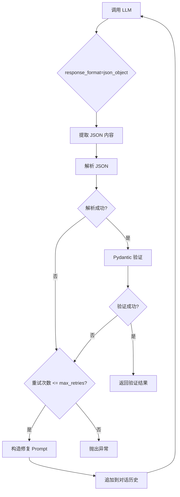

# Agent 结构化输出和自动重试机制

**日期**: 2026-01-30  
**类型**: Feature Enhancement  
**影响范围**: BaseAgent, IntentAnalyzerAgent

---

## 背景

### 问题描述

原有的 Agent 实现存在以下问题：

1. **没有使用 `response_format`**: 调用 LLM 时未传入 `response_format` 参数，而是依赖 Prompt 引导 + 手动提取 JSON
2. **没有自动重试机制**: 当 LLM 输出不符合 Schema 时，直接抛出异常，没有尝试让 LLM 自我修复
3. **缺少错误反馈循环**: 未将解析错误和原始输出回传给 LLM，导致 LLM 无法从错误中学习

### LangChain 官方最佳实践

根据 [LangChain 官方文档](https://python.langchain.com/docs/how_to/structured_output)，推荐的结构化输出方案包括：

#### 1. 结构化输出策略

- **`ProviderStrategy`**: 使用提供商原生的结构化输出（OpenAI、Anthropic、xAI 等）
- **`ToolStrategy`**: 通过 tool calling 实现结构化输出（适用于不支持原生结构化输出的模型）

#### 2. 自动重试机制

LangChain 提供 `handle_errors` 参数，支持多种错误处理策略：

```python
# 默认策略：使用默认错误消息捕获所有异常
ToolStrategy(schema=MySchema, handle_errors=True)

# 自定义错误消息
ToolStrategy(schema=MySchema, handle_errors="Please fix the format")

# 只捕获特定异常
ToolStrategy(schema=MySchema, handle_errors=ValidationError)

# 自定义错误处理函数
ToolStrategy(schema=MySchema, handle_errors=custom_handler)

# 不重试（直接抛出异常）
ToolStrategy(schema=MySchema, handle_errors=False)
```

#### 3. 错误反馈循环

当 schema 验证失败时，LangChain 自动：

1. 捕获异常（`ValidationError` 或 `JSONDecodeError`）
2. 构造修复 Prompt（包含原始输出、错误详情、正确 Schema）
3. 将修复 Prompt 追加到对话历史
4. 重新调用 LLM
5. 重复以上步骤，直到成功或超过最大重试次数

---

## 解决方案

### 1. BaseAgent 增强

在 `backend/app/agents/base.py` 中新增 `_call_llm_with_structured_output` 方法：

```python
async def _call_llm_with_structured_output(
    self,
    messages: List[Dict[str, str]],
    output_schema: Type[T],
    max_retries: int = 3,
    tools: List[Dict] | None = None,
) -> T:
    """
    调用 LLM 并自动重试直到输出符合 Schema
    
    参考 LangChain OutputFixingParser 的设计：
    - 首次调用：传入 response_format 强制返回 JSON
    - 如果解析失败：将错误信息和原始输出再次传入 LLM 进行修复
    - 最多重试 max_retries 次
    """
```

#### 核心特性

1. **强制 JSON 格式**: 调用 LLM 时传入 `response_format={"type": "json_object"}`
2. **自动提取 JSON**: 处理可能的 markdown 代码块（\`\`\`json ... \`\`\`）
3. **Pydantic 验证**: 使用 `output_schema.model_validate()` 进行严格验证
4. **自动重试**: 当验证失败时，构造修复 Prompt 并重新调用 LLM
5. **详细日志**: 记录每次重试的尝试次数、错误类型、修复 Prompt

#### 辅助方法

**`_extract_json_from_content(content: str) -> str`**

从 LLM 响应中提取 JSON 内容，处理以下情况：
- 纯 JSON
- JSON 代码块：\`\`\`json ... \`\`\`
- 通用代码块：\`\`\` ... \`\`\`

**`_build_fixing_prompt(original_content, error, schema) -> str`**

构造修复 Prompt（参考 LangChain OutputFixingParser），包含：

1. **原始输出**（截取前 500 字符）
2. **错误类型**（JSON 解析错误 / Schema 验证错误）
3. **错误详情**
   - JSON 解析错误：位置信息（行号、列号）
   - Schema 验证错误：字段名、错误消息、错误类型
4. **正确的 Schema**（JSON Schema 格式）
5. **修复指导**（5 条明确的修复步骤）

#### 错误处理流程



---

### 2. IntentAnalyzerAgent 改造

#### 改造前（手动解析 + 无重试）

```python
# 调用 LLM
response = await self._call_llm(messages)

# 解析输出
content = response.choices[0].message.content

# 尝试提取 JSON
if "```json" in content:
    json_start = content.find("```json") + 7
    json_end = content.find("```", json_start)
    content = content[json_start:json_end].strip()
elif "```" in content:
    json_start = content.find("```") + 3
    json_end = content.find("```", json_start)
    content = content[json_start:json_end].strip()

# 解析 JSON
try:
    result_dict = json.loads(content)
    
    # 补充 language_preferences
    if "language_preferences" not in result_dict:
        result_dict["language_preferences"] = language_prefs.model_dump()
    
    # Pydantic 验证
    result = IntentAnalysisOutput.model_validate(result_dict)
    return result
    
except json.JSONDecodeError as e:
    logger.error("intent_analysis_json_parse_error", error=str(e))
    raise ValueError(f"LLM 输出不是有效的 JSON 格式: {e}")
except Exception as e:
    logger.error("intent_analysis_output_invalid", error=str(e))
    raise ValueError(f"LLM 输出格式不符合 Schema: {e}")
```

**问题**：
- ❌ 没有传入 `response_format`
- ❌ 解析失败直接抛出异常
- ❌ 无法让 LLM 自我修复

#### 改造后（结构化输出 + 自动重试）

```python
# 使用 BaseAgent 的结构化输出方法（自动处理重试）
result = await self._call_llm_with_structured_output(
    messages=messages,
    output_schema=IntentAnalysisOutput,
    max_retries=3,
)

# 确保 language_preferences 被正确设置
if not result.language_preferences:
    result.language_preferences = language_prefs
else:
    if not result.language_preferences.resource_ratio:
        result.language_preferences.resource_ratio = language_prefs.get_effective_ratio()

logger.info("intent_analysis_success", ...)
return result
```

**优势**：
- ✅ 自动传入 `response_format={"type": "json_object"}`
- ✅ 自动提取和解析 JSON
- ✅ 自动重试（最多 3 次）
- ✅ 详细的错误日志和修复 Prompt

#### 修复 Prompt 示例

当 LLM 输出不符合 Schema 时，会自动生成如下修复 Prompt：

```
你之前的输出存在问题，请修复：

## 原始输出
```
{
  "roadmap_id": "python-web-development",
  "key_technologies": ["Python", "Flask"],
  "difficulty_profile": "advanced"  # ❌ 应该是 "intermediate" / "advanced" / "expert"
}
```

## 错误类型
Schema 验证错误

## 错误详情
字段验证失败：
  - difficulty_profile: Input should be 'beginner', 'intermediate', 'advanced' or 'expert' (type=literal_error)

## 正确的 Schema
```json
{
  "type": "object",
  "properties": {
    "roadmap_id": {"type": "string"},
    "key_technologies": {"type": "array", "items": {"type": "string"}},
    "difficulty_profile": {
      "type": "string",
      "enum": ["beginner", "intermediate", "advanced", "expert"]
    }
  },
  "required": ["roadmap_id", "key_technologies", "difficulty_profile"]
}
```

## 修复指导
1. 仔细检查 JSON 格式是否正确（括号、引号、逗号）
2. 确保所有必填字段都存在
3. 检查字段类型是否符合 Schema 要求
4. 检查字段值约束（如：数值范围、字符串长度、枚举值等）
5. 请直接返回修复后的完整 JSON，不要添加任何解释文字

请重新生成符合 Schema 的正确输出：
```

---

## 技术实现细节

### 1. 类型注解和泛型

```python
from typing import Type, TypeVar
from pydantic import BaseModel

T = TypeVar('T', bound=BaseModel)

async def _call_llm_with_structured_output(
    self,
    output_schema: Type[T],  # 类型参数
    ...
) -> T:  # 返回验证后的 Pydantic 实例
    ...
```

### 2. Pydantic 验证

```python
# 使用 Pydantic 进行严格验证
validated_output = output_schema.model_validate(result_dict)

# 捕获 ValidationError 获取详细错误信息
except ValidationError as e:
    # e.errors() 返回错误列表
    # [{'loc': ('rating',), 'msg': 'Input should be less than or equal to 5', 'type': 'less_than_equal'}]
    error_details = "\n".join([
        f"  - {err['loc']}: {err['msg']} (type={err['type']})"
        for err in e.errors()
    ])
```

### 3. JSON Schema 生成

```python
# 获取 Pydantic 模型的 JSON Schema
schema_dict = output_schema.model_json_schema()
schema_json = json.dumps(schema_dict, indent=2, ensure_ascii=False)
```

### 4. 对话历史追加

```python
# 将修复 Prompt 追加到对话历史
messages = messages.copy()
messages.append({
    "role": "assistant",
    "content": last_content,  # LLM 的错误输出
})
messages.append({
    "role": "user",
    "content": error_message,  # 修复 Prompt
})
```

---

## 日志示例

### 成功场景（无需重试）

```
[INFO] intent_analysis_calling_llm user_id=user123 model=gpt-4o-mini provider=openai
[DEBUG] structured_output_attempt agent_id=intent_analyzer attempt=0 max_retries=3
[DEBUG] structured_output_response_received agent_id=intent_analyzer attempt=0 content_length=1234
[INFO] structured_output_success agent_id=intent_analyzer attempt=0 schema=IntentAnalysisOutput
[INFO] intent_analysis_success user_id=user123 tech_stack_count=5 difficulty_profile=intermediate
```

### 失败重试场景

```
[INFO] intent_analysis_calling_llm user_id=user123 model=gpt-4o-mini provider=openai
[DEBUG] structured_output_attempt agent_id=intent_analyzer attempt=0 max_retries=3
[DEBUG] structured_output_response_received agent_id=intent_analyzer attempt=0 content_length=1234
[WARNING] structured_output_validation_failed agent_id=intent_analyzer attempt=1 error_type=ValidationError error="1 validation error for IntentAnalysisOutput\ndifficulty_profile\n  Input should be 'beginner', 'intermediate', 'advanced' or 'expert' [type=literal_error]"
[DEBUG] structured_output_retry_with_fixing_prompt agent_id=intent_analyzer attempt=1 fixing_prompt_preview="你之前的输出存在问题，请修复：\n\n## 原始输出\n```\n{\"difficulty_profile\": \"hard\"}...\n"

[DEBUG] structured_output_attempt agent_id=intent_analyzer attempt=1 max_retries=3
[DEBUG] structured_output_response_received agent_id=intent_analyzer attempt=1 content_length=1456
[INFO] structured_output_success agent_id=intent_analyzer attempt=1 schema=IntentAnalysisOutput
[INFO] intent_analysis_success user_id=user123 tech_stack_count=5 difficulty_profile=advanced
```

### 超过最大重试次数

```
[INFO] intent_analysis_calling_llm user_id=user123 model=gpt-4o-mini provider=openai
[DEBUG] structured_output_attempt agent_id=intent_analyzer attempt=0 max_retries=3
[DEBUG] structured_output_response_received agent_id=intent_analyzer attempt=0 content_length=1234
[WARNING] structured_output_validation_failed agent_id=intent_analyzer attempt=1 error_type=ValidationError ...
[DEBUG] structured_output_retry_with_fixing_prompt agent_id=intent_analyzer attempt=1 ...

[DEBUG] structured_output_attempt agent_id=intent_analyzer attempt=1 max_retries=3
[WARNING] structured_output_validation_failed agent_id=intent_analyzer attempt=2 error_type=ValidationError ...
[DEBUG] structured_output_retry_with_fixing_prompt agent_id=intent_analyzer attempt=2 ...

[DEBUG] structured_output_attempt agent_id=intent_analyzer attempt=2 max_retries=3
[WARNING] structured_output_validation_failed agent_id=intent_analyzer attempt=3 error_type=ValidationError ...
[DEBUG] structured_output_retry_with_fixing_prompt agent_id=intent_analyzer attempt=3 ...

[DEBUG] structured_output_attempt agent_id=intent_analyzer attempt=3 max_retries=3
[WARNING] structured_output_validation_failed agent_id=intent_analyzer attempt=4 error_type=ValidationError ...
[ERROR] structured_output_max_retries_exceeded agent_id=intent_analyzer max_retries=3 last_error="1 validation error..."
```

---

## 影响范围

### 1. 已改造的 Agent

- ✅ **IntentAnalyzerAgent** (`backend/app/agents/intent_analyzer.py`)
  - `analyze()` 方法
  - `execute()` 方法

### 2. 待改造的 Agent

以下 Agent 仍在使用手动解析方式，建议逐步改造：

- ⏳ `CurriculumArchitectAgent`
- ⏳ `TutorialGeneratorAgent`
- ⏳ `TutorialModifierAgent`
- ⏳ `ResourceRecommenderAgent`
- ⏳ `QuizGeneratorAgent`
- ⏳ `StructureValidatorAgent`
- ⏳ `EditPlanAnalyzerAgent`
- ⏳ 其他自定义 Agent

### 3. 改造步骤（标准化）

对于每个 Agent，按以下步骤改造：

1. **识别调用点**: 找到 `await self._call_llm(messages)` 的位置
2. **替换为结构化输出方法**:
   ```python
   result = await self._call_llm_with_structured_output(
       messages=messages,
       output_schema=YourOutputSchema,
       max_retries=3,
   )
   ```
3. **删除手动解析逻辑**: 删除 JSON 提取、`json.loads`、异常处理代码
4. **保留业务逻辑**: 保留字段补充、特殊处理等业务逻辑
5. **测试验证**: 测试正常场景和错误场景（故意提供错误 Prompt）

---

## 优势总结

### 1. 提高可靠性

- ✅ 强制 JSON 格式（`response_format`）
- ✅ 自动重试（最多 3 次）
- ✅ 详细的错误反馈

### 2. 减少代码重复

- ✅ 统一的结构化输出逻辑
- ✅ 统一的 JSON 提取逻辑
- ✅ 统一的错误处理逻辑

### 3. 改善用户体验

- ✅ 减少 LLM 输出格式错误导致的失败
- ✅ 自动修复，无需人工干预
- ✅ 详细的日志，便于排查问题

### 4. 符合最佳实践

- ✅ 参考 LangChain 官方设计
- ✅ 使用 Pydantic 严格验证
- ✅ 错误反馈循环（Error Feedback Loop）

---

## 后续工作

### 1. 扩展到其他 Agent

逐步将其他 Agent 改造为使用 `_call_llm_with_structured_output`。

### 2. 流式场景支持

为 `analyze_stream()` 等流式方法添加类似的重试机制（需要考虑流式输出的特殊性）。

### 3. 监控和告警

- 统计重试次数分布（0 次、1 次、2 次、3 次、失败）
- 监控超过最大重试次数的比例
- 分析常见的验证错误类型

### 4. 优化修复 Prompt

根据实际运行数据，优化修复 Prompt 的措辞和结构。

---

## 参考资料

- [LangChain Structured Output](https://python.langchain.com/docs/how_to/structured_output)
- [LangChain OutputFixingParser](https://python.langchain.com/api_reference/langchain/output_parsers/langchain.output_parsers.fix.OutputFixingParser.html)
- [Pydantic Validation](https://docs.pydantic.dev/latest/concepts/models/#basic-model-usage)
- [OpenAI JSON Mode](https://platform.openai.com/docs/guides/structured-outputs)

---

**变更文件**:
- `backend/app/agents/base.py`
- `backend/app/agents/intent_analyzer.py`
