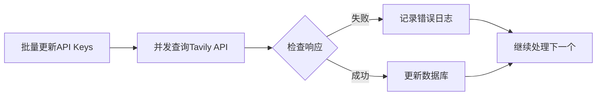
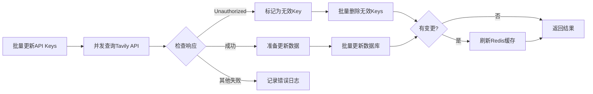

# Tavily API Key批量更新 - 自动清理无效Key功能

**日期**: 2026-01-30  
**改动范围**: `backend/app/services/admin/tavily_key_service.py`  
**功能**: 批量更新时自动删除无效API Key并触发Redis缓存刷新

---

## 问题背景

在批量更新Tavily API Keys配额时，如果某个Key已失效（返回"Unauthorized: missing or invalid API key"错误），系统只会记录错误日志，但不会自动清理这些无效的Key。

**示例日志**：
```
2026-01-30T15:07:36.550811Z [warning] tavily_quota_fetch_failed
error='Unauthorized: missing or invalid API key' key_prefix=tvly-dev-C...
```

这会导致：
1. 无效Key仍保留在数据库中
2. Redis缓存中仍包含这些无效Key
3. 后续请求可能会继续选中这些无效Key，造成失败

---

## 解决方案

### 核心改动

修改 `TavilyKeyService.batch_update_keys()` 方法，增加以下功能：

#### 1. 检测无效API Key

在处理API调用结果时，检查错误信息是否包含"Unauthorized"或"invalid API key"：

```python
if error:
    # 检查是否为Unauthorized错误（无效的API Key）
    if "Unauthorized" in error or "invalid API key" in error:
        # 标记为需要删除
        invalid_keys_to_delete.append(api_key)
        errors.append({
            "api_key": f"{api_key[:10]}...",
            "error": error,
            "action": "deleted (invalid key)"
        })
        logger.warning(
            "tavily_invalid_key_detected",
            key_prefix=api_key[:10] + "...",
            error=error,
            action="will_be_deleted",
        )
```

#### 2. 批量删除无效Keys

在数据库更新之前，先删除所有检测到的无效Keys：

```python
# Step 4: 删除无效的API Keys（如果有）
if invalid_keys_to_delete:
    from sqlalchemy import delete as sql_delete
    
    stmt = sql_delete(TavilyAPIKey).where(
        TavilyAPIKey.api_key.in_(invalid_keys_to_delete)
    )
    result = await session.execute(stmt)
    await session.flush()
    
    deleted_count = result.rowcount
    should_refresh_cache = True  # 标记需要刷新缓存
```

#### 3. 触发Redis缓存刷新

在有更新或删除操作后，自动刷新Redis缓存：

```python
# Step 6: 触发Redis缓存刷新（如果有更新或删除操作）
if should_refresh_cache:
    from app.core.tavily_key_cache import get_tavily_key_cache
    
    key_cache = get_tavily_key_cache()
    refreshed_count = await key_cache.refresh()
    
    logger.info(
        "tavily_cache_refreshed_after_update",
        refreshed_keys=refreshed_count,
        trigger="batch_update_with_changes",
    )
```

---

## 工作流程

### 修改前



**问题**：无效Key继续保留在系统中

---

### 修改后



**优势**：自动清理无效Key，保持数据一致性

---

## 响应格式变化

### 错误信息增强

对于无效的API Key，返回的错误信息增加了 `action` 字段：

```json
{
  "success": 5,
  "failed": 2,
  "errors": [
    {
      "api_key": "tvly-dev-C...",
      "error": "Unauthorized: missing or invalid API key",
      "action": "deleted (invalid key)"
    },
    {
      "api_key": "CACHE_REFRESH",
      "error": "Redis cache refresh failed: ...",
      "severity": "warning"
    }
  ]
}
```

---

## 日志输出示例

### 检测到无效Key

```
[warning] tavily_invalid_key_detected
key_prefix=tvly-dev-C... 
error='Unauthorized: missing or invalid API key'
action=will_be_deleted
```

### 删除无效Keys

```
[info] tavily_invalid_keys_deleted
deleted_count=2
keys=['tvly-dev-C...', 'tvly-dev-D...']
```

### 刷新Redis缓存

```
[info] tavily_cache_refreshed_after_update
refreshed_keys=48
trigger=batch_update_with_changes
```

### 批量更新完成

```
[info] tavily_keys_batch_updated
updated_count=5
failed_count=2
deleted_count=2
```

---

## 错误处理

### 删除失败

如果删除无效Keys失败，会记录错误但不影响主流程：

```python
except Exception as e:
    logger.error(
        "tavily_invalid_keys_deletion_failed",
        error=str(e),
        exc_info=True,
    )
    errors.append({
        "api_key": "INVALID_KEYS",
        "error": f"Failed to delete invalid keys: {str(e)}"
    })
```

### 缓存刷新失败

如果Redis缓存刷新失败，会记录警告但不影响主流程：

```python
except Exception as e:
    logger.error(
        "tavily_cache_refresh_failed",
        error=str(e),
        exc_info=True,
    )
    errors.append({
        "api_key": "CACHE_REFRESH",
        "error": f"Redis cache refresh failed: {str(e)}",
        "severity": "warning"
    })
```

---

## 性能影响

### 额外操作

1. **删除无效Keys**: SQL DELETE（批量）- 约1-5ms
2. **刷新Redis缓存**: 重新加载所有Keys - 约50-200ms

### 总体影响

- 对于无错误的情况：**无额外开销**
- 对于有无效Key的情况：增加 **约50-200ms**（一次性操作）

---

## 使用场景

### 1. 定时任务批量刷新配额

```bash
POST /api/v1/admin/tavily/keys/refresh-quota
```

自动获取所有Keys并查询配额，检测到无效Key会自动清理。

### 2. 手动批量更新指定Keys

```bash
POST /api/v1/admin/tavily/keys/batch-update
Content-Type: application/json

{
  "api_keys": ["tvly-xxx", "tvly-yyy", "tvly-zzz"]
}
```

指定Keys查询配额，检测到无效Key会自动清理。

---

## 测试建议

### 1. 正常场景测试

```python
# 所有Keys都有效
api_keys = ["valid-key-1", "valid-key-2", "valid-key-3"]
success, errors = await service.batch_update_keys(session, api_keys)

assert success == 3
assert len(errors) == 0
```

### 2. 无效Key场景测试

```python
# 包含无效Keys
api_keys = ["valid-key-1", "invalid-key", "valid-key-2"]
success, errors = await service.batch_update_keys(session, api_keys)

assert success == 2
assert len(errors) >= 1
assert any("deleted (invalid key)" in e.get("action", "") for e in errors)
```

### 3. 缓存验证

```python
# 验证Redis缓存已更新
from app.core.tavily_key_cache import get_tavily_key_cache

key_cache = get_tavily_key_cache()
cached_key = await key_cache.get_random_key()

# 确保缓存中不包含已删除的Key
assert cached_key not in invalid_keys_to_delete
```

---

## 总结

### 改进点

1. ✅ **自动清理无效Key**: 无需手动干预
2. ✅ **保持数据一致性**: 数据库和Redis缓存同步更新
3. ✅ **详细的错误报告**: 清楚标识被删除的Keys
4. ✅ **健壮的错误处理**: 局部失败不影响整体流程
5. ✅ **性能优化**: 批量操作，最小化数据库查询

### 注意事项

1. 删除操作不可逆，确保判断条件准确
2. 缓存刷新失败只记录警告，不阻塞主流程
3. 事务由调用方（API层）控制，Service层只flush不commit
4. 适用于所有批量更新场景（包括定时任务）
