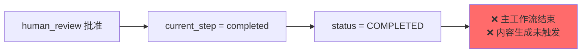
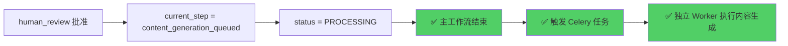

# 人工审核后内容生成未触发问题修复

## 问题描述

### 用户反馈

运行 `test_human_review.py` 测试脚本，在人工审核批准后：
- ❌ 内容生成节点（content_generation_node）没有被唤起
- ❌ 主工作流直接结束，状态设置为 COMPLETED
- ❌ 内容生成 Celery 任务未执行

### 架构背景

项目采用**双工作流 + 双 Checkpointer 架构**：

```
┌─────────────────────────────────────────────────────────────┐
│ 主工作流（LangGraph）                                        │
│ Intent → Curriculum → Validation → Human Review → END       │
│                                                              │
│ 使用父图 Checkpointer（thread_id: task_id）                 │
└─────────────────────────────────────────────────────────────┘
                            │
                            │ 批准后触发
                            ↓
┌─────────────────────────────────────────────────────────────┐
│ 内容生成工作流（独立 Celery Worker）                         │
│ 并发生成 Tutorial + Resource + Quiz                          │
│                                                              │
│ 使用子图 Checkpointer（thread_id: task_id:child:concept_id）│
└─────────────────────────────────────────────────────────────┘
```

**关键设计**：
1. 主工作流在 `human_review` 批准后直接结束（路由到 `END`）
2. `human_review_node` 内部触发独立的 Celery 任务来执行内容生成
3. 主工作流和内容生成工作流**完全解耦**，各自使用独立的 Checkpointer

---

## 根本原因分析

### 问题1：human_review_node 使用字符串字面量 ❌

**文件**：`backend/app/core/orchestrator/nodes/human_review.py:235`

**违规代码**：
```python
return {
    "human_approved": approved,
    "current_step": "completed" if approved else "human_review",  # ❌ 字符串字面量
}
```

**问题**：
1. 违反枚举常量使用规范
2. 批准时设置 `current_step="completed"`，但实际上内容生成还未开始
3. 应该设置为 `WorkflowStep.CONTENT_GENERATION_QUEUED`（内容生成已入队）

---

### 问题2：resume_after_review 状态判断错误 ❌

**文件**：`backend/app/services/workflows/execution/workflow_execution_service.py:404-413`

**违规代码**：
```python
elif current_step == WorkflowStep.COMPLETED.value or human_approved:
    # ✅ 工作流完成（批准后主工作流结束，内容生成独立进行）
    status = TaskStatus.COMPLETED  # ❌ 错误：内容生成还未完成
    success = True
```

**问题**：
1. 批准后将任务状态设置为 `COMPLETED`，但此时内容生成还未执行
2. 应该设置为 `TaskStatus.PROCESSING`（等待内容生成完成）
3. `current_step` 应该是 `CONTENT_GENERATION_QUEUED` 而不是 `COMPLETED`

---

### 问题3：execute_workflow 缺少 CONTENT_GENERATION_QUEUED 处理 ❌

**文件**：`backend/app/services/workflows/execution/workflow_execution_service.py:147-189`

**问题**：
1. `execute_workflow` 函数中没有处理 `CONTENT_GENERATION_QUEUED` 状态
2. 虽然正常情况下不会在 `execute_workflow` 中遇到此状态，但为了完整性应该添加处理逻辑

---

## 修复方案

### 修复1：human_review_node 使用枚举常量 ✅

**文件**：`backend/app/core/orchestrator/nodes/human_review.py`

**添加导入**：
```python
from app.models.constants import WorkflowStep
```

**修复 current_step**：
```python
# 修改前 ❌
return {
    "human_approved": approved,
    "current_step": "completed" if approved else "human_review",
}

# 修改后 ✅
return {
    "human_approved": approved,
    "current_step": (
        WorkflowStep.CONTENT_GENERATION_QUEUED.value 
        if approved 
        else WorkflowStep.HUMAN_REVIEW.value
    ),
}
```

**逻辑说明**：
- **批准时**：`current_step = CONTENT_GENERATION_QUEUED`（主工作流结束，内容生成已入队）
- **拒绝时**：`current_step = HUMAN_REVIEW`（保持在审核状态，等待下次审核）

---

### 修复2：resume_after_review 状态判断 ✅

**文件**：`backend/app/services/workflows/execution/workflow_execution_service.py:389-423`

**修复默认值**：
```python
# 修改前 ❌
current_step = final_state.get("current_step", WorkflowStep.COMPLETED.value)

# 修改后 ✅
current_step = final_state.get("current_step", WorkflowStep.CONTENT_GENERATION_QUEUED.value)
```

**修复状态判断**：
```python
# 修改前 ❌
elif current_step == WorkflowStep.COMPLETED.value or human_approved:
    status = TaskStatus.COMPLETED  # ❌ 内容生成还未完成
    
# 修改后 ✅
elif current_step == WorkflowStep.CONTENT_GENERATION_QUEUED.value or human_approved:
    status = TaskStatus.PROCESSING  # ✅ 等待内容生成
    logger.info(
        "main_workflow_completed_content_queued",
        message="主工作流完成，内容生成已入队（独立 Worker 执行）",
    )
```

**逻辑说明**：
- 批准后主工作流结束
- 任务状态设置为 `PROCESSING`（等待内容生成完成）
- `current_step` 为 `CONTENT_GENERATION_QUEUED`
- 内容生成由独立的 Celery Worker 执行

---

### 修复3：execute_workflow 添加 CONTENT_GENERATION_QUEUED 处理 ✅

**文件**：`backend/app/services/workflows/execution/workflow_execution_service.py:145-189`

**添加处理逻辑**：
```python
# 判断任务状态
if current_step == WorkflowStep.HUMAN_REVIEW.value:
    # 工作流在人工审核处暂停
    status = TaskStatus.HUMAN_REVIEW
    ...
elif current_step == WorkflowStep.CONTENT_GENERATION_QUEUED.value:
    # ✅ 新增：主工作流完成，内容生成已入队
    status = TaskStatus.PROCESSING
    logger.info(
        "main_workflow_completed_content_queued_from_execute",
        message="主工作流完成，内容生成已入队（独立 Worker 执行）",
    )
elif current_step == WorkflowStep.STRUCTURE_VALIDATION.value and roadmap_id:
    # SKIP_HUMAN_REVIEW=true 的场景
    ...
elif current_step == WorkflowStep.COMPLETED.value:
    # 整体任务完成（框架 + 内容生成都完成）
    ...
```

---

## 修复流程图

### 修复前 ❌



### 修复后 ✅



---

## 验证步骤

### 1. 重启 Celery Worker

```bash
pkill -f "celery.*worker"
cd backend
./scripts/start_worker_dev.sh
```

### 2. 运行测试脚本

```bash
cd backend
uv run python scripts/test_human_review.py
```

### 3. 检查日志

**批准后的预期日志**：

```
# ✅ 主工作流恢复
[info] resume_initial_state_loaded task_id=xxx current_step=human_review

# ✅ 人工审核节点处理
[info] human_review_node_resumed approved=True

# ✅ 触发内容生成 Celery 任务
[info] content_generation_task_triggered 
       task_id=xxx 
       roadmap_id=xxx 
       content_celery_id=xxx

# ✅ 主工作流完成，状态更新
[info] main_workflow_completed_content_queued
       task_id=xxx
       status=processing
       current_step=content_generation_queued
       message=主工作流完成，内容生成已入队（独立 Worker 执行）

# ✅ 内容生成 Worker 开始执行
[info] content_generation_celery_task_start
       roadmap_id=xxx
       total_concepts=10
```

### 4. 检查数据库

```sql
-- 检查任务状态
SELECT task_id, status, current_step, content_generation_celery_id
FROM task
WHERE task_id = 'xxx';

-- 预期结果
-- status: processing
-- current_step: content_generation_queued
-- content_generation_celery_id: <celery_task_id>
```

---

## 完整流程说明

### 主工作流（LangGraph）

```python
# 1. 用户批准审核
POST /api/v1/tasks/{task_id}/approve
{
  "approved": true,
  "feedback": ""
}

# 2. resume_after_human_review 恢复工作流
executor.resume_after_human_review(
    task_id=task_id,
    approved=True,
    feedback="",
)

# 3. human_review_node 处理审核结果
# - 触发 Celery 任务：generate_all_content_task.delay()
# - 返回状态：current_step = CONTENT_GENERATION_QUEUED

# 4. 主工作流路由到 END
# 根据 builder.py 第 229 行：
# "approved": END

# 5. 更新任务状态
# status = PROCESSING
# current_step = content_generation_queued
```

### 内容生成工作流（Celery Worker）

```python
# 1. Celery Worker 接收任务
@celery_app.task(name="generate_all_content")
async def generate_all_content_task(roadmap_id, task_id, user_id):
    ...

# 2. 从 Redis 缓存加载数据（或 Fallback 到数据库）
cache_data = await redis_client.get_json(f"content_gen_cache:{task_id}")

# 3. 构建内容生成子图（双 Checkpointer 架构）
subgraph = build_content_generation_subgraph(
    checkpointer=child_checkpointer  # 子图专用 Checkpointer
)

# 4. 并发执行内容生成
async for event in subgraph.astream(...):
    # 并发生成 Tutorial + Resource + Quiz
    ...

# 5. 所有内容生成完成后，更新任务状态
# status = COMPLETED
# current_step = completed
```

---

## 双 Checkpointer 架构说明

### 为什么需要双 Checkpointer？

**父图（主工作流）**：
- Thread ID: `task_id`
- Checkpoint 表: `checkpoints`（namespace: default）
- 记录：Intent → Curriculum → Validation → Human Review

**子图（内容生成）**：
- Thread ID: `task_id:child:concept_id`
- Checkpoint 表: `checkpoints`（namespace: child）
- 记录：并发执行的 Concept 内容生成进度

**优势**：
1. **状态隔离**：主图和子图的状态完全独立
2. **并发安全**：多个 Concept 并发生成时，互不干扰
3. **断点续传**：子图可以独立重试失败的 Concept

---

## 相关文件

### 修改的文件
- ✅ `backend/app/core/orchestrator/nodes/human_review.py`（修复枚举使用 + 逻辑）
- ✅ `backend/app/services/workflows/execution/workflow_execution_service.py`（修复状态判断）

### 参考文件
- `backend/app/core/orchestrator/builder.py:228-229`（human_review 路由到 END）
- `backend/app/core/orchestrator/subgraphs/content_generation.py`（子图构建）
- `backend/app/tasks/content_generation_tasks.py`（Celery 任务）
- `backend/app/models/constants.py`（枚举定义）

### 文档文件
- ✅ `backend/docs/20260207_人工审核后内容生成未触发问题修复.md`（本文档）
- ✅ `backend/docs/20260207_枚举常量使用规范修复.md`（枚举规范）

---

## 总结

本次修复解决了**三个关键问题**：

1. ✅ **修复字符串字面量违规**：严格使用 `WorkflowStep` 枚举
2. ✅ **修复状态判断逻辑**：批准后设置 `PROCESSING` 而不是 `COMPLETED`
3. ✅ **完善状态处理**：添加 `CONTENT_GENERATION_QUEUED` 处理逻辑

修复后的流程：
- ✅ 主工作流批准后正确结束
- ✅ 内容生成 Celery 任务被正确触发
- ✅ 任务状态正确反映实际进度（PROCESSING → 等待内容生成）
- ✅ 双 Checkpointer 架构正确运行

**关键理解**：
- 主工作流和内容生成工作流**完全解耦**
- 批准后主工作流结束（`current_step=CONTENT_GENERATION_QUEUED`），但任务状态是 `PROCESSING`（等待内容生成）
- 只有当内容生成 Worker 完成所有内容后，任务状态才会更新为 `COMPLETED`
