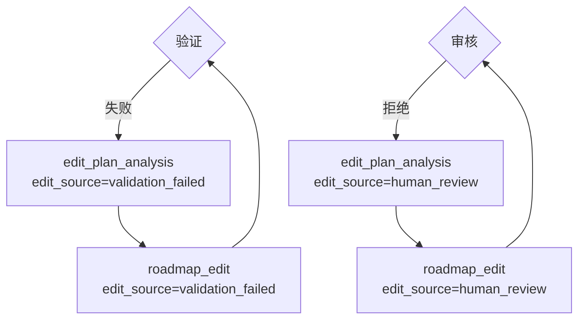

# 工作流步骤名规范化分析

## 问题描述

用户报告：当任务进入 `roadmap_edit` 步骤时，前端任务详情页的 WorkflowTopology 步进器显示错误，未能正确识别分支（validation分支 或 review分支）。

## 设计规范

根据 WorkflowStep 枚举和路线图设计图，工作流采用**共享节点 + edit_source 区分**的架构：

### 正确的设计（WorkflowStep 枚举）

```python
class WorkflowStep(str, Enum):
    # ... 其他步骤 ...
    
    # 共享编辑节点（由edit_source区分来源：validation_failed或human_review）
    EDIT_PLAN_ANALYSIS = "edit_plan_analysis"  # 编辑计划分析（共享）
    ROADMAP_EDIT = "roadmap_edit"              # 路线图修正（共享）
```

### 工作流路径



**关键点**：
- ✅ 只有 `edit_plan_analysis` 和 `roadmap_edit` 两个共享节点
- ✅ 通过 `edit_source` 字段区分来源（`validation_failed` 或 `human_review`）
- ❌ **不存在** `validation_edit_plan_analysis` 这个步骤名

## 现状分析

### 后端实现

#### ✅ 正确的部分

1. **WorkflowBuilder (builder.py)**：
   - Line 127-130: 注册节点 `"edit_plan_analysis"`（共享）
   - Line 135-138: 注册节点 `"roadmap_edit"`（共享）

2. **HandlerRegistry (orchestrator_factory.py)**：
   - Line 364-367: 注册 `"edit_plan_analysis"` → `EditPlanHandler`
   - Line 352-354: 注册 `"roadmap_edit"` → `EditorHandler`

3. **状态设置正确**：
   - `structure_validation_node` (Line 100): 验证失败时设置 `edit_source="validation_failed"`
   - `human_review_node` (Line 273): 拒绝时设置 `edit_source="human_review"`

4. **日志记录正确**：
   - `edit_plan_analysis_node` (Line 100, 106): 
     ```python
     step="edit_plan_analysis",
     details={"edit_source": edit_source}  # 从 state 获取
     ```
   - `roadmap_edit_node` (Line 103, 120):
     ```python
     step="roadmap_edit", 
     details={"edit_source": edit_source}  # 从 state 继承
     ```

#### ❌ 遗留问题

存在两个**不符合设计规范**的遗留文件（已不被使用）：

1. **`validation_edit_plan_analysis.py`**：
   - Line 86: `step="validation_edit_plan_analysis"` ❌
   - Line 103: `"current_step": "validation_edit_plan_analysis"` ❌
   - 这个步骤名不在 WorkflowStep 枚举中

2. **`validation_edit_plan_handler.py`**：
   - Line 24: `get_node_name() 返回 "validation_edit_plan_analysis"` ❌
   - 这个 Handler 未被注册到 HandlerRegistry

**影响**：
- 这两个文件不被当前工作流使用（已被 `edit_plan_analysis` 替代）
- 但会造成代码混淆和维护困难
- 如果数据库中有旧数据使用了这个步骤名，会导致前端无法识别

### 前端实现

#### ✅ 正确的部分

前端的日志过滤逻辑**完全符合设计规范**：

```typescript
// frontend-next/app/(app)/tasks/[taskId]/page.tsx (Lines 392-404)
const latestEditSource = allLogs
  .filter(log => 
    (log.step === 'roadmap_edit' || log.step === 'edit_plan_analysis') && 
    log.details && 'edit_source' in log.details
  )
  .sort((a, b) => new Date(b.created_at).getTime() - new Date(a.created_at).getTime())
  [0]?.details?.edit_source || null;
```

**正确之处**：
- 只过滤 `edit_plan_analysis` 和 `roadmap_edit` 两个共享节点
- 通过 `details.edit_source` 提取来源标识
- 完全符合 WorkflowStep 枚举的定义

#### 🔍 需要验证的点

前端逻辑正确，但需要验证：
1. 后端是否正确记录了 `details.edit_source` 字段
2. 数据库中是否存在使用旧步骤名的历史日志

## 根因分析

### 可能的原因

1. **历史数据问题**：
   - 如果数据库中存在旧任务使用了 `validation_edit_plan_analysis` 步骤名
   - 前端过滤会遗漏这些日志，导致 `editSource = null`
   - 步进器无法判断分支，回退到默认的 'analysis' 节点

2. **日志记录问题**：
   - 如果后端的 `edit_plan_analysis_node` 没有正确记录 `details.edit_source`
   - 前端虽然能找到日志，但 `edit_source` 为 undefined

3. **状态传递问题**：
   - 如果 state 中的 `edit_source` 没有正确传递给节点
   - 日志中的 `details.edit_source` 会为 null

## 修复方案

### 1. 清理后端遗留代码

删除或重命名不符合规范的文件：

```bash
# 删除遗留的节点文件
backend/app/core/orchestrator/nodes/validation_edit_plan_analysis.py

# 删除遗留的 Handler 文件
backend/app/core/orchestrator/handlers/validation_edit_plan_handler.py
```

### 2. 验证日志记录

检查 `edit_plan_analysis_node` 是否正确记录 edit_source：

**验证点**：
- `backend/app/core/orchestrator/nodes/edit_plan_analysis.py` Line 106
- 确认 `details.edit_source` 正确写入日志

### 3. 数据清理（可选）

如果数据库中存在使用旧步骤名的历史数据：

```sql
-- 查询使用旧步骤名的日志
SELECT COUNT(*) 
FROM execution_logs 
WHERE step = 'validation_edit_plan_analysis';

-- 如果存在，可以考虑更新（谨慎操作）
-- UPDATE execution_logs 
-- SET step = 'edit_plan_analysis',
--     details = jsonb_set(details, '{edit_source}', '"validation_failed"')
-- WHERE step = 'validation_edit_plan_analysis';
```

### 4. 添加防御性日志

在前端添加调试日志，当过滤结果为空时记录警告：

```typescript
const latestEditSource = allLogs
  .filter(log => 
    (log.step === 'roadmap_edit' || log.step === 'edit_plan_analysis') && 
    log.details && 'edit_source' in log.details
  )
  .sort((a, b) => new Date(b.created_at).getTime() - new Date(a.created_at).getTime())
  [0]?.details?.edit_source || null;

if (!latestEditSource && (taskInfo.current_step === 'roadmap_edit' || taskInfo.current_step === 'edit_plan_analysis')) {
  console.warn('[TaskDetail] Cannot extract edit_source, logs:', {
    current_step: taskInfo.current_step,
    total_logs: allLogs.length,
    filtered_logs: allLogs.filter(log => 
      log.step === 'roadmap_edit' || log.step === 'edit_plan_analysis'
    ),
  });
}
```

## 验证步骤

1. **创建新任务**：
   - 创建一个会触发验证失败的路线图任务
   - 等待任务进入 `edit_plan_analysis` 步骤
   - 检查数据库日志是否包含 `details.edit_source = "validation_failed"`

2. **检查步进器**：
   - 在前端任务详情页查看步进器显示
   - 确认验证分支的编辑节点是否高亮
   - 确认是否显示 "Auto-fix" 徽章

3. **检查日志过滤**：
   - 打开浏览器控制台
   - 查看 `[TaskDetail] Extracted edit_source from logs` 日志
   - 确认 edit_source 是否正确提取

## 总结

### 设计规范

- ✅ 只有两个共享节点：`edit_plan_analysis` 和 `roadmap_edit`
- ✅ 通过 `edit_source` 字段区分来源（`validation_failed` 或 `human_review`）
- ❌ 不存在 `validation_edit_plan_analysis` 步骤名

### 当前状态

- ✅ WorkflowBuilder 正确注册了共享节点
- ✅ HandlerRegistry 正确注册了 Handler
- ✅ 状态设置逻辑正确
- ✅ 前端过滤逻辑正确
- ❌ 存在遗留文件使用了错误的步骤名（需要清理）

### 后续行动

1. 删除遗留文件
2. 验证新任务的日志记录
3. 确认步进器显示正确
4. 考虑清理历史数据（可选）
