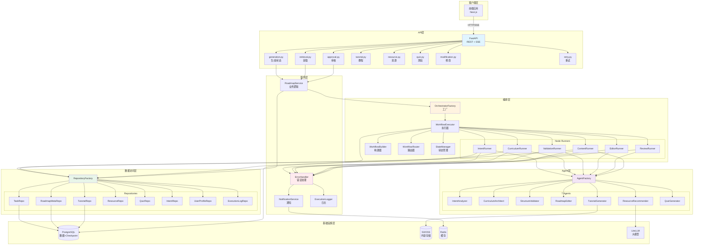
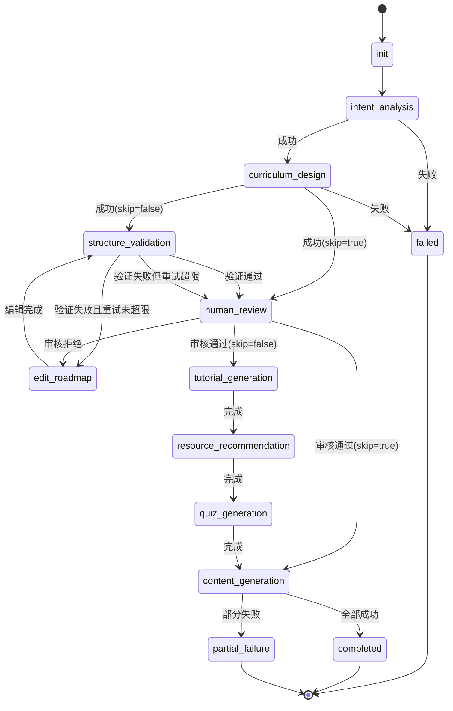
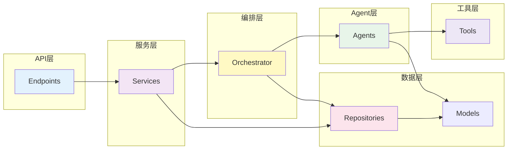
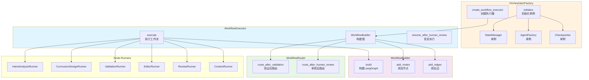
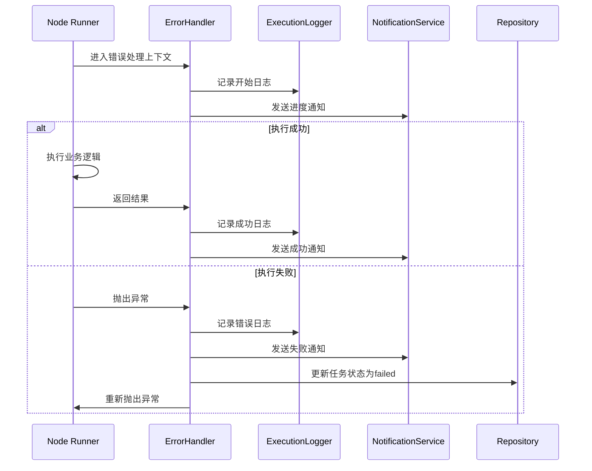
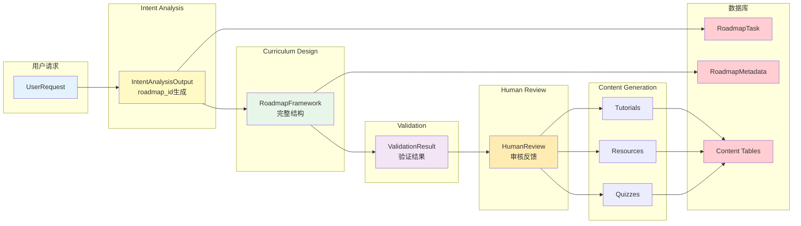
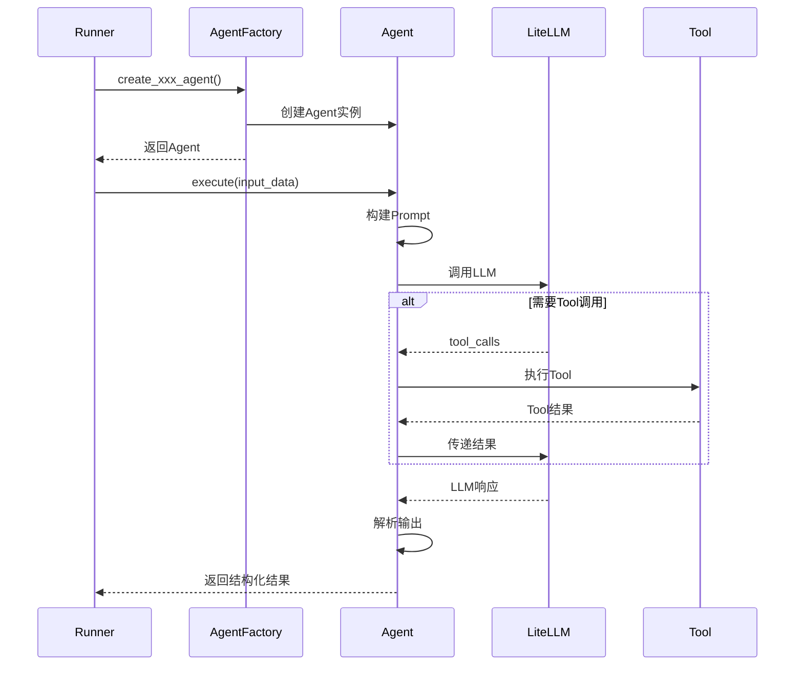
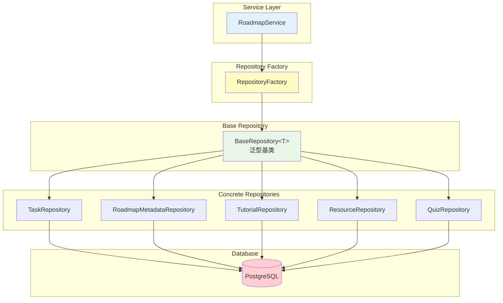
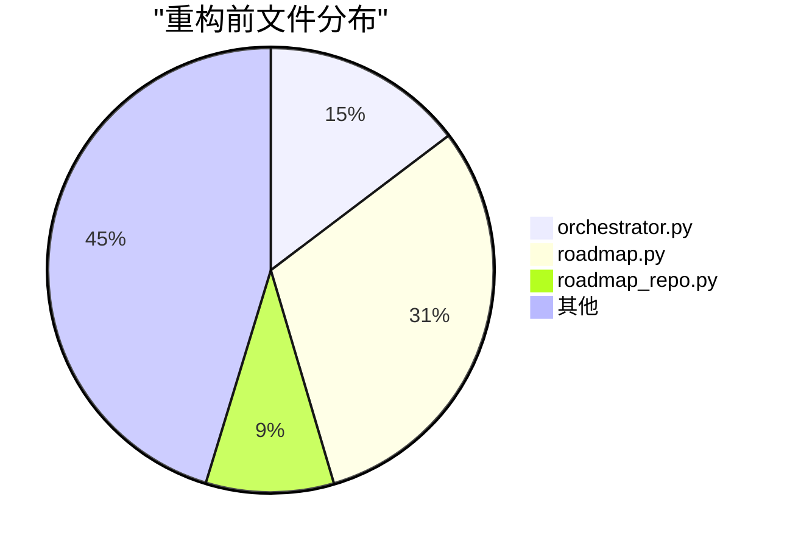
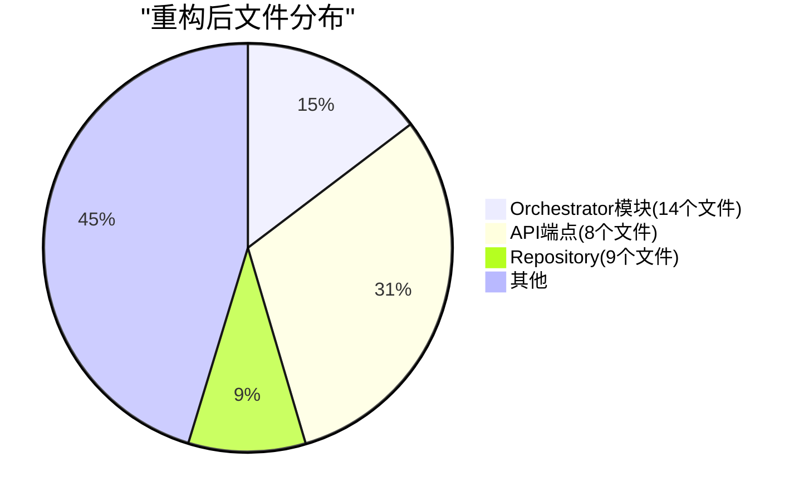

# 后端架构图（重构后）

> 更新日期：2025-12-06  
> 版本：v2.0（重构后）

---

## 📐 完整系统架构



---

## 🔄 工作流状态机



---

## 📦 模块依赖关系



---

## 🏗️ Orchestrator内部结构



---

## 🔐 错误处理流程



---

## 📊 数据流图



---

## 🎯 Agent调用链



---

## 💾 Repository模式



---

## 📈 重构前后对比

### 文件数量变化





### 代码质量提升

| 指标 | 重构前 | 重构后 | 改善 |
|:---|:---:|:---:|:---:|
| 平均文件行数 | 800+ | < 200 | ↓ 75% |
| 代码重复率 | 15% | < 5% | ↓ 67% |
| 测试覆盖率 | 60% | 78.6% | ↑ 31% |
| 单个类方法数 | 20+ | < 10 | ↓ 50% |

---

## 🎨 设计模式应用

### 1. 工厂模式 (Factory Pattern)

```python
# OrchestratorFactory - 管理Orchestrator组件创建
# AgentFactory - 管理Agent创建
# RepositoryFactory - 管理Repository创建
```

### 2. 策略模式 (Strategy Pattern)

```python
# WorkflowRouter - 根据状态选择不同的路由策略
# ErrorHandler - 统一的错误处理策略
```

### 3. 模板方法模式 (Template Method)

```python
# BaseRepository<T> - 定义CRUD通用流程
# 各具体Repository - 实现特定逻辑
```

### 4. 观察者模式 (Observer Pattern)

```python
# NotificationService - 发布进度事件
# StateManager - 管理状态变化
```

### 5. 单例模式 (Singleton Pattern)

```python
# OrchestratorFactory - 管理全局单例组件
```

---

## 📝 总结

重构后的架构具有以下优势：

✅ **模块化** - 每个模块职责清晰，易于理解和维护  
✅ **可测试** - 依赖注入使单元测试更容易  
✅ **可扩展** - 工厂模式和Protocol使系统易于扩展  
✅ **可维护** - 文件拆分和代码组织提升可维护性  
✅ **高内聚低耦合** - 各层职责明确，依赖关系清晰  

---

**文档版本**: v1.0  
**最后更新**: 2025-12-06  
**维护者**: Backend Team
