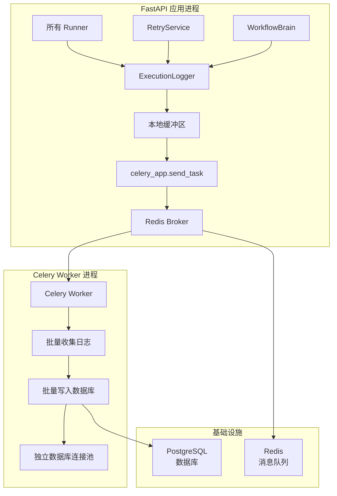

# Celery 异步日志队列设置指南

## 概述

本项目使用 Celery 作为异步任务队列，处理所有执行日志的数据库写入操作。这样可以完全解耦主流程和数据库操作，避免连接池耗尽问题。

## 架构



## 优势

1. **完全解耦**：主应用不再直接写入日志到数据库
2. **独立连接池**：Celery Worker 使用独立的数据库连接池
3. **批量处理**：日志批量写入，减少数据库操作
4. **可扩展性**：可以启动多个 Celery Worker 处理日志
5. **可靠性**：支持任务重试和故障恢复

## 安装依赖

### 使用 uv（推荐）

```bash
cd backend
uv sync
```

### 使用 pip

```bash
cd backend
pip install celery>=5.4.0 celery-pool-asyncio>=0.2.0 kombu>=5.4.0
```

## 启动服务

### 开发环境（本地）

1. **启动 Redis**（如果还未启动）：

```bash
redis-server
```

2. **启动 FastAPI 应用**：

```bash
cd backend
uvicorn app.main:app --reload
```

3. **启动 Celery Worker**：

```bash
cd backend
./scripts/start_celery_worker.sh
```

或者手动：

```bash
uv run celery -A app.core.celery_app worker \
    --loglevel=info \
    --queues=logs \
    --concurrency=4 \
    --pool=prefork \
    --hostname=logs@%h \
    --max-tasks-per-child=1000
```

**注意**：
- 使用 `prefork` pool（默认），每个 worker 进程独立运行
- 任务内部创建独立的事件循环来执行异步数据库操作
- 每个子进程处理 1000 个任务后自动重启，避免内存泄漏

4. **启动 Flower 监控**（可选）：

```bash
cd backend
./scripts/start_flower.sh
```

或者手动：

```bash
celery -A app.core.celery_app flower \
    --port=5555 \
    --broker=redis://localhost:6379/0
```

然后访问 http://localhost:5555 查看监控界面。

### 生产环境（Docker）

使用 Docker Compose 一键启动所有服务：

```bash
cd backend
docker-compose up -d
```

这将启动：
- FastAPI 应用（端口 8000）
- PostgreSQL 数据库（端口 5432）
- Redis（端口 6379）
- Celery Worker（后台运行）
- Flower 监控（端口 5555）

## 配置说明

### Celery 配置（app/core/celery_app.py）

```python
celery_app.conf.update(
    # 序列化
    task_serializer="json",
    accept_content=["json"],
    result_serializer="json",
    
    # 时区
    timezone="UTC",
    enable_utc=True,
    
    # 异步池
    worker_pool="asyncio",
    
    # 批量处理
    task_acks_late=True,
    task_reject_on_worker_lost=True,
    
    # 任务路由
    task_routes={
        "app.tasks.log_tasks.batch_write_logs": {"queue": "logs"},
    },
    
    # Worker 配置
    worker_prefetch_multiplier=1,
    worker_max_tasks_per_child=1000,
    
    # 任务超时
    task_time_limit=300,  # 5 分钟硬超时
    task_soft_time_limit=240,  # 4 分钟软超时
)
```

### ExecutionLogger 配置（app/services/execution_logger.py）

```python
class ExecutionLogger:
    def __init__(self):
        # 本地缓冲区大小
        self._buffer_size = 50  # 达到 50 条日志时发送
        
        # 刷新间隔
        self._flush_interval = 2.0  # 超过 2 秒时发送
```

## 监控和调试

### 使用 Flower 监控

访问 http://localhost:5555 查看：

- **任务列表**：查看所有任务执行情况
- **Worker 状态**：查看 Worker 状态和统计
- **任务详情**：查看任务参数、结果、错误信息
- **任务历史**：查看历史任务记录

### 使用 Redis CLI 检查队列

```bash
# 连接到 Redis
redis-cli

# 查看队列长度
LLEN logs

# 查看队列内容（不移除）
LRANGE logs 0 -1

# 查看所有键
KEYS celery-task-meta-*
```

### 查看 Celery Worker 日志

```bash
# 查看 Worker 输出
tail -f celery.log

# 或者直接在终端查看（如果没有使用后台运行）
celery -A app.core.celery_app worker --loglevel=debug
```

## 故障排查

### 问题 1：Celery Worker 无法连接 Redis

**症状**：Worker 启动时报错 `ConnectionError: Error connecting to Redis`

**解决方案**：
1. 检查 Redis 是否启动：`redis-cli ping`
2. 检查 Redis 配置：`app/config/settings.py` 中的 `REDIS_HOST` 和 `REDIS_PORT`
3. 检查网络连接：`telnet localhost 6379`

### 问题 2：日志写入延迟

**症状**：日志不是实时写入数据库

**解释**：这是正常现象，日志会批量写入（最多延迟 2 秒）

**如果需要立即写入**：
```python
# 手动刷新缓冲区
await execution_logger.flush()
```

### 问题 3：任务失败重试

**症状**：Flower 中看到任务重试

**检查**：
1. 查看任务错误信息（在 Flower 中）
2. 检查数据库连接是否正常
3. 检查数据库连接池配置

### 问题 4：内存占用增长

**症状**：Celery Worker 内存持续增长

**解决方案**：
1. 检查 `worker_max_tasks_per_child` 配置（默认 1000）
2. 减少并发数：`--concurrency=1`
3. 检查是否有内存泄漏

## 性能优化

### 调整批量大小

根据负载调整 `ExecutionLogger._buffer_size`：

```python
# 高并发场景：增大批量
self._buffer_size = 100

# 低延迟要求：减小批量
self._buffer_size = 20
```

### 调整刷新间隔

根据延迟要求调整 `ExecutionLogger._flush_interval`：

```python
# 允许更高延迟：增大间隔
self._flush_interval = 5.0

# 要求更低延迟：减小间隔
self._flush_interval = 1.0
```

### 增加 Worker 数量

```bash
# 启动多个 Worker（不同主机名）
celery -A app.core.celery_app worker --queues=logs --hostname=logs1@%h &
celery -A app.core.celery_app worker --queues=logs --hostname=logs2@%h &
```

### 调整并发数

```bash
# 增加并发（根据 CPU 核心数）
celery -A app.core.celery_app worker --concurrency=4
```

## 生产环境建议

1. **使用进程管理工具**：
   - Supervisor
   - systemd
   - PM2

2. **配置日志轮转**：
   ```bash
   celery -A app.core.celery_app worker \
       --logfile=/var/log/celery/worker.log \
       --loglevel=info
   ```

3. **配置监控告警**：
   - 监控 Worker 存活状态
   - 监控队列长度
   - 监控任务失败率

4. **配置持久化**：
   - Redis AOF 或 RDB 持久化
   - 定期备份 Redis 数据

5. **配置资源限制**：
   ```bash
   # 限制内存使用
   celery -A app.core.celery_app worker \
       --max-memory-per-child=200000  # 200MB
   ```

## API 兼容性说明

**重要**：重构后的 ExecutionLogger 保持完全的 API 兼容性，所有调用方代码无需修改。

唯一的区别是：`log()` 方法返回的 `ExecutionLog` 对象可能还没有数据库 ID（因为写入是异步的）。但当前代码中没有依赖这个 ID 的场景。

## 降级方案

如果 Celery 出现问题，可以快速回滚到直接写入数据库：

1. 停止 Celery Worker
2. 修改 `ExecutionLogger._flush_to_celery()` 方法，改为直接写入数据库
3. 重启应用

## 相关文件

- `app/core/celery_app.py` - Celery 应用配置
- `app/tasks/log_tasks.py` - 日志任务定义
- `app/services/execution_logger.py` - ExecutionLogger 服务
- `scripts/start_celery_worker.sh` - Worker 启动脚本
- `scripts/start_flower.sh` - Flower 监控启动脚本
- `docker-compose.yml` - Docker Compose 配置

## 参考资料

- [Celery 官方文档](https://docs.celeryproject.org/)
- [Flower 文档](https://flower.readthedocs.io/)
- [Redis 文档](https://redis.io/documentation)

