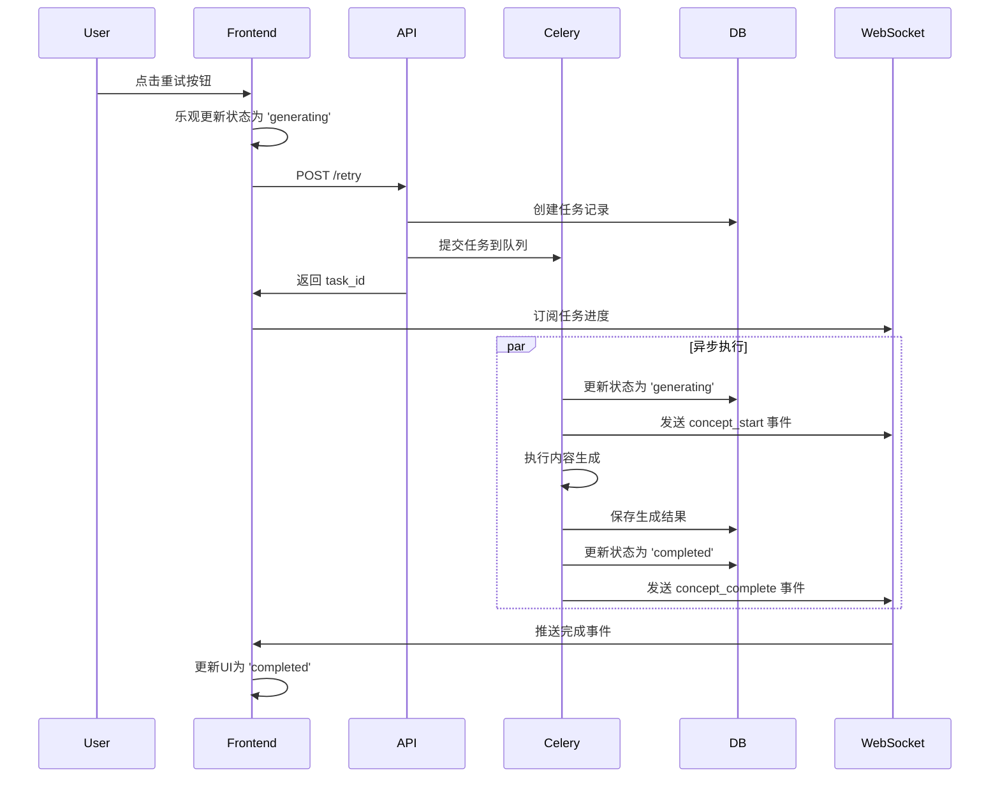
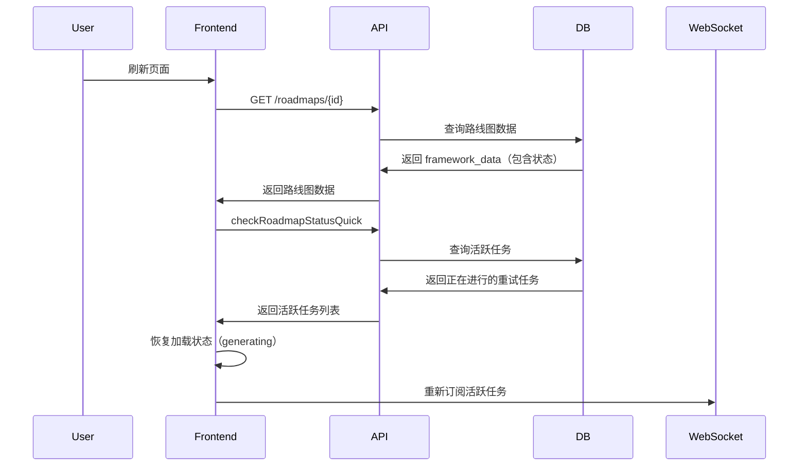

# 内容重试任务异步化实现

## 概述

将内容生成的重试任务（教程、资源推荐、测验）从同步执行改为 Celery 异步队列执行，确保用户点击重试后能保持加载状态，即使退出页面也能在返回时恢复状态。

## 修改文件

### 1. Backend - Celery 任务 (`backend/app/tasks/content_generation_tasks.py`)

新增三个 Celery 异步任务：

#### `retry_tutorial_task`
- **队列**: `content_generation`
- **超时**: 10分钟
- **功能**: 异步重新生成教程内容

#### `retry_resources_task`
- **队列**: `content_generation`
- **超时**: 10分钟
- **功能**: 异步重新生成资源推荐

#### `retry_quiz_task`
- **队列**: `content_generation`
- **超时**: 10分钟
- **功能**: 异步重新生成测验题目

每个任务都包含完整的状态管理：
- ✅ 更新数据库中的任务状态
- ✅ 更新 roadmap framework 中的概念状态
- ✅ 通过 WebSocket 实时推送进度
- ✅ 保存生成的内容到数据库
- ✅ 错误处理和失败状态更新

### 2. Backend - API 端点 (`backend/app/api/v1/endpoints/generation.py`)

修改三个重试端点，从同步执行改为提交 Celery 任务：

#### `POST /roadmaps/{roadmap_id}/concepts/{concept_id}/tutorial/retry`
- **旧行为**: 同步执行，阻塞请求直到生成完成
- **新行为**: 立即返回 task_id，任务在 Celery Worker 中异步执行

#### `POST /roadmaps/{roadmap_id}/concepts/{concept_id}/resources/retry`
- **旧行为**: 同步执行
- **新行为**: 异步执行

#### `POST /roadmaps/{roadmap_id}/concepts/{concept_id}/quiz/retry`
- **旧行为**: 同步执行
- **新行为**: 异步执行

所有端点都会：
1. 创建任务记录（包含 `task_type` 和 `content_type`）
2. 将任务状态设置为 `processing`
3. 提交 Celery 任务
4. 立即返回 `task_id`

## 前端兼容性

### ✅ 无需修改

前端已经具备完整的异步任务支持：

1. **RetryContentButton** (`frontend-next/components/common/retry-content-button.tsx`)
   - 已实现 WebSocket 订阅
   - 已包含历史事件获取 (`ws.connect(true)`)
   - 已实现完整的状态管理（generating → completed/failed）

2. **LearningStage** (`frontend-next/components/roadmap/immersive/learning-stage.tsx`)
   - 已实现活跃任务检查（`checkRoadmapStatusQuick`）
   - 页面刷新后自动恢复加载状态
   - 支持僵尸状态检测和修复

3. **RoadmapDetailPage** (`frontend-next/app/(immersive)/roadmap/[id]/page.tsx`)
   - 已移除强制重定向逻辑
   - 用户可以在任务进行中自由查看路线图

## 工作流程

### 用户点击重试按钮



### 页面刷新后状态恢复



## 状态持久化

### 数据库表：`tasks`

每个重试任务都会在数据库中记录：

```sql
CREATE TABLE tasks (
    task_id VARCHAR PRIMARY KEY,
    user_id VARCHAR NOT NULL,
    status VARCHAR NOT NULL,  -- 'processing', 'completed', 'failed'
    task_type VARCHAR,         -- 'retry_tutorial', 'retry_resources', 'retry_quiz'
    concept_id VARCHAR,        -- 关联的概念ID
    content_type VARCHAR,      -- 'tutorial', 'resources', 'quiz'
    roadmap_id VARCHAR,        -- 关联的路线图ID
    current_step VARCHAR,
    error_message TEXT,
    created_at TIMESTAMP,
    updated_at TIMESTAMP
);
```

### RoadmapMetadata.framework_data

每个概念的状态都存储在 `framework_data` 中：

```json
{
  "stages": [
    {
      "modules": [
        {
          "concepts": [
            {
              "concept_id": "...",
              "name": "...",
              "content_status": "generating",     // 教程状态
              "resources_status": "pending",      // 资源状态
              "quiz_status": "failed"             // 测验状态
            }
          ]
        }
      ]
    }
  ]
}
```

## 优势

### ✅ 真正的异步执行
- API 请求立即返回，不阻塞用户
- 内容生成在独立的 Celery Worker 进程中执行
- FastAPI 进程专注于处理 HTTP 请求

### ✅ 状态持久化
- 任务状态存储在数据库中
- 页面刷新后能正确恢复加载状态
- 支持跨设备/跨会话的状态同步

### ✅ 实时进度推送
- WebSocket 实时推送任务进度
- 前端能立即响应状态变化
- 支持历史事件获取，避免错过更新

### ✅ 健壮的错误处理
- Celery 任务失败会正确更新状态
- WebSocket 推送失败事件
- 前端显示错误提示和重试按钮

### ✅ 可扩展性
- Celery 支持分布式执行
- 可以独立扩展 Worker 数量
- 支持任务优先级和队列管理

## 测试建议

### 1. 基本功能测试
- [ ] 点击重试按钮，验证立即返回 task_id
- [ ] 验证 WebSocket 推送状态更新
- [ ] 验证生成成功后状态变为 'completed'
- [ ] 验证生成失败后状态变为 'failed'

### 2. 状态持久化测试
- [ ] 点击重试后立即刷新页面
- [ ] 验证页面显示加载状态
- [ ] 等待任务完成，验证状态更新

### 3. 并发测试
- [ ] 同时重试多个概念的内容
- [ ] 验证各个任务独立执行
- [ ] 验证状态更新不会混乱

### 4. 跨页面测试
- [ ] 在任务详情页点击重试
- [ ] 跳转到路线图详情页
- [ ] 验证加载状态正确显示

### 5. 错误处理测试
- [ ] 模拟 LLM API 失败
- [ ] 验证错误状态正确记录
- [ ] 验证用户可以再次重试

## 后续优化（可选）

1. **任务进度百分比**
   - 当前只有 start/complete 事件
   - 可以添加更细粒度的进度更新

2. **任务取消功能**
   - 允许用户取消正在进行的重试任务
   - 需要实现 Celery 任务撤销

3. **批量重试**
   - 支持一次重试多个失败的概念
   - 需要实现批量任务调度

4. **重试限制**
   - 限制同一概念的重试次数
   - 防止无限重试浪费资源

5. **任务优先级**
   - 用户手动触发的重试优先级更高
   - 自动重试优先级较低

---

**实现时间**: 2025-12-27  
**实现者**: AI Assistant  
**状态**: ✅ 已完成

