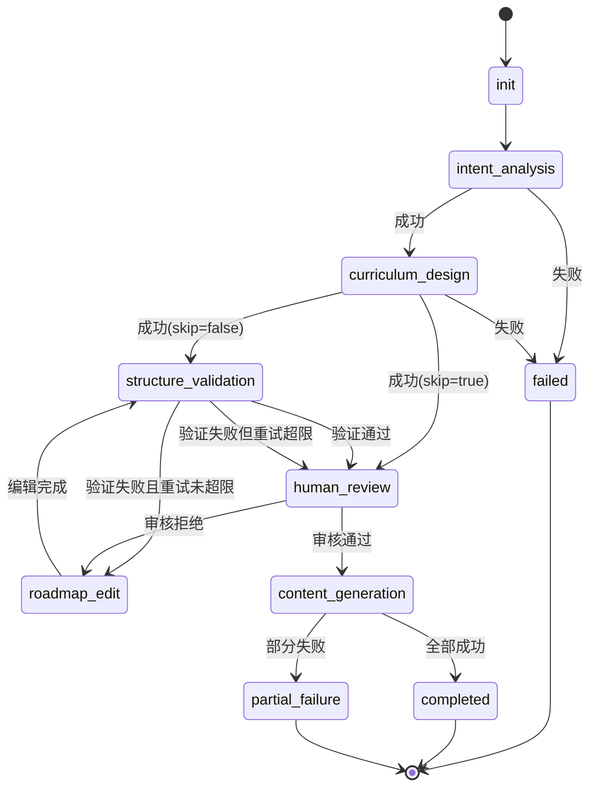

# 前后端联调 API 文档

> **版本**: v2.0  
> **更新日期**: 2025-12-06  
> **适用范围**: 前端开发、API 集成  
> **后端版本**: v2.0 (重构后)

---

## 📋 目录

1. [快速开始](#快速开始)
2. [API 基础信息](#api-基础信息)
3. [核心 API 端点](#核心-api-端点)
4. [状态枚举定义](#状态枚举定义)
5. [数据模型定义](#数据模型定义)
6. [实时通知协议](#实时通知协议)
7. [错误处理](#错误处理)
8. [状态机流程](#状态机流程)
9. [使用示例](#使用示例)
10. [最佳实践](#最佳实践)

---

## 快速开始

### 基础配置

```typescript
// API 基础配置
const API_BASE_URL = 'http://localhost:8000'
const API_VERSION = 'v1'
const API_PREFIX = `${API_BASE_URL}/api/${API_VERSION}`

// 示例：生成路线图
const response = await fetch(`${API_PREFIX}/roadmaps/generate`, {
  method: 'POST',
  headers: {
    'Content-Type': 'application/json',
  },
  body: JSON.stringify({
    user_id: 'user-123',
    preferences: {
      learning_goal: '学习 React 全栈开发',
      current_level: 'beginner',
      // ...
    }
  })
})
```

### API 文档地址

- **Swagger UI**: `http://localhost:8000/docs`
- **ReDoc**: `http://localhost:8000/redoc`
- **OpenAPI JSON**: `http://localhost:8000/openapi.json`

---

## API 基础信息

### 服务器地址

| 环境 | 地址 | 说明 |
|:---|:---|:---|
| **本地开发** | `http://localhost:8000` | 开发环境 |
| **测试环境** | `https://api-test.example.com` | 测试环境 |
| **生产环境** | `https://api.example.com` | 生产环境 |

### 通用请求头

```http
Content-Type: application/json
Accept: application/json
```

### 通用响应格式

**成功响应** (200 OK):

```json
{
  "status": "success",
  "data": {
    // 实际数据
  }
}
```

**错误响应** (4xx/5xx):

```json
{
  "detail": "错误信息描述"
}
```

---

## 核心 API 端点

### 1. 路线图生成

#### 1.1 生成路线图（同步）

```http
POST /api/v1/roadmaps/generate
```

**请求体**:

```typescript
interface GenerateRoadmapRequest {
  user_id: string;                    // 用户 ID
  preferences: {
    learning_goal: string;            // 学习目标（必填）
    current_level: 'beginner' | 'intermediate' | 'advanced';  // 当前水平
    time_commitment?: string;         // 时间投入（如 "2小时/天"）
    preferred_resources?: string[];   // 偏好资源类型
    learning_style?: string;          // 学习风格
  };
  skip_validation?: boolean;          // 跳过结构验证（默认 false）
  skip_human_review?: boolean;        // 跳过人工审核（默认 false）
}
```

**响应** (200 OK):

```typescript
interface GenerateRoadmapResponse {
  task_id: string;                    // 任务 ID（用于查询状态）
  roadmap_id: string;                 // 路线图 ID
  status: TaskStatus;                 // 任务状态
  message: string;                    // 提示信息
}
```

**示例**:

```json
{
  "task_id": "task-abc123",
  "roadmap_id": "roadmap-xyz789",
  "status": "processing",
  "message": "路线图生成任务已创建，正在处理中"
}
```

---

#### 1.2 生成路线图（流式 SSE）

```http
POST /api/v1/roadmaps/generate-stream
```

**请求体**: 同上

**响应**: Server-Sent Events (SSE) 流

**事件类型**:

| 事件类型 | 说明 | 数据格式 |
|:---|:---|:---|
| `progress` | 进度更新 | `ProgressEvent` |
| `step_complete` | 步骤完成 | `StepCompleteEvent` |
| `error` | 错误事件 | `ErrorEvent` |
| `complete` | 任务完成 | `CompleteEvent` |

**ProgressEvent**:

```typescript
interface ProgressEvent {
  type: 'progress';
  task_id: string;
  current_step: WorkflowStep;         // 当前步骤
  message: string;                    // 进度消息
  timestamp: string;                  // ISO 8601 时间戳
}
```

**StepCompleteEvent**:

```typescript
interface StepCompleteEvent {
  type: 'step_complete';
  task_id: string;
  step: WorkflowStep;                 // 完成的步骤
  result?: any;                       // 步骤结果（可选）
  timestamp: string;
}
```

**CompleteEvent**:

```typescript
interface CompleteEvent {
  type: 'complete';
  task_id: string;
  roadmap_id: string;
  status: 'completed' | 'partial_failure';
  timestamp: string;
}
```

**ErrorEvent**:

```typescript
interface ErrorEvent {
  type: 'error';
  task_id: string;
  error: string;                      // 错误信息
  step?: WorkflowStep;                // 失败的步骤（可选）
  timestamp: string;
}
```

**使用示例** (JavaScript):

```javascript
const eventSource = new EventSource(
  `${API_PREFIX}/roadmaps/generate-stream`,
  {
    method: 'POST',
    headers: { 'Content-Type': 'application/json' },
    body: JSON.stringify(request)
  }
);

eventSource.addEventListener('progress', (event) => {
  const data = JSON.parse(event.data);
  console.log('进度更新:', data.message);
});

eventSource.addEventListener('complete', (event) => {
  const data = JSON.parse(event.data);
  console.log('任务完成:', data.roadmap_id);
  eventSource.close();
});

eventSource.addEventListener('error', (event) => {
  const data = JSON.parse(event.data);
  console.error('任务失败:', data.error);
  eventSource.close();
});
```

---

#### 1.3 查询任务状态

```http
GET /api/v1/roadmaps/tasks/{task_id}/status
```

**路径参数**:
- `task_id`: 任务 ID

**响应** (200 OK):

```typescript
interface TaskStatusResponse {
  task_id: string;
  roadmap_id?: string;                // 路线图 ID（生成后）
  status: TaskStatus;                 // 任务状态
  current_step: WorkflowStep;         // 当前步骤
  created_at: string;                 // 创建时间（ISO 8601）
  updated_at: string;                 // 更新时间
  error_message?: string;             // 错误信息（如果失败）
}
```

---

### 2. 路线图获取

#### 2.1 获取路线图详情

```http
GET /api/v1/roadmaps/{roadmap_id}
```

**路径参数**:
- `roadmap_id`: 路线图 ID

**响应** (200 OK):

```typescript
interface RoadmapDetail {
  roadmap_id: string;
  user_id: string;
  learning_goal: string;
  created_at: string;
  updated_at: string;
  framework: RoadmapFramework;        // 路线图框架结构
}

interface RoadmapFramework {
  stages: Stage[];                    // 学习阶段列表
}

interface Stage {
  stage_id: string;
  stage_number: number;               // 阶段序号（1-based）
  title: string;                      // 阶段标题
  description: string;                // 阶段描述
  estimated_duration: string;         // 预计时长
  modules: Module[];                  // 模块列表
}

interface Module {
  module_id: string;
  module_number: number;              // 模块序号（1-based）
  title: string;
  description: string;
  learning_objectives: string[];      // 学习目标
  concepts: Concept[];                // 概念列表
}

interface Concept {
  concept_id: string;
  concept_number: number;             // 概念序号（1-based）
  title: string;
  description: string;
  key_points: string[];               // 关键要点
  prerequisites: string[];            // 前置要求
  estimated_time: string;             // 预计学习时间
  
  // 内容状态
  tutorial_status: ContentStatus;     // 教程状态
  resources_status: ContentStatus;    // 资源状态
  quiz_status: ContentStatus;         // 测验状态
}
```

**示例响应**:

```json
{
  "roadmap_id": "roadmap-xyz789",
  "user_id": "user-123",
  "learning_goal": "学习 React 全栈开发",
  "created_at": "2025-12-06T10:00:00Z",
  "updated_at": "2025-12-06T10:05:00Z",
  "framework": {
    "stages": [
      {
        "stage_id": "stage-1",
        "stage_number": 1,
        "title": "基础阶段",
        "description": "掌握 JavaScript 和 React 基础",
        "estimated_duration": "4-6周",
        "modules": [
          {
            "module_id": "module-1-1",
            "module_number": 1,
            "title": "JavaScript 基础",
            "description": "ES6+ 语法和特性",
            "learning_objectives": [
              "掌握 let/const 和变量作用域",
              "理解箭头函数和闭包"
            ],
            "concepts": [
              {
                "concept_id": "concept-1-1-1",
                "concept_number": 1,
                "title": "变量和数据类型",
                "description": "JavaScript 的变量声明和基本数据类型",
                "key_points": [
                  "let、const、var 的区别",
                  "基本数据类型和引用类型"
                ],
                "prerequisites": [],
                "estimated_time": "2小时",
                "tutorial_status": "completed",
                "resources_status": "completed",
                "quiz_status": "completed"
              }
            ]
          }
        ]
      }
    ]
  }
}
```

---

#### 2.2 获取用户的所有路线图

```http
GET /api/v1/roadmaps/user/{user_id}
```

**路径参数**:
- `user_id`: 用户 ID

**查询参数**:
- `status`: 任务状态过滤（可选）
- `limit`: 返回数量限制（默认 10）
- `offset`: 偏移量（默认 0）

**响应** (200 OK):

```typescript
interface RoadmapListResponse {
  total: number;                      // 总数
  items: RoadmapSummary[];            // 路线图列表
}

interface RoadmapSummary {
  roadmap_id: string;
  task_id: string;
  learning_goal: string;
  status: TaskStatus;
  created_at: string;
  updated_at: string;
}
```

---

### 3. 人工审核

#### 3.1 提交审核决策

```http
POST /api/v1/roadmaps/tasks/{task_id}/approve
```

**路径参数**:
- `task_id`: 任务 ID

**请求体**:

```typescript
interface ApprovalRequest {
  approved: boolean;                  // true: 通过, false: 拒绝
  feedback?: string;                  // 审核反馈（可选）
}
```

**响应** (200 OK):

```typescript
interface ApprovalResponse {
  task_id: string;
  status: TaskStatus;                 // 更新后的状态
  message: string;
}
```

**示例**:

```json
// 通过审核
{
  "approved": true,
  "feedback": "路线图结构合理，可以继续生成内容"
}

// 拒绝审核
{
  "approved": false,
  "feedback": "Stage 2 的模块划分不够清晰，请重新设计"
}
```

---

### 4. 内容查询

#### 4.1 获取教程内容

```http
GET /api/v1/roadmaps/{roadmap_id}/concepts/{concept_id}/tutorial
```

**路径参数**:
- `roadmap_id`: 路线图 ID
- `concept_id`: 概念 ID

**查询参数**:
- `version`: 版本号（可选，默认最新版本）

**响应** (200 OK):

```typescript
interface TutorialResponse {
  concept_id: string;
  concept_title: string;
  version: number;                    // 教程版本
  content_url: string;                // S3 存储 URL（Markdown 文件）
  content_preview?: string;           // 内容预览（前 500 字符）
  created_at: string;
  status: ContentStatus;
}
```

---

#### 4.2 获取学习资源

```http
GET /api/v1/roadmaps/{roadmap_id}/concepts/{concept_id}/resources
```

**响应** (200 OK):

```typescript
interface ResourcesResponse {
  concept_id: string;
  concept_title: string;
  resources: Resource[];              // 资源列表
  status: ContentStatus;
}

interface Resource {
  title: string;                      // 资源标题
  url: string;                        // 资源链接
  type: 'article' | 'video' | 'documentation' | 'tutorial' | 'course';
  description: string;                // 资源描述
  difficulty_level: 'beginner' | 'intermediate' | 'advanced';
  estimated_time?: string;            // 预计阅读/观看时间
}
```

---

#### 4.3 获取测验题目

```http
GET /api/v1/roadmaps/{roadmap_id}/concepts/{concept_id}/quiz
```

**响应** (200 OK):

```typescript
interface QuizResponse {
  concept_id: string;
  concept_title: string;
  questions: Question[];              // 题目列表
  status: ContentStatus;
}

interface Question {
  question_id: string;
  type: 'multiple_choice' | 'single_choice' | 'true_false' | 'short_answer';
  question_text: string;              // 题目内容
  options?: string[];                 // 选项（选择题）
  correct_answer: string | string[];  // 正确答案
  explanation: string;                // 答案解析
  difficulty: 'easy' | 'medium' | 'hard';
}
```

---

### 5. 内容修改

#### 5.1 修改教程内容

```http
POST /api/v1/roadmaps/{roadmap_id}/concepts/{concept_id}/tutorial/modify
```

**请求体**:

```typescript
interface ModifyTutorialRequest {
  modification_request: string;       // 修改要求（自然语言）
  current_version?: number;           // 当前版本号（可选）
}
```

**响应** (200 OK):

```typescript
interface ModifyTutorialResponse {
  concept_id: string;
  new_version: number;                // 新版本号
  content_url: string;                // 新内容 URL
  status: ContentStatus;
  message: string;
}
```

**示例**:

```json
{
  "modification_request": "请增加更多关于 useState Hook 的实际案例，并添加性能优化的注意事项"
}
```

---

#### 5.2 修改学习资源

```http
POST /api/v1/roadmaps/{roadmap_id}/concepts/{concept_id}/resources/modify
```

**请求体**:

```typescript
interface ModifyResourcesRequest {
  modification_request: string;       // 修改要求
}
```

---

#### 5.3 修改测验题目

```http
POST /api/v1/roadmaps/{roadmap_id}/concepts/{concept_id}/quiz/modify
```

**请求体**:

```typescript
interface ModifyQuizRequest {
  modification_request: string;       // 修改要求
}
```

---

### 6. 失败重试

#### 6.1 重试失败的内容生成

```http
POST /api/v1/roadmaps/{roadmap_id}/retry-failed
```

**路径参数**:
- `roadmap_id`: 路线图 ID

**响应** (200 OK):

```typescript
interface RetryResponse {
  roadmap_id: string;
  retry_count: number;                // 重试的内容数量
  message: string;
}
```

**说明**: 此接口会重试所有状态为 `failed` 的内容（教程、资源、测验）。

---

## 状态枚举定义

### TaskStatus（任务状态）

```typescript
enum TaskStatus {
  PENDING = 'pending',                      // 待处理
  PROCESSING = 'processing',                // 处理中
  HUMAN_REVIEW_PENDING = 'human_review_pending',  // 等待人工审核
  COMPLETED = 'completed',                  // 已完成
  PARTIAL_FAILURE = 'partial_failure',      // 部分失败
  FAILED = 'failed'                         // 失败
}
```

**状态说明**:

| 状态 | 说明 | 前端展示建议 |
|:---|:---|:---|
| `pending` | 任务已创建，等待开始 | 显示"排队中" |
| `processing` | 任务正在执行工作流 | 显示进度条和当前步骤 |
| `human_review_pending` | 等待人工审核 | 显示审核界面（通过/拒绝按钮） |
| `completed` | 任务成功完成 | 显示"已完成"，可查看路线图 |
| `partial_failure` | 框架生成成功，部分内容生成失败 | 显示警告，提供重试按钮 |
| `failed` | 任务执行失败 | 显示错误信息，提供重试选项 |

---

### ContentStatus（内容状态）

```typescript
enum ContentStatus {
  PENDING = 'pending',                      // 待生成
  GENERATING = 'generating',                // 生成中（前端临时状态）
  COMPLETED = 'completed',                  // 已完成
  FAILED = 'failed'                         // 失败
}
```

**状态说明**:

| 状态 | 说明 | 前端展示建议 |
|:---|:---|:---|
| `pending` | 内容尚未开始生成 | 显示"待生成" |
| `generating` | 内容正在生成（仅前端使用） | 显示加载动画 |
| `completed` | 内容生成成功 | 可点击查看内容 |
| `failed` | 内容生成失败 | 显示错误图标，提供重试按钮 |

**注意**: `generating` 状态不会存储到数据库，仅在前端使用（SSE 流式更新时）。

---

### WorkflowStep（工作流步骤）

```typescript
enum WorkflowStep {
  INIT = 'init',                            // 初始化
  QUEUED = 'queued',                        // 已入队
  STARTING = 'starting',                    // 启动中
  INTENT_ANALYSIS = 'intent_analysis',      // 需求分析
  CURRICULUM_DESIGN = 'curriculum_design',  // 课程设计
  STRUCTURE_VALIDATION = 'structure_validation',  // 结构验证
  HUMAN_REVIEW = 'human_review',            // 人工审核
  ROADMAP_EDIT = 'roadmap_edit',            // 路线图修正
  CONTENT_GENERATION = 'content_generation',// 内容生成
  TUTORIAL_GENERATION = 'tutorial_generation',    // 教程生成
  RESOURCE_RECOMMENDATION = 'resource_recommendation',  // 资源推荐
  QUIZ_GENERATION = 'quiz_generation',      // 测验生成
  FINALIZING = 'finalizing',                // 收尾中
  COMPLETED = 'completed',                  // 已完成
  FAILED = 'failed'                         // 失败
}
```

**步骤说明**:

| 步骤 | 中文名称 | 说明 | 预计时长 |
|:---|:---|:---|:---:|
| `intent_analysis` | 需求分析 | 分析用户学习需求和技术栈 | 10-20秒 |
| `curriculum_design` | 课程设计 | 设计路线图框架结构 | 30-60秒 |
| `structure_validation` | 结构验证 | 验证路线图逻辑性和完整性 | 10-20秒 |
| `human_review` | 人工审核 | 等待用户审核（暂停） | 用户决定 |
| `roadmap_edit` | 路线图修正 | 根据反馈修正路线图 | 20-40秒 |
| `content_generation` | 内容生成 | 并行生成教程、资源、测验 | 2-5分钟 |

---

## 数据模型定义

### TypeScript 类型定义

```typescript
// ==================== 请求类型 ====================

interface UserRequest {
  user_id: string;
  preferences: UserPreferences;
  skip_validation?: boolean;
  skip_human_review?: boolean;
}

interface UserPreferences {
  learning_goal: string;                      // 学习目标（必填）
  current_level: 'beginner' | 'intermediate' | 'advanced';
  time_commitment?: string;
  preferred_resources?: string[];
  learning_style?: string;
}

// ==================== 响应类型 ====================

interface RoadmapFramework {
  stages: Stage[];
}

interface Stage {
  stage_id: string;
  stage_number: number;
  title: string;
  description: string;
  estimated_duration: string;
  modules: Module[];
}

interface Module {
  module_id: string;
  module_number: number;
  title: string;
  description: string;
  learning_objectives: string[];
  concepts: Concept[];
}

interface Concept {
  concept_id: string;
  concept_number: number;
  title: string;
  description: string;
  key_points: string[];
  prerequisites: string[];
  estimated_time: string;
  tutorial_status: ContentStatus;
  resources_status: ContentStatus;
  quiz_status: ContentStatus;
}

// ==================== 内容类型 ====================

interface Tutorial {
  concept_id: string;
  version: number;
  content_url: string;
  created_at: string;
  status: ContentStatus;
}

interface Resource {
  title: string;
  url: string;
  type: 'article' | 'video' | 'documentation' | 'tutorial' | 'course';
  description: string;
  difficulty_level: 'beginner' | 'intermediate' | 'advanced';
  estimated_time?: string;
}

interface Question {
  question_id: string;
  type: 'multiple_choice' | 'single_choice' | 'true_false' | 'short_answer';
  question_text: string;
  options?: string[];
  correct_answer: string | string[];
  explanation: string;
  difficulty: 'easy' | 'medium' | 'hard';
}

// ==================== SSE 事件类型 ====================

interface SSEEvent {
  type: 'progress' | 'step_complete' | 'error' | 'complete';
  task_id: string;
  timestamp: string;
}

interface ProgressEvent extends SSEEvent {
  type: 'progress';
  current_step: WorkflowStep;
  message: string;
}

interface StepCompleteEvent extends SSEEvent {
  type: 'step_complete';
  step: WorkflowStep;
  result?: any;
}

interface ErrorEvent extends SSEEvent {
  type: 'error';
  error: string;
  step?: WorkflowStep;
}

interface CompleteEvent extends SSEEvent {
  type: 'complete';
  roadmap_id: string;
  status: 'completed' | 'partial_failure';
}
```

---

## 实时通知协议

### WebSocket 连接 - 推荐用于路线图生成

**适用场景**：路线图生成（支持人工审核、状态恢复、页面刷新后继续）

**端点**：`ws://localhost:8000/ws/{task_id}`

**查询参数**：
- `include_history`: `true/false` - 连接时是否获取当前任务状态（默认 `false`）

**优点**：
- 双向通信（支持心跳、主动请求状态）
- 支持状态持久化和恢复
- 完整的事件类型（包括 Concept 级别进度）
- 任务完成后自动关闭连接

---

#### WebSocket 事件类型

**基础事件接口**：

```typescript
interface WebSocketEvent {
  type: string;
  task_id: string;
  timestamp: string;  // ISO 8601 格式
}
```

**连接级别事件**：

```typescript
// 连接成功确认
interface ConnectedEvent extends WebSocketEvent {
  type: 'connected';
  message: string;
}

// 当前状态（仅在 include_history=true 时发送）
interface CurrentStatusEvent extends WebSocketEvent {
  type: 'current_status';
  status: TaskStatus;           // 任务状态
  current_step: string;         // 当前步骤
  roadmap_id?: string;          // 路线图 ID（如果已生成）
  created_at?: string;          // 创建时间
  updated_at?: string;          // 更新时间
}
```

**阶段级别事件**：

```typescript
// 进度更新
interface ProgressEvent extends WebSocketEvent {
  type: 'progress';
  step: WorkflowStep;           // 当前步骤
  status: string;               // 状态（processing 等）
  message?: string;             // 进度消息
  data?: {                      // 额外数据
    roadmap_id?: string;        // 路线图 ID（curriculum_design 完成后可用）
    stages_count?: number;      // 阶段数量
    total_concepts?: number;    // 概念总数
    [key: string]: any;
  };
  sub_status?: 'waiting' | 'editing';  // 子状态（仅 human_review 步骤）
}

// 人工审核请求
interface HumanReviewRequiredEvent extends WebSocketEvent {
  type: 'human_review_required';
  roadmap_id: string;           // 路线图 ID
  roadmap_title: string;        // 路线图标题
  stages_count: number;         // 阶段数量
  message: string;              // 提示消息
}

// 任务完成
interface CompletedEvent extends WebSocketEvent {
  type: 'completed';
  roadmap_id: string;           // 路线图 ID
  tutorials_count?: number;     // 生成的教程数量
  failed_count?: number;        // 失败的教程数量
  message: string;
}

// 任务失败
interface FailedEvent extends WebSocketEvent {
  type: 'failed';
  error: string;                // 错误信息
  step?: string;                // 失败的步骤
  message: string;
}
```

**Concept 级别事件**（内容生成阶段）：

```typescript
// Concept 开始生成
interface ConceptStartEvent extends WebSocketEvent {
  type: 'concept_start';
  concept_id: string;           // 概念 ID
  concept_name: string;         // 概念名称
  progress: {
    current: number;            // 当前进度（第几个）
    total: number;              // 总数
    percentage: number;         // 百分比
  };
  message: string;
}

// Concept 生成完成
interface ConceptCompleteEvent extends WebSocketEvent {
  type: 'concept_complete';
  concept_id: string;
  concept_name: string;
  data?: {
    tutorial_id?: string;       // 教程 ID
    content_url?: string;       // 内容 URL
    [key: string]: any;
  };
  message: string;
}

// Concept 生成失败
interface ConceptFailedEvent extends WebSocketEvent {
  type: 'concept_failed';
  concept_id: string;
  concept_name: string;
  error: string;                // 错误信息（限制 200 字符）
  message: string;
}
```

**批次级别事件**：

```typescript
// 批次处理开始
interface BatchStartEvent extends WebSocketEvent {
  type: 'batch_start';
  batch_index: number;          // 当前批次索引（从 1 开始）
  batch_size: number;           // 当前批次大小
  total_batches: number;        // 总批次数
  concept_ids: string[];        // 本批次包含的概念 ID
  message: string;
}

// 批次处理完成
interface BatchCompleteEvent extends WebSocketEvent {
  type: 'batch_complete';
  batch_index: number;          // 当前批次索引
  total_batches: number;        // 总批次数
  progress: {
    completed: number;          // 已完成数量
    failed: number;             // 已失败数量
    total: number;              // 总数量
    percentage: number;         // 完成百分比
  };
  message: string;
}
```

**连接控制事件**：

```typescript
// 连接即将关闭
interface ClosingEvent extends WebSocketEvent {
  type: 'closing';
  reason: string;               // 关闭原因（completed/failed/timeout）
  message: string;
}

// 错误事件
interface ErrorEvent extends WebSocketEvent {
  type: 'error';
  message: string;              // 错误信息
}
```

---

#### 客户端发送消息

客户端可以向服务器发送以下消息：

```typescript
// 心跳消息（推荐每 30 秒发送一次）
interface PingMessage {
  type: 'ping';
}

// 主动请求当前状态
interface GetStatusMessage {
  type: 'get_status';
}
```

---

#### 完整使用示例

**基础连接示例**：

```typescript
// 1. 启动任务
const { task_id } = await generateRoadmapAsync(request);

// 2. 连接 WebSocket（获取历史状态）
const ws = new WebSocket(`ws://localhost:8000/ws/${task_id}?include_history=true`);

// 3. 事件监听
ws.onopen = () => {
  console.log('WebSocket 连接成功');
};

ws.onmessage = (event) => {
  const data = JSON.parse(event.data);
  
  switch (data.type) {
    case 'connected':
      console.log('连接确认:', data.message);
      break;
      
    case 'current_status':
      console.log('当前状态:', data.status, data.current_step);
      // 恢复 UI 状态
      updateUIFromStatus(data);
      break;
      
    case 'progress':
      console.log('进度更新:', data.step, data.message);
      updateProgress(data);
      
      // 提取 roadmap_id（早期导航）
      if (data.data?.roadmap_id && data.step === 'curriculum_design') {
        // 路线图框架已生成，可以导航到详情页
        navigateToRoadmap(data.data.roadmap_id);
      }
      break;
      
    case 'human_review_required':
      console.log('等待人工审核:', data.roadmap_title);
      showReviewDialog(data);
      break;
      
    case 'concept_start':
      console.log('开始生成:', data.concept_name);
      updateConceptStatus(data.concept_id, 'generating');
      updateProgress(data.progress);
      break;
      
    case 'concept_complete':
      console.log('生成完成:', data.concept_name);
      updateConceptStatus(data.concept_id, 'completed');
      break;
      
    case 'concept_failed':
      console.warn('生成失败:', data.concept_name, data.error);
      updateConceptStatus(data.concept_id, 'failed');
      break;
      
    case 'batch_complete':
      console.log('批次完成:', data.batch_index, '/', data.total_batches);
      updateBatchProgress(data.progress);
      break;
      
    case 'completed':
      console.log('任务完成:', data.roadmap_id);
      showSuccessMessage(data);
      ws.close();
      break;
      
    case 'failed':
      console.error('任务失败:', data.error);
      showErrorMessage(data);
      ws.close();
      break;
      
    case 'closing':
      console.log('连接即将关闭:', data.reason);
      break;
      
    case 'error':
      console.error('服务器错误:', data.message);
      break;
  }
};

ws.onerror = (error) => {
  console.error('WebSocket 错误:', error);
  // 降级到轮询方案
  startPolling(task_id);
};

ws.onclose = (event) => {
  console.log('WebSocket 连接关闭:', event.code, event.reason);
};

// 4. 心跳机制（可选但推荐）
const heartbeat = setInterval(() => {
  if (ws.readyState === WebSocket.OPEN) {
    ws.send(JSON.stringify({ type: 'ping' }));
  }
}, 30000);  // 每 30 秒发送一次心跳

// 5. 主动请求状态（可选）
function requestCurrentStatus() {
  if (ws.readyState === WebSocket.OPEN) {
    ws.send(JSON.stringify({ type: 'get_status' }));
  }
}

// 6. 清理（组件卸载时）
function cleanup() {
  clearInterval(heartbeat);
  if (ws.readyState === WebSocket.OPEN) {
    ws.close();
  }
}
```

**页面刷新后状态恢复**：

```typescript
// 用户刷新页面后重新连接并恢复状态
function reconnectToTask(taskId: string) {
  // 1. 连接时获取历史状态
  const ws = new WebSocket(`ws://localhost:8000/ws/${taskId}?include_history=true`);
  
  ws.onmessage = (event) => {
    const data = JSON.parse(event.data);
    
    if (data.type === 'current_status') {
      // 根据当前状态恢复 UI
      switch (data.status) {
        case 'human_review_pending':
          // 显示审核对话框
          showReviewDialog(data.roadmap_id);
          break;
          
        case 'processing':
          // 显示进度 UI
          showProgressUI(data.current_step);
          break;
          
        case 'completed':
          // 直接导航到路线图
          navigateToRoadmap(data.roadmap_id);
          ws.close();
          break;
          
        case 'failed':
          // 显示错误
          showErrorMessage(data);
          ws.close();
          break;
      }
    }
    
    // 继续监听后续事件
    // ...
  };
}
```

**错误处理和降级策略**：

```typescript
class RoadmapGenerationClient {
  private ws: WebSocket | null = null;
  private pollingInterval: NodeJS.Timeout | null = null;
  private taskId: string;
  
  constructor(taskId: string) {
    this.taskId = taskId;
  }
  
  async connect() {
    try {
      // 优先使用 WebSocket
      this.ws = new WebSocket(
        `ws://localhost:8000/ws/${this.taskId}?include_history=true`
      );
      this.setupWebSocket();
    } catch (error) {
      console.warn('WebSocket 连接失败，降级到轮询:', error);
      this.startPolling();
    }
  }
  
  private setupWebSocket() {
    if (!this.ws) return;
    
    this.ws.onerror = (error) => {
      console.warn('WebSocket 错误，降级到轮询:', error);
      this.startPolling();
    };
    
    this.ws.onclose = (event) => {
      if (!event.wasClean) {
        console.warn('WebSocket 异常关闭，降级到轮询');
        this.startPolling();
      }
    };
    
    this.ws.onmessage = (event) => {
      const data = JSON.parse(event.data);
      this.handleEvent(data);
    };
  }
  
  private async startPolling() {
    // 停止 WebSocket
    if (this.ws) {
      this.ws.close();
      this.ws = null;
    }
    
    // 开始轮询（每 2 秒）
    this.pollingInterval = setInterval(async () => {
      try {
        const status = await getTaskStatus(this.taskId);
        this.handleStatusUpdate(status);
        
        // 任务结束时停止轮询
        if (status.status === 'completed' || status.status === 'failed') {
          this.stopPolling();
        }
      } catch (error) {
        console.error('轮询错误:', error);
      }
    }, 2000);
  }
  
  private stopPolling() {
    if (this.pollingInterval) {
      clearInterval(this.pollingInterval);
      this.pollingInterval = null;
    }
  }
  
  private handleEvent(data: any) {
    // 处理事件...
  }
  
  private handleStatusUpdate(status: any) {
    // 处理状态更新...
  }
  
  disconnect() {
    this.stopPolling();
    if (this.ws) {
      this.ws.close();
      this.ws = null;
    }
  }
}

// 使用示例
const client = new RoadmapGenerationClient(taskId);
await client.connect();

// 组件卸载时清理
onUnmount(() => {
  client.disconnect();
});
```

---

### SSE (Server-Sent Events) - 适用于 AI 聊天

**适用场景**：AI 聊天、内容修改等流式输出场景

**端点**：`POST /api/v1/roadmaps/generate-stream`（或其他流式端点）

**优点**：
- 实现简单（基于 HTTP）
- 自动重连
- 单向通信足够
- 完美适配流式输出（逐字显示）

**使用示例**：参见"聊天修改"章节

```javascript
const eventSource = new EventSource(
  `${API_PREFIX}/roadmaps/generate-stream`,
  { /* options */ }
);

// 监听特定事件
eventSource.addEventListener('progress', handleProgress);
eventSource.addEventListener('complete', handleComplete);
eventSource.addEventListener('error', handleError);

// 关闭连接
eventSource.close();
```

---

### 场景推荐总结

| 场景 | 推荐方案 | 原因 |
|:---|:---|:---|
| **路线图生成** | WebSocket + 轮询（降级） | 支持人工审核、状态恢复、页面刷新后继续 |
| **AI 聊天** | SSE | 流式输出简单、自动重连 |
| **内容修改** | SSE | 流式输出、单向通信足够 |

---

## 错误处理

### HTTP 状态码

| 状态码 | 说明 | 处理建议 |
|:---:|:---|:---|
| **200** | 成功 | 正常处理响应数据 |
| **400** | 请求参数错误 | 显示错误信息，提示用户修改输入 |
| **404** | 资源不存在 | 显示"资源不存在"，返回列表页 |
| **422** | 数据验证失败 | 显示具体验证错误，标记错误字段 |
| **500** | 服务器内部错误 | 显示"服务器错误"，提供重试按钮 |
| **503** | 服务不可用 | 显示"服务暂时不可用"，稍后重试 |

### 错误响应格式

```typescript
interface ErrorResponse {
  detail: string;                     // 错误详情
  error_code?: string;                // 错误码（可选）
}
```

### 常见错误码

| 错误码 | 说明 | 处理建议 |
|:---|:---|:---|
| `TASK_NOT_FOUND` | 任务不存在 | 检查 task_id 是否正确 |
| `ROADMAP_NOT_FOUND` | 路线图不存在 | 检查 roadmap_id 是否正确 |
| `INVALID_TASK_STATUS` | 任务状态不允许此操作 | 提示用户当前状态不支持此操作 |
| `CONTENT_GENERATION_FAILED` | 内容生成失败 | 提供重试选项 |
| `LLM_API_ERROR` | LLM API 调用失败 | 通常是临时错误，建议重试 |
| `DATABASE_ERROR` | 数据库错误 | 联系后端开发者 |

### 错误处理示例

```typescript
async function generateRoadmap(request: GenerateRoadmapRequest) {
  try {
    const response = await fetch(`${API_PREFIX}/roadmaps/generate`, {
      method: 'POST',
      headers: { 'Content-Type': 'application/json' },
      body: JSON.stringify(request)
    });

    if (!response.ok) {
      const error = await response.json();
      
      switch (response.status) {
        case 400:
          showError('请求参数错误: ' + error.detail);
          break;
        case 404:
          showError('资源不存在');
          break;
        case 500:
          showError('服务器错误，请稍后重试');
          break;
        default:
          showError('未知错误: ' + error.detail);
      }
      
      return null;
    }

    const data = await response.json();
    return data;
    
  } catch (error) {
    console.error('网络错误:', error);
    showError('网络连接失败，请检查网络');
    return null;
  }
}
```

---

## 状态机流程

### 完整工作流状态机



### 任务状态转换规则

| 当前状态 | 允许的操作 | 转换后状态 |
|:---|:---|:---|
| `pending` | 自动开始 | `processing` |
| `processing` | 工作流执行 | `human_review_pending` / `completed` / `failed` |
| `human_review_pending` | 用户审核（通过/拒绝） | `processing` / `failed` |
| `completed` | 查看内容、修改内容 | `completed` |
| `partial_failure` | 重试失败内容 | `processing` |
| `failed` | 重新生成 | `pending` |

### 内容状态转换

```
pending → (开始生成) → generating → completed
                                  ↘ failed → (重试) → generating
```

---

## 使用示例

### 示例1: 完整的路线图生成流程

```typescript
// 1. 发起生成请求
async function generateRoadmap() {
  const request: GenerateRoadmapRequest = {
    user_id: 'user-123',
    preferences: {
      learning_goal: '学习 React 全栈开发',
      current_level: 'beginner',
      time_commitment: '2小时/天'
    }
  };

  const response = await fetch(`${API_PREFIX}/roadmaps/generate`, {
    method: 'POST',
    headers: { 'Content-Type': 'application/json' },
    body: JSON.stringify(request)
  });

  const result = await response.json();
  const taskId = result.task_id;
  
  // 2. 轮询查询状态
  pollTaskStatus(taskId);
}

// 2. 轮询任务状态
function pollTaskStatus(taskId: string) {
  const intervalId = setInterval(async () => {
    const response = await fetch(
      `${API_PREFIX}/roadmaps/tasks/${taskId}/status`
    );
    const status = await response.json();
    
    console.log('当前状态:', status.status);
    console.log('当前步骤:', status.current_step);
    
    // 3. 处理不同状态
    switch (status.status) {
      case 'human_review_pending':
        // 显示审核界面
        showReviewUI(taskId, status.roadmap_id);
        clearInterval(intervalId);
        break;
        
      case 'completed':
        // 加载路线图
        loadRoadmap(status.roadmap_id);
        clearInterval(intervalId);
        break;
        
      case 'failed':
        // 显示错误
        showError(status.error_message);
        clearInterval(intervalId);
        break;
    }
  }, 2000); // 每 2 秒查询一次
}

// 3. 人工审核
async function submitReview(taskId: string, approved: boolean, feedback?: string) {
  const response = await fetch(
    `${API_PREFIX}/roadmaps/tasks/${taskId}/approve`,
    {
      method: 'POST',
      headers: { 'Content-Type': 'application/json' },
      body: JSON.stringify({ approved, feedback })
    }
  );
  
  const result = await response.json();
  
  if (approved) {
    // 审核通过，继续轮询
    pollTaskStatus(taskId);
  } else {
    // 审核拒绝，工作流会重新生成
    console.log('已拒绝，等待重新生成');
    pollTaskStatus(taskId);
  }
}

// 4. 加载路线图详情
async function loadRoadmap(roadmapId: string) {
  const response = await fetch(
    `${API_PREFIX}/roadmaps/${roadmapId}`
  );
  const roadmap = await response.json();
  
  // 渲染路线图
  renderRoadmap(roadmap);
}
```

---

### 示例2: 使用 SSE 流式接收更新

```typescript
function generateRoadmapWithSSE(request: GenerateRoadmapRequest) {
  const eventSource = new EventSource(
    `${API_PREFIX}/roadmaps/generate-stream`,
    {
      method: 'POST',
      headers: { 'Content-Type': 'application/json' },
      body: JSON.stringify(request)
    }
  );

  // 进度更新
  eventSource.addEventListener('progress', (event) => {
    const data: ProgressEvent = JSON.parse(event.data);
    updateProgressBar(data.current_step, data.message);
  });

  // 步骤完成
  eventSource.addEventListener('step_complete', (event) => {
    const data: StepCompleteEvent = JSON.parse(event.data);
    markStepComplete(data.step);
  });

  // 任务完成
  eventSource.addEventListener('complete', (event) => {
    const data: CompleteEvent = JSON.parse(event.data);
    loadRoadmap(data.roadmap_id);
    eventSource.close();
  });

  // 错误处理
  eventSource.addEventListener('error', (event) => {
    const data: ErrorEvent = JSON.parse(event.data);
    showError(data.error);
    eventSource.close();
  });

  // 连接错误
  eventSource.onerror = (error) => {
    console.error('SSE 连接错误:', error);
    eventSource.close();
  };
}

// 进度条更新函数
function updateProgressBar(step: WorkflowStep, message: string) {
  const stepProgress: Record<WorkflowStep, number> = {
    'intent_analysis': 10,
    'curriculum_design': 30,
    'structure_validation': 50,
    'human_review': 60,
    'content_generation': 80,
    'completed': 100
  };
  
  const progress = stepProgress[step] || 0;
  document.getElementById('progress-bar').style.width = `${progress}%`;
  document.getElementById('progress-text').textContent = message;
}
```

---

### 示例3: 获取和显示内容

```typescript
// 加载教程内容
async function loadTutorial(roadmapId: string, conceptId: string) {
  const response = await fetch(
    `${API_PREFIX}/roadmaps/${roadmapId}/concepts/${conceptId}/tutorial`
  );
  const tutorial = await response.json();
  
  if (tutorial.status === 'completed') {
    // 从 S3 URL 获取 Markdown 内容
    const contentResponse = await fetch(tutorial.content_url);
    const markdownContent = await contentResponse.text();
    
    // 渲染 Markdown
    renderMarkdown(markdownContent);
  } else if (tutorial.status === 'failed') {
    showRetryButton(roadmapId, conceptId);
  }
}

// 加载资源列表
async function loadResources(roadmapId: string, conceptId: string) {
  const response = await fetch(
    `${API_PREFIX}/roadmaps/${roadmapId}/concepts/${conceptId}/resources`
  );
  const data = await response.json();
  
  if (data.status === 'completed') {
    renderResourceList(data.resources);
  }
}

// 加载测验题目
async function loadQuiz(roadmapId: string, conceptId: string) {
  const response = await fetch(
    `${API_PREFIX}/roadmaps/${roadmapId}/concepts/${conceptId}/quiz`
  );
  const data = await response.json();
  
  if (data.status === 'completed') {
    renderQuiz(data.questions);
  }
}
```

---

### 示例4: 修改内容

```typescript
// 修改教程
async function modifyTutorial(
  roadmapId: string,
  conceptId: string,
  modificationRequest: string
) {
  const response = await fetch(
    `${API_PREFIX}/roadmaps/${roadmapId}/concepts/${conceptId}/tutorial/modify`,
    {
      method: 'POST',
      headers: { 'Content-Type': 'application/json' },
      body: JSON.stringify({ modification_request: modificationRequest })
    }
  );
  
  const result = await response.json();
  
  if (result.status === 'completed') {
    // 加载新版本教程
    loadTutorial(roadmapId, conceptId);
  } else {
    // 轮询等待生成完成
    pollContentStatus(roadmapId, conceptId, 'tutorial');
  }
}

// 轮询内容状态
function pollContentStatus(
  roadmapId: string,
  conceptId: string,
  contentType: 'tutorial' | 'resources' | 'quiz'
) {
  const intervalId = setInterval(async () => {
    const response = await fetch(
      `${API_PREFIX}/roadmaps/${roadmapId}/concepts/${conceptId}/${contentType}`
    );
    const data = await response.json();
    
    if (data.status === 'completed') {
      clearInterval(intervalId);
      // 重新加载内容
      if (contentType === 'tutorial') loadTutorial(roadmapId, conceptId);
      else if (contentType === 'resources') loadResources(roadmapId, conceptId);
      else if (contentType === 'quiz') loadQuiz(roadmapId, conceptId);
    } else if (data.status === 'failed') {
      clearInterval(intervalId);
      showError('内容生成失败');
    }
  }, 3000);
}
```

---

## 最佳实践

### 1. API 调用优化

✅ **使用 SSE 而非轮询**: 对于实时更新，优先使用 SSE 而不是轮询

```typescript
// ✅ 推荐：使用 SSE
const eventSource = new EventSource(`${API_PREFIX}/roadmaps/generate-stream`);

// ❌ 不推荐：频繁轮询
setInterval(() => fetch(`${API_PREFIX}/roadmaps/tasks/${taskId}/status`), 1000);
```

✅ **适当的轮询间隔**: 如果必须轮询，使用合理的间隔（2-5秒）

```typescript
// ✅ 合理的轮询间隔
const intervalId = setInterval(pollStatus, 3000); // 3秒

// ❌ 过于频繁的轮询
const intervalId = setInterval(pollStatus, 500);  // 0.5秒
```

✅ **及时清理**: 在组件卸载时关闭连接

```typescript
// React 示例
useEffect(() => {
  const eventSource = new EventSource(url);
  
  return () => {
    eventSource.close(); // 清理连接
  };
}, []);
```

---

### 2. 错误处理

✅ **区分错误类型**: 根据不同错误类型提供不同的处理方案

```typescript
async function handleAPICall() {
  try {
    const response = await fetch(url);
    
    if (!response.ok) {
      if (response.status === 400) {
        // 参数错误 - 提示用户修改
        showInputError(await response.json());
      } else if (response.status === 500) {
        // 服务器错误 - 提供重试
        showRetryButton();
      }
    }
  } catch (error) {
    // 网络错误 - 检查网络连接
    showNetworkError();
  }
}
```

✅ **友好的错误提示**: 将技术错误转换为用户友好的提示

```typescript
const ERROR_MESSAGES: Record<string, string> = {
  'TASK_NOT_FOUND': '任务不存在，请重新生成',
  'LLM_API_ERROR': '服务暂时繁忙，请稍后重试',
  'DATABASE_ERROR': '系统错误，请联系客服'
};

function showError(errorCode: string) {
  const message = ERROR_MESSAGES[errorCode] || '发生未知错误';
  toast.error(message);
}
```

---

### 3. 状态管理

✅ **使用状态机**: 前端也应维护清晰的状态机

```typescript
// 使用 XState 或类似库
const roadmapMachine = createMachine({
  initial: 'idle',
  states: {
    idle: {
      on: { START_GENERATE: 'generating' }
    },
    generating: {
      on: {
        PROGRESS: 'generating',
        REVIEW_NEEDED: 'reviewing',
        SUCCESS: 'completed',
        ERROR: 'failed'
      }
    },
    reviewing: {
      on: {
        APPROVE: 'generating',
        REJECT: 'generating'
      }
    },
    completed: {},
    failed: {}
  }
});
```

✅ **同步后端状态**: 确保前端状态与后端一致

```typescript
// 定期同步状态
async function syncStatus(taskId: string) {
  const response = await fetch(`${API_PREFIX}/roadmaps/tasks/${taskId}/status`);
  const status = await response.json();
  
  // 更新本地状态
  updateLocalState(status);
}
```

---

### 4. 性能优化

✅ **按需加载内容**: 不要一次加载所有内容

```typescript
// ✅ 懒加载：用户点击时才加载
async function onConceptClick(conceptId: string) {
  const tutorial = await loadTutorial(roadmapId, conceptId);
  renderTutorial(tutorial);
}

// ❌ 预加载：一次加载所有内容
async function loadAllContent(roadmapId: string) {
  for (const concept of concepts) {
    await loadTutorial(roadmapId, concept.id); // 太慢！
  }
}
```

✅ **缓存策略**: 缓存不常变化的数据

```typescript
const cache = new Map<string, any>();

async function getCachedRoadmap(roadmapId: string) {
  if (cache.has(roadmapId)) {
    return cache.get(roadmapId);
  }
  
  const roadmap = await fetchRoadmap(roadmapId);
  cache.set(roadmapId, roadmap);
  return roadmap;
}
```

✅ **请求合并**: 避免重复请求

```typescript
const pendingRequests = new Map<string, Promise<any>>();

async function fetchWithDedup(url: string) {
  if (pendingRequests.has(url)) {
    return pendingRequests.get(url);
  }
  
  const promise = fetch(url).then(r => r.json());
  pendingRequests.set(url, promise);
  
  try {
    const result = await promise;
    return result;
  } finally {
    pendingRequests.delete(url);
  }
}
```

---

### 5. 用户体验优化

✅ **乐观更新**: 立即更新 UI，后台同步

```typescript
async function approveRoadmap(taskId: string) {
  // 立即更新 UI（乐观更新）
  updateUIStatus('processing');
  
  try {
    // 发送请求
    await submitApproval(taskId, true);
  } catch (error) {
    // 失败时回滚
    updateUIStatus('human_review_pending');
    showError('审核提交失败');
  }
}
```

✅ **加载状态**: 始终显示加载状态

```typescript
function LoadingIndicator({ step }: { step: WorkflowStep }) {
  const messages: Record<WorkflowStep, string> = {
    'intent_analysis': '正在分析您的学习需求...',
    'curriculum_design': '正在设计学习路线图...',
    'content_generation': '正在生成学习内容...'
  };
  
  return (
    <div className="loading">
      <Spinner />
      <p>{messages[step]}</p>
    </div>
  );
}
```

✅ **进度反馈**: 让用户知道进度

```typescript
function ProgressIndicator({ currentStep }: { currentStep: WorkflowStep }) {
  const steps = [
    'intent_analysis',
    'curriculum_design',
    'structure_validation',
    'human_review',
    'content_generation'
  ];
  
  const currentIndex = steps.indexOf(currentStep);
  const progress = ((currentIndex + 1) / steps.length) * 100;
  
  return (
    <div className="progress-bar">
      <div className="progress-fill" style={{ width: `${progress}%` }} />
      <span>{Math.round(progress)}%</span>
    </div>
  );
}
```

---

### 6. 类型安全

✅ **使用 TypeScript**: 定义完整的类型

```typescript
// 从 OpenAPI schema 生成类型
// 使用 openapi-typescript 工具
import type { paths } from './generated/api-types';

type GenerateRoadmapRequest = 
  paths['/api/v1/roadmaps/generate']['post']['requestBody']['content']['application/json'];

type GenerateRoadmapResponse = 
  paths['/api/v1/roadmaps/generate']['post']['responses']['200']['content']['application/json'];
```

✅ **运行时验证**: 验证 API 响应

```typescript
import { z } from 'zod';

const RoadmapSchema = z.object({
  roadmap_id: z.string(),
  framework: z.object({
    stages: z.array(/* ... */)
  })
});

async function fetchRoadmap(roadmapId: string) {
  const response = await fetch(`${API_PREFIX}/roadmaps/${roadmapId}`);
  const data = await response.json();
  
  // 验证数据
  const validated = RoadmapSchema.parse(data);
  return validated;
}
```

---

## 附录

### A. 快速参考表

#### API 端点总览

| 端点 | 方法 | 说明 |
|:---|:---:|:---|
| `/roadmaps/generate` | POST | 生成路线图（同步） |
| `/roadmaps/generate-stream` | POST | 生成路线图（SSE 流） |
| `/roadmaps/tasks/{task_id}/status` | GET | 查询任务状态 |
| `/roadmaps/{roadmap_id}` | GET | 获取路线图详情 |
| `/roadmaps/user/{user_id}` | GET | 获取用户的所有路线图 |
| `/roadmaps/tasks/{task_id}/approve` | POST | 提交人工审核 |
| `/roadmaps/{roadmap_id}/concepts/{concept_id}/tutorial` | GET | 获取教程 |
| `/roadmaps/{roadmap_id}/concepts/{concept_id}/resources` | GET | 获取资源 |
| `/roadmaps/{roadmap_id}/concepts/{concept_id}/quiz` | GET | 获取测验 |
| `/roadmaps/{roadmap_id}/concepts/{concept_id}/tutorial/modify` | POST | 修改教程 |
| `/roadmaps/{roadmap_id}/retry-failed` | POST | 重试失败内容 |

---

### B. 状态码速查

| 状态码 | 说明 | 常见原因 |
|:---:|:---|:---|
| 200 | 成功 | - |
| 400 | 请求错误 | 参数缺失、格式错误 |
| 404 | 资源不存在 | task_id 或 roadmap_id 错误 |
| 422 | 验证失败 | 数据格式不符合要求 |
| 500 | 服务器错误 | 后端异常、LLM API 失败 |
| 503 | 服务不可用 | 服务过载、维护中 |

---

### C. 工作流步骤时长参考

| 步骤 | 预计时长 | 说明 |
|:---|:---:|:---|
| 需求分析 | 10-20秒 | 单个 LLM 调用 |
| 课程设计 | 30-60秒 | 复杂的结构生成 |
| 结构验证 | 10-20秒 | 快速验证逻辑 |
| 人工审核 | 用户决定 | 等待用户操作 |
| 路线图修正 | 20-40秒 | 根据反馈修改 |
| 内容生成 | 2-5分钟 | 并行生成多个内容 |
| **总计（无审核）** | **3-6分钟** | 跳过人工审核 |
| **总计（含审核）** | **3-6分钟 + 用户时间** | 包含人工审核 |

---

### D. 联系方式

**后端开发团队**:
- 📧 Email: backend-team@example.com
- 💬 Slack: #backend-api
- 📖 文档更新: [GitHub Wiki](https://github.com/your-org/roadmap-agent/wiki)

**报告问题**:
- 🐛 Bug 报告: [GitHub Issues](https://github.com/your-org/roadmap-agent/issues)
- 💡 功能建议: [GitHub Discussions](https://github.com/your-org/roadmap-agent/discussions)

---

**文档版本**: v2.0.0  
**最后更新**: 2025-12-06  
**维护者**: Backend Team  
**适用前端版本**: v2.0+

---

> 💡 **提示**: 本文档与后端 API 保持同步更新。如有疑问，请查看 [Swagger 文档](http://localhost:8000/docs) 或联系后端团队。
