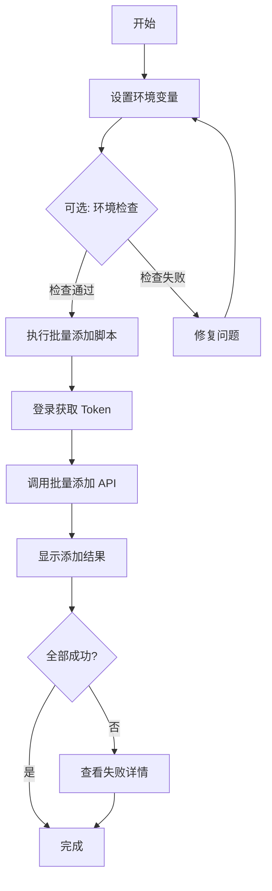

# Tavily API Keys 批量添加脚本开发完成

**日期**: 2026-01-14  
**类型**: 后端工具开发  
**状态**: ✅ 已完成

## 📋 任务概述

开发了一套完整的 Tavily API Keys 批量添加工具，用于快速将 21 个 Tavily API Keys 添加到系统中。

## 🎯 交付成果

### 1. 核心脚本

#### ✅ `backend/scripts/batch_add_tavily_keys.py`

**功能特性**:
- 自动登录获取 JWT Token
- 批量调用管理员 API 添加 Keys
- 详细的日志输出和错误处理
- 支持环境变量和命令行参数配置
- 内置 21 个 Tavily API Keys
- 每个 Key 默认配额 1000

**使用方法**:
```bash
# 方式1: 环境变量
export API_BASE_URL="http://localhost:8000"
export ADMIN_EMAIL="admin@example.com"
export ADMIN_PASSWORD="your_password"
python scripts/batch_add_tavily_keys.py

# 方式2: 命令行参数
python scripts/batch_add_tavily_keys.py \
    --base-url http://localhost:8000 \
    --email admin@example.com \
    --password your_password \
    --plan-limit 1000
```

### 2. 快捷脚本

#### ✅ `backend/scripts/add_tavily_keys.sh`

**功能特性**:
- 简化的 Shell 包装器
- 自动参数验证
- 环境变量支持

**使用方法**:
```bash
export ADMIN_EMAIL="admin@example.com"
export ADMIN_PASSWORD="your_password"
./scripts/add_tavily_keys.sh
```

### 3. 环境检查脚本

#### ✅ `backend/scripts/check_tavily_env.sh`

**检查项**:
1. ✅ 环境变量是否设置
2. ✅ 后端服务是否运行
3. ✅ Python 环境是否正确
4. ✅ Python 依赖是否安装（httpx, structlog）
5. ✅ 管理员凭证是否有效

**使用方法**:
```bash
export ADMIN_EMAIL="admin@example.com"
export ADMIN_PASSWORD="your_password"
./scripts/check_tavily_env.sh
```

### 4. 使用文档

#### ✅ `backend/scripts/README_TAVILY_KEYS.md`

**包含内容**:
- 📖 快速开始指南
- 🔧 配置说明
- 📊 输出示例
- 🛠️ 前置条件
- ⚠️ 注意事项
- 🔍 故障排查
- 🎯 高级用法

## 📝 技术实现

### API 接口

使用的后端 API：
```
POST /api/v1/admin/tavily-keys/batch
```

**请求格式**:
```json
{
  "keys": [
    {
      "api_key": "tvly-dev-xxx",
      "plan_limit": 1000
    }
  ]
}
```

**响应格式**:
```json
{
  "success": true,
  "data": {
    "success": 21,
    "failed": 0,
    "errors": []
  }
}
```

### 认证流程

1. **登录获取 Token**:
   ```
   POST /api/v1/auth/login
   ```

2. **使用 Token 调用管理员接口**:
   ```
   Authorization: Bearer <token>
   ```

### 内置 Keys 列表

脚本中包含 21 个 Tavily API Keys：
- `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`
- `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`
- ... (共 21 个)

## 🔍 执行流程



## 📊 输出示例

### 成功执行

```bash
============================================================
步骤 1: 登录
============================================================
开始登录 email=admin@example.com
登录成功

============================================================
步骤 2: 批量添加 Tavily Keys
============================================================
待添加 Keys 数量: 21
每个 Key 配额: 1000

开始批量添加 Tavily Keys count=21 plan_limit=1000
批量添加完成 success=21 failed=0

============================================================
添加结果
============================================================
✅ 成功: 21
❌ 失败: 0
============================================================
所有 Keys 添加成功！
```

### 部分失败（Key 已存在）

```bash
============================================================
添加结果
============================================================
✅ 成功: 15
❌ 失败: 6

失败详情:
  - tvly-dev-xxx...: API Key already exists
  - tvly-dev-yyy...: API Key already exists
============================================================
部分 Keys 添加失败 (6/21)
```

## ⚙️ 配置说明

### 环境变量

| 变量名 | 必填 | 默认值 | 说明 |
|--------|------|--------|------|
| `API_BASE_URL` | ❌ | `http://localhost:8000` | 后端 API 地址 |
| `ADMIN_EMAIL` | ✅ | 无 | 超级管理员邮箱 |
| `ADMIN_PASSWORD` | ✅ | 无 | 超级管理员密码 |
| `PLAN_LIMIT` | ❌ | `1000` | 每个 Key 的配额限制 |

### 命令行参数

Python 脚本支持以下参数：
- `--base-url`: API 基础 URL
- `--email`: 管理员邮箱
- `--password`: 管理员密码
- `--plan-limit`: 配额限制

## 🛠️ 前置条件

### 1. 超级管理员账户

需要先创建超级管理员：
```bash
python scripts/create_superuser.py
```

### 2. 后端服务运行

```bash
uvicorn app.main:app --reload --host 0.0.0.0 --port 8000
```

### 3. Python 依赖

```bash
pip install httpx structlog
```

## ⚠️ 注意事项

1. **重复添加**: 已存在的 Key 会被跳过（不是错误）
2. **权限要求**: 必须使用超级管理员账户
3. **安全性**: 不要在代码中硬编码密码
4. **配额管理**: 默认每个 Key 配额为 1000，可通过参数调整

## 🔧 故障排查

### 常见问题

| 问题 | 错误信息 | 解决方案 |
|------|----------|----------|
| 登录失败 | `LOGIN_BAD_CREDENTIALS` | 检查邮箱密码是否正确 |
| 权限不足 | `HTTP 403 Forbidden` | 确认账户是否为超级管理员 |
| 连接失败 | `httpx.ConnectError` | 检查后端服务是否运行 |
| Key 已存在 | `API Key already exists` | 正常，跳过即可 |

## 📚 相关文档

- [README_TAVILY_KEYS.md](../backend/scripts/README_TAVILY_KEYS.md) - 详细使用文档
- [管理员 API](../backend/app/api/v1/endpoints/admin/admin.py) - API 实现
- [Tavily Key Service](../backend/app/services/admin/tavily_key_service.py) - 业务逻辑

## ✅ 验证清单

- [x] Python 脚本开发完成
- [x] Shell 快捷脚本完成
- [x] 环境检查脚本完成
- [x] 使用文档编写完成
- [x] 脚本添加执行权限
- [x] 代码无 Lint 错误
- [x] 支持环境变量配置
- [x] 支持命令行参数配置
- [x] 包含详细错误处理
- [x] 输出格式友好清晰

## 🎉 总结

成功开发了一套完整的 Tavily API Keys 批量添加工具链，包括：
- ✅ 核心 Python 脚本（功能完整）
- ✅ Shell 快捷脚本（使用简单）
- ✅ 环境检查脚本（预防问题）
- ✅ 详细使用文档（易于理解）

用户现在可以通过简单的命令快速将 21 个 Tavily API Keys 批量添加到系统中，大大提高了运维效率。

