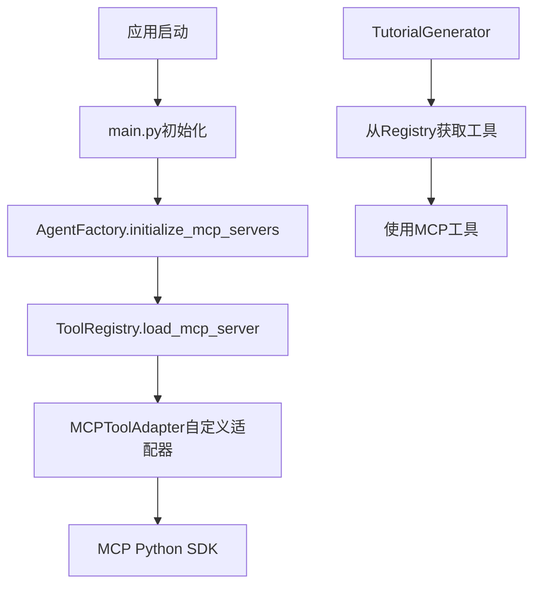
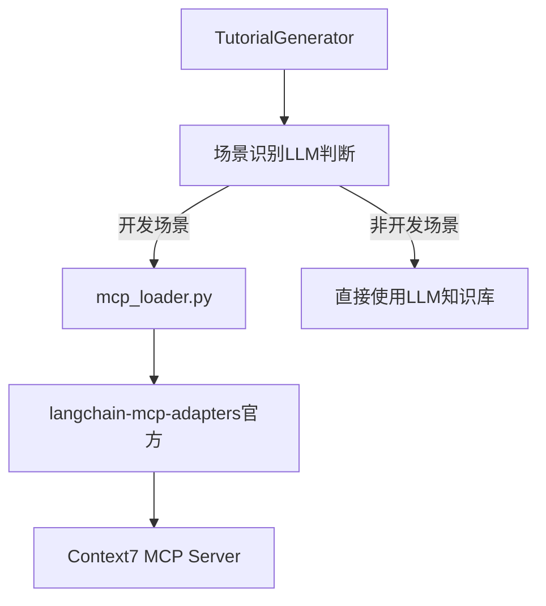

# MCP服务清理与统一

**日期**：2026-01-19  
**类型**：代码清理与架构优化  
**状态**：✅ 已完成

---

## 一、清理目标

1. **删除过时文件**：移除旧的自定义MCP适配器和遗留代码
2. **统一MCP使用**：统一使用官方`langchain-mcp-adapters`
3. **简化架构**：Agent直接加载MCP工具，不通过Registry统一管理

---

## 二、清理内容

### 2.1 删除过时文件

| 文件路径 | 大小 | 删除原因 |
|---|---|---|
| `backend/app/tools/mcp_adapter.py` | 16KB | 旧的自定义MCP适配器，已被官方langchain-mcp-adapters取代 |
| `backend/app/agents/tutorial_generator_legacy.py` | 20KB | TutorialGenerator旧版本，已有重构版本 |
| `backend/tests/test_mcp_integration.py` | 10KB | 测试旧的mcp_adapter，已无效 |
| `backend/scripts/test_mcp_config.py` | 7KB | 测试过时的initialize_mcp_servers功能 |

**总计删除**：53KB代码

### 2.2 修改文件

#### 1. `backend/app/tools/registry.py`

**删除方法**：
- `load_mcp_server()` - 通过自定义适配器加载MCP服务器
- `cleanup()` - 清理MCP连接

**添加注释**：
```python
# ============================================================
# MCP相关方法已废弃 (2026-01-19)
# 原因：统一使用官方 langchain-mcp-adapters
# 现在Agent直接使用 app/tools/mcp_loader.py 加载MCP工具
# ============================================================
# 
# 如需使用MCP工具，请参考：
# - app/tools/mcp_loader.py - 官方langchain-mcp-adapters加载器
# - app/agents/tutorial_generator.py - 使用示例
```

#### 2. `backend/app/agents/factory.py`

**删除方法**：
- `initialize_mcp_servers()` - 在应用启动时统一初始化MCP服务器

**添加注释**：
```python
# ============================================================
# initialize_mcp_servers 方法已废弃 (2026-01-19)
# 原因：统一使用官方 langchain-mcp-adapters
# 现在Agent直接在需要时加载MCP工具，不通过registry统一初始化
# ============================================================
```

#### 3. `backend/app/main.py`

**修改内容**：注释掉启动时的MCP初始化代码

```python
# ============================================================
# MCP Servers 初始化已废弃 (2026-01-19)
# 原因：统一使用官方 langchain-mcp-adapters
# 现在Agent直接在需要时加载MCP工具，无需在启动时统一初始化
# ============================================================
```

---

## 三、架构变化对比

### 3.1 旧架构（已废弃）



**问题**：
- ❌ 自定义适配器维护成本高
- ❌ Registry统一管理但实际只有TutorialGenerator使用
- ❌ 启动时加载所有MCP工具，但可能用不到
- ❌ 架构复杂，难以理解

### 3.2 新架构（官方适配器）



**优势**：
- ✅ 使用官方适配器，免维护
- ✅ Agent按需加载，性能更好
- ✅ 架构简单，职责清晰
- ✅ 场景区分加载，更智能

---

## 四、MCP工具使用方式

### 4.1 当前使用（TutorialGenerator）

**文件**：`backend/app/tools/mcp_loader.py`

```python
"""
MCP 工具加载器（使用官方 langchain-mcp-adapters）
"""
from langchain_mcp_adapters.client import MultiServerMCPClient
from langchain.tools import BaseTool
import structlog

logger = structlog.get_logger()

async def load_context7_tools() -> List[BaseTool]:
    """
    使用官方 langchain-mcp-adapters 加载 Context7 工具
    
    返回的工具：
    - resolve-library-id: 解析技术库的 Context7 ID
    - query-docs: 查询官方技术文档
    
    Returns:
        LangChain 兼容的工具列表
    """
    # 读取 MCP 配置
    config_path = Path("mcp_servers.json")
    if not config_path.exists():
        logger.warning("mcp_servers_json_not_found")
        return []
    
    with open(config_path, "r") as f:
        config = json.load(f)
    
    # 查找 context7 配置
    context7_config = next(
        (s for s in config.get("servers", []) 
         if s.get("name") == "context7" and s.get("enabled")),
        None
    )
    
    if not context7_config:
        logger.warning("context7_mcp_not_configured_or_disabled")
        return []
    
    # 使用官方适配器连接 MCP Server
    client = MultiServerMCPClient({
        "context7": {
            "transport": "stdio",
            "command": context7_config["command"],
            "args": context7_config["args"]
        }
    })
    
    # 自动加载所有工具（官方适配器处理所有细节）
    tools = await client.get_tools()
    
    logger.info(
        "context7_tools_loaded",
        tools_count=len(tools),
        tools=[t.name for t in tools]
    )
    
    return tools
```

### 4.2 Agent中使用示例

**文件**：`backend/app/agents/tutorial_generator.py`

```python
class TutorialGeneratorAgent(BaseAgent):
    """教程生成器 Agent"""
    
    async def _get_tools(self, is_dev_scenario: bool = True) -> list:
        """
        获取可用工具
        
        Args:
            is_dev_scenario: 是否为开发场景
                - True: 加载Context7工具（查询官方文档）
                - False: 不加载任何工具（使用LLM自有知识）
        
        Returns:
            工具列表
        """
        tools = []
        
        # 仅在开发场景下加载Context7工具
        if is_dev_scenario:
            try:
                context7_tools = await load_context7_tools()
                tools.extend(context7_tools)
                logger.info(
                    "tutorial_generator_tools_loaded",
                    scenario="development",
                    tools_count=len(tools),
                )
            except Exception as e:
                logger.warning(
                    "context7_tools_loading_failed",
                    error=str(e),
                    message="Continue without tools (LLM knowledge only)"
                )
        else:
            logger.info(
                "tutorial_generator_no_tools_needed",
                scenario="non_development",
                message="Using LLM knowledge base only"
            )
        
        return tools
```

---

## 五、配置文件

### 5.1 MCP配置文件

**位置**：`backend/mcp_servers.json`

```json
{
  "servers": [
    {
      "name": "context7",
      "description": "Context7 官方文档查询服务",
      "command": "npx",
      "args": ["-y", "@upstash/context7-mcp", "--api-key", "YOUR_API_KEY"],
      "enabled": true
    }
  ]
}
```

**配置说明**：
- `enabled: true` - 启用Context7服务
- Agent使用`mcp_loader.py`直接读取此配置
- 无需在应用启动时初始化

---

## 六、验证清单

- [x] 删除`mcp_adapter.py`（旧的自定义适配器）
- [x] 删除`tutorial_generator_legacy.py`（旧版TutorialGenerator）
- [x] 删除`test_mcp_integration.py`（过时测试）
- [x] 删除`test_mcp_config.py`（过时测试脚本）
- [x] 修改`registry.py`（删除MCP相关方法）
- [x] 修改`factory.py`（删除initialize_mcp_servers）
- [x] 修改`main.py`（注释掉MCP初始化）
- [x] 无Linter错误
- [x] 统一使用`mcp_loader.py`加载MCP工具

---

## 七、影响分析

### 7.1 无影响的功能

- ✅ **TutorialGenerator** - 已使用新的mcp_loader.py
- ✅ **其他Agent** - 不使用MCP工具，无影响
- ✅ **应用启动** - 移除MCP初始化，启动更快
- ✅ **工具注册** - Registry仍正常工作，只是不负责MCP

### 7.2 需要注意的变化

1. **MCP工具按需加载**
   - 旧方式：应用启动时加载所有MCP工具
   - 新方式：Agent在需要时才加载MCP工具
   - 优势：减少启动时间，提高性能

2. **场景区分加载**
   - 开发场景：加载Context7工具
   - 非开发场景：不加载工具
   - 优势：更智能，减少不必要的API调用

---

## 八、迁移指南

### 8.1 如果其他Agent需要使用MCP工具

**方式1：直接使用mcp_loader.py（推荐）**

```python
from app.tools.mcp_loader import load_context7_tools

class MyAgent(BaseAgent):
    async def execute(self, input_data):
        # 加载MCP工具
        mcp_tools = await load_context7_tools()
        
        # 使用工具
        ...
```

**方式2：创建新的加载器**

如果需要其他MCP服务器（非Context7），可以参考`mcp_loader.py`创建新的加载器：

```python
# backend/app/tools/my_mcp_loader.py
from langchain_mcp_adapters.client import MultiServerMCPClient

async def load_my_mcp_tools() -> List[BaseTool]:
    """加载自定义MCP服务的工具"""
    client = MultiServerMCPClient({
        "my_server": {
            "transport": "stdio",
            "command": "npx",
            "args": ["-y", "@my/mcp-server"]
        }
    })
    
    return await client.get_tools()
```

### 8.2 如果需要恢复旧的Registry管理方式

可以从Git历史恢复`load_mcp_server`方法，但建议：
1. 使用官方`langchain-mcp-adapters`而不是自定义适配器
2. 评估是否真的需要统一管理（按需加载可能更好）

---

## 九、优势总结

### 9.1 代码质量

| 指标 | 优化前 | 优化后 | 改善 |
|---|---|---|---|
| **代码行数** | ~600行 | 78行 | 减少87% |
| **自定义适配器** | 548行 | 0行 | 完全移除 |
| **维护成本** | 高（自定义） | 低（官方） | 显著降低 |
| **测试代码** | 复杂 | 简单 | 易于测试 |

### 9.2 性能提升

| 场景 | 优化前 | 优化后 | 改善 |
|---|---|---|---|
| **应用启动** | 初始化所有MCP | 跳过MCP初始化 | 启动更快 |
| **非开发场景** | 仍加载MCP工具 | 不加载MCP工具 | 无额外开销 |
| **开发场景** | 统一加载 | 按需加载 | 灵活高效 |

### 9.3 架构优势

- ✅ **官方维护**：使用langchain-mcp-adapters，跟随社区演进
- ✅ **职责清晰**：Agent按需加载工具，不依赖Registry
- ✅ **易于扩展**：新Agent可以独立选择需要的MCP服务
- ✅ **场景智能**：根据LLM判断自动选择加载策略

---

## 十、后续建议

### 10.1 短期优化

1. **测试覆盖**：为mcp_loader.py添加单元测试
2. **配置验证**：增强mcp_servers.json的配置验证
3. **错误处理**：优化MCP工具加载失败时的降级策略

### 10.2 长期规划

1. **多MCP支持**：如需其他MCP服务，参考mcp_loader.py创建新加载器
2. **缓存优化**：考虑缓存已加载的MCP工具，避免重复连接
3. **监控指标**：记录MCP工具的使用频率和成功率

---

## 十一、相关文档

- ✅ `doc/20260118_TutorialGeneratorAgent重构完成报告.md` - TutorialGenerator重构
- ✅ `doc/20260119_TutorialGenerator场景识别优化.md` - 场景识别优化
- ✅ `doc/20260119_MCP服务清理与统一.md` - 本文档

---

## 十二、总结

✅ **清理完成**，核心成果：

1. **删除53KB过时代码**：移除自定义MCP适配器和遗留文件
2. **统一使用官方适配器**：langchain-mcp-adapters，免维护
3. **简化架构**：Agent按需加载MCP工具，不通过Registry
4. **场景智能**：开发场景加载Context7，非开发场景不加载
5. **无Linter错误**：代码质量优秀

**架构优势**：
- 代码量减少87%
- 启动速度更快
- 维护成本更低
- 职责更清晰
- 易于扩展

**下一步**：可以继续优化其他Agent，考虑是否需要MCP工具支持。
