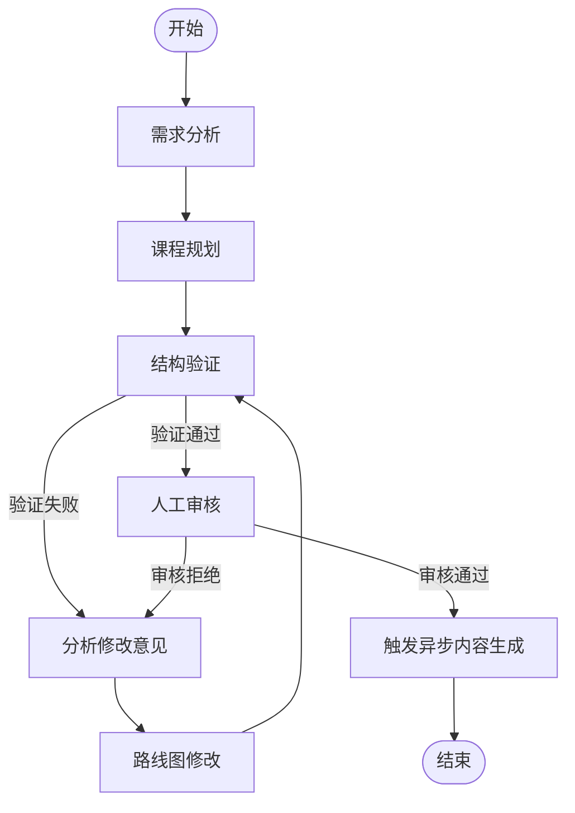
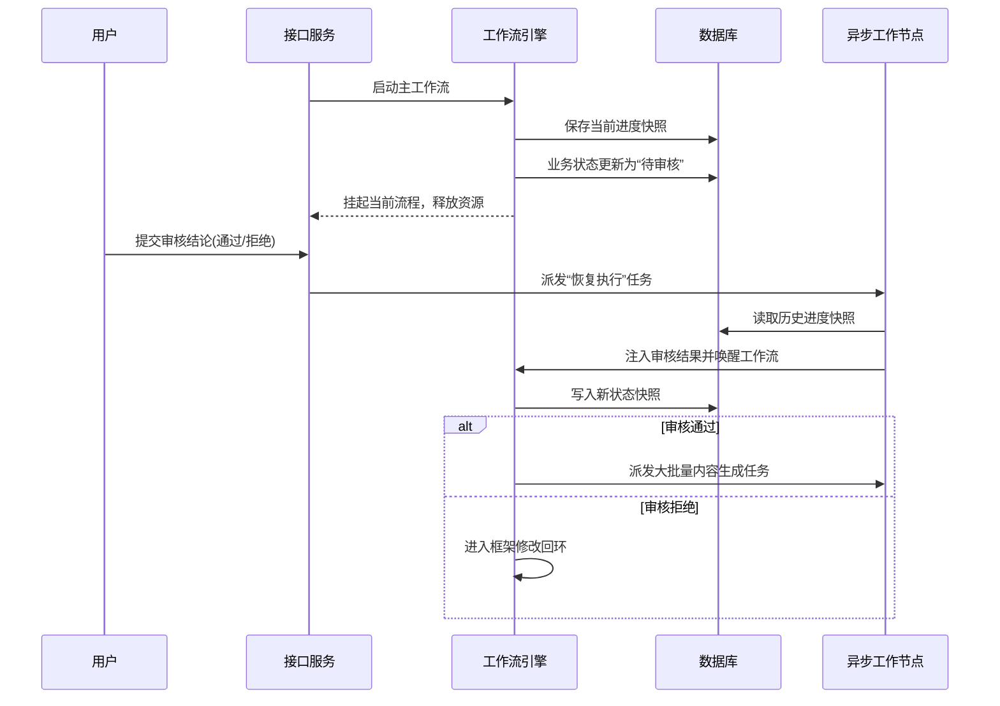
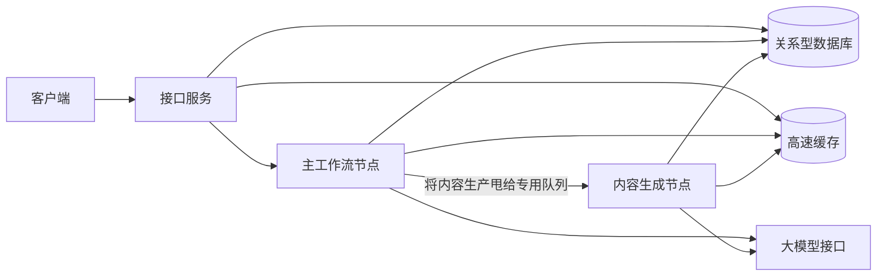
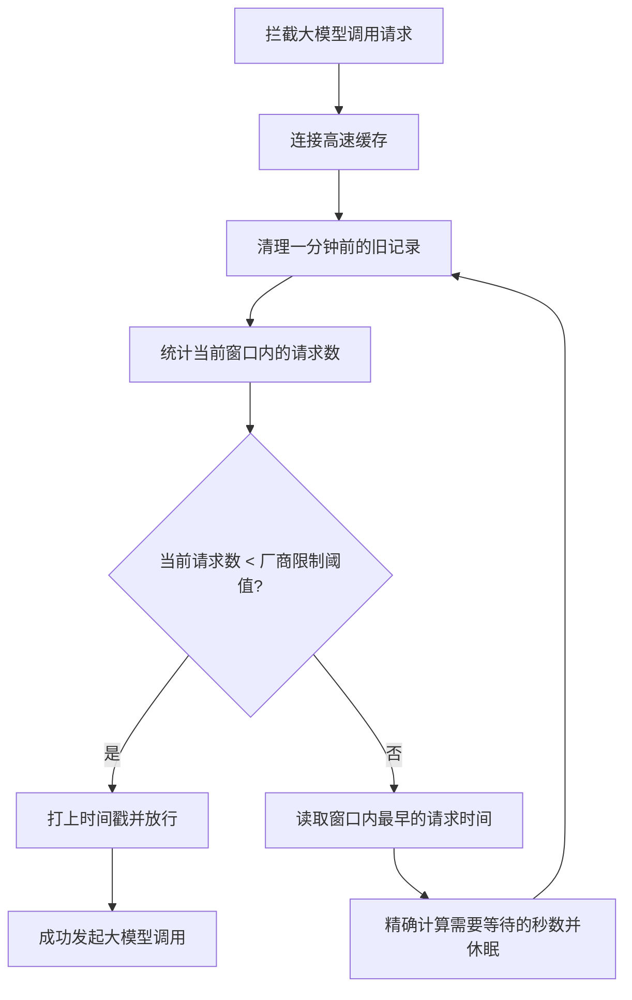

# 别让大模型“包打天下”：多智能体自适应学习平台的硬核架构实战

## 引言：学习平台凭什么“千人一面”？

现如今的在线学习平台，最让人抓狂的往往不是内容太少，而是根本不看人下菜碟。不管你是十年老兵还是编程小白，只要选了同一门课，系统都会把一模一样的流水线丢给你。让前端老手去啃冗长的底层网络协议，让刚入门的新手直接去看源码级拆解，这不叫系统化学习，这叫“按头填鸭”。

为了干翻这种“千人一面”的学习体验，我们做了一个基于多智能体（Multi-Agent）协作的自适应学习平台。它的核心逻辑是：先摸清你的底细和目标，量身定制出一份学习骨架，经过自我检验和人工把关后，再成批生成对应的教程、资料和测验。

表面上看，这是一个“生成个性化路线图”的产品；但扒开引擎盖，它其实是一套具备高并发、可限流、支持断点续传的分布式智能体工作流系统。

今天不扯虚的，直接聊聊我们是怎么把这套多智能体架构在工程上彻底落地的。

---

## 一、大模型不是许愿池：为什么需要多智能体协作？

很多人刚接触 AI 开发时，最喜欢干的事就是“一把梭”：写一个几千字的超级提示词，把需求分析、课程大纲、知识点讲解全塞进去，指望大模型一次性吐出完美结果。

这种做法在真实工程里简直是灾难：
1. **上下文极其拥挤**：提示词长到模型自己都抓不住重点，频繁出现幻觉。
2. **容错率极低**：中间任何一个环节生成劈叉，几万个 Token 的开销瞬间打水漂，只能全部重来。
3. **无法介入干预**：业务上通常需要人类审核大纲，但单一调用根本插不进“人工确认”的环节。

所以，我们的解法是**拆**。通过 LangGraph 工作流引擎，把一个庞大的目标拆解给多个专职的智能体：
- **需求分析智能体**：分析用户的原始输入，评估水平与偏好。
- **课程规划智能体**：设计章节式的路线图框架。
- **结构验证智能体**：交叉检验章节之间的前置依赖是否合理。
- **路线图编辑智能体**：根据验证反馈或人工建议，定向修改框架。
- **教程生成智能体**、**资源推荐智能体**等：在框架敲定后，批量生产具体内容。

术业有专攻，各司其职，这就构成了我们平台的大脑。

---

## 二、工作流编排：让复杂推理变成可控的流水线

把任务拆开后，怎么把它们串起来？我们设计了一套有状态的工作流。

这里最大的亮点，是我们把“人工审核”优雅地融进了工作流里，而不是在外围搞一套丑陋的数据库轮询。当系统生成好课程框架，准备发车生成长篇大论的教程前，工作流会自动**挂起（Suspend）**，保留当前所有状态快照，等待人类点头。

### 工作流全景图

### 挂起与恢复的流转机制

传统业务流一遇到“人工审批”就容易阻塞系统资源。在我们的实现中，挂起操作直接将当前的上下文进度持久化到了关系型数据库（PostgreSQL）中，随后释放内存与计算资源。

当用户在界面上点击“通过”或填写修改意见后，系统再通过异步任务把结果当做“恢复指令”注入回工作流，唤醒历史进度继续往下跑。

---

## 三、高并发工程化：把“脑力活”与“体力活”分开

路线图的生成分为两个截然不同的阶段：
1. **框架规划（脑力活）**：涉及需求分析、大纲设计、反复自我修正。计算密集，节点少，需要强一致的逻辑串联。
2. **内容生产（体力活）**：为大纲中的每一个知识点生成几千字的教程、推荐链接和测验。并发极高，耗时长。

如果把这两件事塞进同一个执行管道，一两个长篇大论的内容生成任务就能把整个系统的队列堵死。

为此，我们果断在架构上进行了**队列隔离**。主工作流负责把大纲敲定；一旦人工审核通过，主工作流直接宣告结束，把庞大的内容生成任务打包丢给独立的异步队列（Celery）。

### 异步隔离架构图

在此基础上，我们将内容生成节点的工作预取系数（Prefetch Multiplier）降到最低。这样能保证各个工作节点“干完一件领一件”，绝不囤积任务，极大提升了系统在高并发下的公平性与响应速度。

---

## 四、限流与断点续传：守住系统的底线

### 4.1 全局滑动窗口限流：别让自家服务打垮自己

当一堆异步节点火力全开去生成内容时，最先崩的往往不是你的服务器，而是大模型厂商的 API 额度（按 IP 每分钟请求数限制）。

如果单纯依靠调低系统并发数，无异于因噎废食。我们在系统中引入了基于高速缓存（Redis）的**全局分布式滑动窗口限流器**。不管你有多少个工作进程，调用大模型前都必须来这扇闸门前“领号”。

它的核心等待逻辑极其朴素且有效：
`需等待秒数 = 最早一条请求的时间戳 + 60秒 - 当前时间戳 + 安全缓冲时间`
这意味着系统绝不粗暴丢弃请求，而是让超载的请求优雅休眠，等配额空出来瞬间无缝补上。这让我们的 API 调用成功率在大并发下依然稳如老狗。

### 4.2 原子级断点续传：从哪里跌倒，从哪里爬起

在涉及几十次 LLM 调用的长链路里，网络抖动或临时超时是家常便饭。如果一个路线图有 50 个知识点，生成到第 49 个时网络断了，从头重来不仅是算力的耻辱，更是真金白银的流失。

我们的系统支持**节点级断点续传**。
- **主工作流层面**：依赖底层快照。系统重启后，会自动找到上一次执行的节点继续跑。
- **内容生成层面**：实施了三级回退策略（内存缓存 -> 进度快照 -> 数据库兜底）。一旦某个知识点的教程生成失败，系统只会重新把这一个特定任务塞回队列重试，已生成的 48 个知识点毫发无损。

配合指数退避算法（`重试间隔 = 基础时间 × 2^重试次数`），系统能够在外部网络剧烈波动时自我保护，平稳度过故障期。

---

## 五、成本与性能优化：好钢用在刀刃上

最后聊聊钱。大模型 API 调用的开销构成很简单：
`单次成本 = (输入Token数 × 提示词单价) + (输出Token数 × 生成词单价)`

在这个公式的指导下，我们做了两件极为抠门但高效的事。

### 5.1 异构模型路由：杀鸡不用牛刀
不是所有的任务都需要当今地表最强的大模型。我们在系统配置里做了严格的模型路由拆分：
- **需求分析、结构检查、资源链接提取**：这类任务逻辑单一、输出确切，我们统一路由给极致便宜、速度极快的小模型（如 `gpt-4o-mini`）。
- **路线大纲规划、长篇教程撰写**：这类任务需要极强的上下文把控和语言组织能力，我们才会请出昂贵的旗舰级模型（如 `Claude 3.5 Sonnet`）。

### 5.2 极致的上下文裁剪
在给各个知识点生成教程时，如果把整个路线图的所有信息都塞进提示词，不仅不仅Token花销巨大，模型也容易被无关信息带偏。

我们开发了一套“裁剪机制”：生成当前知识点时，只把用户的核心目标、本章节的摘要、以及紧邻的前置依赖注进去。把臃肿的全局信息剥离后，提示词的体量大幅压缩，并行任务之间的干扰降到最低，不仅省了钱，生成质量反而变高了。

---

## 结语

如果用一句话总结这个项目，那就是：**我们没有做一个“只要对着它许愿就能吐出学习计划”的壳子，而是搭了一条有纪律、懂分工、会自愈的数字流水线。**

它能把复杂任务拆细，能挂起等待人类决策，能在多并发下保护接口配额，能在出错时只做最小成本的重试。而这，大概就是软件工程在这个 AI 狂飙的时代里，最迷人、也最不可替代的底色。