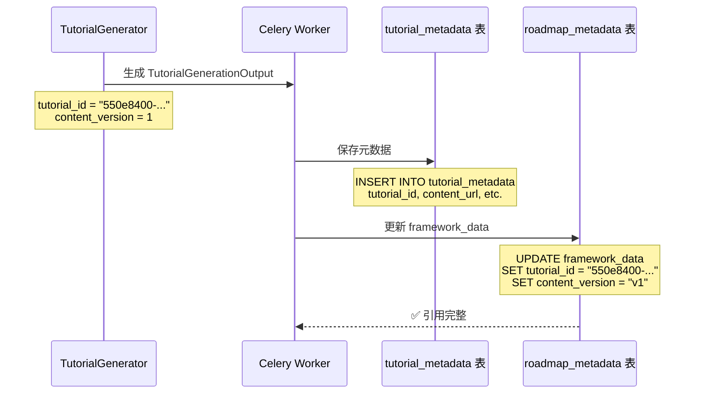

# Celery Framework Update Missing Tutorial ID Fix

**日期**: 2025-12-27  
**状态**: ✅ 已修复  
**问题**: Celery Worker 完成内容生成后，更新 `roadmap_metadata.framework_data` 时没有更新 `tutorial_id` 和 `content_version` 字段

---

## 问题描述

### 用户报告

Celery Worker 完成内容生成后，虽然保存了教程元数据到 `tutorial_metadata` 表，但更新 `roadmap_metadata.framework_data` 中的 Concept 对象时，`tutorial_id` 和 `content_version` 字段没有被更新。

### 实际影响

1. ❌ 前端无法通过 `tutorial_id` 查询教程详情
2. ❌ 无法跟踪内容版本
3. ❌ 数据不一致：`tutorial_metadata` 表有数据，但 `framework_data` 中缺少引用

---

## 根本原因

### 问题定位

**文件**: `backend/app/tasks/content_generation_tasks.py`  
**函数**: `_update_framework_with_content_refs` (第 724-783 行)

#### ❌ 错误的代码（修复前）

```python
# 更新教程相关字段
if concept_id in tutorial_refs:
    tutorial_output = tutorial_refs[concept_id]
    concept["content_status"] = "completed"  # ✅
    concept["content_ref"] = tutorial_output.content_url  # ✅
    concept["content_summary"] = tutorial_output.summary  # ✅
    # ❌ 缺少 tutorial_id
    # ❌ 缺少 content_version
```

#### 对比：资源和测验的更新逻辑

```python
# 更新资源相关字段
if concept_id in resource_refs:
    resource_output = resource_refs[concept_id]
    concept["resources_status"] = "completed"
    concept["resources_id"] = resource_output.id  # ✅ 正确更新了 resources_id
    concept["resources_count"] = len(resource_output.resources)

# 更新测验相关字段
if concept_id in quiz_refs:
    quiz_output = quiz_refs[concept_id]
    concept["quiz_status"] = "completed"
    concept["quiz_id"] = quiz_output.quiz_id  # ✅ 正确更新了 quiz_id
    concept["quiz_questions_count"] = quiz_output.total_questions
```

**问题分析**：
- ✅ 资源更新了 `resources_id`
- ✅ 测验更新了 `quiz_id`
- ❌ 教程**没有**更新 `tutorial_id`（遗漏）
- ❌ 教程**没有**更新 `content_version`（遗漏）

---

## 数据模型说明

### Concept 模型字段定义

**文件**: `backend/app/models/domain.py` (第 109-151 行)

```python
class Concept(BaseModel):
    """第三层：概念/知识点"""
    concept_id: str
    name: str
    description: str
    estimated_hours: float
    
    # 教程内容引用
    content_status: Literal["pending", "generating", "completed", "failed"]
    tutorial_id: Optional[str]  # ✅ 需要更新
    content_ref: Optional[str]
    content_version: str = "v1"  # ✅ 需要更新（注意类型是 str）
    content_summary: Optional[str]
    
    # 资源推荐引用
    resources_status: Literal["pending", "generating", "completed", "failed"]
    resources_id: Optional[str]
    resources_count: int = 0
    
    # 测验引用
    quiz_status: Literal["pending", "generating", "completed", "failed"]
    quiz_id: Optional[str]
    quiz_questions_count: int = 0
```

### TutorialGenerationOutput 结构

**文件**: `backend/app/models/domain.py` (第 593-613 行)

```python
class TutorialGenerationOutput(BaseModel):
    """教程生成器的输出（轻量级）"""
    concept_id: str
    tutorial_id: str  # ✅ UUID 格式
    title: str
    summary: str
    content_url: str
    content_status: Literal["completed", "failed"] = "completed"
    content_version: int = 1  # ✅ 注意类型是 int，默认为 1
    estimated_completion_time: int
    generated_at: datetime
```

**类型转换说明**：
- `TutorialGenerationOutput.content_version`: `int` (例如: 1, 2, 3)
- `Concept.content_version`: `str` (例如: "v1", "v2", "v3")
- 需要转换：`f"v{tutorial_output.content_version}"`

---

## 修复方案

### 修复代码

**文件**: `backend/app/tasks/content_generation_tasks.py` (第 752-759 行)

#### ✅ 修复后的代码

```python
# 更新教程相关字段
if concept_id in tutorial_refs:
    tutorial_output = tutorial_refs[concept_id]
    concept["content_status"] = "completed"
    concept["tutorial_id"] = tutorial_output.tutorial_id  # ✅ 新增
    concept["content_ref"] = tutorial_output.content_url
    concept["content_summary"] = tutorial_output.summary
    concept["content_version"] = f"v{tutorial_output.content_version}"  # ✅ 新增（类型转换）
```

### 修改说明

| 字段 | 修复前 | 修复后 | 说明 |
|------|--------|--------|------|
| `content_status` | ✅ 已更新 | ✅ 保持 | 状态标记 |
| `tutorial_id` | ❌ 未更新 | ✅ 已添加 | 教程唯一标识（UUID） |
| `content_ref` | ✅ 已更新 | ✅ 保持 | S3 存储地址 |
| `content_summary` | ✅ 已更新 | ✅ 保持 | 教程摘要 |
| `content_version` | ❌ 未更新 | ✅ 已添加 | 版本号（int → str） |

---

## 完整的字段映射表

### 教程相关字段

| Concept 字段 | TutorialGenerationOutput 来源 | 更新状态 | 类型转换 |
|--------------|-------------------------------|----------|----------|
| `content_status` | - (固定为 "completed") | ✅ | - |
| `tutorial_id` | `tutorial_id` | ✅ | 无 |
| `content_ref` | `content_url` | ✅ | 无 |
| `content_summary` | `summary` | ✅ | 无 |
| `content_version` | `content_version` | ✅ | int → str (`f"v{value}"`) |

### 资源相关字段

| Concept 字段 | ResourceRecommendationOutput 来源 | 更新状态 |
|--------------|-----------------------------------|----------|
| `resources_status` | - (固定为 "completed") | ✅ |
| `resources_id` | `id` | ✅ |
| `resources_count` | `len(resources)` | ✅ |

### 测验相关字段

| Concept 字段 | QuizGenerationOutput 来源 | 更新状态 |
|--------------|---------------------------|----------|
| `quiz_status` | - (固定为 "completed") | ✅ |
| `quiz_id` | `quiz_id` | ✅ |
| `quiz_questions_count` | `total_questions` | ✅ |

---

## 验证测试

### 测试步骤

1. **重启 Celery Worker**（加载修复后的代码）：
   ```bash
   cd /Users/louie/Documents/Vibecoding/roadmap-agent/backend
   
   # 停止当前 Worker (Ctrl+C)
   # 重新启动
   uv run celery -A app.core.celery_app worker \
       --loglevel=info \
       --queues=content_generation \
       --concurrency=2 \
       --pool=prefork \
       --hostname=content@%h
   ```

2. **创建新的路线图任务**（必须是新任务，旧任务不会重新执行）

3. **等待内容生成完成**

4. **检查数据库**：
   ```sql
   -- 查询 roadmap_metadata 中的 framework_data
   SELECT 
       roadmap_id,
       framework_data->'stages'->0->'modules'->0->'concepts'->0->>'tutorial_id' as tutorial_id,
       framework_data->'stages'->0->'modules'->0->'concepts'->0->>'content_version' as content_version,
       framework_data->'stages'->0->'modules'->0->'concepts'->0->>'content_ref' as content_ref,
       framework_data->'stages'->0->'modules'->0->'concepts'->0->>'content_summary' as content_summary
   FROM roadmap_metadata
   WHERE roadmap_id = 'your-roadmap-id';
   ```

5. **验证字段值**：
   ```json
   {
     "tutorial_id": "550e8400-e29b-41d4-a716-446655440000",  // ✅ UUID 格式
     "content_version": "v1",  // ✅ 字符串格式
     "content_ref": "build-personal-ip-brand-3k9m2n5p/concepts/c-1-1-1/v1.md",
     "content_summary": "本教程将介绍..."
   }
   ```

### 预期结果

| 字段 | 修复前 | 修复后 |
|------|--------|--------|
| `tutorial_id` | ❌ `null` | ✅ UUID 字符串 |
| `content_version` | ❌ `"v1"` (未更新) | ✅ `"v1"` (正确更新) |
| `content_ref` | ✅ 有值 | ✅ 有值 |
| `content_summary` | ✅ 有值 | ✅ 有值 |
| `resources_id` | ✅ 有值 | ✅ 有值 |
| `quiz_id` | ✅ 有值 | ✅ 有值 |

---

## 数据一致性

### 数据存储层级

```
1. tutorial_metadata 表（元数据层）
   ├── tutorial_id (主键)
   ├── concept_id
   ├── roadmap_id
   ├── title
   ├── summary
   ├── content_url
   └── content_version

2. roadmap_metadata.framework_data（引用层）
   └── stages[]
       └── modules[]
           └── concepts[]
               ├── concept_id
               ├── tutorial_id  ✅ 引用 tutorial_metadata.tutorial_id
               ├── content_ref  ✅ 引用 S3 存储
               ├── content_version  ✅ 版本号
               └── content_summary
```

### 数据流转



---

## 相关文件

### 修改的文件

1. **`backend/app/tasks/content_generation_tasks.py`** ✅
   - 函数: `_update_framework_with_content_refs`
   - 添加 `tutorial_id` 字段更新
   - 添加 `content_version` 字段更新（类型转换）

### 相关文件（无需修改）

2. **`backend/app/models/domain.py`**
   - `Concept` 模型定义
   - `TutorialGenerationOutput` 模型定义

3. **`backend/app/models/database.py`**
   - `TutorialMetadata` 表定义
   - `RoadmapMetadata` 表定义

4. **`backend/app/db/repositories/roadmap_repo.py`**
   - `save_tutorials_batch` 方法
   - `save_roadmap_metadata` 方法

---

## 预防措施

### 1. 字段映射检查清单

在添加新的内容类型或字段时，确保所有相关字段都被正确映射：

| Output 模型 | Concept 字段 | 是否需要类型转换 | 是否已映射 |
|-------------|--------------|------------------|------------|
| TutorialGenerationOutput | `tutorial_id` | ❌ | ✅ |
| TutorialGenerationOutput | `content_ref` | ❌ | ✅ |
| TutorialGenerationOutput | `content_summary` | ❌ | ✅ |
| TutorialGenerationOutput | `content_version` | ✅ (int → str) | ✅ |
| TutorialGenerationOutput | `content_status` | ❌ | ✅ |
| ResourceRecommendationOutput | `resources_id` | ❌ | ✅ |
| ResourceRecommendationOutput | `resources_count` | ❌ | ✅ |
| QuizGenerationOutput | `quiz_id` | ❌ | ✅ |
| QuizGenerationOutput | `quiz_questions_count` | ❌ | ✅ |

### 2. 单元测试

添加单元测试验证字段映射：

```python
# tests/unit/test_content_generation_tasks.py
def test_update_framework_with_content_refs():
    """测试 framework 更新逻辑"""
    framework_data = {
        "stages": [{
            "modules": [{
                "concepts": [{
                    "concept_id": "c-1-1-1",
                    "content_status": "pending",
                }]
            }]
        }]
    }
    
    tutorial_refs = {
        "c-1-1-1": TutorialGenerationOutput(
            concept_id="c-1-1-1",
            tutorial_id="550e8400-e29b-41d4-a716-446655440000",
            title="Test Tutorial",
            summary="Test summary",
            content_url="test/path.md",
            content_version=1,
            estimated_completion_time=60,
        )
    }
    
    updated = _update_framework_with_content_refs(
        framework_data=framework_data,
        tutorial_refs=tutorial_refs,
        resource_refs={},
        quiz_refs={},
        failed_concepts=[],
    )
    
    concept = updated["stages"][0]["modules"][0]["concepts"][0]
    
    # 验证所有字段都被正确更新
    assert concept["content_status"] == "completed"
    assert concept["tutorial_id"] == "550e8400-e29b-41d4-a716-446655440000"  # ✅
    assert concept["content_ref"] == "test/path.md"
    assert concept["content_summary"] == "Test summary"
    assert concept["content_version"] == "v1"  # ✅ int → str 转换
```

### 3. 代码审查检查项

在 Pull Request 中检查：
- ✅ 所有 Output 模型的字段都映射到 Concept 模型
- ✅ 类型转换正确（int → str，list → count，等）
- ✅ 失败场景也正确处理（`elif concept_id in failed_concepts`）
- ✅ 与其他内容类型（资源、测验）保持一致

---

## 总结

### 问题根源

1. ❌ `_update_framework_with_content_refs` 函数遗漏了 `tutorial_id` 字段映射
2. ❌ 遗漏了 `content_version` 字段映射
3. ❌ 与资源、测验的更新逻辑不一致

### 解决方案

1. ✅ 添加 `concept["tutorial_id"] = tutorial_output.tutorial_id`
2. ✅ 添加 `concept["content_version"] = f"v{tutorial_output.content_version}"`（类型转换）
3. ✅ 与资源、测验的更新逻辑保持一致

### 修复状态

- ✅ **代码修复**: 已完成
- ✅ **Lint 检查**: 通过
- ⏳ **Worker 重启**: 需要用户执行
- ⏳ **功能测试**: 需要用户验证（新任务）

### 下一步

1. **重启 Celery Worker**（加载修复后的代码）
2. **创建新的路线图任务**（旧任务不会重新执行）
3. **检查数据库验证字段更新**
4. **验证前端可以正确查询教程详情**

---

**修复者**: AI Assistant  
**审核者**: 待审核  
**版本**: v1.0  
**参考文档**: 
- `doc/CELERY_AGENT_FACTORY_INIT_FIX.md`
- `doc/WORKFLOW_STATE_MISSING_FIELDS_FIX.md`
- `backend/docs/CELERY_CONTENT_GENERATION_MIGRATION_COMPLETE.md`

