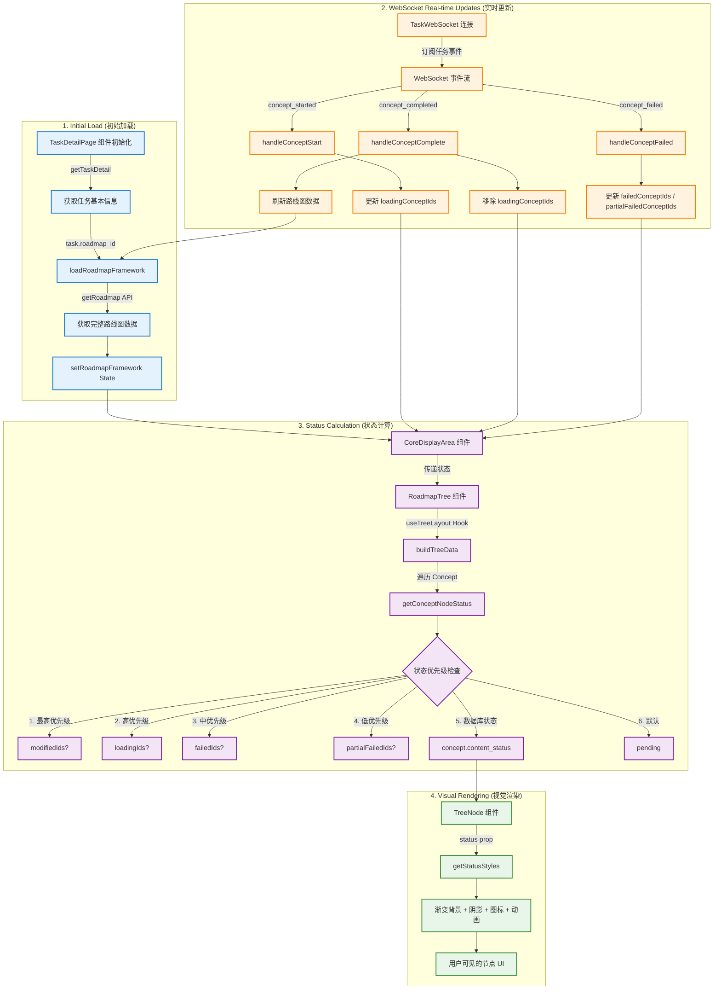
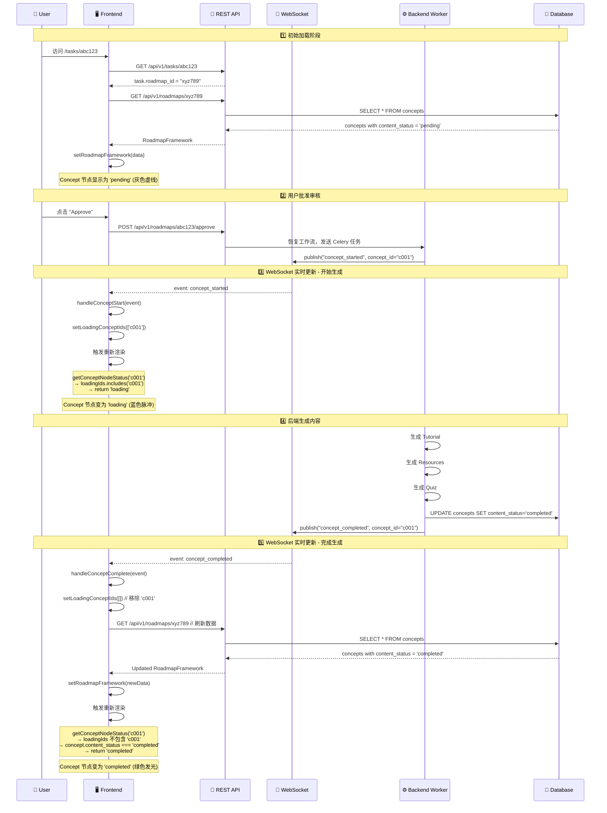

# Concept 节点状态数据流详解

**日期**: 2025-12-27  
**版本**: v1.0  
**适用场景**: 任务详情页面路线图树状图中的 Concept 节点状态管理

---

## 概述

在任务详情页面（`/tasks/[taskId]`）中，Concept 节点的状态通过以下数据流获取和更新：

1. **初始加载**: 从 REST API 获取路线图数据
2. **实时更新**: 通过 WebSocket 监听内容生成事件
3. **状态计算**: 基于多个数据源计算最终节点状态
4. **视觉渲染**: TreeNode 组件根据状态显示不同 UI

---

## 完整数据流架构



---

## 详细步骤解析

### 第一阶段：初始加载 (Initial Load)

#### 1.1 组件初始化

**文件**: `frontend-next/app/(app)/tasks/[taskId]/page.tsx`

```typescript
export default function TaskDetailPage() {
  const taskId = params?.taskId as string;
  
  // 状态管理：四个关键 ID 列表
  const [modifiedNodeIds, setModifiedNodeIds] = useState<string[]>([]);       // 已修改
  const [loadingConceptIds, setLoadingConceptIds] = useState<string[]>([]);   // 加载中
  const [failedConceptIds, setFailedConceptIds] = useState<string[]>([]);     // 失败
  const [partialFailedConceptIds, setPartialFailedConceptIds] = useState<string[]>([]); // 部分失败
  
  const [roadmapFramework, setRoadmapFramework] = useState<RoadmapFramework | null>(null);
}
```

#### 1.2 加载路线图数据

```typescript
const loadRoadmapFramework = useCallback(async (roadmapId: string) => {
  try {
    // 调用 REST API 获取完整路线图数据
    const roadmapData = await getRoadmap(roadmapId);
    if (roadmapData) {
      setRoadmapFramework(roadmapData);
    }
  } catch (err) {
    console.error('Failed to load roadmap framework:', err);
  }
}, []);
```

**API 调用**: `GET /api/v1/roadmaps/{roadmap_id}`

**返回数据结构**:
```typescript
interface RoadmapFramework {
  roadmap_id: string;
  title: string;
  stages: Stage[];  // 包含 Module → Concept 层级结构
}

interface Concept {
  concept_id: string;
  name: string;
  content_status: 'pending' | 'generating' | 'completed' | 'failed';
  resources_status: 'pending' | 'generating' | 'completed' | 'failed';
  quiz_status: 'pending' | 'generating' | 'completed' | 'failed';
}
```

---

### 第二阶段：实时更新 (WebSocket Events)

#### 2.1 WebSocket 连接建立

**文件**: `frontend-next/app/(app)/tasks/[taskId]/page.tsx` (第 344-724 行)

```typescript
useEffect(() => {
  if (!taskId || !taskInfo) return;
  
  // 只有正在处理中的任务才需要 WebSocket
  const isActiveTask = 
    taskInfo.status === 'processing' || 
    taskInfo.status === 'pending' ||
    taskInfo.status === 'human_review_pending';
  
  if (!isActiveTask) return;
  
  // 创建 WebSocket 连接
  const websocket = new TaskWebSocket(taskId);
  
  // 注册事件处理器
  websocket.on('concept_started', handleConceptStart);
  websocket.on('concept_completed', handleConceptComplete);
  websocket.on('concept_failed', handleConceptFailed);
  
  websocket.connect();
  setWs(websocket);
  
  return () => websocket.disconnect();
}, [taskId, taskInfo]);
```

#### 2.2 事件处理器：Concept 开始生成

**触发时机**: 后端 Celery Worker 开始为某个 Concept 生成内容

```typescript
const handleConceptStart = (event: any) => {
  console.log('[TaskDetail] Concept start:', event);
  
  // ✅ 关键操作：将 concept_id 添加到加载列表
  setLoadingConceptIds(prev => [...prev, event.concept_id]);
  
  // 添加日志
  const newLog: ExecutionLog = {
    id: `ws-concept-start-${Date.now()}`,
    level: 'info',
    step: 'content_generation',
    message: `Started generating content for: ${event.concept_name}`,
    details: event,
    created_at: new Date().toISOString(),
  };
  setExecutionLogs(prev => [...prev, newLog]);
};
```

**WebSocket 事件数据结构**:
```json
{
  "event": "concept_started",
  "concept_id": "uuid-xxx",
  "concept_name": "React Hooks",
  "stage_name": "Advanced React",
  "module_name": "React Fundamentals"
}
```

#### 2.3 事件处理器：Concept 完成生成

**触发时机**: 后端成功生成 Tutorial、Resources、Quiz

```typescript
const handleConceptComplete = async (event: any) => {
  console.log('[TaskDetail] Concept complete:', event);
  
  // ✅ 关键操作 1：从加载列表中移除
  setLoadingConceptIds(prev => prev.filter(id => id !== event.concept_id));
  
  // ✅ 关键操作 2：刷新路线图数据（获取最新的 content_status）
  const currentRoadmapId = roadmapIdRef.current;
  if (currentRoadmapId) {
    try {
      await loadRoadmapFramework(currentRoadmapId);
    } catch (err) {
      console.error('Failed to refresh roadmap:', err);
    }
  }
  
  // 添加日志
  setExecutionLogs(prev => [...prev, newLog]);
};
```

**为什么需要刷新路线图？**
- WebSocket 事件只通知"完成"，不包含详细状态
- 需要重新调用 `getRoadmap` API 获取更新后的 `content_status`、`resources_status`、`quiz_status`
- 这样 TreeNode 才能从 `loading` 变为 `completed`

#### 2.4 事件处理器：Concept 生成失败

**触发时机**: 后端生成失败或部分失败

```typescript
const handleConceptFailed = async (event: any) => {
  console.log('[TaskDetail] Concept failed:', event);
  
  // ✅ 关键操作 1：从加载列表中移除
  setLoadingConceptIds(prev => prev.filter(id => id !== event.concept_id));
  
  // ✅ 关键操作 2：根据失败类型添加到对应列表
  const isPartialFailure = event.partial_failure === true;
  
  if (isPartialFailure) {
    // 部分失败：Tutorial、Resources、Quiz 至少一个成功
    setPartialFailedConceptIds(prev => {
      if (!prev.includes(event.concept_id)) {
        return [...prev, event.concept_id];
      }
      return prev;
    });
  } else {
    // 完全失败：全部失败
    setFailedConceptIds(prev => {
      if (!prev.includes(event.concept_id)) {
        return [...prev, event.concept_id];
      }
      return prev;
    });
  }
  
  // 添加错误日志
  const newLog: ExecutionLog = {
    level: isPartialFailure ? 'warning' : 'error',
    message: `Failed: ${event.concept_name}`,
    details: event,
  };
  setExecutionLogs(prev => [...prev, newLog]);
  
  // ✅ 关键操作 3：刷新路线图数据
  const currentRoadmapId = roadmapIdRef.current;
  if (currentRoadmapId) {
    await loadRoadmapFramework(currentRoadmapId);
  }
};
```

---

### 第三阶段：状态计算 (Status Calculation)

#### 3.1 状态传递到 CoreDisplayArea

**文件**: `frontend-next/app/(app)/tasks/[taskId]/page.tsx` (第 912-927 行)

```typescript
<CoreDisplayArea
  currentStep={taskInfo.current_step}
  status={taskInfo.status}
  taskId={taskId}
  roadmapId={taskInfo.roadmap_id}
  roadmapFramework={roadmapFramework}
  
  // ✅ 传递四个状态 ID 列表
  modifiedNodeIds={modifiedNodeIds}
  loadingConceptIds={loadingConceptIds}
  failedConceptIds={failedConceptIds}
  partialFailedConceptIds={partialFailedConceptIds}
  
  userPreferences={userPreferences}
  onRetrySuccess={handleRetrySuccess}
/>
```

#### 3.2 CoreDisplayArea 传递到 RoadmapTree

**文件**: `frontend-next/components/task/core-display-area.tsx` (第 494-510 行)

```typescript
<RoadmapTree
  stages={roadmapFramework.stages}
  showStartNode={false}
  isEditing={isEditing}
  taskId={taskId}
  roadmapId={roadmapId}
  showHistoryButton={false}
  
  // ✅ 继续传递状态 ID 列表
  modifiedNodeIds={modifiedNodeIds}
  loadingConceptIds={loadingConceptIds}
  failedConceptIds={failedConceptIds}
  partialFailedConceptIds={partialFailedConceptIds}
  
  userPreferences={userPreferences}
  onRetrySuccess={onRetrySuccess}
/>
```

#### 3.3 RoadmapTree 使用 useTreeLayout Hook

**文件**: `frontend-next/components/task/roadmap-tree/RoadmapTree.tsx`

```typescript
export function RoadmapTree({
  stages,
  modifiedNodeIds = [],
  loadingConceptIds = [],
  failedConceptIds = [],
  partialFailedConceptIds = [],
  // ...
}: RoadmapTreeProps) {
  
  // ✅ 传递到 useTreeLayout Hook
  const { nodes, connections } = useTreeLayout({
    stages,
    expansionState,
    modifiedNodeIds,
    loadingConceptIds,
    failedConceptIds,
    partialFailedConceptIds,
    showStartNode,
  });
  
  return (
    <div className="relative">
      {nodes.map(node => (
        <TreeNode
          key={node.id}
          node={node}  // node.status 已经计算完成
          onClick={handleNodeClick}
        />
      ))}
    </div>
  );
}
```

#### 3.4 useTreeLayout Hook 构建树结构

**文件**: `frontend-next/components/task/roadmap-tree/useTreeLayout.ts`

```typescript
export function useTreeLayout({
  stages,
  modifiedNodeIds = [],
  loadingConceptIds = [],
  failedConceptIds = [],
  partialFailedConceptIds = [],
}: UseTreeLayoutProps) {
  
  const nodes = useMemo(() => {
    const treeNodes: TreeNodeData[] = [];
    
    stages.forEach(stage => {
      stage.modules.forEach(module => {
        module.concepts.forEach(concept => {
          
          // ✅ 调用 getConceptNodeStatus 计算状态
          const status = getConceptNodeStatus(
            concept,
            loadingConceptIds,
            failedConceptIds,
            partialFailedConceptIds,
            modifiedNodeIds,
          );
          
          treeNodes.push({
            id: concept.concept_id,
            type: 'concept',
            name: concept.name,
            status,  // ✅ 最终状态
            originalData: concept,
          });
        });
      });
    });
    
    return treeNodes;
  }, [stages, loadingConceptIds, failedConceptIds, partialFailedConceptIds, modifiedNodeIds]);
  
  return { nodes, connections };
}
```

#### 3.5 getConceptNodeStatus 状态优先级算法

**文件**: `frontend-next/components/task/roadmap-tree/types.ts` (第 248-297 行)

```typescript
export function getConceptNodeStatus(
  concept: Concept,
  loadingIds?: string[],
  failedIds?: string[],
  partialFailedIds?: string[],
  modifiedIds?: string[],
): TreeNodeStatus {
  const conceptId = concept.concept_id;
  
  // ✅ 优先级 1: 已修改（最高优先级，永久标注）
  if (modifiedIds?.includes(conceptId)) {
    return 'modified';
  }
  
  // ✅ 优先级 2: 正在加载（实时状态，来自 WebSocket）
  if (loadingIds?.includes(conceptId)) {
    return 'loading';
  }
  
  // ✅ 优先级 3: 完全失败（实时状态，来自 WebSocket）
  if (failedIds?.includes(conceptId)) {
    return 'failed';
  }
  
  // ✅ 优先级 4: 部分失败（实时状态，来自 WebSocket）
  if (partialFailedIds?.includes(conceptId)) {
    return 'partial_failure';
  }
  
  // ✅ 优先级 5: 数据库状态（来自 getRoadmap API）
  const allCompleted = 
    concept.content_status === 'completed' &&
    concept.resources_status === 'completed' &&
    concept.quiz_status === 'completed';
  
  if (allCompleted) {
    return 'completed';
  }
  
  const anyGenerating = 
    concept.content_status === 'generating' ||
    concept.resources_status === 'generating' ||
    concept.quiz_status === 'generating';
  
  if (anyGenerating) {
    return 'loading';
  }
  
  // ✅ 优先级 6: 默认状态（初始态）
  return 'pending';
}
```

**状态优先级表**:

| 优先级 | 数据源 | 状态 | 说明 |
|-------|--------|------|------|
| 1 | WebSocket + State | `modified` | 用户修改过，永久标注（青色） |
| 2 | WebSocket + State | `loading` | 正在生成内容（蓝色脉冲） |
| 3 | WebSocket + State | `failed` | 生成完全失败（红色） |
| 4 | WebSocket + State | `partial_failure` | 生成部分失败（橙色） |
| 5 | Database | `completed` | 数据库记录已完成（绿色） |
| 5 | Database | `loading` | 数据库记录生成中（蓝色） |
| 6 | Default | `pending` | 未开始（灰色虚线） |

---

### 第四阶段：视觉渲染 (Visual Rendering)

#### 4.1 TreeNode 组件接收状态

**文件**: `frontend-next/components/task/roadmap-tree/TreeNode.tsx`

```typescript
export function TreeNode({
  node,
  onToggleExpand,
  onClick,
  isSelected,
}: TreeNodeProps) {
  
  // ✅ 获取状态样式
  const statusStyles = getStatusStyles(node.status);
  const typeStyles = getTypeStyles(node.type);
  
  return (
    <div
      className={cn(
        'absolute flex items-center gap-1.5 rounded-full border-2',
        'transition-all duration-300 ease-out',
        // ✅ 应用状态样式
        statusStyles.border,
        statusStyles.bg,
        statusStyles.text,
        statusStyles.extraClasses,  // 动画、阴影等
      )}
    >
      {/* ✅ 显示状态图标 */}
      {statusStyles.icon && (
        <span className="flex-shrink-0">{statusStyles.icon}</span>
      )}
      
      <span>{node.name}</span>
    </div>
  );
}
```

#### 4.2 getStatusStyles 映射视觉效果

**文件**: `frontend-next/components/task/roadmap-tree/TreeNode.tsx` (第 18-71 行)

```typescript
function getStatusStyles(status: TreeNodeStatus) {
  switch (status) {
    case 'pending':
      return {
        border: 'border-gray-300 border-dashed',
        bg: 'bg-gray-50/80',
        text: 'text-gray-600',
        icon: null,
        extraClasses: 'opacity-80',
      };
      
    case 'loading':
      return {
        border: 'border-blue-400',
        bg: 'bg-gradient-to-br from-blue-50 to-sky-100/50',
        text: 'text-blue-700',
        icon: <Loader2 className="animate-spin" />,
        extraClasses: 'animate-pulse-slow shadow-blue-200/60 shadow-lg',
      };
      
    case 'completed':
      return {
        border: 'border-emerald-500',
        bg: 'bg-gradient-to-br from-emerald-50 to-emerald-100/50',
        text: 'text-emerald-800',
        icon: <Check />,
        extraClasses: 'shadow-emerald-100/50 shadow-md',
      };
      
    case 'failed':
      return {
        border: 'border-red-500',
        bg: 'bg-gradient-to-br from-red-50 to-red-100/50',
        text: 'text-red-800',
        icon: <XCircle />,
        extraClasses: 'shadow-red-100/50 shadow-md',
      };
      
    // ... 其他状态
  }
}
```

---

## 状态更新时序图

### 场景：用户批准审核后，Concept 内容生成完整流程



---

## 关键点总结

### 1. 双数据源策略

| 数据源 | 用途 | 更新频率 | 优先级 |
|--------|------|----------|--------|
| **WebSocket State** | 临时标记（loading/failed） | 实时 | 高 |
| **Database (via API)** | 持久化状态（completed） | 按需刷新 | 低 |

**为什么需要两个数据源？**
- WebSocket：提供即时反馈，用户体验流畅
- Database：作为权威数据源，确保状态一致性

### 2. 状态优先级算法

```typescript
// 优先级从高到低
if (modifiedIds.includes(id)) return 'modified';        // WebSocket State
if (loadingIds.includes(id)) return 'loading';          // WebSocket State
if (failedIds.includes(id)) return 'failed';            // WebSocket State
if (partialFailedIds.includes(id)) return 'partial_failure';  // WebSocket State
if (concept.all_completed) return 'completed';          // Database
if (concept.any_generating) return 'loading';           // Database
return 'pending';                                       // Default
```

### 3. 状态刷新时机

| 事件 | 是否刷新路线图？ | 原因 |
|------|----------------|------|
| `concept_started` | ❌ | 只需添加到 loadingIds |
| `concept_completed` | ✅ | 需要获取最新的 content_status |
| `concept_failed` | ✅ | 需要获取失败详情 |
| `human_review_completed` | ✅ | 路线图可能被修改 |

### 4. 性能优化

#### 避免重复刷新
```typescript
// ✅ 使用 roadmapIdRef 确保获取最新值
const currentRoadmapId = roadmapIdRef.current;
if (currentRoadmapId) {
  await loadRoadmapFramework(currentRoadmapId);
}

// ❌ 避免直接使用 state（可能是旧值）
if (taskInfo.roadmap_id) {
  await loadRoadmapFramework(taskInfo.roadmap_id);  // taskInfo 可能过期
}
```

#### 智能轮询兜底
```typescript
// WebSocket 连接失败时，启用指数退避轮询
const WS_SILENCE_THRESHOLD = 180000;  // 3分钟无消息
const INITIAL_POLLING_INTERVAL = 30000;  // 30秒
const MAX_POLLING_INTERVAL = 120000;  // 最大2分钟
```

---

## 常见问题 (FAQ)

### Q1: 为什么 Concept 完成后需要刷新整个路线图？

**A**: 因为 WebSocket 事件只通知"完成"，不包含详细的 `content_status`、`resources_status`、`quiz_status`。需要重新调用 API 获取数据库中的最新状态。

### Q2: 如果 WebSocket 连接失败会怎样？

**A**: 页面实现了智能轮询兜底机制：
- WebSocket 正常时：使用 WebSocket 实时更新
- WebSocket 失败时：自动启用轮询（30秒 → 60秒 → 120秒）
- WebSocket 恢复时：立即停止轮询

### Q3: 为什么有些状态来自 WebSocket，有些来自数据库？

**A**: 这是双数据源策略：
- **WebSocket State** (loadingIds, failedIds): 临时标记，用于即时反馈
- **Database** (content_status): 权威数据源，用于持久化

### Q4: 重试功能如何更新状态？

**A**: 重试流程与正常生成相同：
1. 点击 Retry → 发送 API 请求
2. 后端发送 `concept_started` → 前端添加到 loadingIds
3. 生成完成 → 发送 `concept_completed` → 刷新路线图数据
4. 前端移除 loadingIds + 更新数据库状态 → 显示为 `completed`

### Q5: 如何调试状态异常？

```typescript
// 在浏览器控制台查看当前状态
console.log('Loading Concepts:', loadingConceptIds);
console.log('Failed Concepts:', failedConceptIds);
console.log('Partial Failed Concepts:', partialFailedConceptIds);
console.log('Modified Concepts:', modifiedNodeIds);
console.log('Roadmap Framework:', roadmapFramework);
```

---

## 相关文件索引

### 核心文件

1. **`frontend-next/app/(app)/tasks/[taskId]/page.tsx`**
   - 任务详情页面主组件
   - 管理所有状态（loadingConceptIds, failedConceptIds 等）
   - WebSocket 事件处理器

2. **`frontend-next/components/task/core-display-area.tsx`**
   - 中间层组件，连接页面和树组件
   - 传递状态数据

3. **`frontend-next/components/task/roadmap-tree/RoadmapTree.tsx`**
   - 路线图树组件
   - 调用 useTreeLayout Hook

4. **`frontend-next/components/task/roadmap-tree/useTreeLayout.ts`**
   - 布局算法 Hook
   - 调用 getConceptNodeStatus 计算状态

5. **`frontend-next/components/task/roadmap-tree/types.ts`**
   - 类型定义
   - **`getConceptNodeStatus`** 状态计算函数 ⭐

6. **`frontend-next/components/task/roadmap-tree/TreeNode.tsx`**
   - 节点渲染组件
   - **`getStatusStyles`** 视觉映射函数 ⭐

### 工具文件

7. **`frontend-next/lib/api/websocket.ts`**
   - WebSocket 客户端封装

8. **`frontend-next/lib/api/endpoints.ts`**
   - REST API 调用函数（`getRoadmap`, `getTaskDetail` 等）

---

## 参考文档

- [Workflow Approval Skip Content Fix](./WORKFLOW_APPROVAL_SKIP_CONTENT_FIX.md)
- [Concept Node Status UI Enhancement](./CONCEPT_NODE_STATUS_UI_ENHANCEMENT.md)
- [Celery Content Generation Migration](../backend/docs/CELERY_CONTENT_GENERATION_MIGRATION_COMPLETE.md)

---

**文档作者**: AI Assistant  
**最后更新**: 2025-12-27  
**版本**: v1.0

