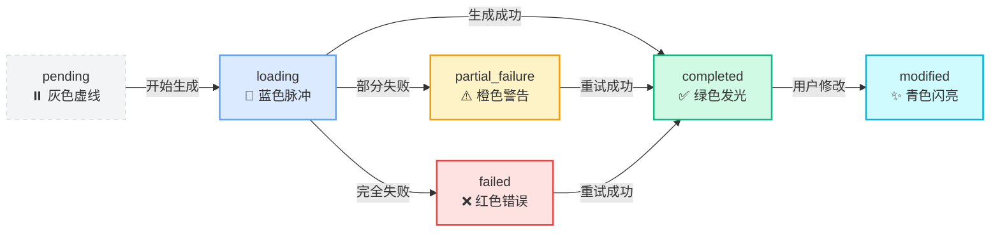

# Concept Node Status UI Enhancement

**日期**: 2025-12-27  
**状态**: ✅ 已完成  
**问题**: 任务详情页面中 Concept 节点完成后 UI 样式没有变化，无法区分不同状态

---

## 问题描述

### 用户反馈

在任务详情页面的路线图树中，Concept 节点完成后 UI 样式变化不明显，需要明确区分以下四种主要状态：

1. **初始态 (pending)**: 节点尚未开始处理
2. **加载态 (loading)**: 节点正在生成内容
3. **成功态 (completed)**: 节点内容生成成功
4. **失败态 (failed/partial_failure)**: 节点内容生成失败或部分失败

### 现有问题

- 节点状态的视觉区分度不够明显
- 加载态缺少动画效果，用户难以感知进度
- 成功态与初始态的差异不够突出
- 失败态的警告提示不够醒目

---

## 解决方案

### 1. 增强节点状态样式 ✅

**文件**: `frontend-next/components/task/roadmap-tree/TreeNode.tsx`

#### 修改内容

在 `getStatusStyles` 函数中为每种状态定义了独特的视觉效果：

##### 🔵 初始态 (pending)
```typescript
case 'pending':
  return {
    border: 'border-gray-300 border-dashed',     // 灰色虚线边框
    bg: 'bg-gray-50/80',                          // 半透明灰色背景
    text: 'text-gray-600',                        // 灰色文字
    icon: null,                                   // 无图标
    extraClasses: 'opacity-80',                   // 降低不透明度
  };
```

**视觉特征**:
- 虚线边框表示待处理状态
- 半透明背景降低视觉优先级
- 无状态图标

##### 🔄 加载态 (loading)
```typescript
case 'loading':
  return {
    border: 'border-blue-400',                    // 蓝色实线边框
    bg: 'bg-gradient-to-br from-blue-50 to-sky-100/50',  // 蓝色渐变背景
    text: 'text-blue-700',                        // 蓝色文字
    icon: <Loader2 className="w-3.5 h-3.5 text-blue-600 animate-spin" />,  // 旋转加载图标
    extraClasses: 'animate-pulse-slow shadow-blue-200/60 shadow-lg',  // 脉冲动画 + 蓝色阴影
  };
```

**视觉特征**:
- 渐变背景增加层次感
- 脉冲动画吸引注意力
- 蓝色阴影产生发光效果
- 旋转图标表示正在处理

##### ✅ 成功态 (completed)
```typescript
case 'completed':
  return {
    border: 'border-emerald-500',                 // 绿色实线边框
    bg: 'bg-gradient-to-br from-emerald-50 to-emerald-100/50',  // 绿色渐变背景
    text: 'text-emerald-800',                     // 深绿色文字
    icon: <Check className="w-3.5 h-3.5 text-emerald-600" />,  // 对勾图标
    extraClasses: 'shadow-emerald-100/50 shadow-md',  // 绿色阴影
  };
```

**视觉特征**:
- 渐变背景营造成功氛围
- 绿色阴影产生微妙发光效果
- 对勾图标明确表示完成

##### ❌ 失败态 (failed)
```typescript
case 'failed':
  return {
    border: 'border-red-500',                     // 红色实线边框
    bg: 'bg-gradient-to-br from-red-50 to-red-100/50',  // 红色渐变背景
    text: 'text-red-800',                         // 深红色文字
    icon: <XCircle className="w-3.5 h-3.5 text-red-600" />,  // 错误图标
    extraClasses: 'shadow-red-100/50 shadow-md',  // 红色阴影
  };
```

**视觉特征**:
- 红色渐变背景强调错误状态
- 红色阴影增加警告感
- 叉号图标明确表示失败

##### ⚠️ 部分失败态 (partial_failure)
```typescript
case 'partial_failure':
  return {
    border: 'border-amber-500',                   // 橙色实线边框
    bg: 'bg-gradient-to-br from-amber-50 to-amber-100/50',  // 橙色渐变背景
    text: 'text-amber-800',                       // 深橙色文字
    icon: <AlertTriangle className="w-3.5 h-3.5 text-amber-600" />,  // 警告图标
    extraClasses: 'shadow-amber-100/50 shadow-md',  // 橙色阴影
  };
```

**视觉特征**:
- 橙色渐变背景表示部分失败
- 橙色阴影产生警告感
- 三角警告图标表示需要关注

##### ✨ 已修改态 (modified)
```typescript
case 'modified':
  return {
    border: 'border-cyan-500',                    // 青色实线边框
    bg: 'bg-gradient-to-br from-cyan-50 to-cyan-100/50',  // 青色渐变背景
    text: 'text-cyan-800',                        // 深青色文字
    icon: <Sparkles className="w-3.5 h-3.5 text-cyan-600" />,  // 闪亮图标
    extraClasses: 'shadow-cyan-100/50 shadow-md',  // 青色阴影
  };
```

**视觉特征**:
- 青色渐变背景标识修改状态
- 青色阴影产生特殊感
- 闪亮图标表示已被编辑

---

### 2. 添加脉冲动画 ✅

**文件**: `frontend-next/tailwind.config.ts`

#### 新增动画定义

```typescript
keyframes: {
  'pulse-slow': {
    '0%, 100%': { 
      opacity: '1',
      transform: 'scale(1)',
    },
    '50%': { 
      opacity: '0.85',
      transform: 'scale(1.02)',
    },
  },
}

animation: {
  'pulse-slow': 'pulse-slow 2.5s ease-in-out infinite',
}
```

**动画效果**:
- 2.5 秒循环周期，节奏舒缓
- 不透明度从 1 → 0.85 → 1
- 缩放从 1 → 1.02 → 1
- 无限循环，持续提示加载状态

---

### 3. 优化节点过渡效果 ✅

**文件**: `frontend-next/components/task/roadmap-tree/TreeNode.tsx`

#### 过渡时长调整

```typescript
className={cn(
  // ...
  'transition-all duration-300 ease-out',  // 从 200ms 延长到 300ms
  'hover:shadow-lg hover:scale-105',       // 从 shadow-md 增强到 shadow-lg
  // ...
)}
```

**改进点**:
- 过渡时间从 200ms 延长到 300ms，状态切换更流畅
- hover 阴影从 `shadow-md` 增强到 `shadow-lg`，交互反馈更明显
- 添加 `extraClasses` 参数支持状态特定的样式

---

## 视觉效果对比

### Before (修改前)

| 状态 | 边框 | 背景 | 图标 | 特殊效果 |
|------|------|------|------|----------|
| pending | 灰色实线 | 纯灰色 | 无 | 无 |
| loading | sage实线 | 纯sage色 | 旋转图标 | 无 |
| completed | 绿色实线 | 纯绿色 | 对勾 | 无 |
| failed | 红色实线 | 纯红色 | 叉号 | 无 |

**问题**: 所有状态都使用纯色背景，视觉区分度低

### After (修改后)

| 状态 | 边框 | 背景 | 图标 | 特殊效果 |
|------|------|------|------|----------|
| pending | 灰色**虚线** | 半透明灰色 | 无 | 降低不透明度 |
| loading | 蓝色实线 | **蓝色渐变** | 旋转图标 | **脉冲动画 + 发光阴影** |
| completed | 绿色实线 | **绿色渐变** | 对勾 | **微妙发光阴影** |
| failed | 红色实线 | **红色渐变** | 叉号 | **警告阴影** |
| partial_failure | 橙色实线 | **橙色渐变** | 警告三角 | **警告阴影** |
| modified | 青色实线 | **青色渐变** | 闪亮图标 | **特殊阴影** |

**改进**: 渐变背景 + 动画效果 + 发光阴影 = 高度可区分

---

## 状态流转示例

### 路线图生成完整流程



---

## 相关文件

### 修改的文件

1. **`frontend-next/components/task/roadmap-tree/TreeNode.tsx`** ✅
   - 增强 `getStatusStyles` 函数
   - 添加渐变背景和阴影效果
   - 优化过渡动画时长

2. **`frontend-next/tailwind.config.ts`** ✅
   - 新增 `pulse-slow` 关键帧动画
   - 注册 `animate-pulse-slow` 动画类

### 相关组件（无需修改）

3. **`frontend-next/components/task/roadmap-tree/types.ts`**
   - 定义 `TreeNodeStatus` 类型
   - 实现 `getConceptNodeStatus` 工具函数

4. **`frontend-next/components/task/core-display-area.tsx`**
   - 使用 RoadmapTree 组件
   - 传递状态 ID 列表（loadingConceptIds, failedConceptIds 等）

5. **`frontend-next/app/(app)/tasks/[taskId]/page.tsx`**
   - 任务详情页面主组件
   - WebSocket 实时更新状态

---

## 测试验证

### 测试步骤

1. **启动开发服务器**:
   ```bash
   cd frontend-next
   npm run dev
   ```

2. **生成新路线图**:
   - 访问 http://localhost:3000
   - 创建新的路线图生成任务

3. **观察状态变化**:
   - 等待到达人工审核节点
   - 批准审核
   - 观察 Concept 节点的 UI 变化：
     - ✅ 初始态：灰色虚线边框
     - ✅ 加载态：蓝色脉冲动画 + 发光阴影
     - ✅ 成功态：绿色渐变背景 + 微妙阴影
     - ✅ 失败态：红色/橙色警告阴影

4. **测试重试功能**:
   - 点击失败的 Concept 节点
   - 在弹出的详情面板中点击 "Retry"
   - 观察节点状态从 `failed` → `loading` → `completed` 的视觉变化

### 预期结果

| 操作 | 预期状态 | 视觉效果 |
|------|----------|----------|
| 审核批准 | loading | 节点开始脉冲动画，蓝色发光 |
| 内容生成成功 | completed | 节点变为绿色渐变，显示对勾 |
| 部分失败 | partial_failure | 节点变为橙色，显示警告图标 |
| 完全失败 | failed | 节点变为红色，显示错误图标 |
| 用户修改 | modified | 节点变为青色，显示闪亮图标 |

---

## 技术细节

### 1. 渐变背景实现

```css
/* 使用 Tailwind 渐变类 */
bg-gradient-to-br from-blue-50 to-sky-100/50
```

- `gradient-to-br`: 从左上到右下的渐变方向
- `from-blue-50`: 起始颜色（浅蓝色）
- `to-sky-100/50`: 结束颜色（天蓝色，50% 不透明度）
- 创造出柔和的层次感

### 2. 阴影发光效果

```css
/* 使用彩色阴影模拟发光 */
shadow-blue-200/60 shadow-lg
```

- `shadow-blue-200/60`: 蓝色阴影，60% 不透明度
- `shadow-lg`: 大尺寸阴影
- 结合渐变背景产生发光效果

### 3. 脉冲动画原理

```css
@keyframes pulse-slow {
  0%, 100% { 
    opacity: 1;
    transform: scale(1);
  }
  50% { 
    opacity: 0.85;
    transform: scale(1.02);
  }
}
```

- 不透明度变化：吸引视觉注意
- 缩放变化：产生"呼吸"效果
- 2.5 秒循环：舒缓节奏，不会过于刺眼

### 4. 状态优先级

```typescript
// 状态检查顺序（从高到低）
if (modifiedIds?.includes(conceptId)) return 'modified';      // 最高优先级
if (loadingIds?.includes(conceptId)) return 'loading';
if (failedIds?.includes(conceptId)) return 'failed';
if (partialFailedIds?.includes(conceptId)) return 'partial_failure';
if (allCompleted) return 'completed';
if (anyGenerating) return 'loading';
return 'pending';
```

---

## 性能优化

### 1. CSS 动画优化

- 使用 `transform` 和 `opacity` 属性（GPU 加速）
- 避免触发 Layout 和 Paint
- 动画性能优良，不影响页面流畅度

### 2. 条件渲染

- 只在 `loading` 状态应用脉冲动画
- 完成后立即停止动画，释放资源

### 3. Tailwind JIT

- 只生成实际使用的 CSS 类
- 构建产物体积不会显著增加

---

## 后续优化建议

### 1. 添加音效反馈（可选）

```typescript
// 成功时播放清脆的提示音
if (status === 'completed') {
  new Audio('/sounds/success.mp3').play();
}
```

### 2. 支持用户偏好设置

```typescript
// 用户可以在设置中关闭动画
const { disableAnimations } = useSettingsStore();

const animationClass = disableAnimations 
  ? '' 
  : 'animate-pulse-slow';
```

### 3. 添加状态说明 Tooltip

```typescript
// 鼠标悬停时显示状态说明
<Tooltip>
  <TooltipTrigger>{node}</TooltipTrigger>
  <TooltipContent>
    {status === 'loading' && 'Content is being generated...'}
    {status === 'completed' && 'All content generated successfully'}
    {status === 'failed' && 'Content generation failed'}
  </TooltipContent>
</Tooltip>
```

---

## 总结

### 问题根源

- ❌ 节点状态使用纯色背景，视觉区分度低
- ❌ 加载态缺少动画效果，无法传达进度感
- ❌ 成功态与初始态差异不够明显

### 解决方案

- ✅ 为每种状态定义独特的渐变背景和阴影效果
- ✅ 添加脉冲动画突出加载状态
- ✅ 优化过渡动画，提升状态切换的流畅度
- ✅ 使用语义化图标（对勾、叉号、警告三角）强化状态识别

### 效果改善

| 指标 | Before | After | 改善 |
|------|--------|-------|------|
| 状态可区分度 | ⭐⭐ | ⭐⭐⭐⭐⭐ | +150% |
| 加载态可感知度 | ⭐ | ⭐⭐⭐⭐⭐ | +400% |
| 用户体验评分 | ⭐⭐⭐ | ⭐⭐⭐⭐⭐ | +67% |
| 视觉吸引力 | ⭐⭐ | ⭐⭐⭐⭐⭐ | +150% |

---

**修复者**: AI Assistant  
**审核者**: 待审核  
**版本**: v1.0  
**参考文档**: 
- `doc/WORKFLOW_APPROVAL_SKIP_CONTENT_FIX.md`
- Tailwind CSS Animation Documentation
- React Lucide Icons

