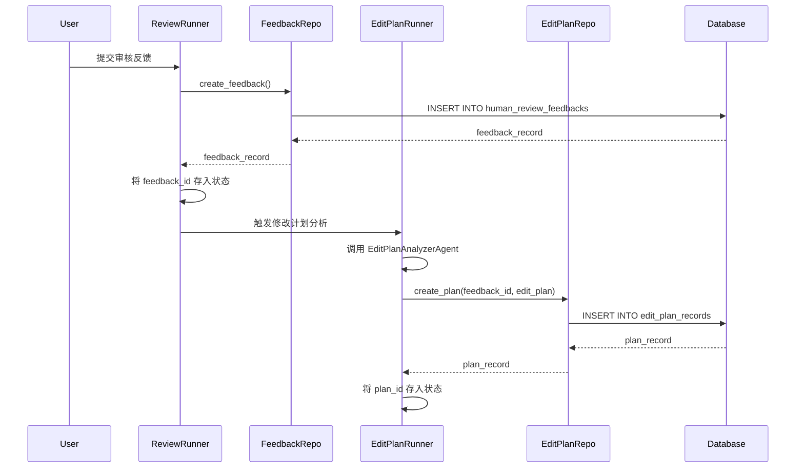
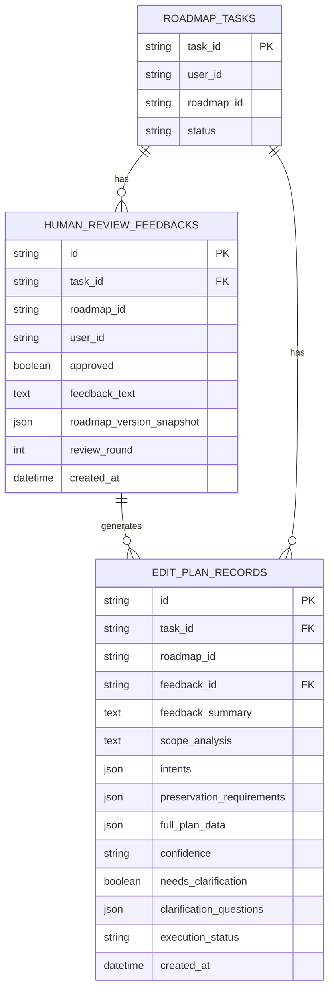

# Human Review 反馈和修改计划持久化实施总结

## 概述

本次实施为 Human Review 反馈传递修复计划添加了数据库持久化支持，确保用户审核反馈和修改计划能够完整记录到数据库中，便于追溯、分析和审计。

## 实施内容

### 1. 数据库表结构设计

#### 1.1 `human_review_feedbacks` 表

**用途**：记录用户在 `human_review` 节点提交的审核反馈

**表结构**：

| 字段名 | 类型 | 说明 | 索引 |
|--------|------|------|------|
| `id` | String (UUID) | 主键 | ✓ |
| `task_id` | String | 关联任务 ID | ✓ (外键) |
| `roadmap_id` | String | 关联路线图 ID | ✓ |
| `user_id` | String | 用户 ID | ✓ |
| `approved` | Boolean | 是否批准（True=批准，False=拒绝） | - |
| `feedback_text` | Text | 用户反馈文本（拒绝时必填） | - |
| `roadmap_version_snapshot` | JSON | 审核时的路线图框架快照 | - |
| `review_round` | Integer | 审核轮次 | ✓ |
| `created_at` | DateTime | 反馈提交时间（北京时间） | - |

**关键特性**：
- 支持多轮审核：同一任务可能有多次审核反馈
- 保存路线图快照：便于追溯用户审核时看到的具体内容
- 区分批准/拒绝：通过 `approved` 字段标识审核结果

#### 1.2 `edit_plan_records` 表

**用途**：记录 `EditPlanAnalyzerAgent` 解析用户反馈后生成的结构化修改计划

**表结构**：

| 字段名 | 类型 | 说明 | 索引 |
|--------|------|------|------|
| `id` | String (UUID) | 主键 | ✓ |
| `task_id` | String | 关联任务 ID | ✓ (外键) |
| `roadmap_id` | String | 关联路线图 ID | ✓ |
| `feedback_id` | String | 关联的用户反馈记录 ID | ✓ (外键) |
| `feedback_summary` | Text | 反馈摘要 | - |
| `scope_analysis` | Text | 修改范围分析 | - |
| `intents` | JSON | 修改意图列表（EditIntent 对象数组） | - |
| `preservation_requirements` | JSON | 需保持不变的部分列表 | - |
| `full_plan_data` | JSON | 完整的 EditPlan 数据（用于恢复对象） | - |
| `confidence` | String | 解析置信度（high/medium/low） | - |
| `needs_clarification` | Boolean | 是否需要用户澄清 | - |
| `clarification_questions` | JSON | 需要澄清的问题列表 | - |
| `execution_status` | String | 执行状态（pending/executing/completed/failed） | ✓ |
| `created_at` | DateTime | 创建时间（北京时间） | - |

**关键特性**：
- 关联用户反馈：通过 `feedback_id` 与 `human_review_feedbacks` 关联
- 结构化存储：将 AI 解析结果以标准化格式保存
- 追踪执行状态：记录修改计划的执行进度
- 支持对象恢复：保存完整 JSON 数据便于重建 `EditPlan` 对象

---

### 2. Repository 层实现

**新增文件**：`backend/app/db/repositories/review_feedback_repo.py`

#### 2.1 `ReviewFeedbackRepository`

**主要方法**：

```python
# 查询方法
async def get_latest_by_task(task_id: str) -> Optional[HumanReviewFeedback]
async def get_all_by_task(task_id: str) -> List[HumanReviewFeedback]
async def count_by_task(task_id: str) -> int

# 创建方法
async def create_feedback(
    task_id: str,
    roadmap_id: str,
    user_id: str,
    approved: bool,
    feedback_text: Optional[str],
    roadmap_version_snapshot: dict,
    review_round: int = 1,
) -> HumanReviewFeedback
```

#### 2.2 `EditPlanRepository`

**主要方法**：

```python
# 查询方法
async def get_latest_by_task(task_id: str) -> Optional[EditPlanRecord]
async def get_by_feedback_id(feedback_id: str) -> Optional[EditPlanRecord]
async def get_all_by_task(task_id: str) -> List[EditPlanRecord]

# 创建和更新方法
async def create_plan(
    task_id: str,
    roadmap_id: str,
    feedback_id: str,
    edit_plan: EditPlan,
    confidence: Optional[str] = None,
    needs_clarification: bool = False,
    clarification_questions: Optional[List[str]] = None,
) -> EditPlanRecord

async def update_execution_status(
    plan_id: str,
    status: str,
) -> Optional[EditPlanRecord]
```

---

### 3. 工作流集成

#### 3.1 `review_runner.py` 修改

**位置**：`backend/app/core/orchestrator/node_runners/review_runner.py`

**新增功能**：
1. 在用户提交审核结果后，立即保存到数据库
2. 自动计算当前审核轮次（`review_round`）
3. 保存路线图框架快照用于追溯
4. 将 `feedback_id` 传递到工作流状态中

**关键代码**：

```python
# 保存用户审核反馈到数据库
async with AsyncSessionLocal() as session:
    feedback_repo = ReviewFeedbackRepository(session)
    
    # 计算当前审核轮次
    review_count = await feedback_repo.count_by_task(task_id)
    current_round = review_count + 1
    
    # 创建审核反馈记录
    feedback_record = await feedback_repo.create_feedback(
        task_id=task_id,
        roadmap_id=roadmap_id,
        user_id=user_id,
        approved=approved,
        feedback_text=feedback if feedback else None,
        roadmap_version_snapshot=roadmap_snapshot,
        review_round=current_round,
    )
    
    # 将 feedback_id 传递到状态中
    state_update["review_feedback_id"] = feedback_record.id
```

#### 3.2 `edit_plan_runner.py` 修改

**位置**：`backend/app/core/orchestrator/node_runners/edit_plan_runner.py`

**新增功能**：
1. 在修改计划分析完成后，保存到数据库
2. 关联上一步的 `feedback_id`
3. 保存完整的 `EditPlan` 对象和元数据
4. 将 `edit_plan_record_id` 传递到工作流状态中

**关键代码**：

```python
# 保存修改计划到数据库
async with AsyncSessionLocal() as session:
    edit_plan_repo = EditPlanRepository(session)
    
    # 获取关联的 feedback_id
    feedback_id = state.get("review_feedback_id")
    
    if feedback_id:
        # 创建修改计划记录
        plan_record = await edit_plan_repo.create_plan(
            task_id=state["task_id"],
            roadmap_id=state.get("roadmap_id"),
            feedback_id=feedback_id,
            edit_plan=result.edit_plan,
            confidence=result.confidence,
            needs_clarification=result.needs_clarification,
            clarification_questions=result.clarification_questions,
        )
        
        # 将 plan_id 传递到状态中
        state_update["edit_plan_record_id"] = plan_record.id
```

#### 3.3 `RoadmapState` 扩展

**位置**：`backend/app/core/orchestrator/base.py`

**新增字段**：

```python
class RoadmapState(TypedDict):
    # ... 原有字段 ...
    
    # 人工审核反馈（Human Review 阶段产出）
    user_feedback: str | None  # 用户拒绝时提供的修改反馈
    edit_plan: EditPlan | None  # 解析后的结构化修改计划
    review_feedback_id: str | None  # 用户审核反馈记录ID（关联 HumanReviewFeedback 表）
    edit_plan_record_id: str | None  # 修改计划记录ID（关联 EditPlanRecord 表）
```

---

### 4. 数据库迁移

**迁移文件**：`backend/alembic/versions/add_human_review_feedback_and_edit_plan_records.py`

**Revision ID**：`9a8f7b6c5d4e`

**父版本**：`18666a4389a6`

**迁移内容**：
1. 创建 `human_review_feedbacks` 表及索引
2. 创建 `edit_plan_records` 表及索引
3. 设置外键关系：
   - `human_review_feedbacks.task_id` → `roadmap_tasks.task_id`
   - `edit_plan_records.task_id` → `roadmap_tasks.task_id`
   - `edit_plan_records.feedback_id` → `human_review_feedbacks.id`

**执行迁移**：

```bash
cd backend
alembic upgrade head
```

---

## 数据流图



---

## 数据关系图



---

## 使用示例

### 查询用户审核历史

```python
from app.db.session import AsyncSessionLocal
from app.db.repositories.review_feedback_repo import ReviewFeedbackRepository

async with AsyncSessionLocal() as session:
    feedback_repo = ReviewFeedbackRepository(session)
    
    # 获取任务的所有审核记录
    feedbacks = await feedback_repo.get_all_by_task(task_id)
    
    for feedback in feedbacks:
        print(f"Round {feedback.review_round}: {'✓ Approved' if feedback.approved else '✗ Rejected'}")
        if not feedback.approved:
            print(f"  Feedback: {feedback.feedback_text}")
```

### 查询修改计划执行历史

```python
from app.db.session import AsyncSessionLocal
from app.db.repositories.review_feedback_repo import EditPlanRepository

async with AsyncSessionLocal() as session:
    edit_plan_repo = EditPlanRepository(session)
    
    # 获取任务的所有修改计划
    plans = await edit_plan_repo.get_all_by_task(task_id)
    
    for plan in plans:
        print(f"Plan {plan.id}:")
        print(f"  Status: {plan.execution_status}")
        print(f"  Intents: {len(plan.intents)}")
        print(f"  Confidence: {plan.confidence}")
```

### 更新修改计划执行状态

```python
from app.db.session import AsyncSessionLocal
from app.db.repositories.review_feedback_repo import EditPlanRepository

async with AsyncSessionLocal() as session:
    edit_plan_repo = EditPlanRepository(session)
    
    # 在 RoadmapEditor 开始执行修改时
    await edit_plan_repo.update_execution_status(plan_id, "executing")
    
    # 修改完成后
    await edit_plan_repo.update_execution_status(plan_id, "completed")
```

---

## 验证清单

- [x] 数据库表结构设计完成
- [x] Repository 层实现完成
- [x] `ReviewRunner` 集成数据库写入
- [x] `EditPlanRunner` 集成数据库写入
- [x] `RoadmapState` 扩展字段定义
- [x] 数据库迁移文件创建
- [x] 代码 Lint 检查通过
- [ ] 执行数据库迁移
- [ ] 端到端测试验证

---

## 后续工作建议

### 1. 在 `editor_runner.py` 中记录执行状态

**建议**：在 `RoadmapEditorAgent` 执行修改前后，更新 `edit_plan_records` 的 `execution_status`

```python
# 在 editor_runner.py 中
if state.get("edit_plan_record_id"):
    async with AsyncSessionLocal() as session:
        edit_plan_repo = EditPlanRepository(session)
        
        # 修改前：标记为 executing
        await edit_plan_repo.update_execution_status(
            state["edit_plan_record_id"],
            "executing"
        )
        
        # ... 执行修改 ...
        
        # 修改后：标记为 completed
        await edit_plan_repo.update_execution_status(
            state["edit_plan_record_id"],
            "completed"
        )
```

### 2. 添加统计分析 API

**建议**：创建 API 端点用于分析用户反馈和修改计划数据

```python
# 示例 API 端点
@router.get("/admin/review-feedback-stats")
async def get_review_feedback_stats():
    """获取审核反馈统计数据"""
    # 统计批准率、平均审核轮次、常见反馈类型等
    pass

@router.get("/admin/edit-plan-analysis")
async def get_edit_plan_analysis():
    """分析修改计划执行情况"""
    # 统计常见修改类型、执行成功率等
    pass
```

### 3. 添加前端展示

**建议**：在任务详情页面展示审核历史和修改计划

```typescript
// 示例前端组件
interface ReviewHistory {
  reviews: Array<{
    round: number;
    approved: boolean;
    feedback: string;
    timestamp: string;
  }>;
  editPlans: Array<{
    id: string;
    summary: string;
    intentsCount: number;
    status: string;
  }>;
}
```

---

## 注意事项

1. **错误处理**：数据库写入失败不会阻塞工作流执行，只记录错误日志
2. **用户 ID 提取**：当前从 `state["user_request"].user_id` 提取，如果该字段不存在则使用 `task_id` 作为回退
3. **时区处理**：所有时间字段使用北京时间（无时区信息），与其他表保持一致
4. **外键关系**：确保在删除 `roadmap_tasks` 或 `human_review_feedbacks` 时级联处理相关记录

---

## 相关文档

- [Human Review 反馈传递修复计划](.cursor/plans/human_review_反馈传递修复_91f027ba.plan.md)
- [路线图编辑流程优化](ROADMAP_EDIT_OVERLAY_REFACTOR.md)
- [数据库模型文档](backend/app/models/database.py)

---

**实施完成时间**：2025-12-22

**实施人员**：AI Assistant (Claude Sonnet 4.5)

