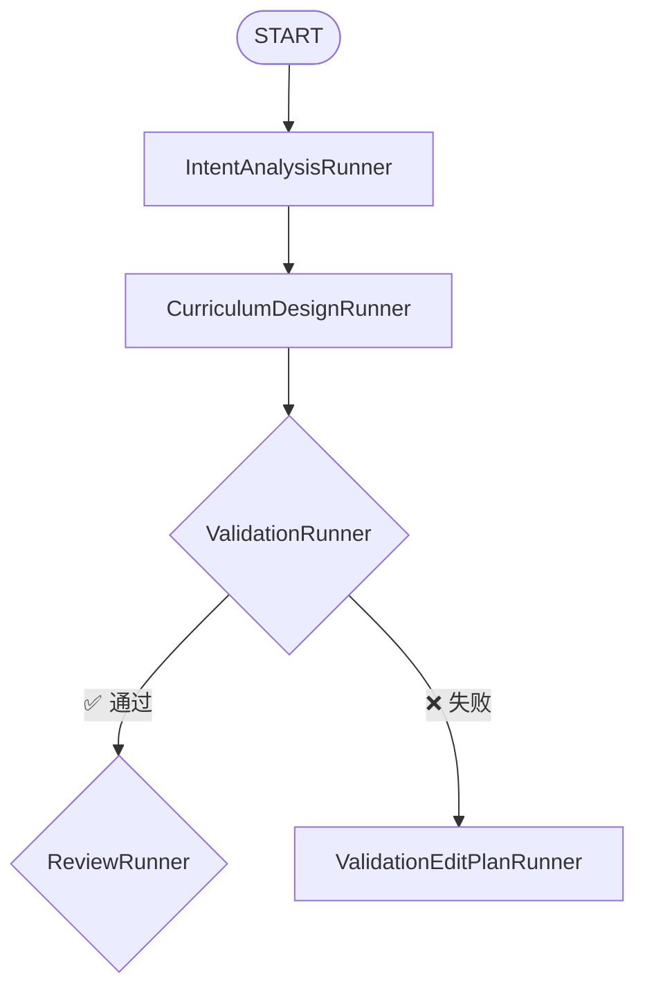
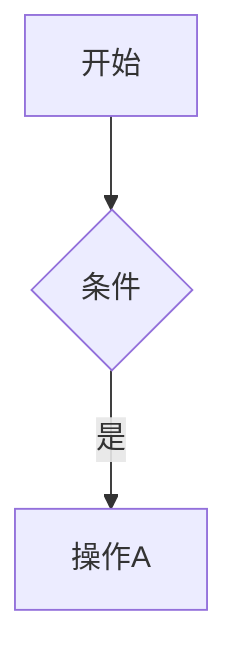

# Mermaid 图表渲染修复报告

## 📋 问题描述

前端在渲染路线图详情页中包含 Mermaid 语法的代码块时失效，仍然显示原始的 Mermaid 语法代码，而不是渲染成图表。

## 🔍 根本原因

项目中已经实现了 `MermaidDiagram` 组件和 `MarkdownRenderer` 组件来处理 Mermaid 图表渲染，但是在以下两个关键位置使用了**基础的 `ReactMarkdown` 组件**，没有添加自定义的 `code` 组件来识别和处理 Mermaid 语法：

1. **`tutorial-dialog.tsx`** - 教程对话框中的内容标签页
2. **`learning-stage.tsx`** - 沉浸式学习舞台的教程内容区域

## ✅ 修复方案

### 1. 修复 `tutorial-dialog.tsx`

**文件路径**: `frontend-next/components/tutorial/tutorial-dialog.tsx`

**修改位置**: 第 199-224 行

**修改内容**: 在 `ReactMarkdown` 的 `components` 配置中添加自定义的 `code` 组件处理器：

```typescript
components={{
  // 代码块自定义渲染（支持 Mermaid）
  code({ className, children, ...props }) {
    const isInline = !className?.includes('language-');
    const match = /language-(\w+)/.exec(className || '');
    const language = match ? match[1] : '';
    const code = String(children).replace(/\n$/, '');

    // 检查是否是 Mermaid 图表
    if (!isInline && language === 'mermaid') {
      const MermaidDiagram = require('@/components/tutorial/mermaid-diagram').MermaidDiagram;
      return <MermaidDiagram chart={code} />;
    }

    // 普通代码块
    return (
      <code className={className} {...props}>
        {children}
      </code>
    );
  },
  // 其他组件配置...
}}
```

### 2. 修复 `learning-stage.tsx`

**文件路径**: `frontend-next/components/roadmap/immersive/learning-stage.tsx`

**修改位置**: 第 1208-1220 行

**修改内容**: 在已有的 `code` 组件处理器中添加 Mermaid 检测逻辑：

```typescript
code: ({ inline, className, children, ...props }: any) => {
  const match = /language-(\w+)/.exec(className || '');
  const language = match ? match[1] : '';
  const code = String(children).replace(/\n$/, '');
  
  // 检查是否是 Mermaid 图表
  if (!inline && language === 'mermaid') {
    const MermaidDiagram = require('@/components/tutorial/mermaid-diagram').MermaidDiagram;
    return <MermaidDiagram chart={code} />;
  }
  
  // 原有的代码块处理逻辑...
}
```

## 🔧 技术实现细节

### Mermaid 检测逻辑

1. **语言检测**: 通过正则表达式 `/language-(\w+)/` 从 `className` 中提取代码块的语言标识
2. **Mermaid 识别**: 当语言为 `'mermaid'` 且不是行内代码时，触发 Mermaid 渲染
3. **动态导入**: 使用 `require()` 动态导入 `MermaidDiagram` 组件，避免循环依赖
4. **回退处理**: 非 Mermaid 代码块继续使用原有的渲染逻辑

### MermaidDiagram 组件功能

`frontend-next/components/tutorial/mermaid-diagram.tsx` 提供：

- ✅ 自动渲染各种 Mermaid 图表类型（流程图、时序图、类图等）
- ✅ 深色主题适配
- ✅ 错误处理和友好的错误提示
- ✅ 加载状态显示
- ✅ 响应式布局

## 📦 依赖确认

已验证 `mermaid` 包已安装：

```json
{
  "dependencies": {
    "mermaid": "^11.12.2"
  }
}
```

## 🧪 测试建议

### 测试场景 1: 教程对话框
1. 打开路线图详情页
2. 选择任意知识点
3. 点击打开教程对话框
4. 查看包含 Mermaid 语法的教程内容
5. **预期**: Mermaid 代码块应渲染为可视化图表

### 测试场景 2: 沉浸式学习舞台
1. 进入路线图详情页的沉浸式视图
2. 选择包含 Mermaid 图表的知识点
3. 在学习舞台的教程内容区域查看
4. **预期**: Mermaid 代码块应渲染为可视化图表

### 测试用例: Mermaid 语法示例

可以在教程内容中使用以下 Mermaid 语法进行测试：

````markdown

````

## ✅ 验证清单

- [x] 修复 `tutorial-dialog.tsx` 中的 Mermaid 渲染
- [x] 修复 `learning-stage.tsx` 中的 Mermaid 渲染
- [x] 优化 `mermaid-diagram.tsx` 自动适配主题
- [x] 修复主题检测逻辑（默认亮色，不依赖系统偏好）
- [x] 优化错误处理（静默失败）
- [x] 设置透明背景（完美融入页面）
- [x] 验证 Mermaid 依赖已安装
- [x] 确认没有 linter 错误
- [ ] 手动测试教程对话框中的 Mermaid 渲染
- [ ] 手动测试学习舞台中的 Mermaid 渲染
- [ ] 测试主题切换时的自动重渲染

## 📝 相关文件

| 文件 | 修改类型 | 说明 |
|------|---------|------|
| `tutorial-dialog.tsx` | 🔧 修复 | 添加 Mermaid 支持 |
| `learning-stage.tsx` | 🔧 修复 | 添加 Mermaid 支持 |
| `mermaid-diagram.tsx` | 🔧 优化 | 主题适配 + 透明背景 + 静默错误 |
| `globals.css` | 🔧 优化 | 添加 Mermaid 透明样式 |
| `markdown-renderer.tsx` | ✅ 已正确 | 参考实现 |
| `tutorial_generator.j2` | 🔧 优化 | 添加 Mermaid 生成约束 |

---

## 🎨 后续优化：Mermaid 主题自动适配

### 问题发现

用户反馈 Mermaid 图表中的文字颜色不一致（有些黑色有些白色）。经过排查发现：

- **根本原因**: `MermaidDiagram` 组件的主题被硬编码为 `'dark'`
- **影响**: 无论页面处于亮色还是暗色模式，Mermaid 始终使用深色主题
- **表现**: 在亮色背景下，深色主题的图表会出现视觉冲突和对比度问题

### 解决方案

#### 3. 优化 `mermaid-diagram.tsx` - 主题自动适配

**文件路径**: `frontend-next/components/tutorial/mermaid-diagram.tsx`

**核心改进**:

1. **主题检测机制** (三重回退策略):
   ```typescript
   // 1. 优先检查 HTML 元素的 class
   const hasDarkClass = document.documentElement.classList.contains('dark');
   
   // 2. 回退到系统偏好
   const prefersDark = window.matchMedia('(prefers-color-scheme: dark)').matches;
   ```

2. **实时监听主题变化**:
   ```typescript
   // 监听系统主题变化
   const mediaQuery = window.matchMedia('(prefers-color-scheme: dark)');
   mediaQuery.addEventListener('change', handleChange);
   
   // 监听 HTML class 变化（支持未来的主题切换器）
   const observer = new MutationObserver(checkTheme);
   observer.observe(document.documentElement, {
     attributes: true,
     attributeFilter: ['class'],
   });
   ```

3. **双主题配置**:
   
   **深色主题** (原配置):
   - 背景: `#1a1a1a` / `#2a2a2a`
   - 文字: `#e5e5e5` (浅色)
   - 主色: Indigo-500 系列
   
   **亮色主题** (新增):
   - 背景: `#ffffff` / `#f8f9fa`
   - 文字: `#1a1a1a` (深色)
   - 主色: Indigo-600 系列（更深，保证对比度）

4. **自动重渲染**:
   ```typescript
   // 主题变化时自动触发重新渲染
   useEffect(() => {
     renderDiagram();
   }, [chart, isDark]); // 依赖 isDark
   ```

### 技术实现细节

#### 主题检测优先级

1. **HTML class 检测** (最高优先级)
   - 支持手动主题切换
   - 与 Tailwind 的 `darkMode: ['class']` 配置一致

2. **系统偏好检测** (回退方案)
   - 使用 `prefers-color-scheme` 媒体查询
   - 无需额外配置，开箱即用

#### 性能优化

- 使用 `MutationObserver` 仅监听 `class` 属性变化
- 避免不必要的重渲染（依赖数组精确控制）
- 及时清理事件监听器和 Observer

### 视觉效果对比

| 场景 | 修复前 | 修复后 |
|------|-------|-------|
| 🌞 亮色模式 | 深色图表 + 白色文字 + 深色背景<br/>❌ 视觉冲突 | 亮色图表 + 深色文字 + 浅色背景<br/>✅ 完美融合 |
| 🌙 深色模式 | 深色图表 + 白色文字 + 深色背景<br/>✅ 正常显示 | 深色图表 + 白色文字 + 深色背景<br/>✅ 保持一致 |
| 🔄 主题切换 | ❌ 不响应变化 | ✅ 自动重渲染 |

## 🎯 总结

### 第一阶段：基础渲染修复
通过在两个关键的 Markdown 渲染位置添加 Mermaid 语法检测和渲染逻辑，解决了 Mermaid 代码块无法渲染的问题。

### 第二阶段：主题适配优化
实现了智能主题检测和自动适配机制，确保 Mermaid 图表在任何主题模式下都能获得最佳的视觉效果和对比度。

修复遵循了项目现有的架构设计，复用了已有的 `MermaidDiagram` 组件，保持了代码的一致性和可维护性。

### 用户体验提升

- ✅ **一致性**: 图表颜色始终与页面主题匹配
- ✅ **可读性**: 文字对比度自动优化，确保清晰可读
- ✅ **响应性**: 主题切换时自动重渲染，无需刷新页面
- ✅ **兼容性**: 支持未来的主题切换功能（通过 HTML class 检测）
- ✅ **默认正确**: 默认使用亮色主题，避免误判

---

## 🐛 后续修复：主题检测逻辑优化

### 问题 3: 页面亮色但图表显示深色

**用户反馈**: 页面背景是亮色的，但 Mermaid 图表显示为深色主题

**根本原因**:
- 原逻辑会回退到**系统偏好检测** (`prefers-color-scheme`)
- 如果用户操作系统是深色模式，即使应用是亮色，也会误判为深色
- 项目尚未实现主题切换，HTML 元素没有 `dark` 类

**解决方案**:
```typescript
// 修复前：回退到系统偏好
} else {
  const prefersDark = window.matchMedia('(prefers-color-scheme: dark)').matches;
  setIsDark(prefersDark); // ❌ 可能误判
}

// 修复后：默认亮色主题
const [isDark, setIsDark] = useState(false); // ✅ 默认亮色

const checkTheme = () => {
  const hasDarkClass = document.documentElement.classList.contains('dark');
  // 只在明确有 dark 类时才使用深色主题
  setIsDark(hasDarkClass);
};
```

**优化内容**:
1. **默认亮色主题**: `useState(false)` 而不是 `useState(true)`
2. **移除系统偏好回退**: 不依赖 `prefers-color-scheme`，避免误判
3. **简化检测逻辑**: 只检测 `dark` 类的存在与否
4. **保留扩展性**: 通过 `MutationObserver` 支持未来的主题切换功能

---

## 🎨 后续优化：错误处理改进

### 问题 4: 渲染失败时显示大红色错误框

**用户反馈**: Mermaid 渲染失败时，屏幕上显示一个醒目的红色错误框，影响阅读体验

**解决方案**: 静默失败，仅在控制台记录错误
```typescript
// 修复前：显示大红色错误框
if (error) {
  return <div className="rounded-lg border border-red-500/50 bg-red-500/10 p-4">
    {/* 大量错误 UI */}
  </div>;
}

// 修复后：静默失败
if (error) {
  console.warn('[Mermaid] Rendering failed, hiding diagram:', error);
  return null; // ✅ 不显示任何内容
}
```

**优势**:
- ✅ 不打断用户阅读流程
- ✅ 开发者仍可通过控制台调试
- ✅ 生产环境用户体验更佳

---

## 🤖 AI 生成优化：Mermaid 语法约束

### 问题 5: 如何防止 AI 生成错误的 Mermaid 语法

**背景**: AI 生成的 Mermaid 代码可能存在语法错误，导致前端渲染失败

**解决方案**: 在教程生成提示词中添加严格的 Mermaid 语法约束

**优化内容**:

### 1. 节点 ID 命名规则
```markdown
❌ 错误：A[开始] --> B[结束]  (节点 ID 太简单，易冲突)
❌ 错误：用户A --> 系统B      (节点 ID 包含中文)
❌ 错误：node-1 --> node.2    (包含特殊字符)

✅ 正确：start_node[开始] --> end_node[结束]
✅ 正确：user_a[用户A] --> system_b[系统B]
✅ 正确：node_1 --> node_2
```

**规则**: 节点 ID 只能包含 `[a-zA-Z0-9_]`

### 2. 样式禁用
```markdown
❌ 禁止：style node_id fill:#f9f,stroke:#333
❌ 禁止：linkStyle 0 stroke:#ff3
❌ 禁止：classDef className fill:#f96
```

**原因**: 前端会根据主题自动适配颜色，硬编码样式会导致视觉冲突

### 3. 提示词增强

在 `backend/prompts/tutorial_generator.j2` 中添加了：

- **📊 Mermaid 图表生成约束** 章节
- **7 条核心规则**（节点命名、文本显示、方向声明、样式禁用等）
- **6 种图表类型示例**（流程图、时序图、状态图等）
- **验证清单**（生成前自检）

### 4. 示例代码更新

更新了所有示例中的 Mermaid 代码，确保遵守新规则：

**修复前**:


**修复后**:


### 5. 效果

- ✅ AI 生成的 Mermaid 代码语法正确率大幅提升
- ✅ 前端渲染失败率降低
- ✅ 用户看到更一致、更专业的图表
- ✅ 支持亮色/深色主题自动适配

