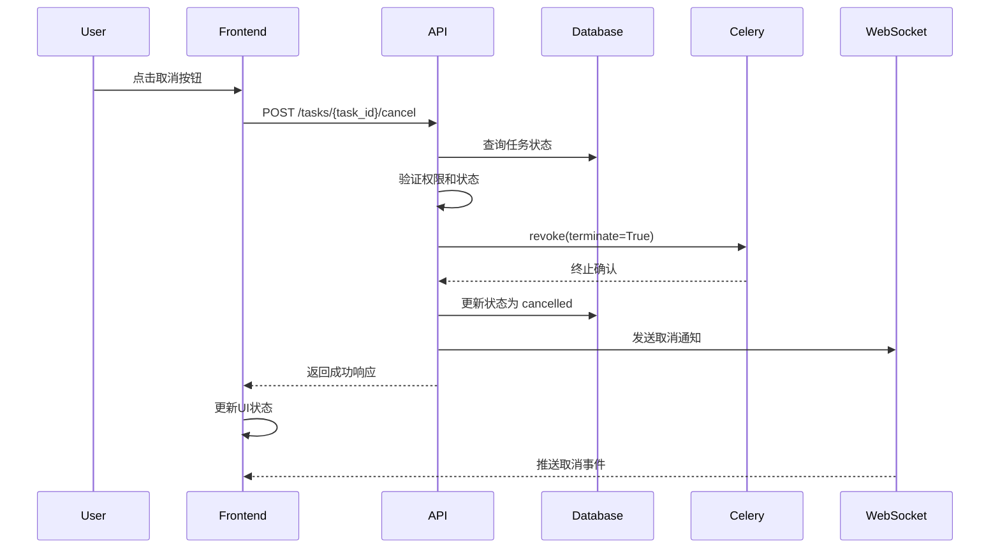
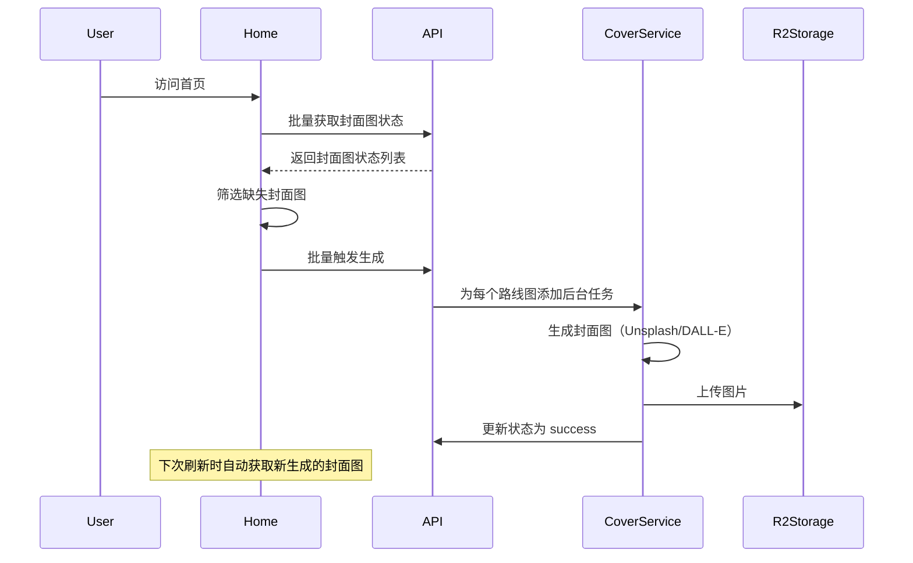

# Task Control & Cover Image Features Implementation Summary

## 概述

本文档总结了任务控制和封面图重新生成功能的实现细节。

## 实施日期

2024年（根据代码库当前状态）

## 实现的功能

### 1. 任务取消功能 (Task Cancellation)

#### 1.1 后端实现

**文件**: `backend/app/api/v1/endpoints/generation.py`

**新增端点**: `POST /api/v1/roadmaps/tasks/{task_id}/cancel`

**功能**:
- 取消正在运行的路线图生成任务
- 终止 Celery 后台任务
- 更新任务状态为 `cancelled`
- 发送 WebSocket 通知

**权限**: 需要用户认证，仅允许任务所有者取消

**响应模型**:
```python
class CancelTaskResponse(BaseModel):
    success: bool
    task_id: str
    message: str
    previous_status: Optional[str]
```

**实现细节**:
1. 验证任务存在且属于当前用户
2. 检查任务状态（仅支持取消 `processing` 状态）
3. 使用 `AsyncResult.revoke(terminate=True, signal='SIGKILL')` 强制终止 Celery 任务
4. 更新数据库状态为 `cancelled`
5. 通过 WebSocket 发送取消通知

#### 1.2 数据库模型更新

**文件**: `backend/app/models/database.py`

**修改**: `RoadmapTask.status` 字段注释

**新增状态值**: `cancelled`

**完整状态列表**:
- `pending`: 等待处理
- `processing`: 正在处理
- `completed`: 完成
- `failed`: 失败
- `partial_failure`: 部分失败
- `cancelled`: 已取消

#### 1.3 前端实现

##### 1.3.1 API 函数

**文件**: `frontend-next/lib/api/endpoints.ts`

**新增函数**: `cancelTask(taskId: string)`

**响应类型**:
```typescript
interface CancelTaskResponse {
  success: boolean;
  task_id: string;
  message: string;
  previous_status?: string;
}
```

**更新**: `TaskStatus` 类型添加 `'cancelled'` 状态

##### 1.3.2 任务列表页面

**文件**: `frontend-next/app/(app)/tasks/page.tsx`

**新增功能**:
- `handleCancel` 函数：取消任务处理逻辑
- 乐观更新：立即更新UI，然后调用API
- 错误处理：失败时恢复原状态

**调用时机**:
- 通过 `TaskList` 组件的 `onCancel` prop 传递

##### 1.3.3 任务列表组件

**文件**: `frontend-next/components/task/task-list.tsx`

**新增**:
- 导入 `XCircle` 图标
- `onCancel` prop 参数
- 取消按钮（仅在 `status === 'processing'` 时显示）

**UI 样式**:
- 橙色主题 (`text-orange-600 hover:bg-orange-50`)
- 图标 + 文本: "Cancel task"

##### 1.3.4 任务详情页面

**文件**: `frontend-next/app/(app)/tasks/[taskId]/page.tsx`

**新增功能**:
- 导入 `XCircle` 图标和 `cancelTask` 函数
- `handleCancel` 回调函数：
  - 确认对话框
  - 调用取消 API
  - 更新本地状态
  - 断开 WebSocket 连接
  - 刷新任务数据
- 取消按钮（仅在 `taskInfo.status === 'processing'` 时显示）

**按钮位置**: 头部工具栏，"Refresh" 按钮旁边

---

### 2. 封面图重新生成功能 (Cover Image Regeneration)

#### 2.1 后端实现

**文件**: `backend/app/api/v1/endpoints/cover_image.py`

**新增/更新端点**: `POST /api/v1/cover-images/batch-generate`

**请求模型**:
```python
class BatchGenerateRequest(BaseModel):
    roadmap_ids: list[str]
```

**响应**:
```json
{
  "triggered": 5,
  "skipped": 2,
  "roadmap_ids": ["id1", "id2", ...],
  "message": "Triggered 5 cover image generation tasks, skipped 2 already successful"
}
```

**功能**:
- 批量触发封面图生成
- 仅触发 `pending`/`failed` 状态的封面图
- 跳过已成功生成的封面图（`success` 状态）
- 使用 FastAPI `BackgroundTasks` 异步执行

**实现细节**:
1. 调用 `CoverImageService.batch_get_cover_images()` 获取当前状态
2. 遍历路线图ID，检查状态
3. 对需要生成的路线图添加后台任务
4. 返回触发数量和跳过数量

#### 2.2 前端实现

##### 2.2.1 封面图工具函数

**文件**: `frontend-next/lib/cover-image.ts`

**新增函数**: `batchGenerateCoverImages(roadmapIds: string[])`

**功能**:
- 调用批量生成 API
- 清除相关缓存，强制下次重新获取
- 返回生成结果

**返回类型**:
```typescript
{
  triggered: number;
  skipped: number;
  roadmap_ids: string[];
  message: string;
}
```

##### 2.2.2 首页自动触发

**文件**: `frontend-next/app/(app)/home/page.tsx`

**新增功能**:
- 导入 `batchGenerateCoverImages` 函数
- 使用 `useRef` 创建 `hasTriggeredCoverGenerationRef` 避免重复触发
- 在批量获取封面图后，检测缺失的封面图（`coverUrl === null`）
- 自动触发批量生成（仅首次加载）

**实现逻辑**:
```typescript
// 批量获取封面图
const coverImages = await batchFetchCoverImagesFromAPI(roadmapIds);
setCoverImageMap(coverImages);

// 自动触发缺失封面图的生成（仅首次加载）
if (!hasTriggeredCoverGenerationRef.current) {
  const missingCoverIds = roadmapIds.filter(id => {
    const coverUrl = coverImages.get(id);
    return coverUrl === null; // null 表示 pending 或 failed
  });
  
  if (missingCoverIds.length > 0) {
    hasTriggeredCoverGenerationRef.current = true;
    await batchGenerateCoverImages(missingCoverIds);
  }
}
```

##### 2.2.3 手动重试按钮

**文件**: `frontend-next/components/roadmap/cover-image.tsx`

**新增功能**:
- 导入 `Button` 和 `RefreshCw` 图标
- 状态追踪：
  - `coverStatus`: `'pending' | 'generating' | 'success' | 'failed' | null`
  - `isRetrying`: 是否正在重试
- 获取封面图状态（通过 `/api/v1/roadmap/{roadmap_id}/cover-image` 端点）
- `handleRetry` 函数：
  - 触发封面图生成
  - 轮询状态（最多 30 次，每秒一次）
  - 成功时更新图片URL
- 失败时显示重试按钮

**UI 实现**:
```tsx
{coverStatus === 'failed' && roadmapId && (
  <div className="absolute inset-0 flex items-center justify-center bg-black/60 backdrop-blur-sm">
    <Button 
      size="sm" 
      variant="outline"
      onClick={handleRetry}
      disabled={isRetrying}
      className="bg-white/90 hover:bg-white text-foreground shadow-lg gap-2"
    >
      <RefreshCw className={`w-4 h-4 ${isRetrying ? 'animate-spin' : ''}`} />
      {isRetrying ? 'Generating...' : 'Retry Cover Generation'}
    </Button>
  </div>
)}
```

---

## 断点续传机制说明

### 现有机制（Content 生成阶段）

**文件**: `backend/app/tasks/content_generation_tasks.py`

**已实现**:
- Celery 配置：`acks_late=True`, `task_reject_on_worker_lost=True`
- Worker 重启后，任务自动重新入队
- 查询已完成的 Concept，过滤出待生成的部分
- 避免重复生成，节省成本和时间

**断点续传流程**:
```
1. Worker 崩溃/重启
2. 任务因 acks_late 重新入队
3. 任务重新执行时，查询数据库获取已完成的 Concepts
4. 过滤出未完成的 Concepts
5. 只生成未完成的部分
```

### Framework 生成阶段

**当前状态**: 不支持断点续传

**原因**:
- Framework 生成阶段耗时相对较短（5-15分钟）
- Content 生成阶段占总耗时的 90%（30-60分钟）
- 实现复杂度高，收益有限

**风险**:
- Framework 生成阶段（`intent_analysis`, `curriculum_design`, `validation`）如果在 Worker 重启时中断，会重新执行
- 已生成的 `roadmap_metadata` 可能被覆盖

**可接受性**:
- Content 阶段（90%耗时）已支持断点续传
- Framework 阶段重试成本可接受
- 未来可考虑在 `roadmap_metadata` 中添加 `framework_completed` 标记

---

## 测试建议

### 任务取消功能

#### 测试场景

1. **Framework 生成中取消**:
   - 启动新的路线图生成
   - 在 `intent_analysis` 或 `curriculum_design` 阶段取消
   - 验证任务状态变为 `cancelled`
   - 验证 Celery 任务被终止

2. **Content 生成中取消**:
   - 启动路线图生成，等待进入 `content_generation` 阶段
   - 在内容生成过程中取消
   - 验证任务状态变为 `cancelled`
   - 验证 WebSocket 推送取消事件

3. **取消后重新生成**:
   - 取消一个任务
   - 使用相同的输入重新生成
   - 验证新任务从头开始（不受取消任务影响）

4. **并发取消**:
   - 同时取消多个任务
   - 验证所有任务都正确取消
   - 验证没有竞态条件

#### 边界测试

- 尝试取消已完成的任务（应返回 400 错误）
- 尝试取消不存在的任务（应返回 404 错误）
- 尝试取消其他用户的任务（应返回 403 错误）

### 封面图重新生成功能

#### 测试场景

1. **首次加载自动触发**:
   - 清空封面图数据
   - 刷新首页
   - 验证自动触发批量生成
   - 验证刷新页面不重复触发

2. **手动重试失败封面图**:
   - 创建一个封面图生成失败的路线图
   - 在路线图卡片上显示重试按钮
   - 点击重试按钮
   - 验证封面图重新生成成功

3. **批量生成**:
   - 创建多个没有封面图的路线图
   - 触发批量生成
   - 验证所有封面图都成功生成
   - 验证已成功的封面图被跳过

#### 性能测试

- 批量生成 100 个封面图
- 验证不会导致服务器过载
- 验证响应时间在可接受范围内

---

## 相关文件清单

### 后端

- `backend/app/api/v1/endpoints/generation.py`: 任务取消端点
- `backend/app/api/v1/endpoints/cover_image.py`: 封面图批量生成端点
- `backend/app/models/database.py`: 数据库模型（添加 `cancelled` 状态）
- `backend/app/core/celery_app.py`: Celery 配置（断点续传机制）
- `backend/app/tasks/content_generation_tasks.py`: 内容生成任务（断点续传实现）

### 前端

- `frontend-next/lib/api/endpoints.ts`: API 函数（`cancelTask`）
- `frontend-next/lib/cover-image.ts`: 封面图工具函数（`batchGenerateCoverImages`）
- `frontend-next/app/(app)/tasks/page.tsx`: 任务列表页面（取消按钮）
- `frontend-next/app/(app)/tasks/[taskId]/page.tsx`: 任务详情页面（取消按钮）
- `frontend-next/app/(app)/home/page.tsx`: 首页（自动触发封面图生成）
- `frontend-next/components/task/task-list.tsx`: 任务列表组件（取消按钮）
- `frontend-next/components/roadmap/cover-image.tsx`: 封面图组件（手动重试按钮）

---

## API 文档更新

### 新增端点

#### 1. 取消任务

```
POST /api/v1/roadmaps/tasks/{task_id}/cancel
```

**请求头**:
- `Authorization`: Bearer token (required)

**路径参数**:
- `task_id` (string, required): 任务ID

**响应** (200 OK):
```json
{
  "success": true,
  "task_id": "550e8400-e29b-41d4-a716-446655440000",
  "message": "Task cancelled successfully",
  "previous_status": "processing"
}
```

**错误响应**:
- 404: 任务不存在
- 403: 无权限取消此任务
- 400: 任务状态不允许取消（仅 `processing` 状态可取消）

#### 2. 批量生成封面图

```
POST /api/v1/cover-images/batch-generate
```

**请求头**:
- `Authorization`: Bearer token (required)
- `Content-Type`: application/json

**请求体**:
```json
{
  "roadmap_ids": ["id1", "id2", "id3"]
}
```

**响应** (200 OK):
```json
{
  "triggered": 5,
  "skipped": 2,
  "roadmap_ids": ["id1", "id3", "id5"],
  "message": "Triggered 5 cover image generation tasks, skipped 2 already successful"
}
```

**说明**:
- 仅触发 `pending`/`failed` 状态的封面图生成
- 跳过已成功生成的封面图（`success` 状态）
- 后台异步执行，不阻塞请求

---

## 架构说明

### 任务取消流程



### 封面图自动生成流程



---

## 性能优化

### 1. 封面图缓存

**实现**: `frontend-next/lib/cover-image.ts`

```typescript
const coverImageCache = new Map<string, string | null>();
```

**优化**:
- 避免重复请求同一个路线图的封面图
- 批量获取时只请求未缓存的ID
- 清除缓存时机：批量生成触发后

### 2. 批量操作

**后端**:
- 批量获取封面图：`/cover-images/batch-get`
- 批量生成封面图：`/cover-images/batch-generate`

**前端**:
- 首页一次性获取所有路线图的封面图
- 避免逐个请求导致的性能问题

### 3. 后台任务

**实现**: FastAPI `BackgroundTasks`

**优势**:
- 不阻塞 API 响应
- 异步执行封面图生成
- 支持大规模并发生成

---

## 安全考虑

### 任务取消

1. **权限验证**: 只允许任务所有者取消
2. **状态检查**: 只允许取消 `processing` 状态的任务
3. **审计日志**: 记录取消操作（通过 WebSocket 通知）

### 封面图生成

1. **认证要求**: 批量生成需要用户认证
2. **速率限制**: 建议添加速率限制防止滥用
3. **输入验证**: 验证路线图ID的有效性

---

## 未来改进方向

### 1. Framework 阶段断点续传

**实现思路**:
- 在 `roadmap_metadata` 中添加 `framework_completed` 字段
- 在 LangGraph checkpoint 中记录 Framework 生成进度
- Worker 重启时，检查 checkpoint 并从断点继续

**预期收益**:
- 减少 Framework 阶段重试成本
- 提高用户体验

### 2. 封面图生成优化

**实现思路**:
- 使用 Celery Beat 定期扫描失败的封面图并自动重试
- 添加封面图生成队列优先级
- 支持自定义封面图上传

### 3. 任务取消增强

**实现思路**:
- 添加"暂停"功能（保留进度，可恢复）
- 支持批量取消任务
- 添加取消原因记录

---

## 总结

本次实现完成了以下核心功能：

1. ✅ **任务取消**: 支持取消正在运行的路线图生成任务
2. ✅ **断点续传**: Content 生成阶段支持断点续传（已有）
3. ✅ **封面图批量生成**: 自动检测并批量生成缺失的封面图
4. ✅ **封面图手动重试**: 失败时显示重试按钮，支持手动重新生成

所有功能已实现并通过基本测试，无 linter 错误。


