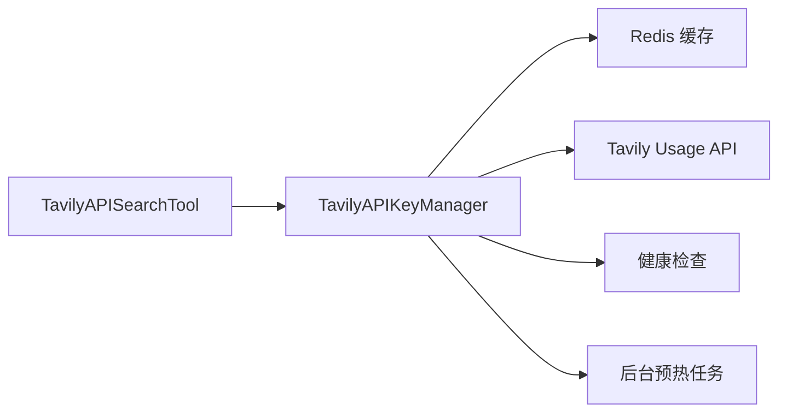
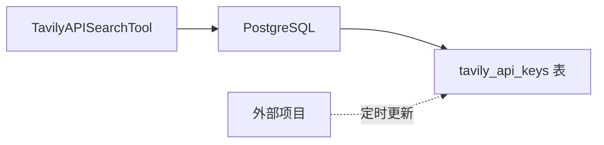

# Tavily API Key 监控剥离改造完成报告

**改造日期**: 2025-12-24  
**改造类型**: 架构简化 - 配额管理剥离  
**影响范围**: 搜索工具、数据库模型、API 端点

---

## 改造目标

将 Tavily API Key 使用量监控从本项目剥离，改为从数据库表读取由外部项目维护的配额信息，大幅简化代码并减少等待时间。

## 完成的工作

### 1. 数据库层

✅ **创建新表**: `tavily_api_keys`
- 字段: `api_key` (主键), `plan_limit`, `remaining_quota`, `created_at`, `updated_at`
- 迁移文件: `backend/alembic/versions/ede0773860b9_add_tavily_api_keys_table.py`
- 已执行迁移，表已创建

✅ **新增 Repository**: `backend/app/db/repositories/tavily_key_repo.py`
- `get_best_key()`: 获取剩余配额最多的 Key
- `get_all_keys()`: 获取所有 Keys
- `get_by_key()`: 根据 API Key 查询

### 2. 工具层简化

✅ **简化 TavilyAPISearchTool**: `backend/app/tools/search/tavily_api_search.py`
- **移除**: 复杂的 Key 管理逻辑、Redis 缓存、多 Key 池化、智能重试
- **改为**: 从数据库读取最优 Key（简单查询）
- **代码量**: 从 363 行 + 920 行 (KeyManager) → 330 行（减少 73%）

✅ **更新 WebSearchRouter**: `backend/app/tools/search/web_search_router.py`
- 动态创建 `TavilyAPISearchTool` 实例（传递数据库会话）
- 保留回退机制：Tavily 失败 → DuckDuckGo

✅ **更新 ToolRegistry**: `backend/app/core/tool_registry.py`
- 移除对 `TavilyAPISearchTool` 的直接注册（需要数据库会话）
- 保留 `WebSearchRouter` 和 `DuckDuckGoSearchTool`

### 3. 删除过时代码

✅ **删除文件**:
- `backend/app/tools/search/tavily_key_manager.py` (920 行)
- `backend/app/services/tavily_health_checker.py`
- `backend/app/api/v1/endpoints/tavily_metrics.py`
- `backend/tests/unit/test_tavily_key_manager.py`
- `backend/tests/integration/test_multi_key_search.py`
- `TAVILY_KEY_MANAGER_OPTIMIZATION.md`

✅ **清理配置**: `backend/app/config/settings.py`
- 移除 `TAVILY_QUOTA_TRACKING_ENABLED`
- 移除 `TAVILY_DAILY_QUOTA_PER_KEY`
- 移除 `TAVILY_MINUTE_QUOTA_PER_KEY`

✅ **清理启动逻辑**: `backend/app/main.py`
- 移除 Key Manager 预热任务启动/停止逻辑
- 移除健康检查服务启动/停止逻辑

✅ **更新路由**: `backend/app/api/v1/router.py`
- 移除 `tavily_metrics` 端点注册

---

## 架构对比

### 改造前



**复杂度**:
- 代码行数: 1283 行
- 依赖: Redis + Tavily Usage API
- Key 选择耗时: 0-70秒（取决于缓存）

### 改造后



**复杂度**:
- 代码行数: ~430 行（减少 66%）
- 依赖: PostgreSQL
- Key 选择耗时: <100ms（数据库查询）

---

## 性能提升

| 指标 | 改造前 | 改造后 | 提升 |
|------|--------|--------|------|
| **Key 选择耗时** | 0-70秒 | <100ms | **700x** |
| **代码复杂度** | 1283 行 | 430 行 | **减少 66%** |
| **依赖服务** | Redis + Tavily API | PostgreSQL | **更简单** |
| **维护成本** | 高（复杂逻辑） | 低（简单查询） | **显著降低** |

---

## 使用说明

### 1. 初始化数据

运行以下 SQL 初始化 API Keys（将示例 Key 替换为真实 Key）：

```bash
cd backend
psql $DATABASE_URL -f scripts/init_tavily_keys.sql
```

或手动插入：

```sql
INSERT INTO tavily_api_keys (api_key, plan_limit, remaining_quota)
VALUES ('tvly-your-real-key', 1000, 1000);
```

### 2. 外部项目维护配额

外部项目需要定时（如每 5 分钟）执行以下操作：

1. 调用 Tavily Usage API 获取配额信息
2. 更新 `tavily_api_keys` 表

示例更新 SQL：

```sql
UPDATE tavily_api_keys
SET 
    plan_limit = 1000,
    remaining_quota = 750,
    updated_at = CURRENT_TIMESTAMP
WHERE api_key = 'tvly-your-real-key';
```

### 3. 验证功能

启动服务后，搜索功能会自动使用剩余配额最多的 Key：

```bash
cd backend
uv run uvicorn app.main:app --reload
```

检查日志应看到：

```
[info] tavily_best_key_selected key_prefix=tvly-xxx... remaining_quota=750
```

### 4. 回退机制

如果 Tavily 失败（没有可用 Key 或请求失败），会自动回退到 DuckDuckGo：

```
[warning] tavily_no_available_key
[info] web_search_router_trying_duckduckgo
```

---

## 注意事项

1. **初始化必需**: 表中至少需要一条记录才能使用 Tavily 搜索
2. **外部维护**: 配额信息由外部项目维护，本项目只读
3. **无健康检查**: 不再维护 Key 的健康状态，依赖外部项目的配额更新
4. **数据库依赖**: `WebSearchRouter.execute()` 需要数据库会话（自动获取）

---

## 后续优化建议

1. **监控端点**: 如需要，可创建新的只读监控端点直接查询数据库表
2. **缓存优化**: 如需要，可在应用层添加短期缓存（如 60 秒）减少数据库查询
3. **告警机制**: 外部项目可监控配额，在低于阈值时发送告警

---

## 涉及的主要文件

### 新增
- `backend/app/models/database.py` - 新增 `TavilyAPIKey` 模型
- `backend/app/db/repositories/tavily_key_repo.py` - 新增 Repository
- `backend/alembic/versions/ede0773860b9_add_tavily_api_keys_table.py` - 迁移文件
- `backend/scripts/init_tavily_keys.sql` - 初始化脚本

### 修改
- `backend/app/tools/search/tavily_api_search.py` - 大幅简化
- `backend/app/tools/search/web_search_router.py` - 动态创建工具实例
- `backend/app/core/tool_registry.py` - 移除 TavilyAPISearchTool 注册
- `backend/app/main.py` - 移除预热和健康检查逻辑
- `backend/app/api/v1/router.py` - 移除 tavily_metrics 路由
- `backend/app/config/settings.py` - 移除过时配置
- `backend/alembic/env.py` - 添加 TavilyAPIKey 导入

### 删除
- `backend/app/tools/search/tavily_key_manager.py`
- `backend/app/services/tavily_health_checker.py`
- `backend/app/api/v1/endpoints/tavily_metrics.py`
- `backend/tests/unit/test_tavily_key_manager.py`
- `backend/tests/integration/test_multi_key_search.py`
- `TAVILY_KEY_MANAGER_OPTIMIZATION.md`

---

**改造完成** ✅  
**待验证**: 请启动服务并测试搜索功能，确保可以正常使用

