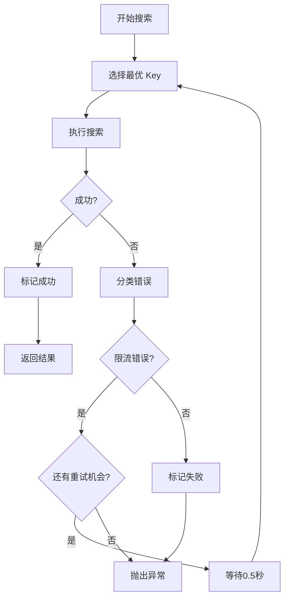

# Tavily Multi-API-Key Setup Guide

## 概述

本文档介绍如何配置和使用 Tavily API 多 Key 池化管理功能，以提升资源推荐质量和系统可靠性。

## 核心功能

### 1. 多 API Key 池化管理
- 支持配置多个 Tavily API Keys
- 自动在 Keys 之间轮换
- 智能选择最优 Key（基于剩余配额和成功率）

### 2. 配额追踪（Quota Tracking）
- **通过 Tavily API `/usage` 端点获取真实配额**
- 自动查询每个 Key 的实际剩余配额
- 配额信息缓存（60 秒 TTL，减少 API 调用）
- 本地追踪成功率和健康状态

### 3. 智能重试（Smart Retry）
- 遇到限流（429）自动切换到其他 Key
- 非限流错误直接抛出（不浪费重试机会）
- 最多重试 3 次或 Key 总数（取较小值）

### 4. 健康检查（Health Check）
- 后台定期检查所有 Keys 的健康状态
- 自动标记不健康的 Key
- 不健康的 Key 会被跳过

### 5. 监控 API（Monitoring API）
- 查看所有 Keys 的使用统计
- 查看健康状态
- 手动触发健康检查

---

## 配置步骤

### 步骤 1: 配置环境变量

在 `backend/.env` 文件中配置多个 Tavily API Keys：

#### 方式 1: JSON 数组格式（推荐）

```bash
TAVILY_API_KEY_LIST=["tvly-key1-abc123", "tvly-key2-def456", "tvly-key3-ghi789"]
```

#### 方式 2: 逗号分隔格式

```bash
TAVILY_API_KEY_LIST=tvly-key1-abc123,tvly-key2-def456,tvly-key3-ghi789
```

#### 方式 3: 单个 Key（向后兼容）

```bash
TAVILY_API_KEY=tvly-your-single-key
```

### 步骤 2: 配置配额追踪（可选）

```bash
# 是否启用配额追踪（默认: true）
TAVILY_QUOTA_TRACKING_ENABLED=true

# 注意：配额信息现在从 Tavily API 自动获取，无需手动配置
# 系统会自动调用 https://api.tavily.com/usage 获取每个 Key 的真实配额
```

### 步骤 3: 确保 Redis 运行

配额追踪和健康检查需要 Redis 支持：

```bash
# 检查 Redis 是否运行
redis-cli ping
# 应该返回: PONG

# 如果未运行，启动 Redis
redis-server
```

### 步骤 4: 启动应用

```bash
cd backend
uvicorn app.main:app --reload
```

健康检查服务会在应用启动时自动启动。

---

## 使用方式

### 自动使用

在 `ResourceRecommenderAgent` 中使用搜索功能时，系统会自动：
1. 选择最优 Key
2. 追踪配额使用
3. 遇到限流时自动切换
4. 更新健康状态

**无需任何代码修改**，现有的搜索功能会自动使用多 Key 池化。

### 监控 API

#### 1. 查看所有 Keys 的使用统计

```bash
GET /api/v1/tavily/metrics
```

**响应示例**:

```json
{
  "total_keys": 3,
  "healthy_keys": 3,
  "unhealthy_keys": 0,
  "overall_stats": {
    "total_calls": 250,
    "total_success": 245,
    "total_failed": 5,
    "success_rate": 98.0
  },
  "keys": [
    {
      "key_id": "abc12345",
      "key_index": 0,
      "is_healthy": true,
      "usage": {
        "total_calls": 100,
        "success_calls": 98,
        "failed_calls": 2,
        "rate_limit_errors": 1,
        "success_rate": 98.0
      },
      "quota": {
        "key": {
          "usage": 150,
          "limit": 1000,
          "remaining": 850
        },
        "plan": {
          "name": "Bootstrap",
          "usage": 500,
          "limit": 15000,
          "remaining": 14500
        },
        "paygo": {
          "usage": 25,
          "limit": 100
        },
        "total_remaining": 850
      },
      "last_used_at": "2025-12-22T10:30:00Z"
    },
    // ... 其他 Keys
  ],
  "quota_tracking_enabled": true
}
```

**配额信息说明**:
- `key`: API Key 级别的配额（每个 Key 的独立限制）
- `plan`: 账户计划级别的配额（所有 Keys 共享）
- `paygo`: Pay-as-you-go 配额
- `total_remaining`: 实际可用配额（取 Key 和计划的最小值）

#### 2. 查看健康状态

```bash
GET /api/v1/tavily/health
```

**响应示例**:

```json
{
  "total_keys": 3,
  "healthy_keys": 3,
  "unhealthy_keys": 0,
  "all_healthy": true,
  "keys": [
    {
      "key_id": "abc12345",
      "key_index": 0,
      "is_healthy": true,
      "quota_exhausted": false,
      "remaining_quota": 850,
      "rate_limit_errors": 1
    },
    // ... 其他 Keys
  ]
}
```

#### 3. 手动触发健康检查

```bash
POST /api/v1/tavily/health-check
```

#### 4. 查看配置信息

```bash
GET /api/v1/tavily/config
```

#### 5. 刷新配额信息（强制重新获取）

```bash
POST /api/v1/tavily/refresh-quota
```

**用途**: 强制从 Tavily API 重新获取所有 Keys 的配额信息（跳过缓存）

---

## 工作原理

### 1. Key 选择策略

当需要执行搜索时，系统会：

#### a) 配额追踪启用时（默认）

1. 获取所有 Keys 的统计信息
2. **从 Tavily API 获取真实配额**（使用缓存，60 秒 TTL）
3. 过滤不健康的 Keys
4. 过滤配额已用尽的 Keys
5. 计算每个 Key 的优先级分数：
   - **剩余配额权重 70%**：基于 Tavily API 返回的真实剩余配额
   - **成功率权重 20%**：成功率越高，分数越高
   - **最近使用时间权重 10%**：越久未使用，分数越高（鼓励轮换）
6. 返回分数最高的 Key

#### b) 配额追踪禁用时

使用简单的 Round Robin（轮询）策略：
- 按顺序轮流使用每个 Key
- 无状态，不依赖 Redis

### 2. 智能重试流程



### 3. 健康检查机制

- **执行频率**：每 5 分钟一次
- **检查方法**：使用轻量级搜索测试 Key
- **判定标准**：
  - ✅ 健康：搜索成功或遇到限流（限流说明 Key 有效）
  - ❌ 不健康：最近 5 分钟内 3 次以上限流、成功率 < 50%

---

## 预期效果

### 1. 提升资源推荐质量

- **旧方案**: 单 Key → 每分钟最多 100 次搜索 → 限流阻塞
- **新方案**: N 个 Keys → 每分钟最多 N×100 次搜索 → 更少限流

### 2. 提高系统可靠性

- **旧方案**: 单点故障（Key 失效或限流 → 所有搜索失败）
- **新方案**: 自动故障转移 → 高可用性

### 3. 成本优化

- 配额感知选择 → 均衡使用所有 Keys → 避免浪费
- 健康检查 → 及时发现失效 Key → 避免无效调用

---

## 故障排查

### 问题 1: 所有 Keys 都限流

**症状**: 日志中显示 "所有 Tavily API Keys 都不可用"

**解决方案**:
1. 检查是否配置了足够的 Keys
2. 检查 Keys 的配额是否已用尽
3. 系统会自动回退到 DuckDuckGo（由 `WebSearchRouter` 处理）

### 问题 2: Redis 连接失败

**症状**: 日志中显示 Redis 相关错误

**解决方案**:
1. 检查 Redis 是否运行：`redis-cli ping`
2. 系统会自动降级为 Round Robin（无状态）
3. 不影响搜索功能，但无法缓存配额信息（每次都会调用 Tavily API）

### 问题 4: 配额信息不准确

**症状**: 监控 API 显示的配额与实际不符

**解决方案**:
1. 配额信息有 60 秒缓存，可能存在延迟
2. 调用 `POST /api/v1/tavily/refresh-quota` 强制刷新
3. 检查 Tavily API 是否正常：`curl -H "Authorization: Bearer YOUR_KEY" https://api.tavily.com/usage`

### 问题 3: 健康检查未启动

**症状**: 日志中没有 "tavily_health_checker_started" 消息

**解决方案**:
1. 检查是否配置了 `TAVILY_API_KEY_LIST` 或 `TAVILY_API_KEY`
2. 查看日志中的 "tavily_health_checker_start_failed" 错误信息
3. 健康检查启动失败不会影响主应用

---

## 最佳实践

### 1. Key 数量建议

- **最少**: 2 个（实现基本的故障转移）
- **推荐**: 3-5 个（平衡成本和可靠性）
- **最多**: 根据实际需求，无上限

### 2. 配额管理

**无需手动配置配额**，系统会自动从 Tavily API 获取：
- 每个 Key 的独立配额（`key.limit`）
- 账户计划配额（`plan.limit`）
- Pay-as-you-go 配额（`paygo.limit`）

配额信息会自动缓存 60 秒，减少 API 调用。

### 3. 监控建议

- 定期查看 `/api/v1/tavily/metrics` 了解使用情况
- 关注 `unhealthy_keys` 数量，及时替换失效 Key
- 监控 `total_remaining`，避免配额用尽
- 使用 `/api/v1/tavily/refresh-quota` 强制刷新配额信息

### 4. Redis 维护

- 定期检查 Redis 内存使用
- 配额信息缓存会自动过期（60 秒 TTL）
- 本地统计数据（成功率等）会持久保存

### 5. Tavily API 配额查询

系统会自动调用 Tavily API 获取配额，您也可以手动查询：

```bash
curl --request GET \
  --url https://api.tavily.com/usage \
  --header 'Authorization: Bearer YOUR_TAVILY_API_KEY'
```

**响应示例**:
```json
{
  "key": {
    "usage": 150,
    "limit": 1000
  },
  "account": {
    "current_plan": "Bootstrap",
    "plan_usage": 500,
    "plan_limit": 15000,
    "paygo_usage": 25,
    "paygo_limit": 100
  }
}
```

---

## 技术架构

```
┌──────────────────────────────────────────┐
│     ResourceRecommenderAgent             │
└────────────────┬─────────────────────────┘
                 │
                 ▼
┌──────────────────────────────────────────┐
│         WebSearchRouter                  │
└────────────────┬─────────────────────────┘
                 │
                 ▼
┌──────────────────────────────────────────┐
│       TavilyAPISearchTool                │
│  ┌────────────────────────────────────┐  │
│  │   TavilyAPIKeyManager              │  │
│  │   - get_best_key()                 │  │
│  │   - mark_key_used()                │  │
│  │   - check_key_health()             │  │
│  └────────────────┬───────────────────┘  │
└────────────────────┼───────────────────────┘
                     │
                     ▼
              ┌──────────────┐
              │    Redis     │
              │  (配额追踪)  │
              └──────────────┘
```

---

## 相关文件

### 核心实现
- `backend/app/config/settings.py` - 配置定义
- `backend/app/tools/search/tavily_key_manager.py` - Key Manager 核心逻辑
- `backend/app/tools/search/tavily_api_search.py` - 搜索工具（集成 Key Manager）
- `backend/app/services/tavily_health_checker.py` - 健康检查服务
- `backend/app/db/redis_client.py` - Redis 客户端

### API 端点
- `backend/app/api/v1/endpoints/tavily_metrics.py` - 监控 API

### 测试
- `backend/tests/unit/test_tavily_key_manager.py` - 单元测试
- `backend/tests/integration/test_multi_key_search.py` - 集成测试

---

## 支持

如有问题，请查看：
1. 应用日志中的 `tavily_*` 相关消息
2. Redis 日志
3. 监控 API 返回的统计信息

祝您使用愉快！🎉

