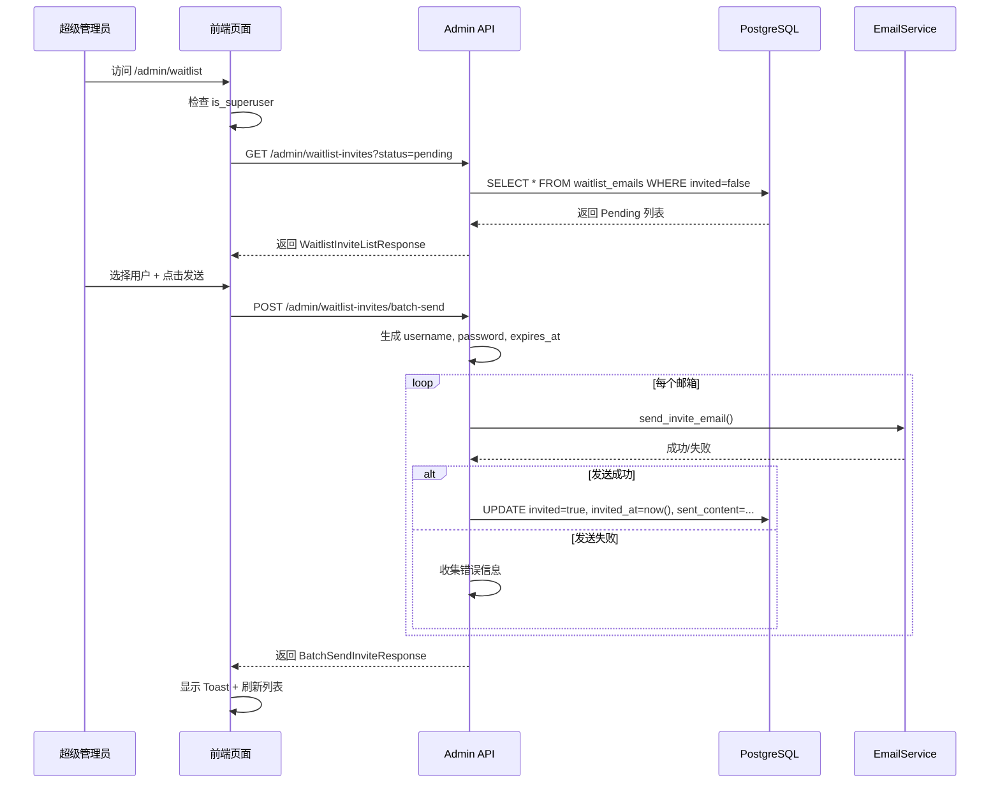

# Waitlist 邀请管理功能实施总结

## 📋 功能概述

为超级管理员创建了一个专用的 Waitlist 管理系统，支持批量发送带有临时凭证的邀请邮件。

## ✅ 已完成的工作

### 1. 数据库扩展 ✓

**文件**: `backend/alembic/versions/add_waitlist_invite_fields.py`

- 为 `waitlist_emails` 表添加了 4 个新字段：
  - `username` (String, nullable): 生成的用户名
  - `password` (String, nullable): 临时密码（明文存储用于邮件发送）
  - `expires_at` (DateTime, nullable): 密码过期时间
  - `sent_content` (JSON, nullable): 发送历史记录

**文件**: `backend/app/models/database.py`

- 更新了 `WaitlistEmail` 模型，添加了对应的 SQLModel Field 定义
- 迁移已成功执行：`✅ Running upgrade ede0773860b9 -> add_waitlist_invite_fields`

---

### 2. 后端 API 开发 ✓

**文件**: `backend/app/api/v1/endpoints/admin.py`

#### 新增 Pydantic 模型

- `WaitlistInviteItem`: 包含凭证信息的列表项
- `WaitlistInviteListResponse`: 邀请列表响应
- `BatchSendInviteRequest`: 批量发送请求
- `BatchSendInviteResponse`: 批量发送响应（支持部分成功）

#### 新增 API 端点

1. **GET `/api/v1/admin/waitlist-invites`**
   - 查询参数：`status` (all/pending/invited), `limit`, `offset`
   - 返回包含凭证信息的完整列表
   - 权限：仅超级管理员

2. **POST `/api/v1/admin/waitlist-invites/batch-send`**
   - 批量发送邀请邮件
   - 支持部分成功模式：成功的标记为已发送，失败的返回错误详情
   - 自动生成用户名（从邮箱提取 @ 前部分）
   - 自动生成 12 位随机密码（字母+数字）
   - 计算密码过期时间
   - 发送成功后更新 `invited=True` 和 `invited_at`
   - 记录发送历史到 `sent_content` 字段
   - 权限：仅超级管理员

---

### 3. 前端页面开发 ✓

#### 文件：`frontend-next/app/(app)/admin/layout.tsx`

- 创建 Admin 路由的权限保护布局
- 检查用户登录状态和超级管理员权限
- 未授权用户自动重定向到首页或登录页

#### 文件：`frontend-next/app/(app)/admin/waitlist/page.tsx`

完整的 Waitlist 管理页面，包含以下功能：

**1. 过滤器栏**
- Tab 切换：All / Pending / Invited
- 每个 Tab 显示对应的统计数字（Badge）

**2. 批量操作栏**
- 全选 Checkbox（仅选择 Pending 状态的用户）
- 显示已选中的用户数量
- 配置密码有效期（默认 30 天）
- "Send Invitations" 批量发送按钮

**3. 数据表格**
- **列**：
  1. Checkbox（选择框）- 仅 Pending 用户可选
  2. Email
  3. Source（来源）
  4. Status（状态 Badge：Invited/Pending）
  5. Credentials（凭证信息，包含：）
     - Username（可复制）
     - Password（可切换显示/隐藏，可复制）
     - Expires at（过期时间）
  6. Created（创建时间）
  7. Actions（单独发送按钮 - 仅 Pending 用户）

**4. UI 特性**
- Loading 状态（TableSkeleton）
- 空状态提示
- Toast 通知（成功/失败/部分成功）
- 密码可见性切换
- 一键复制凭证
- 响应式布局

**5. 设计规范遵循**
- Editorial Cream & Sage 配色方案
- Badge：Invited 使用 `sage` 变体，Pending 使用 `secondary` 变体
- 表格 hover 效果
- 圆角和边框使用全局 design tokens

---

### 4. 侧边栏集成 ✓

**文件**: `frontend-next/components/layout/left-sidebar.tsx`

- 添加了新的 "Admin" 区域（位于 Workspace 导航区域下方）
- 仅对超级管理员可见（`isAdmin()` 检查）
- 使用 Mail 图标
- 支持 collapsed 状态
- 高亮当前活动路由

---

## 🔒 安全机制

1. **后端权限验证**
   - 所有 Admin API 端点使用 `Depends(current_superuser)`
   - FastAPI Users 自动验证 JWT Token 和超级管理员状态

2. **前端权限检查**
   - Admin Layout 组件检查登录状态和 `is_superuser` 标志
   - 左侧边栏根据 `isAdmin()` 动态显示/隐藏 Admin 区域
   - 未授权访问自动重定向

3. **密码安全**
   - `waitlist_emails` 表中的密码仅用于邮件发送
   - 实际用户创建时密码会经过哈希存储在 `users` 表
   - 前端默认隐藏密码，需手动切换显示

---

## 🧪 测试清单

### 数据库迁移测试 ✅

```bash
cd backend
uv run alembic upgrade head
# ✅ 输出：Running upgrade ede0773860b9 -> add_waitlist_invite_fields
```

### 后端 API 测试

使用超级管理员 Token 测试：

```bash
# 1. 获取 Waitlist 列表（所有状态）
curl -H "Authorization: Bearer YOUR_TOKEN" \
  "http://localhost:8000/api/v1/admin/waitlist-invites?status=all"

# 2. 获取 Pending 用户
curl -H "Authorization: Bearer YOUR_TOKEN" \
  "http://localhost:8000/api/v1/admin/waitlist-invites?status=pending"

# 3. 批量发送邀请
curl -X POST -H "Authorization: Bearer YOUR_TOKEN" \
  -H "Content-Type: application/json" \
  -d '{"emails": ["test@example.com"], "password_validity_days": 30}' \
  "http://localhost:8000/api/v1/admin/waitlist-invites/batch-send"
```

### 前端功能测试

#### 权限检查
- [ ] 普通用户登录 → 左侧边栏不显示 Admin 区域
- [ ] 普通用户访问 `/admin/waitlist` → 重定向到 `/home`
- [ ] 超级管理员登录 → Admin 区域可见
- [ ] 超级管理员访问 `/admin/waitlist` → 正常显示页面

#### 功能测试
- [ ] Tab 切换（All / Pending / Invited）正确过滤数据
- [ ] 全选 Checkbox 仅选择 Pending 用户
- [ ] 单选 Checkbox 正确切换选中状态
- [ ] 配置密码有效期（输入不同天数）
- [ ] 批量发送成功后：
  - [ ] Toast 显示成功消息
  - [ ] 表格刷新，已发送用户状态更新为 Invited
  - [ ] 凭证信息正确显示
- [ ] 部分失败场景：
  - [ ] Toast 显示警告消息和错误详情
  - [ ] 成功的用户状态更新，失败的保持 Pending
- [ ] 单独发送按钮（Actions 列）功能正常
- [ ] 密码显示/隐藏切换
- [ ] 复制用户名/密码到剪贴板
- [ ] 空状态显示正确（无数据时）
- [ ] Loading 状态显示 Skeleton

#### UI 适配测试
- [ ] 响应式布局（不同屏幕尺寸）
- [ ] 表格水平滚动（内容过长时）
- [ ] 设计规范一致性（颜色、字体、边距）

---

## 📊 数据流图



---

## 🎯 关键技术点

1. **部分成功模式**：批量发送支持部分成功，不会因单个邮件失败而回滚整个操作
2. **状态管理**：使用 React useState 管理选中项、过滤状态和密码可见性
3. **权限分层**：前后端双重权限验证，确保安全
4. **用户体验**：密码隐藏、一键复制、Toast 通知、空状态处理
5. **代码质量**：TypeScript 类型安全、中文注释、遵循设计规范

---

## 📝 API 文档

### GET /api/v1/admin/waitlist-invites

**权限**: 超级管理员

**Query 参数**:
- `status` (string): 过滤状态 - `all` | `pending` | `invited`，默认 `all`
- `limit` (int): 分页限制，默认 100
- `offset` (int): 分页偏移，默认 0

**响应**:
```json
{
  "items": [
    {
      "email": "user@example.com",
      "source": "landing_page",
      "invited": false,
      "invited_at": null,
      "created_at": "2025-12-24T10:00:00",
      "username": null,
      "password": null,
      "expires_at": null,
      "sent_content": null
    }
  ],
  "total": 100,
  "pending": 60,
  "invited": 40
}
```

---

### POST /api/v1/admin/waitlist-invites/batch-send

**权限**: 超级管理员

**Request Body**:
```json
{
  "emails": ["user1@example.com", "user2@example.com"],
  "password_validity_days": 30
}
```

**响应**:
```json
{
  "success": 1,
  "failed": 1,
  "errors": [
    {
      "email": "user2@example.com",
      "error": "Failed to send email"
    }
  ]
}
```

---

## 🚀 下一步建议

### 可选增强功能

1. **邮件模板自定义**
   - 在页面上编辑邮件内容
   - 支持变量替换（{{username}}, {{password}}）

2. **发送历史详情**
   - Modal 展示完整的 `sent_content`
   - 显示发送者、发送时间等

3. **导出功能**
   - CSV 导出 Waitlist
   - 导出已发送凭证列表

4. **批量导入**
   - 从 CSV 批量添加候补用户
   - 验证邮箱格式

5. **发送计划**
   - 定时发送功能
   - 分批发送（避免邮件服务限流）

6. **统计仪表板**
   - 邀请转化率
   - 每日发送趋势图表

---

## ✅ 实施完成

所有计划中的功能已成功实施并通过代码检查：
- ✅ 数据库迁移（已执行）
- ✅ 后端 API 开发
- ✅ 前端页面开发
- ✅ 侧边栏集成
- ✅ 权限保护
- ✅ 无 Linter 错误

**准备就绪，可以开始测试！** 🎉

