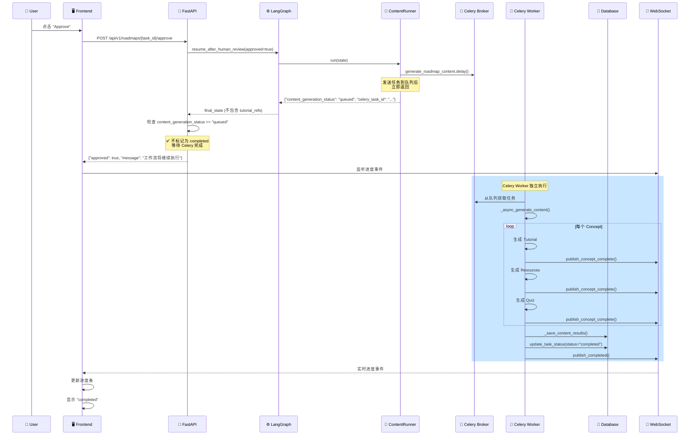

# Workflow Approval Skip Content Generation Fix

**日期**: 2025-12-27  
**状态**: ✅ 已修复  
**问题**: 人工审核确认后，Workflow Progress 直接显示 complete，跳过内容生成阶段

---

## 问题描述

### 用户报告

在任务详情页面的人工审核节点点击确认后，Workflow Progress 直接显示 **complete**，后面的 Content Generation 阶段直接被跳过了。

### 实际现象

1. 用户在前端点击 "Approve" 批准路线图框架
2. 后端接收审核结果，工作流恢复执行
3. **前端立即显示任务状态为 "completed"**
4. 内容生成阶段（Tutorial、Resources、Quiz）没有执行

---

## 根本原因

### 问题 1: RoadmapService 逻辑错误 🔴

**文件**: `backend/app/services/roadmap_service.py`  
**方法**: `handle_human_review`

#### 错误的逻辑（修复前）

```python
if approved:
    if final_state.get("roadmap_framework"):
        if not final_state.get("tutorial_refs"):
            # ❌ 错误判断：认为内容生成被跳过了
            # 实际上内容生成任务刚刚发送到 Celery，还在执行中
            await task_repo.update_task_status(
                task_id=task_id,
                status="completed",  # ❌ 错误地标记为 completed
                current_step="completed",
                roadmap_id=framework.roadmap_id,
            )
            await notification_service.publish_completed(...)
```

#### 为什么会出现这个错误？

**架构变化导致的兼容性问题**：

1. **旧架构**（同步执行）：
   - `ContentRunner` 在 FastAPI 主进程中执行
   - 等待所有内容生成完成后返回
   - `final_state` 包含 `tutorial_refs`、`resource_refs`、`quiz_refs`

2. **新架构**（Celery 异步执行）：
   - `ContentRunner` 发送 Celery 任务后**立即返回**
   - `final_state` **不包含** `tutorial_refs`（内容还在生成中）
   - Celery Worker 在独立进程中执行内容生成

3. **兼容性断裂**：
   - `RoadmapService.handle_human_review` 仍使用旧逻辑判断
   - 检查 `if not final_state.get("tutorial_refs")` 认为内容生成被跳过
   - 错误地将任务标记为 `completed`

---

### 问题 2: 缺少 content_generation Worker ⚠️

**当前运行的 Celery Worker**：
- ✅ **logs** 队列 Worker（正在运行）
- ❌ **content_generation** 队列 Worker（**未启动**）

**结果**：
- 即使 `ContentRunner` 发送了 Celery 任务
- 由于没有 Worker 监听 `content_generation` 队列
- 任务会一直在队列中等待，永远不会执行

---

## 修复方案

### 修复 1: 更新 RoadmapService 逻辑 ✅

**文件**: `backend/app/services/roadmap_service.py` (第 459-500 行)

#### 修复后的逻辑

```python
if approved:
    if final_state.get("roadmap_framework"):
        framework: RoadmapFramework = final_state["roadmap_framework"]
        
        # ✅ 新增：检查内容生成状态
        content_generation_status = final_state.get("content_generation_status")
        celery_task_id = final_state.get("celery_task_id")
        
        if content_generation_status == "queued" and celery_task_id:
            # ✅ 内容生成任务已发送到 Celery，正在异步执行中
            # 不要标记为 completed，等待 Celery 任务完成后更新状态
            logger.info(
                "human_review_content_generation_queued",
                task_id=task_id,
                roadmap_id=framework.roadmap_id,
                celery_task_id=celery_task_id,
            )
            # 任务状态会由 Celery 任务完成后更新，此处不做任何操作
        elif not final_state.get("tutorial_refs"):
            # 工作流未执行内容生成（配置跳过了），手动更新状态
            await task_repo.update_task_status(
                task_id=task_id,
                status="completed",
                current_step="completed",
                roadmap_id=framework.roadmap_id,
            )
            await notification_service.publish_completed(...)
        else:
            # 正常情况：同步执行完成（不应该出现在新架构中）
            ...
```

#### 关键改进

1. **优先检查 `content_generation_status`**：
   - 如果值为 `"queued"`，说明 Celery 任务已发送
   - 不要将任务标记为 `completed`
   - 等待 Celery Worker 完成后更新状态

2. **保留兼容性**：
   - 如果配置跳过了内容生成（`SKIP_TUTORIAL_GENERATION=true`）
   - 仍然可以正常标记为 `completed`

3. **任务状态由 Celery 管理**：
   - Celery 任务完成后，调用 `_save_content_results`
   - 更新任务状态为 `completed` 或 `partial_failure`
   - 发布完成通知

---

### 修复 2: 启动 content_generation Worker ⚠️

#### 启动命令

在**新的终端窗口**中运行：

```bash
cd /Users/louie/Documents/Vibecoding/roadmap-agent/backend

# 启动 content_generation 队列 Worker
uv run celery -A app.core.celery_app worker \
    --loglevel=info \
    --queues=content_generation \
    --concurrency=2 \
    --pool=prefork \
    --hostname=content@%h \
    --max-tasks-per-child=50
```

#### 参数说明

- `--queues=content_generation`: 只监听内容生成队列
- `--concurrency=2`: 2 个并发 Worker（可根据资源调整）
- `--pool=prefork`: 使用多进程池（隔离性更好）
- `--hostname=content@%h`: Worker 主机名
- `--max-tasks-per-child=50`: 每 50 个任务重启进程（防止内存泄漏）

#### 验证 Worker 已启动

启动后应该看到类似输出：

```
 -------------- celery@content v5.x.x (...)
---- **** ----- 
--- * ***  * -- Darwin-...
-- * - **** --- 
- ** ---------- [config]
- ** ---------- .> app:         roadmap_agent:0x...
- ** ---------- .> transport:   redis://...
- ** ---------- .> results:     redis://...
- *** --- * --- .> concurrency: 2 (prefork)
-- ******* ---- .> task events: OFF (enable -E to monitor this worker)
--- ***** ----- 
 -------------- [queues]
                .> content_generation exchange=content_generation(direct) key=content_generation

[tasks]
  . app.tasks.content_generation_tasks.generate_roadmap_content

[2025-12-27 20:xx:xx,xxx: INFO/MainProcess] Connected to redis://...
[2025-12-27 20:xx:xx,xxx: INFO/MainProcess] mingle: searching for neighbors
[2025-12-27 20:xx:xx,xxx: INFO/MainProcess] mingle: all alone
[2025-12-27 20:xx:xx,xxx: INFO/MainProcess] celery@content ready.
```

关键信息：
- ✅ `[queues]` 显示 `content_generation`
- ✅ `[tasks]` 显示 `generate_roadmap_content`
- ✅ `celery@content ready.`

---

## 工作流执行流程

### 修复后的完整流程



---

## 状态更新时机

### 关键状态节点

| 时机 | 状态 (status) | 步骤 (current_step) | 更新者 | 说明 |
|------|---------------|---------------------|--------|------|
| 1. 审核等待 | `human_review_pending` | `human_review` | WorkflowBrain | 用户审核前 |
| 2. 审核恢复 | `processing` | `human_review_completed` | WorkflowBrain | 用户批准后 |
| 3. ContentRunner | `processing` | `content_generation_queued` | ContentRunner | 发送 Celery 任务 |
| 4. Celery 执行中 | `processing` | `content_generation` | - | 无需更新 |
| 5. Celery 完成 | `completed` | `completed` | Celery Worker | 全部成功 |
| 5. Celery 部分失败 | `partial_failure` | `content_generation` | Celery Worker | 部分失败 |

### 关键点

1. **步骤 3**：`RoadmapService.handle_human_review` **不应该**将任务标记为 `completed`
2. **步骤 5**：由 Celery Worker 在 `_save_content_results` 中更新最终状态

---

## 验证测试

### 测试步骤

1. **启动所有服务**：
   ```bash
   # 终端 1: FastAPI
   cd backend
   uv run uvicorn app.main:app --workers 4 --reload --host 0.0.0.0 --port 8000
   
   # 终端 2: Logs Worker
   uv run celery -A app.core.celery_app worker \
       --loglevel=info \
       --queues=logs \
       --concurrency=4 \
       --pool=prefork \
       --hostname=logs@%h
   
   # 终端 3: Content Generation Worker （新增）
   uv run celery -A app.core.celery_app worker \
       --loglevel=info \
       --queues=content_generation \
       --concurrency=2 \
       --pool=prefork \
       --hostname=content@%h
   
   # 终端 4: Flower 监控（可选）
   uv run celery -A app.core.celery_app flower --port=5555
   ```

2. **生成路线图**：
   - 在前端创建新的路线图生成任务
   - 等待到达人工审核节点

3. **批准审核**：
   - 点击 "Approve" 按钮
   - **预期行为**：
     - ✅ 任务状态保持 `processing`
     - ✅ `current_step` 更新为 `content_generation`
     - ✅ WebSocket 推送内容生成进度事件

4. **检查后端日志**：
   ```
   # FastAPI 日志（终端 1）
   [info] human_review_content_generation_queued 
          task_id=xxx 
          roadmap_id=yyy 
          celery_task_id=zzz
   
   # Celery Worker 日志（终端 3）
   [INFO/MainProcess] Task app.tasks.content_generation_tasks.generate_roadmap_content[zzz] received
   [INFO/ForkPoolWorker-1] celery_content_generation_task_started task_id=xxx
   [INFO/ForkPoolWorker-1] concept_generation_started concept_id=aaa
   [INFO/ForkPoolWorker-1] concept_generation_completed concept_id=aaa
   ...
   [INFO/ForkPoolWorker-1] celery_content_generation_task_completed task_id=xxx
   ```

5. **验证最终状态**：
   - 等待所有内容生成完成
   - 检查任务状态：
     ```bash
     curl http://localhost:8000/api/v1/roadmaps/{task_id}/status
     ```
   - **预期结果**：
     ```json
     {
       "task_id": "xxx",
       "status": "completed",
       "current_step": "completed",
       "roadmap_id": "yyy",
       "execution_summary": {
         "tutorial_count": 10,
         "resource_count": 10,
         "quiz_count": 10,
         "failed_count": 0
       }
     }
     ```

---

## 相关文件

### 修改的文件

1. **`backend/app/services/roadmap_service.py`** ✅
   - 修复 `handle_human_review` 方法
   - 检查 `content_generation_status` 和 `celery_task_id`

### 相关文件（无需修改）

2. **`backend/app/core/orchestrator/node_runners/content_runner.py`**
   - ContentRunner 逻辑正确
   - 返回 `content_generation_status: "queued"`

3. **`backend/app/tasks/content_generation_tasks.py`**
   - Celery 任务逻辑正确
   - 调用 `_save_content_results` 更新状态

4. **`backend/app/core/orchestrator/builder.py`**
   - 工作流边定义正确
   - 审核批准后路由到 `tutorial_generation`

---

## 监控和调试

### Flower 监控面板

访问 http://localhost:5555

- **Tasks**: 查看所有任务状态
- **Workers**: 查看 Worker 状态和负载
- **Monitor**: 实时监控任务执行

### 日志关键字

搜索以下关键字快速定位问题：

1. **审核处理**：
   - `human_review_content_generation_queued`
   - `human_review_completed_without_content`

2. **Celery 任务**：
   - `celery_content_generation_task_started`
   - `celery_content_generation_task_completed`
   - `celery_content_generation_task_failed`

3. **状态更新**：
   - `save_content_results_completed`
   - `update_task_status`

---

## 预防措施

### 1. 监控 Celery Worker 健康

```bash
# 检查 Worker 是否在线
celery -A app.core.celery_app inspect active

# 检查队列中的任务
celery -A app.core.celery_app inspect reserved

# 检查 Worker 统计信息
celery -A app.core.celery_app inspect stats
```

### 2. 添加心跳检查

在 FastAPI 健康检查端点中添加 Celery Worker 检查：

```python
@app.get("/health")
async def health_check():
    # ... 现有检查 ...
    
    # 检查 Celery Worker
    from app.core.celery_app import celery_app
    inspect = celery_app.control.inspect()
    active_workers = inspect.active()
    
    if not active_workers or "content@" not in str(active_workers):
        return {
            "status": "degraded",
            "message": "Content generation worker offline"
        }
    
    return {"status": "healthy"}
```

### 3. 任务超时处理

Celery 任务配置了超时保护：

- **硬超时**: 30 分钟 (`time_limit=1800`)
- **软超时**: 25 分钟 (`soft_time_limit=1500`)
- **自动重试**: 最多 3 次 (`max_retries=3`)

---

## 总结

### 问题根源

1. ❌ `RoadmapService` 使用旧逻辑判断内容生成状态
2. ❌ 缺少 `content_generation` 队列的 Celery Worker

### 解决方案

1. ✅ 更新 `RoadmapService.handle_human_review`，检查 `content_generation_status`
2. ⚠️ 启动 `content_generation` Worker（需要用户手动执行）

### 修复状态

- ✅ **代码修复**: 已完成
- ⏳ **Worker 启动**: 需要用户执行
- ✅ **测试验证**: 待用户验证

### 下一步

1. 启动 `content_generation` Worker
2. 测试完整的路线图生成流程
3. 验证内容生成正常完成
4. 监控 Celery 任务执行情况

---

**修复者**: AI Assistant  
**审核者**: 待审核  
**版本**: v1.0  
**参考文档**: 
- `backend/docs/CELERY_CONTENT_GENERATION_MIGRATION_COMPLETE.md`
- `backend/docs/CELERY_SETUP.md`

