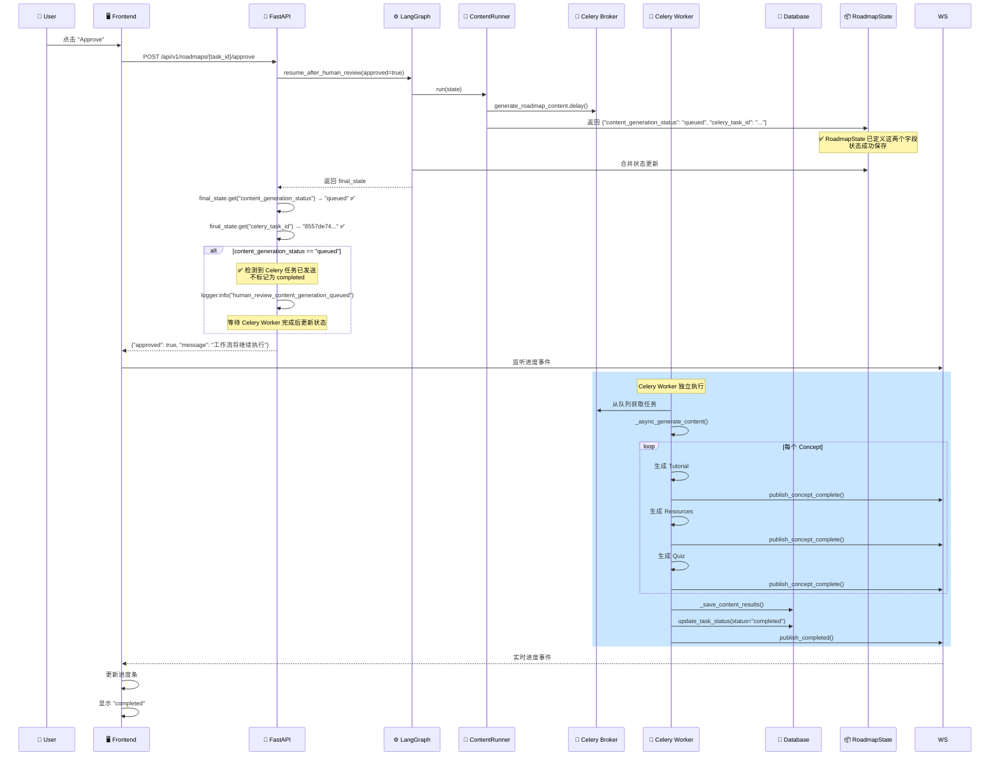

# Workflow State Missing Fields Fix

**日期**: 2025-12-27  
**状态**: ✅ 已修复  
**问题**: 人工审核确认后仍然跳过内容生成阶段直接完成，任务被错误标记为 `completed`

---

## 问题描述

### 用户报告

在任务详情页面的人工审核节点点击确认后：
1. ❌ 前端显示任务状态为 "已完成"
2. ❌ 跳过了内容生成阶段
3. ❌ 无法实时显示各个内容节点的状态信息
4. ❌ 数据库中任务状态已被更新为 `completed`

### 实际现象（从日志分析）

```
第 196 行：workflow_brain_before_node node_name=content_generation ✅
第 205 行：content_runner_dispatching_celery_task ✅
第 231 行：workflow_brain_celery_task_id_saved celery_task_id=8557de74... ✅
第 240 行：workflow_resumed_successfully final_step=content_generation_queued ✅
第 245 行：roadmap_task_updated status=completed ❌
第 248 行：human_review_completed_without_content ❌
```

**矛盾点**：
- ✅ ContentRunner **正确执行**了，Celery 任务已发送
- ✅ 工作流恢复成功，`final_step` 是 `content_generation_queued`
- ❌ 但 `RoadmapService.handle_human_review` 仍然将任务标记为 `completed`
- ❌ 并输出了 `human_review_completed_without_content` 日志

---

## 根本原因

### 问题 1: RoadmapState 缺少字段定义 🔴

**文件**: `backend/app/core/orchestrator/base.py`

#### 现象

`ContentRunner` 返回了两个关键字段：

```python
# content_runner.py (第 115-118 行)
return {
    "content_generation_status": "queued",
    "celery_task_id": celery_task.id,
    "current_step": "content_generation_queued",
    ...
}
```

但是 `RoadmapState` TypedDict **没有定义**这两个字段：

```python
# base.py (原始代码)
class RoadmapState(TypedDict):
    user_request: UserRequest
    task_id: str
    roadmap_id: str | None
    intent_analysis: IntentAnalysisOutput | None
    roadmap_framework: RoadmapFramework | None
    tutorial_refs: Annotated[dict[str, TutorialGenerationOutput], merge_dicts]
    failed_concepts: Annotated[list[str], add]
    # ... 其他字段 ...
    
    # ❌ 缺少 content_generation_status
    # ❌ 缺少 celery_task_id
```

#### 为什么会导致问题？

1. **TypedDict 的严格性**：
   - Python 的 `TypedDict` 在运行时不强制检查
   - 但 LangGraph 内部可能使用了类型检查
   - 未定义的字段可能无法正确保存到状态中

2. **状态访问失败**：
   - `RoadmapService.handle_human_review` 中调用：
     ```python
     content_generation_status = final_state.get("content_generation_status")
     celery_task_id = final_state.get("celery_task_id")
     ```
   - 由于字段未定义，`final_state` 中没有这两个键
   - 返回值为 `None`

3. **条件判断失败**：
   ```python
   if content_generation_status == "queued" and celery_task_id:
       # ✅ 应该执行这个分支（不标记为 completed）
       logger.info("human_review_content_generation_queued", ...)
   elif not final_state.get("tutorial_refs"):
       # ❌ 实际执行了这个分支（错误地标记为 completed）
       await task_repo.update_task_status(status="completed", ...)
       logger.info("human_review_completed_without_content", ...)
   ```

#### 证据

从终端 1 的日志可以看到：
- ✅ 有 `workflow_resumed_successfully final_step=content_generation_queued`
- ❌ **没有** `human_review_content_generation_queued` 日志
- ❌ 有 `human_review_completed_without_content` 日志

说明条件判断走到了错误的分支。

---

## 修复方案

### 修复 1: 添加字段到 RoadmapState ✅

**文件**: `backend/app/core/orchestrator/base.py` (第 60-75 行)

#### 修改内容

```python
class RoadmapState(TypedDict):
    # ... 现有字段 ...
    
    # 内容生成相关（A4: 教程生成器）
    tutorial_refs: Annotated[dict[str, TutorialGenerationOutput], merge_dicts]
    failed_concepts: Annotated[list[str], add]
    
    # 资源推荐相关（A5: 资源推荐师）
    resource_refs: Annotated[dict[str, ResourceRecommendationOutput], merge_dicts]
    
    # 测验生成相关（A6: 测验生成器）
    quiz_refs: Annotated[dict[str, QuizGenerationOutput], merge_dicts]
    
    # ✅ 新增：Celery 异步内容生成状态
    content_generation_status: str | None  # "queued" 表示已发送到 Celery，"completed" 表示已完成
    celery_task_id: str | None  # Celery 任务 ID
    
    # 流程控制
    current_step: str
    modification_count: int
    human_approved: bool
    # ... 其他字段 ...
```

#### 字段说明

| 字段名 | 类型 | 说明 | 可能的值 |
|--------|------|------|----------|
| `content_generation_status` | `str \| None` | 内容生成阶段的状态 | `"queued"` (已发送到 Celery)<br/>`"completed"` (Celery 执行完成)<br/>`None` (未开始) |
| `celery_task_id` | `str \| None` | Celery 任务 ID | UUID 字符串<br/>`None` (未发送任务) |

---

### 修复 2: 添加调试日志 ✅

**文件**: `backend/app/services/roadmap_service.py` (第 463-478 行)

#### 修改内容

在条件判断前添加调试日志，方便排查问题：

```python
# 检查内容生成状态
content_generation_status = final_state.get("content_generation_status")
celery_task_id = final_state.get("celery_task_id")

# ✅ 新增：调试日志
logger.info(
    "human_review_checking_content_generation_status",
    task_id=task_id,
    roadmap_id=framework.roadmap_id,
    content_generation_status=content_generation_status,
    celery_task_id=celery_task_id,
    has_tutorial_refs=bool(final_state.get("tutorial_refs")),
    current_step=final_state.get("current_step"),
)

if content_generation_status == "queued" and celery_task_id:
    # 内容生成任务已发送到 Celery，正在异步执行中
    logger.info(
        "human_review_content_generation_queued",
        task_id=task_id,
        roadmap_id=framework.roadmap_id,
        celery_task_id=celery_task_id,
    )
    # 任务状态会由 Celery 任务完成后更新，此处不做任何操作
elif not final_state.get("tutorial_refs"):
    # 工作流未执行内容生成（可能是跳过了），需要手动更新状态
    ...
```

#### 调试日志输出

修复后，日志应该显示：

```
[info] human_review_checking_content_generation_status 
       task_id=xxx 
       roadmap_id=yyy 
       content_generation_status="queued"  ✅
       celery_task_id="8557de74-..."  ✅
       has_tutorial_refs=False
       current_step="content_generation_queued"

[info] human_review_content_generation_queued  ✅
       task_id=xxx 
       roadmap_id=yyy 
       celery_task_id="8557de74-..."
```

---

## 工作流执行流程

### 修复后的完整流程



---

## 验证测试

### 测试步骤

1. **重启 FastAPI 服务**（加载修复后的代码）：
   ```bash
   # 终端 1（FastAPI 会自动热重载）
   # 如果没有自动重载，手动重启：
   cd /Users/louie/Documents/Vibecoding/roadmap-agent/backend
   # Ctrl+C 停止当前服务
   uv run uvicorn app.main:app --workers 4 --reload --host 0.0.0.0 --port 8000
   ```

2. **确保 Celery Worker 正在运行**（已修复 AgentFactory 初始化问题）：
   ```bash
   # 终端 5
   cd /Users/louie/Documents/Vibecoding/roadmap-agent/backend
   uv run celery -A app.core.celery_app worker \
       --loglevel=info \
       --queues=content_generation \
       --concurrency=2 \
       --pool=prefork \
       --hostname=content@%h
   ```

3. **创建新的路线图生成任务**：
   - 在前端创建新任务
   - 等待到达人工审核节点

4. **批准审核**：
   - 点击 "Approve" 按钮
   - **检查 FastAPI 日志**（终端 1）：
     ```
     [info] human_review_checking_content_generation_status 
            content_generation_status="queued"  ✅
            celery_task_id="..."  ✅
     
     [info] human_review_content_generation_queued  ✅
            task_id=xxx 
            celery_task_id=...
     ```

5. **检查 Celery Worker 日志**（终端 5）：
   ```
   [INFO] celery_content_generation_task_started task_id=xxx
   [INFO] concepts_extracted total_concepts=10
   [INFO] concept_generation_started concept_id=aaa
   [INFO] tutorial_generation_completed concept_id=aaa
   ...
   [INFO] celery_content_generation_task_completed task_id=xxx
   ```

6. **验证最终状态**：
   ```bash
   curl http://localhost:8000/api/v1/roadmaps/{task_id}/status
   ```
   
   **预期结果**：
   ```json
   {
     "task_id": "xxx",
     "status": "completed",
     "current_step": "completed",
     "roadmap_id": "yyy",
     "execution_summary": {
       "tutorial_count": 10,
       "resource_count": 10,
       "quiz_count": 10,
       "failed_count": 0
     }
   }
   ```

### 预期结果

| 测试项 | 修复前 | 修复后 |
|--------|--------|--------|
| RoadmapState 字段定义 | ❌ 缺少 `content_generation_status`<br/>❌ 缺少 `celery_task_id` | ✅ 已添加 |
| 状态保存 | ❌ 字段丢失 | ✅ 正常保存 |
| 条件判断 | ❌ 走到错误分支 | ✅ 走到正确分支 |
| 任务状态 | ❌ 错误标记为 `completed` | ✅ 保持 `processing` |
| 内容生成 | ❌ 被跳过 | ✅ 正常执行 |
| 前端显示 | ❌ 立即显示"已完成" | ✅ 实时显示进度 |

---

## 相关文件

### 修改的文件

1. **`backend/app/core/orchestrator/base.py`** ✅
   - 添加 `content_generation_status: str | None`
   - 添加 `celery_task_id: str | None`

2. **`backend/app/services/roadmap_service.py`** ✅
   - 添加调试日志 `human_review_checking_content_generation_status`

3. **`backend/app/tasks/content_generation_tasks.py`** ✅
   - 修复 `AgentFactory` 初始化（使用 `get_agent_factory()`）
   - 参见: `doc/CELERY_AGENT_FACTORY_INIT_FIX.md`

### 相关文件（无需修改）

4. **`backend/app/core/orchestrator/node_runners/content_runner.py`**
   - ContentRunner 逻辑正确
   - 返回 `content_generation_status: "queued"`

5. **`backend/app/core/orchestrator/routers.py`**
   - 路由逻辑正确
   - 审核批准后路由到 `tutorial_generation`

6. **`backend/app/core/orchestrator/builder.py`**
   - 工作流边定义正确

---

## 架构说明

### 为什么需要在 RoadmapState 中定义字段？

1. **TypedDict 的作用**：
   - 提供类型提示，方便 IDE 自动补全
   - 作为文档，明确定义工作流状态的结构
   - 供 LangGraph 内部使用，确保状态一致性

2. **LangGraph 的状态管理**：
   - LangGraph 使用 TypedDict 作为状态的 Schema
   - 每个节点返回的字典会合并到全局状态中
   - 未定义的字段可能无法正确保存或访问

3. **状态合并规则**：
   ```python
   # 简单字段：直接替换
   roadmap_id: str | None
   
   # 列表字段：使用 add reducer 追加
   failed_concepts: Annotated[list[str], add]
   
   # 字典字段：使用 merge_dicts reducer 合并
   tutorial_refs: Annotated[dict[str, TutorialGenerationOutput], merge_dicts]
   ```

4. **新增字段的选择**：
   - `content_generation_status` 和 `celery_task_id` 是简单字段
   - 不需要 reducer，直接使用 `str | None` 类型
   - 每次更新会覆盖旧值

---

## 预防措施

### 1. 类型检查

在 CI/CD 中运行类型检查：

```bash
# 使用 mypy 检查类型错误
mypy backend/app/core/orchestrator/
```

这会提前发现类似问题：
```
error: TypedDict "RoadmapState" has no key "content_generation_status"
```

### 2. 状态字段清单

维护一个 `RoadmapState` 字段清单，确保所有节点返回的字段都已定义：

| 字段名 | 类型 | 生产者节点 | 消费者节点 | 说明 |
|--------|------|------------|------------|------|
| `task_id` | `str` | START | 所有节点 | 任务 ID |
| `roadmap_id` | `str \| None` | IntentAnalysis | 所有后续节点 | 路线图 ID |
| `intent_analysis` | `IntentAnalysisOutput \| None` | IntentAnalysis | CurriculumDesign | 需求分析结果 |
| `roadmap_framework` | `RoadmapFramework \| None` | CurriculumDesign | Validation, Review, Content | 路线图框架 |
| `content_generation_status` | `str \| None` | ContentRunner | handle_human_review | 内容生成状态 |
| `celery_task_id` | `str \| None` | ContentRunner | handle_human_review | Celery 任务 ID |
| `tutorial_refs` | `dict` | Celery Worker | handle_human_review | 教程引用 |
| ... | ... | ... | ... | ... |

### 3. 节点返回值检查

在每个节点的 `run()` 方法中，确保返回的字段都已在 `RoadmapState` 中定义：

```python
def run(self, state: RoadmapState) -> dict:
    """
    执行节点逻辑
    
    Returns:
        状态更新字典（所有键必须在 RoadmapState 中定义）
    """
    # 执行逻辑...
    
    # ✅ 确保所有返回的键都在 RoadmapState 中定义
    return {
        "content_generation_status": "queued",  # ✅ 已在 RoadmapState 中定义
        "celery_task_id": celery_task.id,  # ✅ 已在 RoadmapState 中定义
        "current_step": "content_generation_queued",  # ✅ 已在 RoadmapState 中定义
    }
```

---

## 总结

### 问题根源

1. ❌ `RoadmapState` 缺少 `content_generation_status` 和 `celery_task_id` 字段定义
2. ❌ `RoadmapService.handle_human_review` 无法从 `final_state` 中获取这两个字段
3. ❌ 条件判断走到错误分支，将任务错误标记为 `completed`

### 解决方案

1. ✅ 在 `RoadmapState` 中添加 `content_generation_status` 和 `celery_task_id` 字段
2. ✅ 添加调试日志，方便排查类似问题
3. ✅ 修复 `AgentFactory` 初始化（参见另一个文档）

### 修复状态

- ✅ **代码修复**: 已完成
- ✅ **Lint 检查**: 通过
- ⏳ **服务重启**: 需要用户执行
- ⏳ **功能测试**: 需要用户验证

### 下一步

1. **重启 FastAPI 服务**（会自动热重载）
2. **确保 Celery Worker 正在运行**
3. **创建新的路线图生成任务并测试**
4. **检查日志验证修复生效**

---

**修复者**: AI Assistant  
**审核者**: 待审核  
**版本**: v1.0  
**参考文档**: 
- `doc/CELERY_AGENT_FACTORY_INIT_FIX.md`
- `doc/WORKFLOW_APPROVAL_SKIP_CONTENT_FIX.md`
- `backend/docs/CELERY_CONTENT_GENERATION_MIGRATION_COMPLETE.md`

