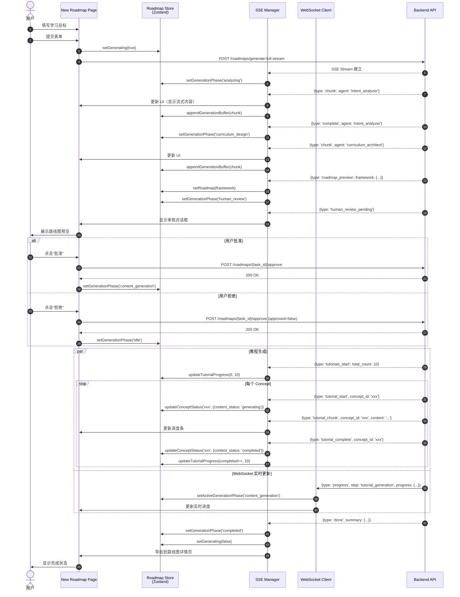
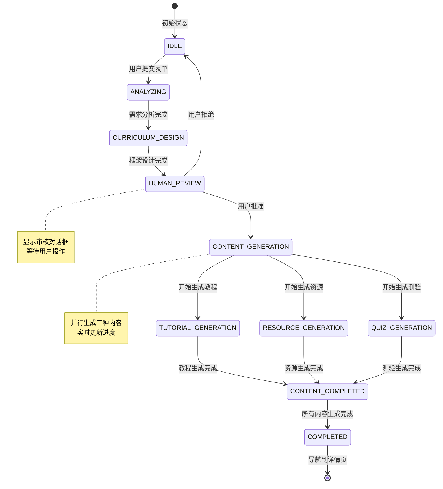

# 前端技术架构文档

## 技术架构概览

### 核心技术栈

| 组件 | 技术选型 | 说明 |
|:---|:---|:---|
| **框架** | Next.js 14 (App Router) | React Server Components + SSR |
| **语言** | TypeScript | 严格类型检查 |
| **UI 组件库** | Shadcn/ui | 基于 Radix UI 的可访问组件 |
| **样式** | Tailwind CSS | 原子化 CSS 框架 |
| **状态管理** | Zustand | 轻量级全局状态管理 |
| **数据获取** | TanStack Query v5 | 服务端状态管理和缓存 |
| **流式通信** | Native EventSource | SSE 客户端实现 |
| **WebSocket** | 原生 WebSocket API | 实时状态更新 |
| **类型生成** | openapi-typescript-codegen | 从 OpenAPI Schema 生成类型 |

### 架构分层

```
┌─────────────────────────────────────────┐
│      Presentation Layer (Pages)          │
│  - App Router Pages                     │
│  - Server Components                    │
│  - Client Components                    │
└─────────────────────────────────────────┘
                    ↓
┌─────────────────────────────────────────┐
│      Component Layer                    │
│  - UI Components (Shadcn/ui)           │
│  - Feature Components                   │
│  - Layout Components                    │
└─────────────────────────────────────────┘
                    ↓
┌─────────────────────────────────────────┐
│      State Management Layer              │
│  - Zustand Stores (Client State)        │
│  - TanStack Query (Server State)       │
└─────────────────────────────────────────┘
                    ↓
┌─────────────────────────────────────────┐
│      API Layer                          │
│  - API Client (Axios)                  │
│  - SSE Manager                          │
│  - WebSocket Client                    │
└─────────────────────────────────────────┘
                    ↓
┌─────────────────────────────────────────┐
│      Type System                        │
│  - Generated Types (OpenAPI)            │
│  - Custom Types                         │
└─────────────────────────────────────────┘
```

---

## 路线图生成状态机

### 状态机时序图



### 状态机状态流转



### 用户流程

```mermaid
graph TB
    START[用户访问 /app/new] --> STEP1[步骤1: 输入学习目标]
    STEP1 --> STEP2[步骤2: 填写偏好设置]
    STEP2 --> SUBMIT[提交表单]
    
    SUBMIT --> SSE[建立 SSE 连接]
    SSE --> ANALYZING[显示: 需求分析中...]
    
    ANALYZING --> DESIGNING[显示: 框架设计中...]
    DESIGNING --> PREVIEW[显示: 路线图预览]
    
    PREVIEW --> REVIEW{用户审核}
    REVIEW -->|批准| GENERATING[显示: 内容生成中...]
    REVIEW -->|拒绝| STEP1
    
    GENERATING --> PROGRESS[显示实时进度]
    PROGRESS --> COMPLETE[生成完成]
    
    COMPLETE --> NAVIGATE[导航到 /app/roadmap/[id]]
    
    style ANALYZING fill:#e3f2fd
    style DESIGNING fill:#e3f2fd
    style GENERATING fill:#e8f5e9
    style COMPLETE fill:#c8e6c9
```

---

## UI/UX 开发规范

### 设计系统：Editorial Cream & Sage

#### 色彩系统

```css
/* 主色调 */
--background: 40 20% 99%;        /* Warm cream 背景 */
--foreground: 24 10% 10%;        /* Charcoal 文本 */
--primary: 24 10% 10%;           /* Charcoal 主色 */
--sage: 140 15% 55%;             /* Sage green 强调色 */

/* 辅助色 */
--muted: 40 10% 94%;             /* 柔和背景 */
--accent: 140 15% 55%;           /* Sage 强调 */
--border: 24 5% 90%;              /* 柔和边框 */
```

#### 字体系统

```typescript
// tailwind.config.ts
fontFamily: {
  serif: ['Playfair Display', 'Georgia', 'serif'],  // 标题字体
  sans: ['Inter', 'system-ui', 'sans-serif'],       // 正文字体
  'sans-sc': ['Noto Sans SC', 'sans-serif'],       // 中文字体
}
```

#### 间距系统

使用 Tailwind 默认间距系统（4px 基准）：
- `space-1` = 4px
- `space-2` = 8px
- `space-4` = 16px
- `space-6` = 24px
- `space-8` = 32px

#### 圆角系统

```typescript
borderRadius: {
  none: '0',
  sm: '0.125rem',    // 2px
  DEFAULT: '0.5rem', // 8px (--radius)
  md: '0.5rem',      // 8px
  lg: '0.75rem',     // 12px
  xl: '1rem',        // 16px
}
```

### 组件开发规范

#### 组件结构

```typescript
'use client';  // 客户端组件标记

import { useState } from 'react';
import { cn } from '@/lib/utils';  // 类名合并工具
import type { ComponentProps } from '@/types';

interface MyComponentProps {
  /** 组件标题 */
  title: string;
  /** 是否禁用 */
  disabled?: boolean;
  /** 自定义类名 */
  className?: string;
}

export function MyComponent({
  title,
  disabled = false,
  className,
}: MyComponentProps) {
  return (
    <div className={cn('base-styles', className)}>
      <h2>{title}</h2>
    </div>
  );
}
```

#### 组件命名规范

- **组件文件**：使用 `kebab-case`（如 `phase-indicator.tsx`）
- **组件名称**：使用 `PascalCase`（如 `PhaseIndicator`）
- **Props 接口**：组件名 + `Props`（如 `PhaseIndicatorProps`）

#### 样式规范

1. **优先使用 Tailwind 工具类**
2. **使用 `cn()` 合并类名**（支持条件类名）
3. **响应式设计**：移动端优先（`md:`, `lg:` 断点）
4. **暗色模式**：使用 `dark:` 前缀

```typescript
<div
  className={cn(
    'base-classes',
    {
      'active-classes': isActive,
      'disabled-classes': disabled,
    },
    className  // 允许外部覆盖
  )}
/>
```

### 布局规范

#### App Layout（三栏布局）

```
┌─────────────────────────────────────────────────┐
│              App Layout                          │
├──────────┬──────────────────────┬────────────────┤
│ Left     │    Main Content      │   Right        │
│ Sidebar  │    (flex-1)          │   Sidebar      │
│ (260px)  │                      │   (350px)      │
│          │                      │                │
│ - Logo   │  ┌────────────────┐  │  - AI Chat    │
│ - Search │  │  Page Content  │  │  - Context    │
│ - Nav    │  │                │  │  - Input     │
│ - Recent │  │                │  │               │
│ - User   │  └────────────────┘  │               │
└──────────┴──────────────────────┴────────────────┘
```

#### 响应式断点

```typescript
// tailwind.config.ts
screens: {
  sm: '640px',   // 移动端
  md: '768px',   // 平板
  lg: '1024px',  // 桌面
  xl: '1280px',  // 大屏
}
```

**响应式策略**：
- 移动端：单栏布局，侧边栏折叠
- 平板：两栏布局（主内容 + 侧边栏）
- 桌面：三栏布局（完整布局）

### 交互规范

#### 加载状态

```typescript
// 使用 Skeleton 组件
<Skeleton className="h-4 w-full" />

// 使用 Loading Spinner
<Loader2 className="w-4 h-4 animate-spin" />

// 使用 Progress Bar
<Progress value={progress} />
```

#### 错误处理

```typescript
// 使用 Error Boundary
<ErrorBoundary fallback={<ErrorFallback />}>
  <Component />
</ErrorBoundary>

// 使用 Toast 提示
import { toast } from 'sonner';
toast.error('操作失败', { description: '错误详情' });
```

#### 表单验证

```typescript
import { useForm } from 'react-hook-form';
import { zodResolver } from '@hookform/resolvers/zod';
import { z } from 'zod';

const schema = z.object({
  learningGoal: z.string().min(1, '请输入学习目标'),
});

const form = useForm({
  resolver: zodResolver(schema),
});
```

### 可访问性（A11y）规范

1. **语义化 HTML**：使用正确的 HTML 标签
2. **ARIA 属性**：为交互元素添加 `aria-label`、`aria-describedby`
3. **键盘导航**：支持 Tab 键导航，Esc 关闭对话框
4. **焦点管理**：对话框打开时聚焦第一个可交互元素
5. **颜色对比度**：文本与背景对比度 ≥ 4.5:1

```typescript
<button
  aria-label="关闭对话框"
  onClick={handleClose}
  className="focus:outline-none focus:ring-2 focus:ring-primary"
>
  <X />
</button>
```

---

## API 集成规范

### 类型生成

#### 生成命令

```bash
# 一次性生成
npm run generate:types

# 监听后端变化（开发模式）
npm run generate:types:watch
```

#### 类型使用

```typescript
// 导入生成的类型
import type {
  RoadmapFramework,
  Concept,
  Tutorial,
  LearningPreferences,
} from '@/types/generated/models';

// 导入生成的 API 服务
import { RoadmapsService } from '@/types/generated/services';

// 使用
const roadmap = await RoadmapsService.getRoadmap({
  roadmapId: 'xxx',
});
```

### API 客户端

#### REST API

```typescript
// lib/api/endpoints.ts
import { RoadmapsService } from '@/types/generated/services';

export async function getRoadmap(roadmapId: string) {
  return RoadmapsService.getRoadmap({ roadmapId });
}
```

#### SSE 流式 API

```typescript
// lib/api/sse.ts
import { SSEManager, createGenerationStream } from '@/lib/api/sse';

const manager = createGenerationStream(
  {
    user_request: {
      user_id: 'xxx',
      session_id: 'xxx',
      preferences: { ... },
    },
  },
  {
    onEvent: (event) => {
      // 处理事件
    },
    onComplete: () => {
      // 完成回调
    },
    onError: (error) => {
      // 错误处理
    },
  }
);
```

#### WebSocket API

```typescript
// lib/api/websocket.ts
import { TaskWebSocket } from '@/lib/api/websocket';

const ws = new TaskWebSocket(taskId, {
  onProgress: (event) => {
    // 更新进度
  },
  onConceptStart: (event) => {
    // Concept 开始生成
  },
  onConceptComplete: (event) => {
    // Concept 生成完成
  },
});
```

### 数据获取模式

#### 使用 TanStack Query

```typescript
// lib/hooks/use-roadmap.ts
import { useQuery } from '@tanstack/react-query';
import { getRoadmap } from '@/lib/api/endpoints';

export function useRoadmap(roadmapId: string | undefined) {
  return useQuery({
    queryKey: ['roadmap', roadmapId],
    queryFn: () => getRoadmap(roadmapId!),
    enabled: !!roadmapId,
    staleTime: 5 * 60 * 1000, // 5 分钟
  });
}
```

#### 使用 Zustand Store

```typescript
// lib/store/roadmap-store.ts
import { create } from 'zustand';
import type { RoadmapFramework } from '@/types';

interface RoadmapStore {
  currentRoadmap: RoadmapFramework | null;
  setRoadmap: (roadmap: RoadmapFramework) => void;
}

export const useRoadmapStore = create<RoadmapStore>((set) => ({
  currentRoadmap: null,
  setRoadmap: (roadmap) => set({ currentRoadmap: roadmap }),
}));
```

---

## 目录结构

```
frontend-next/
├── AGENT.md                    # 本文档
├── app/                        # Next.js App Router
│   ├── layout.tsx             # 根布局
│   ├── page.tsx               # Landing 页
│   └── app/                   # 应用路由组
│       ├── layout.tsx         # App Layout
│       ├── new/               # 创建路线图
│       │   └── page.tsx
│       └── roadmap/[id]/      # 路线图详情
│           └── page.tsx
├── components/                # React 组件
│   ├── ui/                   # Shadcn/ui 组件
│   ├── layout/               # 布局组件
│   ├── roadmap/              # 路线图组件
│   ├── tutorial/             # 教程组件
│   └── chat/                 # 聊天组件
├── lib/                      # 工具库
│   ├── api/                  # API 客户端
│   │   ├── client.ts
│   │   ├── endpoints.ts
│   │   ├── sse.ts
│   │   └── websocket.ts
│   ├── store/                # Zustand Stores
│   │   ├── roadmap-store.ts
│   │   ├── chat-store.ts
│   │   └── ui-store.ts
│   └── hooks/                # 自定义 Hooks
│       ├── use-roadmap.ts
│       └── use-sse.ts
├── types/                    # TypeScript 类型
│   ├── generated/           # 自动生成（OpenAPI）
│   └── custom/              # 自定义类型
└── scripts/                  # 脚本
    └── generate-types.ts    # 类型生成脚本
```

---

## 开发规范

### 代码规范

#### TypeScript 配置

```json
{
  "compilerOptions": {
    "strict": true,
    "noUnusedLocals": true,
    "noUnusedParameters": true,
    "noImplicitReturns": true,
  }
}
```

#### ESLint 配置

- 使用 Next.js 默认 ESLint 配置
- 添加 `@typescript-eslint/recommended` 规则
- 使用 Prettier 格式化代码

#### 文件命名

- **组件文件**：`kebab-case.tsx`（如 `phase-indicator.tsx`）
- **工具文件**：`kebab-case.ts`（如 `use-roadmap.ts`）
- **类型文件**：`kebab-case.ts`（如 `phases.ts`）

### 性能优化

#### 代码分割

```typescript
// 动态导入组件
import dynamic from 'next/dynamic';

const HeavyComponent = dynamic(() => import('./HeavyComponent'), {
  loading: () => <Skeleton />,
  ssr: false,  // 禁用 SSR（如需要）
});
```

#### 图片优化

```typescript
import Image from 'next/image';

<Image
  src="/image.jpg"
  alt="描述"
  width={800}
  height={600}
  priority  // 首屏图片
  placeholder="blur"  // 模糊占位符
/>
```

#### 状态优化

- 使用 `useMemo` 缓存计算结果
- 使用 `useCallback` 缓存函数引用
- 避免在渲染中创建新对象/数组

### 测试规范

#### 单元测试

```typescript
// __tests__/components/PhaseIndicator.test.tsx
import { render, screen } from '@testing-library/react';
import { PhaseIndicator } from '@/components/roadmap/phase-indicator';

describe('PhaseIndicator', () => {
  it('should render current phase', () => {
    render(<PhaseIndicator currentPhase="analyzing" />);
    expect(screen.getByText('需求分析')).toBeInTheDocument();
  });
});
```

#### E2E 测试

```typescript
// e2e/roadmap-generation.spec.ts
import { test, expect } from '@playwright/test';

test('should generate roadmap', async ({ page }) => {
  await page.goto('/app/new');
  await page.fill('[name="learningGoal"]', '学习 React');
  await page.click('button[type="submit"]');
  await expect(page.locator('text=生成完成')).toBeVisible();
});
```

---

## 常见问题

### Q: 如何添加新的 API 端点？

1. 后端添加端点后，运行 `npm run generate:types`
2. 在 `lib/api/endpoints.ts` 中添加封装函数
3. 在 `lib/hooks/` 中创建对应的 Hook（如需要）

### Q: 如何处理 SSE 流式数据？

使用 `SSEManager` 类：

```typescript
import { createGenerationStream } from '@/lib/api/sse';

const manager = createGenerationStream(request, {
  onEvent: (event) => {
    if (event.type === 'chunk') {
      // 处理流式内容
    }
  },
});
```

### Q: 如何实现暗色模式？

使用 `next-themes`：

```typescript
import { ThemeProvider } from 'next-themes';

<ThemeProvider attribute="class" defaultTheme="light">
  {children}
</ThemeProvider>
```

### Q: 如何优化首屏加载时间？

1. 使用 Next.js Image 组件优化图片
2. 代码分割，按需加载组件
3. 使用 `loading="lazy"` 延迟加载非关键内容
4. 启用 Next.js 自动优化（压缩、缓存）

---

**文档版本**：v1.0.0  
**最后更新**：2025-01-XX  
**维护者**：Frontend Team

