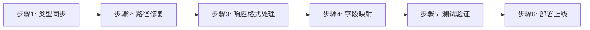

# 前端API适配修复计划

**发布日期**: 2026-01-20  
**影响范围**: 6大业务模块，51个接口，72.5%需要修复  
**预估工作量**: 2-3天

---

## 一、修复流程概览



---

## 二、前期准备（必须先执行）

### 2.1 同步后端类型定义

运行类型生成脚本,获取最新的后端Schema:

```bash
cd frontend-next
npm run generate:all
```

**执行内容**:
- 从后端 `/openapi.json` 拉取最新Schema
- 生成 TypeScript 类型定义到 `lib/api/types/`
- 更新API client接口

**验证**:
```bash
# 检查生成的文件是否有更新
git status
git diff lib/api/types/
```

---

## 三、高优先级修复（阻塞性问题）

### 3.1 用户模块路径修复

**文件**: `frontend-next/lib/api/endpoints/users.ts`

#### 修改1: 获取用户画像

```typescript
// ❌ 旧代码
export const getUserProfile = async (userId: string) => {
  const { data } = await apiClient.get<UserProfileResponse>(
    `/users/${userId}/profile`
  );
  return data;
};

// ✅ 新代码
export const getUserProfile = async () => {
  const { data } = await apiClient.get<UserProfileResponse>(
    '/users/profile'
  );
  return data;
};
```

#### 修改2: 更新用户画像

```typescript
// ❌ 旧代码
export const updateUserProfile = async (
  userId: string,
  profile: UserProfileRequest
) => {
  const { data } = await apiClient.put<UserProfileResponse>(
    `/users/${userId}/profile`,
    profile
  );
  return data;
};

// ✅ 新代码
export const updateUserProfile = async (profile: UserProfileRequest) => {
  const { data } = await apiClient.put<UserProfileResponse>(
    '/users/profile',
    profile
  );
  return data;
};
```

---

### 3.2 路线图模块路径修复

**文件**: `frontend-next/lib/api/endpoints/roadmaps.ts`

#### 修改1: 获取我的路线图

```typescript
// ❌ 旧代码
export const getUserRoadmaps = async (userId: string, params?: {
  status?: string;
  limit?: number;
  offset?: number;
}) => {
  const { data } = await apiClient.get(`/roadmaps/users/${userId}`, { params });
  return {
    items: data.roadmaps,  // 字段映射
    total: data.total,
    in_progress_count: data.in_progress_count,
  };
};

// ✅ 新代码
export const getMyRoadmaps = async (params?: {
  status?: string;
  limit?: number;
  offset?: number;
}) => {
  const { data } = await apiClient.get('/roadmaps/my', { params });
  return {
    items: data.roadmaps,
    total: data.total,
    in_progress_count: data.in_progress_count,
  };
};
```

#### 修改2: 获取回收站

```typescript
// ❌ 旧代码
export const getUserTrash = async (userId: string) => {
  const { data } = await apiClient.get(`/roadmaps/users/${userId}/trash`);
  return {
    items: data.roadmaps,
    total: data.total,
  };
};

// ✅ 新代码
export const getMyTrash = async (params?: {
  limit?: number;
  offset?: number;
}) => {
  const { data } = await apiClient.get('/roadmaps/trash', { params });
  return {
    items: data.roadmaps,
    total: data.total,
  };
};
```

#### 修改3: 路线图状态查询

```typescript
// ❌ 旧代码
export const getRoadmapStatus = async (roadmapId: string) => {
  const { data } = await apiClient.get(`/roadmaps/${roadmapId}/status-check`);
  return data;
};

// ✅ 新代码（简单状态）
export const getRoadmapStatus = async (roadmapId: string) => {
  const { data } = await apiClient.get(`/roadmaps/${roadmapId}/status`);
  return data;
};

// ✅ 新增（详细状态）
export const getRoadmapStatusQuick = async (roadmapId: string) => {
  const { data } = await apiClient.get(`/roadmaps/${roadmapId}/status/quick`);
  return data;
};
```

#### 修改4: 编辑记录（taskId → roadmapId）

```typescript
// ❌ 旧代码
export const getEditRecords = async (taskId: string) => {
  const { data } = await apiClient.get(`/roadmaps/${taskId}/edit-records`);
  return data;
};

export const getLatestEditRecord = async (taskId: string) => {
  const { data } = await apiClient.get(`/roadmaps/${taskId}/edit-records/latest`);
  return data;
};

// ✅ 新代码
export const getEditRecords = async (roadmapId: string) => {
  const { data } = await apiClient.get(`/roadmaps/${roadmapId}/edit-records`);
  return data;
};

export const getLatestEditRecord = async (roadmapId: string) => {
  const { data } = await apiClient.get(`/roadmaps/${roadmapId}/edit-records/latest`);
  return data;
};
```

#### 修改5: 验证记录（taskId → roadmapId）

```typescript
// ❌ 旧代码
export const getValidationRecords = async (taskId: string) => {
  const { data } = await apiClient.get(`/roadmaps/${taskId}/validation-records`);
  return data;
};

export const getLatestValidationRecord = async (taskId: string) => {
  const { data } = await apiClient.get(`/roadmaps/${taskId}/validation-records/latest`);
  return data;
};

export const getRoadmapComparison = async (taskId: string) => {
  const { data } = await apiClient.get(`/roadmaps/${taskId}/roadmap-comparison`);
  return data;
};

// ✅ 新代码
export const getValidationRecords = async (roadmapId: string) => {
  const { data } = await apiClient.get(`/roadmaps/${roadmapId}/validation-records`);
  return data;
};

export const getLatestValidationRecord = async (roadmapId: string) => {
  const { data } = await apiClient.get(`/roadmaps/${roadmapId}/validation-records/latest`);
  return data;
};

export const getRoadmapComparison = async (roadmapId: string) => {
  const { data } = await apiClient.get(`/roadmaps/${roadmapId}/comparison`);
  return data;
};
```

#### 修改6: 封面图路径

```typescript
// ❌ 旧代码
export const generateCoverImage = async (roadmapId: string) => {
  const { data } = await apiClient.post(
    `/roadmaps/roadmap/${roadmapId}/cover-image/generate`
  );
  return data;
};

// ✅ 新代码
export const generateCoverImage = async (roadmapId: string) => {
  const { data } = await apiClient.post(
    `/roadmaps/${roadmapId}/cover-image/generate`
  );
  return data;
};
```

---

### 3.3 任务模块路径修复

**文件**: `frontend-next/lib/api/endpoints/tasks.ts`

#### 修改1: 获取我的任务

```typescript
// ❌ 旧代码
export const getUserTasks = async (
  userId: string,
  params?: {
    status?: string;
    limit?: number;
    offset?: number;
  }
) => {
  const { data } = await apiClient.get(`/tasks/users/${userId}`, { params });
  return data;
};

// ✅ 新代码
export const getMyTasks = async (params?: {
  status?: string;
  limit?: number;
  offset?: number;
}) => {
  const { data } = await apiClient.get('/tasks/my', { params });
  return data;
};
```

#### 修改2: 获取任务详情

```typescript
// ❌ 旧代码
export const getTaskDetail = async (taskId: string) => {
  const { data } = await apiClient.get(`/tasks/${taskId}`);
  return data;
};

// ✅ 新代码
export const getTaskDetail = async (taskId: string) => {
  const { data } = await apiClient.get(`/tasks/${taskId}/status`);
  return data;
};
```

---

### 3.4 内容模块路径修复

**文件**: `frontend-next/lib/api/endpoints/content.ts`

#### 修改1: 学习资源路径

```typescript
// ❌ 旧代码
export const getResources = async (roadmapId: string, conceptId: string) => {
  const { data } = await apiClient.get(
    `/roadmaps/${roadmapId}/concepts/${conceptId}/resources`
  );
  return data;
};

// ✅ 新代码
export const getResources = async (roadmapId: string, conceptId: string) => {
  const { data } = await apiClient.get(
    `/content/${roadmapId}/concepts/${conceptId}/resources`
  );
  return data;
};
```

#### 修改2: 测验题目路径

```typescript
// ❌ 旧代码
export const getQuiz = async (roadmapId: string, conceptId: string) => {
  const { data } = await apiClient.get(
    `/roadmaps/${roadmapId}/concepts/${conceptId}/quiz`
  );
  return data;
};

// ✅ 新代码
export const getQuiz = async (roadmapId: string, conceptId: string) => {
  const { data } = await apiClient.get(
    `/content/${roadmapId}/concepts/${conceptId}/quiz`
  );
  return data;
};
```

#### 修改3: 内容修改路径

```typescript
// ❌ 旧代码
export const modifyTutorial = async (
  roadmapId: string,
  conceptId: string,
  request: ModifyContentRequest
) => {
  const { data } = await apiClient.post(
    `/roadmaps/${roadmapId}/concepts/${conceptId}/tutorial/modify`,
    request
  );
  return data;
};

// ✅ 新代码
export const modifyTutorial = async (
  roadmapId: string,
  conceptId: string,
  request: ModifyContentRequest
) => {
  const { data } = await apiClient.post(
    `/content/${roadmapId}/concepts/${conceptId}/tutorial/modify`,
    request
  );
  return data;
};
```

#### 修改4: 教程版本列表路径

```typescript
// ❌ 旧代码
export const getTutorialVersions = async (
  roadmapId: string,
  conceptId: string
) => {
  const { data } = await apiClient.get(
    `/content/tutorials/${roadmapId}/${conceptId}/versions`
  );
  return data;
};

// ✅ 新代码
export const getTutorialVersions = async (
  roadmapId: string,
  conceptId: string
) => {
  const { data } = await apiClient.get(
    `/content/${roadmapId}/concepts/${conceptId}/tutorials`
  );
  return data;
};
```

#### 修改5: 重新生成教程路径

```typescript
// ❌ 旧代码
export const regenerateTutorial = async (
  roadmapId: string,
  conceptId: string,
  reason?: string
) => {
  const { data } = await apiClient.post(
    `/content/tutorials/${roadmapId}/${conceptId}/regenerate`,
    { reason }
  );
  return data;
};

// ✅ 新代码
export const regenerateTutorial = async (
  roadmapId: string,
  conceptId: string,
  request: RetryContentRequest
) => {
  const { data } = await apiClient.post(
    `/content/${roadmapId}/concepts/${conceptId}/tutorial/regenerate`,
    request
  );
  return data;
};
```

---

### 3.5 管理员模块路径修复

**文件**: `frontend-next/lib/api/endpoints/admin.ts`

#### 修改1: 邀请用户

```typescript
// ❌ 旧代码
export const inviteUser = async (email: string) => {
  const { data } = await apiClient.post('/admin/invite-user', { email });
  return data;
};

// ✅ 新代码
export const inviteUser = async (email: string) => {
  const { data } = await apiClient.post('/admin/users/invite', { email });
  return data;
};
```

#### 修改2: 创建超级管理员

```typescript
// ❌ 旧代码
export const createSuperuser = async (request: CreateSuperuserRequest) => {
  const { data } = await apiClient.post('/admin/create-superuser', request);
  return data;
};

// ✅ 新代码
export const createSuperuser = async (request: CreateSuperuserRequest) => {
  const { data } = await apiClient.post('/admin/users/superuser', request);
  return data;
};
```

#### 修改3: Tavily Keys管理

```typescript
// ❌ 旧代码
export const getTavilyKeys = async () => {
  const { data } = await apiClient.get('/admin/tavily-keys');
  return data;
};

export const addTavilyKeys = async (request: BatchAddTavilyKeysRequest) => {
  const { data } = await apiClient.post('/admin/tavily-keys/batch', request);
  return data;
};

export const deleteTavilyKeys = async (request: BatchDeleteTavilyKeysRequest) => {
  const { data } = await apiClient.post('/admin/tavily-keys/batch-delete', request);
  return data;
};

// ✅ 新代码
export const getTavilyKeys = async () => {
  const { data } = await apiClient.get('/admin/tavily/keys');
  return data;
};

export const addTavilyKeys = async (request: BatchAddTavilyKeysRequest) => {
  const { data } = await apiClient.post('/admin/tavily/keys/batch', request);
  return data;
};

export const deleteTavilyKeys = async (request: BatchDeleteTavilyKeysRequest) => {
  const { data } = await apiClient.post('/admin/tavily/keys/batch-delete', request);
  return data;
};

export const updateTavilyKeys = async (request: BatchUpdateTavilyKeysRequest) => {
  const { data } = await apiClient.post('/admin/tavily/keys/batch-update', request);
  return data;
};

export const refreshTavilyQuota = async () => {
  const { data } = await apiClient.post('/admin/tavily/keys/refresh-quota');
  return data;
};
```

---

## 四、中优先级修复（功能性问题）

### 4.1 响应格式统一处理

**问题**: 后端使用 `ResponseSchemaModel` 包装,前端期望直接返回数据

**解决方案**: API拦截器已处理,无需修改

**验证代码**: `frontend-next/lib/api/client.ts`

```typescript
// 已有的拦截器代码（无需修改）
apiClient.interceptors.response.use(
  (response) => {
    const { data } = response;
    
    // 统一响应格式处理
    if (data && typeof data === 'object' && 'code' in data && 'data' in data) {
      const apiResponse = data as APIResponse<any>;
      
      // 验证业务状态码
      if (apiResponse.code !== 200) {
        throw new Error(apiResponse.msg || 'Request failed');
      }
      
      // 自动提取data字段
      response.data = apiResponse.data;
      return response;
    }
    
    return response;
  },
  (error) => {
    return Promise.reject(error);
  }
);
```

---

### 4.2 新增字段处理

#### 修改1: 登出所有设备 - 新增 `devices_count`

**文件**: `frontend-next/lib/api/endpoints/auth.ts`

```typescript
// 更新类型定义
interface LogoutAllDevicesResponse {
  message: string;
  user_id: string;
  devices_count: number;  // ✅ 新增字段
}

export const logoutAllDevices = async () => {
  const { data } = await apiClient.post<LogoutAllDevicesResponse>(
    '/auth/logout-all-devices'
  );
  return data;
};
```

#### 修改2: 黑名单统计 - 字段名变更

**文件**: `frontend-next/lib/api/endpoints/auth.ts`

```typescript
// ❌ 旧类型
interface BlacklistStatsResponse {
  total_tokens: number;
  active_tokens: number;
  expired_tokens: number;
}

// ✅ 新类型（字段名已更新）
interface BlacklistStatsResponse {
  total_tokens: number;
  active_tokens: number;    // 替代 sample_tokens
  expired_tokens: number;   // 新增
}
```

#### 修改3: Waitlist - 新增 `position`

**文件**: `frontend-next/lib/api/endpoints/admin.ts` 或公开接口文件

```typescript
// 更新类型定义
interface WaitlistJoinResponse {
  success: boolean;
  message: string;
  is_new: boolean;
  position: number;  // ✅ 新增字段：在候补名单中的位置
}

export const joinWaitlist = async (email: string, source?: string) => {
  const { data } = await apiClient.post<WaitlistJoinResponse>(
    '/waitlist',
    { email, source }
  );
  return data;
};
```

---

### 4.3 删除无效接口调用

**以下接口后端不存在,需要移除或替换**:

#### 移除1: 内容重试接口

```typescript
// ❌ 移除以下接口（后端不存在）
export const retryTutorial = async (roadmapId: string, conceptId: string) => {
  const { data } = await apiClient.post(
    `/content/tutorials/${roadmapId}/${conceptId}/retry`
  );
  return data;
};

export const retryResources = async (roadmapId: string, conceptId: string) => {
  const { data } = await apiClient.post(
    `/content/resources/${roadmapId}/${conceptId}/retry`
  );
  return data;
};

export const retryQuiz = async (roadmapId: string, conceptId: string) => {
  const { data } = await apiClient.post(
    `/content/quizzes/${roadmapId}/${conceptId}/retry`
  );
  return data;
};

// ✅ 改用 regenerate 接口替代
// 使用上面修改5中的 regenerateTutorial 等接口
```

#### 移除2: 批量重试失败内容

```typescript
// ❌ 移除（后端不存在）
export const retryFailedContent = async (roadmapId: string) => {
  const { data } = await apiClient.post(
    `/content/roadmaps/${roadmapId}/retry-failed`
  );
  return data;
};

// ✅ 替代方案：由前端控制逐个重试
```

---

## 五、组件层面修复

### 5.1 更新Hook调用

**文件**: `frontend-next/hooks/use-user.ts`

```typescript
// ❌ 旧代码
export const useUserProfile = (userId: string) => {
  return useQuery({
    queryKey: ['user-profile', userId],
    queryFn: () => getUserProfile(userId),
  });
};

// ✅ 新代码（移除userId参数）
export const useUserProfile = () => {
  return useQuery({
    queryKey: ['user-profile'],
    queryFn: () => getUserProfile(),
  });
};
```

---

### 5.2 更新组件调用

**示例**: 路线图列表组件

```typescript
// ❌ 旧代码
const RoadmapList = () => {
  const { user } = useAuth();
  const { data } = useQuery({
    queryKey: ['roadmaps', user?.id],
    queryFn: () => getUserRoadmaps(user!.id),
  });
  // ...
};

// ✅ 新代码
const RoadmapList = () => {
  const { data } = useQuery({
    queryKey: ['roadmaps'],
    queryFn: () => getMyRoadmaps(),
  });
  // ...
};
```

---

### 5.3 更新编辑记录相关组件

**需要修改的地方**: 将 `taskId` 改为 `roadmapId`

```typescript
// ❌ 旧代码
const EditHistory = ({ taskId }: { taskId: string }) => {
  const { data } = useQuery({
    queryKey: ['edit-records', taskId],
    queryFn: () => getEditRecords(taskId),
  });
  // ...
};

// ✅ 新代码
const EditHistory = ({ roadmapId }: { roadmapId: string }) => {
  const { data } = useQuery({
    queryKey: ['edit-records', roadmapId],
    queryFn: () => getEditRecords(roadmapId),
  });
  // ...
};
```

---

## 六、测试验证清单

### 6.1 单元测试

```bash
# 运行单元测试
npm run test

# 运行特定测试
npm run test -- users.test.ts
npm run test -- roadmaps.test.ts
```

---

### 6.2 手动测试清单

- [ ] **用户模块**
  - [ ] 获取用户画像（无userId参数）
  - [ ] 更新用户画像（无userId参数）

- [ ] **路线图模块**
  - [ ] 获取我的路线图（/roadmaps/my）
  - [ ] 获取回收站（/roadmaps/trash）
  - [ ] 获取路线图状态（/roadmaps/{id}/status）
  - [ ] 编辑记录查询（使用roadmapId）
  - [ ] 验证记录查询（使用roadmapId）
  - [ ] 版本对比（/roadmaps/{id}/comparison）
  - [ ] 封面图生成（/roadmaps/{id}/cover-image/generate）

- [ ] **任务模块**
  - [ ] 获取我的任务（/tasks/my）
  - [ ] 获取任务详情（/tasks/{id}/status）
  - [ ] 取消任务
  - [ ] 重试任务
  - [ ] 人工审核

- [ ] **内容模块**
  - [ ] 获取教程（/content/...）
  - [ ] 获取资源（/content/...）
  - [ ] 获取测验（/content/...）
  - [ ] 修改教程（/content/...）
  - [ ] 重新生成教程

- [ ] **管理员模块**
  - [ ] 邀请用户（/admin/users/invite）
  - [ ] 创建超级管理员（/admin/users/superuser）
  - [ ] Tavily Keys管理（/admin/tavily/keys）

- [ ] **新增字段验证**
  - [ ] 登出所有设备返回 `devices_count`
  - [ ] 黑名单统计返回 `active_tokens` 和 `expired_tokens`
  - [ ] Waitlist加入返回 `position`

---

## 七、批量替换脚本

使用以下VSCode正则表达式批量替换:

### 7.1 用户画像

```regex
查找: /users/\$\{[^}]+\}/profile
替换: /users/profile
```

### 7.2 路线图列表

```regex
查找: /roadmaps/users/\$\{[^}]+\}(?!/trash)
替换: /roadmaps/my

查找: /roadmaps/users/\$\{[^}]+\}/trash
替换: /roadmaps/trash
```

### 7.3 任务列表

```regex
查找: /tasks/users/\$\{[^}]+\}
替换: /tasks/my
```

### 7.4 编辑记录

```regex
查找: taskId(?=.*edit-records)
替换: roadmapId

查找: taskId(?=.*validation-records)
替换: roadmapId
```

### 7.5 管理员接口

```regex
查找: /admin/invite-user
替换: /admin/users/invite

查找: /admin/create-superuser
替换: /admin/users/superuser

查找: /admin/tavily-keys
替换: /admin/tavily/keys
```

### 7.6 内容路径

```regex
查找: /roadmaps/\$\{([^}]+)\}/concepts/\$\{([^}]+)\}/(resources|quiz)
替换: /content/${$1}/concepts/${$2}/$3

查找: /roadmaps/\$\{([^}]+)\}/concepts/\$\{([^}]+)\}/tutorial/modify
替换: /content/${$1}/concepts/${$2}/tutorial/modify
```

---

## 八、回滚方案

如果出现问题需要回滚:

### 方案1: Git回滚

```bash
# 查看最近的提交
git log --oneline -5

# 回滚到之前的版本
git revert <commit-hash>

# 重新部署
npm run build
```

### 方案2: 保留旧版本接口适配层

在API client中添加兼容层:

```typescript
// lib/api/compat.ts
export const getUserProfileCompat = async (userId?: string) => {
  // 兼容旧版本调用
  if (userId) {
    console.warn('userId参数已废弃,将自动从JWT提取');
  }
  return getUserProfile();
};
```

---

## 九、部署计划

### 9.1 开发环境

1. 执行修复步骤
2. 本地测试验证
3. 提交代码到开发分支

### 9.2 测试环境

1. 合并到test分支
2. 自动部署到测试环境
3. QA团队验证

### 9.3 生产环境

1. 合并到main分支
2. 创建发布tag
3. 部署到生产环境
4. 灰度发布验证

---

## 十、时间估算

| 阶段 | 预估时间 | 说明 |
|-----|---------|------|
| 类型同步 | 0.5小时 | 运行脚本 |
| 路径修复 | 4小时 | 6个模块,20个接口 |
| 字段处理 | 2小时 | 新增字段、类型更新 |
| 组件修复 | 3小时 | Hook、组件调用更新 |
| 测试验证 | 4小时 | 单元测试、手动测试 |
| 文档更新 | 1小时 | 更新API文档 |
| **总计** | **14.5小时** | **约2天工作量** |

---

## 十一、注意事项

### ⚠️ 破坏性变更

以下接口必须同步修改,否则会报404错误:
- 用户画像接口（2个）
- 路线图列表接口（2个）
- 任务列表接口（1个）
- 编辑记录接口（5个）
- 管理员接口（7个）

### ⚠️ 变量名替换

需要全局搜索并替换:
- 编辑记录相关: `taskId` → `roadmapId`
- 验证记录相关: `taskId` → `roadmapId`
- 函数参数: 移除不必要的 `userId`

### ⚠️ 类型定义

确保使用最新生成的类型定义:
- 不要手动修改 `lib/api/types/` 下的文件
- 所有类型更新都通过 `npm run generate:all` 同步

---

## 十二、FAQ

### Q1: 为什么要先运行 `npm run generate:all`?

**A**: 该脚本从后端 `/openapi.json` 拉取最新Schema并生成TypeScript类型,确保前端类型定义与后端完全一致。

### Q2: 响应格式变更后,前端需要修改吗?

**A**: 不需要。API拦截器已自动处理 `ResponseSchemaModel` 格式,自动提取 `data` 字段。

### Q3: 旧代码中使用 `userId` 参数怎么办?

**A**: 移除该参数,后端会自动从JWT Token中提取 `user_id`。

### Q4: 如果后端接口还未上线怎么办?

**A**: 可以在API client中添加环境变量判断,根据环境使用新旧接口。

---

**文档结束**
