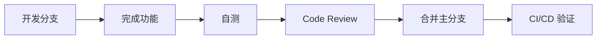

# 前端重构快速开始指南

> 5 分钟快速了解重构计划并开始执行

---

## 📖 文档导航

本次重构包含以下核心文档：

| 文档 | 用途 | 阅读时间 |
|:---|:---|:---:|
| **REFACTORING_PLAN.md** | 详细的重构理论、架构设计、实施计划 | 30分钟 |
| **REFACTORING_CHECKLIST.md** | 可执行的任务清单，跟踪进度 | 5分钟 |
| **CONFIG_UPDATES.md** | 配置文件更新指南 | 10分钟 |
| **QUICK_START.md** | 快速开始指南（本文档） | 5分钟 |

---

## 🎯 重构目标（3 句话总结）

1. **API 完全对齐**：前端 API 调用与后端 `FRONTEND_API_GUIDE.md` 100% 匹配
2. **补全缺失模块**：创建完整的 `lib/` 目录（API、Store、Hooks）
3. **提升代码质量**：TypeScript 严格模式 + 80% 测试覆盖 + 性能优化

---

## 🏗️ 重构架构（一图看懂）

```
┌─────────────────────────────────────────────────────┐
│                    页面组件层                         │
│  (app/*/page.tsx - 使用 Hooks，不直接调用 API)      │
└────────────┬────────────────────────────────────────┘
             │
┌────────────┴────────────────────────────────────────┐
│                  自定义 Hooks 层                      │
│  (lib/hooks/* - WebSocket Hooks, API Hooks, SSE)   │
└────────────┬────────────────────────────────────────┘
             │
┌────────────┴────────────────────────────────────────┐
│              API 客户端层 + 状态管理层                │
│  WebSocket (路线图) │ REST API │ SSE (聊天)         │
│  lib/api/websocket │ lib/api/endpoints │ lib/api/sse│
│              + lib/store/* (Zustand)                │
└────────────┬────────────────────────────────────────┘
             │
┌────────────┴────────────────────────────────────────┐
│                   后端 API                            │
│  WebSocket (/ws/{task_id})                         │
│  REST API (/api/v1/*)                              │
│  SSE (聊天流式接口)                                  │
└─────────────────────────────────────────────────────┘
```

**核心原则**：
- ✅ 页面组件 → Hooks → API 客户端 → 后端（单向数据流）
- ❌ 页面组件直接调用 API（违反关注点分离）

**实时通信方案**：
- 🔴 **路线图生成**：WebSocket（主） + 轮询（降级）
  - 支持人工审核、状态持久化、页面刷新后恢复
- 🟡 **AI 聊天**：SSE
  - 流式输出、逐字显示

---

## 🚀 快速开始（20 分钟）

### Step 1: 阅读后端 API 文档（5 分钟）

```bash
# 打开后端 API 文档
open backend/docs/FRONTEND_API_GUIDE.md
```

**重点关注**：
- API 端点定义（Section 3）
- 状态枚举（Section 4）
- **WebSocket 事件类型**（Section 6 - 实时通知协议）
- SSE 事件类型（Section 6 - AI 聊天场景）

---

### Step 2: 安装依赖（3 分钟）

```bash
cd frontend-next

# 安装新依赖
npm install @microsoft/fetch-event-source
npm install -D vitest @testing-library/react @playwright/test msw

# 初始化 Husky
npx husky install
```

---

### Step 3: 创建基础目录（2 分钟）

```bash
# 创建 lib/ 核心目录
mkdir -p lib/{api,store,hooks,utils,constants,schemas}
mkdir -p lib/api/{endpoints,websocket,polling,sse,interceptors}
mkdir -p lib/hooks/{api,websocket,sse,ui}
mkdir -p lib/store/middleware

# 创建测试目录
mkdir -p __tests__/{unit,integration,e2e}
mkdir -p __tests__/unit/{api,store,hooks,utils}

# 创建文档目录
mkdir -p docs
```

---

### Step 4: 配置文件（5 分钟）

参考 `CONFIG_UPDATES.md`：

1. **更新 package.json**
   ```bash
   # 添加 scripts
   npm pkg set scripts.test="vitest"
   npm pkg set scripts.test:e2e="playwright test"
   npm pkg set scripts.check:types="tsx scripts/check-types.ts"
   ```

2. **创建测试配置**
   ```bash
   # 从 CONFIG_UPDATES.md 复制
   cp CONFIG_UPDATES.md vitest.config.ts  # 手动创建
   cp CONFIG_UPDATES.md playwright.config.ts
   ```

3. **创建环境变量**
   ```bash
   cp .env.example .env.local
   # 编辑 .env.local 配置本地环境
   ```

---

### Step 5: 开始第一个任务（5 分钟）

从最简单的任务开始：

```bash
# 1. 创建工具函数
touch lib/utils/cn.ts
```

```typescript
// lib/utils/cn.ts
import { type ClassValue, clsx } from 'clsx';
import { twMerge } from 'tailwind-merge';

export function cn(...inputs: ClassValue[]) {
  return twMerge(clsx(inputs));
}
```

```bash
# 2. 创建常量文件
touch lib/constants/status.ts
```

```typescript
// lib/constants/status.ts
export enum TaskStatus {
  PENDING = 'pending',
  PROCESSING = 'processing',
  HUMAN_REVIEW_PENDING = 'human_review_pending',
  COMPLETED = 'completed',
  PARTIAL_FAILURE = 'partial_failure',
  FAILED = 'failed',
}

export enum ContentStatus {
  PENDING = 'pending',
  GENERATING = 'generating',
  COMPLETED = 'completed',
  FAILED = 'failed',
}

// ... 更多枚举
```

✅ 恭喜！你已经完成了第一个任务。

---

## 📋 执行流程（推荐顺序）

### Phase 1: 基础设施（第 1-3 天）

**优先级**：🔴 P0（阻塞后续开发）

```bash
# 按照以下顺序执行
1. 创建目录结构 ✓
2. 实现 API 客户端
   - lib/api/client.ts
   - lib/api/interceptors/*
   - lib/api/endpoints/*
3. 🔴 实现 WebSocket 客户端（路线图生成 - 优先）
   - lib/api/websocket/roadmap-ws.ts
   - lib/api/polling/task-polling.ts（降级方案）
4. 🟡 实现 SSE 客户端（AI 聊天 - 后续）
   - lib/api/sse/client.ts
   - lib/api/sse/chat-sse.ts
5. 实现 Zustand Stores
   - lib/store/roadmap-store.ts
   - lib/store/chat-store.ts
   - lib/store/ui-store.ts
```

**里程碑检查**：
- [ ] API 客户端可以调用后端 API
- [ ] WebSocket 客户端可以接收路线图生成事件
- [ ] 轮询降级方案可用
- [ ] Store 可以管理全局状态
- [ ] SSE 客户端可用于 AI 聊天（可选）

---

### Phase 2: API 集成（第 4-6 天）

**优先级**：🔴 P0（类型安全）

```bash
1. 更新类型生成脚本
2. 同步枚举和常量
3. 实现 Zod Schema 验证
4. 更新 SSE 事件类型
```

**里程碑检查**：
- [ ] 类型与后端 100% 同步
- [ ] 枚举值完全对齐
- [ ] 运行时验证可用

---

### Phase 3: React Hooks（第 7-9 天）

**优先级**：🟡 P1（开发体验）

```bash
1. 实现 API Hooks
   - use-roadmap.ts
   - use-roadmap-generation.ts
   - use-task-status.ts
2. 🔴 实现 WebSocket Hooks（路线图生成）
   - use-roadmap-generation-ws.ts（WebSocket + 轮询混合策略）
3. 🟡 实现 SSE Hooks（AI 聊天）
   - use-chat-stream.ts
4. 实现 UI Hooks
   - use-debounce.ts
   - use-media-query.ts
```

**里程碑检查**：
- [ ] 所有 API 操作有对应的 Hook
- [ ] WebSocket 流式监听有对应的 Hook（路线图生成）
- [ ] 轮询降级策略集成到 Hook
- [ ] SSE 流式监听有对应的 Hook（AI 聊天）
- [ ] 组件可以使用 Hooks 而不是直接调用 API

---

### Phase 4: 组件重构（第 10-14 天）

**优先级**：🟡 P1（功能实现）

```bash
1. 重构页面组件
   - app/(app)/new/page.tsx
   - app/(app)/roadmap/[id]/page.tsx
2. 重构功能组件
   - components/roadmap/*
   - components/tutorial/*
3. 优化布局组件
   - components/layout/*
```

**里程碑检查**：
- [ ] 所有页面使用新的 Hooks
- [ ] 所有组件不直接调用 API
- [ ] 用户体验优化（加载状态、错误处理）

---

### Phase 5: 测试（第 15-17 天）

**优先级**：🟢 P2（质量保证）

```bash
1. 单元测试（API, Store, Hooks）
2. 集成测试（完整流程）
3. E2E 测试（用户场景）
```

**里程碑检查**：
- [ ] 单元测试覆盖率 ≥ 80%
- [ ] 集成测试覆盖核心流程
- [ ] E2E 测试覆盖主要用户场景

---

### Phase 6: 文档与优化（第 18-20 天）

**优先级**：🟢 P2（长期维护）

```bash
1. 更新文档
2. 性能优化
3. 开发体验优化
```

---

## 🎯 每日目标（示例）

### Day 1: API 客户端

- [ ] 创建 `lib/api/client.ts`
- [ ] 创建 `lib/api/interceptors/auth.ts`
- [ ] 创建 `lib/api/interceptors/error.ts`
- [ ] 测试 API 客户端基础配置

### Day 2: API 端点封装

- [ ] 创建 `lib/api/endpoints/roadmaps.ts`
- [ ] 创建 `lib/api/endpoints/content.ts`
- [ ] 创建 `lib/api/endpoints/users.ts`
- [ ] 测试所有端点

### Day 3: WebSocket 客户端（路线图生成）

- [ ] 创建 `lib/api/websocket/roadmap-ws.ts`
- [ ] 创建 `lib/api/polling/task-polling.ts`（降级方案）
- [ ] 测试 WebSocket 连接、事件、心跳、重连
- [ ] 测试降级到轮询

---

## 🤝 团队协作

### 任务分配建议

| 开发者 | 主要职责 | 任务 |
|:---:|:---|:---|
| **A** | API 层 | Phase 1.2, 1.3 |
| **B** | Store 层 | Phase 1.4, 2.x |
| **C** | Hooks 层 | Phase 3.x |
| **D** | 组件层 | Phase 4.x |
| **E** | 测试 | Phase 5.x |

### 协作流程



---

## ✅ 验收标准（简化版）

### 必须满足（M1-M6）

- [ ] **功能完整性**：所有功能正常
- [ ] **API 对齐**：与后端文档 100% 匹配
- [ ] **类型安全**：TypeScript strict mode 无错误
- [ ] **测试覆盖**：≥ 80%
- [ ] **性能达标**：首屏 < 2 秒

### 可选优化

- [ ] Storybook 组件库
- [ ] Service Worker 离线支持
- [ ] 性能监控（Sentry）
- [ ] 国际化（i18n）

---

## 🆘 常见问题

### Q1: lib/ 目录不存在怎么办？

**A**: 参考 Step 3 创建基础目录结构。

### Q2: 类型生成失败？

**A**: 确保后端服务运行，然后执行：
```bash
npm run generate:types
```

### Q3: 测试无法运行？

**A**: 检查配置文件：
```bash
# 验证 vitest 配置
npx vitest --version

# 验证 playwright 配置
npx playwright --version
```

### Q4: 如何跟踪进度？

**A**: 使用 `REFACTORING_CHECKLIST.md`，完成后将 `[ ]` 改为 `[x]`。

### Q5: 遇到技术难题？

**A**: 
1. 查看 `REFACTORING_PLAN.md` 的详细说明
2. 查看后端 `FRONTEND_API_GUIDE.md`
3. 咨询团队成员
4. 在 Slack #frontend-refactoring 提问

---

## 📚 推荐学习资源

### 核心技术

- [TanStack Query](https://tanstack.com/query/latest) - 数据获取和缓存
- [Zustand](https://docs.pmnd.rs/zustand) - 状态管理
- [Zod](https://zod.dev/) - 运行时验证
- [Vitest](https://vitest.dev/) - 单元测试

### 最佳实践

- [React 官方文档](https://react.dev/) - Hooks 最佳实践
- [Next.js 文档](https://nextjs.org/docs) - App Router 指南
- [TypeScript Handbook](https://www.typescriptlang.org/docs/) - 类型系统

---

## 🎉 下一步

1. ✅ 阅读完本文档
2. 📖 阅读 `REFACTORING_PLAN.md`（可选，深入了解）
3. 📋 打开 `REFACTORING_CHECKLIST.md` 开始执行
4. ⚙️ 参考 `CONFIG_UPDATES.md` 配置环境
5. 💻 开始编码！

---

**祝你重构顺利！** 🚀

如有问题，请联系：
- **Slack**: #frontend-refactoring
- **Email**: frontend-team@example.com

---

**最后更新**: 2025-12-06  
**维护者**: Frontend Team
